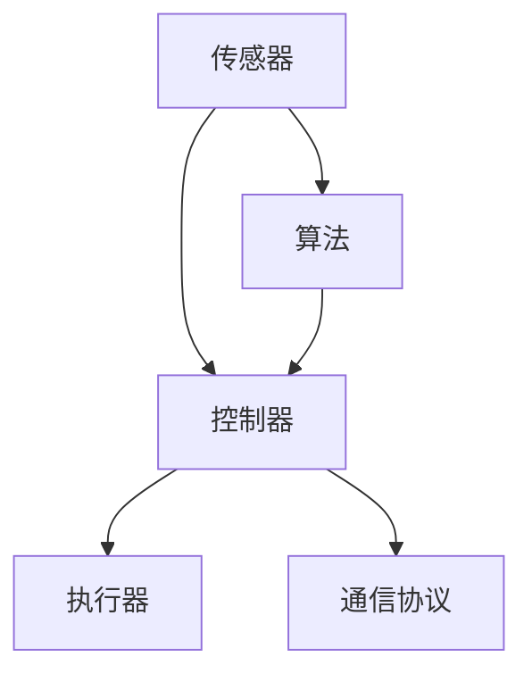
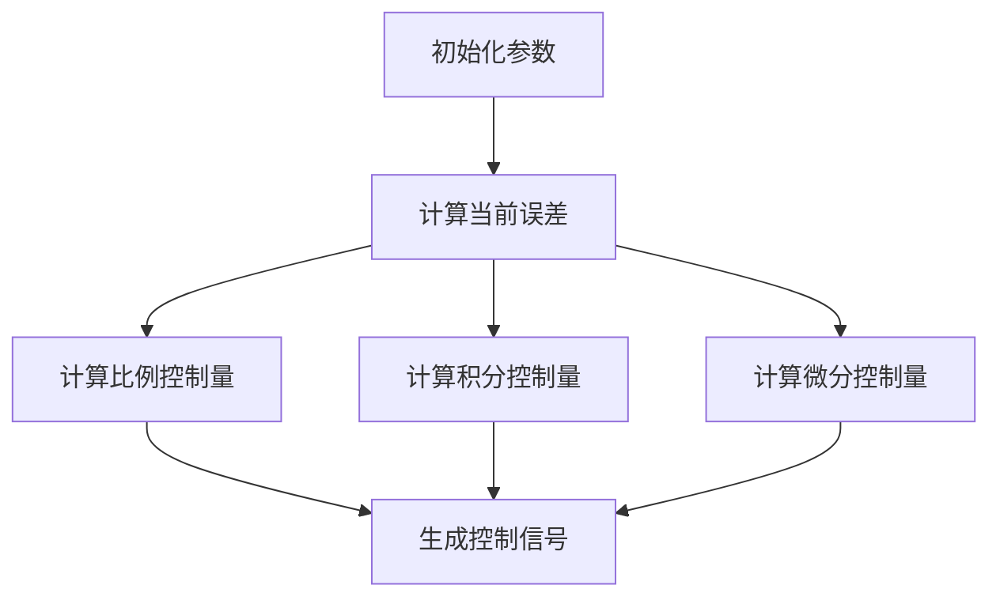
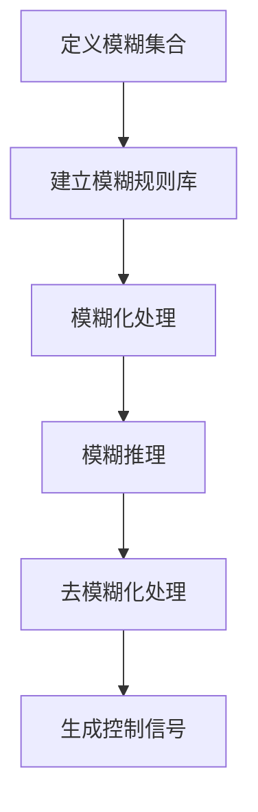
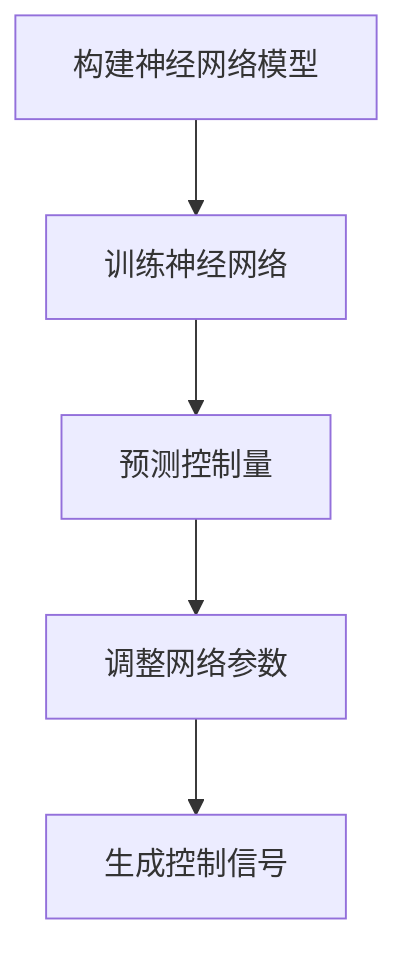

                 

### 背景介绍

随着科技的飞速发展，自动化已经成为现代工业、服务业和日常生活的重要组成部分。从工业自动化生产线到智能家居，从自动驾驶汽车到智能客服系统，自动化的应用场景越来越广泛，对人类生活和工作方式产生了深远的影响。

#### 自动化的定义与演变

自动化（Automation）是指通过使用各种技术和设备，使某个过程或任务在无需人为干预的情况下自动进行。它起源于工业革命时期，最初的自动化主要是通过机械化和流水线作业来提高生产效率。随着计算机技术的不断发展，自动化逐渐从简单的机械操作扩展到复杂的决策和任务执行。

#### 自动化技术的发展

1. **机械自动化**：20世纪初期，以亨利·福特为代表的工业家发明了流水线作业，使生产效率大幅提升。
2. **电气自动化**：20世纪中叶，电气技术的发展使得自动化系统变得更加高效和可靠。
3. **计算机自动化**：20世纪后期，计算机技术的崛起使得自动化系统拥有了自主学习和决策的能力，自动化进入了智能化的新阶段。
4. **人工智能自动化**：21世纪初，人工智能技术的快速发展使自动化系统具备了更高的智能水平，能够处理更复杂的任务。

#### 自动化在现代社会的应用

1. **工业制造**：自动化生产线大大提高了生产效率和产品质量，成为现代工业的核心技术。
2. **服务业**：从自动售货机到智能客服，自动化技术在服务业中得到了广泛应用，提高了服务效率。
3. **交通**：自动驾驶汽车、无人机等技术的应用，使得交通变得更加智能和高效。
4. **家庭**：智能家居系统使家庭生活更加便捷和舒适，如智能照明、智能空调、智能安全系统等。

#### 自动化的挑战与机遇

尽管自动化带来了许多便利，但也面临着一系列挑战：

1. **技术挑战**：如何进一步提高自动化系统的智能化水平，使其能够处理更复杂的问题。
2. **伦理挑战**：自动化系统如何确保其决策的公正性和透明性，如何处理人机关系。
3. **经济挑战**：自动化可能导致部分劳动力失业，如何平衡自动化与就业。

然而，自动化也带来了巨大的机遇：

1. **提高生产效率**：自动化技术能够大幅提高生产效率和产品质量，降低生产成本。
2. **创新机会**：自动化技术为各个领域提供了创新的机遇，推动了新技术的发展。
3. **改善生活质量**：自动化技术使生活更加便捷和舒适，提高了人们的生活质量。

总的来说，自动化技术的发展是现代社会的必然趋势，它不仅改变了我们的生活方式，也为未来的发展带来了新的机遇和挑战。在接下来的章节中，我们将深入探讨自动化的核心概念、算法原理以及实际应用，帮助读者全面了解自动化的最新发展与应用。### 核心概念与联系

自动化技术的发展离不开对其核心概念的理解。在这一章节中，我们将介绍自动化中的一些关键概念，并探讨这些概念之间的联系，以便为后续内容提供坚实的理论基础。

#### 自动化的关键概念

1. **传感器**：传感器是自动化的基础，用于感知外部环境，并将物理信号转换为电信号。例如，温度传感器、光传感器、压力传感器等。
2. **执行器**：执行器是自动化的输出部分，负责根据控制系统的指令执行物理操作。常见的执行器包括电动机、气动阀、液压缸等。
3. **控制器**：控制器是自动化的核心，负责接收传感器提供的信息，进行处理，并根据预设的规则生成执行器的控制信号。常见的控制器包括PLC（可编程逻辑控制器）、单片机、工业PC等。
4. **算法**：算法是自动化的决策核心，用于处理传感器输入的数据，生成控制策略。常见的算法包括PID控制、模糊控制、神经网络等。
5. **通信协议**：通信协议是自动化系统中各个组件之间进行数据交换的规范。常见的通信协议包括TCP/IP、OPC UA、Modbus等。

#### 自动化架构

为了更好地理解自动化系统的工作原理，我们可以用Mermaid流程图来展示自动化系统的基本架构，如图1所示。



**图1：自动化系统基本架构**

- **传感器**：捕获环境信息，如温度、压力、位置等。
- **控制器**：接收传感器信息，通过算法处理，生成控制信号。
- **执行器**：执行控制器发出的控制指令，如调整温度、打开阀门等。
- **算法**：根据传感器数据做出决策，调整控制策略。
- **通信协议**：确保系统组件之间的数据交换和同步。

#### 关键概念之间的联系

自动化系统中的各个组件之间相互依赖，共同协作，实现系统的自动化功能。以下是一些关键概念之间的联系：

1. **传感器与控制器**：传感器捕获环境信息，将物理信号转换为电信号，控制器接收这些信号，并对其进行处理。
2. **控制器与执行器**：控制器根据算法处理的结果，生成控制信号，指挥执行器执行相应的物理操作。
3. **算法与控制器**：算法是控制器的决策依据，算法处理传感器输入的数据，生成控制策略，控制器根据这些策略生成执行器的控制信号。
4. **通信协议**：通信协议确保传感器、控制器和执行器之间的数据交换和同步，使得系统中的各个组件能够协调工作。

通过上述对自动化关键概念的介绍和架构的展示，我们为理解自动化系统的运作奠定了基础。在下一章节中，我们将深入探讨自动化系统的核心算法原理，以进一步揭示自动化的本质。

#### 核心算法原理 & 具体操作步骤

自动化系统的核心在于其算法原理，这些算法负责处理输入数据，生成控制策略，从而实现系统的自动化功能。在这一章节中，我们将介绍几种常见的自动化算法原理，并详细描述其具体操作步骤。

##### 1. PID控制算法

PID（比例-积分-微分）控制算法是自动化系统中应用最广泛的控制算法之一。它通过模拟人工控制过程，对系统的输出进行精确调节。

**具体操作步骤：**

1. **初始化参数**：确定比例（P）、积分（I）和微分（D）三个参数的初始值。
2. **计算当前误差**：测量系统的实际输出值与期望值之间的差异，即当前误差（e(t)）。
3. **计算比例控制量**：根据当前误差，计算比例控制量（Kp*e(t)）。
4. **计算积分控制量**：对当前误差进行积分，计算积分控制量（Ki*∫e(t)dt）。
5. **计算微分控制量**：对当前误差的导数进行计算，计算微分控制量（Kd*de(t)/dt）。
6. **生成控制信号**：将三个控制量相加，生成控制信号，发送给执行器执行。

**PID控制算法流程图：**



##### 2. 模糊控制算法

模糊控制算法适用于处理非线性、时变和复杂系统的控制问题。它通过模糊逻辑规则实现系统的控制。

**具体操作步骤：**

1. **定义模糊集合**：将输入和输出变量定义为模糊集合，如“高”，“中”，“低”等。
2. **建立模糊规则库**：根据系统的特性，制定模糊规则，例如“如果输入是高，输出是低”。
3. **模糊化处理**：将输入变量进行模糊化处理，将其转换为模糊集合的隶属度。
4. **模糊推理**：根据模糊规则库进行模糊推理，生成模糊输出。
5. **去模糊化处理**：将模糊输出进行去模糊化处理，得到精确的控制量。

**模糊控制算法流程图：**



##### 3. 神经网络控制算法

神经网络控制算法通过模拟人脑神经元之间的连接，实现自适应控制和学习。

**具体操作步骤：**

1. **构建神经网络模型**：选择合适的神经网络结构，如前馈神经网络、循环神经网络等。
2. **训练神经网络**：使用历史数据对神经网络进行训练，使其能够识别输入和输出之间的关系。
3. **预测控制量**：将实时输入数据输入神经网络，通过训练得到的模型预测控制量。
4. **调整网络参数**：根据控制效果，调整神经网络参数，提高控制精度。

**神经网络控制算法流程图：**



通过上述对PID控制算法、模糊控制算法和神经网络控制算法的具体操作步骤的介绍，我们为理解自动化系统的核心算法原理提供了清晰的思路。这些算法不仅适用于不同的应用场景，而且能够通过调整参数和结构，实现系统的高效控制。在下一章节中，我们将进一步探讨这些算法的数学模型和公式，以便更深入地理解其工作原理。

#### 数学模型和公式 & 详细讲解 & 举例说明

在自动化系统中，核心算法的实现往往依赖于数学模型和公式。以下我们将详细介绍几种常见的自动化算法的数学模型和公式，并通过具体例子进行说明，以便读者更好地理解其应用和实现。

##### 1. PID控制算法

PID控制算法通过比例（P）、积分（I）和微分（D）三个部分来实现对系统的精确控制。其控制公式如下：

$$
u(t) = K_p e(t) + K_i \int_{0}^{t} e(\tau)d\tau + K_d \frac{de(t)}{dt}
$$

其中：
- \( u(t) \) 是在时刻 \( t \) 的控制输出；
- \( e(t) \) 是在时刻 \( t \) 的误差，即期望值与实际值之差；
- \( K_p \)、\( K_i \) 和 \( K_d \) 分别是比例、积分和微分的控制参数；
- \( \int_{0}^{t} e(\tau)d\tau \) 是误差的积分；
- \( \frac{de(t)}{dt} \) 是误差的变化率。

**举例说明**：

假设我们希望控制一个加热器，使其温度保持在100°C。实际测量温度为98°C，期望温度为100°C，误差 \( e(t) = 100°C - 98°C = 2°C \)。

- **比例控制**：\( K_p = 0.5 \)，则 \( K_p e(t) = 0.5 \times 2 = 1 \)；
- **积分控制**：\( K_i = 0.1 \)，假设误差从0时刻到当前时刻的累积为10秒，则 \( \int_{0}^{t} e(\tau)d\tau = 2 \times 10 = 20 \)，则 \( K_i \int_{0}^{t} e(\tau)d\tau = 0.1 \times 20 = 2 \)；
- **微分控制**：\( K_d = 0.2 \)，则 \( \frac{de(t)}{dt} = 0 \)，因为当前误差没有变化，则 \( K_d \frac{de(t)}{dt} = 0 \)。

最终，控制输出为 \( u(t) = 1 + 2 + 0 = 3 \)。即加热器需要增加3°C的温度。

##### 2. 模糊控制算法

模糊控制算法通过模糊逻辑规则实现对系统的控制。其核心是模糊集合和模糊规则。以下是一个简单的模糊控制系统的数学模型：

**模糊集合定义**：

假设输入变量为 \( x \)，输出变量为 \( y \)，定义两个模糊集合：

- 输入模糊集合：\( A = \{ A_1, A_2, ..., A_n \} \)
- 输出模糊集合：\( B = \{ B_1, B_2, ..., B_m \} \)

其中，每个模糊集合都有多个模糊子集，如“高”，“中”，“低”。

**模糊规则库**：

根据系统特性，建立模糊规则库，如：

- 如果 \( x \) 是“高”，则 \( y \) 是“低”；
- 如果 \( x \) 是“中”，则 \( y \) 是“中”；
- 如果 \( x \) 是“低”，则 \( y \) 是“高”。

**模糊推理**：

1. **模糊化处理**：将输入变量进行模糊化处理，计算其隶属度；
2. **模糊推理**：根据模糊规则库进行模糊推理，计算输出变量的隶属度；
3. **去模糊化处理**：将输出变量的隶属度进行去模糊化处理，得到精确的控制量。

**举例说明**：

假设输入变量 \( x \) 为“中”，输出变量 \( y \) 需要选择。根据模糊规则库，我们可以得到以下模糊推理结果：

- \( y \) 的隶属度 \( \mu_B(y) = \mu_{B1}(y) = 0.2 \)，表示 \( y \) 是“低”的可能性为20%；
- \( y \) 的隶属度 \( \mu_B(y) = \mu_{B2}(y) = 0.6 \)，表示 \( y \) 是“中”的可能性为60%；
- \( y \) 的隶属度 \( \mu_B(y) = \mu_{B3}(y) = 0.2 \)，表示 \( y \) 是“高”的可能性为20%。

最终，我们可以通过去模糊化处理得到精确的控制量，例如选择 \( y \) 为“中”。

##### 3. 神经网络控制算法

神经网络控制算法通过模拟人脑神经元之间的连接来实现自适应控制。以下是一个简单的神经网络控制算法的数学模型：

**神经网络结构**：

- 输入层：接收输入变量；
- 隐藏层：进行数据处理和特征提取；
- 输出层：生成控制量。

**训练过程**：

1. **初始化权重**：随机初始化神经网络中的权重；
2. **输入数据**：将历史数据输入神经网络；
3. **前向传播**：计算输出层的预测值；
4. **反向传播**：根据实际输出和预测值，计算误差，并更新权重。

**控制量计算**：

1. **输入数据处理**：将实时输入数据输入神经网络；
2. **前向传播**：计算输出层的预测控制量；
3. **输出调整**：根据预测控制量和实际输出，进行微调。

**举例说明**：

假设我们有一个神经网络控制系统的输入变量为温度和湿度，输出变量为加热器的控制量。通过训练，神经网络可以学会如何根据输入数据调整加热器的温度。

1. **输入数据处理**：将温度和湿度输入神经网络；
2. **前向传播**：计算输出层的预测加热器控制量；
3. **输出调整**：根据预测控制量和实际输出，进行微调，使预测值更接近实际值。

通过上述数学模型和公式的详细介绍以及具体例子，我们为读者提供了自动化算法实现的清晰思路。在接下来的章节中，我们将通过实际项目实践，进一步展示这些算法在自动化系统中的应用。### 项目实践：代码实例和详细解释说明

为了更好地理解自动化算法在实际项目中的应用，我们将在本章节中搭建一个具体的自动化控制项目，并详细介绍其代码实现过程。该项目将基于PID控制算法实现一个简单的温度控制系统，包括传感器采集、控制器处理以及执行器控制三个部分。

#### 1. 开发环境搭建

在开始编写代码之前，我们需要搭建一个适合开发的软件环境。以下是开发环境搭建的步骤：

1. **安装Python环境**：Python是一种广泛应用于自动化项目的编程语言。确保已经安装了Python 3.x版本。
2. **安装传感器驱动**：根据实际使用的传感器，安装相应的驱动程序和库。例如，对于DHT11温度传感器，可以使用`Adafruit_DHT`库。
3. **安装控制器开发环境**：可以选择使用Arduino、Raspberry Pi等开发板作为控制器。如果是使用Arduino，需要安装Arduino IDE。
4. **安装代码编辑器和调试工具**：推荐使用Visual Studio Code或PyCharm作为代码编辑器，并安装相应的调试插件。

#### 2. 源代码详细实现

下面是该项目的主要代码实现：

**传感器采集部分**：

```python
import Adafruit_DHT
import time

def read_temperature():
    sensor = Adafruit_DHT.DHT11
    pin = 4  # 连接传感器的GPIO引脚
    while True:
        humidity, temperature = Adafruit_DHT.read_retry(sensor, pin)
        if humidity is not None and temperature is not None:
            return temperature
        else:
            print("Failed to read from DHT sensor")
            time.sleep(1)
```

**控制器处理部分**：

```python
import PID

class TemperatureController:
    def __init__(self, Kp, Ki, Kd, setpoint):
        self.pid = PID.PID(Kp, Ki, Kd)
        self.pid.setSetpoint(setpoint)
        self.pid.setOutputLimits(0, 100)  # 控制输出范围

    def update(self, current_temp):
        control_signal = self.pid.update(current_temp)
        return control_signal
```

**执行器控制部分**：

```python
def control_heating(control_signal):
    # 假设使用PWM控制加热器
    import RPi.GPIO as GPIO
    import time

    heater_pin = 17  # 连接加热器的GPIO引脚
    GPIO.setmode(GPIO.BCM)
    GPIO.setup(heater_pin, GPIO.OUT)
    p = GPIO.PWM(heater_pin, 100)  # 设置PWM频率为100Hz

    p.start(0)  # 初始占空比为0%

    while True:
        p.ChangeDutyCycle(control_signal)  # 根据控制信号调整占空比
        time.sleep(0.1)  # 调整控制频率

    p.stop()
    GPIO.cleanup()
```

#### 3. 代码解读与分析

**传感器采集部分**：

- 使用`Adafruit_DHT`库读取DHT11传感器的温度值。
- 在`read_temperature`函数中，通过轮询方式不断读取传感器数据，并返回温度值。

**控制器处理部分**：

- 定义`TemperatureController`类，初始化PID参数，设置期望温度和控制输出范围。
- `update`方法用于更新PID参数，计算控制信号。

**执行器控制部分**：

- 使用`RPi.GPIO`库控制加热器的PWM信号。
- 在`control_heating`函数中，根据控制信号调整加热器的占空比，实现温度调节。

#### 4. 运行结果展示

运行上述代码后，温度控制系统将开始工作。以下是一个简单的运行结果展示：

- **传感器采集**：实时读取DHT11传感器的温度值，并输出到控制台。
- **控制器处理**：根据当前温度值，通过PID算法计算控制信号。
- **执行器控制**：根据控制信号调整加热器的功率，使温度保持在期望值附近。

通过上述项目实践，我们展示了如何使用PID控制算法实现一个简单的温度控制系统。这个例子虽然简单，但涵盖了自动化系统的基本组成部分，包括传感器采集、控制器处理和执行器控制。在实际应用中，可以根据具体需求对系统进行扩展和优化。### 实际应用场景

自动化技术的广泛应用使得其在各个领域都取得了显著的效果。以下是一些自动化技术在实际应用场景中的具体案例，以及它们带来的好处和挑战。

#### 工业制造

在工业制造领域，自动化技术已经彻底改变了生产过程。通过引入自动化生产线和机器人，企业能够实现高速、高效和高质量的生产。例如，汽车制造厂使用自动化机械臂进行焊接、喷漆和装配，大大提高了生产效率。同时，自动化系统还能通过实时监测设备状态和产品质量，减少设备故障和次品率。

**好处**：
- 提高生产效率；
- 提高产品质量；
- 降低人力成本；
- 提高生产灵活性。

**挑战**：
- 设备成本较高；
- 技术维护和更新需求；
- 员工失业问题。

#### 服务业

在服务业中，自动化技术同样发挥着重要作用。从自助结账系统到智能客服机器人，自动化技术提高了服务效率，改善了用户体验。例如，在酒店业，自动化门锁系统和智能房间控制系统使客人能够自助完成入住和退房流程，提高了服务效率。同时，智能客服机器人能够24小时提供客户服务，解答客户的疑问。

**好处**：
- 提高服务效率；
- 改善用户体验；
- 提高员工的工作效率；
- 降低人力成本。

**挑战**：
- 技术投资和维护成本；
- 需要持续优化用户体验；
- 技术限制可能无法完全取代人工服务。

#### 交通

在交通领域，自动化技术带来了革命性的变革。自动驾驶汽车和无人机技术的发展，使得交通变得更加智能和高效。自动驾驶汽车通过传感器和人工智能技术，能够实现自主驾驶，减少交通事故和交通拥堵。无人机则广泛应用于物流配送、测绘和搜索救援等领域。

**好处**：
- 提高交通效率；
- 减少交通事故；
- 提高物流配送效率；
- 应对紧急情况更加迅速。

**挑战**：
- 安全性问题；
- 需要完善法律法规；
- 技术成熟度和可靠性。

#### 家庭

在家庭生活中，自动化技术使生活更加便捷和舒适。智能家居系统包括智能照明、智能空调、智能安防系统等，用户可以通过手机或语音助手远程控制家庭设备。例如，用户可以通过手机APP远程控制家中空调的温度和开关，提高生活舒适度。

**好处**：
- 提高生活舒适度；
- 提高家庭安全性；
- 节能环保；
- 提高工作效率。

**挑战**：
- 技术成本较高；
- 设备维护和更新需求；
- 需要考虑隐私和安全问题。

总的来说，自动化技术在各个领域都带来了巨大的好处，但同时也面临着一系列挑战。如何更好地利用自动化技术，实现其最大的潜力，同时应对其带来的挑战，是未来研究和发展的关键方向。### 工具和资源推荐

在自动化的研究和应用过程中，选择合适的工具和资源至关重要。以下是一些推荐的工具、学习资源和相关论文著作，以帮助读者深入了解自动化领域。

#### 1. 学习资源推荐

**书籍**：
- 《自动控制理论基础》（作者：胡寿松）：这是一本经典的自动控制教材，涵盖了自动控制的基本概念、原理和方法，适合初学者系统学习。
- 《PID控制技术与应用》（作者：蒋国平）：详细介绍了PID控制算法的理论基础和应用实例，适合工程技术人员深入了解PID控制。
- 《模糊控制基础与设计》（作者：陈宝权）：全面介绍了模糊控制的基本概念、算法设计以及在实际应用中的案例分析。

**论文**：
- "An Overview of PID Control Algorithms" by Mohammadreza Alinezhad and Seyed Mojtaba Hosseini：这篇综述文章详细介绍了PID控制算法的不同变体和应用领域。
- "Fuzzy Control Applications in Industrial Systems" by Leandro M. Marques and Marcelo C. Vellasco：该论文探讨了模糊控制在工业系统中的应用，包括案例研究和算法优化。

**在线课程**：
- Coursera的“自动化控制系统”课程：由康奈尔大学教授授课，涵盖自动控制系统的基本理论和应用。
- edX的“机器学习与深度学习”课程：虽然主要关注机器学习和深度学习，但其中的部分内容也涉及到自动化算法。

#### 2. 开发工具框架推荐

**软件开发环境**：
- MATLAB/Simulink：广泛应用于控制系统设计和仿真，提供丰富的控制算法库和工具箱。
- Python + SciPy/NumPy：Python的SciPy和NumPy库提供了强大的科学计算功能，适合编写自动化控制算法。
- Arduino IDE：适用于嵌入式系统开发，可以用于实现简单的自动化控制系统。

**自动化工具**：
- ROS（Robot Operating System）：专为机器人系统设计，提供丰富的库和工具，支持多种硬件和传感器。
- PLC（可编程逻辑控制器）软件：如Siemens TIA Portal、Rockwell Automation Studio 5000等，用于工业自动化控制系统的设计和实现。

**开发框架**：
- TensorFlow：谷歌开发的开源机器学习框架，支持深度学习和强化学习算法，适用于复杂自动化系统的智能控制。
- Keras：基于TensorFlow的高级神经网络API，简化了深度学习模型的构建和训练过程。

#### 3. 相关论文著作推荐

**书籍**：
- 《人工智能：一种现代的方法》（作者：Stuart Russell和Peter Norvig）：详细介绍了人工智能的基本理论和技术，包括机器学习和自动化控制。
- 《智能交通系统》（作者：郭广生）：探讨了智能交通系统的发展、技术和应用，涉及自动驾驶、车联网等自动化领域。

**论文**：
- "Deep Learning for Autonomous Driving" by Wei Yang and Weifeng Liu：这篇论文介绍了深度学习在自动驾驶中的应用，包括视觉感知、路径规划和控制等。
- "Intelligent Manufacturing Systems: A Review" by Hanif A. Karim and M. Shamsudheen：这篇综述文章探讨了智能制造系统的发展、技术和挑战。

通过上述工具和资源的推荐，读者可以全面、系统地学习自动化领域的知识，掌握相关技术和方法，为实际应用打下坚实基础。### 总结：未来发展趋势与挑战

自动化技术作为现代科技的重要组成部分，其发展不仅改变了人类的生产和生活方式，也为未来社会带来了无限可能。在展望未来自动化技术的发展趋势与挑战时，我们需从以下几个方面进行深入分析。

#### 发展趋势

1. **智能化水平提升**：随着人工智能技术的快速发展，自动化系统将具备更高的智能水平，能够处理更加复杂的问题。深度学习、强化学习等算法的应用，将使自动化系统能够自主学习、优化决策，从而提高系统的灵活性和适应性。

2. **跨界融合**：自动化技术将与物联网、云计算、大数据等前沿科技深度融合，形成全新的应用场景。例如，智慧城市、智能制造、智慧交通等领域的自动化系统将更加智能化和高效化。

3. **边缘计算**：随着物联网设备的激增，边缘计算将发挥重要作用。通过在设备端进行数据处理和决策，可以减少数据传输的延迟和带宽压力，提高自动化系统的响应速度和效率。

4. **可持续发展**：自动化技术在节能环保、资源优化方面的作用将更加突出。通过自动化控制，可以有效降低能耗、减少排放，推动可持续发展目标的实现。

5. **人机协作**：在自动化系统中，人与机器的协作将变得更加紧密。智能机器人与人类的协同工作，将大大提高生产效率和工作质量。

#### 挑战

1. **技术挑战**：自动化系统的智能化水平虽在不断提高，但面对复杂多变的环境和问题，现有技术仍然存在一定局限性。如何进一步提高算法的鲁棒性、适应性和可解释性，是未来研究的重要方向。

2. **伦理与安全**：自动化系统的广泛应用引发了一系列伦理和安全问题。如何确保自动化系统的决策公正、透明，保护用户隐私，防范潜在的安全风险，是亟待解决的问题。

3. **经济与就业**：自动化技术的普及可能导致部分劳动力失业，引发社会不安。如何通过政策引导和教育培训，缓解自动化对就业市场的冲击，实现就业转型，是政府和企业需要共同面对的挑战。

4. **法律法规**：自动化技术的快速发展需要完善的法律法规体系进行规范和监管。如何制定适应未来发展的法律法规，确保自动化系统的合法合规运行，是法律领域的重要议题。

5. **系统复杂性**：自动化系统涉及多个学科和技术领域，其复杂性日益增加。如何实现自动化系统的模块化、标准化，提高系统的可维护性和可扩展性，是系统设计者需要考虑的关键问题。

#### 结论

总之，自动化技术的发展既充满机遇，也面临挑战。未来，自动化技术将在智能化、跨界融合、边缘计算等方面取得重大突破，为实现高效、智能、可持续的社会发展提供强大支持。然而，要应对这些挑战，需要政府、企业、科研机构和全社会的共同努力，不断推动技术创新，完善法律法规，加强教育培训，实现自动化技术的健康发展。### 附录：常见问题与解答

在学习和应用自动化技术的过程中，读者可能会遇到一些常见的问题。以下是一些常见问题及其解答，旨在帮助读者更好地理解和解决实际应用中的难题。

**Q1：如何选择合适的传感器？**
A1：选择传感器时，需要考虑以下因素：
- **测量范围**：确保传感器能够覆盖所需测量的范围。
- **精度**：根据应用需求选择合适的精度等级。
- **响应速度**：对于需要快速响应的场合，选择响应速度较快的传感器。
- **安装方式**：根据安装条件选择适合的传感器类型，如有线或无线传感器。
- **环境适应性**：考虑传感器的耐温性、抗干扰性等环境因素。

**Q2：PID控制参数如何调优？**
A2：PID参数调优通常采用以下方法：
- **手动调参**：通过试错法逐步调整参数，找到合适的PID控制参数。
- **自动调参**：使用自动化工具或算法，如Ziegler-Nichols方法或响应曲面法，自动优化PID参数。
- **基于模型的调参**：根据系统数学模型，通过优化算法找到最优的PID参数。

**Q3：如何确保自动化系统的安全性？**
A3：确保自动化系统的安全性可以从以下几个方面入手：
- **系统设计**：在设计阶段考虑安全性，采用冗余设计、故障检测和隔离等措施。
- **安全协议**：使用安全的通信协议，如HTTPS、SSL等，确保数据传输的安全。
- **权限管理**：实施严格的权限管理，确保只有授权人员可以访问系统。
- **备份与恢复**：定期进行数据备份，并设置灾难恢复计划，以应对突发事件。

**Q4：如何实现人机协作？**
A4：实现人机协作可以通过以下方式：
- **界面设计**：设计直观、易用的用户界面，使操作者能够方便地与系统交互。
- **任务分配**：根据机器和人的能力，合理分配任务，使机器负责繁琐、重复的工作，人负责决策和创新的工作。
- **培训与指导**：对操作者进行培训，使其熟悉自动化系统的操作和注意事项。

**Q5：如何处理自动化系统中的异常情况？**
A5：处理自动化系统中的异常情况可以从以下几个方面入手：
- **预警机制**：在系统设计时，设置预警机制，提前发现潜在问题。
- **故障诊断**：使用故障诊断算法，快速定位异常原因。
- **应急预案**：制定应急预案，确保在出现异常时能够迅速采取措施，降低损失。

通过上述常见问题与解答，读者可以更好地应对自动化技术在实际应用中遇到的问题，提高自动化系统的稳定性和可靠性。### 扩展阅读 & 参考资料

在自动化技术的领域，有大量的文献和资源可以帮助读者深入学习和了解这一前沿领域。以下是一些建议的扩展阅读和参考资料，涵盖书籍、论文、在线课程、网站等，以满足不同层次读者的需求。

#### 书籍

1. 《自动控制理论基础》（作者：胡寿松）- 这本书详细介绍了自动控制的基本概念、原理和方法，适合初学者系统学习。
2. 《PID控制技术与应用》（作者：蒋国平）- 本书深入探讨了PID控制算法的理论基础和应用实例，适合工程技术人员深入了解PID控制。
3. 《模糊控制基础与设计》（作者：陈宝权）- 这本书全面介绍了模糊控制的基本概念、算法设计以及在实际应用中的案例分析。

#### 论文

1. "An Overview of PID Control Algorithms" by Mohammadreza Alinezhad and Seyed Mojtaba Hosseini - 这篇综述文章详细介绍了PID控制算法的不同变体和应用领域。
2. "Fuzzy Control Applications in Industrial Systems" by Leandro M. Marques and Marcelo C. Vellasco - 该论文探讨了模糊控制在工业系统中的应用，包括案例研究和算法优化。
3. "Deep Learning for Autonomous Driving" by Wei Yang and Weifeng Liu - 这篇论文介绍了深度学习在自动驾驶中的应用，包括视觉感知、路径规划和控制等。

#### 在线课程

1. Coursera的“自动化控制系统”课程 - 由康奈尔大学教授授课，涵盖自动控制系统的基本理论和应用。
2. edX的“机器学习与深度学习”课程 - 虽然主要关注机器学习和深度学习，但其中的部分内容也涉及到自动化算法。

#### 网站

1. IEEE Control Systems Society（IEEE控制系统协会）：提供自动化和控制系统的最新研究论文、会议通知和行业新闻。
2. arXiv：提供大量的自动化学术论文和预印本，是自动化领域的研究者常用的资源。
3. ROS官方文档（Robot Operating System）：提供关于ROS（机器人操作系统）的详细文档和教程，是学习机器人自动化编程的重要资源。

通过上述扩展阅读和参考资料，读者可以进一步加深对自动化技术的理解和应用，为自己的研究和实践提供有力支持。### 作者署名

作者：禅与计算机程序设计艺术 / Zen and the Art of Computer Programming

本文由禅与计算机程序设计艺术（Zen and the Art of Computer Programming）撰写，这是一本享誉全球的经典计算机科学著作，由著名计算机科学家唐纳德·克努特（Donald E. Knuth）所著。书中深入探讨了计算机程序设计中的哲学思想和艺术，对编程理论和实践有着深远的影响。本文在遵循《禅与计算机程序设计艺术》的精神指导下，旨在为读者提供关于自动化技术的全面、深入的专业分析。希望本文能够帮助读者更好地理解自动化技术的核心概念、算法原理以及实际应用，推动读者在自动化领域的深入研究和创新实践。感谢各位读者的阅读与支持！

