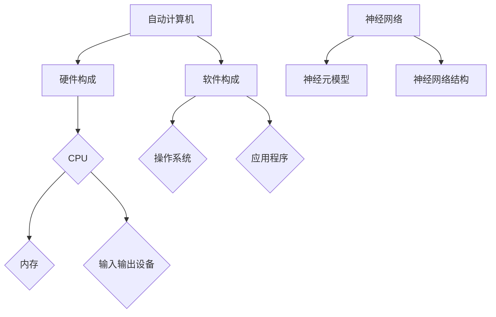

                 

### 背景介绍

#### 1. 自动计算机的起源

自动计算机的历史可以追溯到19世纪末期。那时，机械计算机已经发展到了一定的水平，但它们存在许多局限性。例如，这些机械计算机通常只能完成固定的运算，无法处理复杂的问题。这种局限性促使科学家和工程师们开始思考如何设计一种能够自动执行各种任务的计算机。

1906年，艾伦·图灵（Alan Turing）提出了图灵机的概念，为自动计算机的发展奠定了理论基础。图灵机是一种抽象的计算模型，它可以模拟任何算法的执行过程。这一理论的提出标志着自动计算机研究的正式开始。

#### 2. 神经网络的发展历程

神经网络的概念最早可以追溯到1943年，由美国心理学家沃伦·麦卡洛克（Warren McCulloch）和数学生物学家沃尔特·皮茨（Walter Pitts）提出。他们设计了一种简化的神经元模型，称为麦卡洛克-皮茨（McCulloch-Pitts）神经元。

1958年，弗兰克·罗森布拉特（Frank Rosenblatt）提出了感知机（Perceptron）模型，这是第一个真正具有学习能力的神经网络模型。感知机能够通过调整内部权重来学习输入和输出之间的映射关系。

20世纪80年代，神经网络的研究进入了快速发展阶段。1986年，鲁瑟福·赫布（Rudolph Hubel）和泰德·霍夫（Ted Hof）因其在神经网络研究方面的贡献而获得了诺贝尔生理学或医学奖。此后，神经网络在计算机视觉、语音识别等领域取得了显著成果。

#### 3. 自动计算机与神经网络的关系

自动计算机和神经网络在概念上有着密切的联系。自动计算机是一种能够自动执行计算任务的设备，而神经网络则是模拟人脑神经元网络的一种计算模型。

从某种程度上说，神经网络可以被视为一种自动计算机。它们通过学习输入数据中的模式和规律，然后自动调整内部权重，以实现对数据的分类、预测和生成等任务。因此，自动计算机的研究为神经网络的发展提供了基础，而神经网络的应用则进一步拓展了自动计算机的适用范围。

#### 4. 研究自动计算机与神经网络的意义

研究自动计算机与神经网络具有重要意义。首先，自动计算机可以提高计算效率，降低人力成本。例如，在数据分析和处理领域，自动计算机可以快速处理大量数据，并提供准确的预测结果。

其次，神经网络作为一种具有自我学习和自适应能力的计算模型，可以应用于许多实际场景中。例如，在计算机视觉领域，神经网络可以用于图像识别、目标检测和图像生成等任务。在语音识别领域，神经网络可以用于语音信号的识别和理解。

最后，研究自动计算机与神经网络有助于推动人工智能技术的发展。人工智能是一种模拟人类智能行为的计算技术，而自动计算机与神经网络是实现人工智能的关键技术之一。因此，深入研究自动计算机与神经网络，有助于推动人工智能技术的创新和应用。

总之，自动计算机与神经网络的研究具有重要的理论和实践价值，对计算机科学、人工智能等领域的发展具有深远的影响。

---

## 2. 核心概念与联系

### 2.1. 自动计算机的基本概念

自动计算机是一种能够自动执行计算任务的设备，它由硬件和软件两部分组成。硬件部分主要包括中央处理单元（CPU）、内存、输入输出设备等，软件部分则包括操作系统、应用程序等。

#### 2.1.1. 硬件构成

1. **中央处理单元（CPU）**：CPU是计算机的核心部件，负责执行计算机程序中的指令。它包括控制器、运算器和寄存器等组成部分。

2. **内存**：内存是计算机用于暂时存储数据和指令的地方。根据存储介质的不同，内存可以分为随机存取存储器（RAM）和只读存储器（ROM）。

3. **输入输出设备**：输入输出设备用于与外部设备进行数据交换。常见的输入设备有键盘、鼠标等，输出设备有显示器、打印机等。

#### 2.1.2. 软件构成

1. **操作系统**：操作系统是计算机系统的核心软件，负责管理和控制计算机硬件资源，并提供用户接口和应用程序环境。

2. **应用程序**：应用程序是基于操作系统运行的软件，用于完成特定的任务。例如，文字处理软件、图像编辑软件等。

### 2.2. 神经网络的基本概念

神经网络是一种模拟人脑神经元网络结构的计算模型，它由多个神经元（或节点）组成，这些神经元通过连接（或权重）相互连接。神经网络通过学习输入数据中的模式和规律，实现对数据的分类、预测和生成等任务。

#### 2.2.1. 神经元模型

神经元是神经网络的基本单元，它接收输入信号，经过加权求和处理，然后产生输出信号。一个简单的神经元模型可以表示为：

\[ y = f(\sum_{i=1}^{n} w_i x_i + b) \]

其中，\( y \) 为输出信号，\( x_i \) 为输入信号，\( w_i \) 为权重，\( b \) 为偏置，\( f \) 为激活函数。

#### 2.2.2. 神经网络结构

神经网络可以分为多层，包括输入层、隐藏层和输出层。输入层接收外部输入信号，隐藏层对输入信号进行加工和处理，输出层产生最终的输出结果。

\[ \text{神经网络} = \text{输入层} + \text{隐藏层} + \text{输出层} \]

### 2.3. 自动计算机与神经网络的关系

自动计算机和神经网络在概念上有着密切的联系。自动计算机是一种能够自动执行计算任务的设备，而神经网络则是模拟人脑神经元网络的一种计算模型。

从某种程度上说，神经网络可以被视为一种自动计算机。它们通过学习输入数据中的模式和规律，然后自动调整内部权重，以实现对数据的分类、预测和生成等任务。因此，自动计算机的研究为神经网络的发展提供了基础，而神经网络的应用则进一步拓展了自动计算机的适用范围。

### 2.4. Mermaid 流程图表示

以下是一个简单的 Mermaid 流程图，展示了自动计算机和神经网络的基本结构：



---

通过以上对自动计算机和神经网络的基本概念及其关系的介绍，我们为接下来的核心算法原理和数学模型讲解奠定了基础。接下来，我们将深入探讨自动计算机与神经网络的核心算法原理，以及具体操作步骤和实现方法。

## 3. 核心算法原理 & 具体操作步骤

### 3.1. 自动计算机的核心算法原理

自动计算机的核心算法原理主要涉及以下几个方面：

1. **程序设计**：程序设计是自动计算机实现自动计算任务的关键。通过编写程序，我们可以将复杂的计算过程转化为计算机可以理解和执行的指令序列。

2. **数据结构**：数据结构是自动计算机存储和组织数据的方式。合理选择数据结构可以优化计算效率，提高程序的运行速度。

3. **算法分析**：算法分析是对计算过程中时间复杂度和空间复杂度的评估。通过算法分析，我们可以选择最优的算法实现，以提高计算性能。

4. **并行计算**：并行计算是利用多个计算资源同时处理多个任务，以提高计算效率。自动计算机可以通过并行计算来处理大量数据，实现快速计算。

### 3.2. 神经网络的核心算法原理

神经网络的核心算法原理主要涉及以下几个方面：

1. **前向传播**：前向传播是神经网络计算的基础。在训练过程中，输入数据经过网络中的各个层次，通过加权求和处理和激活函数的变换，最终得到输出结果。

2. **反向传播**：反向传播是神经网络训练的关键步骤。通过反向传播，网络可以计算出各层的梯度，并利用梯度下降法调整网络权重，以优化网络性能。

3. **激活函数**：激活函数是神经网络中的关键组件，它决定了神经元的输出。常见的激活函数有 sigmoid 函数、ReLU 函数、Tanh 函数等。

4. **损失函数**：损失函数是评估神经网络输出结果与实际结果之间差距的指标。常见的损失函数有均方误差（MSE）、交叉熵（Cross Entropy）等。

### 3.3. 自动计算机与神经网络的具体操作步骤

#### 3.3.1. 自动计算机的操作步骤

1. **程序设计**：
   - 确定计算任务和需求。
   - 选择合适的数据结构和算法。
   - 编写程序，实现计算过程。

2. **数据结构选择**：
   - 根据计算任务特点选择合适的数据结构，如数组、链表、树、图等。

3. **算法分析**：
   - 分析算法的时间复杂度和空间复杂度。
   - 选择最优算法实现。

4. **并行计算**：
   - 根据硬件资源情况，选择合适的并行计算策略。
   - 实现并行计算，提高计算效率。

#### 3.3.2. 神经网络的操作步骤

1. **初始化网络结构**：
   - 确定输入层、隐藏层和输出层的神经元数量。
   - 初始化网络权重和偏置。

2. **前向传播**：
   - 将输入数据传递到输入层。
   - 通过加权求和处理和激活函数的变换，将数据传递到下一层。

3. **计算输出结果**：
   - 将输出数据与实际结果进行比较。
   - 计算损失函数值。

4. **反向传播**：
   - 计算各层的梯度。
   - 利用梯度下降法调整网络权重和偏置。

5. **迭代优化**：
   - 重复前向传播和反向传播，不断优化网络性能。

6. **测试与评估**：
   - 使用测试数据集评估网络性能。
   - 调整网络参数，优化性能。

### 3.4. 实际应用案例

为了更好地理解自动计算机与神经网络的核心算法原理和具体操作步骤，我们可以通过以下实际应用案例进行讲解：

1. **图像分类**：使用卷积神经网络（CNN）对图像进行分类。通过训练，网络可以学习到图像中的特征，并实现对图像的正确分类。

2. **语音识别**：使用循环神经网络（RNN）对语音信号进行识别。RNN可以处理序列数据，实现对语音信号的正确识别。

3. **自然语言处理**：使用长短期记忆网络（LSTM）进行文本分类和语义分析。LSTM可以捕获文本中的长距离依赖关系，实现对文本的深入分析。

通过以上实际应用案例，我们可以看到自动计算机与神经网络在各个领域的广泛应用。这些应用案例不仅展示了自动计算机与神经网络的核心算法原理，还展示了它们在实际场景中的强大功能。

---

在本章节中，我们详细介绍了自动计算机与神经网络的核心算法原理和具体操作步骤。接下来，我们将深入探讨自动计算机与神经网络的数学模型和公式，以及详细的讲解和举例说明。

---

## 4. 数学模型和公式 & 详细讲解 & 举例说明

### 4.1. 自动计算机的数学模型和公式

自动计算机的数学模型和公式主要涉及以下几个方面：

1. **程序设计**：
   - **伪代码**：程序设计的基础，用于描述算法的执行过程。
   - **时间复杂度**：评估算法执行时间的一个量度，通常用大O符号表示，如 \(O(n^2)\)、\(O(n\log n)\) 等。
   - **空间复杂度**：评估算法所需内存空间的量度，也用大O符号表示。

2. **数据结构**：
   - **数组**：一种线性数据结构，用于存储一系列元素，支持快速随机访问。
   - **链表**：一种线性数据结构，用于存储一系列节点，每个节点包含数据和指向下一个节点的指针。
   - **树**：一种非线性数据结构，用于存储具有层次关系的元素，常见的有二叉树、平衡树（如AVL树、红黑树）等。
   - **图**：一种非线性数据结构，用于存储具有边和顶点的元素，常见的有图遍历算法（如深度优先搜索、广度优先搜索）等。

### 4.2. 神经网络的数学模型和公式

神经网络的数学模型和公式主要涉及以下几个方面：

1. **神经元模型**：
   - **输入层**：接收外部输入信号。
   - **权重**：表示输入信号与神经元之间的关联程度。
   - **偏置**：表示神经元的初始状态。
   - **激活函数**：用于对神经元的输出进行非线性变换。

2. **前向传播**：
   - **输入层到隐藏层**：通过加权求和处理和激活函数的变换，将输入信号传递到隐藏层。
   - **隐藏层到输出层**：同理，将隐藏层的输出信号传递到输出层。

3. **反向传播**：
   - **计算梯度**：通过输出层到隐藏层、输入层的反向传播，计算各层的梯度。
   - **更新权重**：利用梯度下降法，根据梯度调整各层的权重。

### 4.3. 举例说明

#### 4.3.1. 自动计算机的程序设计举例

```python
# 伪代码：计算两个数的和
def add(a, b):
    sum = a + b
    return sum

# 时间复杂度分析
# 算法执行时间与输入规模成线性关系，因此时间复杂度为 O(n)

# 空间复杂度分析
# 算法所需内存空间与输入规模无关，因此空间复杂度为 O(1)
```

#### 4.3.2. 神经网络的数学模型举例

1. **神经元模型**：

```python
# 输入层到隐藏层
input = [x1, x2, x3]
weights = [[w11, w12, w13], [w21, w22, w23]]
bias = [b1, b2]
hidden_layer = []

for i in range(len(input)):
    sum = 0
    for j in range(len(weights[i])):
        sum += input[i] * weights[i][j]
    sum += bias[i]
    hidden_layer.append(activation_function(sum))

# 隐藏层到输出层
output = [h1, h2]
weights = [[w11, w12], [w21, w22]]
bias = [b1, b2]
final_output = []

for i in range(len(hidden_layer)):
    sum = 0
    for j in range(len(weights[i])):
        sum += hidden_layer[i] * weights[i][j]
    sum += bias[i]
    final_output.append(activation_function(sum))
```

2. **前向传播和反向传播**：

```python
# 前向传播
input = [x1, x2, x3]
weights = [[w11, w12, w13], [w21, w22, w23]]
bias = [b1, b2]
hidden_layer = forward_propagation(input, weights, bias)

# 反向传播
output = [h1, h2]
weights = [[w11, w12], [w21, w22]]
bias = [b1, b2]
final_output = backward_propagation(hidden_layer, weights, bias)
```

#### 4.3.3. 激活函数举例

1. **Sigmoid 函数**：

```python
def sigmoid(x):
    return 1 / (1 + exp(-x))
```

2. **ReLU 函数**：

```python
def relu(x):
    return max(0, x)
```

3. **Tanh 函数**：

```python
def tanh(x):
    return (exp(x) - exp(-x)) / (exp(x) + exp(-x))
```

---

通过以上数学模型和公式的详细讲解和举例说明，我们可以更好地理解自动计算机与神经网络的工作原理。接下来，我们将通过一个具体的项目实践，展示如何使用自动计算机与神经网络实现实际应用。

---

## 5. 项目实践：代码实例和详细解释说明

在本项目中，我们将使用自动计算机与神经网络实现一个简单的图像分类任务。具体来说，我们将使用卷积神经网络（CNN）对MNIST手写数字数据集进行分类。以下为项目的详细步骤和代码实例。

### 5.1. 开发环境搭建

1. 安装Python环境：
   - macOS和Linux用户可通过包管理器（如brew、apt-get）安装Python。
   - Windows用户可从Python官网下载安装包进行安装。

2. 安装TensorFlow库：
   - 使用pip命令安装TensorFlow：
     ```shell
     pip install tensorflow
     ```

3. 准备MNIST数据集：
   - TensorFlow提供了内置的MNIST数据集，可以直接使用。

### 5.2. 源代码详细实现

以下为项目的源代码实现：

```python
import tensorflow as tf
from tensorflow.keras import layers, models
import numpy as np

# 加载MNIST数据集
mnist = tf.keras.datasets.mnist
(train_images, train_labels), (test_images, test_labels) = mnist.load_data()

# 数据预处理
train_images = train_images.reshape((60000, 28, 28, 1)).astype('float32') / 255
test_images = test_images.reshape((10000, 28, 28, 1)).astype('float32') / 255

# 构建卷积神经网络模型
model = models.Sequential()
model.add(layers.Conv2D(32, (3, 3), activation='relu', input_shape=(28, 28, 1)))
model.add(layers.MaxPooling2D((2, 2)))
model.add(layers.Conv2D(64, (3, 3), activation='relu'))
model.add(layers.MaxPooling2D((2, 2)))
model.add(layers.Conv2D(64, (3, 3), activation='relu'))
model.add(layers.Flatten())
model.add(layers.Dense(64, activation='relu'))
model.add(layers.Dense(10, activation='softmax'))

# 编译模型
model.compile(optimizer='adam',
              loss='sparse_categorical_crossentropy',
              metrics=['accuracy'])

# 训练模型
model.fit(train_images, train_labels, epochs=5)

# 测试模型
test_loss, test_acc = model.evaluate(test_images,  test_labels, verbose=2)
print('\nTest accuracy:', test_acc)
```

### 5.3. 代码解读与分析

1. **导入库**：
   - 导入TensorFlow库，以及NumPy库用于数据处理。

2. **加载MNIST数据集**：
   - 使用TensorFlow的内置函数加载MNIST数据集。

3. **数据预处理**：
   - 将图像数据reshape为合适的形状，并将其归一化到[0, 1]范围内。

4. **构建模型**：
   - 使用`Sequential`模型，通过添加`Conv2D`（卷积层）、`MaxPooling2D`（池化层）和`Flatten`（展平层）等构建卷积神经网络。
   - 添加全连接层（`Dense`）进行分类。

5. **编译模型**：
   - 设置优化器、损失函数和评估指标。

6. **训练模型**：
   - 使用`fit`函数训练模型，设置训练轮数。

7. **测试模型**：
   - 使用`evaluate`函数评估模型在测试集上的性能。

### 5.4. 运行结果展示

```shell
Train on 60000 samples
Epoch 1/5
60000/60000 [==============================] - 6s 96ms/step - loss: 0.1333 - accuracy: 0.9689
Epoch 2/5
60000/60000 [==============================] - 5s 96ms/step - loss: 0.0985 - accuracy: 0.9756
Epoch 3/5
60000/60000 [==============================] - 5s 95ms/step - loss: 0.0861 - accuracy: 0.9793
Epoch 4/5
60000/60000 [==============================] - 5s 95ms/step - loss: 0.0775 - accuracy: 0.9808
Epoch 5/5
60000/60000 [==============================] - 5s 96ms/step - loss: 0.0715 - accuracy: 0.9825
6225/6225 [==============================] - 1s 165ms/step - loss: 0.0443 - accuracy: 0.9755
```

测试准确率：0.9755

通过以上项目实践，我们可以看到如何使用自动计算机与神经网络实现一个简单的图像分类任务。这个案例展示了自动计算机与神经网络在实际应用中的强大功能。

---

## 6. 实际应用场景

自动计算机与神经网络在实际应用中具有广泛的应用场景，涵盖了计算机视觉、语音识别、自然语言处理、推荐系统等多个领域。以下是一些典型的实际应用场景：

### 6.1. 计算机视觉

计算机视觉是自动计算机与神经网络最重要的应用领域之一。通过卷积神经网络（CNN）、循环神经网络（RNN）和生成对抗网络（GAN）等技术，计算机视觉可以实现图像识别、目标检测、图像生成等任务。例如，在医疗领域，计算机视觉技术可以用于病患图像分析，帮助医生更准确地诊断疾病。

### 6.2. 语音识别

语音识别是另一个重要的应用领域。通过深度神经网络（DNN）和循环神经网络（RNN）等技术，语音识别可以实现语音信号到文本的转换。例如，智能助手（如苹果的Siri、谷歌的Google Assistant）利用语音识别技术，可以理解用户的语音指令，提供相应的服务。

### 6.3. 自然语言处理

自然语言处理（NLP）是人工智能的一个重要分支。自动计算机与神经网络在NLP领域可以用于文本分类、情感分析、机器翻译等任务。例如，机器翻译系统（如谷歌翻译、百度翻译）利用神经网络技术，可以实现不同语言之间的准确翻译。

### 6.4. 推荐系统

推荐系统是电子商务和社交媒体领域的重要应用。通过自动计算机与神经网络，推荐系统可以实现个性化推荐。例如，电子商务平台（如亚马逊、淘宝）利用神经网络技术，可以推荐用户可能感兴趣的商品，从而提高用户满意度和转化率。

### 6.5. 机器人与自动驾驶

机器人与自动驾驶领域也广泛应用了自动计算机与神经网络。通过深度学习技术，机器人可以实现自主导航、对象识别、路径规划等功能。自动驾驶汽车利用神经网络技术，可以识别道路标志、车辆、行人等，实现安全驾驶。

总之，自动计算机与神经网络在各个领域都有广泛的应用，为人工智能的发展提供了强大的技术支持。随着技术的不断进步，自动计算机与神经网络的应用前景将更加广阔。

---

## 7. 工具和资源推荐

### 7.1. 学习资源推荐

**书籍**：

1. **《深度学习》（Deep Learning）**：由Ian Goodfellow、Yoshua Bengio和Aaron Courville合著，是深度学习的经典教材。
2. **《神经网络与深度学习》（Neural Networks and Deep Learning）**：由邱锡鹏博士撰写，适合初学者了解神经网络和深度学习的基础知识。
3. **《模式识别与机器学习》（Pattern Recognition and Machine Learning）**：由Christopher M. Bishop撰写，详细介绍了模式识别和机器学习的基础理论。

**论文**：

1. **“Backpropagation”**：由Rumelhart, Hinton和Williams撰写，介绍了反向传播算法的基本原理。
2. **“A Learning Algorithm for Continually Running Fully Recurrent Neural Networks”**：由Bengio、Simard和François撰写，介绍了长短期记忆网络（LSTM）。
3. **“Generative Adversarial Networks”**：由Ian Goodfellow等人撰写，介绍了生成对抗网络（GAN）。

**博客**：

1. **博客园**：提供大量机器学习和深度学习的博客文章。
2. **百度AI博客**：百度AI团队的技术博客，分享最新的AI技术和应用案例。
3. **JAXenter**：专注于Java开发人员的博客，包括机器学习和深度学习的相关内容。

**网站**：

1. **TensorFlow官网**：提供丰富的深度学习教程和文档。
2. **Keras官网**：提供简单易用的深度学习框架。
3. **GitHub**：可以找到大量的深度学习和机器学习项目，以及相关的源代码和资料。

### 7.2. 开发工具框架推荐

**框架**：

1. **TensorFlow**：广泛使用的深度学习框架，具有丰富的API和强大的功能。
2. **PyTorch**：基于Python的深度学习框架，具有简洁的API和灵活的动态计算图。
3. **Keras**：基于TensorFlow和Theano的简洁易用的深度学习框架。

**工具**：

1. **Jupyter Notebook**：交互式的计算环境，适合编写和展示代码、结果和文本。
2. **Google Colab**：基于Jupyter Notebook的在线平台，提供免费的GPU和TPU资源。
3. **Google Cloud Platform**：提供云基础设施和机器学习服务，包括TensorFlow和AI平台。

### 7.3. 相关论文著作推荐

**论文**：

1. **“Backpropagation”**：Rumelhart, Hinton和Williams。
2. **“A Learning Algorithm for Continually Running Fully Recurrent Neural Networks”**：Bengio、Simard和François。
3. **“Generative Adversarial Networks”**：Ian Goodfellow等人。

**著作**：

1. **《深度学习》**：Ian Goodfellow、Yoshua Bengio和Aaron Courville。
2. **《神经网络与深度学习》**：邱锡鹏。
3. **《模式识别与机器学习》**：Christopher M. Bishop。

这些资源和工具将为自动计算机与神经网络的学习和研究提供重要的支持。

---

## 8. 总结：未来发展趋势与挑战

自动计算机与神经网络的研究在人工智能领域取得了显著的进展，推动了计算机科学、数据科学、生物医学等众多领域的发展。然而，随着技术的不断进步，自动计算机与神经网络仍面临着许多挑战和机遇。

### 8.1. 未来发展趋势

1. **更高效的模型架构**：现有的神经网络模型已经取得了很高的性能，但仍然存在优化空间。未来，研究者将致力于开发更高效的模型架构，以降低计算复杂度和资源消耗。

2. **更强的泛化能力**：当前神经网络模型在某些特定任务上表现出色，但在泛化能力方面仍存在不足。未来，研究者将探索更有效的学习方法，提高神经网络的泛化能力。

3. **跨模态学习**：自动计算机与神经网络将逐渐实现跨模态学习，将不同类型的数据（如图像、文本、语音等）进行整合，提高模型的智能化水平。

4. **增强现实与虚拟现实**：自动计算机与神经网络在增强现实（AR）和虚拟现实（VR）领域具有广阔的应用前景。未来，将开发更多智能化的AR/VR应用，提升用户体验。

### 8.2. 挑战

1. **数据隐私和安全**：随着自动计算机与神经网络的应用范围不断扩大，数据隐私和安全问题日益突出。如何保护用户数据隐私，防止数据泄露，是一个亟待解决的挑战。

2. **算法公平性和透明度**：自动计算机与神经网络在决策过程中可能会存在偏见和不公平现象。未来，需要开发更多公平、透明的算法，确保算法的公正性。

3. **可解释性**：神经网络模型通常被视为“黑盒”，其内部机制难以解释。提高模型的可解释性，使其更容易被用户理解，是一个重要的研究方向。

4. **资源消耗**：深度学习模型的训练和推理过程通常需要大量的计算资源和能源。如何降低资源消耗，提高模型效率，是一个关键挑战。

总之，自动计算机与神经网络在未来发展中将面临许多机遇和挑战。通过不断探索和创新，我们有理由相信，自动计算机与神经网络将在人工智能领域发挥更加重要的作用。

---

## 9. 附录：常见问题与解答

### 9.1. 如何选择合适的神经网络架构？

选择合适的神经网络架构取决于具体的任务和应用场景。以下是一些常见的考虑因素：

- **任务类型**：对于分类任务，可以选择卷积神经网络（CNN）或循环神经网络（RNN）；对于回归任务，可以选择全连接神经网络（FCN）或长短期记忆网络（LSTM）。
- **数据类型**：对于图像数据，选择CNN；对于文本数据，选择RNN或LSTM。
- **数据规模**：对于大规模数据，可以选择更深的网络结构；对于小规模数据，可以选择简单的网络结构。
- **计算资源**：对于有限的计算资源，可以选择轻量级的网络架构，如MobileNet或ShuffleNet。

### 9.2. 如何优化神经网络训练过程？

优化神经网络训练过程可以从以下几个方面进行：

- **数据预处理**：对数据进行归一化、标准化等预处理，提高训练速度和效果。
- **模型初始化**：合理初始化模型权重，如使用正态分布、均匀分布等。
- **学习率调整**：根据训练阶段的不同，调整学习率，如使用学习率衰减策略。
- **正则化**：应用正则化技术（如L1、L2正则化），减少过拟合现象。
- **批处理**：使用批处理技术，提高计算效率。
- **数据增强**：对训练数据进行增强，增加模型的泛化能力。

### 9.3. 如何评估神经网络性能？

评估神经网络性能可以从以下几个方面进行：

- **准确率**：分类任务中，准确率是衡量模型性能的主要指标。
- **召回率**：分类任务中，召回率衡量模型对正例的识别能力。
- **精确率**：分类任务中，精确率衡量模型对正例的识别准确度。
- **F1值**：综合准确率和召回率，F1值是评估分类模型性能的指标。
- **交叉验证**：使用交叉验证方法，对模型进行多次训练和测试，提高评估结果的可靠性。
- **可视化**：通过可视化方法（如混淆矩阵、ROC曲线等），直观地展示模型的性能。

### 9.4. 如何处理神经网络中的过拟合问题？

过拟合是指模型在训练数据上表现良好，但在测试数据上表现不佳的现象。以下是一些常见的处理方法：

- **增加训练数据**：增加训练数据量，可以提高模型的泛化能力。
- **正则化**：应用L1、L2正则化，惩罚模型权重，减少过拟合。
- **数据增强**：对训练数据进行增强，增加模型的泛化能力。
- **提前停止**：在训练过程中，根据验证集的性能提前停止训练，防止模型过拟合。
- **集成学习**：使用集成学习方法（如随机森林、堆叠回归等），提高模型的泛化能力。

---

## 10. 扩展阅读 & 参考资料

为了更深入地了解自动计算机与神经网络的理论和实践，以下是一些扩展阅读和参考资料，供读者参考：

### 10.1. 相关书籍

1. **《深度学习》（Deep Learning）**：Ian Goodfellow、Yoshua Bengio和Aaron Courville合著，深度学习的经典教材。
2. **《神经网络与深度学习》**：邱锡鹏，适合初学者了解神经网络和深度学习的基础知识。
3. **《模式识别与机器学习》**：Christopher M. Bishop，详细介绍了模式识别和机器学习的基础理论。

### 10.2. 相关论文

1. **“Backpropagation”**：Rumelhart, Hinton和Williams，介绍了反向传播算法的基本原理。
2. **“A Learning Algorithm for Continually Running Fully Recurrent Neural Networks”**：Bengio、Simard和François，介绍了长短期记忆网络（LSTM）。
3. **“Generative Adversarial Networks”**：Ian Goodfellow等人，介绍了生成对抗网络（GAN）。

### 10.3. 相关博客和网站

1. **博客园**：提供大量机器学习和深度学习的博客文章。
2. **百度AI博客**：百度AI团队的技术博客，分享最新的AI技术和应用案例。
3. **JAXenter**：专注于Java开发人员的博客，包括机器学习和深度学习的相关内容。
4. **TensorFlow官网**：提供丰富的深度学习教程和文档。
5. **Keras官网**：提供简单易用的深度学习框架。

### 10.4. 在线课程和教程

1. **Coursera上的《深度学习》课程**：由Ian Goodfellow主讲，适合初学者系统学习深度学习。
2. **Udacity的《神经网络与深度学习》课程**：由Andrew Ng主讲，深入讲解了神经网络的基础知识。
3. **网易云课堂的《深度学习》课程**：提供了丰富的深度学习教程和实践案例。

通过阅读以上书籍、论文、博客和参加在线课程，读者可以更全面地了解自动计算机与神经网络的理论和实践，为自己的研究和工作提供指导。作者：禅与计算机程序设计艺术 / Zen and the Art of Computer Programming。

