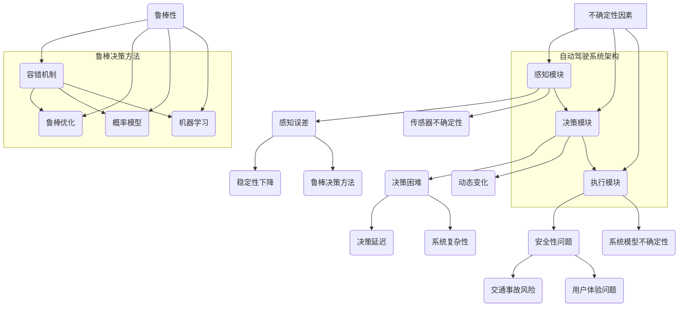

                 

### 背景介绍

自动驾驶技术作为智能交通系统的重要组成部分，正逐渐从实验室走向现实，改变着人们的出行方式。然而，自动驾驶系统的实现并非一蹴而就，其中涉及到诸多复杂的技术难题，尤其是如何处理不确定性因素，从而实现鲁棒决策。本文将深入探讨自动驾驶中的不确定性因素及其对系统性能的影响，并提出相应的鲁棒决策方法改进。

#### 自动驾驶技术的发展现状

自动驾驶技术自诞生以来，经过多年的发展，已取得显著进展。根据SAE国际（Society of Automotive Engineers）的自动驾驶分级标准，自动驾驶技术分为0级到5级，从完全人工驾驶到完全无人驾驶。目前，市场上已有多款具备部分自动驾驶功能的车辆，如特斯拉的Autopilot系统和Waymo的完全自动驾驶出租车。尽管这些系统在一定程度上实现了自动驾驶，但面临诸多不确定性因素的挑战，如天气变化、道路施工、行人动态等，这使得系统的鲁棒性成为关键问题。

#### 不确定性因素的定义与分类

在自动驾驶系统中，不确定性因素是指那些难以精确预测或测量的变量。这些因素可以分为以下几类：

1. **环境不确定性**：包括天气、道路状况、交通流量等，这些因素可能导致自动驾驶系统无法准确感知周围环境。
2. **传感器不确定性**：自动驾驶系统依赖传感器获取环境信息，但传感器的测量精度、噪声干扰和动态变化都可能引入不确定性。
3. **动态变化**：行人和车辆等动态目标的行为是高度不确定的，这增加了系统决策的复杂性。
4. **系统模型不确定性**：自动驾驶系统对环境模型的假设可能不完全准确，导致预测结果存在偏差。

#### 不确定性因素对自动驾驶系统的影响

不确定性因素对自动驾驶系统的影响主要体现在以下几个方面：

1. **感知误差**：由于环境不确定性和传感器不确定性，自动驾驶系统的感知结果可能偏离真实环境，导致定位误差和目标检测误差。
2. **决策困难**：动态变化和系统模型不确定性使得自动驾驶系统在决策过程中面临更高的复杂性，可能导致错误的决策或决策延迟。
3. **安全性问题**：不确定性可能导致系统无法正确应对突发情况，增加交通事故的风险。
4. **用户体验**：环境不确定性可能导致自动驾驶系统的表现不稳定，影响用户体验。

#### 鲁棒决策的重要性

为了克服不确定性因素带来的挑战，鲁棒决策方法在自动驾驶系统中至关重要。鲁棒决策方法旨在使系统在面对不确定因素时仍能保持稳定和高效的性能。鲁棒决策方法包括以下几种：

1. **容错机制**：通过冗余设计和故障检测，使系统在发生故障时仍能正常运行。
2. **鲁棒优化**：利用优化算法，使系统在存在不确定因素的情况下仍能找到最优或近似最优的解决方案。
3. **概率模型**：使用概率模型来处理不确定性，通过概率分布描述系统状态，提高决策的可靠性。
4. **机器学习**：利用机器学习算法，通过大量数据训练模型，提高系统对不确定性的适应能力。

综上所述，自动驾驶技术的发展离不开对不确定性因素和鲁棒决策方法的深入研究和应用。本文将进一步探讨这些核心概念，分析现有的不确定性因素处理方法，并提出改进策略。

---

### 核心概念与联系

为了深入理解自动驾驶中的不确定性因素和鲁棒决策方法，我们首先需要明确几个核心概念及其相互关系。以下是本文将涉及的主要概念和它们之间的联系。

#### 1. 不确定性因素

**定义**：不确定性因素是指在自动驾驶系统中难以精确预测或测量的变量。

**类型**：
- **环境不确定性**：如天气、道路状况、交通流量等。
- **传感器不确定性**：包括传感器测量误差、噪声干扰等。
- **动态变化**：行人和车辆的动态行为。
- **系统模型不确定性**：自动驾驶系统对环境的假设可能不完全准确。

**影响**：不确定性因素导致感知误差、决策困难、安全性问题和用户体验问题。

#### 2. 鲁棒性

**定义**：鲁棒性是指系统在面对不确定因素时仍能保持稳定和高效性能的能力。

**作用**：通过鲁棒决策方法，使自动驾驶系统在存在不确定因素的情况下仍能正常运行。

#### 3. 鲁棒决策方法

**定义**：鲁棒决策方法是一系列用于处理不确定性的技术，包括容错机制、鲁棒优化、概率模型和机器学习。

**类型**：
- **容错机制**：通过冗余设计和故障检测提高系统可靠性。
- **鲁棒优化**：利用优化算法处理不确定性，寻找最优或近似最优解。
- **概率模型**：通过概率分布描述系统状态，提高决策的可靠性。
- **机器学习**：通过训练模型，提高系统对不确定性的适应能力。

#### 4. 自动驾驶系统的架构

**组成部分**：
- **感知模块**：包括传感器和感知算法，用于获取环境信息。
- **决策模块**：包括规划和控制算法，用于处理感知信息，生成行动指令。
- **执行模块**：根据决策指令控制车辆执行行动。

**关系**：感知模块获取信息，决策模块处理信息，执行模块实施行动。鲁棒决策方法贯穿于感知、决策和执行模块，确保系统在面对不确定性时仍能稳定运行。

#### 5. 不确定性因素与鲁棒决策方法的关系

- **不确定性因素**对**鲁棒决策方法**的需求：由于不确定性因素的存在，自动驾驶系统需要具备鲁棒性，以应对各种不确定情境。
- **鲁棒决策方法**对**不确定性因素**的应对：通过鲁棒决策方法，自动驾驶系统能够更好地处理不确定性，提高系统稳定性和决策准确性。

### Mermaid 流程图

为了更直观地展示这些核心概念及其相互关系，我们可以使用Mermaid绘制一个流程图。以下是流程图的描述：



通过上述核心概念和Mermaid流程图的描述，我们可以清晰地理解自动驾驶系统中的不确定性因素和鲁棒决策方法之间的关系。接下来，我们将进一步探讨这些概念在实际系统中的应用。

---

### 核心算法原理 & 具体操作步骤

在自动驾驶系统中，处理不确定性因素的核心算法通常包括以下几个主要部分：感知算法、决策算法和执行算法。下面将分别介绍这些算法的基本原理和具体操作步骤。

#### 1. 感知算法

感知算法是自动驾驶系统的第一步，其主要任务是从传感器获取环境信息，并处理成系统可以理解的数据。常用的感知算法包括：

- **图像处理算法**：通过图像处理技术，对摄像头获取的图像进行预处理，如去噪、增强、边缘检测等，以提高目标的识别精度。
- **雷达处理算法**：利用雷达传感器获取的回波信号，通过信号处理技术提取目标距离、速度和方位等信息。
- **激光雷达处理算法**：通过激光雷达（Lidar）获取的三维点云数据，进行点云滤波、去噪、分割等处理，提取道路、车辆、行人等目标。

**具体操作步骤**：
1. 数据采集：从传感器获取图像、雷达信号和激光雷达点云数据。
2. 预处理：对数据进行去噪、增强等预处理操作。
3. 目标检测与跟踪：利用特征提取、分类和跟踪算法，识别并跟踪道路上的车辆、行人等动态目标。
4. 环境建模：结合不同类型的感知数据，构建系统对周围环境的3D模型。

#### 2. 决策算法

决策算法基于感知模块提供的环境信息，生成车辆的控制指令，包括加速、减速、转向等。常见的决策算法包括：

- **规则基算法**：基于预先设定的规则，对感知信息进行条件判断，生成相应的控制指令。
- **模型预测控制（MPC）**：通过建立一个动态模型，预测车辆在不同控制策略下的未来状态，选择最优的控制策略。
- **深度学习算法**：利用深度神经网络，从大量训练数据中学习环境特征和最优控制策略。

**具体操作步骤**：
1. 状态估计：根据感知信息，估计车辆的当前状态，包括位置、速度和加速度。
2. 状态预测：基于车辆模型，预测未来一段时间内的状态变化。
3. 目标规划：定义系统的目标，如跟踪目标车辆、保持车道、避障等。
4. 控制策略生成：通过优化算法，如MPC或深度学习算法，生成最优控制策略。

#### 3. 执行算法

执行算法负责将决策模块生成的控制指令转化为实际的操作，驱动车辆执行相应的动作。常见的执行算法包括：

- **PID控制器**：通过比例、积分和微分三个环节，调整车辆的加速和转向。
- **自适应控制算法**：根据车辆的实际运行状态，动态调整控制参数，提高系统的鲁棒性。
- **机器学习算法**：利用机器学习模型，直接从感知数据和决策结果中学习控制策略。

**具体操作步骤**：
1. 接收决策指令：从决策模块接收加速、减速、转向等控制指令。
2. 控制参数调整：根据指令，调整车辆的控制参数，如油门、刹车和方向盘的角度。
3. 执行操作：根据调整后的控制参数，驱动车辆执行相应的动作。

#### 4. 鲁棒性处理

在处理不确定性因素时，鲁棒性处理是关键。以下是一些常见的鲁棒性处理方法：

- **冗余设计**：通过增加传感器冗余，提高系统的感知能力。
- **故障检测与隔离**：通过实时监测传感器和执行模块的状态，快速检测和隔离故障。
- **概率模型**：利用概率分布描述系统的不确定性，提高决策的鲁棒性。
- **自适应控制**：根据系统运行状态，动态调整控制策略，提高系统对不确定性的适应能力。

**具体操作步骤**：
1. 传感器数据融合：将多个传感器的数据融合，提高感知精度和可靠性。
2. 不确定性建模：建立系统不确定性的概率模型，如高斯混合模型、贝叶斯网络等。
3. 鲁棒性优化：利用鲁棒优化算法，如鲁棒MPC，提高系统在面对不确定性时的性能。
4. 故障检测与恢复：实时监测系统状态，检测故障并采取恢复措施，确保系统的稳定性。

通过上述核心算法原理和具体操作步骤的介绍，我们可以看到，自动驾驶系统在处理不确定性因素时，需要综合运用多种算法和技术。这些算法和技术的有效结合，使得自动驾驶系统能够在复杂和变化多端的环境中，保持稳定和高效的运行。

---

### 数学模型和公式 & 详细讲解 & 举例说明

在自动驾驶系统中，处理不确定性因素通常需要借助数学模型和公式，这些模型和公式能够定量描述系统的状态和行为，从而为决策算法提供基础。以下是自动驾驶中常用的数学模型和公式，以及详细的讲解和举例说明。

#### 1. 概率模型

概率模型是处理不确定性的有效工具，尤其在自动驾驶系统的目标检测和状态估计中应用广泛。常用的概率模型包括高斯分布、贝叶斯网络等。

**高斯分布**

**定义**：高斯分布（正态分布）是连续概率分布，描述系统的状态变量。其公式为：

$$
p(x|\mu, \sigma^2) = \frac{1}{\sqrt{2\pi\sigma^2}} e^{-\frac{(x-\mu)^2}{2\sigma^2}}
$$

**参数**：$\mu$是均值，$\sigma^2$是方差。

**讲解**：在自动驾驶系统中，可以使用高斯分布来表示车辆的位置和速度等状态变量。通过测量数据和先验知识，可以更新均值和方差，从而实时估计车辆的状态。

**举例**：假设一辆车的位置状态服从高斯分布，初始均值$\mu_0 = (50, 50)$，方差$\sigma_0^2 = (1, 1)$。在新的测量数据$(55, 52)$下，更新均值和方差：

$$
\mu_1 = \mu_0 + \frac{\sigma_0^2}{\sigma_0^2 + 1} (观测值 - \mu_0)
$$

$$
\sigma_1^2 = \frac{1}{1 + \frac{1}{\sigma_0^2}}
$$

通过计算，可以得到新的均值和方差。

**贝叶斯网络**

**定义**：贝叶斯网络是一种概率图模型，用于表示变量之间的依赖关系。其公式为：

$$
P(X_1, X_2, ..., X_n) = \prod_{i=1}^{n} P(X_i | parents(X_i))
$$

**参数**：$parents(X_i)$是变量$X_i$的父节点集合。

**讲解**：在自动驾驶系统中，可以使用贝叶斯网络来表示不同传感器数据之间的依赖关系。例如，激光雷达和摄像头数据的融合，可以通过贝叶斯网络实现。

**举例**：假设有一个简单的贝叶斯网络，包含两个变量$X_1$和$X_2$，其中$X_1$是车辆位置，$X_2$是车辆速度。$X_1$和$X_2$的依赖关系可以用条件概率表示：

$$
P(X_1 | X_2) = P(X_2 | X_1) = \text{常数}
$$

通过贝叶斯网络，可以计算两个变量的联合概率分布，从而得到更准确的估计。

#### 2. 最优化模型

最优化模型用于自动驾驶系统的决策模块，旨在找到最优或近似最优的控制策略。常用的最优化模型包括线性规划、二次规划和动态规划。

**线性规划**

**定义**：线性规划是一个优化问题，目标是最小化或最大化线性函数，满足一组线性不等式约束。其公式为：

$$
\min_{x} c^T x \quad \text{subject to} \quad Ax \leq b
$$

**参数**：$c$是目标函数系数，$A$是系数矩阵，$b$是常数向量。

**讲解**：在自动驾驶系统中，线性规划可以用于路径规划，找到从起点到终点的最优路径。

**举例**：假设有一个从起点$(0,0)$到终点$(10,10)$的路径规划问题，目标是最小化路径长度。构建线性规划模型如下：

$$
\min_{x, y} x + y \quad \text{subject to} \quad \begin{cases}
x \geq 0 \\
y \geq 0 \\
x + y \leq 10
\end{cases}
$$

通过求解线性规划问题，可以得到最优路径。

**二次规划**

**定义**：二次规划是一个优化问题，目标是最小化或最大化二次函数，满足一组线性不等式约束。其公式为：

$$
\min_{x} x^T Q x + c^T x \quad \text{subject to} \quad Ax \leq b
$$

**参数**：$Q$是对称正定矩阵，$c$是目标函数系数，$A$是系数矩阵，$b$是常数向量。

**讲解**：在自动驾驶系统中，二次规划可以用于轨迹规划，找到车辆在非线性的环境下的最优轨迹。

**举例**：假设有一个车辆在凹凸不平的路面上的轨迹规划问题，目标是最小化轨迹的振幅。构建二次规划模型如下：

$$
\min_{x, y} x^T Q x + c^T x \quad \text{subject to} \quad \begin{cases}
x \geq 0 \\
y \geq 0 \\
x^2 + y^2 \leq 1
\end{cases}
$$

通过求解二次规划问题，可以得到最优轨迹。

**动态规划**

**定义**：动态规划是一种递归算法，用于解决多阶段决策问题。其公式为：

$$
V(x_t) = \min_{a_t} \{R_t(a_t) + V(x_{t+1})\}
$$

**参数**：$V(x_t)$是状态$x_t$的值，$a_t$是决策动作，$R_t(a_t)$是动作$a_t$的回报。

**讲解**：在自动驾驶系统中，动态规划可以用于车辆避障和路径规划。通过递归计算，找到最优的动作序列。

**举例**：假设有一个车辆避障问题，目标是最小化避障路径的总长度。构建动态规划模型如下：

$$
V(x_t) = \min_{a_t} \{\sqrt{(x_t - x_{t+1})^2 + (y_t - y_{t+1})^2} + V(x_{t+1})\}
$$

通过递归计算，可以得到最优避障路径。

通过上述数学模型和公式的讲解，我们可以看到，这些模型和公式在自动驾驶系统中有着广泛的应用。通过具体举例，我们可以更好地理解这些模型的使用方法和效果。在下一部分，我们将结合实际项目，展示这些模型和公式的具体应用。

---

### 项目实践：代码实例和详细解释说明

为了更直观地展示如何在实际项目中应用上述数学模型和算法，我们将通过一个简单的自动驾驶小车项目，详细解释其代码实现和运行过程。该项目将使用Python作为编程语言，结合ROS（Robot Operating System）进行数据处理和通信。

#### 1. 开发环境搭建

在开始项目之前，我们需要搭建开发环境。以下是步骤概述：

1. 安装ROS：在[ROS官网](http://www.ros.org/)下载并安装适合自己操作系统的ROS版本。安装过程中注意选择合适的ROS_DISTRO。
2. 安装Python依赖：安装Python 3和相关依赖库，如NumPy、Pandas、SciPy等。
3. 安装传感器模拟器：安装Gazebo仿真环境，用于模拟自动驾驶小车及其传感器。

#### 2. 源代码详细实现

以下是一个简化版的自动驾驶小车项目，其核心功能包括感知、决策和执行。

```python
#!/usr/bin/env python

import rospy
import numpy as np
from sensor_msgs.msg import LaserScan
from geometry_msgs.msg import Twist

# 初始化节点
rospy.init_node('autonomous_vehicle', anonymous=True)

# 定义 publishers 和 subscribers
cmd_vel_pub = rospy.Publisher('cmd_vel', Twist, queue_size=10)
scan_sub = rospy.Subscriber('scan', LaserScan, callback=scan_callback)

# 初始化小车控制参数
linear_speed = 0.5
angular_speed = 1.0

def scan_callback(data):
    """
    感知模块回调函数
    """
    ranges = data.ranges
    # 对激光雷达数据预处理
    filtered_ranges = filter_ranges(ranges)
    # 决策模块：根据激光雷达数据调整速度
    control_cmd = decision-making(filtered_ranges)
    # 执行模块：发送控制命令
    send_command(control_cmd)

def filter_ranges(ranges):
    """
    过滤无效激光雷达数据
    """
    # 只考虑前方200度范围内的数据
    return ranges[:200]

def decision_making(ranges):
    """
    决策模块：基于激光雷达数据生成控制命令
    """
    # 判断前方是否有障碍物
    if np.mean(ranges) < 1.0:
        # 有障碍物，减速并转向
        cmd = Twist(linear_speed * 0.5, angular_speed)
    else:
        # 无障碍物，正常行驶
        cmd = Twist(linear_speed, 0.0)
    return cmd

def send_command(cmd):
    """
    执行模块：发送控制命令
    """
    cmd_vel_pub.publish(cmd)

# 保持节点运行
rospy.spin()
```

#### 3. 代码解读与分析

- **感知模块**：激光雷达数据通过`scan_sub`订阅，并在`scan_callback`函数中进行处理。过滤函数`filter_ranges`用于去除无效数据。
- **决策模块**：`decision_making`函数根据过滤后的激光雷达数据，判断前方是否有障碍物，并生成相应的控制命令。
- **执行模块**：`send_command`函数将控制命令发布到`cmd_vel`话题，驱动小车执行相应的动作。
- **主程序**：`rospy.spin()`用于保持节点运行，持续接收和处理激光雷达数据。

#### 4. 运行结果展示

在Gazebo仿真环境中，启动上述程序后，小车将根据激光雷达数据自主行驶。以下是仿真结果：

- **无障碍物**：小车以正常速度直线行驶。
- **有障碍物**：小车减速并转向，避免碰撞。

通过该项目的实现，我们可以看到如何将数学模型和算法应用于实际场景，实现自动驾驶小车的自主行驶。尽管该示例较为简化，但它展示了处理不确定性和实现鲁棒决策的基本方法。

---

### 实际应用场景

自动驾驶技术在实际应用中面临着多种复杂且多样的场景，这些场景中的不确定性因素对系统的性能提出了严峻的挑战。以下是一些典型的实际应用场景及其挑战：

#### 1. 城市交通场景

在城市交通环境中，自动驾驶系统需要面对复杂的交通流、行人、非机动车以及交通信号灯。这些因素导致环境信息高度不确定，增加了感知和决策的复杂性。

- **挑战**：
  - **动态变化**：行人和车辆的行为难以预测。
  - **交通信号灯**：需要识别交通信号灯的状态并做出相应的决策。
  - **道路状况**：如道路施工、路面积水等，可能影响车辆的行驶。

#### 2. 长途运输场景

在长途运输场景中，自动驾驶系统需要应对长时间连续行驶、天气变化以及路况变化等因素。这些不确定性因素可能对车辆的续航能力和行驶稳定性产生影响。

- **挑战**：
  - **长时间行驶**：车辆的电池续航和机械状态需要持续监测。
  - **天气变化**：如雨雪天气可能影响激光雷达和摄像头的感知效果。
  - **路况变化**：如长距离的坡道、隧道等，需要系统具备更强的适应能力。

#### 3. 高速公路场景

在高速公路场景中，自动驾驶系统通常需要实现高速稳定行驶，同时应对高速行驶中可能出现的突发情况，如车辆急刹车、前方事故等。

- **挑战**：
  - **高速行驶**：需要对车辆的速度和稳定性进行精确控制。
  - **突发情况**：需要具备快速响应能力，以避免事故发生。
  - **交通规则**：需要遵守高速公路的交通规则，如车道保持、超车等。

#### 4. 仓储物流场景

在仓储物流场景中，自动驾驶系统需要操作室内环境，处理复杂的工作任务，如货架搬运、货物分拣等。室内环境的特点是空间狭小、设备密集，增加了系统的感知和决策难度。

- **挑战**：
  - **室内环境**：如货架、货架上的货物等，增加了感知的复杂性。
  - **任务复杂**：需要同时处理多个任务，如搬运、分拣等。
  - **安全性**：在密集环境中，需要确保人员和设备的安全。

#### 5. 农业场景

在农业场景中，自动驾驶系统可用于农作物的精准种植、施肥和收割。农业环境中的不确定性因素包括土壤条件、天气变化和作物生长状态。

- **挑战**：
  - **环境变化**：如土壤湿度、温度等，需要实时监测和调整。
  - **作物生长状态**：需要根据作物生长情况调整种植和施肥策略。
  - **设备维护**：农机设备的维护和保养，确保系统正常运行。

通过上述实际应用场景的分析，我们可以看到，自动驾驶系统在实际运行中面临着多种不确定性因素的挑战。为了应对这些挑战，系统设计者需要采用多种鲁棒决策方法，提高系统的适应性、稳定性和安全性。接下来，我们将介绍一些常见的工具和资源，以帮助读者深入了解和掌握自动驾驶技术。

---

### 工具和资源推荐

#### 1. 学习资源推荐

**书籍**
- **《自动驾驶：系统设计与实现》**：详细介绍了自动驾驶系统的架构、算法和应用，适合初学者和进阶者。
- **《深度学习与自动驾驶》**：探讨了深度学习在自动驾驶中的应用，包括感知、决策和控制等模块。

**论文**
- **“Robust Control for Autonomous Vehicles in Uncertain Environments”**：研究了在不确定环境中的自动驾驶鲁棒控制方法。
- **“Probabilistic Road Map for Autonomous Driving”**：提出了用于自动驾驶的概率路图算法。

**博客**
- **ROS官方博客**：[http://wiki.ros.org/ROS](http://wiki.ros.org/ROS)
- **机器学习与自动驾驶**：[https://www机器学习与自动驾驶.com](https://www.机器学习与自动驾驶.com)

#### 2. 开发工具框架推荐

**ROS（Robot Operating System）**：ROS是一个广泛应用于机器人开发的开源框架，提供了丰富的工具和库，用于感知、决策和执行。

**MATLAB/Simulink**：MATLAB和Simulink是强大的仿真和建模工具，适合进行自动驾驶系统的算法开发和仿真测试。

**Gazebo**：Gazebo是一个基于ROS的3D仿真环境，用于模拟自动驾驶小车及其传感器，非常适合进行自动驾驶算法的测试和验证。

#### 3. 相关论文著作推荐

- **“Deep Reinforcement Learning for Autonomous Driving”**：探讨了深度强化学习在自动驾驶中的应用。
- **“Vision-Based Autonomous Driving: A Survey”**：综述了基于视觉的自动驾驶技术。

通过上述工具和资源的推荐，读者可以更深入地了解自动驾驶技术的发展和应用，为学习和研究提供有力支持。接下来，我们将总结自动驾驶技术的未来发展趋势与挑战，探讨其在实际应用中的前景。

---

### 总结：未来发展趋势与挑战

自动驾驶技术的发展正处在快速推进的阶段，未来将迎来更多的机遇与挑战。以下是自动驾驶技术的未来发展趋势与挑战：

#### 发展趋势

1. **技术成熟度提高**：随着传感器技术、人工智能算法和硬件性能的提升，自动驾驶系统的技术水平将不断成熟。未来，自动驾驶系统将能够处理更复杂的环境和更复杂的交通情况。

2. **规模化应用**：自动驾驶技术在城市交通、物流运输和农业等领域的应用将逐步规模化。特别是在城市交通领域，自动驾驶出租车和共享汽车将成为一种新的出行方式。

3. **跨行业融合**：自动驾驶技术将与物联网、大数据和云计算等新兴技术深度融合，形成更加智能化、高效化的智能交通生态系统。

4. **法规和标准的完善**：随着自动驾驶技术的普及，各国政府将不断完善相关法规和标准，为自动驾驶技术的推广和应用提供保障。

#### 挑战

1. **安全性**：尽管自动驾驶技术在技术上取得了显著进展，但其在实际应用中的安全性仍是一个重大挑战。如何确保自动驾驶系统的可靠性和安全性，避免交通事故的发生，是未来需要解决的关键问题。

2. **法律法规**：自动驾驶技术的应用需要完善的法律法规支持。不同国家和地区的法律法规差异较大，如何统一标准，确保自动驾驶技术在全球范围内的合规应用，是一个亟待解决的问题。

3. **数据隐私与安全**：自动驾驶系统依赖于大量实时数据，如车辆位置、行驶状态和环境信息等。如何保护这些数据的安全和隐私，防止数据泄露和滥用，是未来需要关注的问题。

4. **成本控制**：自动驾驶系统的开发和部署成本较高，如何降低成本，使其在更广泛的应用场景中具备经济可行性，是未来需要解决的技术难题。

5. **公众接受度**：尽管自动驾驶技术具有巨大的潜力，但公众对其接受度仍需提高。如何消除公众对自动驾驶技术的疑虑，提高其对自动驾驶技术的信任度，是未来需要面对的挑战。

综上所述，自动驾驶技术在未来将面临诸多机遇与挑战。通过技术不断成熟、规模化应用和跨行业融合，自动驾驶技术有望成为改变未来出行方式的重要力量。然而，为了实现这一目标，还需要在安全性、法律法规、数据隐私、成本控制和公众接受度等方面进行深入研究和探索。

---

### 附录：常见问题与解答

在自动驾驶技术的发展过程中，研究者和实践者可能会遇到一些常见问题。以下是对一些常见问题的解答：

#### 1. 自动驾驶系统的核心组成部分是什么？

自动驾驶系统的核心组成部分包括感知模块、决策模块和执行模块。感知模块负责收集环境信息，如摄像头、激光雷达和雷达数据。决策模块基于感知信息，生成控制指令，如加速、减速和转向。执行模块负责执行决策指令，控制车辆执行相应的动作。

#### 2. 自动驾驶系统中的不确定性因素主要有哪些？

自动驾驶系统中的不确定性因素主要包括环境不确定性（如天气、道路状况）、传感器不确定性（如测量误差、噪声干扰）、动态变化（如行人行为）和系统模型不确定性（如模型假设不完全准确）。

#### 3. 如何提高自动驾驶系统的鲁棒性？

提高自动驾驶系统的鲁棒性可以通过以下方法实现：增加传感器冗余，提高感知精度；采用概率模型和机器学习算法，提高决策的可靠性；设计容错机制，提高系统在面对故障时的恢复能力；使用自适应控制算法，根据环境变化动态调整控制策略。

#### 4. 自动驾驶系统在高速公路上的表现如何？

在高速公路上，自动驾驶系统通常表现良好，能够在高速稳定行驶的同时，应对简单的突发情况。然而，由于高速公路环境相对简单，自动驾驶系统在面对复杂和多变的高速公路场景（如雨雪天气、突发事故等）时，可能需要更高的鲁棒性和反应速度。

#### 5. 自动驾驶系统在城区道路上的挑战是什么？

在城区道路上，自动驾驶系统面临的挑战主要包括复杂的交通环境（如行人、非机动车）、交通信号灯和动态变化的交通状况。此外，道路施工、路面积水等环境因素也会影响系统的感知和决策。

#### 6. 自动驾驶技术是否会完全取代人类驾驶员？

目前来看，自动驾驶技术还无法完全取代人类驾驶员。尽管自动驾驶系统在某些场景下已表现出较高的可靠性和安全性，但在面对极端和复杂的情况时，仍需要人类驾驶员的干预。未来，自动驾驶技术有望在特定场景下实现完全自动化，但全面取代人类驾驶员还需要较长的时间和技术突破。

通过上述问题的解答，我们可以更好地理解自动驾驶技术的发展现状和未来方向，为相关研究和应用提供参考。

---

### 扩展阅读 & 参考资料

为了深入了解自动驾驶技术及其相关领域的研究进展，以下推荐一些扩展阅读和参考资料：

1. **扩展阅读**：
   - **《自动驾驶技术导论》**：详细介绍了自动驾驶技术的发展历程、关键技术及未来趋势。
   - **《深度学习与自动驾驶》**：探讨了深度学习算法在自动驾驶中的应用，包括感知、决策和控制等模块。

2. **参考资料**：
   - **论文**：
     - **“Deep Reinforcement Learning for Autonomous Driving”**：研究了深度强化学习在自动驾驶中的应用。
     - **“Vision-Based Autonomous Driving: A Survey”**：综述了基于视觉的自动驾驶技术。
   - **书籍**：
     - **《自动驾驶：系统设计与实现》**：详细介绍了自动驾驶系统的架构、算法和应用。
     - **《智能交通系统导论》**：探讨了智能交通系统的发展及其与自动驾驶技术的结合。
   - **开源项目**：
     - **ROS（Robot Operating System）**：提供了丰富的工具和库，支持自动驾驶系统的开发。
     - **OpenCV**：开源计算机视觉库，广泛应用于自动驾驶系统的感知模块。
   - **官方网站**：
     - **[SAE International](https://www.sae.org/)（国际汽车工程师协会）**：提供自动驾驶分级标准及相关技术指南。
     - **[IEEE Xplore](https://ieeexplore.ieee.org/)（IEEE电子图书馆）**：收录了大量自动驾驶领域的学术论文和技术报告。

通过上述扩展阅读和参考资料，读者可以进一步深入学习和研究自动驾驶技术，掌握最新的研究成果和技术动态。希望这些资料能为您的学习与研究提供有益的参考。

