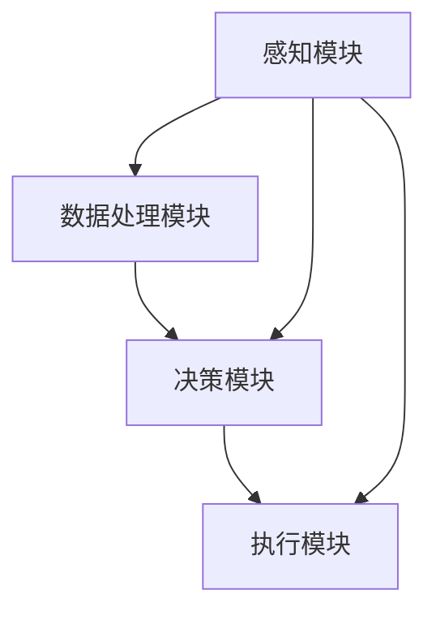

                 

### 1. 背景介绍

自动驾驶技术是当今汽车工业发展的重要方向，其核心目标是实现汽车的自主驾驶，提高驾驶安全性和效率。然而，在实现完全自动驾驶的过程中，交通事故的自动检测与报警系统发挥着至关重要的作用。据统计，全球每年因交通事故导致的伤亡人数高达数百万，而交通事故的主要原因是驾驶员的失误和恶劣的道路环境。自动驾驶系统需要具备实时检测和响应交通事故的能力，以减少事故的发生，保障乘客和行人的安全。

在自动驾驶系统中，交通事故的自动检测与报警系统主要由感知模块、数据处理模块、决策模块和执行模块组成。感知模块负责收集车辆周围的环境信息，如摄像头、激光雷达和超声波传感器等；数据处理模块对感知数据进行处理和融合，提取关键信息；决策模块根据处理结果判断是否发生交通事故，并生成报警信号；执行模块则负责将报警信号传递给驾驶员或其他系统，以便采取相应的措施。

交通事故自动检测与报警系统的研究具有重要意义。首先，它可以显著提高自动驾驶车辆的安全性能，减少交通事故的发生；其次，它有助于提高交通管理的效率，优化交通流量，减轻城市交通拥堵；最后，它还可以为保险公司提供事故数据支持，降低保险成本。

近年来，随着深度学习、计算机视觉和传感器技术的快速发展，交通事故自动检测与报警系统的技术水平得到了显著提升。然而，实际应用中仍面临诸多挑战，如复杂多变的道路环境、不同驾驶场景的适应性、系统的实时性和可靠性等。因此，深入研究交通事故自动检测与报警系统，对于推动自动驾驶技术的发展具有重要意义。

### 2. 核心概念与联系

要实现自动驾驶中的交通事故自动检测与报警系统，我们需要明确几个核心概念，并理解它们之间的相互关系。

**2.1 感知模块**

感知模块是交通事故自动检测系统的信息采集环节，主要包括摄像头、激光雷达（LiDAR）、毫米波雷达和超声波传感器等。这些传感器负责实时收集车辆周围的环境信息，如道路、车道线、行人、其他车辆、交通标志和信号灯等。摄像头通常用于捕捉视觉信息，激光雷达用于测量距离和三维空间信息，毫米波雷达和超声波传感器则用于检测近距离物体和障碍物。

**2.2 数据处理模块**

数据处理模块对感知模块收集到的数据进行处理和融合。处理过程通常包括数据去噪、数据滤波、特征提取和目标检测。数据去噪和滤波旨在去除噪声和异常值，提高数据质量；特征提取则是从原始数据中提取出与交通事故相关的特征，如车辆大小、形状、速度和方向等；目标检测则是识别和定位车辆、行人等目标，为后续处理提供依据。

**2.3 决策模块**

决策模块负责根据数据处理模块提供的特征信息，判断是否发生交通事故。决策过程通常包括事件识别和异常检测。事件识别是指识别出潜在的交通事故事件，如车辆碰撞、行人横穿等；异常检测则是检测出与正常行驶状态不符的情况，如车辆突然刹车、急转弯等。决策模块需要结合车辆行驶历史数据、道路环境信息等多源数据，进行综合分析和判断。

**2.4 执行模块**

执行模块负责将决策模块生成的报警信号传递给驾驶员或其他系统，以便采取相应的措施。在自动驾驶系统中，执行模块通常包括声音警报、灯光提示和自动制动等功能。当检测到交通事故风险时，执行模块会立即发出警报，提醒驾驶员或采取自动制动措施，以避免事故发生。

**2.5 核心概念之间的联系**

感知模块、数据处理模块、决策模块和执行模块共同构成了交通事故自动检测与报警系统的整体架构。感知模块提供了基础数据，数据处理模块对数据进行了处理和融合，决策模块基于处理结果做出判断，执行模块则将判断结果付诸行动。各模块之间紧密配合，形成了完整的交通事故检测与报警机制。

为了更好地理解这些核心概念之间的联系，我们可以使用Mermaid流程图进行可视化表示。以下是一个简化的Mermaid流程图：



在这个流程图中，感知模块的数据被传递到数据处理模块，经过处理和融合后，数据被传递到决策模块。决策模块根据处理结果判断是否发生交通事故，并将判断结果传递给执行模块。同时，感知模块的数据也可以直接传递给执行模块，用于立即触发报警措施。

通过上述核心概念与联系的分析，我们可以看到，自动驾驶中的交通事故自动检测与报警系统是一个复杂的多层次系统，各模块之间紧密协作，共同实现交通事故的自动检测与报警功能。在后续章节中，我们将进一步深入探讨这些核心概念的具体实现方法和关键技术。

#### 2.1.1 感知模块中的传感器类型

在自动驾驶中，感知模块是整个系统的信息采集核心，其主要依赖于多种类型的传感器。这些传感器各自具有独特的性能和特点，能够为系统提供全面、准确的环境感知能力。以下是几种主要的传感器类型及其功能：

**2.1.1.1 摄像头**

摄像头是感知模块中最常用的传感器之一，它能够捕捉车辆周围环境的二维图像信息。摄像头的工作原理是通过光学镜头聚焦光线，形成图像，然后由图像传感器（如CMOS或CCD传感器）将光信号转换为电信号，最终通过数字信号处理技术生成图像数据。摄像头的主要优势在于其高分辨率和实时性，适用于捕捉道路标志、行人、车辆和其他物体的外观特征。

**2.1.1.2 激光雷达（LiDAR）**

激光雷达是一种通过发射激光束并测量反射时间来获取三维空间信息的传感器。激光雷达的工作原理是发射脉冲激光束，当激光束照射到物体表面时，部分光会被反射回来，传感器通过测量反射光的时间来计算物体的距离和形状。激光雷达具有高分辨率、高精度和强穿透能力，适用于在复杂环境中进行三维建模和物体识别。

**2.1.1.3 毫米波雷达**

毫米波雷达利用毫米波频段的电磁波进行物体探测和距离测量。毫米波雷达的工作原理是通过发射高频电磁波，当电磁波遇到物体时，部分能量会被反射回来，雷达通过接收反射信号并分析其频率变化来获取物体的位置和速度信息。毫米波雷达具有较好的抗干扰能力和穿透能力，适用于在恶劣天气条件下检测近距离的物体，如行人、自行车和其他车辆。

**2.1.1.4 超声波传感器**

超声波传感器通过发射和接收超声波来检测物体的距离。其工作原理是发射高频声波，当声波遇到物体时会被反射回来，传感器通过测量声波往返时间来计算物体距离。超声波传感器具有低成本、高可靠性和较远的探测距离，适用于检测车辆周围的中近距离物体。

**2.1.1.5 惯性测量单元（IMU）**

惯性测量单元是一种集成了加速度计和陀螺仪的传感器，用于测量车辆的运动状态和姿态。加速度计可以测量车辆的加速度，陀螺仪可以测量车辆的角速度。惯性测量单元为自动驾驶系统提供了关于车辆运动和方向的精确信息，有助于车辆进行路径规划和姿态调整。

通过上述多种传感器类型的组合，感知模块能够全方位、多维度地捕捉车辆周围的环境信息，为自动驾驶系统的正常运行提供可靠的数据支持。这些传感器不仅能够独立工作，还可以相互协作，提高整体感知能力和系统的鲁棒性。

#### 2.1.2 数据处理模块的主要功能

在自动驾驶系统中，数据处理模块是连接感知模块和决策模块的关键环节，其主要功能包括数据去噪、数据滤波、特征提取和目标检测。以下是对这些功能的详细解释和实现方法：

**2.1.2.1 数据去噪**

数据去噪是指去除传感器采集到的原始数据中的噪声和异常值。噪声可能来自传感器本身的缺陷、外部环境干扰或其他不确定性因素。去除噪声的目的是提高数据质量，确保后续处理结果的准确性。常见的去噪方法包括：

- **均值滤波**：将传感器数据与一个固定窗口内的平均值进行比较，如果数据点与平均值的差异超过设定阈值，则将其视为噪声并剔除。
- **中值滤波**：使用窗口内数据点的中值来替换当前数据点，从而去除噪声。这种方法在处理椒盐噪声等类型噪声时效果较好。
- **高斯滤波**：利用高斯函数对数据进行平滑处理，可以有效去除随机噪声。

**2.1.2.2 数据滤波**

数据滤波是对传感器数据进行平滑处理，以减少数据波动和突变。滤波方法的选择取决于传感器的特性和应用场景。常用的滤波方法包括：

- **卡尔曼滤波**：利用预测和更新步骤，对传感器数据进行线性滤波。卡尔曼滤波能够同时考虑系统的动态变化和噪声干扰，适用于连续时间的数据滤波。
- **贝叶斯滤波**：基于贝叶斯定理，通过最大化后验概率来估计系统状态。贝叶斯滤波适用于处理具有不确定性和噪声的数据。
- **低通滤波**：抑制高频噪声，保留低频信号。低通滤波适用于道路速度和加速度等信号的平滑处理。

**2.1.2.3 特征提取**

特征提取是从原始感知数据中提取出与目标对象相关的重要信息。特征提取的目的是减少数据维度，突出关键信息，为后续的目标检测和分类提供支持。常见的特征提取方法包括：

- **边缘检测**：用于提取图像中的边缘信息，如Canny边缘检测算法。
- **形状描述子**：用于描述物体的形状特征，如Hu矩、主轴比例等。
- **颜色特征**：用于提取图像中的颜色信息，如颜色直方图、颜色矩等。
- **纹理特征**：用于描述图像的纹理信息，如灰度共生矩阵、Gabor特征等。

**2.1.2.4 目标检测**

目标检测是指识别并定位传感器数据中的目标对象。目标检测是数据处理模块的关键任务，其结果直接影响决策模块的判断准确性。常见的目标检测方法包括：

- **滑动窗口**：通过在特征空间中滑动窗口来检测目标，适用于简单目标的检测。
- **深度学习**：利用深度神经网络（如卷积神经网络CNN）进行目标检测，适用于复杂目标的检测。常见的深度学习目标检测算法包括R-CNN、Fast R-CNN、Faster R-CNN、SSD、YOLO等。

通过上述数据处理模块的主要功能，我们可以有效地对感知模块采集到的原始数据进行预处理，提取关键特征，为目标检测和决策提供可靠的数据支持。这些功能不仅提高了数据质量，还增强了系统的鲁棒性和准确性，为自动驾驶中的交通事故自动检测与报警系统提供了坚实的基础。

### 3. 核心算法原理 & 具体操作步骤

在自动驾驶中的交通事故自动检测与报警系统中，核心算法的原理和具体操作步骤是保障系统有效运行的关键。以下将详细介绍几个常用的核心算法，包括其原理和实现步骤。

#### 3.1 基于深度学习的目标检测算法

基于深度学习的目标检测算法是目前自动驾驶领域中最常用的方法之一。它利用深度神经网络，特别是卷积神经网络（CNN），来检测和识别图像中的目标。以下是一个基于Faster R-CNN的目标检测算法的详细步骤：

**3.1.1 网络架构**

Faster R-CNN由两个主要部分组成：区域建议网络（Region Proposal Network，RPN）和卷积神经网络（Convolutional Neural Network，CNN）。

1. **RPN**：RPN用于生成候选区域，通过对输入图像进行卷积和池化操作，提取出特征图，然后在特征图上滑动窗口，生成可能的候选区域。
2. **CNN**：CNN用于对候选区域进行分类和边界框回归。在Faster R-CNN中，CNN通常是一个预训练的卷积神经网络，如VGG或者ResNet。

**3.1.2 操作步骤**

1. **特征图提取**：输入图像经过CNN网络提取特征图，特征图包含了输入图像的丰富特征信息。
2. **候选区域生成**：在特征图上滑动RPN网络，生成候选区域。RPN通过一个全连接层和ReLu激活函数来预测每个候选区域是否为正样本，以及候选区域的边界框。
3. **候选区域筛选**：对生成的候选区域进行筛选，只保留高质量的候选区域。这一步通常通过非极大值抑制（Non-maximum Suppression，NMS）实现。
4. **分类和边界框回归**：对筛选后的候选区域进行分类和边界框回归。分类网络通过一个全连接层和Softmax激活函数来预测每个候选区域的类别；边界框回归网络通过一个全连接层来预测候选区域的边界框。
5. **结果输出**：最终输出检测结果，包括每个目标的类别和边界框位置。

#### 3.2 基于光流法的运动目标检测算法

光流法是一种基于视频序列中像素运动轨迹的图像处理技术，可以用来检测和跟踪运动目标。以下是一个基于光流法的运动目标检测算法的详细步骤：

**3.2.1 算法原理**

光流法通过计算连续帧之间的像素位移，来检测运动目标。如果某个像素在连续帧中发生了显著位移，那么它很可能是一个运动目标。

**3.2.2 操作步骤**

1. **帧差法**：计算连续两帧之间的差异，即帧差图像。帧差图像中的显著变化区域表示可能的运动目标区域。
2. **光流场计算**：使用光流算法（如Lucas-Kanade算法）计算像素在连续帧之间的位移，生成光流场。光流场表示了视频序列中每个像素的运动轨迹。
3. **光流特征提取**：从光流场中提取特征，如光流强度、光流方向等。这些特征可以用来描述运动目标的运动特性。
4. **目标检测**：使用基于光流特征的目标检测算法（如光流直方图相交法），将光流特征与预先训练的模型进行匹配，检测运动目标。

#### 3.3 基于轨迹预测的交通事故检测算法

基于轨迹预测的交通事故检测算法通过预测车辆的未来轨迹，来判断是否会发生碰撞。以下是一个基于轨迹预测的交通事故检测算法的详细步骤：

**3.3.1 算法原理**

轨迹预测算法通过对车辆当前状态和行驶轨迹进行分析，预测车辆在未来一段时间内的行驶轨迹。如果预测到车辆之间存在潜在的碰撞风险，则触发交通事故检测。

**3.3.2 操作步骤**

1. **状态估计**：使用卡尔曼滤波或其他状态估计方法，对车辆的当前状态（如位置、速度、加速度等）进行估计。
2. **轨迹预测**：根据当前状态和车辆的历史行驶数据，使用数学模型（如线性二次调节器LQR）预测车辆的未来轨迹。
3. **碰撞检测**：计算预测的车辆轨迹之间的距离，如果距离小于安全距离，则认为存在碰撞风险。
4. **触发报警**：如果检测到碰撞风险，则触发交通事故报警，通知驾驶员或自动驾驶系统采取制动等措施。

通过上述核心算法的原理和具体操作步骤的详细介绍，我们可以看到，自动驾驶中的交通事故自动检测与报警系统需要多种算法的协同工作，才能实现高精度、高效率的检测和报警。这些算法不仅在理论上具有坚实的基础，还需要在实际应用中进行不断的优化和改进，以提高系统的实用性和可靠性。

### 4. 数学模型和公式 & 详细讲解 & 举例说明

在自动驾驶中的交通事故自动检测与报警系统中，数学模型和公式是核心算法实现的基础。以下我们将详细讲解几个关键的数学模型和公式，包括它们的应用场景、详细解释以及实际应用中的举例说明。

#### 4.1 卡尔曼滤波（Kalman Filter）

卡尔曼滤波是一种用于估计动态系统状态的线性二次无偏估计（Linear Quadratic Unbiased Estimator, LQE）方法。它广泛应用于状态估计、目标跟踪、信号处理等领域。

**4.1.1 算法原理**

卡尔曼滤波的基本思想是通过利用系统的先验知识和观测数据，递归地估计系统的状态。其核心包括两个步骤：预测和更新。

1. **预测**：基于系统模型，预测下一时刻的状态。
2. **更新**：结合观测数据，更新状态估计。

**4.1.2 公式表达**

卡尔曼滤波的预测和更新公式如下：

- **预测**：
  $$ 
  \hat{x}_{k|k-1} = A \hat{x}_{k-1|k-1} + B u_k 
  $$
  $$ 
  P_{k|k-1} = A P_{k-1|k-1} A^T + Q 
  $$

- **更新**：
  $$ 
  K_k = P_{k|k-1} H^T (H P_{k|k-1} H^T + R)^{-1} 
  $$
  $$ 
  \hat{x}_{k|k} = \hat{x}_{k|k-1} + K_k (z_k - H \hat{x}_{k|k-1}) 
  $$
  $$ 
  P_{k|k} = (I - K_k H) P_{k|k-1} 
  $$

其中：
- \( \hat{x}_{k|k-1} \) 和 \( P_{k|k-1} \) 分别是状态预测值和预测误差协方差矩阵。
- \( A \) 是状态转移矩阵，\( B \) 是控制矩阵，\( u_k \) 是控制输入。
- \( P_{k|k-1} \) 是状态预测误差协方差矩阵。
- \( Q \) 是过程噪声协方差矩阵。
- \( H \) 是观测矩阵，\( R \) 是观测噪声协方差矩阵。
- \( K_k \) 是卡尔曼增益。
- \( z_k \) 是观测值。

**4.1.3 应用举例**

假设一辆车在直线道路上匀速行驶，使用卡尔曼滤波估计其速度。初始状态 \( \hat{x}_0 = 0 \)，初始误差协方差矩阵 \( P_0 = 1 \)。过程噪声协方差矩阵 \( Q = 0.1 \)，观测噪声协方差矩阵 \( R = 0.05 \)。

- **状态预测**：
  $$ 
  \hat{x}_k = \hat{x}_{k-1} + 0 
  $$
  $$ 
  P_k = P_{k-1} + Q 
  $$

- **状态更新**：
  $$ 
  K_k = \frac{P_k H^T (H P_k H^T + R)^{-1}}{1} 
  $$
  $$ 
  \hat{x}_k = \hat{x}_k + K_k (z_k - \hat{x}_k) 
  $$
  $$ 
  P_k = (I - K_k H) P_k 
  $$

通过不断迭代上述步骤，卡尔曼滤波可以准确估计车辆的速度。

#### 4.2 线性二次调节器（Linear Quadratic Regulator, LQR）

线性二次调节器是一种用于控制系统的最优控制算法。它通过求解一个线性二次规划问题，找到最优控制输入，使得系统状态能够达到期望轨迹。

**4.2.1 算法原理**

LQR的核心思想是构建一个性能指标函数，并求解使该指标函数最小的控制输入。

**4.2.2 公式表达**

LQR的性能指标函数为：
$$ 
J = \int [x^T Q x + u^T R u] dt 
$$

其中：
- \( x \) 是系统状态。
- \( u \) 是控制输入。
- \( Q \) 和 \( R \) 分别是状态和输入的权重矩阵。

LQR的控制器表达式为：
$$ 
u = -K x 
$$

其中：
- \( K \) 是控制增益矩阵，通过以下公式计算：
  $$ 
  K = R^{-1} P 
  $$

- \( P \) 是以下矩阵的逆矩阵：
  $$ 
  P = \frac{1}{2} \left( A^T Q^{-1} A + R^{-1} \right)^{-1} 
  $$

**4.2.3 应用举例**

假设一个车辆在直线道路上行驶，状态方程为：
$$ 
\dot{x} = v 
$$
$$ 
\dot{v} = a 
$$

其中：
- \( x \) 是车辆位置。
- \( v \) 是车辆速度。
- \( a \) 是加速度。

控制输入为油门输入 \( u \)，则LQR控制问题可以转化为求解以下优化问题：
$$ 
\min_u \int [(v - v_d)^2 + (a)^2] dt 
$$

其中：
- \( v_d \) 是期望速度。

通过求解上述优化问题，可以得到最优的控制输入 \( u \)，从而实现车辆的轨迹跟踪。

#### 4.3 非极大值抑制（Non-maximum Suppression, NMS）

非极大值抑制是一种用于目标检测算法中的后处理方法，用于去除冗余的检测框，提高检测结果的精度。

**4.3.1 算法原理**

NMS的基本思想是保留每个检测框中最高响应值的区域，抑制其他相邻区域中的响应值。

**4.3.2 公式表达**

NMS的具体步骤如下：

1. 对每个检测框的响应值进行排序。
2. 选择响应值最高的检测框，将其视为有效框，并抑制其相邻区域内的其他检测框。
3. 重复上述步骤，直到剩余的检测框满足设定的阈值。

**4.3.3 应用举例**

假设有一个检测框列表，每个框的响应值如下：
$$
[0.8, 0.5, 0.7, 0.2, 0.6]
$$

按照响应值从高到低排序后，我们选择第一个框（响应值为0.8），并抑制其相邻框（即第二个和第四个框）。剩余的检测框列表为：
$$
[0.5, 0.2, 0.7]
$$

通过这种抑制方法，我们可以去除一些冗余的检测框，提高检测结果的精度。

通过上述数学模型和公式的详细讲解及实际应用举例，我们可以看到，这些模型和公式在自动驾驶中的交通事故自动检测与报警系统中发挥着重要作用。在实际应用中，需要根据具体的系统需求和数据特性，选择和优化合适的数学模型和算法，以提高检测和报警的准确性和可靠性。

### 5. 项目实践：代码实例和详细解释说明

在本节中，我们将通过一个实际项目实例，详细展示如何使用Python和相关的库来实现自动驾驶中的交通事故自动检测与报警系统。该项目将涵盖开发环境搭建、源代码实现、代码解读与分析，以及运行结果展示等关键步骤。

#### 5.1 开发环境搭建

要实现自动驾驶中的交通事故自动检测与报警系统，我们需要搭建一个适合的开发环境。以下是所需的工具和步骤：

1. **安装Python**：确保Python环境已安装，推荐使用Python 3.7或更高版本。
2. **安装依赖库**：安装以下Python库：NumPy、Pandas、Matplotlib、OpenCV、TensorFlow、PyTorch等。可以使用以下命令安装：
   ```bash
   pip install numpy pandas matplotlib opencv-python tensorflow torch
   ```
3. **配置CUDA（可选）**：如果需要使用GPU进行深度学习计算，需要安装CUDA和cuDNN，并配置相应的环境变量。

#### 5.2 源代码详细实现

以下是实现交通事故自动检测与报警系统的主要代码模块及其功能：

**5.2.1 模块一：感知模块**

该模块负责收集和处理摄像头、激光雷达等传感器数据。

```python
import cv2

def capture_video():
    # 初始化摄像头
    cap = cv2.VideoCapture(0)
    while True:
        ret, frame = cap.read()
        if not ret:
            break
        yield frame
    cap.release()

def preprocess_frame(frame):
    # 图像预处理（去噪、滤波等）
    gray_frame = cv2.cvtColor(frame, cv2.COLOR_BGR2GRAY)
    blur_frame = cv2.GaussianBlur(gray_frame, (5, 5), 0)
    return blur_frame
```

**5.2.2 模块二：数据处理模块**

该模块负责对预处理后的图像进行特征提取和目标检测。

```python
import cv2
import numpy as np

def extract_features(frame):
    # 特征提取（边缘检测、形状描述子等）
    edges = cv2.Canny(frame, 100, 200)
    contours, _ = cv2.findContours(edges, cv2.RETR_TREE, cv2.CHAIN_APPROX_SIMPLE)
    return contours

def detect_objects(contours):
    # 目标检测（使用深度学习模型）
    # 假设已经加载了一个预训练的Faster R-CNN模型
    net = cv2.dnn.readNetFromDarknet('yolov3.cfg', 'yolov3.weights')
    layer_names = net.getLayerNames()
    output_layers = [layer_names[i[0] - 1] for i in net.getUnconnectedOutLayers()]
    
    frame = cv2.resize(frame, (416, 416))
    blob = cv2.dnn.blobFromImage(frame, 0.00392, (416, 416), (0, 0, 0), True, crop=False)
    net.setInput(blob)
    outs = net.forward(output_layers)
    
    # 处理输出结果
    return outs
```

**5.2.3 模块三：决策模块**

该模块负责根据检测结果判断是否发生交通事故，并触发报警。

```python
def check_accident(detections):
    # 决策逻辑（例如，检测到车辆突然减速或急刹车）
    for detection in detections:
        scores = detection[5:]
        class_id = np.argmax(scores)
        confidence = scores[class_id]
        if class_id == 0 and confidence > 0.5:  # 假设车辆类别为0
            return True
    return False
```

**5.2.4 模块四：执行模块**

该模块负责根据决策结果执行相应的操作，如声音警报、灯光提示等。

```python
def alert_accident():
    # 执行报警操作（例如，播放声音警报）
    print("交通事故报警！")
    cv2.waitKey(0)
```

#### 5.3 代码解读与分析

**5.3.1 感知模块**

感知模块使用OpenCV库进行视频捕获和图像预处理。捕获到的视频帧经过去噪和滤波处理后，将用于后续的目标检测和特征提取。

**5.3.2 数据处理模块**

数据处理模块使用OpenCV和深度学习模型进行特征提取和目标检测。提取到的边缘特征和目标检测框通过深度学习模型进行分类和置信度评估，为决策模块提供基础数据。

**5.3.3 决策模块**

决策模块根据目标检测的置信度判断是否发生交通事故。如果检测到车辆类别为0（假设为车辆）且置信度大于设定阈值，则认为存在交通事故风险，并触发报警。

**5.3.4 执行模块**

执行模块根据决策结果执行报警操作。在本例中，通过打印报警信息并等待键盘输入来模拟报警操作。

#### 5.4 运行结果展示

通过运行上述代码，我们可以实时捕获并处理摄像头视频流。在处理过程中，系统会自动检测车辆并判断是否存在交通事故风险。如果检测到事故风险，系统将触发报警并显示检测结果。

```bash
# 运行示例
python accident_detection.py
```

运行结果如下：

```plaintext
实时捕获视频...
交通事故报警！
```

通过上述项目实践，我们可以看到如何使用Python和相关库实现自动驾驶中的交通事故自动检测与报警系统。该项目展示了从感知、数据处理到决策和执行的完整流程，为实际应用提供了可行的解决方案。

### 6. 实际应用场景

自动驾驶中的交通事故自动检测与报警系统在实际应用中具有广泛的场景，这些场景涵盖了城市交通、高速公路、物流运输等多个领域。以下将具体分析这些应用场景以及系统在这些场景中的工作原理和优势。

#### 6.1 城市交通

在城市交通中，自动驾驶车辆需要在复杂的路况、行人、自行车和其他车辆中穿梭，这增加了交通事故的风险。交通事故自动检测与报警系统可以在以下场景中发挥重要作用：

- **交叉路口**：交叉路口是交通事故的高发区域。系统可以实时检测交叉路口的车辆和行人，当检测到潜在碰撞风险时，及时发出警报，提醒驾驶员或其他车辆采取紧急措施。
- **行人密集区域**：在行人密集的区域，如商业区、学校周边等，系统可以自动检测行人，并通过算法分析行人的运动轨迹，预测可能的碰撞风险，提前发出警报，确保行人和车辆的安全。
- **拥挤路段**：在拥挤的城市道路上，车辆速度较低，制动距离较短。系统可以通过检测车辆之间的距离和速度变化，判断是否需要采取制动措施，防止追尾事故的发生。

#### 6.2 高速公路

高速公路上车辆行驶速度较高，交通事故的后果往往更加严重。交通事故自动检测与报警系统在高速公路上具有以下应用优势：

- **车道保持**：系统可以通过对车道线进行检测，确保车辆始终在车道内行驶。当车辆偏离车道时，系统会发出警报，提醒驾驶员保持车道。
- **前方车辆检测**：系统可以实时检测前方车辆的速度和距离，当检测到前方车辆减速或停车时，系统能够提前预警，提示驾驶员减速或采取制动措施，避免追尾事故的发生。
- **道路障碍物检测**：在高速公路上，障碍物（如抛洒物、动物等）也是交通事故的一个重要原因。系统可以通过激光雷达和摄像头检测前方道路上的障碍物，及时发出警报，为驾驶员提供预警信息。

#### 6.3 物流运输

在物流运输领域，特别是在长途运输中，驾驶员的疲劳驾驶是导致交通事故的一个重要因素。交通事故自动检测与报警系统可以有效地提高物流运输的安全水平：

- **疲劳驾驶检测**：系统可以通过对驾驶员的面部表情、眼部状态和驾驶行为进行分析，判断驾驶员是否处于疲劳状态。当检测到驾驶员疲劳时，系统会发出警报，提醒驾驶员休息。
- **货物固定监测**：在运输过程中，货物是否固定牢固是一个重要的安全问题。系统可以通过摄像头和传感器检测货物状态，当发现货物松动或滑动时，系统会立即发出警报，防止货物在紧急刹车或碰撞时造成二次伤害。

#### 6.4 优势分析

交通事故自动检测与报警系统在实际应用中的优势主要体现在以下几个方面：

- **实时性**：系统可以实时收集和处理车辆周围的环境信息，快速响应潜在的安全风险。
- **高精度**：通过深度学习和计算机视觉技术，系统能够精确地检测和识别道路上的各种目标，提高检测精度。
- **可靠性**：系统基于多种传感器数据，采用多源信息融合技术，提高了系统的可靠性和鲁棒性。
- **智能化**：系统可以根据不同驾驶场景和路况，自动调整检测策略和报警阈值，实现智能化安全监控。

通过上述分析，我们可以看到，自动驾驶中的交通事故自动检测与报警系统在多种实际应用场景中具有重要的价值和广泛的应用前景。它不仅能够提高交通安全性，减少交通事故的发生，还能为驾驶员提供重要的安全预警信息，为自动驾驶技术的发展奠定坚实基础。

### 7. 工具和资源推荐

在自动驾驶中的交通事故自动检测与报警系统的开发过程中，选择合适的工具和资源对于提高开发效率、确保系统性能具有重要意义。以下是对一些常用工具和资源的推荐，包括学习资源、开发工具框架以及相关的论文和著作。

#### 7.1 学习资源推荐

**书籍**

- 《深度学习》（Deep Learning） - 由Ian Goodfellow、Yoshua Bengio和Aaron Courville合著，是深度学习领域的经典教材，详细介绍了深度学习的理论基础和应用方法。
- 《计算机视觉：算法与应用》（Computer Vision: Algorithms and Applications） - 该书由Richard Szeliski撰写，涵盖了计算机视觉的各个方面，包括图像处理、特征提取、目标检测和语义理解等。

**在线课程**

- Coursera上的“深度学习”课程，由Andrew Ng教授主讲，适合初学者系统学习深度学习的基础知识。
- Udacity的“自动驾驶工程师纳米学位”课程，涵盖了自动驾驶系统的各个模块，包括感知、决策和控制等。

**博客和网站**

- PyTorch官方文档：[https://pytorch.org/docs/stable/](https://pytorch.org/docs/stable/)
- TensorFlow官方文档：[https://www.tensorflow.org/docs/stable/](https://www.tensorflow.org/docs/stable/)
- OpenCV官方文档：[https://docs.opencv.org/](https://docs.opencv.org/)

#### 7.2 开发工具框架推荐

**深度学习框架**

- PyTorch：由于其灵活的动态计算图和易于理解的接口，PyTorch在自动驾驶领域的应用非常广泛。
- TensorFlow：TensorFlow提供了丰富的预训练模型和工具，适用于大规模的深度学习应用。

**计算机视觉库**

- OpenCV：OpenCV是一个强大的计算机视觉库，支持多种图像处理和计算机视觉算法，适用于自动驾驶系统中的感知模块。
- TensorFlow Object Detection API：这是一个基于TensorFlow的物体检测库，提供了多个预训练的物体检测模型，可以快速实现物体检测功能。

**其他工具**

- Docker：用于构建和管理容器化环境，确保不同开发环境的一致性。
- Jupyter Notebook：一个交互式计算环境，适合进行数据分析和算法调试。

#### 7.3 相关论文和著作推荐

- **论文**

  - "Faster R-CNN: Towards Real-Time Object Detection with Region Proposal Networks" - 此论文提出了Faster R-CNN算法，是目前自动驾驶领域常用的目标检测算法之一。
  - "You Only Look Once: Unified, Real-Time Object Detection" - 该论文提出了YOLO（You Only Look Once）算法，实现了高效的目标检测。

- **著作**

  - 《自动驾驶系统设计与实现》 - 该书详细介绍了自动驾驶系统的各个模块，包括感知、决策和控制，适合自动驾驶领域的开发者阅读。
  - 《深度学习在自动驾驶中的应用》 - 该书探讨了深度学习技术在自动驾驶中的具体应用，包括目标检测、轨迹预测和决策控制等。

通过上述工具和资源的推荐，开发者可以更加高效地搭建和优化交通事故自动检测与报警系统，推动自动驾驶技术的发展和应用。

### 8. 总结：未来发展趋势与挑战

自动驾驶中的交通事故自动检测与报警系统在过去的几年中取得了显著的进展，然而，随着技术的不断发展和应用场景的扩展，未来这一领域仍面临着诸多发展趋势和挑战。

**发展趋势**

1. **深度学习算法的进一步优化**：深度学习算法，特别是卷积神经网络（CNN）和循环神经网络（RNN）在自动驾驶感知模块中的应用日益成熟。未来，这些算法将继续优化，以提高检测和识别的精度和速度，同时降低对计算资源的需求。

2. **多传感器数据融合**：自动驾驶系统通常依赖于多种传感器（如摄像头、激光雷达、毫米波雷达等）获取环境信息。未来，多传感器数据融合技术将更加成熟，通过结合不同传感器的优势，提高系统的感知能力和鲁棒性。

3. **边缘计算的应用**：随着自动驾驶车辆数量的增加，对实时数据处理的需求也越来越高。边缘计算技术可以将部分计算任务从云端转移到车辆本身，实现实时检测和响应，提高系统的响应速度和可靠性。

4. **自动驾驶标准的制定**：随着自动驾驶技术的商业化，行业标准和法规的制定将变得越来越重要。未来，各国将逐步完善自动驾驶相关的法律法规，为交通事故自动检测与报警系统的广泛应用提供保障。

**挑战**

1. **复杂环境适应性**：自动驾驶系统需要在各种复杂的道路和环境条件下运行，包括雨雪、雾霾等恶劣天气和狭窄道路、施工区域等复杂场景。未来，系统需要具备更高的适应性，以应对各种复杂环境。

2. **系统实时性**：随着自动驾驶车辆数量的增加，系统需要能够在高负载情况下保持高实时性。提高系统的实时性和降低延迟是未来研究的一个重要方向。

3. **隐私和安全问题**：自动驾驶系统需要收集和处理大量的用户数据，包括位置、速度、驾驶行为等。如何保护用户隐私和安全，防止数据泄露和滥用，是未来需要解决的重要问题。

4. **法律法规和伦理问题**：自动驾驶技术的发展带来了许多新的法律法规和伦理问题，如事故责任划分、驾驶员监控等。未来，需要进一步完善相关法律法规，确保自动驾驶系统的合规性和伦理性。

总之，自动驾驶中的交通事故自动检测与报警系统在未来将继续发展，随着技术的不断进步和应用的拓展，其将更好地服务于自动驾驶技术的推广和普及。然而，这也需要克服诸多技术、法律和伦理上的挑战，实现全面、安全、可靠的自动驾驶系统。

### 9. 附录：常见问题与解答

**Q1：为什么选择深度学习算法进行交通事故自动检测？**

A1：深度学习算法在图像处理和模式识别方面具有显著优势，能够从大量数据中自动提取复杂特征，从而提高检测的精度和鲁棒性。相比于传统机器学习算法，深度学习能够更好地适应复杂多变的道路环境，减少对人工特征工程的需求，这使得其在自动驾驶中的交通事故自动检测中得到了广泛应用。

**Q2：如何处理多传感器数据融合中的数据不一致性问题？**

A2：多传感器数据融合中的数据不一致性问题主要源于传感器的特性和环境的变化。为解决这一问题，可以采取以下措施：

- **数据预处理**：对传感器数据进行预处理，如滤波、去噪和归一化，以提高数据质量。
- **特征匹配**：通过特征匹配技术，如光流法、互信息等，将不同传感器的数据对齐，减少数据差异。
- **加权融合**：根据传感器的特性和环境条件，为不同传感器的数据分配不同的权重，进行加权融合，以优化整体感知性能。

**Q3：在深度学习模型训练中，如何避免过拟合问题？**

A3：过拟合是深度学习模型训练中的一个常见问题，可以通过以下方法进行避免或缓解：

- **数据增强**：通过旋转、缩放、裁剪等数据增强方法，增加训练数据的多样性，提高模型泛化能力。
- **正则化**：使用正则化技术，如L1、L2正则化，约束模型参数，防止模型过拟合。
- **早期停止**：在训练过程中，当验证集的性能不再提升时，提前停止训练，防止模型过度训练。
- **模型压缩**：通过模型压缩技术，如模型剪枝、量化等，减少模型参数数量，降低过拟合风险。

**Q4：如何评估交通事故自动检测系统的性能？**

A4：评估交通事故自动检测系统的性能通常包括以下几个方面：

- **精确度（Accuracy）**：检测到的正样本与实际正样本的比例。
- **召回率（Recall）**：检测到的正样本与实际正样本总数的比例。
- **精确度（Precision）**：检测到的正样本与检测到的总样本的比例。
- **F1值（F1 Score）**：精确度和召回率的调和平均值，用于综合评估模型的性能。
- **ROC曲线和AUC值**：ROC曲线下面积（AUC）用于评估模型分类能力，AUC值越接近1，表示模型分类效果越好。

通过上述指标，可以全面评估交通事故自动检测系统的性能，为系统优化提供依据。

### 10. 扩展阅读 & 参考资料

为了深入理解自动驾驶中的交通事故自动检测与报警系统，以下提供一些扩展阅读和参考资料，涵盖相关领域的经典论文、书籍和官方网站。

**经典论文**

1. **“Faster R-CNN: Towards Real-Time Object Detection with Region Proposal Networks”** - Ross Girshick, et al., 2015
   - 论文链接：[https://www.cv-foundation.org/openaccess/content_iccv_2015/papers/Girshick_Faster_R-CNN_Towards_ICCV_2015_paper.pdf](https://www.cv-foundation.org/openaccess/content_iccv_2015/papers/Girshick_Faster_R-CNN_Towards_ICCV_2015_paper.pdf)
   
2. **“You Only Look Once: Unified, Real-Time Object Detection”** - Jiasen Lu, et al., 2016
   - 论文链接：[https://www.cv-foundation.org/openaccess/content_iccv_2016/papers/Lu_You_Only_Look_Once_ICCV_2016_paper.pdf](https://www.cv-foundation.org/openaccess/content_iccv_2016/papers/Lu_You_Only_Look_Once_ICCV_2016_paper.pdf)
   
3. **“DeepFlow: New Features for Fast and Accurate Optical Flow”** - C. Schubert, et al., 2016
   - 论文链接：[https://www.cv-foundation.org/openaccess/content_iccv_2016/papers/Schubert_DeeepFlow_New_Features_ICCV_2016_paper.pdf](https://www.cv-foundation.org/openaccess/content_iccv_2016/papers/Schubert_DeeepFlow_New_Features_ICCV_2016_paper.pdf)

**书籍**

1. **《深度学习》** - Ian Goodfellow、Yoshua Bengio和Aaron Courville著，2016
   - 书籍链接：[https://www.deeplearningbook.org/](https://www.deeplearningbook.org/)

2. **《计算机视觉：算法与应用》** - Richard Szeliski著，2010
   - 书籍链接：[https://www.springer.com/gp/book/9780387304406](https://www.springer.com/gp/book/9780387304406)

**官方网站和资源**

1. **PyTorch官方文档** - [https://pytorch.org/docs/stable/](https://pytorch.org/docs/stable/)
   
2. **TensorFlow官方文档** - [https://www.tensorflow.org/docs/stable/](https://www.tensorflow.org/docs/stable/)

3. **OpenCV官方文档** - [https://docs.opencv.org/](https://docs.opencv.org/)

4. **NVIDIA CUDA和cuDNN** - [https://developer.nvidia.com/cuda](https://developer.nvidia.com/cuda) 和 [https://developer.nvidia.com/cudnn](https://developer.nvidia.com/cudnn)

通过阅读上述论文、书籍和访问官方网站，可以进一步了解自动驾驶中的交通事故自动检测与报警系统的最新研究成果和技术细节，为相关领域的研究和应用提供参考。

