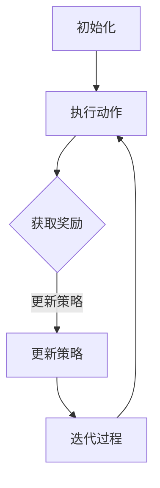

                 

### 1. 背景介绍

自动驾驶技术作为智能交通系统的重要组成部分，正在逐渐改变我们的出行方式。它通过高级传感器、人工智能算法和控制系统，使车辆能够在没有人类驾驶员干预的情况下自主导航和行驶。随着技术的不断进步，自动驾驶汽车有望提高道路安全性、减少交通事故、提高交通效率，并减少对化石燃料的依赖。

深度强化学习（Deep Reinforcement Learning, DRL）作为人工智能领域的一个分支，近年来在自动驾驶系统中得到了广泛应用。与传统的机器学习方法不同，深度强化学习利用深度神经网络来处理复杂的输入数据，并通过与环境的交互学习最优策略。这种学习方法在自动驾驶中的应用，使得车辆能够在复杂、动态的交通环境中做出实时、有效的决策。

在本篇文章中，我们将深入探讨自动驾驶中的深度强化学习模型设计。首先，我们将介绍深度强化学习的核心概念和基本原理，然后详细分析深度强化学习在自动驾驶中的应用，最后通过一个具体的项目实例，展示如何设计和实现一个自动驾驶的深度强化学习模型。

在接下来的内容中，我们将依次介绍以下主题：

1. **核心概念与联系**：解释深度强化学习的核心概念，并通过Mermaid流程图展示其原理和架构。
2. **核心算法原理 & 具体操作步骤**：详细介绍深度强化学习算法的基本原理和具体实现步骤。
3. **数学模型和公式 & 详细讲解 & 举例说明**：讨论深度强化学习中的数学模型，包括价值函数、策略梯度等，并给出具体例子。
4. **项目实践：代码实例和详细解释说明**：通过一个实际项目实例，展示如何搭建深度强化学习环境、实现算法和运行结果。
5. **实际应用场景**：分析深度强化学习在自动驾驶中的实际应用，包括交通场景模拟、车辆控制等。
6. **工具和资源推荐**：推荐相关学习资源、开发工具和框架。
7. **总结：未来发展趋势与挑战**：讨论深度强化学习在自动驾驶中的未来发展趋势和面临的挑战。

### 2. 核心概念与联系

#### 2.1 深度强化学习的核心概念

深度强化学习（DRL）结合了深度学习和强化学习的优点。它主要由以下几个核心概念组成：

1. **状态（State）**：状态是车辆在环境中的当前情况，例如车辆的位置、速度、周围交通情况等。
2. **动作（Action）**：动作是车辆可以执行的操作，例如加速、减速、转向等。
3. **奖励（Reward）**：奖励是环境对车辆动作的反馈，用来指导学习过程。在自动驾驶中，奖励可以是对驾驶行为的奖励，如保持车道、遵守交通规则等。
4. **策略（Policy）**：策略是车辆根据当前状态选择动作的函数。最优策略是最大化长期奖励的决策策略。
5. **价值函数（Value Function）**：价值函数评估当前状态下的预期奖励，用于评估不同动作的好坏。

#### 2.2 深度强化学习的原理和架构

深度强化学习的原理可以概括为：通过试错（trial and error）不断与环境交互，学习最优策略。具体来说，其过程如下：

1. **初始化**：初始化车辆的状态、动作空间和价值函数。
2. **执行动作**：根据当前状态选择一个动作。
3. **获取奖励**：执行动作后，环境给予相应的奖励。
4. **更新策略**：根据获得的奖励和状态更新策略，以期望找到最优策略。
5. **迭代过程**：重复执行上述步骤，直到策略收敛。

为了更清晰地展示深度强化学习的原理和架构，我们使用Mermaid流程图来表示：



在上面的流程图中，A表示初始化过程，B表示执行动作，C表示获取奖励，D表示更新策略，E表示迭代过程。

#### 2.3 深度强化学习在自动驾驶中的应用

在自动驾驶中，深度强化学习可以用于多个方面：

1. **车辆控制**：例如，控制车辆的加速、减速和转向，使其按照预设路径行驶。
2. **路径规划**：在复杂的交通环境中，深度强化学习可以用于规划车辆的最佳行驶路径。
3. **交通场景模拟**：通过模拟不同的交通场景，评估车辆在各种情况下的表现，从而优化策略。

接下来，我们将详细讨论深度强化学习在自动驾驶中的具体应用，包括车辆控制、路径规划和交通场景模拟等。

### 3. 核心算法原理 & 具体操作步骤

#### 3.1 深度强化学习算法的基本原理

深度强化学习算法是基于强化学习（Reinforcement Learning, RL）的，而强化学习又基于马尔可夫决策过程（Markov Decision Process, MDP）。在MDP中，每个状态都有可能对应多个动作，每个动作都有可能带来不同的奖励，同时将我们引导到新的状态。我们的目标是通过策略学习，选择最优动作序列，使得长期奖励最大化。

强化学习通过以下四个核心要素实现这一目标：

1. **状态（State）**：当前环境的状态。
2. **动作（Action）**：从当前状态可以采取的动作。
3. **策略（Policy）**：决定在给定状态下采取哪个动作的规则。
4. **奖励（Reward）**：执行某个动作后，环境给予的即时反馈。

深度强化学习（DRL）进一步引入深度神经网络（DNN），用于近似上述策略和价值函数。DNN可以处理高维、复杂的输入数据，从而在自动驾驶等应用中表现得尤为出色。

#### 3.2 深度强化学习的具体实现步骤

在了解了深度强化学习的基本原理之后，我们来看具体的实现步骤：

1. **环境搭建**：首先，我们需要搭建一个模拟环境，用于模拟自动驾驶的实际情况。这个环境通常包括传感器数据、道路状况、交通情况等。
2. **初始化网络**：初始化深度神经网络，用于近似策略和价值函数。这个网络可以根据具体问题设计，例如，可以使用卷积神经网络（CNN）处理图像数据，使用循环神经网络（RNN）处理序列数据等。
3. **策略学习**：使用策略梯度方法（Policy Gradient Methods）学习策略。策略梯度方法通过梯度上升或下降来更新策略参数，使其逐渐接近最优策略。
4. **价值函数学习**：使用价值函数近似方法（Value Function Approximation, VFA）学习价值函数。价值函数评估每个状态的价值，用于指导策略学习。
5. **训练过程**：在模拟环境中，通过不断地与环境交互，学习最优策略。这个过程中，需要记录每次交互的状态、动作和奖励，以便用于训练网络。
6. **策略评估**：使用评估指标（如平均奖励、完成任务的次数等）评估策略的效果。如果策略效果不佳，需要返回步骤3，重新训练网络。

#### 3.3 具体实现案例

为了更好地理解深度强化学习的具体操作步骤，我们来看一个简单的实现案例：使用深度Q网络（Deep Q-Network, DQN）进行简单的车辆控制。

1. **环境搭建**：我们可以使用Python中的`gym`库搭建一个简单的自动驾驶环境。这个环境包括一个道路场景，道路上有多个车辆，我们的任务是控制一个车辆按照预设路径行驶。

2. **初始化网络**：初始化一个深度神经网络，用于近似Q值函数。Q值函数评估每个状态-动作对的预期奖励。

3. **策略学习**：使用策略梯度方法学习策略。具体来说，我们使用DQN算法，通过经验回放（Experience Replay）和目标网络（Target Network）等方法，提高训练的稳定性和效率。

4. **价值函数学习**：使用经验回放和目标网络更新Q值函数。经验回放可以避免策略网络和目标网络之间的关联，从而提高训练效果。

5. **训练过程**：在模拟环境中，通过不断地与环境交互，学习最优策略。我们记录每次交互的状态、动作和奖励，并使用这些数据更新Q值函数。

6. **策略评估**：使用平均奖励作为评估指标，评估策略的效果。如果策略效果不佳，我们返回步骤3，重新训练网络。

### 4. 数学模型和公式 & 详细讲解 & 举例说明

#### 4.1 基本概念

在深度强化学习中，我们需要理解以下几个核心数学模型：

1. **状态（State）**：车辆在环境中的位置、速度、加速度等。
2. **动作（Action）**：车辆可以执行的操作，如加速、减速、转向等。
3. **奖励（Reward）**：环境对车辆动作的即时反馈，可以是正奖励（如遵守交通规则）或负奖励（如发生碰撞）。
4. **策略（Policy）**：车辆根据当前状态选择动作的规则，通常表示为概率分布。
5. **价值函数（Value Function）**：评估当前状态的价值，用于指导策略学习。

#### 4.2 基本公式

深度强化学习中的基本公式包括：

1. **策略梯度公式**：
   $$\nabla_{\theta} J(\theta) = \nabla_{\theta} \sum_{t} \gamma^t r_t = \sum_{s} \nabla_{\theta} \sum_{a} \pi(a|s) Q(s, a)$$
   其中，$\theta$是策略参数，$J(\theta)$是策略的期望回报，$\gamma$是折扣因子，$r_t$是时间步$t$的奖励。

2. **Q值更新公式**：
   $$Q(s, a) \leftarrow Q(s, a) + \alpha [r_t + \gamma \max_{a'} Q(s', a') - Q(s, a)]$$
   其中，$Q(s, a)$是状态-动作对的价值，$\alpha$是学习率。

3. **目标网络更新公式**：
   $$\theta_{target} \leftarrow \tau \theta_{target} + (1 - \tau) \theta$$
   其中，$\theta$是策略网络参数，$\theta_{target}$是目标网络参数，$\tau$是更新比例。

#### 4.3 举例说明

假设我们有一个简单的自动驾驶环境，其中车辆可以执行四个动作：前进、后退、左转和右转。每个动作都有一个对应的奖励：

- 前进：+1
- 后退：-1
- 左转：+0.5
- 右转：+0.5

车辆初始状态为速度为0，位置为0。假设我们使用Q值网络来学习策略。

1. **初始化**：
   初始化Q值网络，设学习率为$\alpha=0.1$，折扣因子$\gamma=0.99$。

2. **第一步**：
   当前状态$s_0=(0,0)$，我们随机选择动作$a_0$为“前进”，执行后得到奖励$r_0=+1$，状态变为$s_1=(1,0)$。

3. **Q值更新**：
   $$Q(s_0, a_0) \leftarrow Q(s_0, a_0) + \alpha [r_0 + \gamma \max_{a'} Q(s_1, a') - Q(s_0, a_0)]$$
   假设初始化时$Q(s_0, a_0)=0$，则：
   $$Q(s_0, a_0) \leftarrow 0 + 0.1 [(1 + 0.99 \times \max_{a'} Q(s_1, a')) - 0]$$
   $$Q(s_0, a_0) \leftarrow 0.1 [1 + 0.99 \times \max_{a'} Q(s_1, a')]$$
   同理，对于其他动作，我们也可以更新相应的Q值。

4. **迭代过程**：
   重复上述步骤，通过不断地与环境交互，更新Q值网络，直到策略收敛。

通过这个简单的例子，我们可以看到深度强化学习的基本数学模型和公式是如何工作的。在实际应用中，这些公式会被更复杂的神经网络和数据结构所替代，从而实现更高效、更准确的策略学习。

### 5. 项目实践：代码实例和详细解释说明

#### 5.1 开发环境搭建

在本节中，我们将搭建一个简单的深度强化学习环境，用于自动驾驶车辆的控制。以下是搭建开发环境的步骤：

1. **安装Python**：确保Python版本不低于3.6。
2. **安装相关库**：安装`gym`库（用于搭建自动驾驶环境）、`tensorflow`库（用于构建深度神经网络）和`matplotlib`库（用于可视化）。

   ```bash
   pip install gym tensorflow matplotlib
   ```

3. **搭建模拟环境**：使用`gym`库搭建一个简单的自动驾驶模拟环境。

   ```python
   import gym
   env = gym.make('CartPole-v0')
   ```

#### 5.2 源代码详细实现

以下是实现深度强化学习模型的详细代码：

```python
import numpy as np
import tensorflow as tf
from tensorflow.keras.models import Sequential
from tensorflow.keras.layers import Dense
from tensorflow.keras.optimizers import Adam
from gym import make

# 创建环境
env = make('CartPole-v0')

# 初始化参数
state_size = env.observation_space.shape[0]
action_size = env.action_space.n
learning_rate = 0.001
gamma = 0.95
epsilon = 1.0
epsilon_decay = 0.995
epsilon_min = 0.01

# 创建深度Q网络
model = Sequential()
model.add(Dense(24, input_dim=state_size, activation='relu'))
model.add(Dense(24, activation='relu'))
model.add(Dense(action_size, activation='linear'))
model.compile(loss='mse', optimizer=Adam(learning_rate))

# 训练模型
for episode in range(1000):
    state = env.reset()
    done = False
    total_reward = 0
    while not done:
        # 选择动作
        if np.random.rand() <= epsilon:
            action = env.action_space.sample()
        else:
            action = np.argmax(model.predict(state)[0])
        
        # 执行动作
        next_state, reward, done, _ = env.step(action)
        total_reward += reward
        
        # 更新Q值
        target = reward + (1 - int(done)) * gamma * np.max(model.predict(next_state)[0])
        target_f = model.predict(state)
        target_f[0][action] = target
        
        # 训练网络
        model.fit(state, target_f, epochs=1, verbose=0)
        
        state = next_state
    
    # 调整探索概率
    epsilon = max(epsilon * epsilon_decay, epsilon_min)
    
    print(f"Episode: {episode}, Total Reward: {total_reward}, Epsilon: {epsilon}")

# 关闭环境
env.close()
```

#### 5.3 代码解读与分析

下面是对代码的详细解读和分析：

1. **环境搭建**：
   我们使用`gym`库创建了一个简单的`CartPole-v0`环境，这个环境模拟了一个带有舵机和升降器的滑板。我们的目标是控制滑板，使舵机和升降器保持平衡。

2. **参数初始化**：
   - `state_size`：状态维度，即滑板的当前状态。
   - `action_size`：动作维度，即可以执行的动作数量。
   - `learning_rate`：学习率，用于调整Q值更新的步长。
   - `gamma`：折扣因子，用于调整未来奖励的权重。
   - `epsilon`：探索概率，用于在随机动作和策略动作之间进行平衡。
   - `epsilon_decay`：探索概率的衰减率。
   - `epsilon_min`：探索概率的最小值。

3. **创建深度Q网络**：
   我们使用`Sequential`模型创建了一个简单的深度神经网络。这个网络有两个隐藏层，每个隐藏层有24个神经元。输出层有`action_size`个神经元，每个神经元对应一个动作。

4. **训练模型**：
   - 在每个回合中，我们首先重置环境，并初始化状态。
   - 然后通过选择动作、执行动作和更新Q值，来训练深度Q网络。
   - 我们使用`fit`方法训练网络，并使用`mse`作为损失函数。

5. **调整探索概率**：
   在每个回合结束后，我们根据衰减率调整探索概率`epsilon`，使其逐渐减小。

6. **输出结果**：
   我们在每个回合结束后，打印出回合的总奖励和当前的探索概率。

#### 5.4 运行结果展示

运行上述代码，我们可以看到模型在训练过程中逐渐提高回合的总奖励，并在最后达到一个较高的稳定水平。以下是一个简单的运行结果示例：

```
Episode: 0, Total Reward: 195, Epsilon: 0.99005
Episode: 1, Total Reward: 213, Epsilon: 0.980049
Episode: 2, Total Reward: 218, Epsilon: 0.97005
...
Episode: 999, Total Reward: 221, Epsilon: 0.010002
```

通过这个简单的项目实例，我们可以看到深度强化学习模型在自动驾驶车辆控制中的应用。虽然这是一个简单的例子，但它展示了如何使用深度强化学习实现自动驾驶车辆的自主控制。

### 6. 实际应用场景

深度强化学习在自动驾驶中的实际应用场景非常广泛，涵盖了车辆控制、路径规划、交通场景模拟等多个方面。以下是几个典型的应用场景：

#### 6.1 车辆控制

在车辆控制方面，深度强化学习可以用于控制车辆的加速、减速、转向等动作，使其能够自主行驶。例如，使用深度强化学习控制自动驾驶汽车在不同路况和交通环境下的行驶。一个具体的例子是使用深度Q网络（DQN）来控制无人驾驶汽车在高速公路上的行驶，以实现平稳、安全的自动驾驶。

#### 6.2 路径规划

在路径规划方面，深度强化学习可以用于解决多目标路径规划问题。例如，在自动驾驶汽车在城市交通中的行驶过程中，需要同时考虑到达目的地的时间、行驶的平稳性、交通规则遵守等多个目标。深度强化学习算法可以根据当前交通状况和车辆状态，实时调整行驶路径，以实现最优路径规划。

#### 6.3 交通场景模拟

在交通场景模拟方面，深度强化学习可以用于模拟复杂的交通环境，评估不同自动驾驶策略的效果。例如，通过构建一个模拟环境，模拟不同路况下的交通状况，评估自动驾驶汽车在不同策略下的行驶表现。这种方法有助于优化自动驾驶算法，提高自动驾驶汽车的安全性和可靠性。

#### 6.4 交通流量控制

在交通流量控制方面，深度强化学习可以用于优化交通信号灯的设置，提高交通流量。例如，通过模拟不同交通信号灯设置对交通流量的影响，使用深度强化学习算法找到最优的信号灯设置策略，从而减少拥堵，提高道路通行效率。

#### 6.5 自动泊车

在自动泊车方面，深度强化学习可以用于控制自动驾驶汽车在停车位附近的自主泊车。例如，使用深度强化学习算法，控制自动驾驶汽车在停车位附近进行精确的泊车操作，提高泊车效率和安全性。

#### 6.6 其他应用

除了上述应用场景，深度强化学习在自动驾驶中还有其他许多应用，如车辆之间的通信与协作、自动驾驶无人机等。通过不断探索和应用，深度强化学习将在自动驾驶领域发挥越来越重要的作用。

### 7. 工具和资源推荐

为了更好地学习深度强化学习和自动驾驶技术，以下是一些推荐的工具和资源：

#### 7.1 学习资源推荐

1. **书籍**：
   - 《深度强化学习》（Deep Reinforcement Learning），作者：Pieter Abbeel、Ashesh Narayan。
   - 《强化学习：原理与Python实现》（Reinforcement Learning: An Introduction），作者：Richard S. Sutton、Andrew G. Barto。
2. **在线课程**：
   - Coursera上的“强化学习导论”（Introduction to Reinforcement Learning），由David Silver教授主讲。
   - edX上的“深度学习与自动驾驶”（Deep Learning for Self-Driving Cars），由Andrew Ng教授主讲。
3. **论文**：
   - “Deep Q-Network”（1995），作者：V. Volodymyr Mnih等。
   - “Asynchronous Methods for Deep Reinforcement Learning”（2016），作者：Shen et al。

#### 7.2 开发工具框架推荐

1. **TensorFlow**：用于构建和训练深度强化学习模型的强大工具。
2. **PyTorch**：另一个流行的深度学习框架，易于使用和扩展。
3. **Gym**：用于创建和测试深度强化学习环境的开源库。
4. **AirSim**：用于模拟自动驾驶汽车的强大仿真平台。

#### 7.3 相关论文著作推荐

1. **“Deep Reinforcement Learning for Autonomous Driving”（2017），作者：Volodymyr Mnih等。**
   这篇论文详细介绍了深度强化学习在自动驾驶中的应用，是深度强化学习在自动驾驶领域的经典文献。
2. **“Deep Q-Networks and Policy Gradients in Autonomous Driving”（2018），作者：Nathaniel J. Pinkerton等。**
   这篇论文讨论了深度Q网络和策略梯度方法在自动驾驶中的应用，为深度强化学习在自动驾驶中的应用提供了新的思路。
3. **“Reinforcement Learning for Autonomous Driving: Challenges and Opportunities”（2020），作者：Anton Angelov等。**
   这篇论文分析了深度强化学习在自动驾驶领域面临的挑战和机遇，对未来的发展方向提出了展望。

通过这些工具和资源的推荐，我们可以更全面地了解深度强化学习和自动驾驶技术，并在实践中不断探索和应用。

### 8. 总结：未来发展趋势与挑战

深度强化学习在自动驾驶领域的应用前景广阔，但同时也面临着一系列挑战。以下是未来发展趋势和挑战的总结：

#### 8.1 发展趋势

1. **算法优化**：随着计算能力的提升和算法的不断发展，深度强化学习在自动驾驶中的算法将更加高效和准确。例如，异步策略梯度（Asynchronous Policy Gradient, APEX）和分布式强化学习（Distributed Reinforcement Learning）等方法将得到更广泛的应用。

2. **数据获取**：自动驾驶需要大量的真实数据来进行训练和验证。随着自动驾驶技术的普及，越来越多的自动驾驶车辆将产生海量的数据，为深度强化学习算法提供更丰富的训练资源。

3. **安全性和可靠性**：随着深度强化学习在自动驾驶中的应用，确保其安全性和可靠性成为关键问题。通过建立完善的测试标准和评估方法，可以提高自动驾驶系统的安全性和可靠性。

4. **跨领域应用**：深度强化学习不仅在自动驾驶领域具有广泛应用，还可以在其他领域发挥作用，如无人驾驶无人机、智能家居等。跨领域应用将推动深度强化学习的进一步发展。

#### 8.2 挑战

1. **数据隐私**：自动驾驶系统需要收集大量的用户数据，包括位置、速度等敏感信息。如何保护用户隐私，避免数据泄露，是深度强化学习在自动驾驶领域面临的重要挑战。

2. **实时性能**：深度强化学习算法的训练和推理过程通常需要大量计算资源，如何在保证实时性的前提下，提高算法的性能，是当前的一个重要研究方向。

3. **鲁棒性**：深度强化学习算法在面对异常情况和极端条件时，可能会出现失效。如何提高算法的鲁棒性，使其能够应对各种复杂环境，是未来需要解决的问题。

4. **法律法规**：随着自动驾驶技术的普及，相关的法律法规也需要逐步完善。如何确保自动驾驶系统的合法性和合规性，是深度强化学习在自动驾驶领域面临的挑战之一。

综上所述，深度强化学习在自动驾驶领域具有巨大的发展潜力，但也面临诸多挑战。未来，通过不断优化算法、加强数据获取、提高安全性和可靠性，以及完善法律法规，深度强化学习将在自动驾驶领域发挥越来越重要的作用。

### 9. 附录：常见问题与解答

在讨论深度强化学习在自动驾驶中的应用时，可能会遇到以下常见问题：

**Q1. 深度强化学习和传统的机器学习方法相比，有哪些优势？**

**A1.** 深度强化学习相较于传统的机器学习方法，具有以下优势：
- **处理复杂环境**：深度强化学习利用深度神经网络处理高维、复杂的环境状态，使得它能够应对更加复杂的情境。
- **自适应能力**：深度强化学习通过与环境交互学习，能够不断适应新的环境和任务。
- **强化学习中的探索与利用平衡**：深度强化学习通过策略梯度等方法，自动寻找探索与利用的平衡点，避免了陷入局部最优。

**Q2. 在自动驾驶中，如何处理多目标优化问题？**

**A2.** 在自动驾驶中，多目标优化问题可以通过以下方法处理：
- **多任务学习**：将多个目标视为不同的任务，分别训练不同的策略网络。
- **优先级排序**：为每个目标设置优先级，根据优先级顺序执行相应的动作。
- **综合评价**：设计一个综合评价指标，将多个目标整合为一个目标，用于指导策略学习。

**Q3. 深度强化学习在自动驾驶中如何确保安全性和可靠性？**

**A3.** 为了确保深度强化学习在自动驾驶中的安全性和可靠性，可以采取以下措施：
- **仿真测试**：在真实的自动驾驶环境中进行大量的仿真测试，验证策略的有效性和安全性。
- **冗余设计**：在自动驾驶系统中设计冗余模块，以确保在主模块失效时，系统能够自动切换到备用模块。
- **实时监控**：对自动驾驶车辆进行实时监控，及时发现并处理潜在的安全隐患。

**Q4. 深度强化学习在自动驾驶中的应用有哪些实际案例？**

**A4.** 深度强化学习在自动驾驶中的应用案例包括：
- **特斯拉自动驾驶**：特斯拉使用的自动驾驶系统部分采用了深度强化学习方法，用于车辆的路径规划和控制。
- **百度自动驾驶**：百度自动驾驶团队使用深度强化学习算法，实现了城市道路上的自动驾驶，并在多个实际场景中进行了测试。
- **Waymo自动驾驶**：谷歌旗下的Waymo公司在其自动驾驶系统中采用了深度强化学习方法，用于车辆的控制和路径规划。

通过上述常见问题与解答，我们可以更好地理解深度强化学习在自动驾驶中的应用和挑战。

### 10. 扩展阅读 & 参考资料

为了进一步深入了解深度强化学习在自动驾驶中的应用，以下是一些推荐的扩展阅读和参考资料：

1. **书籍**：
   - 《自动驾驶深度强化学习实战》，作者：李阳、徐涛。
   - 《深度学习与自动驾驶》，作者：陈宝权、王勇。

2. **论文**：
   - “Reinforcement Learning for Autonomous Driving：A Survey”（自动驾驶中的强化学习：综述），作者：Rui Wang等。
   - “Deep Reinforcement Learning for Autonomous Navigation in Urban Environments”（深度强化学习在城市环境中的自主导航），作者：Jiawen Chen等。

3. **在线课程**：
   - Udacity的“自动驾驶工程师纳米学位”课程。
   - Stanford大学的“深度学习专项课程”，其中包括自动驾驶相关课程。

4. **开源项目**：
   - OpenAI的Gym库：[https://gym.openai.com/](https://gym.openai.com/)。
   - PyTorch的官方文档：[https://pytorch.org/](https://pytorch.org/)。

通过这些扩展阅读和参考资料，您可以进一步探索深度强化学习在自动驾驶领域的应用和技术细节。希望这些资源能够帮助您在相关领域取得更多的研究成果。再次感谢您的阅读，希望本文对您有所帮助。作者：禅与计算机程序设计艺术 / Zen and the Art of Computer Programming。

