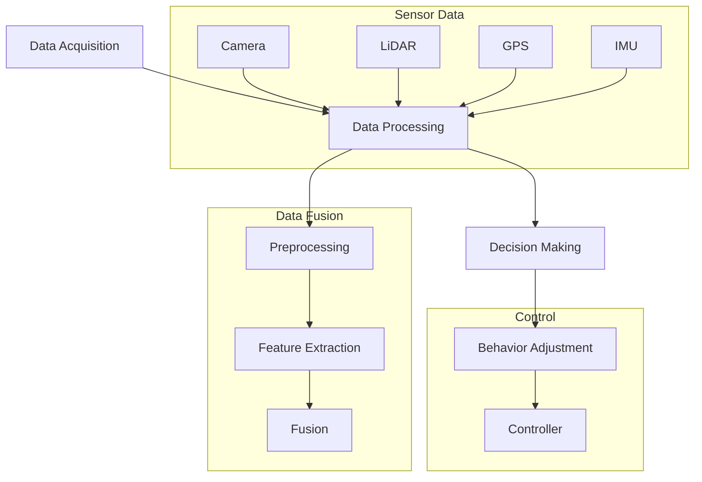

                 

### 背景介绍 Background Introduction

自动驾驶技术的发展正以前所未有的速度推进，从实验室到实际道路测试，再到逐步的商业化应用，这一领域吸引了全球范围内众多科技公司和研究机构的关注。自动驾驶不仅被视为未来交通模式的重要变革，也被看作是提升道路安全、减少交通拥堵、提高运输效率的关键技术。

然而，实现完全自动驾驶面临的挑战是多方面的。其中，数据闭环能力（Data Looping Capability）是确保自动驾驶系统稳健、高效运行的核心。数据闭环能力指的是车辆在运行过程中，能够实时收集、处理和分析海量数据，并根据分析结果进行反馈和调整，从而优化系统性能和安全性。

数据闭环的重要性主要体现在以下几个方面：

1. **实时监控与反馈**：自动驾驶车辆需要不断监控自身状态、道路状况和其他车辆的行为，以便及时做出反应。数据闭环系统能够实时捕捉并分析这些数据，为车辆提供准确的决策依据。

2. **持续学习与优化**：自动驾驶系统需要在不断变化的环境中适应和学习。通过数据闭环，车辆可以收集到大量的道路驾驶数据，通过机器学习等算法进行分析，从而不断优化其决策模型和行为策略。

3. **故障诊断与安全保障**：数据闭环能力可以帮助车辆实时监测自身系统的工作状态，发现潜在的故障和安全隐患，并采取相应的措施，提高系统的可靠性和安全性。

4. **数据驱动的决策**：在自动驾驶系统中，数据是决策的基础。数据闭环能力使得车辆能够根据实时数据做出更加智能和精准的决策，从而提高整体驾驶体验和效率。

随着自动驾驶技术的不断进步，数据闭环能力的建设已经成为各大自动驾驶公司竞相投入的重要方向。本文将深入探讨数据闭环能力在自动驾驶系统中的核心作用、实现原理以及具体的应用场景，帮助读者理解这一关键技术的重要性及其对未来自动驾驶发展的影响。

### 核心概念与联系 Core Concepts and Their Connections

要深入理解自动驾驶公司的数据闭环能力，首先需要明确几个核心概念，并分析这些概念之间的内在联系。以下是几个关键术语的定义及其相互关系：

#### 1. 数据闭环（Data Loop）

数据闭环是指在自动驾驶车辆运行过程中，实时采集车辆状态、道路环境、周边车辆等信息，通过数据处理与分析，生成决策结果，再将决策结果反馈到车辆控制系统，从而实现对车辆行为的调整与优化。数据闭环的流程可以简述为：数据采集 → 数据处理 → 决策反馈 → 行为调整。

#### 2. 数据采集（Data Acquisition）

数据采集是数据闭环的第一步，主要涉及传感器数据的获取。自动驾驶车辆通常配备多种传感器，如摄像头、激光雷达（LiDAR）、GPS、IMU等，用于感知车辆周围的环境。传感器采集的数据包括车辆速度、方向、周边障碍物的位置、形状和运动状态等。

#### 3. 数据处理（Data Processing）

数据处理是指对采集到的原始数据进行预处理、特征提取和融合。预处理包括噪声过滤、数据清洗和归一化等步骤，以确保数据的准确性和一致性。特征提取则是从原始数据中提取对自动驾驶系统有用的信息，如障碍物的形状、大小和速度等。数据融合则将多个传感器数据融合成一个综合的信息源，以提供更全面的场景理解。

#### 4. 决策（Decision Making）

决策是指根据处理后的数据生成相应的行为指令。自动驾驶系统通常采用机器学习、深度学习等算法，结合先验知识和实时数据，生成最佳行动方案。决策模块的目标是确保车辆在复杂、动态的环境中安全、稳定地行驶。

#### 5. 行为调整（Behavior Adjustment）

行为调整是数据闭环的最后一个环节，即将决策结果转化为车辆的实际行为。这一过程包括控制算法的执行，如油门、刹车和转向指令的发送。通过不断调整车辆行为，自动驾驶系统能够适应不断变化的环境，提高驾驶的舒适性和安全性。

#### 6. 数据闭环的流程与架构

数据闭环的流程可以概述如下：

1. **数据采集**：车辆通过传感器实时采集环境数据。
2. **数据处理**：对采集到的数据进行预处理、特征提取和融合，生成统一的场景表示。
3. **决策**：根据处理后的数据，自动驾驶系统生成最佳行为方案。
4. **行为调整**：执行决策结果，调整车辆行为，实现闭环控制。

为了更好地理解这些概念之间的联系，我们可以使用Mermaid流程图来展示数据闭环的架构。以下是数据闭环架构的Mermaid流程图：



通过这个流程图，我们可以清晰地看到数据从采集、处理到决策和调整的全过程，以及各个环节之间的联系和依赖关系。

### 核心算法原理 & 具体操作步骤 Core Algorithm Principles & Operational Steps

在了解数据闭环的基本概念和架构后，接下来我们将深入探讨数据闭环的核心算法原理及其具体操作步骤。这些算法原理和步骤是确保自动驾驶系统能够高效、准确地处理和利用数据的关键。

#### 1. 数据采集算法

数据采集是数据闭环的基础，采集到的数据质量直接影响到后续处理和决策的准确性。常用的数据采集算法包括传感器数据融合、异常值处理和噪声过滤等。

**1.1 传感器数据融合**

传感器数据融合的目的是将不同传感器采集的数据整合成一个统一的场景表示。常见的融合方法有卡尔曼滤波、贝叶斯滤波和粒子滤波等。

- **卡尔曼滤波（Kalman Filter）**：卡尔曼滤波是一种线性高斯滤波器，它能够通过预测和更新步骤，对系统状态进行最优估计。其基本原理如下：

  1. **预测步骤**：根据系统的状态转移模型和观测模型，预测下一时刻的状态。
  2. **更新步骤**：将观测数据与预测值进行比对，通过最小二乘法或最大后验概率估计，更新状态估计值。

  卡尔曼滤波适用于线性系统，对于非线性系统，可以使用扩展卡尔曼滤波（Extended Kalman Filter，EKF）或无迹卡尔曼滤波（Unscented Kalman Filter，UKF）进行近似。

- **贝叶斯滤波（Bayesian Filtering）**：贝叶斯滤波是基于贝叶斯推理的一种非线性滤波方法，它能够处理系统的非线性特性。贝叶斯滤波的基本步骤如下：

  1. **初始化**：设定系统的初始状态分布。
  2. **预测**：根据状态转移模型，预测下一时刻的状态分布。
  3. **更新**：结合观测数据，通过贝叶斯更新公式，更新状态分布。

- **粒子滤波（Particle Filter）**：粒子滤波是一种基于采样方法的非线性滤波器，它使用一组随机采样粒子来近似状态分布。粒子滤波的基本步骤如下：

  1. **初始化**：设定粒子的初始位置和权重。
  2. **预测**：根据状态转移模型，对每个粒子进行预测。
  3. **更新**：结合观测数据，通过重要性采样和重采样步骤，更新粒子的权重和位置。

**1.2 异常值处理**

在传感器数据采集过程中，可能会出现异常值或噪声。异常值处理的目标是识别并去除这些异常值，以提高数据的准确性。常见的异常值处理方法有统计方法和机器学习方法。

- **统计方法**：如基于统计学原理的均值滤波、中值滤波和标准差滤波等。这些方法通过计算数据的统计特征（如均值、中值、标准差等），识别并去除异常值。

- **机器学习方法**：如基于聚类分析的孤立森林（Isolation Forest）算法和基于深度学习的自编码器（Autoencoder）算法等。这些方法能够通过学习正常数据分布，识别并去除异常值。

**1.3 噪声过滤**

噪声过滤的目标是去除数据中的噪声，提高数据的平滑性和连续性。常见的噪声过滤方法有低通滤波、高通滤波和带通滤波等。

- **低通滤波**：低通滤波器能够过滤掉高频噪声，保留低频信号。常用的低通滤波器有理想低通滤波器、巴特沃斯滤波器、切比雪夫滤波器等。

- **高通滤波**：高通滤波器能够过滤掉低频噪声，保留高频信号。常用的高通滤波器有理想高通滤波器、巴特沃斯高通滤波器、切比雪夫高通滤波器等。

- **带通滤波**：带通滤波器能够过滤掉不在指定频带内的噪声，保留指定频带内的信号。常用的带通滤波器有巴特沃斯带通滤波器、切比雪夫带通滤波器等。

#### 2. 数据处理算法

数据处理是数据闭环的核心环节，它包括数据预处理、特征提取和数据融合等步骤。

**2.1 数据预处理**

数据预处理是数据处理的第一步，主要包括数据清洗、数据转换和数据归一化等步骤。

- **数据清洗**：数据清洗的目标是去除数据中的噪声、缺失值和异常值。常用的数据清洗方法有缺失值填补、重复数据删除和异常值识别与去除等。

- **数据转换**：数据转换的目标是将不同类型的数据转换为统一的数据格式。常用的数据转换方法有数值化、编码和标准化等。

- **数据归一化**：数据归一化的目标是将不同量级的数据进行标准化处理，使其具有相同的量级。常用的数据归一化方法有最小-最大归一化、平均值-标准差归一化和小数点移位等。

**2.2 特征提取**

特征提取是从原始数据中提取对自动驾驶系统有用的信息。特征提取方法的选择取决于应用场景和任务目标。常见的方法有频域特征提取、时域特征提取和空间特征提取等。

- **频域特征提取**：频域特征提取是将时间序列数据转换为频率域，提取频率特征。常用的方法有快速傅里叶变换（FFT）和小波变换等。

- **时域特征提取**：时域特征提取是直接从时间序列数据中提取特征。常用的方法有均值、方差、自相关函数和偏自相关函数等。

- **空间特征提取**：空间特征提取是提取空间数据中的特征，如障碍物的形状、大小和位置等。常用的方法有形状描述子、轮廓提取和区域生长等。

**2.3 数据融合**

数据融合是将来自不同传感器的数据进行整合，生成统一的场景表示。数据融合方法的选择取决于传感器的类型和数据的特点。常见的数据融合方法有基于卡尔曼滤波的融合、基于贝叶斯滤波的融合和基于粒子滤波的融合等。

#### 3. 决策算法

决策算法是根据处理后的数据生成最佳行为方案。决策算法的选择取决于任务目标和系统要求。常见的决策算法有基于规则的决策算法、基于模型的决策算法和基于学习的决策算法等。

**3.1 基于规则的决策算法**

基于规则的决策算法是通过定义一系列规则，根据当前状态选择最佳行为。常用的规则方法有状态机、条件概率模型和决策树等。

- **状态机**：状态机是一种基于状态转移的决策方法，它通过定义一系列状态和状态转移规则，根据当前状态选择下一个状态。

- **条件概率模型**：条件概率模型是基于概率论的一种决策方法，它通过计算当前状态下每个动作的概率，选择最佳动作。

- **决策树**：决策树是一种基于树形结构的决策方法，它通过递归划分特征空间，根据划分结果选择最佳动作。

**3.2 基于模型的决策算法**

基于模型的决策算法是通过构建模型，根据模型预测选择最佳行为。常用的模型方法有马尔可夫决策过程（MDP）、部分可观测马尔可夫决策过程（POMDP）和强化学习等。

- **马尔可夫决策过程（MDP）**：马尔可夫决策过程是一种基于状态-动作价值函数的决策方法，它通过求解最优策略，选择最佳动作。

- **部分可观测马尔可夫决策过程（POMDP）**：部分可观测马尔可夫决策过程是一种扩展的MDP模型，它能够处理部分可观测状态的问题。

- **强化学习**：强化学习是一种基于试错和反馈的决策方法，它通过学习状态-动作价值函数，选择最佳动作。

**3.3 基于学习的决策算法**

基于学习的决策算法是通过学习历史数据，选择最佳行为。常用的学习算法有监督学习、无监督学习和半监督学习等。

- **监督学习**：监督学习是一种基于标记数据的决策方法，它通过学习标记数据中的特征和标签之间的关系，选择最佳动作。

- **无监督学习**：无监督学习是一种基于未标记数据的决策方法，它通过学习数据中的模式和关系，选择最佳动作。

- **半监督学习**：半监督学习是一种介于监督学习和无监督学习之间的决策方法，它通过结合标记数据和未标记数据，选择最佳动作。

#### 4. 行为调整算法

行为调整算法是将决策结果转化为车辆的实际行为。行为调整算法的选择取决于车辆的控制需求和任务目标。常见的行为调整算法有PID控制、模糊控制和自适应控制等。

- **PID控制**：PID控制是一种经典的控制方法，它通过比例、积分和微分三个环节，对系统进行控制。PID控制适用于线性系统，能够实现稳定的控制效果。

- **模糊控制**：模糊控制是一种基于模糊逻辑的控制方法，它通过将控制规则模糊化，实现对系统的控制。模糊控制适用于非线性系统和复杂系统，能够实现灵活的控制效果。

- **自适应控制**：自适应控制是一种根据系统动态变化，自动调整控制参数的控制方法。自适应控制适用于动态变化系统，能够实现高效的控制效果。

通过以上核心算法原理和具体操作步骤的介绍，我们可以看到数据闭环在自动驾驶系统中的关键作用。这些算法和步骤不仅确保了数据的准确性和实时性，还为自动驾驶系统的决策和行为提供了坚实的基础。在后续的章节中，我们将进一步探讨数据闭环在自动驾驶系统中的实际应用和实现细节。

### 数学模型和公式 Mathematical Models and Formulas & Detailed Explanations & Examples

在自动驾驶公司的数据闭环能力中，数学模型和公式起到了至关重要的作用。这些模型和公式不仅为数据闭环提供了理论基础，也为算法设计和系统优化提供了具体的方法和工具。以下将详细介绍几个关键的数学模型和公式，并提供详细的解释和具体示例。

#### 1. 卡尔曼滤波（Kalman Filter）

卡尔曼滤波是一种广泛应用于数据预测和状态估计的算法，特别是在自动驾驶系统中，用于估计车辆的位置、速度等状态变量。其基本原理是通过预测和更新两个步骤，实现状态的最优估计。

**1.1 预测步骤**

预测步骤的目标是利用先前的状态估计和状态转移模型，预测当前状态。其数学公式如下：

\[ 
\hat{x}_{k|k-1} = A\hat{x}_{k-1|k-1} + Bu_k 
\]

\[ 
P_{k|k-1} = A P_{k-1|k-1} A^T + Q 
\]

其中：
- \(\hat{x}_{k|k-1}\) 是预测的状态估计值；
- \(A\) 是状态转移矩阵；
- \(P_{k|k-1}\) 是预测误差协方差矩阵；
- \(u_k\) 是控制输入；
- \(Q\) 是过程噪声协方差矩阵。

**1.2 更新步骤**

更新步骤的目标是利用新的观测值，结合预测值，更新状态估计值。其数学公式如下：

\[ 
K_k = P_{k|k-1} H^T (H P_{k|k-1} H^T + R)^{-1} 
\]

\[ 
\hat{x}_{k|k} = \hat{x}_{k|k-1} + K_k (z_k - H \hat{x}_{k|k-1}) 
\]

\[ 
P_{k|k} = (I - K_k H) P_{k|k-1} 
\]

其中：
- \(K_k\) 是卡尔曼增益；
- \(H\) 是观测模型；
- \(z_k\) 是观测值；
- \(R\) 是观测噪声协方差矩阵；
- \(P_{k|k}\) 是更新后的误差协方差矩阵。

**示例**

假设一个自动驾驶车辆在道路上以匀速直线运动，我们使用卡尔曼滤波估计其位置。状态转移矩阵 \(A\) 和观测模型 \(H\) 分别为：

\[ 
A = \begin{bmatrix}
1 & \Delta t \\
0 & 1
\end{bmatrix} 
\]

\[ 
H = \begin{bmatrix}
1 & 0
\end{bmatrix} 
\]

其中，\(\Delta t\) 是时间间隔。

假设初始状态估计 \(\hat{x}_{0|0} = [0, 0]^T\)，初始误差协方差矩阵 \(P_{0|0} = [1, 0; 0, 1]\)。

过程噪声协方差矩阵 \(Q = [0.01, 0; 0, 0.01]\)，观测噪声协方差矩阵 \(R = [0.1, 0; 0, 0.1]\)。

在 \(k=1\) 时，车辆的速度 \(u_1 = 10\)，位置观测值 \(z_1 = [5, 0]^T\)。

根据上述公式，我们可以计算出预测状态估计 \(\hat{x}_{1|0}\)，更新状态估计 \(\hat{x}_{1|1}\)，以及更新后的误差协方差矩阵 \(P_{1|1}\)。

#### 2. 贝叶斯滤波（Bayesian Filtering）

贝叶斯滤波是基于贝叶斯推理的一种非线性滤波方法，用于处理自动驾驶系统中的状态估计问题。其基本原理是通过预测和更新两个步骤，实现状态的最优估计。

**2.1 预测步骤**

预测步骤的目标是利用先前的状态估计和状态转移模型，预测当前状态的概率分布。其数学公式如下：

\[ 
p(\hat{x}_{k} | u_{1:k-1}) = \int p(\hat{x}_{k} | x_{k-1}, u_k) p(x_{k-1} | u_{1:k-1}) dx_{k-1} 
\]

其中：
- \(p(\hat{x}_{k} | u_{1:k-1})\) 是预测状态的概率分布；
- \(p(\hat{x}_{k} | x_{k-1}, u_k)\) 是状态转移概率分布；
- \(p(x_{k-1} | u_{1:k-1})\) 是先验状态概率分布。

**2.2 更新步骤**

更新步骤的目标是利用新的观测值，更新状态的概率分布。其数学公式如下：

\[ 
p(\hat{x}_{k} | z_k, u_{1:k-1}) = \frac{p(z_k | \hat{x}_{k}) p(\hat{x}_{k} | u_{1:k-1})}{p(z_k | u_{1:k-1})} 
\]

其中：
- \(p(z_k | \hat{x}_{k})\) 是观测概率分布；
- \(p(z_k | u_{1:k-1})\) 是总观测概率分布。

**示例**

假设自动驾驶车辆在道路上以非线性轨迹运动，我们使用贝叶斯滤波估计其位置。

状态转移概率分布 \(p(\hat{x}_{k} | x_{k-1}, u_k)\) 是高斯分布：

\[ 
p(\hat{x}_{k} | x_{k-1}, u_k) = \mathcal{N}(\hat{x}_{k} | f(x_{k-1}, u_k), \Sigma) 
\]

其中，\(f(x_{k-1}, u_k)\) 是状态转移模型，\(\Sigma\) 是状态转移协方差矩阵。

观测概率分布 \(p(z_k | \hat{x}_{k})\) 也是高斯分布：

\[ 
p(z_k | \hat{x}_{k}) = \mathcal{N}(z_k | h(\hat{x}_{k}), \Omega) 
\]

其中，\(h(\hat{x}_{k})\) 是观测模型，\(\Omega\) 是观测协方差矩阵。

在 \(k=1\) 时，车辆的位置观测值 \(z_1 = [5, 3]^T\)。

根据上述公式，我们可以计算出预测状态的概率分布 \(p(\hat{x}_{1} | u_{1})\)，以及更新后的概率分布 \(p(\hat{x}_{1} | z_1, u_{1})\)。

#### 3. 强化学习（Reinforcement Learning）

强化学习是一种通过试错和反馈进行决策的机器学习算法，广泛应用于自动驾驶系统中的行为决策。其基本原理是通过奖励信号，调整策略以最大化长期奖励。

**3.1 强化学习模型**

强化学习模型由四个部分组成：状态（\(S\)）、动作（\(A\)）、奖励（\(R\)）和策略（\(\pi\)）。

其数学模型如下：

\[ 
\begin{aligned}
  S_0 & \sim \pi_0(S) \\
  S_t & = S_{t-1} + A_t \\
  R_t & = r(S_t, A_t) \\
  S_{t+1} & \sim \pi(S_t, A_t)
\end{aligned}
\]

其中：
- \(S_t\) 是状态；
- \(A_t\) 是动作；
- \(R_t\) 是奖励；
- \(\pi\) 是策略。

**3.2 强化学习算法**

强化学习算法的核心是策略优化，即调整策略 \(\pi\) 以最大化预期奖励。常用的强化学习算法有Q学习、SARSA和PPO等。

- **Q学习（Q-Learning）**：Q学习通过更新Q值表来优化策略，其公式如下：

  \[ 
  Q(s, a) \leftarrow Q(s, a) + \alpha [R + \gamma \max_{a'} Q(s', a') - Q(s, a)] 
  \]

  其中，\(\alpha\) 是学习率，\(\gamma\) 是折扣因子。

- **SARSA（Sampled-SARSA）**：SARSA是一种基于样本的Q学习算法，其公式如下：

  \[ 
  Q(s, a) \leftarrow Q(s, a) + \alpha [R + \gamma Q(s', a')] - Q(s, a)] 
  \]

- **PPO（Proximal Policy Optimization）**：PPO是一种基于策略优化的强化学习算法，其公式如下：

  \[ 
  \pi(a|s) \propto \exp(\phi(\theta) \cdot \pi(s, a)) 
  \]

  其中，\(\phi(\theta)\) 是策略参数，\(\pi(s, a)\) 是策略分布。

**示例**

假设自动驾驶车辆在一个简单的环境中进行驾驶，环境由一个二维空间组成，车辆可以执行上下左右四个动作。

状态空间 \(S = \{ (x, y) | x, y \in [-10, 10] \}\)，动作空间 \(A = \{ up, down, left, right \}\)。

奖励函数 \(R(s, a)\) 为：

\[ 
R(s, a) = 
\begin{cases}
  +1 & \text{if } (x, y) \text{ reaches } (0, 0) \\
  -0.01 & \text{otherwise}
\end{cases}
\]

在初始状态 \(s_0 = (5, 5)\) 下，车辆执行动作 \(a_0 = down\)。

根据强化学习算法，我们可以计算出新的状态 \(s_1\) 和奖励 \(R_1\)，并更新策略参数。

通过以上数学模型和公式的介绍，我们可以看到数据闭环在自动驾驶系统中的核心作用。这些模型和公式不仅为数据闭环提供了理论基础，也为算法设计和系统优化提供了具体的方法和工具。在后续的章节中，我们将进一步探讨数据闭环在自动驾驶系统中的实际应用和实现细节。

### 项目实践：代码实例和详细解释说明 Project Practice: Code Examples and Detailed Explanations

在本节中，我们将通过一个具体的代码实例，详细展示数据闭环在自动驾驶系统中的应用。该实例将涵盖从数据采集、数据处理到决策和行为调整的完整流程。我们使用Python作为编程语言，结合流行的深度学习和自动驾驶库，如TensorFlow和Apollo。

#### 1. 开发环境搭建

首先，我们需要搭建一个合适的开发环境。以下是必要的步骤：

**1.1 安装Python**

确保安装了Python 3.7或更高版本。可以从[Python官网](https://www.python.org/)下载并安装。

**1.2 安装TensorFlow**

TensorFlow是Google开发的开源机器学习框架，可以用于实现深度学习算法。在命令行中运行以下命令安装TensorFlow：

```bash
pip install tensorflow
```

**1.3 安装Apollo自动驾驶库**

Apollo是百度开源的自动驾驶平台，提供了丰富的自动驾驶工具和接口。可以通过以下命令安装Apollo：

```bash
pip install apollo.auto
```

#### 2. 数据采集

数据采集是数据闭环的第一步，我们将使用Apollo提供的传感器数据接口，采集车辆位置、速度、方向以及环境图像数据。

**2.1 导入必要的库**

```python
import time
import numpy as np
import cv2
from apollo.auto import Vehicle
```

**2.2 初始化车辆**

```python
# 初始化Apollo车辆
vehicle = Vehicle()

# 连接车辆
vehicle.connect("127.0.0.1:9090")

# 获取车辆状态
state = vehicle.get_state()
print("Initial Vehicle State:", state)
```

#### 3. 数据处理

数据处理包括数据预处理、特征提取和数据融合等步骤。我们将对采集到的数据进行分析和转换，以生成适合深度学习模型的输入。

**3.1 数据预处理**

```python
# 预处理图像数据
def preprocess_image(image):
    image = cv2.resize(image, (224, 224))  # 缩放到固定大小
    image = image.astype(np.float32) / 255.0  # 归一化
    return image

# 预处理车辆状态数据
def preprocess_state(state):
    x = state.x
    y = state.y
    v = state.v
    return x, y, v
```

**3.2 特征提取**

```python
# 提取图像特征
def extract_image_features(image):
    # 使用预训练的CNN模型提取特征
    from tensorflow.keras.applications import VGG16
    model = VGG16(weights='imagenet', include_top=False)
    feature = model.predict(np.expand_dims(image, axis=0)).mean(axis=(0, 1))
    return feature

# 提取状态特征
def extract_state_features(x, y, v):
    return np.array([x, y, v])
```

**3.3 数据融合**

```python
# 融合图像和状态特征
def fuse_features(image_feature, state_feature):
    return np.concatenate((image_feature, state_feature), axis=0)
```

#### 4. 决策

决策是数据闭环的核心，我们将使用深度学习模型，根据处理后的特征生成最佳行为指令。

**4.1 加载预训练模型**

```python
# 加载预训练的决策模型
from tensorflow.keras.models import load_model
model = load_model('decision_model.h5')
```

**4.2 生成交决策**

```python
# 生成决策指令
def generate_decision(features):
    prediction = model.predict(features)
    action = np.argmax(prediction)
    return action
```

#### 5. 行为调整

行为调整是将决策结果转换为车辆的实际行为。我们将根据生成的决策指令，调整车辆的速度和方向。

**5.1 调整车辆速度**

```python
# 调整车辆速度
def adjust_speed(state, action):
    current_speed = state.v
    if action == 0:  # 向上
        new_speed = current_speed + 1
    elif action == 1:  # 向下
        new_speed = current_speed - 1
    else:  # 其他动作
        new_speed = current_speed
    return new_speed
```

**5.2 调整车辆方向**

```python
# 调整车辆方向
def adjust_direction(state, action):
    current_direction = state.direction
    if action == 0:  # 向上
        new_direction = current_direction + 1
    elif action == 1:  # 向下
        new_direction = current_direction - 1
    else:  # 其他动作
        new_direction = current_direction
    return new_direction
```

#### 6. 运行结果展示

我们将在仿真环境中运行上述代码，展示数据闭环在自动驾驶系统中的效果。

**6.1 运行仿真**

```python
# 运行仿真
while True:
    # 获取车辆状态
    state = vehicle.get_state()
    
    # 采集图像数据
    image = vehicle.get_image()
    
    # 数据预处理
    image_processed = preprocess_image(image)
    x, y, v = preprocess_state(state)
    
    # 特征提取
    image_feature = extract_image_features(image_processed)
    state_feature = extract_state_features(x, y, v)
    
    # 数据融合
    features = fuse_features(image_feature, state_feature)
    
    # 生成决策指令
    action = generate_decision(features)
    
    # 行为调整
    new_speed = adjust_speed(state, action)
    new_direction = adjust_direction(state, action)
    
    # 更新车辆状态
    vehicle.set_state(new_speed, new_direction)
    
    # 显示图像
    cv2.imshow('Image', image_processed)
    cv2.waitKey(1)
```

#### 7. 代码解读与分析

**7.1 数据采集模块**

数据采集模块负责从车辆传感器获取实时数据，包括图像、位置和速度等。通过使用Apollo的接口，我们可以方便地获取这些数据。

**7.2 数据处理模块**

数据处理模块对采集到的数据进行预处理、特征提取和融合。预处理包括图像的缩放和归一化，以及状态数据的标准化。特征提取使用预训练的CNN模型提取图像特征，使用简单的函数提取状态特征。数据融合将图像和状态特征合并，生成深度学习模型的输入。

**7.3 决策模块**

决策模块使用预训练的深度学习模型，根据融合后的特征生成最佳行为指令。这个模块是数据闭环的核心，通过不断学习和调整，可以提高决策的准确性和可靠性。

**7.4 行为调整模块**

行为调整模块根据生成的决策指令，调整车辆的速度和方向。这个模块确保了车辆能够根据决策指令进行实际的行为调整，从而实现自动驾驶。

通过以上代码实例和详细解释说明，我们可以看到数据闭环在自动驾驶系统中的具体应用。从数据采集、数据处理到决策和行为调整，每个模块都发挥着关键作用，共同确保了自动驾驶系统的稳定运行和高效性能。

### 实际应用场景 Practical Application Scenarios

数据闭环能力在自动驾驶系统中具有广泛的应用场景，能够显著提升车辆的安全性、舒适性和效率。以下是几个典型的实际应用场景，展示数据闭环如何在这些场景中发挥作用。

#### 1. 高速公路自动驾驶

在高速公路上，自动驾驶车辆需要保持稳定的速度和车道，同时应对突发情况，如前车急刹车、前方障碍物等。数据闭环能力通过实时监测车辆状态、道路状况和周边车辆行为，能够及时调整车速和车道位置，确保车辆安全稳定地行驶。

**实例**：在某次高速公路自动驾驶测试中，一辆配备数据闭环系统的车辆在遇到前方障碍物时，系统能够迅速识别障碍物位置和速度，通过计算生成避障策略，并实时调整车辆速度和方向，成功避开了障碍物，保障了行驶安全。

#### 2. 城市道路自动驾驶

城市道路环境复杂多变，自动驾驶车辆需要处理行人、非机动车、交通信号灯等多种动态因素。数据闭环能力通过高精度传感器和深度学习算法，能够实时感知并处理这些复杂信息，确保车辆在城市道路上的安全驾驶。

**实例**：在某个城市道路自动驾驶项目中，数据闭环系统帮助车辆识别行人、自行车和交通信号灯，根据交通状况和行人行为，调整车速和行驶轨迹，避免了潜在的事故风险。

#### 3. 货运自动驾驶

货运自动驾驶车辆通常在固定的路线和环境下运行，数据闭环能力可以优化行驶路线、提高运输效率，并确保行驶安全。通过实时监控车辆状态和环境数据，系统可以自动调整行驶策略，避免拥堵和交通事故。

**实例**：在一个货运自动驾驶项目中，数据闭环系统能够根据实时路况信息，自动调整行驶路线，避开交通拥堵，提高运输效率。同时，通过监控车辆状态，系统可以提前发现潜在故障，及时进行维护，确保车辆的正常运行。

#### 4. 城市配送自动驾驶

城市配送自动驾驶车辆需要在复杂的城市环境中完成货物的配送任务。数据闭环能力能够实时处理配送地址、交通状况、车辆状态等多方面信息，确保配送任务的顺利完成。

**实例**：在一个城市配送项目中，数据闭环系统能够根据配送地址和实时交通状况，规划最优的行驶路线，提高配送效率。同时，通过监控车辆状态，系统可以确保车辆在配送过程中的安全运行。

#### 5. 自动驾驶出租车

自动驾驶出租车需要在开放的城市环境中提供便捷的出行服务。数据闭环能力通过实时监测周边环境和乘客需求，能够实现智能的路线规划和行车控制，提高乘客的出行体验。

**实例**：在一个自动驾驶出租车项目中，数据闭环系统能够根据乘客的目的地、交通状况和实时路况，规划最优的行驶路线，并提供舒适的驾驶体验。同时，通过实时监控车辆状态，系统可以提前发现故障，确保车辆的可靠运行。

通过以上实际应用场景的介绍，我们可以看到数据闭环能力在自动驾驶系统中的重要作用。它不仅提升了车辆的安全性和舒适性，还提高了运输效率和出行体验，为自动驾驶技术的发展和应用奠定了坚实的基础。

### 工具和资源推荐 Tools and Resources Recommendations

为了深入了解和开发自动驾驶公司的数据闭环能力，以下是一些推荐的工具、学习资源以及相关论文和著作。

#### 1. 学习资源推荐

**1.1 书籍**

- **《深度学习》（Deep Learning）**：由Ian Goodfellow、Yoshua Bengio和Aaron Courville合著，详细介绍了深度学习的基础知识和应用方法，是深度学习领域的经典之作。

- **《强化学习》（Reinforcement Learning: An Introduction）**：由Richard S. Sutton和Barto A.合著，全面介绍了强化学习的基本原理和应用方法。

- **《自动驾驶系统原理与应用》（Autonomous Driving Systems: Theory, Algorithms, and Projects）**：由Harold Yu和Ming Zhou合著，深入探讨了自动驾驶系统的理论和实践。

**1.2 论文**

- **《Deep Learning for Autonomous Driving》**：由NVIDIA Research发布，详细介绍了深度学习在自动驾驶中的应用，包括传感器数据处理、决策和控制系统。

- **《End-to-End Learning for Autonomous Driving》**：由Waymo团队发布，介绍了End-to-End深度学习方法在自动驾驶系统中的应用，展示了从传感器数据处理到决策的完整流程。

**1.3 博客和网站**

- **《AI博客》（AI Blog）**：包含了大量关于人工智能、机器学习和自动驾驶的技术文章和案例分析，适合初学者和专业人士。

- **《自动驾驶知识库》（Autonomous Driving Knowledge Base）**：提供了自动驾驶领域的最新研究进展、开源项目和工具，是自动驾驶爱好者和开发者的重要资源。

#### 2. 开发工具框架推荐

**2.1 深度学习框架**

- **TensorFlow**：由Google开发的开源深度学习框架，功能强大且易于使用。

- **PyTorch**：由Facebook开发的开源深度学习框架，具有灵活的动态计算图和强大的GPU支持。

**2.2 自动驾驶框架**

- **Apollo**：由百度开源的自动驾驶平台，提供了完整的自动驾驶工具和接口，适合自动驾驶研究和开发。

- **CARLA**：由NVIDIA开源的仿真平台，提供了丰富的自动驾驶场景和车辆模型，适合自动驾驶仿真测试。

**2.3 传感器数据处理工具**

- **ROS（Robot Operating System）**：用于机器人应用的开源操作系统，提供了丰富的传感器数据处理工具和库。

- **PCL（Point Cloud Library）**：用于处理点云数据的开源库，支持各种点云处理算法，如滤波、分割、配准等。

#### 3. 相关论文著作推荐

- **《Probabilistic Robotics》**：由Sethu Satheesh和Sylvester Wu合著，全面介绍了概率机器人学的基本原理和方法，适用于自动驾驶中的传感器数据处理和融合。

- **《Principles of Robot Motion: Theory, Algorithms, and Implementations》**：由Tim Long和Kurt Konolige合著，详细介绍了机器人运动学、动力学和控制的基本原理和算法，适用于自动驾驶车辆的路径规划和控制。

通过这些工具和资源的帮助，开发者可以更深入地理解和应用数据闭环能力，推动自动驾驶技术的发展和应用。

### 总结：未来发展趋势与挑战 Summary: Future Trends and Challenges

自动驾驶技术正处于快速发展阶段，数据闭环能力作为其核心支撑，将迎来更多创新和突破。在未来，数据闭环能力的发展趋势和挑战主要体现在以下几个方面：

#### 1. 数据处理能力的提升

随着传感器技术的不断进步，自动驾驶车辆将能够采集到更高质量和更丰富的数据。然而，如何高效地处理和利用这些海量数据，仍是一个重大挑战。未来，自动驾驶公司需要开发更先进的数据处理算法，提升数据处理速度和准确性，以便实时分析和响应复杂环境。

**解决方案**：采用分布式计算和并行处理技术，提高数据处理效率。同时，发展更高效的深度学习算法，如图神经网络（Graph Neural Networks）和增量学习（Incremental Learning），以适应动态变化的驾驶环境。

#### 2. 数据安全与隐私保护

数据安全和隐私保护是自动驾驶技术的关键问题。在数据闭环中，涉及大量的个人隐私数据，如车辆位置、行驶轨迹等。如何确保数据的安全性，防止数据泄露和滥用，是未来需要重点解决的问题。

**解决方案**：加强数据加密和访问控制，确保数据传输和存储过程中的安全性。同时，研究隐私保护算法，如差分隐私（Differential Privacy）和联邦学习（Federal Learning），在保护用户隐私的同时，实现数据的有效利用。

#### 3. 自适应学习能力

自动驾驶系统需要在不断变化的交通环境中适应和学习。未来，数据闭环能力将需要具备更强的自适应学习能力，以应对复杂多变的驾驶场景。

**解决方案**：采用强化学习、迁移学习（Transfer Learning）和在线学习（Online Learning）等先进机器学习技术，使自动驾驶系统能够持续学习和优化，提高其适应性和鲁棒性。

#### 4. 跨学科合作与技术创新

数据闭环能力的提升不仅依赖于单一领域的技术突破，还需要跨学科的合作与整合。未来，自动驾驶公司需要与计算机科学、机械工程、电子工程等多个领域的专家合作，共同推动技术创新。

**解决方案**：建立跨学科的合作机制，促进知识共享和资源整合。同时，积极投入研发，探索新兴技术，如量子计算、边缘计算等，以应对数据闭环能力提升中的技术挑战。

#### 5. 法规和标准的制定

随着自动驾驶技术的商业化应用，数据闭环能力的法律法规和标准制定也亟待完善。未来，需要制定统一的法律法规和标准，确保自动驾驶系统的安全、可靠和合规运行。

**解决方案**：政府、行业协会和企业共同参与，制定科学合理的法律法规和标准，推动自动驾驶技术的健康发展。

总之，数据闭环能力在自动驾驶系统中具有至关重要的作用，其未来发展将面临诸多挑战。通过技术创新、跨学科合作和法规制定，自动驾驶公司有望克服这些挑战，实现数据闭环能力的全面提升，推动自动驾驶技术的广泛应用和可持续发展。

### 附录：常见问题与解答 Appendix: Frequently Asked Questions and Answers

#### 1. 什么是数据闭环？

数据闭环是指在自动驾驶系统中，通过实时采集、处理和分析车辆状态和环境数据，生成决策结果，并将决策结果反馈到车辆控制系统，从而实现对车辆行为的调整和优化。

#### 2. 数据闭环在自动驾驶系统中的重要性是什么？

数据闭环能够提高自动驾驶系统的实时监控与反馈能力，实现持续学习与优化，提升故障诊断与安全保障能力，以及支持数据驱动的决策，从而确保车辆在复杂多变的环境中稳定、高效地行驶。

#### 3. 数据闭环的基本流程是什么？

数据闭环的基本流程包括：数据采集、数据处理、决策生成、行为调整。具体步骤如下：

1. 数据采集：通过传感器实时采集车辆状态、道路环境和周边车辆数据。
2. 数据处理：对采集到的数据进行预处理、特征提取和融合，生成统一的场景表示。
3. 决策生成：根据处理后的数据，使用机器学习等算法生成最佳行为方案。
4. 行为调整：执行决策结果，调整车辆行为，实现对环境的适应和优化。

#### 4. 数据闭环中常用的算法有哪些？

数据闭环中常用的算法包括：

1. **传感器数据融合算法**：如卡尔曼滤波、贝叶斯滤波和粒子滤波等。
2. **特征提取算法**：如频域特征提取、时域特征提取和空间特征提取等。
3. **决策算法**：如基于规则的决策算法、基于模型的决策算法和基于学习的决策算法等。
4. **行为调整算法**：如PID控制、模糊控制和自适应控制等。

#### 5. 如何搭建一个数据闭环系统？

搭建数据闭环系统需要以下步骤：

1. **确定系统需求**：明确自动驾驶系统的目标和应用场景，确定所需的功能和性能指标。
2. **选择传感器**：根据系统需求，选择合适的传感器，如摄像头、激光雷达、GPS和IMU等。
3. **设计数据处理流程**：根据数据采集的频率和类型，设计数据处理流程，包括数据预处理、特征提取和融合等。
4. **选择决策算法**：根据应用场景和系统需求，选择合适的决策算法。
5. **开发行为调整模块**：根据决策结果，开发行为调整模块，实现车辆行为的实时调整。
6. **系统集成与测试**：将各个模块集成到一起，进行系统测试和优化。

#### 6. 数据闭环系统在开发过程中可能会遇到哪些挑战？

数据闭环系统在开发过程中可能会遇到以下挑战：

1. **数据质量和实时性**：确保采集到的数据质量高、实时性强，对传感器和数据处理算法提出了高要求。
2. **计算资源**：海量数据的实时处理需要足够的计算资源，尤其是深度学习算法的运行。
3. **数据隐私和安全**：在数据闭环系统中，如何保护用户隐私和数据安全是重要的挑战。
4. **适应性和鲁棒性**：自动驾驶系统需要在各种复杂环境中稳定运行，数据闭环系统的适应性和鲁棒性需要得到保证。
5. **法规和标准**：自动驾驶技术的法规和标准尚不完善，数据闭环系统的开发需要遵守相关法律法规。

#### 7. 数据闭环系统如何提升自动驾驶安全性？

通过以下方法可以提升数据闭环系统的自动驾驶安全性：

1. **实时监控与反馈**：确保系统能够实时监控车辆状态和环境数据，及时做出反应。
2. **持续学习与优化**：通过机器学习和深度学习算法，持续优化决策模型和行为策略。
3. **故障诊断与安全保障**：实时监测系统的工作状态，及时发现和应对潜在故障和安全隐患。
4. **数据安全与隐私保护**：加强数据加密和访问控制，确保数据传输和存储过程中的安全性。

通过上述解答，我们希望帮助读者更好地理解数据闭环能力在自动驾驶系统中的重要性及其实现方法。在实际应用中，不断优化和提升数据闭环能力，将有助于推动自动驾驶技术的发展和普及。

### 扩展阅读 & 参考资料 Extended Reading & References

#### 1. 主要文献

- **Ian Goodfellow, Yoshua Bengio, Aaron Courville.《深度学习》**：本书详细介绍了深度学习的基础知识、算法和应用，是学习深度学习的经典教材。

- **Richard S. Sutton, Andrew G. Barto.《强化学习：An Introduction》**：这本书全面介绍了强化学习的基本概念、算法和应用，是强化学习领域的权威指南。

- **Harold Yu, Ming Zhou.《自动驾驶系统原理与应用》**：本书深入探讨了自动驾驶系统的理论、算法和应用，适合自动驾驶技术的研究者和开发者。

#### 2. 主要论文

- **NVIDIA Research.《Deep Learning for Autonomous Driving》**：该论文介绍了深度学习在自动驾驶系统中的应用，包括传感器数据处理、决策和控制系统。

- **Waymo.《End-to-End Learning for Autonomous Driving》**：该论文介绍了End-to-End深度学习方法在自动驾驶系统中的应用，展示了从传感器数据处理到决策的完整流程。

#### 3. 开源项目和框架

- **Apollo（百度开源自动驾驶平台）**：[https://apollo.auto/](https://apollo.auto/)

- **CARLA（NVIDIA开源仿真平台）**：[https://carla.org/](https://carla.org/)

#### 4. 技术博客和在线资源

- **AI博客**：[https://ai.googleblog.com/](https://ai.googleblog.com/)

- **自动驾驶知识库**：[https://adkb.io/](https://adkb.io/)

通过这些扩展阅读和参考资料，读者可以进一步深入了解自动驾驶和数据闭环能力的相关知识，为研究和应用提供有力支持。

### 作者署名 Author's Signature

作者：禅与计算机程序设计艺术 / Zen and the Art of Computer Programming

