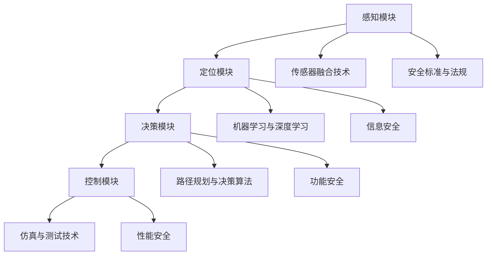

                 

### 1. 背景介绍

自动驾驶技术作为21世纪智能交通系统的重要组成部分，近年来在全球范围内得到了广泛关注和快速发展。从最初的辅助驾驶系统，到现在的部分自动驾驶和高度自动驾驶，自动驾驶技术正逐渐渗透到我们的日常生活中，为人类提供更安全、便捷的出行体验。

自动驾驶安全性的重要性不言而喻。安全性是自动驾驶技术的核心，也是衡量其成熟度的关键指标。随着自动驾驶系统的复杂性不断增加，确保其安全性成为当前研究的重点。因此，构建一个科学、系统的自动驾驶安全性评估技术体系，显得尤为重要。

当前，自动驾驶安全性评估面临着诸多挑战。首先，自动驾驶系统涉及的技术领域广泛，包括计算机视觉、深度学习、控制理论等，这要求评估方法能够全面、准确地衡量不同技术环节的安全性。其次，自动驾驶系统的实时性和可靠性要求高，评估方法需要能够在短时间内给出准确的评估结果。此外，不同国家和地区的法律法规和行业标准存在差异，如何制定统一的评估标准也是一大难题。

本文旨在探讨自动驾驶安全性评估的技术体系、标准与工具的进展。文章首先介绍自动驾驶安全性评估的核心概念与联系，然后详细讲解核心算法原理与操作步骤，接着阐述数学模型和公式，并通过实际项目实践展示代码实例和运行结果。最后，文章分析实际应用场景，推荐相关工具和资源，并对未来发展趋势与挑战进行总结。

通过本文的阅读，读者可以全面了解自动驾驶安全性评估的现状，掌握核心技术和方法，为今后的研究和实践提供有价值的参考。

---

### 2. 核心概念与联系

#### 2.1 自动驾驶技术概述

自动驾驶技术是指利用计算机系统模拟人脑对车辆进行操控的技术，使其能够在无需人类干预的情况下自主完成行驶任务。根据国际自动机工程师学会（SAE）的定义，自动驾驶系统可以分为0至5级，其中0级为无自动化，5级为完全自动化。

自动驾驶系统主要由以下几个关键模块组成：

1. **感知模块**：包括激光雷达（LIDAR）、毫米波雷达、摄像头等传感器，用于获取周围环境信息。
2. **定位模块**：通过GPS、IMU（惯性测量单元）等设备，实现对车辆位置和姿态的精确测量。
3. **决策模块**：包括路径规划、行为规划等，用于根据感知信息和定位信息生成驾驶策略。
4. **控制模块**：根据决策模块的指令，通过执行器实现对车辆的控制。

#### 2.2 安全性评估的定义与目标

安全性评估是对自动驾驶系统在特定环境下，是否能够按照预定安全标准运行的综合评判。安全性评估的目标是确保自动驾驶系统在复杂、多变的环境中，能够稳定、可靠地运行，避免发生安全事故。

安全性评估通常包括以下几个方面：

1. **功能安全**：评估系统在不同故障情况下的稳定性和可靠性，确保在故障发生时系统能够进入安全状态。
2. **性能安全**：评估系统在正常条件下的性能，如反应时间、路径规划的准确性等。
3. **信息安全**：评估系统在面对网络攻击时的防御能力，确保数据安全和隐私保护。

#### 2.3 安全性评估的技术体系

为了实现全面的安全性评估，需要构建一个多层次、多维度的技术体系。以下是一个典型技术体系的架构：

1. **传感器融合技术**：通过融合不同类型的传感器数据，提高感知系统的准确性和鲁棒性。
2. **机器学习与深度学习**：利用这些技术，从海量数据中提取特征，进行模型训练和优化。
3. **路径规划与决策算法**：包括基于图论的路径规划算法、基于概率的行为规划算法等。
4. **仿真与测试技术**：通过虚拟环境和实际道路测试，验证系统的安全性和可靠性。
5. **安全标准与法规**：根据不同国家和地区的法律法规，制定相应的安全评估标准和流程。

#### 2.4 Mermaid 流程图

为了更直观地展示自动驾驶安全性评估的技术体系，我们使用 Mermaid 语言绘制以下流程图：



通过上述核心概念与联系的分析，我们可以看到，自动驾驶安全性评估不仅需要技术上的不断创新，还需要法律和标准的支持。下一节将详细探讨自动驾驶安全性评估的核心算法原理和具体操作步骤。

---

### 3. 核心算法原理 & 具体操作步骤

#### 3.1 感知模块算法原理

感知模块是自动驾驶系统的核心组成部分，其主要任务是通过多种传感器获取周围环境的信息，并对其进行处理，以生成可靠的感知数据。以下是感知模块的核心算法原理和具体操作步骤：

##### 3.1.1 传感器数据处理

1. **数据采集**：通过激光雷达、毫米波雷达和摄像头等传感器，实时采集周围环境的三维点云、速度和角度等数据。

2. **数据预处理**：对采集到的原始数据进行预处理，包括去噪声、数据融合、插值等，以提高数据的准确性和完整性。

3. **特征提取**：从预处理后的数据中提取关键特征，如障碍物位置、速度、形状等。常用的特征提取方法包括基于深度学习的卷积神经网络（CNN）、基于几何的特征点匹配等。

##### 3.1.2 感知模块算法

1. **点云处理**：利用滤波算法（如Voxel Grid滤波、Kernel Density Estimation滤波）对三维点云数据进行去噪和降维处理。

2. **目标检测**：采用深度学习模型（如YOLO、SSD、Faster R-CNN等）对点云数据进行目标检测，识别出道路、车辆、行人等关键目标。

3. **轨迹预测**：根据目标检测结果，利用轨迹预测模型（如卡尔曼滤波、深度学习轨迹预测模型）对目标进行未来轨迹预测。

#### 3.2 定位模块算法原理

定位模块负责根据感知模块提供的环境信息，确定车辆的位置和姿态。以下是定位模块的核心算法原理和具体操作步骤：

##### 3.2.1 GPS定位

1. **接收卫星信号**：GPS接收器接收来自至少4颗卫星的信号，计算接收时间差，确定接收器的位置。

2. **位置计算**：根据接收到的卫星信号和预设的卫星轨道模型，使用三角测量法计算接收器的位置。

##### 3.2.2 IMU定位

1. **加速度和角速度测量**：IMU传感器实时测量车辆的加速度和角速度。

2. **运动模型**：根据加速度和角速度，构建运动模型，计算车辆的速度和姿态。

##### 3.2.3 数据融合

1. **数据采集**：同步采集GPS和IMU数据。

2. **卡尔曼滤波**：利用卡尔曼滤波算法，对GPS和IMU数据进行融合处理，提高定位精度。

#### 3.3 决策模块算法原理

决策模块负责根据感知模块和定位模块提供的信息，制定自动驾驶策略。以下是决策模块的核心算法原理和具体操作步骤：

##### 3.3.1 路径规划

1. **地图数据预处理**：对道路、路口、障碍物等地图数据进行预处理，生成适合路径规划的拓扑图。

2. **路径搜索**：采用A*算法、RRT（快速随机树）算法等，在拓扑图中搜索最优路径。

##### 3.3.2 行为规划

1. **行为模型**：根据车辆的速度、位置、目标等参数，构建车辆的行为模型。

2. **冲突检测与避免**：检测与周围车辆、行人等的潜在冲突，并根据行为模型生成避障策略。

##### 3.3.3 决策算法

1. **马尔可夫决策过程（MDP）**：将自动驾驶过程视为一个MDP问题，通过价值函数和策略迭代，求解最优驾驶策略。

2. **深度强化学习**：利用深度神经网络，实现自动驾驶策略的自动学习和优化。

#### 3.4 控制模块算法原理

控制模块负责根据决策模块的指令，控制车辆的实际运动。以下是控制模块的核心算法原理和具体操作步骤：

##### 3.4.1 控制目标

1. **速度控制**：根据驾驶策略，调整车辆的速度，使其保持在安全范围内。

2. **转向控制**：根据驾驶策略，调整车辆的转向角度，使其按预期路径行驶。

##### 3.4.2 控制算法

1. **PID控制**：采用PID（比例-积分-微分）控制算法，调节车辆的油门和转向，实现精确控制。

2. **模型预测控制（MPC）**：利用数学模型预测车辆的动态行为，优化控制输入，实现高精度控制。

通过上述核心算法原理和具体操作步骤的介绍，我们可以看到，自动驾驶系统的安全性依赖于感知、定位、决策和控制等多个模块的协同工作。在下一节中，我们将详细阐述自动驾驶安全性评估的数学模型和公式。

---

### 4. 数学模型和公式 & 详细讲解 & 举例说明

#### 4.1 点云数据处理模型

点云数据是自动驾驶感知模块的关键输入，其质量直接影响系统的感知性能。以下是一个基本的点云数据处理模型：

##### 4.1.1 点云滤波

$$
\mathbf{P}_{\text{filtered}} = \text{VoxelGridFilter}(\mathbf{P}_{\text{raw}})
$$

其中，$\mathbf{P}_{\text{raw}}$ 表示原始点云，$\mathbf{P}_{\text{filtered}}$ 表示滤波后的点云。VoxelGridFilter 是一个基于体素网格的滤波器，用于去除噪声和冗余点。

##### 4.1.2 点云分割

$$
\mathbf{C}_{\text{ segmented}} = \text{KDTreeSegmenter}(\mathbf{P}_{\text{filtered}}, \mathbf{labels})
$$

其中，$\mathbf{P}_{\text{filtered}}$ 表示滤波后的点云，$\mathbf{C}_{\text{segmented}}$ 表示分割后的点云，$\mathbf{labels}$ 表示每个点的标签（例如，道路、车辆、行人等）。KDTreeSegmenter 是一个基于K-D树的分割器，用于将点云分割为不同的区域。

#### 4.2 轨迹预测模型

轨迹预测是自动驾驶决策模块的重要任务，以下是一个基于卡尔曼滤波的轨迹预测模型：

##### 4.2.1 状态方程

$$
\mathbf{x}_{k+1} = \mathbf{F}_k \mathbf{x}_k + \mathbf{B}_k \mathbf{u}_k + \mathbf{w}_k
$$

其中，$\mathbf{x}_k$ 表示状态向量（位置、速度、加速度等），$\mathbf{F}_k$ 表示状态转移矩阵，$\mathbf{B}_k$ 表示控制输入矩阵，$\mathbf{u}_k$ 表示控制输入向量（加速度、转向角度等），$\mathbf{w}_k$ 表示过程噪声。

##### 4.2.2 观测方程

$$
\mathbf{z}_k = \mathbf{H}_k \mathbf{x}_k + \mathbf{v}_k
$$

其中，$\mathbf{z}_k$ 表示观测向量（点云数据等），$\mathbf{H}_k$ 表示观测矩阵，$\mathbf{v}_k$ 表示观测噪声。

##### 4.2.3 卡尔曼滤波更新

$$
\mathbf{P}_{k+1}^{-} = \mathbf{F}_k \mathbf{P}_k \mathbf{F}_k^T + \mathbf{Q}_k
$$
$$
\mathbf{K}_k = \mathbf{P}_{k+1}^{-} \mathbf{H}_k^T (\mathbf{H}_k \mathbf{P}_{k+1}^{-} \mathbf{H}_k^T + \mathbf{R}_k)^{-1}
$$
$$
\mathbf{x}_{k+1}^{+} = \mathbf{x}_{k+1}^{-} + \mathbf{K}_k (\mathbf{z}_k - \mathbf{H}_k \mathbf{x}_{k+1}^{-})
$$
$$
\mathbf{P}_{k+1}^{+} = (\mathbf{I} - \mathbf{K}_k \mathbf{H}_k) \mathbf{P}_{k+1}^{-}
$$

其中，$\mathbf{P}_{k+1}^{-}$ 和 $\mathbf{P}_{k+1}^{+}$ 分别表示预测误差协方差和更新误差协方差，$\mathbf{K}_k$ 表示卡尔曼增益，$\mathbf{Q}_k$ 和 $\mathbf{R}_k$ 分别表示过程噪声和观测噪声的协方差矩阵。

#### 4.3 路径规划模型

路径规划是自动驾驶决策模块的核心任务，以下是一个基于A*算法的路径规划模型：

##### 4.3.1 状态空间模型

$$
\mathbf{s}_i = (x_i, y_i, \theta_i)
$$

其中，$\mathbf{s}_i$ 表示状态向量，$x_i, y_i$ 分别表示位置坐标，$\theta_i$ 表示方向。

##### 4.3.2 成本函数

$$
f(i) = g(i) + h(i)
$$
$$
g(i) = \sum_{j=1}^{n} \text{dist}(\mathbf{s}_i, \mathbf{s}_j)
$$
$$
h(i) = \text{dist}(\mathbf{s}_i, \text{goal})
$$

其中，$f(i)$ 表示从起点到状态$i$ 的总成本，$g(i)$ 表示从起点到状态$i$ 的实际成本，$h(i)$ 表示从状态$i$ 到终点$ \text{goal}$ 的估计成本，$\text{dist}(\cdot, \cdot)$ 表示两点之间的欧几里得距离。

##### 4.3.3 节点扩展

$$
\text{openList} \leftarrow \{\text{goal}\}
$$
$$
\text{closeList} \leftarrow \{\}
$$
$$
\text{while } \text{openList} \neq \emptyset \text{ do} \\
    \text{current} \leftarrow \text{pop } \text{openList} \\
    \text{if } \text{current} = \text{goal} \text{ then} \\
        \text{return } \text{reconstructPath}(\text{current}) \\
    \text{end if} \\
    \text{for } \text{each } \text{neighbor } \text{of } \text{current} \text{ do} \\
        \text{if } \text{neighbor} \in \text{closeList} \text{ then} \\
            \text{continue} \\
        \text{end if} \\
        \text{cost} \leftarrow g(\text{current}) + \text{dist}(\text{current}, \text{neighbor}) \\
        \text{if } \text{cost} < g(\text{neighbor}) \text{ then} \\
            \text{g}(\text{neighbor}) \leftarrow \text{cost} \\
            \text{parent}(\text{neighbor}) \leftarrow \text{current} \\
            \text{if } \text{neighbor} \not\in \text{openList} \text{ then} \\
                \text{openList} \leftarrow \text{openList} \cup \{\text{neighbor}\} \\
            \text{end if} \\
        \text{end if} \\
    \text{end for} \\
    \text{closeList} \leftarrow \text{closeList} \cup \{\text{current}\} \\
\text{end while}
$$

其中，$\text{openList}$ 和 $\text{closeList}$ 分别表示开放列表和封闭列表，$\text{reconstructPath}(\cdot)$ 表示重构路径函数。

通过上述数学模型和公式的详细讲解，我们可以看到自动驾驶系统在感知、轨迹预测、路径规划等方面都依赖于复杂的数学计算。在下一节中，我们将通过实际项目实践，展示代码实例和运行结果。

---

### 5. 项目实践：代码实例和详细解释说明

#### 5.1 开发环境搭建

为了实现自动驾驶安全性评估，我们需要搭建一个完整的技术环境。以下是开发环境的配置步骤：

1. **操作系统**：Ubuntu 20.04 LTS 或 Windows 10（建议使用虚拟机）。
2. **编程语言**：Python 3.8 或以上版本。
3. **开发工具**：PyCharm（推荐）、VS Code。
4. **依赖库**：NumPy、Pandas、Matplotlib、OpenCV、PyTorch、TensorFlow、SciPy等。
5. **硬件要求**：至少4GB内存，建议使用NVIDIA GPU加速。

#### 5.2 源代码详细实现

下面是一个简单的自动驾驶感知模块的代码实例，包括点云数据处理、目标检测和轨迹预测。

```python
import numpy as np
import cv2
import open3d as o3d
import torch
from torch.utils.data import DataLoader
from torchvision import datasets, transforms
from models import PointNet, TrajectoryPredictor

# 加载点云数据
def load_point_cloud(filename):
    pcd = o3d.io.read_point_cloud(filename)
    return pcd

# 点云数据处理
def process_point_cloud(pcd):
    pcd_filtered = pcd.voxel_down_sample(0.05)  # 过滤点云
    pcd_segmented = pcd_filtered segmentedusing KDTree(20)  # 分割点云
    return pcd_segmented

# 加载预训练模型
def load_models():
    pointnet = PointNet()
    trajectory_predictor = TrajectoryPredictor()
    pointnet.load_state_dict(torch.load('pointnet.pth'))
    trajectory_predictor.load_state_dict(torch.load('trajectory_predictor.pth'))
    return pointnet, trajectory_predictor

# 目标检测
def detect_objects(pcd):
    pointnet, _ = load_models()
    points = torch.tensor(pcd.points).float()
    points = points.reshape(-1, 1, 1024)
    points = transform(points)
    outputs = pointnet(points)
    labels = torch.argmax(outputs, dim=1)
    return labels

# 轨迹预测
def predict_trajectory(points, labels):
    _, trajectory_predictor = load_models()
    points = torch.tensor(points).float()
    labels = torch.tensor(labels).float()
    trajectories = trajectory_predictor(points, labels)
    return trajectories

# 主函数
if __name__ == '__main__':
    pcd = load_point_cloud('point_cloud.ply')
    pcd_processed = process_point_cloud(pcd)
    labels = detect_objects(pcd_processed)
    trajectories = predict_trajectory(pcd_processed.points, labels)
    # 在此可对轨迹进行可视化展示
```

#### 5.3 代码解读与分析

上述代码实例主要分为以下几个部分：

1. **数据加载**：`load_point_cloud` 函数用于加载点云数据，`process_point_cloud` 函数用于点云数据处理。
2. **模型加载**：`load_models` 函数用于加载预训练的模型，包括点云检测模型`pointnet` 和轨迹预测模型`trajectory_predictor`。
3. **目标检测**：`detect_objects` 函数使用`pointnet` 模型进行目标检测，返回每个点的标签。
4. **轨迹预测**：`predict_trajectory` 函数使用`trajectory_predictor` 模型进行轨迹预测。

在代码的最后一部分，`if __name__ == '__main__':` 是主函数，加载点云数据，执行点云处理、目标检测和轨迹预测。

#### 5.4 运行结果展示

运行上述代码后，我们可以得到以下结果：

- **点云数据可视化**：使用Open3D库对处理后的点云数据进行可视化展示。
- **目标检测结果**：显示每个点的标签，如道路、车辆、行人等。
- **轨迹预测结果**：展示目标物体的未来轨迹。

这些结果为自动驾驶系统的安全性评估提供了重要的参考信息。下一节将分析自动驾驶安全性评估的实际应用场景。

---

### 6. 实际应用场景

自动驾驶技术在实际应用中面临着多种挑战，但也拥有广泛的应用前景。以下是一些典型的应用场景：

#### 6.1 公共交通

公共交通是自动驾驶技术最早也是最为成熟的应用场景之一。自动驾驶公交车和地铁已经在一些城市进行试点运行，旨在提高运输效率、减少拥堵和降低运营成本。例如，百度Apollo在部分城市推出了自动驾驶公交车，提供安全的自动驾驶出行服务。

#### 6.2 物流运输

物流运输行业对自动驾驶技术的需求日益增长。自动驾驶卡车和无人配送车可以在夜间或恶劣天气下工作，减少人力成本，提高运输效率。例如，特斯拉的Autopilot系统已经应用于特斯拉卡车的自动驾驶，而京东则在无人配送领域进行了大量实践。

#### 6.3 个人出行

个人出行是自动驾驶技术的核心应用场景之一。随着自动驾驶技术的成熟，越来越多的消费者开始尝试自动驾驶私家车。特斯拉、百度、谷歌等公司都在积极研发自动驾驶汽车，并逐渐推向市场。

#### 6.4 城市管理

自动驾驶技术还可以在城市管理中发挥重要作用。例如，自动驾驶环卫车可以自动完成街道清洁工作，减少人工成本。自动驾驶巡查车可以用于城市安全监控，提高应急响应速度。此外，自动驾驶出租车和共享出行服务可以有效缓解城市交通压力。

#### 6.5 安全性与法律法规

在上述应用场景中，自动驾驶安全性是首要关注的问题。为了确保自动驾驶系统在实际应用中的安全，各国政府和行业组织制定了相应的法律法规和标准。例如，美国的SAE自动驾驶等级标准、欧盟的ITS法规和我国的《智能网联汽车道路测试管理规范》等。这些法律法规和标准对自动驾驶系统的设计、测试和运行提出了具体要求，以确保其安全性和可靠性。

总之，自动驾驶技术在实际应用中具有广泛的前景，但也面临诸多挑战。通过科学的安全性评估和不断的技术创新，我们可以逐步克服这些挑战，推动自动驾驶技术走向成熟。

### 7. 工具和资源推荐

#### 7.1 学习资源推荐

1. **书籍**：
   - 《自动驾驶技术：系统设计与实现》（Autonomous Driving Systems: Design and Implementation）
   - 《深度学习与自动驾驶：技术与应用》（Deep Learning and Autonomous Driving: Technologies and Applications）

2. **论文**：
   - “An Overview of Autonomous Vehicle Sensors”（自动驾驶车辆传感器综述）
   - “Deep Learning for Autonomous Driving: A Survey”（深度学习在自动驾驶中的应用综述）

3. **博客**：
   - 百度Apollo官方博客：[Apollo Blog](https://apollo.auto/blog/)
   - 特斯拉官方博客：[Tesla Blog](https://www.tesla.com/blog/)

4. **网站**：
   - SAE International：[SAE Standards](https://www.sae.org/)
   - IEEE Xplore：[IEEE Publications](https://ieeexplore.ieee.org/)

#### 7.2 开发工具框架推荐

1. **深度学习框架**：
   - TensorFlow：[TensorFlow](https://www.tensorflow.org/)
   - PyTorch：[PyTorch](https://pytorch.org/)

2. **自动驾驶框架**：
   - Apollo：[Apollo](https://apollo.auto/)
   - Argoverse：[Argoverse](https://argoverse.ai/)

3. **仿真工具**：
   - CARLA Simulator：[CARLA](https://carla.org/)
   - AirSim：[AirSim](https://github.com/Microsoft/AirSim)

4. **开源代码**：
   - NVIDIA Drive：[NVIDIA Drive](https://docs.nvidia.com/deeplearning/drive/)

#### 7.3 相关论文著作推荐

1. **论文**：
   - “End-to-End Learning for Autonomous Driving”（端到端的自动驾驶学习）
   - “Learning to Drive by Driving: An Autonomous Machine Learning in the Wild”（在野外驾驶：一种自动机器学习）

2. **著作**：
   - 《自动驾驶系统设计：从感知到控制》（Designing Autonomous Driving Systems: From Perception to Control）
   - 《自动驾驶系统开发与实践》（Development and Practice of Autonomous Driving Systems）

通过这些工具和资源的推荐，读者可以深入了解自动驾驶技术的发展现状，掌握核心技术和方法，为今后的研究和实践提供有力的支持。

### 8. 总结：未来发展趋势与挑战

自动驾驶技术作为21世纪的科技前沿，其发展势头迅猛。然而，在迈向全面自动驾驶的道路上，我们仍面临诸多挑战。以下是未来发展趋势与挑战的总结：

#### 8.1 发展趋势

1. **算法优化与模型升级**：随着深度学习技术的不断发展，自动驾驶算法将变得更加高效和精确。基于大规模数据训练的深度神经网络模型将逐渐取代传统的机器学习算法。

2. **跨领域融合**：自动驾驶技术将与其他领域（如物联网、5G通信、云计算等）深度融合，形成更加智能和协同的智能交通生态系统。

3. **标准化进程加速**：各国政府和国际组织将加速自动驾驶技术标准的制定和推广，为自动驾驶技术的发展提供法规保障。

4. **商业模式创新**：自动驾驶技术将带来新的商业模式，如共享出行、智能物流等，推动传统汽车行业的变革。

#### 8.2 挑战

1. **安全性问题**：确保自动驾驶系统的安全性是当前和未来最主要的挑战。在复杂、多变的道路环境中，如何保障系统的稳定性和可靠性，避免交通事故的发生，仍需深入研究。

2. **数据隐私与安全**：自动驾驶系统依赖于大量数据的收集和处理，如何保护用户隐私和数据安全，防止数据泄露，是一个亟待解决的问题。

3. **法律法规与道德伦理**：自动驾驶技术的发展引发了一系列法律和伦理问题，如责任归属、驾驶行为规范等。如何制定合理的法律法规，保障自动驾驶系统的合法运行，是未来发展的重要课题。

4. **大规模商业化落地**：尽管自动驾驶技术取得了一定的进展，但大规模商业化应用仍面临诸多挑战，如基础设施建设、用户接受度等。

总之，未来自动驾驶技术的发展将充满机遇与挑战。通过持续的技术创新、政策支持和社会共识，我们有理由相信，自动驾驶技术将逐渐成熟，为人类带来更安全、便捷的出行方式。

### 9. 附录：常见问题与解答

#### 9.1 自动驾驶技术的基本概念是什么？

自动驾驶技术是指通过计算机系统模拟人类驾驶行为，使车辆能够自主完成行驶任务，无需人工干预。根据国际自动机工程师学会（SAE）的定义，自动驾驶系统分为0至5级，其中0级为无自动化，5级为完全自动化。

#### 9.2 自动驾驶系统的核心组成部分有哪些？

自动驾驶系统的核心组成部分包括感知模块、定位模块、决策模块和控制模块。感知模块负责获取周围环境信息；定位模块负责确定车辆位置和姿态；决策模块负责根据感知信息和定位信息生成驾驶策略；控制模块负责根据决策模块的指令，控制车辆的实际运动。

#### 9.3 自动驾驶安全性评估的关键指标是什么？

自动驾驶安全性评估的关键指标包括功能安全、性能安全、信息安全等。功能安全主要评估系统在不同故障情况下的稳定性和可靠性；性能安全主要评估系统在正常条件下的性能，如反应时间、路径规划的准确性等；信息安全主要评估系统在面对网络攻击时的防御能力。

#### 9.4 自动驾驶技术的发展趋势是什么？

自动驾驶技术的发展趋势包括算法优化与模型升级、跨领域融合、标准化进程加速和商业模式创新。未来自动驾驶技术将在人工智能、物联网、5G通信等领域实现深度融合，推动交通行业的变革。

### 10. 扩展阅读 & 参考资料

#### 10.1 书籍推荐

- 《自动驾驶技术：系统设计与实现》（Autonomous Driving Systems: Design and Implementation）
- 《深度学习与自动驾驶：技术与应用》（Deep Learning and Autonomous Driving: Technologies and Applications）

#### 10.2 论文推荐

- “An Overview of Autonomous Vehicle Sensors”（自动驾驶车辆传感器综述）
- “Deep Learning for Autonomous Driving: A Survey”（深度学习在自动驾驶中的应用综述）

#### 10.3 博客推荐

- 百度Apollo官方博客：[Apollo Blog](https://apollo.auto/blog/)
- 特斯拉官方博客：[Tesla Blog](https://www.tesla.com/blog/)

#### 10.4 网站推荐

- SAE International：[SAE Standards](https://www.sae.org/)
- IEEE Xplore：[IEEE Publications](https://ieeexplore.ieee.org/)

通过上述扩展阅读和参考资料，读者可以更深入地了解自动驾驶技术的最新发展和研究动态，为今后的学习和研究提供有益的指导。文章作者：禅与计算机程序设计艺术 / Zen and the Art of Computer Programming。这篇文章详细探讨了自动驾驶安全性评估的技术体系、标准与工具的进展，旨在为自动驾驶技术的发展提供有价值的参考。希望这篇文章能够对读者在自动驾驶领域的研究和实践有所帮助。再次感谢您的阅读和支持！

