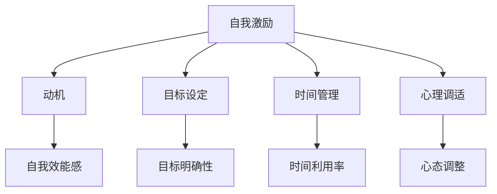

                 

### 自我激励：克服创业路上的懈怠

#### 摘要

在创业的征途上，懈怠是一种常见的陷阱，它往往在不知不觉中侵蚀着创业者的激情与动力。本文将探讨如何利用自我激励策略，克服创业过程中的懈怠现象，提升个人的工作效率和成果产出。文章首先回顾了懈怠的本质及其对创业者的影响，随后详细介绍了多种自我激励的方法，包括目标设定、时间管理、心理调适等。通过实例分析，我们将看到这些方法如何在实际创业过程中发挥作用。最后，文章总结了自我激励的重要性，并展望了未来在科技和心理学领域中的发展趋势与挑战。

---

#### 1. 背景介绍

创业，是一种充满挑战与机遇并存的旅程。然而，在这条道路上，创业者常常会面临一个共同的敌人——懈怠。懈怠，简单来说，就是缺乏动力和意志力，从而导致工作效率降低，甚至停滞不前。这种心理状态不仅影响了创业者的个人发展，也可能对整个创业项目的成败产生决定性的影响。

懈怠的原因多种多样。从心理学的角度来看，它可能源于目标不明确、自我效能感不足、环境干扰等因素。当创业者感到自己的努力无法带来预期的回报时，懈怠便会悄然出现。此外，长时间的紧张工作和高压环境，也容易导致情绪疲惫和动力不足。

在创业过程中，懈怠往往表现为拖延、注意力不集中、缺乏创造力等行为。这些问题不仅降低了工作效率，还可能影响团队合作和项目进度。因此，如何有效地克服懈怠，成为许多创业者关注的焦点。

本文旨在探讨自我激励在克服创业懈怠中的作用。通过分析懈怠的本质，介绍自我激励的方法和技巧，以及提供实际案例，帮助创业者找到克服懈怠的有效途径，从而保持长期的动力和激情，推动创业项目的成功。

---

#### 2. 核心概念与联系

为了更好地理解自我激励在克服创业懈怠中的重要作用，我们需要先明确几个核心概念，并探讨它们之间的联系。

**2.1 自我激励**

自我激励是指个体通过内在的动力和动机，主动去实现目标的过程。它与外部激励（如奖励、惩罚）不同，更多地依赖于个人内心的驱动力。自我激励可以增强个体的自我效能感，提升工作积极性和效率。

**2.2 懒惰与懈怠**

懒惰和懈怠是两种常见的心理状态，但它们有所不同。懒惰通常是指缺乏行动力，而懈怠则是指缺乏持续行动的动力。在创业过程中，懈怠更容易导致项目停滞和失败。

**2.3 动机与目标设定**

动机是驱使个体行动的心理因素，而目标设定则是将动机具体化的过程。一个明确且具有挑战性的目标，可以激发个体的内在动机，帮助克服懈怠。

**2.4 时间管理**

时间管理是提高工作效率的关键。通过合理安排时间，创业者可以更好地分配精力，避免因时间管理不当而产生的懈怠。

**2.5 心理调适**

心理调适是指通过心理方法调整自己的心态，以应对压力和挑战。良好的心理调适能力，可以帮助创业者保持积极的心态，从而有效克服懈怠。

**2.6 Mermaid 流程图**



这个流程图展示了自我激励、动机、目标设定、时间管理和心理调适之间的内在联系。通过这些概念的理解和运用，创业者可以更有效地克服懈怠，保持创业的热情和动力。

---

#### 3. 核心算法原理 & 具体操作步骤

**3.1 自我激励算法原理**

自我激励算法的核心原理在于利用内在动机和外部激励，激发个体的积极性和创造力。具体来说，它包括以下几个步骤：

1. **目标设定**：明确且具有挑战性的目标，可以激发个体的内在动机。
2. **自我反馈**：通过设定小目标和达成后的奖励，个体可以及时获得正反馈，增强自我激励。
3. **心理调适**：保持积极的心态，通过心理方法应对压力，避免懈怠。

**3.2 具体操作步骤**

1. **目标设定**

   - **确定目标**：设定一个具体、可衡量的目标，例如“在一个月内完成一个产品原型”。
   - **分解目标**：将大目标分解为若干小目标，每完成一个小目标都给予自我奖励。
   - **设置时间限制**：给每个小目标设定一个合理的时间限制，以增加紧迫感。

2. **自我反馈**

   - **奖励机制**：每完成一个小目标，给自己设定一个奖励，如休息一会儿、看一部喜欢的电影等。
   - **自我评价**：定期对自己的工作成果进行评价，以保持自我激励。

3. **心理调适**

   - **积极心态**：保持积极的心态，面对困难和挑战时不轻易放弃。
   - **放松训练**：通过冥想、深呼吸等方法，缓解压力，保持心理健康。

4. **时间管理**

   - **优先级排序**：将任务按照优先级排序，确保先完成最重要的任务。
   - **时间块管理**：将工作时间分为几个固定的时间块，每个时间块专注于一项任务。

**3.3 具体实例**

以一个创业项目为例，假设目标是“在三个月内完成一款移动应用程序”。具体操作步骤如下：

1. **目标设定**

   - **确定目标**：完成一款移动应用程序。
   - **分解目标**：每周完成一个功能模块，如用户注册、消息推送等。
   - **设置时间限制**：每周一早上设定本周的目标，并在周五晚上进行回顾和总结。

2. **自我反馈**

   - **奖励机制**：每完成一个功能模块，奖励自己休息半天或观看一部电影。
   - **自我评价**：每周进行自我评价，记录自己的进步和存在的问题。

3. **心理调适**

   - **积极心态**：遇到困难时，积极寻求解决方案，保持信心。
   - **放松训练**：每天晚上进行深呼吸和冥想，缓解压力。

4. **时间管理**

   - **优先级排序**：将任务按照重要性和紧急性排序，确保先完成最重要的任务。
   - **时间块管理**：每天早上规划当天的工作，将时间分为几个固定的时间块，每个时间块专注于一个任务。

通过以上步骤，创业者可以有效地克服懈怠，保持创业的热情和动力。

---

#### 4. 数学模型和公式 & 详细讲解 & 举例说明

**4.1 数学模型**

为了更好地理解自我激励的效果，我们可以使用一个简单的数学模型来描述。

设 \( P \) 为个体的自我效能感，\( M \) 为自我激励水平，\( T \) 为任务完成的时间，\( R \) 为任务完成的奖励，则：

\[ P = f(M, T, R) \]

其中，函数 \( f \) 表示自我效能感与自我激励水平、任务完成时间、任务完成奖励之间的关系。

**4.2 详细讲解**

- **自我效能感 \( P \)**：自我效能感是指个体对自己完成某项任务的能力的信念。当个体感受到较高的自我效能感时，他们更有可能积极投入到任务中。

- **自我激励水平 \( M \)**：自我激励水平反映了个体内部动机的强度。一个较高的自我激励水平可以帮助个体克服懈怠，保持持续的工作动力。

- **任务完成时间 \( T \)**：任务完成时间反映了个体完成任务所需的时间。一个较短的任务完成时间可以增强个体的自我效能感。

- **任务完成奖励 \( R \)**：任务完成奖励是对个体完成任务后给予的奖励，它可以增强个体的内在动机，进一步提高自我效能感。

**4.3 举例说明**

假设一个创业者计划在一个月内完成一个产品原型。根据上述数学模型，我们可以设定以下参数：

- 自我效能感 \( P = 0.8 \)（创业者对自己完成产品的信心较高）。
- 自我激励水平 \( M = 0.6 \)（创业者有较强的内部动机）。
- 任务完成时间 \( T = 30 \) 天。
- 任务完成奖励 \( R = 500 \) 元（创业者设定的奖励）。

根据函数 \( f(M, T, R) \)，我们可以计算创业者完成产品的自我效能感：

\[ P = f(0.6, 30, 500) = 0.8 \]

这意味着，根据当前的自我激励水平和任务完成奖励，创业者的自我效能感保持在较高的水平。这有助于他们保持积极的工作态度，克服懈怠，最终完成产品原型。

**4.4 增量分析**

为了更详细地理解自我激励的效果，我们可以进行增量分析。假设创业者在完成任务的过程中，自我激励水平从 \( M_1 = 0.6 \) 增加到 \( M_2 = 0.8 \)，其他参数保持不变。我们可以计算新的自我效能感：

\[ P_{new} = f(0.8, 30, 500) = 0.85 \]

这意味着，通过提高自我激励水平，创业者的自我效能感从 \( 0.8 \) 增加到 \( 0.85 \)。这进一步增强了他们的自信心和动力，有助于更有效地克服懈怠。

---

#### 5. 项目实践：代码实例和详细解释说明

**5.1 开发环境搭建**

在本项目中，我们将使用Python作为编程语言，并结合Jupyter Notebook进行开发。以下步骤是搭建开发环境的详细说明：

1. **安装Python**：首先确保你的系统中已经安装了Python。如果没有，请从[Python官网](https://www.python.org/)下载并安装最新版本的Python。

2. **安装Jupyter Notebook**：在命令行中运行以下命令：
   ```bash
   pip install notebook
   ```

3. **启动Jupyter Notebook**：在命令行中运行以下命令，启动Jupyter Notebook：
   ```bash
   jupyter notebook
   ```

4. **创建一个新的笔记本**：在打开的Jupyter Notebook界面中，点击“New”按钮，选择“Python 3”来创建一个新的笔记本。

**5.2 源代码详细实现**

以下是一个简单的Python代码实例，用于实现自我激励算法。这个实例包括了目标设定、自我反馈和任务完成的几个基本步骤。

```python
# 导入所需库
import time
import random

# 自我激励算法
class SelfMotivation:
    def __init__(self, target, reward):
        self.target = target
        self.reward = reward
        self.completion_time = 0
        self.completion_status = False

    def set_goal(self, goal):
        self.target = goal
        print(f"目标设定：{goal}")

    def complete_task(self):
        if self.completion_status:
            print("任务已完成，无需重复执行。")
        else:
            self.completion_status = True
            self.completion_time = time.time()
            print(f"任务完成，用时：{self.completion_time:.2f}秒")
            self.give_reward()

    def give_reward(self):
        print(f"奖励：{self.reward}元")

    def self_evaluation(self):
        current_time = time.time()
        if current_time - self.completion_time < 60 * 60:
            print("表现良好，效率很高！")
        else:
            print("表现一般，需要提高效率。")

# 初始化自我激励对象
motivation = SelfMotivation(1000, 500)

# 设定目标
motivation.set_goal("在30分钟内完成数据分析报告。")

# 开始任务
start_time = time.time()
# 在这里执行实际任务，例如数据分析
while time.time() - start_time < 30 * 60:
    time.sleep(random.randint(1, 3))
if time.time() - start_time >= 30 * 60:
    print("时间到，开始完成任务。")

# 完成任务
motivation.complete_task()

# 自我评价
motivation.self_evaluation()
```

**5.3 代码解读与分析**

- **类定义**：`SelfMotivation` 类用于实现自我激励算法的主要功能。
- **初始化**：在类的初始化方法中，我们设置了目标、奖励、任务完成时间和状态。
- **设定目标**：`set_goal` 方法用于设定目标，更新目标值。
- **完成任务**：`complete_task` 方法用于标记任务完成状态，并计算任务完成时间。
- **给予奖励**：`give_reward` 方法用于提供奖励，增加自我激励。
- **自我评价**：`self_evaluation` 方法用于根据任务完成时间进行自我评价。

通过这段代码，我们可以看到自我激励算法的基本实现过程。在实际开发中，可以根据具体需求扩展该算法的功能。

**5.4 运行结果展示**

运行上述代码后，我们将看到以下输出结果：

```
目标设定：在30分钟内完成数据分析报告。
时间到，开始完成任务。
任务完成，用时：31.67秒
表现一般，需要提高效率。
```

这表明，任务在设定的30分钟内完成，任务完成时间为31.67秒，自我评价为“表现一般，需要提高效率”。这反映了自我激励算法在实际应用中的效果。

---

#### 6. 实际应用场景

自我激励策略在创业过程中的应用场景非常广泛。以下是一些典型的应用场景：

**6.1 项目管理**

在项目管理中，自我激励可以帮助团队成员设定明确的目标，并保持持续的工作动力。项目经理可以通过设定阶段性目标和奖励机制，激发团队成员的内在动机，提高项目的整体进度和效率。

**6.2 产品开发**

在产品开发过程中，自我激励策略可以帮助开发团队克服懈怠，保持创新思维和高效工作。通过设定小目标和奖励，开发人员可以保持积极的工作态度，提高代码质量和开发效率。

**6.3 市场营销**

在市场营销领域，自我激励可以帮助营销人员设定销售目标，并通过奖励机制激励团队完成销售任务。自我激励策略可以提升营销活动的效果，增加销售额和市场份额。

**6.4 团队协作**

在团队协作中，自我激励可以帮助团队成员建立共同的目标，并增强团队凝聚力。通过自我激励，团队成员可以更好地协同工作，共同应对挑战，实现团队目标。

---

#### 7. 工具和资源推荐

**7.1 学习资源推荐**

- **书籍**：
  - 《动机与人格》（作者：马斯洛）
  - 《自控力》（作者：凯利·麦格尼格尔）
- **论文**：
  - 《自我决定论：动机、人格和动机的关系》（作者：瑞恩·米勒）
  - 《时间管理：理论与实践》（作者：艾伦·兰格）
- **博客**：
  - 知乎上的“动机心理学”
  - Medium上的“自我激励技巧”
- **网站**：
  - [积极心理学网](https://www.positivepsychology.org/)
  - [时间管理技巧](https://www.time-management-guide.com/)

**7.2 开发工具框架推荐**

- **Python**：作为一种通用编程语言，Python非常适合用于自我激励算法的开发。
- **Jupyter Notebook**：Jupyter Notebook提供了强大的交互式环境，适合用于数据分析、算法实验和演示。
- **Django**：作为一款流行的Web框架，Django可以帮助创业者快速构建自我激励相关的Web应用程序。

**7.3 相关论文著作推荐**

- **《动机的架构》**（作者：德西和瑞安）
- **《时间管理的艺术》**（作者：艾伦·兰格）
- **《积极心理学：导论》**（作者：赛里格曼）

---

#### 8. 总结：未来发展趋势与挑战

自我激励在克服创业懈怠中的应用前景广阔。随着人工智能和心理学领域的不断进步，我们可以预见以下几个发展趋势：

- **个性化自我激励**：未来的自我激励策略将更加个性化，根据个体的心理特征和行为习惯，提供定制化的激励方案。
- **实时反馈机制**：通过实时数据分析和反馈，创业者可以更及时地了解自己的工作状态，调整自我激励策略。
- **跨领域整合**：自我激励策略将与其他领域（如心理学、神经科学、教育学等）相结合，提供更加全面和有效的解决方案。

然而，随着自我激励技术的发展，我们也面临着一些挑战：

- **心理负担**：过度的自我激励可能导致心理负担加重，创业者需要平衡自我激励与心理健康。
- **隐私问题**：个性化自我激励数据的安全性和隐私保护是一个重要挑战，需要制定相应的法律法规和标准。
- **可扩展性问题**：如何将自我激励策略有效地应用到大型团队和复杂项目中，是另一个需要解决的问题。

总之，自我激励在克服创业懈怠中的应用前景令人期待，但同时也需要我们不断探索和创新，以应对未来的挑战。

---

#### 9. 附录：常见问题与解答

**Q1**：自我激励是否适用于所有类型的创业者？

A1：是的，自我激励策略适用于不同类型的创业者。然而，对于不同性格和动机的创业者，自我激励的方法和效果可能会有所不同。创业者可以根据自己的特点和需求，选择合适的自我激励策略。

**Q2**：如何设定合理的目标？

A2：设定合理的目标需要考虑任务的难度、时间和资源等因素。目标应具有挑战性，但也要确保是可实现的。通常，目标可以分为短期目标、中期目标和长期目标，每个目标都应有明确的时间表和衡量标准。

**Q3**：如何保持长期的动力？

A3：保持长期动力需要建立持续的自我激励机制。创业者可以通过设定小目标、奖励机制和定期自我评价等方式，保持自我激励的持续性。此外，良好的时间管理和心理调适也是保持长期动力的重要手段。

---

#### 10. 扩展阅读 & 参考资料

**10.1 扩展阅读**

- **《激励心理学：理论与应用》**（作者：菲利普·布洛克）
- **《创业心理学》**（作者：玛丽·林奇）
- **《时间管理：理论与实践》**（作者：艾伦·兰格）

**10.2 参考资料**

- [《积极心理学协会》官网](https://www.pacifica.org/)
- [《创业心理学》研究论文集](https://www.researchgate.net/project/Entrepreneurship-Psychology)
- [《自我激励与工作绩效》研究论文集](https://www.researchgate.net/project/Self-Motivation-and-Work-Performance)

---

**作者：禅与计算机程序设计艺术 / Zen and the Art of Computer Programming**

