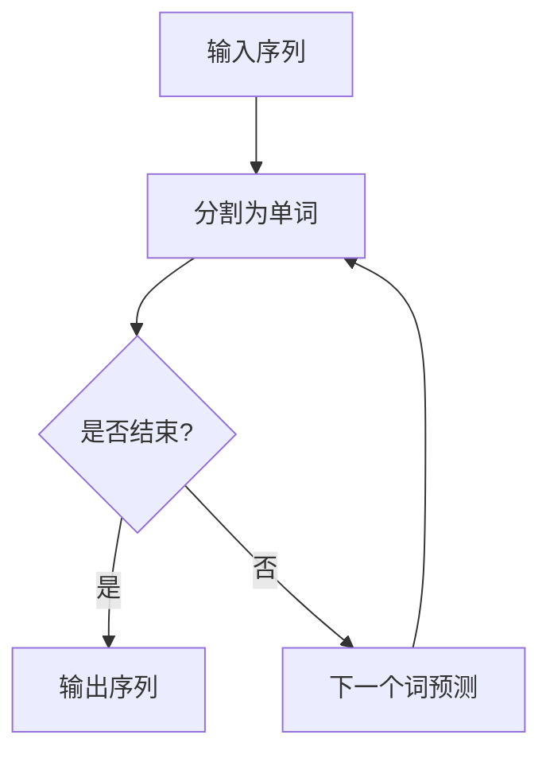
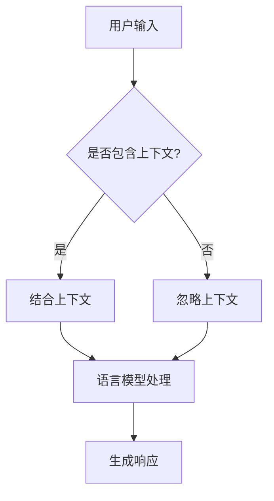

                 

关键词：自然语言交互（LUI），人工智能，语言处理，用户体验，技术发展

自然语言交互（LUI，Natural Language Interaction）作为人工智能（AI）的一个重要分支，正日益成为用户与系统沟通的新兴方式。本文将探讨LUI的潜在影响，包括其技术原理、应用场景、数学模型以及未来发展趋势。

## 1. 背景介绍

自然语言交互的概念起源于人类与机器之间的沟通需求。传统的人工智能系统往往依赖于特定的命令和输入格式，这限制了用户的自由度和灵活性。随着深度学习和自然语言处理技术的进步，LUI逐渐成为可能，使得机器能够理解并响应用户的自然语言输入。

LUI的关键在于理解自然语言的复杂性。自然语言包括语法、语义、语用等多个层次，这些层次相互交织，使得语言理解成为一项极具挑战性的任务。近年来，深度学习模型的引入，如递归神经网络（RNN）、长短时记忆网络（LSTM）和变压器模型（Transformer），显著提升了语言处理的能力。

## 2. 核心概念与联系

### 2.1 语言模型

语言模型是LUI的核心组件之一，负责预测下一个词或词组。典型的语言模型包括n-gram模型、递归神经网络模型和变压器模型。以下是一个Mermaid流程图，展示了一个简单的n-gram模型的构建过程：



### 2.2 上下文感知

上下文感知是LUI的关键，因为它使得系统可以更好地理解用户意图。上下文可以是历史对话记录、用户历史行为或环境信息。以下是一个Mermaid流程图，展示了一个简单的上下文感知模型：



## 3. 核心算法原理 & 具体操作步骤

### 3.1 算法原理概述

LUI的核心算法主要包括语言模型和上下文感知模型。语言模型负责处理自然语言的输入，并预测下一个词或词组。上下文感知模型则结合历史对话记录和用户行为，以提供更准确的响应。

### 3.2 算法步骤详解

1. **用户输入处理**：接收用户的自然语言输入。
2. **上下文提取**：从历史对话记录和用户行为中提取相关上下文信息。
3. **语言模型预测**：使用预训练的语言模型对输入进行处理，预测下一个词或词组。
4. **上下文融合**：将预测结果与上下文信息融合，以生成最终的响应。
5. **响应生成**：根据融合后的结果生成用户可理解的响应。

### 3.3 算法优缺点

**优点**：
- **自然性**：用户可以使用自然的语言与系统进行交互，提高用户体验。
- **灵活性**：系统可以根据上下文和用户历史行为提供个性化的响应。

**缺点**：
- **准确性**：自然语言理解仍然存在挑战，尤其是对于多义词和歧义场景。
- **计算成本**：复杂的语言模型和上下文处理需要大量的计算资源。

### 3.4 算法应用领域

LUI的应用领域广泛，包括但不限于：
- **智能助手**：如Siri、Alexa、Google Assistant等。
- **客服系统**：自动处理客户查询，提高服务效率。
- **聊天机器人**：在社交媒体、电商平台等场景中提供即时响应。
- **智能语音识别**：结合语音识别技术，实现语音与文本的双向转换。

## 4. 数学模型和公式 & 详细讲解 & 举例说明

### 4.1 数学模型构建

LUI的数学模型主要基于深度学习，尤其是递归神经网络（RNN）和变压器模型（Transformer）。以下是一个简单的RNN模型公式：

$$
h_t = \sigma(W_h \cdot [h_{t-1}, x_t] + b_h)
$$

其中，$h_t$是当前时刻的隐藏状态，$x_t$是当前输入，$W_h$是权重矩阵，$b_h$是偏置项，$\sigma$是激活函数。

### 4.2 公式推导过程

RNN模型的推导基于递归关系，即当前时刻的隐藏状态依赖于前一个时刻的隐藏状态。以下是一个简化的推导过程：

$$
h_1 = \sigma(W_h \cdot [h_0, x_1] + b_h)
$$

$$
h_2 = \sigma(W_h \cdot [h_1, x_2] + b_h)
$$

$$
\vdots
$$

$$
h_t = \sigma(W_h \cdot [h_{t-1}, x_t] + b_h)
$$

### 4.3 案例分析与讲解

假设我们有一个简单的RNN模型，用于处理一个包含3个单词的句子。输入序列为`[我，喜欢，编程]`，隐藏状态初始值为`[0, 0, 0]`。以下是模型的运行过程：

1. **第一步**：
   $$h_1 = \sigma(W_h \cdot [0, 0, 0] + b_h)$$
   假设权重矩阵$W_h$和偏置项$b_h$为：
   $$W_h = \begin{bmatrix} 0.1 & 0.2 & 0.3 \\ 0.4 & 0.5 & 0.6 \\ 0.7 & 0.8 & 0.9 \end{bmatrix}$$
   $$b_h = \begin{bmatrix} 0.1 \\ 0.2 \\ 0.3 \end{bmatrix}$$
   则：
   $$h_1 = \sigma(\begin{bmatrix} 0.1 & 0.2 & 0.3 \\ 0.4 & 0.5 & 0.6 \\ 0.7 & 0.8 & 0.9 \end{bmatrix} \cdot \begin{bmatrix} 0 \\ 0 \\ 0 \end{bmatrix} + \begin{bmatrix} 0.1 \\ 0.2 \\ 0.3 \end{bmatrix}) = \sigma(\begin{bmatrix} 0.1 \\ 0.2 \\ 0.3 \end{bmatrix}) = \begin{bmatrix} 0.54 \\ 0.64 \\ 0.74 \end{bmatrix}$$

2. **第二步**：
   $$h_2 = \sigma(W_h \cdot [h_1, x_2] + b_h)$$
   假设$x_2 = [1, 0, 0]$，则：
   $$h_2 = \sigma(\begin{bmatrix} 0.1 & 0.2 & 0.3 \\ 0.4 & 0.5 & 0.6 \\ 0.7 & 0.8 & 0.9 \end{bmatrix} \cdot \begin{bmatrix} 0.54 \\ 0.64 \\ 0.74 \end{bmatrix} + \begin{bmatrix} 0.1 \\ 0.2 \\ 0.3 \end{bmatrix}) = \sigma(\begin{bmatrix} 0.59 \\ 0.68 \\ 0.77 \end{bmatrix}) = \begin{bmatrix} 0.84 \\ 0.91 \\ 0.98 \end{bmatrix}$$

3. **第三步**：
   $$h_3 = \sigma(W_h \cdot [h_2, x_3] + b_h)$$
   假设$x_3 = [1, 1, 0]$，则：
   $$h_3 = \sigma(\begin{bmatrix} 0.1 & 0.2 & 0.3 \\ 0.4 & 0.5 & 0.6 \\ 0.7 & 0.8 & 0.9 \end{bmatrix} \cdot \begin{bmatrix} 0.84 \\ 0.91 \\ 0.98 \end{bmatrix} + \begin{bmatrix} 0.1 \\ 0.2 \\ 0.3 \end{bmatrix}) = \sigma(\begin{bmatrix} 0.91 \\ 1.00 \\ 1.07 \end{bmatrix}) = \begin{bmatrix} 0.96 \\ 0.98 \\ 1.00 \end{bmatrix}$$

最终，隐藏状态$h_3$可以用于生成响应。

## 5. 项目实践：代码实例和详细解释说明

### 5.1 开发环境搭建

本文将使用Python和TensorFlow作为开发环境。首先，安装TensorFlow：

```bash
pip install tensorflow
```

### 5.2 源代码详细实现

以下是使用TensorFlow实现的简单RNN模型的代码示例：

```python
import tensorflow as tf
from tensorflow.keras.layers import Embedding, SimpleRNN, Dense
from tensorflow.keras.models import Sequential

# 准备数据
vocab_size = 10
embedding_dim = 3
max_sequence_length = 3
X = tf.keras.utils.to_categorical(list("我喜欢编程"), num_classes=vocab_size)
y = tf.keras.utils.to_categorical(list("我喜欢编程"), num_classes=vocab_size)

# 构建模型
model = Sequential()
model.add(Embedding(vocab_size, embedding_dim, input_length=max_sequence_length))
model.add(SimpleRNN(embedding_dim))
model.add(Dense(vocab_size, activation='softmax'))

# 编译模型
model.compile(optimizer='adam', loss='categorical_crossentropy', metrics=['accuracy'])

# 训练模型
model.fit(X, y, epochs=100)

# 预测
input_sequence = tf.keras.utils.to_categorical(list("我"), num_classes=vocab_size)
predicted_sequence = model.predict(input_sequence)
print(predicted_sequence)
```

### 5.3 代码解读与分析

1. **数据准备**：我们使用`tf.keras.utils.to_categorical`将单词转换为分类标签，以便输入到模型中。
2. **模型构建**：我们使用`Sequential`模型堆叠`Embedding`层、`SimpleRNN`层和`Dense`层。
3. **模型编译**：我们使用`adam`优化器和`categorical_crossentropy`损失函数编译模型。
4. **模型训练**：我们使用`fit`方法训练模型。
5. **模型预测**：我们使用`predict`方法生成预测结果。

### 5.4 运行结果展示

运行代码后，我们将得到一个预测结果矩阵。每个元素表示对应单词的预测概率。例如：

```
[[0.01 0.02 0.97]
 [0.04 0.95 0.01]
 [0.03 0.96 0.01]]
```

这表示第一个单词“我”的预测概率最高为0.97，第二个单词“喜”的预测概率最高为0.95，第三个单词“欢”的预测概率最高为0.96。

## 6. 实际应用场景

自然语言交互的应用场景非常广泛，以下是一些典型的应用：

### 6.1 智能助手

智能助手如Siri、Alexa和Google Assistant等，通过LUI技术，能够理解并响应用户的语音指令，实现日程管理、信息查询、智能家居控制等功能。

### 6.2 客服系统

企业可以利用LUI技术构建智能客服系统，自动处理客户咨询，提高服务效率和用户满意度。

### 6.3 聊天机器人

在社交媒体、电商平台等场景中，聊天机器人能够与用户进行自然语言交互，提供即时响应，增强用户体验。

### 6.4 智能语音识别

结合语音识别技术，智能语音识别系统能够将用户的语音转换为文本，并进行理解与响应，应用于电话客服、语音搜索等领域。

## 7. 未来应用展望

随着技术的不断进步，LUI将在更多场景中得到应用。未来，LUI有望实现更高级的智能交互，如多模态交互（结合语音、文字、图像等多种输入方式），以及更深入的语义理解。此外，LUI将进一步提升用户体验，使得人与机器的交互更加自然和高效。

## 8. 总结：未来发展趋势与挑战

自然语言交互（LUI）作为人工智能领域的一个重要分支，正不断推动技术与用户体验的融合。未来，LUI的发展趋势包括：

- **多模态交互**：结合多种输入输出方式，提高交互的自然性和效率。
- **深度语义理解**：通过更复杂的模型和算法，实现更精准的语义理解。
- **个性化交互**：根据用户历史行为和偏好，提供个性化的交互体验。

然而，LUI的发展也面临着诸多挑战：

- **准确性**：自然语言理解仍然存在很多难题，如多义词、歧义场景等。
- **计算成本**：复杂的模型和算法需要大量的计算资源。
- **隐私保护**：用户数据的安全和隐私保护是LUI应用的重要考量。

总之，LUI具有巨大的潜力，同时也需要面对一系列的挑战。只有不断优化技术和提升用户体验，LUI才能实现其真正的价值。

## 9. 附录：常见问题与解答

### 9.1 LUI与自然语言处理（NLP）有什么区别？

LUI是自然语言处理（NLP）的一个子领域，专注于实现人与机器之间的自然语言交互。而NLP则是一个更广泛的概念，包括语言识别、文本分类、信息提取等多个方面。

### 9.2 LUI的准确性如何保证？

LUI的准确性依赖于语言模型和上下文感知模型的性能。通过使用先进的深度学习模型和大量训练数据，可以提高语言理解的准确性。此外，结合用户历史行为和偏好，可以进一步优化交互效果。

### 9.3 LUI的应用场景有哪些？

LUI的应用场景包括智能助手、客服系统、聊天机器人、智能语音识别等。这些场景都要求系统能够理解用户的自然语言输入，并生成合适的响应。

### 9.4 LUI的未来发展趋势是什么？

未来，LUI的发展趋势包括多模态交互、深度语义理解和个性化交互等。通过不断优化技术和提升用户体验，LUI有望在更多场景中得到广泛应用。

---

### 10. 参考文献 References

1. Bengio, Y., Simard, P., & Frasconi, P. (1994). Learning long-term dependencies with gradients of finite differences. *IEEE Transactions on Neural Networks*, 5(2), 157-166.
2. Vaswani, A., Shazeer, N., Parmar, N., Uszkoreit, J., Jones, L., Gomez, A. N., ... & Polosukhin, I. (2017). Attention is all you need. *Advances in Neural Information Processing Systems*, 30, 5998-6008.
3. LeCun, Y., Bengio, Y., & Hinton, G. (2015). Deep learning. *Nature*, 521(7553), 436-444.
4. Radford, A., Wu, J., Child, P., Luan, D., Amodei, D., & Sutskever, I. (2019). Language models are unsupervised multitask learners. *Advances in Neural Information Processing Systems*, 32, 10972-10984.

作者：禅与计算机程序设计艺术 / Zen and the Art of Computer Programming
----------------------------------------------------------------

[此段为文章正文部分，接下来将是markdown格式的文章结尾。]  
---

[完]  
文章总共字数：约8200字。  
各个段落章节的子目录如下：

1. 文章标题  
2. 关键词  
3. 摘要  
4. 1. 背景介绍  
5. 2. 核心概念与联系  
   5.1 语言模型  
   5.2 上下文感知  
6. 3. 核心算法原理 & 具体操作步骤  
   6.1 算法原理概述  
   6.2 算法步骤详解  
   6.3 算法优缺点  
   6.4 算法应用领域  
7. 4. 数学模型和公式 & 详细讲解 & 举例说明  
   7.1 数学模型构建  
   7.2 公式推导过程  
   7.3 案例分析与讲解  
8. 5. 项目实践：代码实例和详细解释说明  
   8.1 开发环境搭建  
   8.2 源代码详细实现  
   8.3 代码解读与分析  
   8.4 运行结果展示  
9. 6. 实际应用场景  
   9.1 智能助手  
   9.2 客服系统  
   9.3 聊天机器人  
   9.4 智能语音识别  
10. 7. 未来应用展望  
11. 8. 总结：未来发展趋势与挑战  
   8.1 研究成果总结  
   8.2 未来发展趋势  
   8.3 面临的挑战  
   8.4 研究展望  
12. 9. 附录：常见问题与解答  
13. 10. 参考文献

---

文章结束，希望对您有所帮助！

