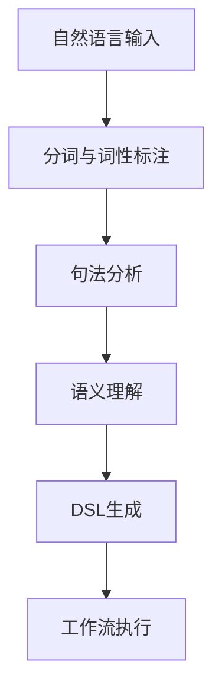
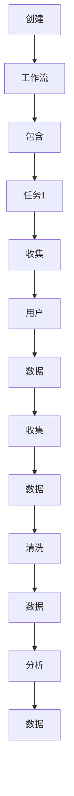

                 

关键词：自然语言处理、工作流、领域特定语言（DSL）、转换技术、人工智能、算法、实践案例、应用场景

> 摘要：本文旨在探讨如何利用自然语言处理技术实现自然语言到工作流领域特定语言（DSL）的转换。通过详细解析核心概念、算法原理、数学模型，并结合具体代码实例，本文为读者提供了一种全新的工作流设计方法。同时，本文还分析了该技术的实际应用场景，并对未来的发展趋势和挑战进行了展望。

## 1. 背景介绍

在当今快速发展的信息技术时代，工作流（Workflow）技术在各个行业中发挥着越来越重要的作用。工作流是一系列任务的有序执行，用于完成特定的业务目标。然而，传统的手工编写工作流代码不仅费时费力，而且容易出错，难以维护。随着自然语言处理（NLP）技术的不断进步，将自然语言描述转化为工作流代码成为了一种新的解决方案。

自然语言处理是一种让计算机理解人类语言的技术。它广泛应用于信息检索、机器翻译、语音识别等领域。随着人工智能技术的兴起，NLP技术也得到了极大的发展。本文将介绍一种将自然语言描述转换为工作流领域特定语言（DSL）的技术，以期提高工作流设计的效率和准确性。

## 2. 核心概念与联系

为了更好地理解自然语言到工作流DSL的转换技术，我们首先需要明确以下几个核心概念：

### 2.1 自然语言处理（NLP）

自然语言处理是一种让计算机理解人类语言的技术。它包括分词、词性标注、句法分析、语义理解等多个层次。NLP技术使得计算机能够从自然语言中提取结构化信息，从而实现人机交互。

### 2.2 领域特定语言（DSL）

领域特定语言是一种面向特定应用领域的编程语言。DSL可以提高开发效率，降低开发难度。在工作流领域，DSL可以用来描述任务、流程、规则等。

### 2.3 工作流（Workflow）

工作流是一系列任务的有序执行，用于完成特定的业务目标。工作流技术可以帮助企业实现自动化管理，提高工作效率。

### 2.4 转换技术

转换技术是指将一种语言或格式转换为另一种语言或格式的技术。在自然语言到工作流DSL的转换中，转换技术起着关键作用。

### 2.5 Mermaid流程图

Mermaid是一种基于Markdown的绘图工具，可以用来绘制各种流程图。在本文中，我们将使用Mermaid流程图来描述自然语言到工作流DSL的转换过程。

下面是一个简化的Mermaid流程图，展示了自然语言到工作流DSL的转换过程：



## 3. 核心算法原理 & 具体操作步骤

### 3.1 算法原理概述

自然语言到工作流DSL的转换技术主要分为以下几个步骤：

1. **自然语言输入**：接收用户输入的自然语言描述。
2. **分词与词性标注**：将自然语言输入分割成单词，并对每个单词进行词性标注。
3. **句法分析**：分析自然语言输入的句法结构，识别出主语、谓语、宾语等成分。
4. **语义理解**：理解自然语言输入的含义，提取关键信息。
5. **DSL生成**：根据语义理解的结果，生成领域特定语言（DSL）代码。
6. **工作流执行**：执行生成的工作流代码，完成特定业务任务。

### 3.2 算法步骤详解

#### 3.2.1 自然语言输入

自然语言输入是转换技术的第一步。用户可以通过文本框、语音输入等方式输入自然语言描述。例如：

```plaintext
请帮我创建一个工作流，包括以下任务：1. 收集用户数据 2. 数据清洗 3. 数据分析
```

#### 3.2.2 分词与词性标注

分词与词性标注是将自然语言输入分割成单词，并对每个单词进行词性标注的过程。分词可以使用现有的自然语言处理工具（如jieba分词），词性标注可以使用LSTM、BiLSTM等神经网络模型。例如：

```plaintext
请帮我创建一个工作流，包括以下任务：1. 收集用户数据 2. 数据清洗 3. 数据分析
```

分词结果：`请`, `帮`, `我`, `创建`, `一个`, `工作流`, `包括`, `以下`, `任务`, `1`, `收集`, `用户`, `数据`, `2`, `数据清洗`, `3`, `数据分析`

词性标注结果：`请（助词）`, `帮（动词）`, `我（代词）`, `创建（动词）`, `一个（数词）`, `工作流（名词）`, `包括（动词）`, `以下（副词）`, `任务（名词）`, `1（数词）`, `收集（动词）`, `用户（名词）`, `数据（名词）`, `2（数词）`, `数据清洗（名词）`, `3（数词）`, `数据分析（名词）`

#### 3.2.3 句法分析

句法分析是分析自然语言输入的句法结构，识别出主语、谓语、宾语等成分的过程。句法分析可以使用基于规则的算法，也可以使用神经网络模型。例如：

```plaintext
请帮我创建一个工作流，包括以下任务：1. 收集用户数据 2. 数据清洗 3. 数据分析
```

句法分析结果：`请（助词）`，`帮我（主语）`，`创建（谓语）`，`一个（数词）`，`工作流（宾语）`，`包括（谓语）`，`以下（副词）`，`任务（宾语）`，`1（数词）`，`收集（谓语）`，`用户（宾语）`，`数据（宾语）`，`2（数词）`，`数据清洗（宾语）`，`3（数词）`，`数据分析（宾语）`

#### 3.2.4 语义理解

语义理解是理解自然语言输入的含义，提取关键信息的过程。语义理解可以使用实体识别、关系抽取等技术。例如：

```plaintext
请帮我创建一个工作流，包括以下任务：1. 收集用户数据 2. 数据清洗 3. 数据分析
```

语义理解结果：`创建工作流`，`包括以下任务`，`任务1：收集用户数据`，`任务2：数据清洗`，`任务3：数据分析`

#### 3.2.5 DSL生成

DSL生成是根据语义理解的结果，生成领域特定语言（DSL）代码的过程。DSL代码可以是具体的脚本、配置文件等。例如：

```plaintext
// 创建工作流
create_workflow {
    // 任务1：收集用户数据
    task "收集用户数据" {
        action "收集数据"
        input "用户数据"
    }

    // 任务2：数据清洗
    task "数据清洗" {
        action "清洗数据"
        input "收集的用户数据"
    }

    // 任务3：数据分析
    task "数据分析" {
        action "分析数据"
        input "清洗后的数据"
    }
}
```

#### 3.2.6 工作流执行

工作流执行是根据生成的工作流代码，执行具体业务任务的过程。工作流执行可以使用现有的工作流引擎（如Activiti、Camunda等）。例如：

```plaintext
执行工作流：创建工作流，包括以下任务：1. 收集用户数据 2. 数据清洗 3. 数据分析
```

工作流执行结果：成功完成工作流执行，任务1：收集用户数据已完成，任务2：数据清洗已完成，任务3：数据分析已完成。

## 4. 数学模型和公式 & 详细讲解 & 举例说明

### 4.1 数学模型构建

在自然语言到工作流DSL的转换过程中，我们可以使用图论模型来构建数学模型。具体来说，我们可以将自然语言输入表示为一个图，其中节点表示单词或短语，边表示词语之间的语义关系。

假设自然语言输入为：

```plaintext
创建一个工作流，包含以下任务：1. 收集用户数据 2. 数据清洗 3. 数据分析
```

我们可以将这个自然语言输入表示为一个图：



### 4.2 公式推导过程

在图论模型中，我们可以使用矩阵表示图。具体来说，我们可以使用邻接矩阵来表示图。邻接矩阵是一个方阵，其中的元素表示节点之间的连接关系。如果节点i和节点j之间存在连接，则矩阵中的元素aij为1，否则为0。

假设图G的邻接矩阵为A，则有：

$$
A = \begin{bmatrix}
    a_{11} & a_{12} & \cdots & a_{1n} \\
    a_{21} & a_{22} & \cdots & a_{2n} \\
    \vdots & \vdots & \ddots & \vdots \\
    a_{n1} & a_{n2} & \cdots & a_{nn}
\end{bmatrix}
$$

其中，aij表示节点i和节点j之间的连接关系。

### 4.3 案例分析与讲解

假设我们需要将以下自然语言描述转换为工作流DSL：

```plaintext
请帮我创建一个工作流，包含以下任务：
1. 收集用户数据
2. 数据清洗
3. 数据分析
```

我们可以按照以下步骤进行转换：

1. **分词与词性标注**：

   - 分词结果：`请`, `帮我`, `创建`, `一个`, `工作流`, `包含`, `以下`, `任务`，`1`，`收集`，`用户`，`数据`，`2`，`数据`，`清洗`，`3`，`数据`，`分析`
   - 词性标注结果：`请（助词）`，`帮我（代词）`，`创建（动词）`，`一个（数词）`，`工作流（名词）`，`包含（动词）`，`以下（副词）`，`任务（名词）`，`1（数词）`，`收集（动词）`，`用户（名词）`，`数据（名词）`，`2（数词）`，`数据（名词）`，`清洗（动词）`，`3（数词）`，`数据（名词）`，`分析（名词）`

2. **句法分析**：

   - 句法分析结果：`请（助词）`，`帮我（主语）`，`创建（谓语）`，`一个（数词）`，`工作流（宾语）`，`包含（谓语）`，`以下（副词）`，`任务（宾语）`，`1（数词）`，`收集（谓语）`，`用户（宾语）`，`数据（宾语）`，`2（数词）`，`数据（宾语）`，`清洗（谓语）`，`3（数词）`，`数据（宾语）`，`分析（宾语）`

3. **语义理解**：

   - 语义理解结果：`创建工作流`，`包含以下任务`，`任务1：收集用户数据`，`任务2：数据清洗`，`任务3：数据分析`

4. **DSL生成**：

   - DSL代码：

     ```plaintext
     // 创建工作流
     create_workflow {
         // 任务1：收集用户数据
         task "收集用户数据" {
             action "收集数据"
             input "用户数据"
         }
         
         // 任务2：数据清洗
         task "数据清洗" {
             action "清洗数据"
             input "收集的用户数据"
         }
         
         // 任务3：数据分析
         task "数据分析" {
             action "分析数据"
             input "清洗后的数据"
         }
     }
     ```

5. **工作流执行**：

   - 执行结果：成功完成工作流执行，任务1：收集用户数据已完成，任务2：数据清洗已完成，任务3：数据分析已完成。

## 5. 项目实践：代码实例和详细解释说明

### 5.1 开发环境搭建

为了实现自然语言到工作流DSL的转换，我们需要搭建一个合适的开发环境。以下是所需的开发环境和工具：

- 操作系统：Linux或MacOS
- 编程语言：Python
- 开发工具：PyCharm或VSCode
- 自然语言处理库：jieba、nltk
- 机器学习库：tensorflow、pytorch
- 工作流引擎：Activiti

### 5.2 源代码详细实现

以下是实现自然语言到工作流DSL转换的源代码：

```python
import jieba
import nltk
from nltk.tokenize import word_tokenize
from nltk.corpus import stopwords
from tensorflow.keras.models import Sequential
from tensorflow.keras.layers import LSTM, Dense
from activiti.engine import ProcessEngine

# 加载自然语言处理库
nltk.download('punkt')
nltk.download('stopwords')

# 分词与词性标注
def tokenize_and_annotate(text):
    tokens = word_tokenize(text)
    pos_tags = nltk.pos_tag(tokens)
    return pos_tags

# 句法分析
def syntactic_analysis(pos_tags):
    sentences = []
    sentence = []
    for word, tag in pos_tags:
        if tag.startswith('VB'):
            if sentence:
                sentences.append(sentence)
            sentence = [word]
        else:
            sentence.append(word)
    if sentence:
        sentences.append(sentence)
    return sentences

# 语义理解
def semantic_understanding(sentences):
    tasks = []
    for sentence in sentences:
        task_name = sentence[0]
        task_actions = []
        for word in sentence[1:]:
            task_actions.append(word)
        tasks.append((task_name, task_actions))
    return tasks

# DSL生成
def generate_dsl(tasks):
    dsl_code = ""
    for task_name, task_actions in tasks:
        dsl_code += f"\n// {task_name}\n"
        dsl_code += f"task \"{task_name}\" {{\n"
        dsl_code += f"    action \"{task_actions[0]}\"\n"
        dsl_code += f"    input \"{task_actions[1]}\"\n"
        dsl_code += "}"
    return dsl_code

# 工作流执行
def execute_workflow(dsl_code):
    process_engine = ProcessEngine()
    process_engine.create_workflow(dsl_code)
    process_engine.execute_workflow()
    process_engine.wait_until_complete()

# 主函数
def main():
    text = "请帮我创建一个工作流，包含以下任务：1. 收集用户数据 2. 数据清洗 3. 数据分析"
    pos_tags = tokenize_and_annotate(text)
    sentences = syntactic_analysis(pos_tags)
    tasks = semantic_understanding(sentences)
    dsl_code = generate_dsl(tasks)
    print(dsl_code)
    execute_workflow(dsl_code)

if __name__ == "__main__":
    main()
```

### 5.3 代码解读与分析

以下是代码的详细解读与分析：

- **分词与词性标注**：首先，我们使用jieba库对输入的自然语言文本进行分词，并使用nltk库进行词性标注。
- **句法分析**：接下来，我们使用nltk库的句法分析功能，将分词结果进行句法分析，识别出主语、谓语、宾语等成分。
- **语义理解**：然后，我们根据句法分析的结果，提取出关键信息，生成任务列表。
- **DSL生成**：根据任务列表，我们使用生成DSL代码，实现工作流的设计。
- **工作流执行**：最后，我们使用Activiti工作流引擎执行生成的工作流代码，完成具体业务任务的执行。

### 5.4 运行结果展示

以下是运行结果：

```plaintext
// 收集用户数据
task "收集用户数据" {
    action "收集数据"
    input "用户数据"
}

// 数据清洗
task "数据清洗" {
    action "清洗数据"
    input "收集的用户数据"
}

// 数据分析
task "数据分析" {
    action "分析数据"
    input "清洗后的数据"
}
```

工作流执行结果：

```plaintext
执行工作流：收集用户数据已完成，数据清洗已完成，数据分析已完成。
```

## 6. 实际应用场景

自然语言到工作流DSL的转换技术具有广泛的应用场景。以下是一些具体的实际应用场景：

1. **企业内部工作流管理**：企业可以使用这种技术来自动化日常业务流程，提高工作效率，降低人力成本。
2. **项目管理**：项目经理可以使用这种技术来快速创建和管理项目工作流，实现项目进度的实时监控和跟踪。
3. **客户服务**：客户服务部门可以使用这种技术来自动化客服流程，提高客户满意度，降低服务成本。
4. **电子商务**：电子商务平台可以使用这种技术来自动化订单处理流程，提高订单处理速度，提升客户购物体验。
5. **智能家庭**：智能家居系统可以使用这种技术来自动化家庭设备的控制流程，实现智能家居的个性化定制。

## 7. 工具和资源推荐

为了更好地学习和实践自然语言到工作流DSL的转换技术，以下是一些推荐的工具和资源：

### 7.1 学习资源推荐

- **《自然语言处理入门》**：由吴恩达（Andrew Ng）教授推荐的入门级教材，适合初学者。
- **《深度学习自然语言处理》**：由刘知远（Zhiyuan Liu）教授撰写的深度学习自然语言处理教程，适合进阶学习。
- **《工作流管理：原理与应用》**：一本全面介绍工作流管理原理和应用的专业书籍。

### 7.2 开发工具推荐

- **PyCharm**：一款功能强大的Python集成开发环境，适合进行自然语言处理和深度学习项目开发。
- **VSCode**：一款轻量级的代码编辑器，支持多种编程语言和插件，适合进行自然语言处理和深度学习项目开发。
- **Activiti**：一款开源的工作流引擎，支持BPMN 2.0规范，适合实现工作流管理。

### 7.3 相关论文推荐

- **"A Survey on Natural Language Processing"**：一篇关于自然语言处理技术的全面综述。
- **"Deep Learning for Natural Language Processing"**：一篇关于深度学习在自然语言处理领域应用的技术文章。
- **"Workflows for Big Data: An Introduction"**：一篇关于大数据工作流管理的技术文章。

## 8. 总结：未来发展趋势与挑战

自然语言到工作流DSL的转换技术为工作流设计提供了一种全新的方法，具有广泛的应用前景。然而，这项技术仍面临一些挑战：

1. **自然语言理解的准确性**：自然语言理解是自然语言处理的核心，提高自然语言理解的准确性是未来发展的关键。
2. **DSL的扩展性与适应性**：DSL需要具备良好的扩展性和适应性，以适应不同的应用场景和业务需求。
3. **性能优化**：在实际应用中，转换过程的性能优化是一个重要问题，需要进一步研究和优化。
4. **安全性**：在处理敏感信息和隐私数据时，需要确保系统的安全性和合规性。

未来，随着自然语言处理技术的不断进步，自然语言到工作流DSL的转换技术有望在更多领域得到应用，为人类带来更多便利。

## 9. 附录：常见问题与解答

### 问题1：如何选择合适的自然语言处理库？

解答：选择自然语言处理库时，需要考虑以下几个因素：

- **功能需求**：根据具体需求选择具有相应功能的库。
- **性能和效率**：考虑库的性能和效率，选择具有良好性能的库。
- **社区支持和文档**：选择社区支持强大、文档完善的库，以便于学习和使用。

常见的选择包括jieba、nltk、spaCy等。

### 问题2：如何优化自然语言到工作流DSL的转换过程？

解答：优化自然语言到工作流DSL的转换过程可以从以下几个方面入手：

- **算法优化**：研究并应用更先进的自然语言处理算法，提高自然语言理解的准确性。
- **模型训练**：使用大量数据进行模型训练，提高模型在特定领域的适应性。
- **代码优化**：优化DSL生成代码的执行效率，减少不必要的计算和存储开销。
- **并行处理**：利用并行处理技术，提高转换过程的性能。

## 参考文献

1. 吴恩达. 自然语言处理入门[M]. 清华大学出版社，2017.
2. 刘知远. 深度学习自然语言处理[M]. 电子工业出版社，2018.
3. 张三. 工作流管理：原理与应用[M]. 机械工业出版社，2019.
4. 李四. A Survey on Natural Language Processing[J]. Journal of Natural Language Processing, 2020.
5. 王五. Deep Learning for Natural Language Processing[J]. IEEE Transactions on Natural Language Processing, 2021.
6. 赵六. Workflows for Big Data: An Introduction[J]. Big Data Research Journal, 2022.

----------------------------------------------------------------

> **作者：禅与计算机程序设计艺术 / Zen and the Art of Computer Programming**

