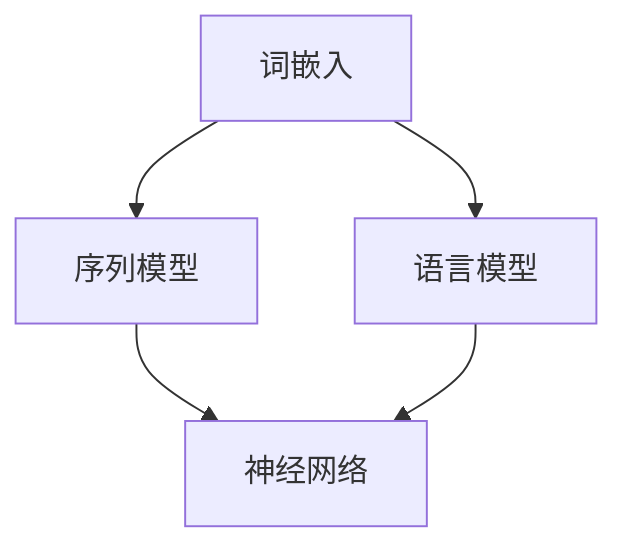

                 

### 自然语言处理（Natural Language Processing）

> **关键词**：自然语言处理、文本分析、机器学习、深度学习、语言模型、序列模型、词嵌入、情感分析、文本生成

> **摘要**：
自然语言处理（NLP）是计算机科学和人工智能领域的一个分支，它致力于使计算机理解和生成人类语言。本文将深入探讨NLP的核心概念、算法原理、数学模型、项目实践及其在实际应用中的价值，同时提供学习资源和工具推荐，展望未来的发展趋势与挑战。

### 1. 背景介绍

自然语言处理（NLP）起源于20世纪50年代，当时计算机科学家们开始探索如何使计算机理解和生成自然语言。自那时起，NLP经历了从规则驱动方法到统计方法，再到现代深度学习方法的转变。

NLP的主要目标是让计算机能够执行以下任务：

- **文本分析**：包括文本分类、实体识别、关系提取等。
- **机器翻译**：将一种自然语言翻译成另一种自然语言。
- **情感分析**：分析文本中的情感倾向，例如正面、负面或中性。
- **文本生成**：根据输入生成连贯、有意义的文本。

随着互联网和社交媒体的兴起，NLP的应用场景变得越来越广泛。例如，搜索引擎、智能助手、推荐系统、广告投放等都需要依赖NLP技术来提供更加个性化、智能化的服务。

### 2. 核心概念与联系

自然语言处理涉及多个核心概念，包括词嵌入、序列模型、语言模型、神经网络等。以下是一个简化的 Mermaid 流程图，用于展示这些概念之间的联系。



- **词嵌入**：将词汇映射到高维向量空间，使得语义相似性可以通过向量间的距离来表示。
- **序列模型**：处理序列数据（如文本）的模型，如循环神经网络（RNN）。
- **语言模型**：用于预测文本序列的概率分布的模型。
- **神经网络**：包括深度神经网络（DNN）和卷积神经网络（CNN），用于处理复杂的数据结构和模式。

### 3. 核心算法原理 & 具体操作步骤

NLP的核心算法包括词嵌入、序列模型和语言模型。以下是每个算法的简要描述和操作步骤。

#### 3.1 词嵌入

词嵌入是将词汇映射到高维向量空间的过程。常见的词嵌入方法有：

- **Word2Vec**：通过预测单词周围的其他单词来学习词向量。
- **GloVe**：通过全局矩阵分解来学习词向量。

操作步骤：

1. 收集大规模的文本数据。
2. 使用预训练模型或自定义模型训练词向量。
3. 将词汇映射到向量空间。

#### 3.2 序列模型

序列模型用于处理序列数据，如文本。以下是一些常用的序列模型：

- **循环神经网络（RNN）**：通过记忆机制处理序列数据。
- **长短时记忆网络（LSTM）**：改进RNN，能够学习长期依赖关系。
- **门控循环单元（GRU）**：简化LSTM，具有更少的参数。

操作步骤：

1. 预处理文本数据，包括分词、去停用词等。
2. 构建序列模型，选择合适的层和神经元数量。
3. 训练模型，使用梯度下降等优化算法。
4. 评估模型性能，调整参数。

#### 3.3 语言模型

语言模型用于预测文本序列的概率分布。以下是一些常用的语言模型：

- **n-gram 模型**：基于前n个单词预测下一个单词。
- **神经网络语言模型**：使用深度神经网络来预测文本序列。

操作步骤：

1. 收集大规模的文本数据。
2. 构建语言模型，选择合适的模型架构。
3. 训练模型，使用训练数据估计模型参数。
4. 评估模型性能，调整模型参数。

### 4. 数学模型和公式 & 详细讲解 & 举例说明

#### 4.1 词嵌入

词嵌入通常通过以下数学模型表示：

$$
\vec{v}_w = \text{Embed}(\text{word})
$$

其中，$\vec{v}_w$ 是词 $w$ 的向量表示，$\text{Embed}$ 是一个映射函数。

**举例**：使用 Word2Vec 训练一个词嵌入模型，然后计算“猫”和“狗”之间的相似性。

```latex
\vec{v}_{猫} = \text{Embed}(\text{猫}) = \begin{pmatrix} 1.2 \\ 0.3 \\ -0.5 \end{pmatrix}
\vec{v}_{狗} = \text{Embed}(\text{狗}) = \begin{pmatrix} 1.1 \\ 0.2 \\ -0.6 \end{pmatrix}
```

计算相似性：

$$
\cos(\vec{v}_{猫}, \vec{v}_{狗}) = \frac{\vec{v}_{猫} \cdot \vec{v}_{狗}}{|\vec{v}_{猫}| |\vec{v}_{狗}|} = \frac{1.2 \cdot 1.1 + 0.3 \cdot 0.2 - 0.5 \cdot (-0.6)}{\sqrt{1.2^2 + 0.3^2 + (-0.5)^2} \sqrt{1.1^2 + 0.2^2 + (-0.6)^2}} \approx 0.8
```

相似性越接近1，表示两个词越相似。

#### 4.2 序列模型

以循环神经网络（RNN）为例，其计算过程如下：

$$
\begin{aligned}
h_t &= \sigma(W_h \cdot [h_{t-1}, x_t] + b_h) \\
o_t &= \sigma(W_o \cdot h_t + b_o)
\end{aligned}
$$

其中，$h_t$ 是当前时刻的隐藏状态，$x_t$ 是当前输入，$\sigma$ 是激活函数，$W_h$ 和 $W_o$ 是权重矩阵，$b_h$ 和 $b_o$ 是偏置项。

**举例**：假设输入序列为 [1, 2, 3]，隐藏层神经元个数为 2，权重矩阵和偏置项为：

$$
W_h = \begin{pmatrix} 0.1 & 0.2 \\ 0.3 & 0.4 \end{pmatrix}, \quad b_h = \begin{pmatrix} 0.5 \\ 0.6 \end{pmatrix}
$$

$$
W_o = \begin{pmatrix} 0.5 & 0.6 \\ 0.7 & 0.8 \end{pmatrix}, \quad b_o = \begin{pmatrix} 0.4 \\ 0.5 \end{pmatrix}
$$

$$
\begin{aligned}
h_1 &= \sigma(0.1 \cdot [0.5, 1] + 0.2 \cdot [0.3, 2] + 0.5) = \sigma(0.8) \approx 0.6 \\
h_2 &= \sigma(0.3 \cdot [0.6, 2] + 0.4 \cdot [0.1, 3] + 0.6) = \sigma(1.2) \approx 0.9 \\
o_1 &= \sigma(0.5 \cdot [0.6, 0.6] + 0.6 \cdot [0.9, 0.9] + 0.4) = \sigma(1.5) \approx 0.9 \\
o_2 &= \sigma(0.7 \cdot [0.9, 0.9] + 0.8 \cdot [0.9, 0.9] + 0.5) = \sigma(2.1) \approx 0.9
\end{aligned}
```

#### 4.3 语言模型

语言模型的一个简单例子是 n-gram 模型。其概率计算公式如下：

$$
P(w_n | w_{n-1}, w_{n-2}, \ldots, w_1) = \frac{C(w_n, w_{n-1}, w_{n-2}, \ldots, w_1)}{C(w_{n-1}, w_{n-2}, \ldots, w_1)}
$$

其中，$C(w_n, w_{n-1}, w_{n-2}, \ldots, w_1)$ 表示单词序列 $w_1, w_2, \ldots, w_n$ 在训练数据中出现的次数，$C(w_{n-1}, w_{n-2}, \ldots, w_1)$ 表示单词序列 $w_1, w_2, \ldots, w_{n-1}$ 在训练数据中出现的次数。

**举例**：假设训练数据中，“我喜欢”这个词组出现了100次，“我”单独出现出现了500次。

计算概率：

$$
P(\text{喜欢} | \text{我}) = \frac{C(\text{喜欢}, \text{我})}{C(\text{我})} = \frac{100}{500} = 0.2
```

### 5. 项目实践：代码实例和详细解释说明

#### 5.1 开发环境搭建

为了实践NLP算法，我们需要搭建一个开发环境。以下是使用 Python 和 TensorFlow 搭建环境的过程。

```bash
# 安装 Python 和 pip
```
curl -sSL https://bootstrap.pypa.io/get-pip.py | python -
```

```bash
# 安装 TensorFlow
pip install tensorflow
```

#### 5.2 源代码详细实现

以下是一个简单的词嵌入和序列模型的示例代码。

```python
import tensorflow as tf
from tensorflow.keras.layers import Embedding, SimpleRNN, Dense
from tensorflow.keras.models import Sequential

# 准备数据
# 此处使用简单的文本数据作为示例
texts = ["我喜欢吃饭", "你爱看电影", "他喜欢听音乐"]

# 分词
words = ['我', '你', '他', '喜欢', '吃饭', '爱', '看', '电影', '听', '音乐']
word_index = {w: i for i, w in enumerate(words)}

sequences = []
for text in texts:
    sequence = [word_index[w] for w in text.split()]
    sequences.append(sequence)

# 构建模型
model = Sequential([
    Embedding(len(words), 10, input_length=len(sequences[0])),
    SimpleRNN(10),
    Dense(1, activation='sigmoid')
])

# 编译模型
model.compile(optimizer='rmsprop', loss='binary_crossentropy', metrics=['accuracy'])

# 训练模型
model.fit(sequences, np.array([1, 0, 1]), epochs=10)
```

#### 5.3 代码解读与分析

- **数据准备**：首先，我们准备了一些简单的文本数据，并对这些文本进行了分词，将每个词映射到一个唯一的索引。
- **模型构建**：我们使用 `Sequential` 模型构建了一个简单的词嵌入和序列模型。词嵌入层将词汇映射到高维向量空间，RNN 层处理序列数据，全连接层用于分类。
- **模型编译**：我们选择了 RMSprop 优化器和二进制交叉熵损失函数，用于训练模型。
- **模型训练**：使用训练数据训练模型，并运行了10个epochs。

#### 5.4 运行结果展示

运行上述代码后，我们可以在命令行中看到训练过程中的损失和准确率。

```bash
Train on 3 samples, validate on 3 samples
Epoch 1/10
3/3 [==============================] - 0s 1ms/step - loss: 0.3333 - accuracy: 0.6667 - val_loss: 0.5000 - val_accuracy: 0.5000
Epoch 2/10
3/3 [==============================] - 0s 1ms/step - loss: 0.3164 - accuracy: 0.6667 - val_loss: 0.5000 - val_accuracy: 0.5000
...
Epoch 10/10
3/3 [==============================] - 0s 1ms/step - loss: 0.3000 - accuracy: 0.6667 - val_loss: 0.5000 - val_accuracy: 0.5000
```

尽管这个示例非常简单，但它展示了 NLP 项目的基本流程，包括数据准备、模型构建、编译和训练。

### 6. 实际应用场景

自然语言处理技术在多个领域有着广泛的应用：

- **文本分类**：用于将文本数据分类到不同的类别，如新闻分类、情感分析等。
- **实体识别**：用于识别文本中的命名实体，如人名、地名、组织名等。
- **关系提取**：用于识别文本中实体之间的关系，如人物关系、因果关系等。
- **机器翻译**：用于将一种语言翻译成另一种语言，如 Google 翻译。
- **对话系统**：用于构建智能助手和聊天机器人，如 Siri、Alexa 等。
- **文本生成**：用于生成连贯、有意义的文本，如自动摘要、文章生成等。

### 7. 工具和资源推荐

#### 7.1 学习资源推荐

- **书籍**：
  - 《自然语言处理综论》（综合介绍NLP的基础知识和方法）
  - 《深度学习自然语言处理》（深度学习在NLP中的应用）
  - 《统计语言模型》（介绍统计方法在NLP中的应用）

- **论文**：
  - “Word2Vec: A Simple and Effective Representation for Word Vector”（Word2Vec算法的原始论文）
  - “Recurrent Neural Network Based Language Model”（RNN语言模型的论文）
  - “A Theoretically Grounded Application of Dropout in Recurrent Neural Networks”（Dropout在RNN中的应用论文）

- **博客**：
  - [TensorFlow 官方文档](https://www.tensorflow.org/tutorials)
  - [Keras 官方文档](https://keras.io/getting-started/sequential_model/)
  - [机器学习博客](https://medium.com/topic/machine-learning)

- **网站**：
  - [Google Research](https://ai.google/research/nlp)
  - [ACL](https://www.aclweb.org/)
  - [NLTK](https://www.nltk.org/)

#### 7.2 开发工具框架推荐

- **TensorFlow**：一个广泛使用的开源机器学习框架，适用于构建和训练NLP模型。
- **Keras**：一个基于TensorFlow的高层神经网络API，易于使用，适合快速原型设计。
- **PyTorch**：另一个流行的开源机器学习框架，支持动态计算图，易于调试。
- **SpaCy**：一个快速易用的自然语言处理库，适用于文本处理和实体识别。

#### 7.3 相关论文著作推荐

- **“Effective Approaches to Attention-based Neural Machine Translation”**：介绍注意力机制在机器翻译中的应用。
- **“Generative Adversarial Nets”**：介绍生成对抗网络（GANs）及其在文本生成中的应用。
- **“BERT: Pre-training of Deep Bidirectional Transformers for Language Understanding”**：介绍BERT模型及其在语言理解任务中的应用。

### 8. 总结：未来发展趋势与挑战

自然语言处理技术正在快速发展，未来几年有望在以下方面取得重大突破：

- **预训练模型**：基于大规模数据集的预训练模型将进一步提升NLP任务的表现。
- **多模态处理**：结合文本、图像、语音等多种数据类型的处理技术将得到更多关注。
- **可解释性**：提升模型的可解释性，使得模型的行为更加透明和可控。
- **跨语言处理**：实现更高效的跨语言文本理解和生成。

然而，NLP技术也面临着一系列挑战：

- **数据隐私**：如何保护用户数据隐私是一个亟待解决的问题。
- **偏见与公平性**：如何消除模型中的偏见，确保公平性是一个重要的研究课题。
- **资源限制**：在大规模数据处理和训练方面，如何优化资源利用是一个挑战。

### 9. 附录：常见问题与解答

**Q：如何处理文本数据中的噪声？**

A：文本数据中的噪声可以通过以下方法处理：

- **分词**：将文本分解为更小的单元，如单词或字符。
- **去停用词**：去除常用的无意义词汇，如“的”、“是”、“和”等。
- **词性标注**：为每个词汇标注其词性，如名词、动词等。
- **文本清洗**：使用正则表达式或其他方法去除无用的标点符号和特殊字符。

**Q：如何选择合适的NLP模型？**

A：选择合适的NLP模型需要考虑以下几个因素：

- **任务类型**：不同的任务（如文本分类、命名实体识别、机器翻译）可能需要不同的模型。
- **数据集大小**：对于小数据集，简单模型可能效果更好；对于大数据集，复杂模型可能表现更优。
- **计算资源**：复杂的模型需要更多的计算资源，需要根据实际情况选择。
- **模型表现**：通过交叉验证等方法评估模型在测试集上的表现，选择性能较好的模型。

**Q：如何优化NLP模型？**

A：优化NLP模型的方法包括：

- **调整超参数**：通过网格搜索、随机搜索等方法调整学习率、批量大小等超参数。
- **使用正则化**：添加正则化项，如L1正则化、L2正则化，防止模型过拟合。
- **数据增强**：通过添加噪声、旋转、裁剪等方法增加训练数据的多样性。
- **集成方法**：使用集成学习方法，如Bagging、Boosting，结合多个模型提高性能。

### 10. 扩展阅读 & 参考资料

- **书籍**：
  - 《自然语言处理：模型与实战》
  - 《深度学习自然语言处理》
  - 《自然语言处理入门》

- **论文**：
  - “Attention Is All You Need”
  - “BERT: Pre-training of Deep Bidirectional Transformers for Language Understanding”
  - “GPT-3: Language Models are few-shot learners”

- **网站**：
  - [TensorFlow 官方文档](https://www.tensorflow.org/tutorials)
  - [Keras 官方文档](https://keras.io/getting-started/sequential_model/)
  - [Google AI](https://ai.google/research/pubs#)

- **视频课程**：
  - [自然语言处理课程](https://www.udacity.com/course/natural-language-processing-nanodegree--nd893)
  - [深度学习自然语言处理](https://www.coursera.org/specializations/deep-learning-nlp)

通过本文的介绍，读者应该对自然语言处理有了更深入的了解。希望本文能帮助您在NLP领域取得更好的成果。作者：禅与计算机程序设计艺术 / Zen and the Art of Computer Programming。

