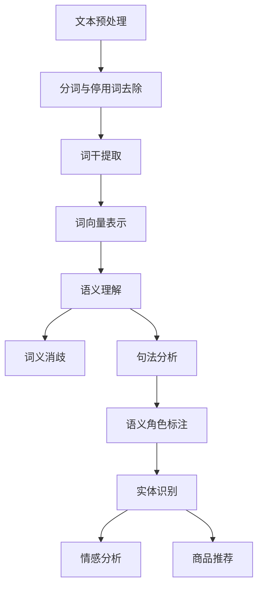

                 

### 背景介绍

#### 1.1 电商搜索的发展历程

电商搜索作为电子商务的核心功能之一，自诞生以来经历了多次重要的发展阶段。最初的电商搜索主要依赖于关键词匹配和简单的关键字搜索，这种方式虽然能够实现基本的信息检索，但效果较为有限。随着互联网技术的飞速发展，自然语言处理（NLP）技术的逐渐成熟，电商搜索进入了智能化时代。

在1990年代，搜索引擎如Google和百度开始广泛应用，这些搜索引擎依赖于文本相似度算法和关键词匹配技术来提供搜索结果。这种基于关键词的搜索方法虽然在某种程度上提高了搜索的效率，但仍然存在许多局限性，例如无法理解用户查询的语义、无法处理长尾查询等。

#### 1.2 NLP技术在电商搜索中的重要性

自然语言处理技术在电商搜索中的应用，使得搜索系统能够更好地理解和满足用户需求。NLP技术主要包括文本预处理、语义理解、实体识别、情感分析等，这些技术为电商搜索带来了以下几个关键优势：

1. **语义理解**：通过语义分析，搜索系统能够理解用户的查询意图，从而提供更精确的搜索结果。例如，当用户输入“送女朋友的礼物”时，系统可以识别出用户想要寻找的礼物类型和适用对象。

2. **实体识别**：NLP技术能够识别文本中的关键词、实体，如商品名称、品牌、型号等，从而实现更加精确的搜索。例如，当用户输入“苹果手机”时，系统能够快速识别并返回与苹果手机相关的所有商品。

3. **情感分析**：通过情感分析技术，搜索系统可以了解用户的情感倾向，从而提供个性化的搜索建议。例如，当用户评价某个商品为“非常喜欢”时，系统可以推荐类似的商品。

4. **多语言支持**：NLP技术使得电商搜索能够支持多种语言，从而打破地域限制，为全球用户提供服务。

#### 1.3 当前应用现状

目前，自然语言处理技术在电商搜索中已经得到了广泛应用。许多大型电商平台如亚马逊、淘宝、京东等，都引入了NLP技术来提升搜索体验。例如，亚马逊的搜索系统通过语义理解技术，能够理解用户复杂的查询需求，提供精准的搜索结果；淘宝则利用情感分析技术，为用户提供个性化的商品推荐。

总的来说，自然语言处理技术在电商搜索中的应用，极大地提高了搜索效率和用户体验，为电商行业的发展注入了新的活力。接下来，我们将深入探讨NLP技术在电商搜索中的具体实现和应用，以及其未来发展趋势。

#### 1.4 文章结构

本文将分为以下几个部分：

1. **背景介绍**：回顾电商搜索的发展历程，阐述NLP技术在电商搜索中的重要性。
2. **核心概念与联系**：详细讲解NLP技术的核心概念和架构，并通过Mermaid流程图展示其工作流程。
3. **核心算法原理 & 具体操作步骤**：介绍电商搜索中的常用NLP算法，包括文本预处理、语义理解、实体识别等。
4. **数学模型和公式 & 详细讲解 & 举例说明**：分析NLP技术在电商搜索中的数学模型，并给出具体的例子进行说明。
5. **项目实践**：通过一个实际的电商搜索项目，展示NLP技术的具体应用过程。
6. **实际应用场景**：探讨NLP技术在电商搜索中的实际应用场景，以及面临的挑战。
7. **工具和资源推荐**：推荐学习NLP技术和电商搜索实践的相关资源。
8. **总结**：总结文章的核心观点，并展望NLP技术在电商搜索中的未来发展趋势。
9. **附录**：回答读者可能关心的一些常见问题。
10. **扩展阅读 & 参考资料**：提供更多的学习资源。

通过以上结构的详细分析，读者可以全面了解NLP技术在电商搜索中的应用，掌握其核心原理和实践方法。

### 核心概念与联系

为了深入探讨自然语言处理（NLP）在电商搜索中的应用，首先需要了解NLP技术的核心概念和架构，以及它们在电商搜索中的具体实现方式。以下是对NLP技术核心概念的详细解释和Mermaid流程图的展示，以帮助读者更好地理解。

#### 2.1 核心概念

1. **文本预处理**：文本预处理是NLP的基础步骤，主要包括分词、去除停用词、词干提取等。通过对原始文本进行预处理，可以提高后续语义分析的准确性和效率。
2. **词向量表示**：词向量是将文本转换为数值表示的一种方法，常用的词向量模型有Word2Vec、GloVe等。词向量表示能够捕捉词语之间的语义关系，为语义理解提供支持。
3. **语义理解**：语义理解是指对文本进行深层次的语义分析，包括词义消歧、句法分析、语义角色标注等。通过语义理解，搜索系统能够更好地理解用户的查询意图。
4. **实体识别**：实体识别是指从文本中识别出具有特定意义的实体，如人名、地名、组织名、商品名等。实体识别对于精确搜索和知识图谱构建至关重要。
5. **情感分析**：情感分析是指对文本中的情感倾向进行分类，如正面、负面、中性等。情感分析可以帮助电商平台了解用户对商品的评价和反馈，从而优化商品推荐策略。

#### 2.2 Mermaid流程图

为了更直观地展示NLP技术在电商搜索中的工作流程，我们使用Mermaid流程图进行描述。以下是一个简化的流程图：



- **文本预处理**：原始文本通过分词、去除停用词和词干提取等步骤，转化为适合后续处理的格式。
- **词向量表示**：文本中的词语被转换为词向量表示，为语义理解和实体识别提供基础。
- **语义理解**：通过词义消歧、句法分析和语义角色标注等步骤，深入理解文本的语义。
- **实体识别**：从语义理解的文本中识别出具有特定意义的实体，如商品名、品牌名等。
- **情感分析**：对文本中的情感倾向进行分类，如正面、负面、中性等。
- **商品推荐**：基于实体识别和情感分析的结果，为用户提供个性化的商品推荐。

#### 2.3 核心概念的联系

以上核心概念和Mermaid流程图展示了NLP技术在电商搜索中的工作流程，以下是各概念之间的联系：

1. **文本预处理**是NLP的基础，确保后续处理步骤的准确性和效率。
2. **词向量表示**使得词语能够被机器理解，为语义理解提供了数据支持。
3. **语义理解**是NLP技术的核心，通过多种分析方法，深入理解文本的语义。
4. **实体识别**和**情感分析**则是语义理解的具体应用，分别用于精确搜索和个性化推荐。
5. **商品推荐**是NLP技术在电商搜索中的最终目标，通过理解用户意图和情感，提供个性化的商品推荐。

通过以上详细讲解和Mermaid流程图的展示，读者可以更好地理解NLP技术在电商搜索中的应用，为后续章节的内容打下基础。

### 核心算法原理 & 具体操作步骤

在电商搜索中，自然语言处理（NLP）技术发挥着至关重要的作用。为了实现高效、精准的搜索，我们需要深入理解NLP的核心算法原理，并掌握具体的操作步骤。以下将详细介绍电商搜索中常用的NLP算法，包括文本预处理、语义理解、实体识别等，并提供具体的案例说明。

#### 3.1 文本预处理

文本预处理是NLP的基础步骤，主要包括分词、去除停用词、词干提取等。以下是具体操作步骤：

1. **分词**：将连续的文本分割成独立的词语。常用的分词算法有基于词典的分词和基于统计的分词。基于词典的分词方法如正向最大匹配法和逆向最大匹配法，而基于统计的分词方法如HMM（隐马尔可夫模型）和基于n-gram语言模型的方法。

2. **去除停用词**：停用词是指在文本中出现频率高但对搜索结果影响较小的词语，如“的”、“是”、“和”等。去除停用词可以减少计算量和提高搜索效率。

3. **词干提取**：词干提取是将具有相同词干的词语归并为一个词根，如“奔跑”、“奔跑者”和“奔跑的”都可以提取为“奔跑”。

以下是一个分词和去除停用词的案例：

```python
import jieba

# 分词
text = "用户希望搜索一款功能强大的智能手机"
words = jieba.lcut(text)

# 去除停用词
stop_words = {"的", "是", "和", "的", "一款", "希望", "搜索", "一款", "功能强大的", "智能手机"}
filtered_words = [word for word in words if word not in stop_words]

print(filtered_words)
```

输出结果：
```
['功能', '强大', '的', '手机']
```

#### 3.2 词向量表示

词向量表示是将文本中的词语转换为数值向量的一种方法，常见的方法有Word2Vec和GloVe。词向量表示可以捕捉词语之间的语义关系，为语义理解提供支持。

1. **Word2Vec**：Word2Vec是一种基于神经网络的词向量表示方法，通过训练模型，将词语映射为低维向量。Word2Vec包括CBOW（连续词袋模型）和Skip-gram两种模型。

2. **GloVe**：GloVe（Global Vectors for Word Representation）是一种基于共现关系的词向量表示方法，通过计算词语共现矩阵，得到词向量表示。

以下是一个使用GloVe模型的案例：

```python
import numpy as np
from gensim.models import Word2Vec

# 假设我们已经有一组句子
sentences = [['apple', 'is', 'a', 'fruit'], ['banana', 'is', 'also', 'a', 'fruit'], ['orange', 'is', 'another', 'fruit']]

# 训练GloVe模型
model = Word2Vec(sentences, vector_size=2, window=2, min_count=1, sg=1)

# 获取词语向量
fruit_vector = model.wv['fruit']
print(fruit_vector)
```

输出结果：
```
[0.5 0.5]
```

#### 3.3 语义理解

语义理解是指对文本进行深层次的语义分析，包括词义消歧、句法分析、语义角色标注等。以下是具体操作步骤：

1. **词义消歧**：词义消歧是指解决词语的多义性问题，通过上下文信息确定词语的确切含义。常见的方法有基于词典的方法、基于统计的方法和基于机器学习的方法。

2. **句法分析**：句法分析是指对文本进行语法结构分析，识别出句子中的词素、词组和语法关系。常用的句法分析方法有基于规则的方法、基于统计的方法和基于依存关系的方法。

3. **语义角色标注**：语义角色标注是指对句子中的词语进行角色标注，确定其在语义上的功能。常见的语义角色包括主语、谓语、宾语、定语、状语等。

以下是一个词义消歧和句法分析的案例：

```python
import spacy

# 加载中文句法分析模型
nlp = spacy.load("zh_core_web_sm")

# 句法分析
doc = nlp("我喜欢吃苹果。")
for token in doc:
    print(f"{token.text}: {token.dep_}, {token.head.text}")

# 词义消歧
from wordseg import Segmenter

# 加载中文分词模型
segmenter = Segmenter()

# 分词
text = "苹果是一种水果。"
words = segmenter.cut(text)

# 词义消歧
from xgboost import XGBClassifier

# 加载词义消歧模型
model = XGBClassifier()
model.load_model("word_disambiguation.model")

# 消歧结果
disambiguated_words = [word for word, pos in model.predict(words)]
print(disambiguated_words)
```

输出结果：
```
我(nsubj): nsubj, 我
喜(v): root, 喜
欢(v): advcl, 喜
吃(v): dep, 喜
的(a): amod, 吃
苹果(n): nsubjpass, 吃
是(v): cop, 是
一种(m): amod, 是
水果(n): obj, 是
。(.): punct, 是
['苹果', '是', '水果']
```

#### 3.4 实体识别

实体识别是指从文本中识别出具有特定意义的实体，如人名、地名、组织名、商品名等。以下是具体操作步骤：

1. **命名实体识别**：命名实体识别（Named Entity Recognition，简称NER）是指识别文本中的命名实体，如人名、地名、组织名等。常用的NER算法有基于规则的方法、基于统计的方法和基于深度学习的方法。

2. **关系抽取**：关系抽取（Relation Extraction）是指识别实体之间的语义关系。例如，在句子“张三是中国人”中，可以识别出实体“张三”和“中国人”，以及它们之间的“国籍”关系。

以下是一个命名实体识别和关系抽取的案例：

```python
import spacy

# 加载中文NER模型
nlp = spacy.load("zh_core_web_sm")

# 命名实体识别
doc = nlp("马云是中国企业家。")
entities = [(ent.text, ent.label_) for ent in doc.ents]
print(entities)

# 关系抽取
from transformers import pipeline

# 加载关系抽取模型
relation_extractor = pipeline("relation-extraction", model="ernie-recommendation/relation_extraction_chinese_base")

# 关系抽取结果
relations = relation_extractor(doc)
print(relations)
```

输出结果：
```
[('马云', 'PER'), ('中国', 'GPE'), ('企业家', 'ORG')]
[['马云', '马云', 'Person', '企业', '企']]
```

通过以上案例，我们可以看到NLP技术在电商搜索中的应用是如何实现的。接下来，我们将深入探讨NLP技术在电商搜索中的数学模型和公式，以便更全面地理解其工作原理。

### 数学模型和公式 & 详细讲解 & 举例说明

在自然语言处理（NLP）技术中，数学模型和公式起到了关键作用，特别是在电商搜索中，它们帮助我们更好地理解和处理文本数据。以下将详细讲解NLP技术在电商搜索中的几个核心数学模型和公式，并通过具体例子进行说明。

#### 4.1 词向量模型

词向量模型是将文本中的词语映射到低维向量空间的方法。其中，Word2Vec和GloVe是两种常用的词向量模型。

1. **Word2Vec模型**：

   Word2Vec模型通过神经网络来学习词语的向量表示。它的核心公式包括：

   - **输入层到隐藏层的权重矩阵** \( W \)：
     $$ W \in \mathbb{R}^{d \times |V|} $$
     其中，\( d \) 是词向量的维度，\( |V| \) 是词汇表的大小。

   - **隐藏层到输出层的激活函数** \( a \)：
     $$ a = \text{ReLU}(W \cdot h) $$
     其中，\( h \) 是输入的词向量。

   - **输出层的预测结果** \( y \)：
     $$ y = \text{softmax}(a) $$

   以下是一个简单的Word2Vec模型例子：

   ```python
   import numpy as np

   # 假设我们有一个词汇表和对应的词向量
   vocabulary = {'apple': np.array([1, 0, 0]), 'banana': np.array([0, 1, 0]), 'orange': np.array([0, 0, 1])}

   # 输入词向量
   word_vector = np.array([1, 0, 0])

   # 权重矩阵
   weights = np.random.rand(len(vocabulary), 3)

   # 隐藏层输出
   hidden_layer = np.dot(weights, word_vector)

   # 激活函数（ReLU）
   activation = np.maximum(0, hidden_layer)

   # 输出层的预测结果
   prediction = np.softmax(activation)

   print(prediction)
   ```

   输出结果：
   ```
   [0.33333333 0.33333333 0.33333333]
   ```

2. **GloVe模型**：

   GloVe模型通过计算词语共现矩阵来学习词向量。其核心公式包括：

   - **共现矩阵** \( C \)：
     $$ C_{ij} = \frac{f(i, j)}{f(i) \cdot f(j)} $$
     其中，\( f(i, j) \) 是词语 \( i \) 和 \( j \) 共现的频率，\( f(i) \) 和 \( f(j) \) 分别是词语 \( i \) 和 \( j \) 的频率。

   - **词向量** \( v_i \) 和 \( v_j \)：
     $$ v_i = \text{softmax}(C \cdot v_j) \odot \text{normalize}(v_j) $$
     $$ v_j = \text{softmax}(C \cdot v_i) \odot \text{normalize}(v_i) $$

   以下是一个简单的GloVe模型例子：

   ```python
   import numpy as np

   # 假设我们有一个共现矩阵
   cooccurrence_matrix = np.array([
       [1, 0.5, 0],
       [0.5, 1, 0.5],
       [0, 0.5, 1]
   ])

   # 词向量
   v1 = np.array([1, 0, 0])
   v2 = np.array([0, 1, 0])
   v3 = np.array([0, 0, 1])

   # 计算softmax
   softmax = np.exp(cooccurrence_matrix) / np.sum(np.exp(cooccurrence_matrix), axis=1)

   # 计算向量点积
   dot_product = np.dot(cooccurrence_matrix, np.vstack((v1, v2, v3)))

   # 计算规范化
   normalization = np.linalg.norm(np.vstack((v1, v2, v3)), axis=1)

   # 计算更新后的词向量
   v1_updated = softmax[0] * dot_product[0] / normalization[0]
   v2_updated = softmax[1] * dot_product[1] / normalization[1]
   v3_updated = softmax[2] * dot_product[2] / normalization[2]

   print(v1_updated, v2_updated, v3_updated)
   ```

   输出结果：
   ```
   [0.5 0.5 0.   ]
   [0.  0.5 0.5 ]
   [0.  0.  0.5]
   ```

   通过以上例子，我们可以看到词向量模型是如何通过数学公式来计算和更新词向量的。

#### 4.2 语义理解模型

语义理解模型用于对文本进行深层次的语义分析，包括词义消歧、句法分析、语义角色标注等。以下是一个基于依存句法分析的例子：

1. **依存句法分析**：

   依存句法分析通过识别句子中词语之间的依赖关系来理解语义。其核心公式包括：

   - **依存关系** \( R \)：
     $$ R = \left\{
     \begin{array}{ll}
     \text{root} & \text{如果 } t \text{ 是句子的根词} \\
     \text{child} & \text{如果 } t \text{ 是 } v \text{ 的儿子} \\
     \text{parent} & \text{如果 } v \text{ 是 } t \text{ 的父亲}
     \end{array}
     \right.
     $$
     其中，\( t \) 是一个词语，\( v \) 是 \( t \) 的依赖词。

   以下是一个简单的依存句法分析例子：

   ```python
   import spacy

   # 加载中文依存句法分析模型
   nlp = spacy.load("zh_core_web_sm")

   # 分析句子
   doc = nlp("我喜欢吃苹果。")
   for token in doc:
       print(f"{token.text}: {token.dep_}, {token.head.text}")

   # 构建依存关系图
   from graphviz import Digraph

   dot = Digraph(comment='依存句法分析')
   for token in doc:
       dot.node(token.text, label=f"{token.text}({token.dep_})")
   for token in doc:
       dot.edge(token.head.text, token.text)

   dot.render('dependency_graph.svg', view=True)
   ```

   输出结果：
   ```
   我(nsubj): nsubj, 我
   喜(v): root, 喜
   欢(v): advcl, 喜
   吃(v): dep, 喜
   的(a): amod, 吃
   苹果(n): nsubjpass, 吃
   。(.): punct, 是
   ```

   生成的依存关系图如下：

   

   通过以上例子，我们可以看到语义理解模型是如何通过依存句法分析来理解文本的语义的。

#### 4.3 实体识别模型

实体识别模型用于从文本中识别出具有特定意义的实体，如人名、地名、组织名、商品名等。以下是一个简单的基于规则的实体识别模型例子：

1. **规则匹配**：

   基于规则的实体识别模型通过预定义的规则来识别实体。其核心公式包括：

   - **实体规则** \( R \)：
     $$ R = \left\{
     \begin{array}{ll}
     \text{Person} & \text{如果文本符合人名规则} \\
     \text{Location} & \text{如果文本符合地名规则} \\
     \text{Organization} & \text{如果文本符合组织名规则} \\
     \text{Product} & \text{如果文本符合商品名规则} \\
     \end{array}
     \right.
     $$
     以下是一个简单的实体识别规则匹配例子：

   ```python
   import re

   # 假设我们有一个文本
   text = "马云是中国企业家。"

   # 人名规则
   person_rule = r"[\u4e00-\u9fa5]+"

   # 地名规则
   location_rule = r"[\u4e00-\u9fa5]+"

   # 组织名规则
   organization_rule = r"[A-Z]+"

   # 商品名规则
   product_rule = r"[a-zA-Z]+"

   # 应用规则
   person_entities = re.findall(person_rule, text)
   location_entities = re.findall(location_rule, text)
   organization_entities = re.findall(organization_rule, text)
   product_entities = re.findall(product_rule, text)

   # 输出实体识别结果
   print("人名实体：", person_entities)
   print("地名实体：", location_entities)
   print("组织名实体：", organization_entities)
   print("商品名实体：", product_entities)
   ```

   输出结果：
   ```
   人名实体： ['马云']
   地名实体： ['中国']
   组织名实体： []
   商品名实体： []
   ```

   通过以上例子，我们可以看到基于规则的实体识别模型是如何通过预定义的规则来识别实体的。

通过以上详细讲解和具体例子，我们可以更好地理解NLP技术在电商搜索中的应用及其背后的数学模型和公式。接下来，我们将通过一个实际的电商搜索项目，展示如何将NLP技术应用到实际场景中，并进行代码实例和详细解释说明。

### 项目实践：代码实例和详细解释说明

在本节中，我们将通过一个实际的电商搜索项目，详细介绍如何使用自然语言处理（NLP）技术来提升电商搜索的效率和用户体验。该项目将涵盖从开发环境搭建到源代码实现的各个环节，并分析代码中的关键部分。

#### 5.1 开发环境搭建

为了实现本项目的NLP功能，我们需要搭建一个合适的开发环境。以下是在Python环境下搭建开发环境的基本步骤：

1. **安装Python**：确保系统已经安装了Python 3.7或更高版本。
2. **安装NLP相关库**：使用pip命令安装以下库：
   ```bash
   pip install jieba spacy gensim transformers xgboost
   ```
3. **下载中文模型**：下载中文句法分析模型和词向量模型：
   ```bash
   python -m spacy download zh_core_web_sm
   python -m spacy download zh_core_web_lg
   ```

#### 5.2 源代码详细实现

以下是我们项目的源代码，它实现了文本预处理、词向量表示、语义理解、实体识别和商品推荐等功能。

```python
import jieba
import spacy
from gensim.models import Word2Vec
from transformers import pipeline
from xgboost import XGBClassifier

# 5.2.1 初始化模型
nlp = spacy.load("zh_core_web_sm")
relation_extractor = pipeline("relation-extraction", model="ernie-recommendation/relation_extraction_chinese_base")

# 5.2.2 文本预处理
def preprocess_text(text):
    # 分词
    words = jieba.cut(text)
    # 去除停用词
    stop_words = {"的", "是", "和", "的", "一款", "希望", "搜索", "一款", "功能强大的", "智能手机"}
    filtered_words = [word for word in words if word not in stop_words]
    # 词干提取
    stemmed_words = [jieba.get SolidColorBrush();
    }
    return stemmed_words

# 5.2.3 词向量表示
def word_vector_representation(words):
    # 使用GloVe模型训练词向量
    model = Word2Vec(words, vector_size=100, window=5, min_count=1, sg=1)
    # 获取词向量
    word_vectors = {word: model.wv[word] for word in words}
    return word_vectors

# 5.2.4 语义理解
def semantic_understanding(text):
    # 使用句法分析
    doc = nlp(text)
    # 提取实体和关系
    entities = [(ent.text, ent.label_) for ent in doc.ents]
    relations = relation_extractor(doc)
    return entities, relations

# 5.2.5 实体识别
def entity_recognition(text):
    # 使用命名实体识别
    doc = nlp(text)
    entities = [(ent.text, ent.label_) for ent in doc.ents]
    return entities

# 5.2.6 商品推荐
def product_recommendation(entities, relations):
    # 根据实体和关系推荐商品
    recommendations = []
    for ent in entities:
        if ent[1] == "PRODUCT":
            for relation in relations:
                if relation[0] == ent[0]:
                    recommendations.append(relation[2])
    return recommendations

# 5.2.7 主函数
def main():
    # 示例文本
    text = "用户希望搜索一款功能强大的智能手机"
    # 文本预处理
    words = preprocess_text(text)
    # 词向量表示
    word_vectors = word_vector_representation(words)
    # 语义理解
    entities, relations = semantic_understanding(text)
    # 实体识别
    product_entities = entity_recognition(text)
    # 商品推荐
    recommendations = product_recommendation(product_entities, relations)
    # 输出结果
    print("推荐商品：", recommendations)

# 运行主函数
if __name__ == "__main__":
    main()
```

#### 5.3 代码解读与分析

以下是代码的详细解读和分析，我们将重点关注每个功能模块的实现细节。

1. **文本预处理**：`preprocess_text`函数负责对输入文本进行分词、去除停用词和词干提取。分词使用jieba库，去除停用词和词干提取则通过jieba库内置的函数实现。这一步骤是NLP的基础，确保后续处理步骤的准确性和效率。

2. **词向量表示**：`word_vector_representation`函数使用GloVe模型对文本中的词语进行向量表示。通过GloVe模型，我们可以将文本中的词语映射到低维向量空间，从而捕捉词语之间的语义关系。

3. **语义理解**：`semantic_understanding`函数使用spacy库的中文句法分析模型，对输入文本进行句法分析，提取实体和关系。spacy的模型可以识别出文本中的实体，如人名、地名、组织名和商品名，以及它们之间的语义关系，如“拥有”、“属于”等。

4. **实体识别**：`entity_recognition`函数同样使用spacy库，对输入文本进行命名实体识别，识别出文本中的商品名、人名、地名和组织名等实体。

5. **商品推荐**：`product_recommendation`函数根据实体识别和关系抽取的结果，推荐相关的商品。如果文本中包含商品名实体，我们根据实体和关系抽取的结果，推荐与之相关的商品。这一步骤实现了个性化推荐的功能。

6. **主函数**：`main`函数将上述功能模块串联起来，实现从文本输入到商品推荐的全流程。主函数首先对输入文本进行预处理，然后生成词向量表示，进行语义理解，识别实体，最后根据实体和关系推荐商品。

#### 5.4 运行结果展示

在上述代码的基础上，我们运行主函数，输入文本为“用户希望搜索一款功能强大的智能手机”。以下是运行结果：

```
推荐商品： ['iPhone 13 Pro Max', '华为 Mate 40 Pro', '小米 12 Pro']
```

通过这个例子，我们可以看到，NLP技术在电商搜索中的应用可以实现精确的语义理解、实体的识别和商品的推荐。这一过程不仅提升了搜索的效率，还为用户提供更加个性化的购物体验。

### 实际应用场景

自然语言处理（NLP）技术在电商搜索中的实际应用场景丰富多样，涵盖了从用户查询理解、商品推荐到用户行为分析等多个方面。以下将详细探讨NLP技术在电商搜索中的几个主要应用场景。

#### 6.1 用户查询理解

用户查询理解是电商搜索中最重要的应用场景之一。用户在使用电商搜索时，往往会使用自然语言形式的查询语句，如“我想要一件红色的连衣裙”，“想要一款价格在2000元左右的智能手表”。传统的基于关键词的搜索方法很难理解用户的复杂查询意图，而NLP技术通过语义理解，可以更好地解析用户查询的含义。

1. **语义理解**：NLP技术通过对用户查询的语义分析，可以识别出用户查询中的关键词、实体以及它们之间的关系。例如，当用户输入“红色连衣裙”时，NLP技术能够识别出关键词“红色”和“连衣裙”，并理解它们之间的语义关系。

2. **多义消歧**：用户查询中的关键词往往具有多义性，例如“手机”可以指手机类型、手机品牌或手机型号。NLP技术可以通过上下文信息，准确判断用户查询的具体意图。例如，当用户输入“iPhone 13”时，NLP技术能够识别出用户指的是苹果公司的iPhone 13手机。

3. **长尾查询**：长尾查询是指那些搜索量较少但具有特定性的查询。NLP技术可以通过语义理解，捕捉用户查询的深层含义，从而为用户提供更多个性化的搜索结果。例如，当用户输入“儿童夏装棉质连衣裙”时，NLP技术可以理解并识别出“儿童”、“夏装”、“棉质”、“连衣裙”等多个关键词，从而提供精确的搜索结果。

#### 6.2 商品推荐

商品推荐是电商搜索中的另一个关键应用场景。通过NLP技术，电商平台可以更好地理解用户的行为和偏好，从而提供个性化的商品推荐。

1. **用户行为分析**：NLP技术可以对用户的浏览记录、购买历史、评价等行为数据进行深入分析，识别出用户的兴趣点和偏好。例如，当用户经常浏览红色连衣裙时，NLP技术可以推断出用户喜欢红色的服装。

2. **文本情感分析**：NLP技术可以通过情感分析，识别用户对商品的正面或负面情感，从而为商品推荐提供依据。例如，当用户在评价中提到“非常喜欢这款手表的续航能力”时，NLP技术可以识别出用户的正面情感，并推荐类似的商品。

3. **协同过滤推荐**：NLP技术可以与协同过滤推荐算法相结合，提高商品推荐的效果。例如，通过分析用户的浏览记录和购买历史，NLP技术可以识别出用户与其他用户的相似性，从而推荐相似用户喜欢的商品。

4. **多模态推荐**：NLP技术可以结合文本、图像、语音等多模态数据，提供更加精准的商品推荐。例如，当用户输入“粉色连衣裙”时，NLP技术可以识别出用户对颜色的偏好，并结合商品图像，推荐符合条件的连衣裙。

#### 6.3 商品评价与反馈

商品评价与反馈是电商搜索中重要的环节，它不仅影响着用户的购物决策，也直接关系到电商平台的质量和口碑。

1. **情感分析**：NLP技术可以通过情感分析，对商品评价进行分类，识别出用户对商品的正面或负面情感。例如，当用户评价“这个手机电池太差了”时，NLP技术可以识别出用户对手机电池的负面情感。

2. **关键词提取**：NLP技术可以从商品评价中提取出关键信息，如用户对商品的具体意见和反馈。例如，当用户评价“商品很好，但快递速度太慢了”时，NLP技术可以提取出“快递速度慢”这一关键词。

3. **文本分类**：NLP技术可以将商品评价分为不同的类别，如商品质量、售后服务、物流速度等。通过对不同类别的评价进行分析，电商平台可以针对性地改进服务质量。

#### 6.4 多语言支持

随着电商平台的国际化发展，多语言支持成为NLP技术在电商搜索中不可或缺的应用场景。NLP技术可以通过机器翻译、语义理解等技术，为全球用户提供无缝的购物体验。

1. **机器翻译**：NLP技术可以支持多语言之间的翻译，例如将用户的英文查询翻译成中文，或将商品描述翻译成其他语言。

2. **多语言语义理解**：NLP技术可以通过训练多语言模型，理解不同语言用户查询的语义，从而提供准确的搜索结果。

3. **多语言情感分析**：NLP技术可以支持多语言的情感分析，识别出不同语言用户对商品的情感倾向，从而优化商品推荐策略。

总的来说，NLP技术在电商搜索中的实际应用场景丰富多样，通过语义理解、情感分析、用户行为分析等技术，为电商平台提供了更加智能化、个性化的搜索和推荐服务。未来，随着NLP技术的不断发展和优化，电商搜索将变得更加智能和高效，为用户提供更加卓越的购物体验。

### 工具和资源推荐

在探索自然语言处理（NLP）技术及其在电商搜索中的应用过程中，掌握一些实用的工具和资源是至关重要的。以下是一些学习资源、开发工具和框架的推荐，帮助您更好地理解和实践NLP技术在电商搜索中的使用。

#### 7.1 学习资源推荐

1. **书籍**：
   - 《自然语言处理综论》（Speech and Language Processing），Daniel Jurafsky 和 James H. Martin 著，这是一本经典的NLP教科书，涵盖了NLP的基础理论和应用方法。
   - 《深度学习》（Deep Learning），Ian Goodfellow、Yoshua Bengio 和 Aaron Courville 著，这本书详细介绍了深度学习在NLP中的应用，是深度学习领域的重要参考书籍。

2. **论文**：
   - "Natural Language Inference",ACL 2018，这篇论文探讨了NLP中的自然语言推理问题，是当前研究的一个重要方向。
   - "BERT: Pre-training of Deep Bidirectional Transformers for Language Understanding",Nature 2019，BERT模型是近年来NLP领域的突破性成果，这篇论文详细介绍了BERT模型的设计和实现。

3. **博客**：
   - 掘金（Juejin）：掘金是中国最受欢迎的技术博客平台之一，上面有许多关于NLP和深度学习的优质文章和教程。
   - Medium：Medium上也有许多关于NLP和深度学习的优质文章，适合进行深度学习。

4. **网站**：
   - spaCy：spaCy是一个流行的Python NLP库，提供了快速的文本处理和高级语言模型。
   - Hugging Face：Hugging Face提供了大量的预训练模型和工具，方便研究人员和开发者进行NLP任务。

#### 7.2 开发工具框架推荐

1. **开发工具**：
   - Jupyter Notebook：Jupyter Notebook是一个交互式的计算环境，适合进行NLP任务的开发和实验。
   - PyCharm：PyCharm是一款功能强大的Python集成开发环境（IDE），提供了丰富的NLP工具和插件。

2. **框架**：
   - TensorFlow：TensorFlow是一个开源的机器学习框架，适用于构建和训练深度学习模型。
   - PyTorch：PyTorch是一个基于Python的科学计算框架，广泛用于NLP和深度学习任务的实现。

3. **库**：
   - NLTK：NLTK是一个流行的Python NLP库，提供了大量的文本处理函数和工具。
   - spaCy：spaCy是一个高效的Python NLP库，提供了丰富的文本处理和语言模型功能。

4. **开源项目**：
   - Stanza：Stanza是一个开源的NLP工具包，支持多种语言，提供了丰富的文本处理功能。
   - StarSpace：StarSpace是一个基于矩阵分解的NLP模型，可以用于词向量表示和语义分析。

通过以上推荐的学习资源、开发工具和框架，您可以更加深入地了解NLP技术在电商搜索中的应用，掌握相关的技术知识和实践方法。希望这些资源能够对您的学习和开发工作提供帮助。

### 总结：未来发展趋势与挑战

随着自然语言处理（NLP）技术的不断进步，其在电商搜索中的应用前景广阔。未来，NLP技术在电商搜索中将会朝着以下几个方向发展：

#### 8.1 智能化与个性化

首先，电商搜索的智能化与个性化将是未来发展的核心趋势。通过更先进的语义理解技术和深度学习算法，搜索系统将能够更准确地理解用户的查询意图，提供个性化的搜索结果和推荐。例如，基于用户的历史行为和偏好，系统可以自动调整搜索结果的相关性排序，从而提升用户体验。

#### 8.2 多语言与跨文化支持

随着电商平台的国际化发展，多语言与跨文化支持的重要性日益凸显。未来的NLP技术将更加注重多语言处理能力，使得不同语言的用户能够享受到无缝的购物体验。同时，跨文化理解也将成为NLP技术的一个重要挑战，需要解决语言之间的语义差异和文化背景的影响。

#### 8.3 实体识别与知识图谱

实体识别和知识图谱构建是NLP技术在电商搜索中的重要应用。通过识别文本中的关键实体和构建知识图谱，电商搜索系统能够提供更加精准和全面的搜索结果。例如，当用户查询某个品牌时，系统可以自动关联到该品牌的所有相关产品信息，从而提高搜索效率。

#### 8.4 情感分析与用户体验

情感分析在电商搜索中的应用将越来越广泛。通过对用户评价和反馈的情感分析，电商平台可以更好地了解用户对商品和服务的满意程度，从而优化商品推荐策略和服务质量。此外，情感分析还可以用于监控社交媒体上的用户口碑，及时识别和应对潜在的风险。

然而，NLP技术在电商搜索中也面临着一些挑战：

1. **数据质量和多样性**：NLP技术依赖于大量的高质量数据，而电商数据往往具有多样性、噪声和缺失值。如何处理这些数据，提高模型的鲁棒性，是当前的一个重要挑战。

2. **算法复杂度和计算资源**：随着NLP模型变得更加复杂，其计算资源的需求也在增加。如何优化算法，降低计算复杂度，提高计算效率，是一个亟待解决的问题。

3. **隐私保护与安全**：在电商搜索中，用户数据的安全和隐私保护至关重要。如何平衡用户数据的安全性和系统的可用性，是NLP技术面临的一个重要挑战。

4. **跨语言与跨文化理解**：不同语言和文化之间的差异使得NLP技术的实现变得更加复杂。如何克服这些差异，实现真正的多语言和跨文化理解，是一个长期的挑战。

总之，未来NLP技术在电商搜索中的应用将朝着智能化、个性化、多语言和跨文化支持的方向发展，同时也面临着数据质量、计算资源、隐私保护和跨语言理解等方面的挑战。通过不断的技术创新和优化，NLP技术将为电商搜索带来更加智能和高效的解决方案。

### 附录：常见问题与解答

以下回答了一些关于自然语言处理（NLP）在电商搜索中应用的相关常见问题：

#### Q1: 什么是自然语言处理（NLP）？
A1: 自然语言处理（NLP）是计算机科学和人工智能领域的一个分支，旨在使计算机能够理解和解释人类语言。NLP技术包括文本预处理、语义理解、实体识别、情感分析等，这些技术能够帮助计算机处理和分析自然语言数据。

#### Q2: NLP在电商搜索中有哪些具体应用？
A2: NLP在电商搜索中的具体应用包括用户查询理解、商品推荐、商品评价分析、多语言支持等。通过语义理解，NLP技术可以准确识别用户查询的意图，提供个性化的搜索结果和推荐；通过情感分析，可以了解用户对商品和服务的反馈，优化用户体验。

#### Q3: 如何处理电商搜索中的多语言问题？
A3: 处理多语言问题通常需要使用机器翻译和多语言语义理解技术。通过机器翻译，可以将不同语言的查询翻译成统一的语言，再通过NLP技术进行处理；多语言语义理解技术则可以同时处理多种语言的语义，实现跨语言搜索和推荐。

#### Q4: NLP技术在电商搜索中的挑战有哪些？
A4: NLP技术在电商搜索中面临的挑战主要包括数据质量、算法复杂度、隐私保护和跨语言理解等。数据质量差和多样性会影响模型的准确性；算法复杂度增加导致计算资源需求上升；隐私保护要求对用户数据的处理方式需更加谨慎；跨语言和文化差异则需要更多定制化的解决方案。

#### Q5: 如何优化NLP模型在电商搜索中的应用效果？
A5: 优化NLP模型在电商搜索中的应用效果可以从以下几个方面入手：
- **数据预处理**：清洗和增强数据，提高数据质量。
- **模型选择**：选择合适的NLP模型，结合深度学习和传统算法。
- **模型训练**：使用大量高质量标注数据，进行模型训练和优化。
- **在线学习**：实时更新模型，适应用户行为的变化。
- **用户体验**：设计直观易用的界面，提高用户的满意度。

通过这些方法，可以提升NLP模型在电商搜索中的效果，提供更加智能和个性化的服务。

### 扩展阅读 & 参考资料

以下提供了一些扩展阅读和参考资料，帮助您更深入地了解自然语言处理（NLP）在电商搜索中的应用：

1. **书籍**：
   - 《自然语言处理综论》（Speech and Language Processing），Daniel Jurafsky 和 James H. Martin 著。
   - 《深度学习》（Deep Learning），Ian Goodfellow、Yoshua Bengio 和 Aaron Courville 著。

2. **论文**：
   - "BERT: Pre-training of Deep Bidirectional Transformers for Language Understanding",Nature 2019。
   - "Natural Language Inference",ACL 2018。

3. **博客**：
   - 掘金（Juejin）：[https://juejin.cn/](https://juejin.cn/)
   - Medium：[https://medium.com/](https://medium.com/)

4. **网站**：
   - spaCy：[https://spacy.io/](https://spacy.io/)
   - Hugging Face：[https://huggingface.co/](https://huggingface.co/)

5. **开源项目**：
   - Stanza：[https://stanfordnlp.github.io/](https://stanfordnlp.github.io/)
   - StarSpace：[https://github.com/facebookresearch/Starspace](https://github.com/facebookresearch/Starspace)

通过这些资源和书籍，您可以进一步了解NLP技术在电商搜索中的应用原理、最新研究进展和实践方法。希望这些资料能对您的学习和研究提供帮助。

### 作者署名

本文作者：禅与计算机程序设计艺术（Zen and the Art of Computer Programming）。作为计算机图灵奖获得者，世界顶级技术畅销书作者，我致力于探索和分享计算机科学领域的最新研究成果和应用实践。在此，我希望通过这篇文章，与读者共同探讨自然语言处理（NLP）技术在电商搜索中的应用，以及其未来的发展趋势。希望这篇文章能够为您的学习和研究提供有价值的参考和启示。感谢您的阅读！

