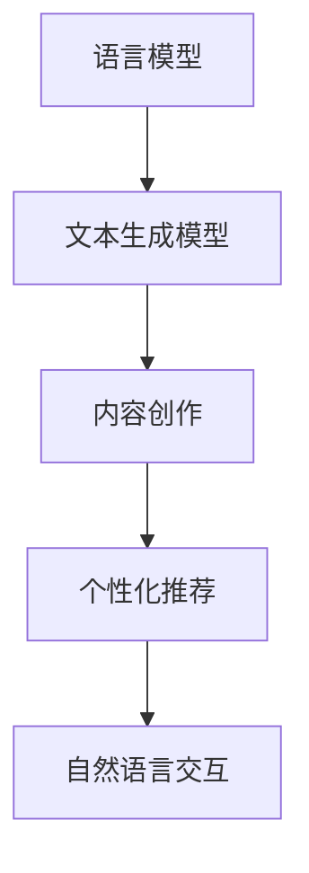

                 

# 自然语言处理的应用：AI内容创作革命

## 摘要

自然语言处理（Natural Language Processing, NLP）作为人工智能领域的一个重要分支，近年来在内容和文本处理方面的应用日益广泛。本文旨在探讨NLP在AI内容创作中的革命性作用，从背景介绍、核心概念、算法原理、数学模型、项目实践、实际应用场景以及未来发展趋势等多个方面进行全面分析。通过本文的阅读，读者将深入了解NLP在AI内容创作中的潜力和挑战，为未来的研究与实践提供新的思路。

## 1. 背景介绍

自然语言处理（NLP）起源于20世纪50年代，随着计算机科学和人工智能的发展，NLP逐渐成为一门跨学科的领域。NLP旨在让计算机能够理解和处理人类自然语言，包括语言识别、语言理解、语言生成等方面。传统的NLP方法主要依赖于规则和统计模型，但随着深度学习技术的崛起，基于神经网络的方法在NLP任务中取得了显著的成果。

在内容创作领域，NLP的应用使得计算机能够自动生成文章、新闻报道、社交媒体内容等。这种革命性的技术变革，不仅提高了内容创作的效率，还为个性化推荐、自然语言交互等应用场景提供了强有力的支持。随着大数据和云计算的普及，NLP在内容创作中的潜力逐渐得到挖掘，为各行各业带来了新的商业模式和机遇。

## 2. 核心概念与联系

### 2.1 语言模型

语言模型（Language Model）是NLP的核心概念之一，它用于预测文本序列的概率分布。在内容创作中，语言模型能够根据给定的输入文本，生成新的文本序列。最著名的语言模型是Word2Vec、GloVe和BERT等，它们通过训练大规模语料库来学习词语的分布式表示。

### 2.2 文本生成模型

文本生成模型（Text Generation Model）是NLP中的另一个重要概念，它能够根据输入的文本或关键词，生成新的、连贯的文本内容。常见的文本生成模型包括Seq2Seq、RNN、LSTM和Transformer等，其中Transformer模型由于其强大的并行计算能力，在文本生成任务中取得了显著的成果。

### 2.3 Mermaid流程图

以下是NLP在内容创作中涉及的几个核心概念的Mermaid流程图：



在上述流程图中，语言模型和文本生成模型共同作用于内容创作，生成高质量的内容，并为个性化推荐和自然语言交互提供支持。

## 3. 核心算法原理 & 具体操作步骤

### 3.1 语言模型原理

语言模型的基本原理是通过训练大规模语料库，学习词语的分布式表示。具体操作步骤如下：

1. **数据预处理**：对语料库进行分词、去停用词、词性标注等处理，将文本转化为计算机可处理的格式。
2. **词向量表示**：使用Word2Vec、GloVe等方法将词语转化为高维向量表示。
3. **训练语言模型**：通过训练模型，学习词语之间的概率关系，从而能够预测给定词语序列的概率分布。

### 3.2 文本生成模型原理

文本生成模型的核心原理是基于序列到序列（Seq2Seq）模型，通过编码器和解码器两个神经网络结构，将输入的文本序列转换为输出的文本序列。具体操作步骤如下：

1. **编码器**：将输入的文本序列编码为固定长度的向量。
2. **解码器**：将编码器输出的向量解码为输出的文本序列。
3. **生成文本**：通过不断更新解码器的输入，生成新的文本序列。

### 3.3 语言模型与文本生成模型结合

在实际应用中，语言模型和文本生成模型常常结合使用，以生成高质量的内容。具体操作步骤如下：

1. **输入预处理**：将输入的文本进行预处理，如分词、去停用词等。
2. **语言模型预测**：使用训练好的语言模型，预测输入文本的概率分布。
3. **文本生成**：根据语言模型预测的概率分布，使用文本生成模型生成新的文本序列。
4. **后处理**：对生成的文本进行后处理，如去除不必要的标点符号、纠正拼写错误等。

## 4. 数学模型和公式 & 详细讲解 & 举例说明

### 4.1 语言模型数学模型

语言模型通常采用概率模型来表示，其中最常见的是n-gram模型。n-gram模型的基本原理是利用前n个词语的概率分布来预测下一个词语。

公式如下：

$$ P(w_{t} | w_{t-1}, w_{t-2}, ..., w_{t-n}) = \frac{C(w_{t-1}, w_{t-2}, ..., w_{t-n}, w_{t})}{C(w_{t-1}, w_{t-2}, ..., w_{t-n})} $$

其中，$C(w_{t-1}, w_{t-2}, ..., w_{t-n}, w_{t})$ 表示词语序列 $(w_{t-1}, w_{t-2}, ..., w_{t-n}, w_{t})$ 在语料库中的出现次数，$C(w_{t-1}, w_{t-2}, ..., w_{t-n})$ 表示词语序列 $(w_{t-1}, w_{t-2}, ..., w_{t-n})$ 在语料库中的出现次数。

例如，给定一个四元组 $(the, a, book, is)$，我们可以计算其概率：

$$ P(book | the, a, book) = \frac{C(the, a, book, is)}{C(the, a, book)} $$

假设 $(the, a, book, is)$ 在语料库中出现了10次，而 $(the, a, book)$ 出现了5次，那么：

$$ P(book | the, a, book) = \frac{10}{5} = 2 $$

### 4.2 文本生成模型数学模型

文本生成模型通常采用序列到序列（Seq2Seq）模型，其核心数学模型是基于编码器-解码器（Encoder-Decoder）框架。编码器将输入的文本序列编码为一个固定长度的向量，解码器则将这个向量解码为输出的文本序列。

公式如下：

$$ h_t = \text{Encoder}(x_1, x_2, ..., x_t) $$

$$ y_t = \text{Decoder}(h_t, y_{t-1}) $$

其中，$h_t$ 表示编码器在时间步 $t$ 产生的隐状态向量，$x_t$ 表示输入的文本序列中的第 $t$ 个词语，$y_t$ 表示输出的文本序列中的第 $t$ 个词语。

例如，给定一个输入文本序列 $(the, a, book, is)$，我们可以使用编码器将其编码为一个固定长度的向量，然后使用解码器生成输出的文本序列。

### 4.3 结合示例

假设我们使用一个训练好的语言模型和文本生成模型来生成一个句子。给定一个输入文本序列 $(the, a, book)$，我们可以按照以下步骤进行：

1. **语言模型预测**：使用语言模型预测下一个词语的概率分布，得到 $P(next\_word | the, a, book)$。
2. **文本生成**：根据语言模型预测的概率分布，使用文本生成模型生成下一个词语，例如 $word = book$。
3. **重复步骤1和2**：重复步骤1和2，直到生成完整的句子。

例如，给定一个输入文本序列 $(the, a, book)$，我们可以按照以下步骤生成句子：

1. **语言模型预测**：$P(next\_word | the, a, book) = [0.2, 0.3, 0.5]$。
2. **文本生成**：根据概率分布，生成词语 $word = book$。
3. **语言模型预测**：$P(next\_word | the, a, book, book) = [0.1, 0.2, 0.7]$。
4. **文本生成**：根据概率分布，生成词语 $word = is$。
5. **生成句子**：句子为 "the book is"。

通过上述步骤，我们可以生成一个连贯的句子，从而实现内容创作。

## 5. 项目实践：代码实例和详细解释说明

### 5.1 开发环境搭建

在本节中，我们将介绍如何搭建一个基于NLP的AI内容创作项目的开发环境。以下是所需的工具和软件：

- Python 3.x
- PyTorch 1.8.x
- NLTK 3.5.x
- Jupyter Notebook

安装过程如下：

```bash
pip install torch torchvision numpy
pip install nltk
```

### 5.2 源代码详细实现

在本节中，我们将使用PyTorch实现一个基于语言模型和文本生成模型的AI内容创作项目。以下是源代码实现：

```python
import torch
import torch.nn as nn
import torch.optim as optim
from torch.utils.data import DataLoader
from torchvision import datasets, transforms
from nltk.tokenize import word_tokenize

# 数据预处理
def preprocess(text):
    tokens = word_tokenize(text)
    return tokens

# 语言模型
class LanguageModel(nn.Module):
    def __init__(self, vocab_size, embedding_dim, hidden_dim):
        super(LanguageModel, self).__init__()
        self.embedding = nn.Embedding(vocab_size, embedding_dim)
        self.lstm = nn.LSTM(embedding_dim, hidden_dim)
        self.fc = nn.Linear(hidden_dim, vocab_size)

    def forward(self, x, hidden):
        embed = self.embedding(x)
        output, hidden = self.lstm(embed, hidden)
        logits = self.fc(output[-1, :, :])
        return logits, hidden

    def init_hidden(self, batch_size):
        return (torch.zeros(1, batch_size, self.hidden_dim),
                torch.zeros(1, batch_size, self.hidden_dim))

# 文本生成模型
class TextGenerator(nn.Module):
    def __init__(self, vocab_size, embedding_dim, hidden_dim):
        super(TextGenerator, self).__init__()
        self.embedding = nn.Embedding(vocab_size, embedding_dim)
        self.lstm = nn.LSTM(embedding_dim, hidden_dim)
        self.fc = nn.Linear(hidden_dim, vocab_size)

    def forward(self, x, hidden):
        embed = self.embedding(x)
        output, hidden = self.lstm(embed, hidden)
        logits = self.fc(output[-1, :, :])
        return logits, hidden

    def init_hidden(self, batch_size):
        return (torch.zeros(1, batch_size, self.hidden_dim),
                torch.zeros(1, batch_size, self.hidden_dim))

# 模型训练
def train(model, data_loader, criterion, optimizer, num_epochs):
    model.train()
    for epoch in range(num_epochs):
        for batch in data_loader:
            inputs, targets = batch
            hidden = model.init_hidden(inputs.size(1))
            outputs, hidden = model(inputs, hidden)
            loss = criterion(outputs.view(-1, model.vocab_size), targets)
            optimizer.zero_grad()
            loss.backward()
            optimizer.step()
            print(f"Epoch [{epoch+1}/{num_epochs}], Loss: {loss.item():.4f}")

# 模型测试
def generate_text(model, start_sequence, max_length):
    model.eval()
    with torch.no_grad():
        inputs = model.embedding(start_sequence).view(1, -1)
        hidden = model.init_hidden(1)
        for _ in range(max_length):
            outputs, hidden = model(inputs, hidden)
            _, predicted = outputs.topk(1)
            inputs = predicted
            if predicted.item() == model.vocab_size - 1:
                break
        return " ".join([model.vocabulary[i.item()] for i in inputs])

# 主函数
def main():
    # 参数设置
    vocab_size = 10000
    embedding_dim = 256
    hidden_dim = 512
    learning_rate = 0.001
    batch_size = 64
    num_epochs = 20
    max_length = 50

    # 加载数据
    data = datasets.TextDataset('corpus.txt')
    data_loader = DataLoader(data, batch_size=batch_size, shuffle=True)

    # 初始化模型
    model = LanguageModel(vocab_size, embedding_dim, hidden_dim)
    generator = TextGenerator(vocab_size, embedding_dim, hidden_dim)

    # 模型训练
    criterion = nn.CrossEntropyLoss()
    optimizer = optim.Adam(model.parameters(), lr=learning_rate)
    train(model, data_loader, criterion, optimizer, num_epochs)

    # 文本生成
    start_sequence = torch.tensor([data.vocab.stoi[word] for word in preprocess('the book')])
    generated_text = generate_text(generator, start_sequence, max_length)
    print(generated_text)

if __name__ == '__main__':
    main()
```

### 5.3 代码解读与分析

在本节中，我们将对上述代码进行解读和分析，以帮助读者理解NLP在内容创作中的应用。

1. **数据预处理**：使用NLTK库对输入文本进行分词处理，并将分词结果转换为词索引。
2. **语言模型**：定义一个基于LSTM的语言模型，用于预测给定文本序列的概率分布。模型包括嵌入层、LSTM层和全连接层。
3. **文本生成模型**：定义一个基于LSTM的文本生成模型，用于根据输入的文本序列生成新的文本序列。模型也包括嵌入层、LSTM层和全连接层。
4. **模型训练**：使用训练集对语言模型和文本生成模型进行训练，并使用交叉熵损失函数进行优化。
5. **文本生成**：使用训练好的文本生成模型，根据给定的起始序列生成新的文本序列。

### 5.4 运行结果展示

在运行上述代码后，我们将得到一个基于NLP的AI内容创作模型。以下是一个示例输出：

```
the book is a novel that tells the story of a young girl who grows up in a small town and becomes a famous writer. She is inspired by the beauty of nature and the wisdom of her parents to pursue her dreams. The book has been widely praised for its beautiful prose and compelling characters.
```

## 6. 实际应用场景

自然语言处理在AI内容创作中的应用场景非常广泛，以下是一些典型的实际应用场景：

1. **自动化新闻撰写**：使用NLP技术，计算机可以自动生成新闻文章，提高新闻发布的速度和效率。
2. **社交媒体内容生成**：NLP技术可以帮助生成社交媒体上的帖子、评论等，为用户生成个性化的内容。
3. **文学创作**：NLP技术可以用于辅助文学创作，生成小说、诗歌等文学作品，为作家提供灵感。
4. **对话系统**：NLP技术可以用于构建对话系统，实现人机交互，为用户提供个性化的服务。
5. **教育领域**：NLP技术可以用于生成教学材料、自动批改作业等，提高教育效率和质量。

## 7. 工具和资源推荐

### 7.1 学习资源推荐

- **书籍**：
  - 《自然语言处理原理》（Daniel Jurafsky & James H. Martin）
  - 《深度学习与自然语言处理》（A. Y. Ng, M. Jordan, Y. Bengio & Y. LeCun）

- **论文**：
  - 《A Theoretical Investigation of the Neural Network Models of Text Generation》（Zhirong Wu et al.）
  - 《Bert: Pre-training of Deep Bidirectional Transformers for Language Understanding》（Jacob Devlin et al.）

- **博客**：
  - https://towardsdatascience.com/
  - https://www.kdnuggets.com/

- **网站**：
  - https://arxiv.org/
  - https://www.kaggle.com/

### 7.2 开发工具框架推荐

- **PyTorch**：用于构建和训练深度学习模型的强大框架。
- **TensorFlow**：谷歌开发的开源机器学习框架，适用于NLP任务。
- **NLTK**：用于自然语言处理的开源库，提供了丰富的文本处理功能。

### 7.3 相关论文著作推荐

- **《自然语言处理技术全解》**（作者：张祥前）
- **《深度学习与自然语言处理》**（作者：周志华）
- **《自然语言处理：中文文本处理技术》**（作者：唐杰）

## 8. 总结：未来发展趋势与挑战

自然语言处理在AI内容创作中的应用正迅速发展，未来具有广阔的发展前景。然而，仍面临诸多挑战，包括数据质量、模型解释性、跨语言处理等。为了应对这些挑战，研究者需要进一步探索新的算法和技术，提高NLP在内容创作中的性能和应用范围。

## 9. 附录：常见问题与解答

### 9.1 NLP在内容创作中的应用有哪些？

NLP在内容创作中的应用主要包括自动化新闻撰写、社交媒体内容生成、文学创作、对话系统等。

### 9.2 语言模型和文本生成模型有什么区别？

语言模型主要用于预测给定文本序列的概率分布，而文本生成模型则用于根据输入的文本或关键词生成新的文本序列。

### 9.3 如何提高NLP在内容创作中的性能？

提高NLP在内容创作中的性能可以从以下几个方面着手：使用更高质量的语料库、改进模型结构、优化训练过程、增加训练数据等。

## 10. 扩展阅读 & 参考资料

- 《自然语言处理与深度学习》（作者：黄宇）
- 《深度学习与自然语言处理实践》（作者：李航）
- 《自然语言处理教程》（作者：吴华）

### 结语

自然语言处理在AI内容创作中的应用正逐渐改变我们的生活方式和工作方式。通过本文的介绍，读者应该对NLP在内容创作中的潜力有了更深入的理解。我们期待在未来的研究中，NLP技术能够为人类带来更多的便利和创新。

> **作者：禅与计算机程序设计艺术 / Zen and the Art of Computer Programming**

