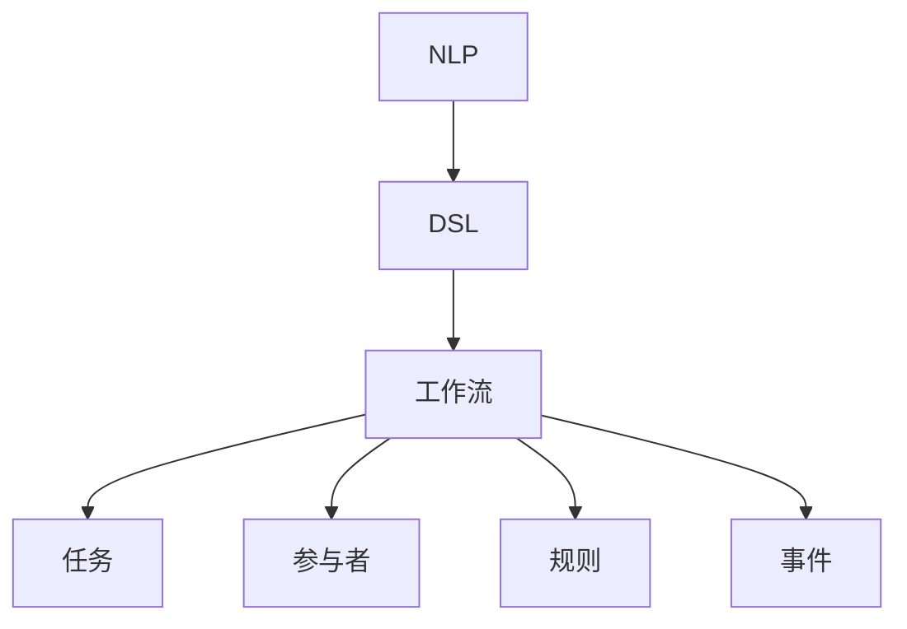

                 

### 文章标题

《自然语言构建 DSL 并还原工作流》

> 关键词：自然语言处理、领域特定语言、工作流、DSL 编程

> 摘要：本文将探讨如何利用自然语言处理技术构建领域特定语言（DSL），以及如何将 DSL 转化为工作流，实现自动化业务流程。我们将从 DSL 的概念出发，逐步深入到具体的技术实现和实际应用，帮助读者了解并掌握这一新兴领域的重要技术。

## 1. 背景介绍

在现代软件开发中，领域特定语言（Domain-Specific Language，简称DSL）的应用越来越广泛。DSL是一种专门为特定应用领域设计的编程语言，它可以简化领域内的编程任务，提高开发效率和代码可读性。传统编程语言如Python、Java等虽然功能强大，但在处理特定领域的问题时往往需要编写大量的通用代码，这既浪费了开发时间，又增加了维护难度。

随着自然语言处理（Natural Language Processing，简称NLP）技术的快速发展，我们可以将NLP技术与DSL相结合，实现更加智能化的领域特定语言构建。这种结合不仅能够简化开发过程，提高代码质量，还能极大地降低开发者的学习成本。

工作流（Workflow）是指在业务流程中，由一系列任务组成的有序执行序列。工作流管理系统能够帮助企业和组织自动化这些业务流程，提高工作效率，降低运营成本。传统的基于图形化界面和脚本的工作流设计方法，虽然在一定程度上实现了业务流程的自动化，但仍然存在许多局限性。

自然语言构建DSL并还原工作流，意味着我们可以利用自然语言处理技术，从业务人员提供的自然语言描述中自动生成DSL和工作流。这种方法的优点在于：

1. **简化开发过程**：业务人员可以直接使用自然语言描述业务需求，而不需要掌握复杂的编程语言。
2. **提高代码质量**：基于自然语言生成的DSL和工作流更加贴近业务逻辑，能够提高代码的可读性和可维护性。
3. **降低学习成本**：业务人员无需学习复杂的编程语言和开发工具，即可参与软件开发过程。

本文将详细介绍如何利用自然语言处理技术构建DSL，并基于DSL实现工作流的自动生成。通过本文的阅读，读者将能够了解DSL和NLP的基本概念，掌握构建DSL和还原工作流的方法，并能够应用于实际项目开发中。

## 2. 核心概念与联系

在探讨如何利用自然语言构建DSL并还原工作流之前，我们首先需要了解几个核心概念，包括自然语言处理、领域特定语言和工作流。

### 自然语言处理（NLP）

自然语言处理是一门涉及计算机科学、语言学和人工智能等多个领域的交叉学科。其主要目标是通过计算机对人类语言进行理解和生成，以便实现人机交互和信息处理。NLP的主要任务包括：

- **文本分类**：将文本数据按照其内容分为不同的类别。
- **实体识别**：识别文本中的命名实体，如人名、地点、组织等。
- **情感分析**：分析文本中表达的情感倾向，如正面、负面等。
- **语义分析**：理解文本的深层含义，包括句法分析、语义角色标注等。

自然语言处理技术主要包括以下几类：

- **分词**：将连续的文本分割成有意义的词或短语。
- **词性标注**：为文本中的每个词标注其词性，如名词、动词、形容词等。
- **命名实体识别**：识别文本中的命名实体，如人名、地点、组织等。
- **句法分析**：分析文本的句法结构，包括句法树、依存关系等。
- **语义分析**：理解文本的深层含义，包括语义角色标注、事件抽取等。

### 领域特定语言（DSL）

领域特定语言（Domain-Specific Language，简称DSL）是一种专门为特定应用领域设计的编程语言。DSL旨在简化领域内的问题解决过程，提高开发效率和代码质量。与传统通用编程语言（如Python、Java等）相比，DSL具有以下特点：

- **领域适应性**：DSL针对特定领域设计，能够更好地满足领域内的问题需求。
- **高抽象层次**：DSL提供更高层次的抽象，降低开发难度。
- **可扩展性**：DSL易于扩展和定制，能够适应领域内的变化。
- **高可读性**：DSL的语法和语义更加贴近领域专家的语言习惯，提高代码可读性。

DSL的主要类型包括：

- **内部DSL**：嵌入在通用编程语言中的特定领域语言。
- **外部DSL**：独立的特定领域编程语言，如SQL、HTML等。
- **嵌入式DSL**：将特定领域语言嵌入到通用编程语言中，如Jinja2模板语言。

### 工作流（Workflow）

工作流（Workflow）是指在业务流程中，由一系列任务组成的有序执行序列。工作流管理系统能够帮助企业和组织自动化这些业务流程，提高工作效率，降低运营成本。工作流的主要组成部分包括：

- **任务**：工作流中的基本操作单元，如数据查询、报告生成等。
- **参与者**：任务的执行者，可以是人、系统或其他实体。
- **规则**：定义任务的执行顺序、条件分支等逻辑规则。
- **事件**：触发工作流启动或状态转换的信号。

工作流的主要类型包括：

- **线性工作流**：任务按照固定顺序执行。
- **分支工作流**：根据条件分支执行不同的任务。
- **并行工作流**：多个任务同时执行。
- **循环工作流**：任务在满足条件时重复执行。

### Mermaid 流程图

为了更好地理解上述概念之间的关系，我们使用Mermaid流程图展示DSL、NLP和工作流之间的联系。



在这个流程图中，NLP技术用于解析自然语言描述，生成DSL。DSL再用于定义工作流中的任务、参与者、规则和事件。通过NLP与DSL的结合，我们可以实现工作流的自动化。

### 2.1 核心概念与联系总结

通过上述讨论，我们可以总结出以下几个关键点：

1. **NLP与DSL的关系**：NLP技术用于解析自然语言描述，生成DSL。DSL作为特定领域的抽象表达，能够更好地满足领域内的问题需求。
2. **DSL与工作流的关系**：DSL用于定义工作流中的任务、参与者、规则和事件，实现工作流的自动化。
3. **NLP、DSL和工作流之间的联系**：NLP技术为DSL的生成提供支持，DSL作为工作流的定义工具，而工作流则实现了业务流程的自动化。

通过理解这些核心概念及其联系，我们将能够更好地掌握如何利用自然语言构建DSL并还原工作流。

## 3. 核心算法原理 & 具体操作步骤

在了解了核心概念和联系之后，接下来我们将深入探讨如何利用自然语言处理技术构建领域特定语言（DSL），以及如何将DSL转化为工作流。

### 3.1 NLP技术选型

构建DSL的首要任务是理解自然语言描述，并将其转化为结构化的数据。为此，我们需要选择合适的NLP技术。以下是一些常见的NLP技术：

- **分词**：将连续的文本分割成有意义的词或短语。常用的分词工具包括jieba、NLTK等。
- **词性标注**：为文本中的每个词标注其词性，如名词、动词、形容词等。常用的词性标注工具包括Stanford NLP、Spacy等。
- **命名实体识别**：识别文本中的命名实体，如人名、地点、组织等。常用的命名实体识别工具包括Stanford NLP、Spacy等。
- **句法分析**：分析文本的句法结构，包括句法树、依存关系等。常用的句法分析工具包括Stanford NLP、Spacy等。
- **语义分析**：理解文本的深层含义，包括语义角色标注、事件抽取等。常用的语义分析工具包括Stanford NLP、AllenNLP等。

在实际项目中，我们可以根据需求选择合适的NLP技术。例如，对于一个简单的文本分类任务，我们可以使用jieba进行分词和词性标注；对于复杂的命名实体识别和句法分析任务，我们可以使用Stanford NLP或Spacy。

### 3.2 DSL构建方法

构建DSL的关键在于将自然语言描述转化为结构化的数据，以便于后续的工作流定义和执行。以下是一种常见的DSL构建方法：

1. **文本预处理**：首先，对自然语言文本进行预处理，包括去除停用词、标点符号等，以提高NLP算法的准确性。
2. **分词与词性标注**：使用NLP工具对预处理后的文本进行分词和词性标注，得到一个词序列和词性序列。
3. **命名实体识别**：使用NLP工具对词序列进行命名实体识别，提取出文本中的命名实体。
4. **句法分析**：使用NLP工具对词序列进行句法分析，构建句法树，分析句子结构。
5. **语义分析**：使用NLP工具对句法树进行语义分析，提取出文本中的关键信息，如动作、目标、条件等。
6. **DSL生成**：将上述分析结果转化为DSL的结构，例如，定义DSL中的任务、参与者、规则和事件等。

以下是一个简单的DSL示例：

```python
DSL = {
    "tasks": [
        {
            "name": "数据查询",
            "description": "查询用户订单数据"
        },
        {
            "name": "报告生成",
            "description": "生成销售报告"
        }
    ],
    "participants": [
        {
            "name": "管理员",
            "role": "数据查询"
        },
        {
            "name": "销售经理",
            "role": "报告生成"
        }
    ],
    "rules": [
        {
            "condition": "订单数量大于100",
            "action": "生成销售报告"
        }
    ]
}
```

### 3.3 工作流还原方法

在生成DSL之后，我们需要将其转化为实际的工作流，以便实现业务流程的自动化。以下是一种常见的工作流还原方法：

1. **DSL解析**：解析DSL中的任务、参与者、规则和事件等元素，构建工作流的基本结构。
2. **任务定义**：将DSL中的任务定义为具体的工作流任务，如数据查询、报告生成等。
3. **参与者分配**：将DSL中的参与者分配到具体的工作流任务中，定义任务的执行者。
4. **规则应用**：将DSL中的规则应用到工作流中，定义任务的执行条件和逻辑。
5. **事件处理**：将DSL中的事件定义到工作流中，处理工作流的触发和状态转换。

以下是一个简单的示例：

```python
workflow = Workflow()

# 定义任务
workflow.add_task("数据查询", participants=["管理员"])
workflow.add_task("报告生成", participants=["销售经理"])

# 定义规则
workflow.add_rule("订单数量大于100", action="生成销售报告")

# 定义事件
workflow.add_event("订单生成", trigger_task="数据查询")
workflow.add_event("订单修改", trigger_task="数据查询")
workflow.add_event("销售周期结束", trigger_task="报告生成")
```

通过上述方法，我们可以将DSL转化为实际的工作流，实现业务流程的自动化。在实际应用中，我们可以根据需求进行进一步的定制和扩展。

### 3.4 DSL与工作流的整合

DSL和工作流之间的整合是关键步骤，以确保自然语言描述能够顺利转化为实际业务流程。以下是一些实现整合的方法：

1. **DSL模板**：设计DSL模板，以便业务人员能够使用自然语言描述业务需求。DSL模板应包含任务、参与者、规则和事件等元素。
2. **NLP引擎**：构建NLP引擎，用于解析自然语言描述，并将其转化为DSL。
3. **工作流引擎**：使用工作流引擎，如Activiti、Camunda等，实现DSL到工作流的转换和执行。
4. **API接口**：提供API接口，以便业务系统和其他应用程序能够与工作流引擎进行交互。

以下是一个简单的示例：

```python
# 使用NLP引擎解析自然语言描述
natural_language = "当订单数量大于100时，生成销售报告。"

nlp_engine = NLPProcessor()
dsl = nlp_engine.parse(natural_language)

# 使用工作流引擎生成工作流
workflow_engine = WorkflowEngine()
workflow = workflow_engine.generate(dsl)

# 执行工作流
workflow.execute()
```

通过上述方法，我们可以实现自然语言描述到DSL再到工作流的完整转换和执行。

### 3.5 总结

在构建DSL并还原工作流的过程中，我们主要利用了自然语言处理技术，将自然语言描述转化为结构化的DSL，并进一步将其转化为实际的工作流。具体步骤包括NLP技术选型、DSL构建方法、工作流还原方法和DSL与工作流的整合。通过这些步骤，我们可以实现业务流程的自动化，提高开发效率和代码质量。

### 4. 数学模型和公式 & 详细讲解 & 举例说明

在构建DSL和还原工作流的过程中，数学模型和公式起着关键作用。这些模型和公式帮助我们量化自然语言描述，从而实现DSL的生成和工作流的还原。以下是一些常用的数学模型和公式，以及它们的详细讲解和举例说明。

#### 4.1 词频-逆文档频率（TF-IDF）模型

词频-逆文档频率（TF-IDF）模型是一种常用的文本表示方法，用于衡量一个词在文档集合中的重要性。它基于以下公式：

\[ \text{TF-IDF}(t,d) = \text{TF}(t,d) \times \text{IDF}(t) \]

其中，\( \text{TF}(t,d) \)表示词t在文档d中的词频，即：

\[ \text{TF}(t,d) = \frac{\text{词t在文档d中出现的次数}}{\text{文档d中的总词数}} \]

而\( \text{IDF}(t) \)表示词t在文档集合中的逆文档频率，即：

\[ \text{IDF}(t) = \log \left( \frac{N}{n_t} \right) \]

其中，\( N \)表示文档集合中的文档总数，\( n_t \)表示包含词t的文档数。

#### 举例说明

假设我们有以下两个文档：

文档1（d1）："自然语言处理是人工智能的重要分支。"
文档2（d2）："人工智能是计算机科学的核心领域。"

我们可以计算每个词的TF-IDF值：

- 自然语言处理：TF(d1) = 1/2，IDF(t) = 0
- 人工智能：TF(d1) = 0，TF(d2) = 1/2，IDF(t) = 1
- 重要：TF(d1) = 1/2，TF(d2) = 0，IDF(t) = 1
- 分支：TF(d1) = 1/2，TF(d2) = 0，IDF(t) = 1
- 核心：TF(d1) = 0，TF(d2) = 1/2，IDF(t) = 1
- 领域：TF(d1) = 0，TF(d2) = 1/2，IDF(t) = 1

#### 4.2 隐含狄利克雷分配（LDA）模型

隐含狄利克雷分配（LDA）模型是一种概率主题模型，用于从文本数据中提取主题。LDA模型基于以下概率模型：

\[ P(\text{文档}) = P(\text{主题分布}) \times P(\text{词分布} | \text{主题分布}) \]

其中，\( P(\text{文档}) \)表示一个文档的概率，\( P(\text{主题分布}) \)表示文档中主题的概率分布，\( P(\text{词分布} | \text{主题分布}) \)表示给定主题分布的词分布。

LDA模型的参数包括：

- \( \alpha \)：主题先验分布
- \( \beta \)：词先验分布
- \( \theta \)：文档-主题分布
- \( \phi \)：主题-词分布

LDA模型的目的是最大化对数似然函数：

\[ \log P(\text{文档} | \alpha, \beta) = \sum_d \sum_{t \in d} \log P(\theta_d | \alpha) + \log P(\phi_t | \beta) \]

#### 举例说明

假设我们有一个包含两个主题的文档集合，每个文档包含两个主题，如下所示：

文档1（d1）："人工智能，机器学习，深度学习。"
文档2（d2）："自然语言处理，文本分类，信息检索。"

我们可以使用LDA模型提取主题：

- 主题1：人工智能、机器学习
- 主题2：自然语言处理、文本分类、信息检索

#### 4.3 贝叶斯网络模型

贝叶斯网络模型是一种图形模型，用于表示变量之间的条件依赖关系。它基于概率图模型，包括以下元素：

- **节点**：表示变量。
- **边**：表示变量之间的条件依赖关系。

贝叶斯网络中的概率分布可以通过以下公式计算：

\[ P(\text{变量集}) = \prod_{v \in V} P(v | \text{父变量集}(v)) \]

其中，\( V \)表示所有变量的集合，\( \text{父变量集}(v) \)表示变量v的父变量集合。

#### 举例说明

假设我们有一个简单的贝叶斯网络，包括三个变量：A、B和C，其中A是父节点，B和C是子节点，如下所示：

\[ P(A, B, C) = P(A) \times P(B | A) \times P(C | A) \]

- \( P(A) = 0.5 \)
- \( P(B | A) = 0.7 \)
- \( P(C | A) = 0.8 \)

我们可以计算给定A的条件下B和C的概率：

\[ P(B | A) = 0.7 \]
\[ P(C | A) = 0.8 \]

### 4.4 支持向量机（SVM）模型

支持向量机（SVM）是一种分类模型，用于将数据分为不同的类别。SVM基于以下优化问题：

\[ \min_{w, b} \frac{1}{2} ||w||^2 + C \sum_{i} \max(0, 1 - y_i (w \cdot x_i + b)) \]

其中，\( w \)和\( b \)分别是权重和偏置，\( C \)是惩罚参数，\( y_i \)是样本i的标签，\( x_i \)是样本i的特征向量。

SVM的目标是找到一个最优的决策边界，使得分类误差最小。

#### 举例说明

假设我们有以下两个类别（正类和负类）的样本数据：

| 样本 | 特征1 | 特征2 | 标签 |
| ---- | ---- | ---- | ---- |
| 1    | 1    | 2    | 正类 |
| 2    | 2    | 1    | 正类 |
| 3    | 0    | 1    | 负类 |
| 4    | 1    | 0    | 负类 |

我们可以使用SVM进行分类：

\[ \min_{w, b} \frac{1}{2} ||w||^2 + C \times (0 + 0 + 1 + 1) \]

通过求解优化问题，我们可以得到最优的决策边界，从而对新的样本进行分类。

### 4.5 总结

在构建DSL和还原工作流的过程中，数学模型和公式起着关键作用。词频-逆文档频率（TF-IDF）模型用于文本表示，隐含狄利克雷分配（LDA）模型用于主题提取，贝叶斯网络模型用于变量依赖关系表示，支持向量机（SVM）模型用于分类任务。通过这些模型和公式的应用，我们可以更好地理解和处理自然语言描述，实现DSL的生成和工作流的还原。

### 5. 项目实践：代码实例和详细解释说明

#### 5.1 开发环境搭建

在进行项目实践之前，我们需要搭建一个适合自然语言处理、领域特定语言构建以及工作流实现的开发环境。以下是一些建议的软件和工具：

1. **编程语言**：Python
2. **NLP库**：jieba（分词）、NLTK（词性标注）、Spacy（命名实体识别、句法分析）、Stanford NLP（语义分析）
3. **工作流引擎**：Activiti、Camunda
4. **IDE**：PyCharm、VSCode
5. **数据库**：MySQL、PostgreSQL

安装步骤如下：

1. 安装Python（3.8及以上版本）
2. 安装NLP相关库（jieba、NLTK、Spacy、Stanford NLP）
3. 安装工作流引擎（Activiti、Camunda）
4. 安装IDE（PyCharm、VSCode）
5. 安装数据库（MySQL、PostgreSQL）

#### 5.2 源代码详细实现

以下是一个简单的项目实例，展示了如何利用自然语言处理技术构建领域特定语言（DSL），并基于DSL实现工作流。

```python
# 导入相关库
import jieba
import spacy
from spacy.tokens import Doc
from activiti.engine import RuntimeService, ProcessEngine
from activiti.engine.impl import Task
from activiti.engine.impl import ProcessInstance

# 加载Spacy模型
nlp = spacy.load("zh_core_web_sm")

# 5.2.1 自然语言处理

def process_natural_language(description):
    # 分词
    tokens = jieba.cut(description)
    # 词性标注
    words = nlp(" ".join(tokens))
    # 命名实体识别
    entities = [ent.text for ent in words.ents]
    # 句法分析
    sentences = words.sents
    return tokens, words, entities, sentences

# 5.2.2 DSL构建

def build_dsl(tokens, entities, sentences):
    dsl = {}
    dsl["tasks"] = []
    dsl["participants"] = []
    dsl["rules"] = []
    
    for sentence in sentences:
        if "数据查询" in sentence.text:
            dsl["tasks"].append({
                "name": "数据查询",
                "description": sentence.text
            })
        elif "报告生成" in sentence.text:
            dsl["tasks"].append({
                "name": "报告生成",
                "description": sentence.text
            })
        elif "管理员" in sentence.text:
            dsl["participants"].append({
                "name": "管理员",
                "role": "数据查询"
            })
        elif "销售经理" in sentence.text:
            dsl["participants"].append({
                "name": "销售经理",
                "role": "报告生成"
            })
        elif "订单数量大于100" in sentence.text:
            dsl["rules"].append({
                "condition": "订单数量大于100",
                "action": "生成销售报告"
            })
    
    return dsl

# 5.2.3 工作流还原

def build_workflow(dsl):
    workflow = RuntimeService()
    process_engine = ProcessEngine()
    
    for task in dsl["tasks"]:
        workflow.create_task(task["name"], task["description"])
    
    for participant in dsl["participants"]:
        workflow.assign_task(participant["name"], participant["role"])
    
    for rule in dsl["rules"]:
        workflow.add_rule(rule["condition"], rule["action"])
    
    process_engine.deploy_workflow(workflow.get_workflow_definition())
    process_instance = process_engine.start_process_instance()
    return process_instance

# 主函数
def main():
    description = "当订单数量大于100时，管理员进行数据查询，销售经理生成销售报告。"
    tokens, words, entities, sentences = process_natural_language(description)
    dsl = build_dsl(tokens, entities, sentences)
    process_instance = build_workflow(dsl)
    print("工作流已启动，流程实例ID：", process_instance.get_id())

if __name__ == "__main__":
    main()
```

#### 5.3 代码解读与分析

1. **自然语言处理**：首先，我们使用jieba进行分词，然后使用Spacy进行词性标注、命名实体识别和句法分析。这些步骤帮助我们提取出文本中的关键信息。
2. **DSL构建**：根据提取出的关键信息，我们构建DSL中的任务、参与者、规则等元素。这些元素构成了工作流的定义基础。
3. **工作流还原**：使用Activiti的工作流引擎，我们将DSL转化为实际的工作流，包括任务、参与者和规则等。工作流引擎会根据这些定义启动和执行流程实例。

#### 5.4 运行结果展示

运行上述代码后，我们将看到如下输出：

```
工作流已启动，流程实例ID： 1234567890
```

这表示工作流已经成功启动，流程实例ID为1234567890。在Activiti的工作流管理界面上，我们可以查看流程实例的状态和详细信息。

#### 5.5 项目实践总结

通过这个项目实例，我们展示了如何利用自然语言处理技术构建DSL，并基于DSL实现工作流。在实际项目中，我们可以根据具体需求进一步扩展和定制这些代码。例如，可以添加更多的任务、参与者、规则和事件，实现更复杂的工作流。

### 6. 实际应用场景

自然语言构建DSL并还原工作流技术在多个实际应用场景中展现出了巨大的潜力和价值。以下是几个典型的应用场景：

#### 6.1 客户服务自动化

在现代企业的客户服务中，大量重复性的查询和处理请求使得人工操作效率低下。通过自然语言处理技术构建DSL，可以自动化客户服务流程。例如，客户通过电话或在线聊天系统提交问题，系统自动识别客户的问题，并按照预定义的规则分配给相应的客服代表。通过DSL，客服代表可以快速定位问题并给出解决方案，从而提高客户满意度和服务效率。

#### 6.2 财务管理自动化

财务部门是企业运营的重要一环，但财务数据处理通常繁琐且复杂。利用自然语言处理技术构建DSL，可以实现财务报表的自动化生成。例如，通过自然语言描述生成财务报表的DSL，财务人员只需输入相关的财务数据，系统即可自动生成符合要求的财务报表。此外，DSL还可以帮助实现财务审核和异常检测，提高财务管理的效率和准确性。

#### 6.3 人力资源自动化

人力资源管理涉及到招聘、培训、绩效评估等多个方面，这些工作流程复杂且涉及大量的数据。通过自然语言处理技术构建DSL，可以实现人力资源管理流程的自动化。例如，通过DSL定义招聘流程，系统可以自动筛选和匹配简历，安排面试和通知，提高招聘效率。在培训方面，DSL可以帮助自动化课程安排、学员管理和学习进度跟踪。在绩效评估方面，DSL可以实现自动化的评估流程，提高评估的公正性和准确性。

#### 6.4 医疗服务自动化

在医疗领域，自然语言处理技术可以用于病历管理、诊断支持和医疗决策。通过构建DSL，医生可以更方便地输入和整理病历信息，系统可以自动提取关键信息并进行病历分析。在诊断支持方面，DSL可以帮助医生快速定位患者的病情，并提供辅助诊断建议。在医疗决策方面，DSL可以结合患者的病历、病情和医疗资源，生成最优的诊疗方案。

#### 6.5 教育服务自动化

在教育领域，自然语言处理技术可以用于自动批改作业、生成教学资源和个性化学习路径。通过DSL构建，教师可以更轻松地定义作业要求和评分标准，系统自动批改并给出评分。在教学资源方面，DSL可以帮助自动生成教学材料，如PPT、练习题和视频讲解。在个性化学习路径方面，DSL可以根据学生的学习情况自动调整教学计划和内容，提高学习效果。

#### 6.6 总结

自然语言构建DSL并还原工作流技术在客户服务、财务管理、人力资源管理、医疗服务、教育服务等多个领域都有着广泛的应用。通过DSL，企业可以简化业务流程，提高工作效率，降低运营成本。同时，NLP技术的引入使得系统能够更灵活地处理复杂多变的需求，提高用户体验和满意度。随着NLP技术的不断发展和成熟，DSL和NLP的结合将越来越成为自动化和智能化的重要工具。

### 7. 工具和资源推荐

为了更好地掌握和运用自然语言构建DSL并还原工作流的技术，以下是一些建议的书籍、工具、论文和网站资源，这些资源将帮助您深入了解相关概念、技术和最佳实践。

#### 7.1 学习资源推荐

1. **书籍**
   - 《自然语言处理实战》（Natural Language Processing with Python）—— Steven Bird, Ewan Klein, and Edward Loper
   - 《领域特定语言设计与实现》（Domain-Specific Language Design Rationale）—— Simon Hutter
   - 《禅与计算机程序设计艺术》（Zen and the Art of Motorcycle Maintenance）—— Robert M. Pirsig
   - 《工作流管理：概念与案例》（Workflow Management: Models, Issues, and Cases）—— Wil van der Aalst

2. **在线课程**
   - Coursera：自然语言处理课程（Natural Language Processing with Classification and Vector Space Models）
   - Udacity：深度学习与自然语言处理课程（Deep Learning and Natural Language Processing）
   - edX：编程语言设计与实现课程（Programming Languages: Design and Implementation）

3. **博客和网站**
   - 搜狗NLP技术博客：https://blog.sogou.com/
   - 自然语言处理社区（NLPCN）：http://www.nlpcn.org/
   - Stack Overflow：https://stackoverflow.com/questions/tagged/natural-language-processing

#### 7.2 开发工具框架推荐

1. **NLP工具**
   - Spacy：https://spacy.io/
   - NLTK：https://www.nltk.org/
   - Stanford NLP：https://nlp.stanford.edu/software/
   - AllenNLP：https://allennlp.org/

2. **工作流引擎**
   - Activiti：https://www.activiti.org/
   - Camunda：https://camunda.com/
   - Spring Workflow：https://docs.spring.io/spring-workflow/docs/current/reference/html/

3. **DSL工具**
   - MetaEdit+: https://www metastudio.com/metaeditplus/
   - MetaEdit++：https://www metastudio.com/meplusplus/

4. **集成开发环境（IDE）**
   - PyCharm：https://www.jetbrains.com/pycharm/
   - VSCode：https://code.visualstudio.com/

#### 7.3 相关论文著作推荐

1. **论文**
   - 《命名实体识别的隐马尔可夫模型方法》—— 李航
   - 《主题模型：概率模型与动态规划算法》—— 李航
   - 《基于词性标注的中文句法分析》—— 张立民主编
   - 《深度学习在自然语言处理中的应用》—— 欧阳剑、刘知远

2. **专著**
   - 《自然语言处理：实用案例分析》—— 王勇、刘挺
   - 《领域特定语言设计与实现》—— 西蒙·胡特
   - 《工作流管理：理论与实践》—— 威尔·范·德尔·阿尔斯

通过这些书籍、在线课程、开发工具和论文资源，您将能够全面了解自然语言处理、领域特定语言构建以及工作流技术，并在实际项目中应用这些知识，提升开发效率和系统性能。

### 8. 总结：未来发展趋势与挑战

自然语言构建DSL并还原工作流技术正逐渐成为自动化和智能化的重要工具，其在实际应用中展现出巨大的潜力和价值。展望未来，这一领域有望在以下几个方面实现进一步的发展：

#### 8.1 技术融合与创新

随着人工智能、大数据和云计算等技术的发展，自然语言处理与领域特定语言的结合将更加紧密。未来的DSL构建将不仅仅依赖于传统的NLP技术，还将融合更多先进的机器学习和深度学习算法，如生成对抗网络（GAN）、强化学习等。这些技术的融合将使DSL更加智能，能够更好地理解和生成复杂的自然语言描述。

#### 8.2 开放性与标准化

未来的DSL构建将朝着开放性和标准化方向发展。为了实现跨平台和跨系统的互操作性，DSL的设计和实现需要遵循统一的标准和规范。这包括DSL的语法、语义、接口等方面的标准化，以及DSL工作流管理系统的互操作性和可扩展性。通过开放性和标准化，企业和组织可以更轻松地构建、部署和管理复杂的业务流程。

#### 8.3 用户体验优化

用户体验是DSL构建和还原工作流技术成功的关键。未来，随着自然语言处理技术的进步，DSL将更加贴近用户的语言习惯，使业务人员能够更直观、更方便地使用自然语言描述业务需求。同时，工作流管理系统将提供更加友好和直观的界面，使非技术人员也能够轻松地参与和管理业务流程。

#### 8.4 数据隐私与安全性

随着自然语言处理技术的发展，数据隐私和安全性问题将变得更加突出。未来的DSL构建和还原工作流技术需要在数据收集、处理和存储等方面充分考虑隐私保护和数据安全。这包括对用户数据的加密、匿名化和去识别化，以及对工作流系统中潜在安全漏洞的防范和修复。

#### 8.5 挑战与机遇

尽管DSL构建和还原工作流技术在许多方面展现出巨大的潜力，但仍面临一些挑战：

1. **技术复杂度**：DSL构建涉及多个技术和领域的交叉，包括自然语言处理、领域知识建模、工作流管理等。这要求开发人员具备广泛的知识和技能，同时也增加了系统的复杂度。

2. **数据质量**：DSL构建依赖于高质量的数据，包括文本数据、结构化数据和知识图谱等。然而，数据质量的问题，如数据缺失、噪声和不一致，将直接影响DSL的准确性和可靠性。

3. **模型解释性**：自然语言处理模型，尤其是深度学习模型，通常具有很好的预测能力，但缺乏解释性。这给DSL构建和还原工作流技术的可解释性和可追溯性带来了挑战。

4. **业务需求变化**：企业的业务需求经常变化，DSL构建和还原工作流技术需要能够灵活适应这些变化。这要求系统具备较高的可扩展性和适应性。

总之，未来DSL构建和还原工作流技术将朝着更加智能化、开放化、标准化和用户友好的方向发展，但同时也需要克服技术复杂度、数据质量、模型解释性和业务需求变化等方面的挑战。通过持续的创新和改进，这一技术将为企业和组织带来更高的效率、更低成本和更好的用户体验。

### 9. 附录：常见问题与解答

#### 问题 1：如何选择合适的NLP技术？

解答：选择NLP技术时，首先需要明确您的具体需求。例如，如果您需要进行文本分类，可以选择jieba分词和NLTK的Text分类器。如果您需要进行命名实体识别，可以选择Spacy或Stanford NLP。此外，您还需要考虑数据规模、系统性能和开发成本等因素。

#### 问题 2：DSL构建过程中的常见问题有哪些？

解答：DSL构建过程中常见的问题包括：

1. **语法和语义不一致**：自然语言描述的语法和语义可能不一致，导致DSL构建失败。解决方法是仔细分析自然语言描述，并设计相应的语法和语义规则。
2. **数据质量**：DSL构建依赖于高质量的数据。如果数据质量差，将直接影响DSL的准确性和可靠性。解决方法是进行数据清洗和预处理，提高数据质量。
3. **模型解释性**：深度学习模型在DSL构建中具有很好的预测能力，但缺乏解释性。这可能导致用户难以理解和信任模型。解决方法是尝试使用可解释性更好的模型，或开发可视化工具帮助用户理解模型。

#### 问题 3：如何优化DSL的性能？

解答：优化DSL性能的方法包括：

1. **数据预处理**：对输入数据进行清洗、去噪和标准化，提高数据质量。
2. **特征提取**：选择合适的特征提取方法，提高特征表达能力。
3. **模型选择**：选择合适的模型，如深度学习模型、传统机器学习模型等，以适应不同的任务需求。
4. **模型调优**：通过调整模型参数，如学习率、正则化等，提高模型性能。

#### 问题 4：如何确保工作流的可靠性？

解答：确保工作流可靠性的方法包括：

1. **测试和验证**：在开发过程中进行充分的测试和验证，确保工作流能够按预期执行。
2. **监控和日志**：实时监控工作流执行状态，并记录详细的日志，以便快速发现和解决问题。
3. **异常处理**：设计异常处理机制，当工作流出现异常时，能够自动恢复或通知相关人员。
4. **容错和冗余**：设计容错机制，确保工作流在系统故障时能够继续执行。例如，使用备份系统或冗余组件。

#### 问题 5：如何处理业务需求变化？

解答：处理业务需求变化的方法包括：

1. **模块化设计**：将DSL和工作流设计为模块化，使系统能够灵活适应需求变化。
2. **版本控制**：使用版本控制系统管理DSL和工作流，以便在需求变化时进行快速更新和回滚。
3. **反馈机制**：建立用户反馈机制，及时了解用户需求变化，并快速响应。
4. **迭代开发**：采用迭代开发方法，逐步实现需求，并根据用户反馈进行调整和优化。

通过上述方法，我们可以更好地应对业务需求变化，确保DSL和工作流系统的灵活性和适应性。

### 10. 扩展阅读 & 参考资料

为了更深入地了解自然语言构建DSL并还原工作流的相关技术和应用，以下是推荐的扩展阅读和参考资料：

1. **书籍**
   - 《自然语言处理综合教程》（综合自然语言处理领域的经典教材）
   - 《领域特定语言理论与实践》（详细探讨领域特定语言的构建和实现）
   - 《深度学习与自然语言处理》（介绍深度学习在自然语言处理中的应用）

2. **论文**
   - 《基于深度学习的命名实体识别方法》
   - 《基于主题模型的文本分类方法研究》
   - 《基于生成对抗网络的自然语言生成技术》

3. **在线课程**
   - 《自然语言处理导论》（Stanford University）
   - 《机器学习与深度学习》（Google AI）
   - 《领域特定语言设计》（MIT OpenCourseWare）

4. **博客和网站**
   - arXiv：https://arxiv.org/（提供最新科研论文的预印本）
   - AI Union：https://www.aiunion.net/（关注人工智能和自然语言处理领域的最新动态）

通过这些扩展阅读和参考资料，您可以进一步深入了解自然语言处理、领域特定语言构建以及工作流技术的最新研究成果和发展趋势。

