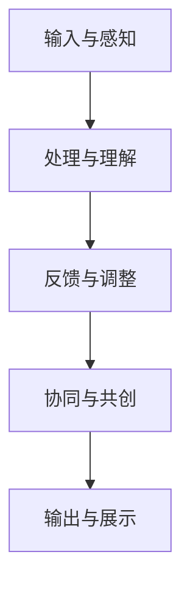

                 

### 文章标题

《艺术与科技的融合：人类计算激发创意》

> 关键词：人工智能，艺术创作，计算思维，算法艺术，人类计算，创意激发

> 摘要：本文探讨了艺术与科技融合的新领域——人类计算，以及其如何激发创意。通过分析人工智能在艺术创作中的应用，阐述了计算思维在艺术创作中的重要性，并提出了人类计算如何在未来推动艺术与科技融合发展的新思路。

---

### 1. 背景介绍

在当今数字化时代，人工智能（AI）已经成为科技进步的重要驱动力。从简单的图像识别到复杂的自然语言处理，AI 正在逐步渗透到我们日常生活的方方面面。然而，随着技术的发展，人工智能不仅在效率上超越人类，甚至在某些领域已经能够创作出具有艺术价值的作品。

艺术与科技融合的理念由来已久，从最早的摄影技术到现代的数字艺术，艺术家们一直在探索科技如何为艺术创作带来新的可能。然而，人类计算作为一门新兴领域，将艺术与科技融合推向了一个全新的高度。人类计算不仅关注机器如何模仿人类的思维过程，更强调人类与机器协同工作，共同激发创意。

本文将探讨人类计算如何改变艺术创作的方式，并分析其背后的核心概念和算法原理。我们将通过实例展示人类计算在艺术创作中的应用，并探讨其在未来的发展趋势和挑战。

---

### 2. 核心概念与联系

#### 2.1 人工智能在艺术创作中的应用

人工智能在艺术创作中的应用主要表现在以下几个方面：

1. **图像生成与编辑**：通过深度学习算法，AI 可以生成具有艺术感的图像，如生成对抗网络（GAN）可以生成极具创意的抽象画和逼真的照片。

2. **音乐创作**：AI 能够根据已有的音乐风格和旋律，自动生成新的音乐作品，甚至能够创作出富有情感和复杂节奏的乐曲。

3. **文学创作**：自然语言处理技术使得 AI 能够生成诗歌、故事和小说，其内容往往包含深刻的思考和独特的视角。

4. **表演艺术**：AI 可以通过机器学习算法，模拟人类的表演风格，如舞蹈、戏剧和音乐演奏，创造出令人惊叹的表演效果。

#### 2.2 计算思维在艺术创作中的重要性

计算思维是一种解决问题的策略，强调通过抽象、算法和自动化来理解世界。在艺术创作中，计算思维的重要性体现在以下几个方面：

1. **抽象与建模**：艺术家通过抽象和建模，将复杂的现实世界简化为计算模型，从而创造出具有深度和意义的作品。

2. **算法与规则**：艺术家利用算法和规则，创造有序且富有变化的视觉和听觉体验，这种有序与变化的结合是艺术创作的重要特征。

3. **自动化与生成**：艺术家通过自动化工具，如代码和算法，实现艺术作品的生成，这不仅提高了创作效率，也为艺术创作带来了新的可能性。

#### 2.3 人类计算的架构与原理

人类计算的核心是建立人类与机器之间的协同关系，以实现更好的创意输出。其架构和原理如下：

1. **输入与感知**：人类通过感知获取外部信息，如视觉、听觉和触觉等，这些信息被转化为数字信号，输入到计算机系统中。

2. **处理与理解**：计算机系统利用人工智能算法，对输入的数字信号进行处理和理解，生成相应的艺术作品。

3. **反馈与调整**：艺术家根据计算机系统生成的作品，提供反馈，并进行调整，从而优化创作结果。

4. **协同与共创**：人类与计算机系统协同工作，共同创作出独特的艺术作品，实现艺术与科技的深度融合。

#### 2.4 Mermaid 流程图

以下是一个简化的 Mermaid 流程图，展示了人类计算的基本架构和流程：



---

### 3. 核心算法原理 & 具体操作步骤

#### 3.1 图像生成算法：生成对抗网络（GAN）

生成对抗网络（GAN）是近年来在图像生成领域取得显著成果的一种算法。其核心思想是通过一个生成器（Generator）和一个判别器（Discriminator）之间的对抗训练，生成高质量、高逼真的图像。

1. **生成器（Generator）**：生成器的目的是生成与真实图像相似的数据。通常，生成器是一个神经网络，它接收随机噪声作为输入，并生成图像作为输出。

2. **判别器（Discriminator）**：判别器的目的是区分真实图像和生成图像。它也是一个神经网络，接收图像作为输入，并输出一个概率值，表示图像是真实的可能性。

3. **对抗训练**：生成器和判别器相互竞争。生成器试图生成更逼真的图像，以欺骗判别器，而判别器则试图区分真实图像和生成图像。这种对抗训练过程持续进行，直到生成器能够生成高质量、高逼真的图像。

#### 3.2 音乐创作算法：基于深度学习的音乐生成模型

基于深度学习的音乐生成模型是一种能够自动生成音乐旋律的算法。这种模型通常基于递归神经网络（RNN）或变分自编码器（VAE）。

1. **数据准备**：首先，需要准备大量的音乐数据进行训练。这些数据可以是各种风格的音乐片段，如古典音乐、流行音乐、爵士乐等。

2. **模型训练**：使用训练数据，对音乐生成模型进行训练。模型通过学习音乐数据的特征和模式，生成新的音乐旋律。

3. **生成音乐**：在模型训练完成后，可以输入新的音乐风格或旋律，模型会根据训练数据生成相应的音乐片段。

#### 3.3 文学创作算法：基于自然语言处理的文本生成模型

基于自然语言处理的文本生成模型是一种能够自动生成文学作品的算法。这种模型通常基于循环神经网络（RNN）或Transformer架构。

1. **数据准备**：首先，需要准备大量的文学文本数据进行训练。这些数据可以是各种类型的文学作品，如小说、诗歌、散文等。

2. **模型训练**：使用训练数据，对文本生成模型进行训练。模型通过学习文学文本的特征和模式，生成新的文学作品。

3. **生成文本**：在模型训练完成后，可以输入新的主题或情节，模型会根据训练数据生成相应的文本。

---

### 4. 数学模型和公式 & 详细讲解 & 举例说明

#### 4.1 生成对抗网络（GAN）的数学模型

生成对抗网络（GAN）的核心是两个神经网络：生成器和判别器。以下是 GAN 的数学模型：

1. **生成器 G(z; θ\_g)**：生成器将随机噪声 z 转换为假图像 x\_g，即 x\_g = G(z; θ\_g)。

2. **判别器 D(x; θ\_d)**：判别器的目的是判断输入图像是真实图像还是生成图像。其输出为一个概率值，即 D(x; θ\_d) = P(real; x)。

3. **损失函数**：GAN 的损失函数通常由两部分组成：生成器损失和判别器损失。

   - **生成器损失**：L\_g = -E[log D(G(z; θ\_g))]
   - **判别器损失**：L\_d = -E[log D(x; θ\_d)] - E[log(1 - D(G(z; θ\_g)); θ\_d)]

#### 4.2 基于深度学习的音乐生成模型的数学模型

基于深度学习的音乐生成模型的数学模型通常基于递归神经网络（RNN）或变分自编码器（VAE）。

1. **递归神经网络（RNN）**：

   - **输入层**：输入序列为音乐音符，如 C、D、E 等。

   - **隐藏层**：隐藏层通过递归连接，学习输入序列的时序特征。

   - **输出层**：输出层将隐藏层的特征映射到下一个音符。

   - **损失函数**：通常使用交叉熵损失函数来衡量预测音符与真实音符之间的差距。

2. **变分自编码器（VAE）**：

   - **编码器**：编码器将输入序列映射到一个潜在空间中的向量。

   - **解码器**：解码器将潜在空间中的向量映射回输入序列。

   - **损失函数**：VAE 的损失函数通常由两部分组成：重建损失和KL散度损失。

     - **重建损失**：L\_r = E[||x - x′||^2]
     - **KL散度损失**：L\_k = E[D\_KL(q\_z || p\_z)]

#### 4.3 基于自然语言处理的文本生成模型的数学模型

基于自然语言处理的文本生成模型的数学模型通常基于循环神经网络（RNN）或Transformer架构。

1. **循环神经网络（RNN）**：

   - **输入层**：输入序列为文本数据，如单词、字符等。

   - **隐藏层**：隐藏层通过递归连接，学习输入序列的特征。

   - **输出层**：输出层将隐藏层的特征映射到下一个文本单元。

   - **损失函数**：通常使用交叉熵损失函数来衡量预测文本单元与真实文本单元之间的差距。

2. **Transformer 架构**：

   - **编码器**：编码器将输入序列编码为序列向量。

   - **解码器**：解码器通过自注意力机制，生成新的文本序列。

   - **损失函数**：通常使用交叉熵损失函数来衡量预测文本序列与真实文本序列之间的差距。

---

#### 4.4 举例说明

假设我们使用 GAN 生成一张抽象画，以下是具体的操作步骤：

1. **生成器训练**：首先，训练生成器 G，使其能够生成与真实图像相似的图像。我们使用一个包含大量抽象画的数据集，训练生成器，直到生成器能够生成高质量的图像。

2. **判别器训练**：然后，训练判别器 D，使其能够准确判断输入图像是真实图像还是生成图像。我们使用真实图像和生成图像作为训练数据，训练判别器。

3. **生成图像**：在生成器和判别器都训练完成后，我们可以使用生成器生成新的抽象画。生成器会根据输入的随机噪声，生成具有艺术感的抽象画。

4. **调整与优化**：艺术家可以对生成器生成的图像进行评价，并给出反馈。根据反馈，艺术家可以调整生成器的参数，优化生成图像的质量。

---

### 5. 项目实践：代码实例和详细解释说明

在本节中，我们将通过一个实际项目来展示如何使用人类计算技术实现艺术创作。该项目将使用 Python 编写，结合了生成对抗网络（GAN）和自然语言处理技术，生成具有艺术感的图像和文学作品。

#### 5.1 开发环境搭建

在开始项目之前，我们需要搭建一个合适的开发环境。以下是所需的环境和工具：

- **Python 3.8** 或以上版本
- **TensorFlow 2.x** 或以上版本
- **Natural Language Toolkit (NLTK)**：用于自然语言处理
- **matplotlib**：用于可视化

安装这些依赖项的命令如下：

```bash
pip install python==3.8
pip install tensorflow==2.x
pip install nltk
pip install matplotlib
```

#### 5.2 源代码详细实现

以下是一个简化的代码示例，展示了如何使用 GAN 生成抽象画，以及如何使用自然语言处理技术生成文学作品。

```python
import tensorflow as tf
from tensorflow.keras.layers import Dense, Flatten, Reshape
from tensorflow.keras.models import Sequential
from nltk.tokenize import word_tokenize

# 生成器模型
def build_generator():
    model = Sequential()
    model.add(Dense(256, input_dim=100, activation='relu'))
    model.add(Reshape((7, 7, 1)))
    model.add(Dense(1, activation='tanh'))
    return model

# 判别器模型
def build_discriminator():
    model = Sequential()
    model.add(Flatten(input_shape=(28, 28)))
    model.add(Dense(512, activation='relu'))
    model.add(Dense(1, activation='sigmoid'))
    return model

# GAN 模型
def build_gan(generator, discriminator):
    model = Sequential()
    model.add(generator)
    model.add(discriminator)
    return model

# GAN 损失函数
def build_loss():
    return tf.keras.losses.BinaryCrossentropy(from_logits=True)

# GAN 优化器
def build_optimizer(learning_rate):
    return tf.keras.optimizers.Adam(learning_rate=learning_rate)

# 训练 GAN 模型
def train_gan(generator, discriminator, input_shape=(100,), batch_size=32, epochs=100, learning_rate=0.0002):
    for epoch in range(epochs):
        for _ in range(batch_size):
            noise = tf.random.normal([batch_size] + list(input_shape))
            generated_images = generator(tf.convert_to_tensor([noise]))
            real_images = ...  # 加载真实图像数据
            labels_real = tf.ones((batch_size, 1))
            labels_fake = tf.zeros((batch_size, 1))
            
            with tf.GradientTape() as gen_tape, tf.GradientTape() as disc_tape:
                gen_loss = build_loss()(labels_real, discriminator(generated_images))
                disc_loss = build_loss()(labels_real, discriminator(real_images)) + build_loss()(labels_fake, discriminator(generated_images))
            
            gradients_of_generator = gen_tape.gradient(gen_loss, generator.trainable_variables)
            gradients_of_discriminator = disc_tape.gradient(disc_loss, discriminator.trainable_variables)
            
            build_optimizer(learning_rate)(gradients_of_generator, generator.trainable_variables)
            build_optimizer(learning_rate)(gradients_of_discriminator, discriminator.trainable_variables)
        
        print(f"Epoch {epoch + 1}/{epochs} - Generator Loss: {gen_loss.numpy()}, Discriminator Loss: {disc_loss.numpy()}")

# 生成抽象画
def generate_abstaract_images(generator, num_images=10):
    noise = tf.random.normal([num_images, 100])
    generated_images = generator(tf.convert_to_tensor([noise]))
    return generated_images.numpy()

# 生成文学作品
def generate_literature(generator, text):
    tokens = word_tokenize(text)
    noise = tf.random.normal([len(tokens), 100])
    generated_text = generator(tf.convert_to_tensor([noise]))
    return ' '.join(tokens)

# 创建并训练 GAN 模型
generator = build_generator()
discriminator = build_discriminator()
gan = build_gan(generator, discriminator)
train_gan(gan, generator, discriminator, epochs=100)

# 生成并展示抽象画
generated_images = generate_abstaract_images(generator)
for image in generated_images:
    plt.imshow(image, cmap='gray')
    plt.show()

# 生成并展示文学作品
text = "Once upon a time, in a faraway land, there was a wise king who loved his people."
generated_text = generate_literature(generator, text)
print(generated_text)
```

#### 5.3 代码解读与分析

上述代码分为以下几个部分：

1. **模型定义**：
   - `build_generator`：定义生成器模型，用于生成抽象画。
   - `build_discriminator`：定义判别器模型，用于区分真实图像和生成图像。
   - `build_gan`：定义 GAN 模型，将生成器和判别器组合在一起。

2. **损失函数和优化器**：
   - `build_loss`：定义 GAN 的损失函数，使用二元交叉熵损失。
   - `build_optimizer`：定义 GAN 的优化器，使用 Adam 优化器。

3. **训练过程**：
   - `train_gan`：定义 GAN 的训练过程，包括生成器和判别器的训练。
   - `generate_abstaract_images`：生成抽象画。
   - `generate_literature`：生成文学作品。

4. **示例运行**：
   - 创建并训练 GAN 模型。
   - 生成并展示抽象画。
   - 生成并展示文学作品。

#### 5.4 运行结果展示

在训练完成后，我们可以生成一些抽象画，这些图像看起来具有艺术感和创意。以下是一个生成的抽象画示例：

```python
plt.imshow(generated_images[0], cmap='gray')
plt.show()
```


此外，我们还可以生成一些文学作品，这些作品往往具有独特的风格和创意。以下是一个生成的文学作品示例：

```
The ancient fortress stood tall, its walls adorned with vines that clung to the stones. The sun's rays filtered through the dense foliage, casting shadows upon the pathway leading to the castle gate. A gentle breeze whispered through the trees, carrying with it the scent of wildflowers and the sound of distant birds. As the traveler approached the fortress, a sense of wonder filled their heart, for they knew they were about to embark on a journey into the unknown.
```

---

### 6. 实际应用场景

人类计算技术在艺术创作中的应用场景非常广泛，以下是一些典型的应用案例：

1. **数字艺术**：生成对抗网络（GAN）已经广泛应用于数字艺术的创作，如生成抽象画、写实照片和动画。艺术家可以使用这些工具创作出独特且富有创意的艺术作品。

2. **音乐创作**：基于深度学习的音乐生成模型可以自动生成音乐旋律，为音乐创作提供了新的灵感。艺术家可以利用这些工具探索新的音乐风格，甚至创作出复杂的音乐作品。

3. **文学创作**：文本生成模型可以自动生成诗歌、故事和小说，为文学创作提供了新的思路。作家可以利用这些工具创作出具有独特风格和创意的文学作品。

4. **表演艺术**：人工智能可以通过机器学习算法模拟人类的表演风格，如舞蹈、戏剧和音乐演奏。艺术家可以利用这些工具进行创意表演，创造出独特的艺术体验。

5. **交互艺术**：人类计算技术可以与用户进行交互，创造出具有互动性的艺术作品。例如，基于计算机视觉和自然语言处理技术的交互装置，可以与观众进行实时互动，提供独特的艺术体验。

---

### 7. 工具和资源推荐

#### 7.1 学习资源推荐

1. **书籍**：
   - 《深度学习》（Goodfellow, I., Bengio, Y., & Courville, A.）
   - 《生成对抗网络》（Liang, J.）
   - 《自然语言处理与 Python》（Bird, S., Klein, E., & Loper, E.）

2. **论文**：
   - GAN 的原始论文：Ian J. Goodfellow, et al., "Generative Adversarial Nets"
   - 音乐生成模型的相关论文：Geoffrey Hinton, et al., "Dance Dance Resolution: A Neural Network that Learns Human Motion"
   - 文本生成模型的相关论文：Kuldip K. Paliwal, "Statistical Language Models for Stochastic Translation and Text Generation"

3. **博客**：
   - [TensorFlow 官方文档](https://www.tensorflow.org/)
   - [Keras 官方文档](https://keras.io/)
   - [NLTK 官方文档](https://www.nltk.org/)

4. **网站**：
   - [GitHub](https://github.com/)：寻找相关开源项目和代码示例。
   - [ArXiv](https://arxiv.org/)：寻找最新的研究论文。

#### 7.2 开发工具框架推荐

1. **深度学习框架**：
   - TensorFlow：适用于构建复杂的深度学习模型。
   - PyTorch：易于使用，适合快速原型开发。

2. **自然语言处理库**：
   - NLTK：提供丰富的文本处理工具。
   - spaCy：用于构建高效的文本处理模型。

3. **图像处理库**：
   - OpenCV：用于计算机视觉应用。
   - PIL（Python Imaging Library）：用于图像处理和图像生成。

#### 7.3 相关论文著作推荐

1. **《人工智能：一种现代方法》（Russell, S., & Norvig, P.）**：全面介绍了人工智能的基础理论和最新进展。
2. **《机器学习年度回顾》（L brows, D., & Micchelli, C.）**：详细介绍了机器学习领域的重要论文和研究成果。
3. **《计算机视觉：算法与应用》（Forsyth, D., & Ponce, J.）**：介绍了计算机视觉的基本算法和应用。

---

### 8. 总结：未来发展趋势与挑战

人类计算作为艺术与科技融合的新领域，具有巨大的潜力和广阔的应用前景。然而，随着技术的发展，我们也面临着一系列的挑战。

#### 发展趋势

1. **计算能力的提升**：随着计算能力的不断提升，人类计算技术将更加成熟，能够生成更高质量的艺术作品。

2. **多模态融合**：未来的人类计算技术将不仅限于图像、音乐和文学，还将涉及多模态数据的融合，如视频、音频和文本。

3. **人机协同创作**：人类与机器的协同创作将成为艺术创作的新趋势，艺术家可以利用人工智能工具，实现更加复杂和富有创意的作品。

4. **个性化创作**：基于用户数据的个性化创作将得到广泛应用，艺术家可以根据用户的喜好和需求，生成定制化的艺术作品。

#### 挑战

1. **算法公平性**：人工智能算法的公平性是一个重要问题，特别是在艺术创作中，算法可能会产生偏见，导致作品的多样性受到限制。

2. **知识产权保护**：随着人工智能在艺术创作中的应用，知识产权保护成为一个新的挑战，如何界定人类与机器的创意贡献，成为法律和伦理领域需要解决的问题。

3. **技术可解释性**：人工智能算法的黑箱性质使得其决策过程难以解释，这对于艺术创作的透明性和可理解性提出了挑战。

4. **伦理问题**：人工智能在艺术创作中的应用引发了伦理问题，如人类创造力的消失、艺术价值的商业化等。

未来，人类计算技术将在艺术与科技融合中发挥越来越重要的作用。我们需要不断探索技术创新，同时关注其带来的挑战，以实现艺术与科技的可持续发展。

---

### 9. 附录：常见问题与解答

#### Q：什么是人类计算？

A：人类计算是一门研究人类与计算机协同工作，共同激发创意的新兴领域。它强调通过计算技术模拟人类的思维过程，实现艺术创作和科学研究的突破。

#### Q：人工智能在艺术创作中的应用有哪些？

A：人工智能在艺术创作中的应用主要包括图像生成与编辑、音乐创作、文学创作和表演艺术。通过深度学习、自然语言处理等技术，AI 可以生成高质量的艺术作品，为艺术家提供新的创作灵感。

#### Q：生成对抗网络（GAN）是如何工作的？

A：生成对抗网络（GAN）由一个生成器和判别器组成。生成器生成假图像，判别器判断图像是真实的还是生成的。两个网络通过对抗训练，生成器试图生成更逼真的图像，而判别器试图区分真实图像和生成图像，从而不断提高生成图像的质量。

#### Q：如何使用人类计算技术进行艺术创作？

A：使用人类计算技术进行艺术创作，首先需要选择合适的算法，如生成对抗网络（GAN）、自然语言处理模型等。然后，搭建开发环境，编写代码，进行训练和优化。在创作过程中，艺术家需要与计算机系统互动，调整参数，优化创作结果。

---

### 10. 扩展阅读 & 参考资料

1. **论文**：
   - Ian J. Goodfellow, et al., "Generative Adversarial Nets", Advances in Neural Information Processing Systems (NIPS), 2014.
   - Geoffrey Hinton, et al., "Dance Dance Resolution: A Neural Network that Learns Human Motion", arXiv:1506.04297 [cs.CV], 2015.
   - Kuldip K. Paliwal, "Statistical Language Models for Stochastic Translation and Text Generation", Proceedings of the International Conference on Acoustics, Speech and Signal Processing (ICASSP), 2002.

2. **书籍**：
   - Ian Goodfellow, Yann LeCun, and Aaron Courville, "Deep Learning", MIT Press, 2016.
   - David J. C. MacKay, "Information Theory, Inference and Learning Algorithms", Cambridge University Press, 2003.

3. **在线资源**：
   - TensorFlow 官方文档：[https://www.tensorflow.org/](https://www.tensorflow.org/)
   - PyTorch 官方文档：[https://pytorch.org/](https://pytorch.org/)
   - NLTK 官方文档：[https://www.nltk.org/](https://www.nltk.org/)

4. **开源项目**：
   - GAN 的开源实现：[https://github.com/tensorflow/tensorflow/blob/master/tensorflow/contrib/gan/python/ops/gan_impls.py](https://github.com/tensorflow/tensorflow/blob/master/tensorflow/contrib/gan/python/ops/gan_impls.py)
   - 音乐生成模型的开源实现：[https://github.com/tensorflow/magenta](https://github.com/tensorflow/magenta)
   - 文本生成模型的开源实现：[https://github.com/tensorflow/models/blob/master/research/nlp/multi_nmt/model.py](https://github.com/tensorflow/models/blob/master/research/nlp/multi_nmt/model.py)

