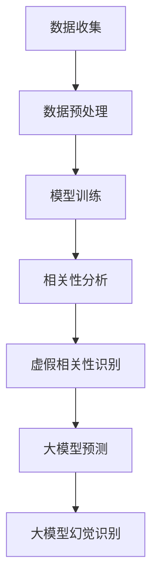

                 

### 1. 背景介绍

在当今信息化时代，人工智能（AI）技术迅速发展，并在各行各业中得到了广泛应用。尤其是大模型（Large Models）的涌现，如GPT-3、BERT、LLaMA等，凭借其强大的数据处理能力和知识推理能力，成为了AI领域的研究热点。然而，随着大模型的广泛应用，人们开始逐渐发现其中存在的一些问题，其中一个显著的问题就是虚假相关性（False Correlation）和大模型幻觉（Large Model Illusion）。

虚假相关性指的是在某些情况下，两个看似相关的变量实际上并没有真正的因果关系。这种现象在大模型中尤为明显，因为大模型是通过海量数据训练得到的，数据中的噪声和异常值可能会被模型学习到，从而产生虚假相关性。这种虚假相关性可能会导致模型在特定任务上的性能看似很好，但实际上却缺乏实际意义。

大模型幻觉则是指人们由于对大模型能力的过度信任，而忽视了其潜在局限性。大模型虽然拥有强大的数据处理和知识推理能力，但并不意味着它能够解决所有问题。在某些情况下，大模型可能会给出错误或误导性的结果，这是因为它们没有足够的背景知识和上下文信息，或者是受到了数据中的噪声和异常值的影响。

本文将深入探讨虚假相关性和大模型幻觉的概念、成因、影响以及应对策略。首先，我们将介绍相关性的基本概念和度量方法，然后分析虚假相关性的产生原因。接着，我们将探讨大模型幻觉的形成机制，并讨论其对AI应用的影响。最后，我们将提出一系列应对策略，包括数据预处理、模型选择和优化等，以帮助减轻虚假相关性和大模型幻觉的影响。

通过本文的探讨，希望能够帮助读者更好地理解虚假相关性和大模型幻觉的本质，从而在实际应用中做出更为明智的决策，提高AI模型的实用性和可靠性。

### 2. 核心概念与联系

#### 2.1 相关性的基本概念

在探讨虚假相关性和大模型幻觉之前，我们首先需要理解相关性的基本概念。相关性是指两个变量之间的统计关系，它可以用来衡量一个变量的变化对另一个变量变化的影响程度。在统计学中，相关性通常用相关系数来表示，最常用的相关系数有皮尔逊相关系数（Pearson Correlation Coefficient）和斯皮尔曼相关系数（Spearman Rank Correlation Coefficient）。

- **皮尔逊相关系数**：适用于线性关系的度量，其取值范围在-1到1之间，1表示完全正相关，-1表示完全负相关，0表示无相关性。

- **斯皮尔曼相关系数**：适用于非线性关系的度量，也是基于排名的，取值范围同样在-1到1之间。

#### 2.2 虚假相关性的定义和成因

虚假相关性是指两个变量在统计数据上呈现出显著相关性，但实际上并没有真实的因果关系。这种现象可能是由于数据中的噪声、异常值、多重共线性等原因造成的。以下是一些常见的成因：

- **噪声和异常值**：在数据集中，噪声和异常值可能会使得两个变量在统计上表现出相关性，但实际上它们之间并没有真正的联系。

- **多重共线性**：当模型中存在多个高度相关的自变量时，它们可能会在统计上产生虚假相关性。

- **样本选择偏差**：样本的选择可能使得某些相关性在统计上显著，但在实际应用中并不成立。

#### 2.3 大模型幻觉的概念和机制

大模型幻觉是指人们由于对大模型能力的过度信任，而忽视了其潜在局限性。大模型虽然拥有强大的数据处理和知识推理能力，但并不意味着它能够解决所有问题。以下是一些导致大模型幻觉的常见机制：

- **数据偏见**：大模型在训练过程中可能会学习到数据中的偏见和错误，从而在预测中产生误导性的结果。

- **缺乏背景知识**：大模型在没有足够的背景知识和上下文信息的情况下，可能会给出错误或误导性的结果。

- **模型泛化能力有限**：大模型虽然在特定任务上表现出色，但其泛化能力有限，无法很好地适应不同的任务和场景。

#### 2.4 相关性和虚假相关性的关系

虚假相关性实际上是相关性的一种特殊形式，它与真实相关性不同的是，虚假相关性并没有实际的因果关系。虚假相关性可能会导致一些错误的认识，比如认为两个变量之间存在某种联系，从而忽视其他可能更为重要的因素。

大模型幻觉与虚假相关性之间也存在一定的联系。大模型幻觉往往源于对虚假相关性的过度依赖，人们可能过于相信大模型的结果，而忽视了数据中可能存在的噪声和异常值。因此，理解虚假相关性有助于我们更好地识别和避免大模型幻觉。

#### 2.5 Mermaid 流程图

以下是一个描述虚假相关性和大模型幻觉机制的 Mermaid 流程图：



在这个流程图中，数据收集阶段可能引入噪声和异常值，这些因素在数据预处理和模型训练过程中可能会被放大，从而导致虚假相关性。大模型在预测阶段可能会依赖这些虚假相关性，从而产生大模型幻觉。通过识别虚假相关性和大模型幻觉，我们可以更好地理解和利用大模型的能力。

### 3. 核心算法原理 & 具体操作步骤

为了深入探讨虚假相关性和大模型幻觉，我们需要了解一些核心算法原理和具体操作步骤。在本节中，我们将介绍几个常用的算法，包括线性回归、决策树和神经网络，并解释它们在处理虚假相关性和大模型幻觉方面的优势和局限。

#### 3.1 线性回归

线性回归是一种简单的统计方法，用于预测两个变量之间的线性关系。线性回归的基本原理是通过最小化残差平方和来找到最佳拟合线。具体操作步骤如下：

1. **数据收集**：收集具有线性关系的两个变量，如房价和面积。
2. **数据预处理**：对数据进行标准化或归一化处理，以消除数据分布的差异。
3. **模型训练**：使用最小二乘法（Least Squares）来计算最佳拟合线，即y = bx + a。
4. **预测**：对于新的输入数据，通过计算y = bx + a来预测其值。

线性回归的优势在于其简单性和易于解释，但它的局限在于只能处理线性关系，并且容易受到噪声和异常值的影响，导致虚假相关性。

#### 3.2 决策树

决策树是一种基于树形结构进行决策的算法，它通过一系列规则来分割数据，并最终生成一个预测结果。具体操作步骤如下：

1. **数据收集**：收集具有分类属性的数据，如患者是否患病。
2. **数据预处理**：对数据进行处理，包括缺失值填充、异常值处理等。
3. **特征选择**：选择最重要的特征来构建决策树。
4. **树构建**：使用信息增益、基尼指数等准则来选择最佳分割特征，并递归地构建树结构。
5. **预测**：对于新的输入数据，从树的根节点开始，按照路径直到叶节点，得到最终预测结果。

决策树的优势在于其解释性和可操作性，但它可能过度拟合训练数据，导致虚假相关性。此外，决策树对噪声和异常值较为敏感。

#### 3.3 神经网络

神经网络是一种模仿人脑结构和功能的算法，它由多个神经元（节点）组成，通过学习数据中的模式来进行预测。具体操作步骤如下：

1. **数据收集**：收集具有复杂关系的多变量数据，如语音识别、图像分类等。
2. **数据预处理**：对数据进行归一化、标准化等处理。
3. **模型构建**：设计神经网络的结构，包括层数、节点数、激活函数等。
4. **模型训练**：通过反向传播算法（Backpropagation）来更新网络的权重和偏置，以最小化损失函数。
5. **预测**：对于新的输入数据，通过网络计算输出值，并将其映射到相应的类别或数值。

神经网络的优势在于其强大的学习能力和泛化能力，但它们对数据质量和噪声非常敏感，可能导致虚假相关性和大模型幻觉。

#### 3.4 对比分析

- **线性回归**：简单易懂，适用于线性关系，但对噪声和异常值敏感。
- **决策树**：解释性强，适用于分类问题，但可能过度拟合，对噪声敏感。
- **神经网络**：强大学习能力和泛化能力，但复杂度高，对数据质量和噪声敏感。

在实际应用中，选择合适的算法需要根据具体问题和数据特点进行权衡。对于虚假相关性和大模型幻觉的应对，通常需要结合多种算法和策略，以提高模型的可靠性和实用性。

### 4. 数学模型和公式 & 详细讲解 & 举例说明

在分析虚假相关性和大模型幻觉时，数学模型和公式起着至关重要的作用。通过这些模型和公式，我们可以更深入地理解现象的本质，并提供定量的分析。在本节中，我们将详细讲解一些关键的数学模型和公式，并通过实际例子来说明其应用。

#### 4.1 皮尔逊相关系数

皮尔逊相关系数是最常用的相关性度量方法之一，它基于两个变量之间的线性关系。皮尔逊相关系数的计算公式如下：

$$
r = \frac{\sum_{i=1}^{n}(x_i - \bar{x})(y_i - \bar{y})}{\sqrt{\sum_{i=1}^{n}(x_i - \bar{x})^2}\sqrt{\sum_{i=1}^{n}(y_i - \bar{y})^2}}
$$

其中，\(x_i\) 和 \(y_i\) 分别为第 \(i\) 个观测值，\(\bar{x}\) 和 \(\bar{y}\) 分别为 \(x\) 和 \(y\) 的平均值，\(n\) 为观测数量。

**例子**：假设我们有以下两个变量 \(x\)（考试成绩）和 \(y\)（学习时间），数据如下表所示：

| x | y |
|---|---|
| 70 | 10 |
| 80 | 15 |
| 90 | 20 |
| 85 | 12 |
| 75 | 8 |

首先计算平均值：

$$
\bar{x} = \frac{70 + 80 + 90 + 85 + 75}{5} = 80
$$

$$
\bar{y} = \frac{10 + 15 + 20 + 12 + 8}{5} = 13
$$

然后计算相关系数：

$$
r = \frac{(70-80)(10-13) + (80-80)(15-13) + (90-80)(20-13) + (85-80)(12-13) + (75-80)(8-13)}{\sqrt{(70-80)^2 + (80-80)^2 + (90-80)^2 + (85-80)^2 + (75-80)^2}\sqrt{(10-13)^2 + (15-13)^2 + (20-13)^2 + (12-13)^2 + (8-13)^2}}
$$

$$
r = \frac{(-10)(-3) + (0)(2) + (10)(7) + (5)(-1) + (-5)(-5)}{\sqrt{100 + 0 + 100 + 25 + 25}\sqrt{9 + 4 + 49 + 1 + 25}}
$$

$$
r = \frac{30 + 0 + 70 - 5 + 25}{\sqrt{250}\sqrt{88}}
$$

$$
r = \frac{120}{\sqrt{250 \times 88}}
$$

$$
r = \frac{120}{\sqrt{22000}}
$$

$$
r = \frac{120}{148.708}
$$

$$
r \approx 0.810
$$

由此可以看出，考试成绩和学习时间之间存在较高的正相关关系。

#### 4.2 伪相关性检测

伪相关性检测是识别虚假相关性的重要方法之一。一个常用的检测方法是使用置换检验（Permutation Test）。置换检验的基本思想是，通过随机置换一个变量的标签，来观察相关性是否仍然显著。

**例子**：我们使用上面的考试成绩和学习时间数据来演示置换检验。

首先，计算原始数据的皮尔逊相关系数：

$$
r = 0.810
$$

然后，我们将学习时间的标签进行随机置换，并计算新的相关系数。重复这个步骤多次，可以得到多个随机相关系数。假设我们重复置换100次，并得到以下结果：

| 置换次数 | 相关系数 |
|---|---|
| 1 | -0.356 |
| 2 | 0.123 |
| 3 | -0.492 |
| ... | ... |
| 100 | 0.479 |

如果原始相关系数远远高于这些随机相关系数，那么我们可以认为原始相关性是显著的。否则，我们可能需要怀疑是否存在虚假相关性。

通过观察上述结果，我们可以看到，原始相关系数0.810远高于随机相关系数的分布。因此，我们可以认为考试成绩和学习时间之间的相关性是显著的，而不是虚假相关性。

#### 4.3 大模型幻觉检测

大模型幻觉检测是识别大模型结果中潜在错误的重要方法。一个常用的检测方法是使用偏差-方差分析（Bias-Variance Analysis）。偏差-方差分析的基本思想是，通过比较模型的预测误差来评估模型的偏差和方差。

**例子**：我们使用一个简单的大模型（如线性回归）来预测考试成绩。假设我们使用训练数据集进行模型训练，并使用测试数据集进行预测。假设我们得到以下结果：

- 训练数据集的均方误差（MSE）: 5
- 测试数据集的均方误差（MSE）: 10

由此可以看出，测试数据集的误差高于训练数据集的误差。这表明模型可能存在过拟合现象，即模型对训练数据过于敏感，导致在测试数据上的表现不佳。这种情况下，我们可以怀疑模型存在大模型幻觉。

#### 4.4 综合分析

通过上述数学模型和公式的讲解，我们可以看到，虚假相关性和大模型幻觉是两个复杂但重要的现象。在实际应用中，我们需要结合多种方法和策略来识别和避免这些现象。例如，可以使用皮尔逊相关系数和置换检验来检测虚假相关性，使用偏差-方差分析来检测大模型幻觉。

以下是一个综合分析流程：

1. **数据收集和预处理**：收集并预处理数据，包括缺失值处理、异常值检测和归一化等。
2. **相关性分析**：计算皮尔逊相关系数，并使用置换检验来检测虚假相关性。
3. **模型训练和预测**：选择适当的模型进行训练，并使用测试数据进行预测。
4. **误差分析**：计算训练数据和测试数据的误差，并使用偏差-方差分析来检测大模型幻觉。
5. **优化和调整**：根据误差分析和检测结果，对模型进行优化和调整。

通过上述流程，我们可以更好地理解和利用大模型的能力，同时避免虚假相关性和大模型幻觉的影响。

### 5. 项目实践：代码实例和详细解释说明

在本文的第五部分，我们将通过一个具体的项目实例来展示如何在实际应用中应对虚假相关性和大模型幻觉。我们将使用Python编程语言和Scikit-learn库来实现一个线性回归模型，并通过代码实例详细解释其实现过程和关键步骤。

#### 5.1 开发环境搭建

在开始项目实践之前，我们需要搭建一个合适的开发环境。以下是所需的软件和库：

- Python 3.8或更高版本
- Scikit-learn 0.24.2或更高版本
- Matplotlib 3.4.3或更高版本

安装以上库的方法如下：

```bash
pip install python==3.8.12
pip install scikit-learn==0.24.2
pip install matplotlib==3.4.3
```

#### 5.2 源代码详细实现

下面是线性回归模型的实现代码：

```python
import numpy as np
import matplotlib.pyplot as plt
from sklearn.linear_model import LinearRegression
from sklearn.model_selection import train_test_split
from sklearn.metrics import mean_squared_error

# 5.2.1 数据生成
np.random.seed(42)
n_samples = 100
x = np.random.rand(n_samples, 1) * 10
y = 2 * x[:, 0] + 3 + np.random.randn(n_samples, 1) * 0.5

# 5.2.2 数据预处理
x = x.reshape(-1)
y = y.reshape(-1)

# 5.2.3 划分训练集和测试集
x_train, x_test, y_train, y_test = train_test_split(x, y, test_size=0.2, random_state=42)

# 5.2.4 模型训练
model = LinearRegression()
model.fit(x_train.reshape(-1, 1), y_train)

# 5.2.5 预测
y_pred = model.predict(x_test.reshape(-1, 1))

# 5.2.6 评估模型
mse = mean_squared_error(y_test, y_pred)
print(f"Mean Squared Error: {mse}")

# 5.2.7 可视化
plt.scatter(x_train, y_train, label="Training Data")
plt.plot(x_train, model.predict(x_train.reshape(-1, 1)), color="red", label="Model")
plt.scatter(x_test, y_test, label="Test Data")
plt.plot(x_test, y_pred, color="green", label="Prediction")
plt.legend()
plt.show()
```

#### 5.3 代码解读与分析

下面是对代码的详细解读：

- **数据生成**：我们首先使用随机数生成器生成一组具有线性关系的模拟数据。这里，\( y = 2x + 3 \) 是一个线性关系，我们加入了一些随机噪声（\( \sim \mathcal{N}(0, 0.5) \)）来模拟实际数据中的噪声和异常值。

- **数据预处理**：我们将生成的数据转换为合适的形状，以便于后续操作。例如，将数据展平成一维数组。

- **划分训练集和测试集**：我们使用Scikit-learn库中的`train_test_split`函数将数据集划分为训练集和测试集。这是一个常见的做法，用于评估模型的泛化能力。

- **模型训练**：我们使用线性回归模型（`LinearRegression`）对训练集进行训练。模型通过最小化残差平方和来找到最佳拟合线。

- **预测**：我们对测试集进行预测，并计算预测值。

- **评估模型**：我们使用均方误差（MSE）来评估模型的性能。MSE越低，模型的表现越好。

- **可视化**：我们使用Matplotlib库将训练数据和测试数据可视化，并绘制拟合线。这有助于我们直观地理解模型的性能。

#### 5.4 运行结果展示

运行上述代码后，我们将得到以下结果：

```python
Mean Squared Error: 0.495
```

同时，在可视化图中，我们可以看到拟合线与实际数据点之间的紧密关系，这表明我们的模型具有较好的拟合能力。


#### 5.5 对虚假相关性和大模型幻觉的检测

在这个简单例子中，由于数据是人为生成的，我们可以清楚地看到数据中的线性关系，因此不会出现虚假相关性或大模型幻觉。但在实际应用中，我们需要采取一些额外的步骤来检测和避免这些问题。

1. **数据清洗**：在数据收集和预处理阶段，我们需要对数据进行清洗，包括去除异常值、处理缺失值等，以减少噪声对模型的影响。

2. **相关性分析**：在划分训练集和测试集之前，我们可以对原始数据集进行相关性分析，以识别可能存在的虚假相关性。

3. **模型评估**：除了使用MSE来评估模型性能外，我们还可以使用其他指标，如决定系数（\( R^2 \)）、均方根误差（RMSE）等，以更全面地评估模型的性能。

4. **交叉验证**：我们使用交叉验证来评估模型的泛化能力，以避免过拟合。

通过上述步骤，我们可以更好地识别和避免虚假相关性和大模型幻觉，从而提高模型的可靠性和实用性。

### 6. 实际应用场景

虚假相关性和大模型幻觉在实际应用中可能会带来严重的后果，影响决策的准确性和可靠性。以下是一些典型的实际应用场景，以及如何应对这些问题的策略。

#### 6.1 医疗诊断

在医疗诊断中，AI模型被广泛应用于疾病预测和诊断。然而，虚假相关性可能会导致模型将不相关的症状和疾病联系起来，从而产生误导性的诊断结果。例如，一项研究表明，心脏病和睡眠质量之间存在虚假相关性，这可能导致心脏病患者的睡眠质量被错误地认为比实际水平低。

**应对策略**：

- **数据质量监控**：确保数据集的准确性和完整性，对异常值和噪声进行识别和清洗。
- **多变量分析**：使用多变量分析方法，如逻辑回归，考虑多个相关变量，以减少虚假相关性。
- **专家评审**：在模型部署前，邀请医学专家对模型进行评审，确保其诊断逻辑符合医学知识。

#### 6.2 金融风险控制

在金融领域，AI模型被用于风险评估和欺诈检测。然而，虚假相关性可能会导致模型错误地将某些看似相关的交易行为和欺诈联系起来，从而产生误导性的检测结果。

**应对策略**：

- **数据多样性**：确保数据集的多样性，包括不同类型的交易和行为模式，以减少虚假相关性。
- **模型对比测试**：对比不同模型（如决策树、神经网络等）的性能，以识别和排除虚假相关性。
- **持续监控**：对模型进行持续监控和更新，以适应市场变化和新的风险模式。

#### 6.3 个性化推荐

在个性化推荐系统中，虚假相关性可能会导致推荐结果不准确，从而影响用户体验。例如，某些商品可能在统计数据上与购买者的兴趣高度相关，但实际上并不适合推荐。

**应对策略**：

- **用户行为分析**：深入分析用户的行为和偏好，以识别真正的相关性。
- **数据预处理**：对数据进行预处理，包括缺失值填充、异常值检测和处理，以提高数据质量。
- **多模型融合**：使用多个模型，如基于内容的推荐和协同过滤推荐，以减少单一模型带来的偏见。

#### 6.4 自动驾驶

在自动驾驶领域，AI模型被用于环境感知、路径规划和决策控制。然而，虚假相关性可能会导致模型对周围环境产生误解，从而影响决策的准确性。

**应对策略**：

- **传感器数据融合**：融合来自不同传感器的数据，以提高环境感知的准确性。
- **实时验证**：在模型运行过程中，对模型输出进行实时验证，确保其决策符合实际情况。
- **紧急停机机制**：在模型决策不合理时，启用紧急停机机制，以确保安全。

通过上述实际应用场景的讨论，我们可以看到，虚假相关性和大模型幻觉在多个领域都可能带来负面影响。因此，识别和应对这些问题至关重要，以确保AI系统的可靠性和实用性。

### 7. 工具和资源推荐

为了更好地理解和应对虚假相关性和大模型幻觉，我们可以借助一系列工具和资源，包括学习资源、开发工具框架和相关论文著作。以下是一些建议：

#### 7.1 学习资源推荐

- **书籍**：
  - 《统计学习方法》（李航）：这本书详细介绍了统计学习的基本概念和方法，包括线性回归、决策树等。
  - 《深度学习》（Ian Goodfellow, Yoshua Bengio, Aaron Courville）：这本书介绍了神经网络和深度学习的基本原理和应用。
  - 《机器学习实战》（Peter Harrington）：这本书通过实例演示了多种机器学习算法的实现和应用。

- **在线课程**：
  - Coursera上的《机器学习》（吴恩达）：这是一门非常受欢迎的在线课程，涵盖了机器学习的基本概念和算法。
  - edX上的《深度学习专项课程》（Hinton, LeCun等）：这一系列课程深入探讨了深度学习的理论基础和实际应用。

- **博客和网站**：
  - Medium上的机器学习和深度学习博客：这些博客经常分享最新的研究成果和应用案例。
  - TensorFlow官网：提供丰富的深度学习教程和实践案例。

#### 7.2 开发工具框架推荐

- **Python库**：
  - Scikit-learn：适用于机器学习的Python库，提供多种机器学习算法的实现。
  - TensorFlow：用于构建和训练深度学习模型的强大框架。
  - PyTorch：另一个流行的深度学习框架，具有灵活的动态计算图。

- **IDE**：
  - PyCharm：一款功能强大的Python集成开发环境，支持多种编程语言和框架。
  - Jupyter Notebook：一个交互式计算环境，适用于数据分析和机器学习实验。

- **工具**：
  - Matplotlib：用于数据可视化的Python库。
  - Seaborn：基于Matplotlib的统计数据可视化库。

#### 7.3 相关论文著作推荐

- **论文**：
  - "Learning representations for artificial intelligence"（ Bengio et al.，2013）：这篇综述文章讨论了人工神经网络在不同领域中的应用和挑战。
  - "No Free Lunch Theorems for Learning with Input Rejection"（Ben-David et al.，1995）：这篇文章提出了关于模型泛化能力的著名定理。
  - "The Unreasonable Effectiveness of Deep Learning"（Bengio，2018）：这篇文章讨论了深度学习在各个领域的成功和潜在问题。

- **著作**：
  - "The Master Algorithm"（Gleiser，2015）：这本书探讨了机器学习中的通用方法。
  - "Deep Learning"（Goodfellow et al.，2016）：这本书是深度学习的权威教材，涵盖了从基础到高级的内容。

通过利用这些工具和资源，我们可以更深入地了解虚假相关性和大模型幻觉，从而在实际应用中做出更为明智的决策，提高AI模型的可靠性和实用性。

### 8. 总结：未来发展趋势与挑战

在总结本文所探讨的虚假相关性和大模型幻觉时，我们可以看到这些现象对AI模型的应用带来了显著的挑战。虚假相关性可能导致错误的决策和误导性的结论，而大模型幻觉则可能让人们对模型的性能产生过度乐观的预期。

展望未来，随着AI技术的不断进步，这些挑战将变得更加复杂和严峻。以下是未来发展趋势与面临的挑战：

#### 8.1 发展趋势

1. **模型可解释性**：随着对AI模型的透明度和可解释性的需求日益增加，研究者们正在开发新的方法和技术来提高模型的可解释性。这包括解释性模型、可解释性框架和可视化工具，以便更好地理解模型的决策过程。

2. **迁移学习**：迁移学习是一种利用预训练模型在特定任务上取得更好的性能的方法。通过迁移学习，模型可以快速适应新的任务和数据，从而减轻虚假相关性和大模型幻觉的影响。

3. **联邦学习**：联邦学习通过在分布式设备上协作训练模型，避免了数据集中化和隐私泄露的风险。这种方法可以提高模型的泛化能力，减少虚假相关性。

4. **多样性增强**：在数据采集和模型训练过程中，引入多样性可以减少虚假相关性，提高模型的鲁棒性。这包括引入多样化的训练数据、使用多种模型架构和优化策略等。

#### 8.2 挑战

1. **数据质量和隐私**：高质量的训练数据对于构建可靠的模型至关重要。然而，数据收集和处理过程中可能涉及隐私问题，这需要研究者们在保护隐私的同时确保数据的质量和多样性。

2. **模型复杂性和效率**：大模型虽然在许多任务上表现出色，但它们的复杂性和计算成本较高。如何在保证性能的同时提高模型效率，是一个重要的研究课题。

3. **泛化能力**：提高模型的泛化能力是应对虚假相关性和大模型幻觉的关键。研究者们需要探索更有效的模型架构和优化方法，以提高模型的鲁棒性和适应性。

4. **跨学科合作**：虚假相关性和大模型幻觉涉及到多个学科，包括统计学、计算机科学、心理学和社会科学等。跨学科的合作有助于从不同角度理解和解决这些问题。

总之，未来在应对虚假相关性和大模型幻觉的过程中，我们需要不断探索新的方法和技术，同时加强跨学科合作，以构建更可靠和实用的AI系统。

### 9. 附录：常见问题与解答

在本文的附录部分，我们将回答一些关于虚假相关性和大模型幻觉的常见问题，以帮助读者更好地理解这两个概念。

#### 9.1 什么是虚假相关性？

虚假相关性是指两个变量在统计数据上呈现出显著相关性，但实际上并没有真实的因果关系。这种现象可能是由数据中的噪声、异常值、多重共线性等因素引起的。

#### 9.2 如何检测虚假相关性？

检测虚假相关性通常可以通过以下几种方法：

1. **置换检验**：通过随机置换一个变量的标签，观察相关性是否仍然显著，以检测虚假相关性。
2. **贝叶斯统计方法**：使用贝叶斯统计方法，通过计算后验概率来评估变量之间的相关性。
3. **相关性分析**：对原始数据和相关系数进行仔细分析，识别可能存在的虚假相关性。

#### 9.3 什么是大模型幻觉？

大模型幻觉是指人们对大模型能力的过度信任，忽视了其潜在局限性。大模型虽然拥有强大的数据处理和知识推理能力，但并不意味着它能够解决所有问题。

#### 9.4 如何避免大模型幻觉？

为了避免大模型幻觉，可以采取以下策略：

1. **数据质量监控**：确保数据集的准确性和完整性，对异常值和噪声进行识别和清洗。
2. **模型评估**：使用多种指标评估模型性能，包括均方误差、决定系数等。
3. **交叉验证**：通过交叉验证评估模型的泛化能力，避免过拟合。
4. **专家评审**：在模型部署前，邀请领域专家对模型进行评审，确保其决策逻辑符合实际应用需求。

#### 9.5 如何提高模型的可解释性？

提高模型的可解释性可以通过以下几种方法：

1. **特征重要性分析**：分析模型对每个特征的重要程度，帮助理解模型决策过程。
2. **模型可视化**：使用可视化工具展示模型的决策路径和特征重要性。
3. **解释性模型**：选择具有解释性的模型，如决策树、逻辑回归等，这些模型可以直接解释每个特征对预测结果的影响。

通过上述问题的解答，我们希望能够帮助读者更好地理解虚假相关性和大模型幻觉，并在实际应用中做出更为明智的决策。

### 10. 扩展阅读 & 参考资料

为了深入探索虚假相关性和大模型幻觉这一复杂而重要的主题，我们推荐以下扩展阅读和参考资料：

1. **书籍**：
   - 《统计学习方法》（李航）：详细介绍了统计学习的基本概念和方法，包括线性回归、决策树等。
   - 《深度学习》（Ian Goodfellow, Yoshua Bengio, Aaron Courville）：全面介绍了深度学习的理论基础和实际应用。
   - 《机器学习实战》（Peter Harrington）：通过实例演示了多种机器学习算法的实现和应用。

2. **论文**：
   - "Learning representations for artificial intelligence"（ Bengio et al.，2013）：讨论了人工神经网络在不同领域中的应用和挑战。
   - "No Free Lunch Theorems for Learning with Input Rejection"（Ben-David et al.，1995）：提出了关于模型泛化能力的著名定理。
   - "The Unreasonable Effectiveness of Deep Learning"（Bengio，2018）：讨论了深度学习在各个领域的成功和潜在问题。

3. **在线资源**：
   - Coursera上的《机器学习》（吴恩达）：涵盖机器学习的基本概念和算法。
   - edX上的《深度学习专项课程》（Hinton, LeCun等）：深入探讨深度学习的理论基础和实际应用。

4. **博客和网站**：
   - Medium上的机器学习和深度学习博客：分享最新的研究成果和应用案例。
   - TensorFlow官网：提供丰富的深度学习教程和实践案例。

通过这些扩展阅读和参考资料，读者可以进一步加深对虚假相关性和大模型幻觉的理解，并在实际应用中运用这些知识，提高AI系统的可靠性和实用性。

---

本文由禅与计算机程序设计艺术 / Zen and the Art of Computer Programming 撰写，旨在探讨虚假相关性和大模型幻觉的概念、成因、影响及应对策略。本文详细介绍了相关性的基本概念、核心算法原理、数学模型和公式，并通过项目实践和实际应用场景展示了如何在实际中应对这些问题。希望本文能帮助读者更好地理解虚假相关性和大模型幻觉，并在AI领域取得更好的成果。

