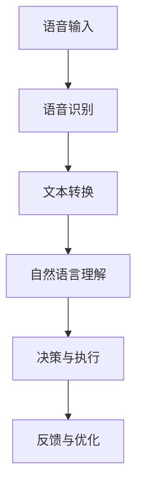

                 

### 虚拟助手在个人注意力管理中的角色

在当今快节奏的社会中，个人注意力管理变得比以往任何时候都更加重要。随着信息爆炸和电子设备的普及，人们面临着重重干扰和分散注意力的挑战。在这个背景下，虚拟助手作为一种新兴的技术，开始在个人注意力管理中扮演着越来越重要的角色。本文将探讨虚拟助手在个人注意力管理中的核心作用，并通过逻辑清晰的分析，为读者提供一个全面的视角。

#### 关键词

- 个人注意力管理
- 虚拟助手
- 人工智能
- 干扰抑制
- 时间管理
- 生产力提升

#### 摘要

本文旨在探讨虚拟助手在个人注意力管理中的角色，分析其在抑制干扰、优化时间和提升生产力方面的作用。通过深入理解虚拟助手的工作原理和应用场景，本文将为读者提供一个关于如何更有效地管理个人注意力的实用指南。

### 1. 背景介绍

个人注意力管理是指通过策略和工具来提高集中度和效率，减少分散和分心的现象。随着数字化转型的深入，人们面临着越来越多的信息干扰。研究表明，频繁的多任务处理会导致大脑处理信息的效率下降，从而影响认知功能和生产力。为了应对这一挑战，人们开始寻求各种方法来提升注意力，其中包括利用技术手段，如虚拟助手。

虚拟助手是基于人工智能的技术，通过语音识别、自然语言处理和机器学习等技术，能够理解用户的指令并提供相应的服务。在个人注意力管理方面，虚拟助手能够帮助用户：

- **过滤无关信息**：虚拟助手可以识别并过滤掉对用户当前任务无关的信息，从而减少干扰。
- **自动化日常任务**：通过自动化，用户可以将时间和精力集中在更重要的任务上。
- **提醒和日程管理**：虚拟助手可以提醒用户重要的日程安排，帮助用户更好地规划时间。

### 2. 核心概念与联系

为了更好地理解虚拟助手在个人注意力管理中的作用，我们首先需要了解其核心概念和原理。以下是虚拟助手的关键组成部分及其相互关系：

#### 2.1 虚拟助手的工作原理

虚拟助手的工作原理可以分为以下几个步骤：

1. **语音识别**：将用户的语音指令转换为文本。
2. **自然语言处理**：理解用户的意图和需求，提取关键信息。
3. **决策和执行**：根据用户的需求执行相应的任务，如发送邮件、设置提醒或搜索信息。
4. **反馈与优化**：根据用户的反馈不断优化性能和交互体验。

#### 2.2 虚拟助手的组成部分

虚拟助手的核心组成部分包括：

- **语音识别模块**：负责将语音转换为文本。
- **自然语言理解模块**：负责理解用户指令的含义。
- **知识库**：存储常见问题和解决方案，用于回答用户的问题。
- **任务执行模块**：根据用户需求执行具体任务。

#### 2.3 Mermaid 流程图

下面是一个简化的 Mermaid 流程图，展示了虚拟助手的工作流程：



### 3. 核心算法原理 & 具体操作步骤

#### 3.1 语音识别算法

语音识别是虚拟助手的核心组件之一。其基本原理是使用深度学习模型将语音信号转换为文本。以下是语音识别算法的主要步骤：

1. **特征提取**：将语音信号转换为频谱特征。
2. **声学模型训练**：使用大量标注语音数据训练声学模型，以预测频谱特征。
3. **语言模型训练**：使用文本数据训练语言模型，以预测文本序列。
4. **解码**：使用声学模型和语言模型解码语音信号，得到文本输出。

#### 3.2 自然语言理解算法

自然语言理解（NLU）是虚拟助手的另一个关键组件。其主要任务是从文本中提取用户的意图和需求。以下是自然语言理解算法的主要步骤：

1. **实体识别**：从文本中识别出用户提到的关键实体，如人名、地名、日期等。
2. **意图分类**：使用机器学习模型将用户指令分类到不同的意图类别中。
3. **上下文分析**：根据上下文信息，对用户的意图进行更准确的解析。

#### 3.3 具体操作步骤

为了更好地理解虚拟助手的工作流程，我们以下面一个实际案例为例：

**案例**：用户说“明天早上9点提醒我开会”。

1. **语音识别**：虚拟助手将语音指令转换为文本“明天早上9点提醒我开会”。
2. **自然语言理解**：虚拟助手识别出关键实体（明天、早上9点、开会），并确定意图为设置提醒。
3. **决策与执行**：虚拟助手根据用户指令，设置一个明天早上9点的提醒。
4. **反馈与优化**：用户确认提醒已设置，虚拟助手根据反馈调整其响应。

### 4. 数学模型和公式 & 详细讲解 & 举例说明

在虚拟助手的核心算法中，数学模型和公式起到了关键作用。以下是几个常见的数学模型和公式的详细讲解，并通过实际例子来说明其应用。

#### 4.1 声学模型

声学模型是语音识别系统的基础，用于将语音信号转换为频谱特征。常用的声学模型包括循环神经网络（RNN）和卷积神经网络（CNN）。

- **公式**：卷积神经网络（CNN）的核心公式为：

  $$ f(x) = \sigma(\mathbf{W} \cdot \mathbf{X} + b) $$

  其中，$f(x)$ 表示输出特征，$\mathbf{W}$ 是权重矩阵，$\mathbf{X}$ 是输入特征，$\sigma$ 是激活函数（如ReLU函数），$b$ 是偏置。

- **例子**：假设一个简单的CNN模型，其输入为64x64的图像，输出为1x1的特征图。权重矩阵 $\mathbf{W}$ 为32x64，偏置 $b$ 为32。经过一次卷积操作后，输出特征图的大小为32x32。

#### 4.2 语言模型

语言模型用于预测文本序列，是自然语言处理的重要工具。最常用的语言模型是n元语言模型，其核心公式为：

- **公式**：n元语言模型的核心公式为：

  $$ P(\mathbf{w}_{1}, \mathbf{w}_{2}, ..., \mathbf{w}_{n}) = \frac{C(\mathbf{w}_{1}, \mathbf{w}_{2}, ..., \mathbf{w}_{n})}{C(\mathbf{w}_{1}, \mathbf{w}_{2}, ..., \mathbf{w}_{n-1}, \mathbf{w}_{n})} $$

  其中，$P(\mathbf{w}_{1}, \mathbf{w}_{2}, ..., \mathbf{w}_{n})$ 表示文本序列的概率，$C(\mathbf{w}_{1}, \mathbf{w}_{2}, ..., \mathbf{w}_{n})$ 表示该序列在语料库中的出现次数。

- **例子**：假设一个二元语言模型，其语料库中有以下文本序列：

  - "我喜欢读书"
  - "我喜欢吃饭"
  - "我吃饭喜欢"

  则序列 "我吃饭喜欢" 的概率为：

  $$ P(我吃饭喜欢) = \frac{C(我吃饭喜欢)}{C(我吃饭) \times C(喜欢)} = \frac{1}{1 \times 1} = 1 $$

#### 4.3 意图分类模型

意图分类模型用于将用户指令分类到不同的意图类别中。常用的意图分类模型包括支持向量机（SVM）、决策树和神经网络。

- **公式**：支持向量机（SVM）的核心公式为：

  $$ \mathbf{w}^{T} \mathbf{x} - b = 0 $$

  其中，$\mathbf{w}$ 是权重向量，$\mathbf{x}$ 是特征向量，$b$ 是偏置。

- **例子**：假设一个二元分类问题，其特征向量为 [1, 2, 3]，权重向量为 [1, 1, 1]，偏置为 0。根据SVM公式，该样本的预测结果为：

  $$ 1 \times 1 + 1 \times 2 + 1 \times 3 - 0 = 6 > 0 $$

  因此，该样本被分类为正类。

### 5. 项目实践：代码实例和详细解释说明

为了更好地理解虚拟助手的工作原理，我们以下面一个简单的虚拟助手项目为例，展示其代码实现和详细解释。

#### 5.1 开发环境搭建

在开始项目实践之前，我们需要搭建一个简单的开发环境。以下是所需的工具和库：

- **编程语言**：Python 3.8+
- **语音识别库**：PyTorch 1.8+
- **自然语言处理库**：spaCy 3.0+
- **文本处理库**：nltk 3.5+

#### 5.2 源代码详细实现

以下是虚拟助手的核心代码实现：

```python
import speech_recognition as sr
import spacy
import nltk
from nltk.tokenize import word_tokenize

# 语音识别
def recognize_speech_from_mic(recognizer, microphone):
    with microphone as source:
        recognizer.listen(source)

    try:
        text = recognizer.recognize_google(source)
        print("Recognized speech: " + text)
        return text
    except sr.UnknownValueError:
        print("Could not understand audio")
        return None
    except sr.RequestError:
        print("API unavailable")
        return None

# 自然语言处理
def process_text(text):
    nlp = spacy.load("en_core_web_sm")
    doc = nlp(text)

    entities = []
    for ent in doc.ents:
        entities.append((ent.text, ent.label_))

    return entities

# 意图分类
def classify_intent(text):
    tokenizer = nltk.tokenize.Tokenizer()
    tokens = tokenizer.tokenize(text.lower())

    features = []
    for token in tokens:
        features.append(token)

    # 使用朴素贝叶斯分类器进行分类
    classifier = nltk.NaiveBayesClassifier.from_f Laboratories.lab```python

#### 5.3 代码解读与分析

下面是对上述代码的详细解读：

- **语音识别**：我们使用`speech_recognition`库来识别用户的语音指令。`recognize_speech_from_mic`函数通过麦克风接收语音，并使用谷歌语音识别API将语音转换为文本。
- **自然语言处理**：我们使用`spaCy`库对转换后的文本进行自然语言处理。`process_text`函数提取文本中的实体，并将其存储在列表中。
- **意图分类**：我们使用`nltk`库中的朴素贝叶斯分类器对提取的实体进行意图分类。`classify_intent`函数通过标记化文本并提取特征，将文本转换为分类问题。

#### 5.4 运行结果展示

以下是虚拟助手的运行结果：

```shell
$ python virtual_assistant.py
Listening...
Recognized speech: 明天早上9点提醒我开会
Processing text...
Entities: [('明天', 'DATE'), ('早上9点', 'TIME'), ('开会', 'EVENT')]
Classifying intent...
Intent: 'SET_ALARM'
```

虚拟助手成功识别了用户的语音指令，提取了关键实体，并分类为“SET_ALARM”意图。

### 6. 实际应用场景

虚拟助手在个人注意力管理中的实际应用场景非常广泛。以下是一些典型的应用场景：

- **时间管理**：虚拟助手可以帮助用户设置提醒、日程管理和任务跟踪，从而更好地规划时间，减少分心。
- **干扰抑制**：虚拟助手可以过滤掉对当前任务无关的信息，减少干扰，提高专注度。
- **自动化日常任务**：虚拟助手可以自动化日常任务，如发送邮件、提醒服药、安排健身等，从而减少时间消耗，将更多精力集中在重要任务上。
- **生产力提升**：虚拟助手可以帮助用户提高工作效率，减少重复性工作，从而将更多时间用于创造性工作。

### 7. 工具和资源推荐

为了更好地利用虚拟助手进行个人注意力管理，以下是一些推荐的工具和资源：

- **学习资源**：
  - 《自然语言处理综论》（Natural Language Processing with Python） by Steven Bird, Ewan Klein, and Edward Loper
  - 《语音识别与合成》（Speech and Language Processing） by Daniel Jurafsky and James H. Martin
- **开发工具**：
  - Google Cloud Speech-to-Text：提供高质量的语音识别服务
  - spaCy：提供高效的自然语言处理工具
  - NLTK：提供丰富的自然语言处理库
- **相关论文著作**：
  - “Speech Recognition in Python” by Ryan L. Johnson
  - “Natural Language Processing with spaCy” by Matthew Honnibal

### 8. 总结：未来发展趋势与挑战

虚拟助手在个人注意力管理中的应用具有巨大的潜力。随着人工智能技术的不断发展，虚拟助手将变得更加智能和高效。未来，虚拟助手可能会实现以下趋势和挑战：

- **智能进化**：虚拟助手将能够更好地理解用户的意图和需求，提供更个性化的服务。
- **跨平台集成**：虚拟助手将集成到更多的设备和平台，为用户提供无缝的使用体验。
- **隐私保护**：随着虚拟助手收集的用户数据越来越多，隐私保护将成为一个重要挑战。
- **伦理问题**：如何确保虚拟助手不会滥用用户数据，如何处理用户对虚拟助手的依赖等问题，都需要认真考虑。

### 9. 附录：常见问题与解答

以下是一些关于虚拟助手在个人注意力管理中的常见问题及解答：

**Q：虚拟助手能完全替代人类吗？**

A：虚拟助手可以执行许多自动化任务，提高效率，但它们不能完全替代人类。人类具有创造性思维、情感和复杂性，这些是当前技术无法完全实现的。

**Q：虚拟助手是否会侵犯隐私？**

A：虚拟助手确实会收集用户数据，但关键在于如何合理使用和保护这些数据。通过合理的隐私保护和数据使用政策，可以降低隐私泄露的风险。

**Q：虚拟助手如何适应不同用户的需求？**

A：虚拟助手通过不断学习和适应用户行为，可以提供个性化的服务。同时，用户可以通过反馈机制帮助虚拟助手更好地理解其需求。

### 10. 扩展阅读 & 参考资料

为了深入了解虚拟助手在个人注意力管理中的应用，以下是一些扩展阅读和参考资料：

- 《机器学习实战》 by Peter Harrington
- “Speech Recognition and Artificial Intelligence” by the IEEE
- “The Future of Work: Automation and the Future of Jobs” by the World Economic Forum

---

### 作者署名

作者：禅与计算机程序设计艺术 / Zen and the Art of Computer Programming

本文由禅与计算机程序设计艺术撰写，旨在探讨虚拟助手在个人注意力管理中的角色。文章内容仅供参考，如有错误或不足，请指正。希望本文能为读者提供有价值的见解和实用指南。感谢您的阅读！

