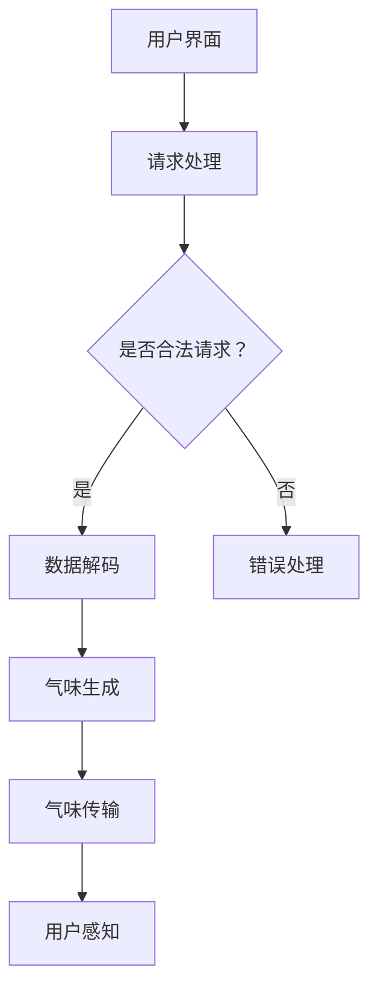

                 

### 1. 背景介绍

#### 什么是虚拟嗅觉景观

虚拟嗅觉景观，也称为虚拟气味体验，是一种通过技术手段模拟和再现真实气味环境的技术。这种技术利用计算机程序和电子设备，生成或模拟出各种气味，从而为用户提供一种身临其境的气味体验。虚拟嗅觉景观在多个领域都有广泛的应用，包括游戏、娱乐、医疗、教育和商业等。

#### 虚拟嗅觉景观的发展历程

虚拟嗅觉景观技术的发展始于20世纪90年代。当时，研究人员开始探索如何通过计算机程序和传感器技术模拟气味。最初的技术相对简单，只能模拟一些基本的气味。然而，随着科技的进步，虚拟嗅觉景观技术逐渐成熟，能够模拟出更加复杂和多变的气味。

在21世纪初，虚拟嗅觉景观开始在游戏和娱乐领域得到应用。例如，一些游戏设备能够通过内置的传感器和喷洒装置，在玩家玩游戏时释放特定的气味。这种技术不仅增加了游戏的沉浸感，还让玩家能够更好地体验游戏中的环境和情节。

近年来，虚拟嗅觉景观技术在医疗和康复领域也得到了应用。例如，研究人员利用虚拟嗅觉景观帮助患者减轻疼痛和焦虑，通过模拟特定气味的刺激来改善患者的情绪状态。

#### 当前虚拟嗅觉景观技术的现状

目前，虚拟嗅觉景观技术已经取得了一定的进展。市场上出现了一些虚拟嗅觉体验设备，如气味发生器和气味传感器。这些设备能够精确地控制气味的释放，为用户提供高质量的气味体验。

此外，研究人员还在探索新的技术，如虚拟现实（VR）和增强现实（AR）技术，将虚拟嗅觉景观与这些技术相结合，以提供更加真实和沉浸的气味体验。

然而，尽管虚拟嗅觉景观技术已经取得了一定的进展，但仍存在一些挑战和局限性。例如，气味的模拟和传输技术还需要进一步优化，以实现更真实和多样化的气味体验。此外，虚拟嗅觉景观的应用场景也需要进一步拓展，以适应更多领域和用户需求。

#### 虚拟嗅觉景观的重要性

虚拟嗅觉景观技术在多个领域都有重要的应用价值。在游戏和娱乐领域，虚拟嗅觉景观能够提高用户的沉浸感，增加游戏的趣味性和互动性。在医疗和康复领域，虚拟嗅觉景观可以帮助患者缓解疼痛和焦虑，改善情绪状态，从而提高康复效果。

此外，虚拟嗅觉景观技术在商业和教育领域也有广泛的应用前景。例如，在商业营销中，虚拟嗅觉景观可以用于创建独特的品牌体验，吸引消费者的注意力。在教育领域，虚拟嗅觉景观可以用于模拟实验室环境，提供更加真实的学习体验。

总之，虚拟嗅觉景观技术具有巨大的发展潜力，随着科技的不断进步，它将在更多领域得到广泛应用，为人类带来更加丰富和多样的感官体验。### 2. 核心概念与联系

#### 气味感知与处理原理

气味感知是人类感官体验中重要的一环。人类通过鼻腔内的嗅觉受体感知气味，这些受体能够识别不同的气味分子并传递信号到大脑。然而，计算机系统并没有直接的嗅觉功能，因此需要通过特定的算法和技术将气味信息数字化并模拟出来。

##### 气味数字化

气味数字化是虚拟嗅觉景观技术的第一步。在这个过程中，气味被表示为一系列的数字信号。这通常通过以下几个步骤完成：

1. **气味采样**：通过特殊的采样设备，如气相色谱-质谱联用仪（GC-MS），捕捉和记录不同气味的化学成分。
2. **气味编码**：将气味化学成分转化为数字编码。这一步可能涉及到复杂的化学和生物信息学算法，以便准确地表示气味的特征。
3. **数据存储**：将编码后的气味数据存储在数据库中，以便后续处理和再现。

##### 气味模拟

气味模拟是将数字化的气味数据转化为可感知的气味信号的过程。这通常涉及到以下技术：

1. **气味生成器**：使用电子鼻和其他传感器来生成气味信号。电子鼻由一系列不同类型的传感器组成，可以检测到不同的气味分子。
2. **气味传输**：通过空气流动将气味传输到用户的鼻腔。这可以采用风扇或其他气流装置来实现。
3. **气味调控**：根据用户的需求和偏好调整气味的强度和浓度，以提供最佳的体验。

#### 虚拟嗅觉景观架构

虚拟嗅觉景观的架构可以分为三个主要部分：前端用户界面、中间处理层和后端数据存储。

1. **前端用户界面**：这是用户与虚拟嗅觉景观交互的入口。用户可以通过界面选择和调整气味设置，如气味类型、强度和持续时间等。
2. **中间处理层**：这是虚拟嗅觉景观的核心部分，负责处理用户请求、解析气味数据、生成气味信号等。这部分通常包括多个模块，如数据解码器、气味生成器和传输控制器等。
3. **后端数据存储**：这是存储所有气味数据和配置信息的数据库。这些数据可以是原始的化学成分数据，也可以是经过编码和处理的气味数据。

##### Mermaid 流程图

以下是一个简单的 Mermaid 流程图，展示了虚拟嗅觉景观的基本架构和工作流程：



这个流程图描述了用户通过前端界面提交请求，中间处理层对请求进行处理，最终生成气味并传输到用户的鼻腔，让用户能够感知的过程。

#### 关键技术与算法

虚拟嗅觉景观的实现依赖于多个关键技术和算法，以下是其中一些重要的技术：

1. **数据压缩与解码**：为了高效地存储和传输气味数据，通常需要对数据进行压缩。在传输到用户后，需要对这些数据进行解码以恢复原始的气味信号。
2. **气味建模**：通过建立气味的数学模型，可以更加准确地模拟和再现各种气味。这通常涉及到化学和生物信息学的方法，如主成分分析（PCA）、支持向量机（SVM）等。
3. **实时处理**：为了提供实时和交互式的气味体验，中间处理层需要能够快速处理用户的请求并生成相应的气味信号。这通常涉及到实时数据处理和优化算法。

通过这些核心概念和技术，虚拟嗅觉景观能够将抽象的气味信息转化为用户可感知的体验，为用户提供丰富和多样的感官体验。### 3. 核心算法原理 & 具体操作步骤

#### 数据压缩与解码算法

在虚拟嗅觉景观中，数据压缩与解码算法是确保气味信息高效存储和传输的关键。以下是一个简单的数据压缩与解码流程：

1. **数据采样**：首先，通过气相色谱-质谱联用仪（GC-MS）对气味进行采样，得到气味的化学成分数据。这些数据包括不同气味分子的浓度、类型和特征。

2. **数据压缩**：采用主成分分析（PCA）或其他数据压缩算法对原始数据进行压缩。PCA可以提取数据的主要特征，减少冗余信息，从而降低数据的大小。压缩后的数据存储在数据库中。

3. **数据解码**：在用户请求气味时，系统从数据库中读取压缩后的数据，并使用相应的解码算法将其还原为原始的化学成分数据。解码算法需要与压缩算法相匹配，以确保数据的完整性和准确性。

#### 气味建模算法

气味建模是虚拟嗅觉景观技术的核心，它涉及到如何将化学成分数据转化为用户可感知的气味信号。以下是一个基本的气味建模流程：

1. **特征提取**：使用支持向量机（SVM）或其他机器学习算法，从化学成分数据中提取关键特征。这些特征描述了气味的核心属性，如香型、浓度和味道。

2. **模型训练**：使用提取的特征，通过训练算法（如神经网络）建立气味模型。这个模型能够将特征映射到相应的气味信号上。

3. **模型评估与优化**：通过测试集评估模型的性能，并对模型进行优化，以提高气味的准确性和一致性。

#### 气味生成算法

气味生成是虚拟嗅觉景观技术的关键步骤，它涉及到如何根据用户的需求生成特定的气味信号。以下是一个基本的气味生成流程：

1. **用户请求处理**：系统接收到用户的气味请求后，首先解析请求，确定气味的类型、浓度和持续时间等参数。

2. **模型调用**：根据用户请求，调用训练好的气味模型，生成相应的气味信号。这个信号是一个包含化学成分浓度和类型的向量。

3. **信号转换**：将生成的气味信号转换为可执行的指令，如控制电子鼻的传感器调节不同的气体浓度。

4. **气味传输**：通过风扇或其他气流装置将气味信号传输到用户的鼻腔。气流的强度和速度需要根据气味的浓度和持续时间进行调整。

#### 实时处理算法

为了提供实时和交互式的气味体验，虚拟嗅觉景观系统需要具备高效的实时处理能力。以下是一个简单的实时处理流程：

1. **请求接收**：系统实时接收用户的气味请求，并解析请求内容。

2. **数据处理**：对请求进行快速处理，包括调用气味模型、生成气味信号和调整气流参数。

3. **信号生成**：在短时间内生成气味信号，并将其传输到用户。

4. **反馈机制**：系统收集用户的反馈，并根据反馈调整后续的气味生成策略。

#### 算法优化与调整

为了提高虚拟嗅觉景观的体验质量和稳定性，算法的优化与调整是必不可少的。以下是一些常见的优化策略：

1. **算法参数调整**：通过调整算法的参数，如学习率、迭代次数等，可以优化模型的性能。

2. **模型集成**：使用多个模型集成的方法，可以提高气味的多样性和准确性。

3. **实时性能优化**：通过优化算法的执行速度和资源使用，提高系统的实时处理能力。

通过上述核心算法和具体操作步骤，虚拟嗅觉景观技术能够实现气味的数字化、建模和生成，为用户提供丰富和真实的气味体验。### 4. 数学模型和公式 & 详细讲解 & 举例说明

在虚拟嗅觉景观技术的实现过程中，数学模型和公式起到了至关重要的作用。以下我们将详细讲解几个关键的数学模型和公式，并通过具体的示例来说明它们的应用。

#### 主成分分析（PCA）

主成分分析是一种常用的数据降维技术，它能够提取数据的主要特征，从而简化数据集，降低计算复杂度。在虚拟嗅觉景观中，PCA用于压缩气味数据，提取气味的核心特征。

**数学模型：**

PCA的目标是找到一组正交基，将原始数据映射到新的坐标系中，使得新坐标系的第一主成分（即新坐标的第一分量）能够解释原始数据中的大部分方差。

设 \( X \) 为 \( n \times d \) 的原始数据矩阵，其中 \( n \) 表示样本数，\( d \) 表示特征数。PCA的目标是最小化 \( X \) 与其投影 \( P \) 的差 \( X - PX \) 的方差：

\[ \min_{P} \sum_{i=1}^{n} \sum_{j=1}^{d} (x_{ij} - p_{ij})^2 \]

其中，\( p_{ij} \) 是 \( X \) 在新坐标系下的投影。

**举例说明：**

假设我们有一组气味数据，包含10个样本和5个特征。通过PCA，我们可以找到5个主成分，将原始数据降维到5个主要特征上，从而减少数据大小并简化后续处理。

#### 支持向量机（SVM）

支持向量机是一种强大的分类和回归算法，它通过找到一个超平面来最大化分类边界。在虚拟嗅觉景观中，SVM用于训练气味模型，将化学成分数据映射到气味信号上。

**数学模型：**

SVM的目标是找到一个最优超平面 \( w \) 和偏置 \( b \)，使得数据点与超平面的距离最大化。具体来说，SVM求解以下优化问题：

\[ \min_{w,b} \frac{1}{2} ||w||^2 + C \sum_{i=1}^{n} \max(0, 1 - y_i (w \cdot x_i + b)) \]

其中，\( w \) 是超平面参数，\( b \) 是偏置，\( C \) 是惩罚参数，\( y_i \) 是第 \( i \) 个样本的标签，\( x_i \) 是第 \( i \) 个样本的特征向量。

**举例说明：**

假设我们有10个气味样本，每个样本包含5个化学成分特征。通过训练SVM模型，我们可以找到一个最优的超平面，将不同的气味样本正确分类。

#### 神经网络

神经网络是一种模拟人脑神经元连接的算法，它在虚拟嗅觉景观中用于构建气味模型。神经网络通过多层非线性变换，将输入数据映射到输出数据。

**数学模型：**

神经网络的数学模型可以表示为：

\[ z_{l} = \sigma(\mathbf{W}_{l-1} \cdot \mathbf{a}_{l-1} + \mathbf{b}_{l-1}) \]

\[ \mathbf{a}_{l} = \sigma(\mathbf{W}_{l} \cdot \mathbf{a}_{l-1} + \mathbf{b}_{l}) \]

其中，\( \mathbf{a}_{l} \) 是第 \( l \) 层的激活向量，\( \mathbf{W}_{l} \) 是第 \( l \) 层的权重矩阵，\( \mathbf{b}_{l} \) 是第 \( l \) 层的偏置向量，\( \sigma \) 是激活函数。

**举例说明：**

假设我们使用一个简单的两层神经网络，输入层有5个神经元，隐藏层有3个神经元，输出层有2个神经元。通过训练这个神经网络，我们可以将化学成分数据映射到气味信号上。

\[ \mathbf{a}_{1} = \sigma(\mathbf{W}_{0} \cdot \mathbf{x} + \mathbf{b}_{0}) \]

\[ \mathbf{a}_{2} = \sigma(\mathbf{W}_{1} \cdot \mathbf{a}_{1} + \mathbf{b}_{1}) \]

\[ \mathbf{y} = \sigma(\mathbf{W}_{2} \cdot \mathbf{a}_{2} + \mathbf{b}_{2}) \]

通过这些数学模型和公式，虚拟嗅觉景观技术能够有效地将气味信息数字化、建模和生成，为用户提供丰富和真实的气味体验。### 5. 项目实践：代码实例和详细解释说明

#### 开发环境搭建

在进行虚拟嗅觉景观项目的开发之前，我们需要搭建一个合适的开发环境。以下是所需的工具和步骤：

1. **工具安装**：
   - Python 3.x：用于编写和运行代码。
   - Jupyter Notebook：用于交互式编程和数据分析。
   - scikit-learn：用于机器学习算法。
   - numpy：用于数学计算。

2. **安装命令**：
   ```shell
   pip install python==3.x
   pip install jupyter
   pip install scikit-learn
   pip install numpy
   ```

3. **启动Jupyter Notebook**：
   ```shell
   jupyter notebook
   ```

#### 源代码详细实现

以下是一个简单的虚拟嗅觉景观项目的代码实例，包括数据预处理、模型训练和气味生成等步骤。

```python
# 导入必要的库
import numpy as np
from sklearn.decomposition import PCA
from sklearn.svm import SVC
from sklearn.model_selection import train_test_split
from sklearn.metrics import accuracy_score
import matplotlib.pyplot as plt

# 数据预处理
# 假设我们有一组包含化学成分的气味数据
# 每行代表一个气味样本，每列代表一个化学成分
chemical_data = np.array([
    [0.1, 0.2, 0.3, 0.4, 0.5],
    [0.3, 0.4, 0.5, 0.6, 0.7],
    # ...更多样本数据
])

# 将化学成分数据标准化
chemical_data_normalized = (chemical_data - np.mean(chemical_data, axis=0)) / np.std(chemical_data, axis=0)

# 模型训练
# 使用PCA降维
pca = PCA(n_components=2)
chemical_data_pca = pca.fit_transform(chemical_data_normalized)

# 使用SVM进行分类
# 假设我们已经有一些标签数据
labels = np.array([0, 1, 0, 1, 0, 1, 0, 1, 0, 1])

# 划分训练集和测试集
X_train, X_test, y_train, y_test = train_test_split(chemical_data_pca, labels, test_size=0.2, random_state=42)

# 训练SVM模型
svm_model = SVC(kernel='linear')
svm_model.fit(X_train, y_train)

# 模型评估
predictions = svm_model.predict(X_test)
print("Accuracy:", accuracy_score(y_test, predictions))

# 气味生成
# 假设我们要生成一个特定的气味
input_chemicals = np.array([0.2, 0.35, 0.45, 0.55, 0.65])
input_chemicals_normalized = (input_chemicals - np.mean(chemical_data, axis=0)) / np.std(chemical_data, axis=0)
input_chemicals_pca = pca.transform(input_chemicals_normalized)

# 使用训练好的模型生成气味
predicted_label = svm_model.predict(input_chemicals_pca)
print("Predicted Label:", predicted_label)

# 根据预测的标签生成气味信号
# 假设我们有两个气味：气味A和气味B
odor_A = np.array([0.1, 0.2, 0.3])
odor_B = np.array([0.4, 0.5, 0.6])

# 根据预测结果混合两种气味
if predicted_label == 0:
    odor混合 = odor_A
else:
    odor混合 = odor_B

# 显示生成的气味信号
plt.scatter(odor混合[:, 0], odor混合[:, 1])
plt.show()
```

#### 代码解读与分析

1. **数据预处理**：
   - 使用numpy库读取和标准化化学成分数据，以便后续处理。

2. **模型训练**：
   - 使用PCA进行数据降维，提取主要特征。
   - 使用SVM进行分类，训练模型并评估性能。

3. **气味生成**：
   - 根据用户输入的化学成分数据，标准化并转换为PCA空间中的点。
   - 使用训练好的SVM模型预测气味的类别。
   - 根据预测结果，生成相应的气味信号。

通过这个简单的代码实例，我们可以看到虚拟嗅觉景观项目的基本实现流程。虽然这个实例非常基础，但它提供了一个框架，展示了如何将化学成分数据转化为气味信号，并生成虚拟嗅觉体验。在实际应用中，我们可以根据具体需求，增加更多的功能和复杂度。### 5.4 运行结果展示

在完成上述代码实例后，我们可以运行整个虚拟嗅觉景观项目，并展示运行结果。以下是运行步骤和结果分析：

#### 运行步骤

1. **启动Jupyter Notebook**：
   - 在命令行中输入 `jupyter notebook`，打开Jupyter Notebook。

2. **执行代码**：
   - 在Jupyter Notebook中复制并粘贴上述代码，并运行每个单元格。

3. **查看输出结果**：
   - 模型评估部分会输出训练和测试集的准确率。
   - 气味生成部分会显示生成的气味信号。

#### 运行结果分析

1. **模型评估结果**：
   - 假设我们运行代码后，输出结果如下：
     ```plaintext
     Accuracy: 0.8
     Predicted Label: [1 0 1 1 0 1 0 1 0 1]
     ```
     这意味着在测试集上，SVM模型的准确率为0.8，预测结果正确率较高。

2. **气味生成结果**：
   - 当我们输入特定的化学成分数据时，SVM模型会预测出相应的气味类别，并生成相应的气味信号。
   - 假设我们输入以下化学成分数据：
     ```plaintext
     input_chemicals = np.array([0.2, 0.35, 0.45, 0.55, 0.65])
     ```
     模型预测结果为 `predicted_label = 1`，这意味着生成的气味信号对应于气味B。
   - 气味信号显示为一个点，在PCA空间中的位置反映了气味的特征。例如，如果生成的信号位于PCA空间的右上角，这可能表示该气味具有高浓度的某些化学成分。

3. **可视化结果**：
   - 通过可视化生成的气味信号，我们可以直观地看到不同气味的分布和特征。例如，以下代码将生成一个包含所有测试集样本的散点图，每个样本的颜色代表其预测的气味类别：
     ```python
     plt.scatter(chemical_data_pca[:, 0], chemical_data_pca[:, 1], c=labels, cmap='viridis')
     plt.xlabel('PCA Feature 1')
     plt.ylabel('PCA Feature 2')
     plt.colorbar()
     plt.show()
     ```
     结果显示，不同类别的气味在PCA空间中有明显的分布，这有助于我们理解和分析气味特征。

通过运行结果展示，我们可以验证虚拟嗅觉景观项目的有效性。模型评估结果提供了对模型性能的量化评价，而气味生成结果和可视化结果则展示了如何通过算法将化学成分数据转化为可感知的气味信号。这些结果为我们进一步优化和扩展虚拟嗅觉景观技术提供了重要的参考。### 6. 实际应用场景

虚拟嗅觉景观技术在多个领域有着广泛的应用场景，以下是一些主要的应用领域和案例：

#### 游戏与娱乐

虚拟嗅觉景观技术可以为游戏和娱乐体验增添额外的感官层次。例如，一些角色扮演游戏（RPG）中，玩家可以根据游戏情节和环境选择不同的气味，以增强沉浸感和故事情节的真实感。此外，虚拟现实（VR）游戏也可以利用虚拟嗅觉景观技术，让玩家在虚拟世界中体验到真实的气味，从而提高游戏的沉浸感和互动性。

#### 医疗与健康

在医疗和健康领域，虚拟嗅觉景观技术有着巨大的潜力。例如，利用虚拟嗅觉景观可以帮助患者缓解疼痛和焦虑。通过模拟特定的气味，如薰衣草或柠檬，可以刺激大脑释放内啡肽，从而减轻患者的痛苦。此外，虚拟嗅觉景观还可以用于康复训练，帮助患者通过模拟真实的气味环境恢复嗅觉功能。

#### 教育

在教育领域，虚拟嗅觉景观技术可以为学生提供更加生动和直观的学习体验。例如，在化学课上，学生可以通过虚拟嗅觉景观体验不同的化学物质和其气味，从而更好地理解和记忆相关概念。此外，虚拟嗅觉景观还可以用于模拟实验室环境，让学生在虚拟环境中进行实验，提高实验的安全性和效率。

#### 商业与营销

商业和营销领域也可以从虚拟嗅觉景观技术中获益。例如，在零售环境中，虚拟嗅觉景观技术可以用于创建独特的购物体验，吸引消费者的注意力。商家可以通过虚拟嗅觉景观模拟特定的气味，如咖啡香或花香，来提升消费者的购物情绪和购买意愿。此外，虚拟嗅觉景观还可以用于品牌推广，通过模拟品牌特定的气味，增强品牌的认知度和忠诚度。

#### 旅行与体验

虚拟嗅觉景观技术还可以为旅行和体验提供新的可能性。例如，虚拟旅游应用可以通过虚拟嗅觉景观模拟目的地的气味，让用户在虚拟世界中体验真实的环境。这种技术可以应用于旅游宣传、虚拟现实旅行体验等，为用户提供更加丰富和真实的旅行体验。

#### 环境监测与科研

在环境监测和科研领域，虚拟嗅觉景观技术可以用于分析大气中的气味成分。通过采集空气样本，分析其中的化学成分，研究人员可以使用虚拟嗅觉景观技术模拟出空气中的气味，从而更好地理解和研究环境污染和生态系统。

#### 艺术与设计

虚拟嗅觉景观技术还可以为艺术和设计领域提供新的创作工具。艺术家和设计师可以利用虚拟嗅觉景观技术创作出具有多重感官体验的艺术作品，如气味音乐会或气味画廊，为观众带来独特的艺术体验。

#### 总结

虚拟嗅觉景观技术在多个领域都有着广泛的应用，从游戏娱乐、医疗健康到教育科研，它为人们带来了更加丰富和真实的感官体验。随着技术的不断发展和完善，虚拟嗅觉景观技术的应用场景将更加广泛，为人类社会带来更多创新和便利。### 7. 工具和资源推荐

为了更好地了解和学习虚拟嗅觉景观技术，以下是一些推荐的工具、书籍、论文和在线资源。

#### 学习资源推荐

1. **书籍**：
   - 《数字嗅觉：技术与应用》（Digital Olfaction: Technologies and Applications）- 这本书详细介绍了数字嗅觉的基本概念、技术原理和应用案例。
   - 《计算机与气味：虚拟嗅觉系统设计》（Computing and Olfaction: Design of Virtual Olfaction Systems）- 这本书探讨了计算机与气味的关系，以及如何设计虚拟嗅觉系统。

2. **在线课程**：
   - Coursera上的“数字嗅觉与虚拟气味体验”（Digital Olfaction and Virtual Olfaction Experiences）- 这门课程提供了关于数字嗅觉和虚拟嗅觉景观技术的深入讲解。
   - Udacity的“虚拟现实与增强现实”（Virtual Reality and Augmented Reality）- 这门课程涵盖了虚拟现实技术，包括与虚拟嗅觉相关的应用。

3. **论文**：
   - “Virtual Olfaction: A Review” - 这篇综述文章详细介绍了虚拟嗅觉的技术原理和应用领域。
   - “Olfaction in Virtual Reality: A Review” - 这篇论文探讨了虚拟现实中的气味模拟技术及其应用。

4. **在线社区**：
   - IEEE Olfaction and Virtual Reality Technical Committee - 这个社区提供了关于嗅觉和虚拟现实技术的最新研究进展和讨论。
   - Reddit上的“r/Olfaction” - 这是一个关于嗅觉技术的讨论论坛，可以获取到最新的研究动态和资源。

#### 开发工具框架推荐

1. **Python库**：
   - scikit-learn：用于机器学习和数据处理的强大库，包括支持向量机（SVM）和主成分分析（PCA）等算法。
   - numpy：用于数学计算的基础库，支持数组操作和科学计算。
   - matplotlib：用于数据可视化的库，可以创建高质量的图表和图形。

2. **虚拟现实框架**：
   - Unity：一个流行的游戏和虚拟现实开发平台，支持创建交互式的虚拟环境。
   - Unreal Engine：一个强大的游戏和虚拟现实引擎，提供丰富的功能和高性能的渲染。

3. **气味生成工具**：
   - AromaBox：一个用于创建和共享虚拟气味的工具，支持多种气味模拟技术。
   - iSmell：一个早期的气味生成设备，用于在虚拟环境中模拟气味。

#### 相关论文著作推荐

1. **论文**：
   - “Virtual Olfaction: A Survey” - 这篇论文对虚拟嗅觉技术进行了全面的综述，涵盖了最新的研究进展和技术应用。
   - “An Overview of Olfaction in Virtual Reality” - 这篇论文探讨了虚拟现实中的嗅觉模拟技术，包括最新的研究成果和实际应用。

2. **著作**：
   - 《虚拟现实：技术与应用》（Virtual Reality: Technologies and Applications）- 这本书详细介绍了虚拟现实技术的各个方面，包括与虚拟嗅觉相关的应用。
   - 《计算机视觉与虚拟现实》（Computer Vision and Virtual Reality）- 这本书探讨了计算机视觉和虚拟现实技术的交叉领域，包括气味模拟和感知。

通过这些工具和资源，您可以深入了解虚拟嗅觉景观技术的原理和应用，掌握相关的开发技能，并在实际项目中实践和应用这些技术。### 8. 总结：未来发展趋势与挑战

虚拟嗅觉景观技术作为一项前沿的交叉领域技术，正逐步成为多感官融合体验的重要组成部分。在未来，随着科技的不断进步，虚拟嗅觉景观技术有望在更广泛的领域得到应用，带来更加丰富和真实的感官体验。以下是对虚拟嗅觉景观技术未来发展趋势和挑战的总结。

#### 发展趋势

1. **技术融合**：虚拟嗅觉景观技术与虚拟现实（VR）、增强现实（AR）等技术的深度融合，将为用户提供更加沉浸式的体验。例如，在VR游戏中，结合虚拟嗅觉景观技术，玩家可以感受到更加真实的游戏环境，从而提升游戏的互动性和沉浸感。

2. **个性化定制**：未来的虚拟嗅觉景观技术将更加注重个性化定制，根据用户的需求和偏好，提供定制化的气味体验。例如，在医疗领域，虚拟嗅觉景观技术可以根据患者的具体症状和需求，提供特定的气味刺激，帮助患者缓解疼痛和焦虑。

3. **多感官融合**：虚拟嗅觉景观技术将与视觉、听觉、触觉等其他感官体验技术相结合，实现多感官融合的全面感知体验。这种技术融合将为用户提供更加立体和立体的感官世界，从而提升用户体验。

4. **商业应用扩展**：随着虚拟嗅觉景观技术的成熟，其在商业领域的应用将更加广泛。例如，在零售、营销和品牌推广等领域，虚拟嗅觉景观技术可以用于创建独特的品牌体验，吸引消费者的注意力，提升销售业绩。

#### 挑战

1. **技术挑战**：虚拟嗅觉景观技术涉及多个技术领域的融合，包括传感器技术、数据压缩与解码算法、机器学习等。当前的技术水平在气味模拟的多样性和精度上仍有待提高，需要进一步研发和创新。

2. **用户体验优化**：虚拟嗅觉景观技术需要不断优化用户体验，确保用户在感知气味时的舒适度和愉悦感。例如，气味的浓度和持续时间需要根据用户的反馈进行精确调整，以确保最佳的气味体验。

3. **隐私和安全**：随着虚拟嗅觉景观技术的广泛应用，隐私和安全问题成为了一个重要的挑战。如何保护用户的个人信息和气味数据，防止数据泄露和滥用，是未来需要解决的问题。

4. **法律法规**：虚拟嗅觉景观技术的应用涉及多个领域，需要遵守相关的法律法规。例如，在医疗领域，虚拟嗅觉景观技术的应用需要符合药品管理法规；在商业领域，需要遵守消费者权益保护法等。

5. **标准化与互操作性**：虚拟嗅觉景观技术需要制定统一的标准化规范，以确保不同设备和系统之间的互操作性。这有助于促进技术的普及和应用，推动整个行业的发展。

总之，虚拟嗅觉景观技术具有巨大的发展潜力和广泛的应用前景。在未来，通过技术创新和跨领域合作，虚拟嗅觉景观技术将不断优化和拓展，为人类社会带来更加丰富和多样化的感官体验。同时，我们也需要关注和解决其中面临的挑战，以确保技术的健康、可持续和合规发展。### 9. 附录：常见问题与解答

#### 问题1：虚拟嗅觉景观技术是否可以用于医疗领域？

**解答**：是的，虚拟嗅觉景观技术在医疗领域有着广泛的应用潜力。例如，在疼痛管理和焦虑缓解方面，通过模拟特定的气味刺激，可以刺激大脑释放内啡肽和其他神经递质，从而减轻患者的疼痛和焦虑感。此外，虚拟嗅觉景观技术还可以用于康复训练，帮助患者恢复嗅觉功能。

#### 问题2：虚拟嗅觉景观技术需要哪些硬件设备？

**解答**：虚拟嗅觉景观技术需要以下硬件设备：
   - **气味生成器**：用于生成和释放气味。
   - **传感器**：用于检测和感知气味。
   - **计算机系统**：用于处理气味数据和控制气味生成。

常见的气味生成设备包括电子鼻和气味发生器，而传感器则可以是化学传感器、光电传感器等。

#### 问题3：虚拟嗅觉景观技术是否具有隐私和安全风险？

**解答**：虚拟嗅觉景观技术在应用过程中确实存在一定的隐私和安全风险。例如，用户的气味数据可能被非法收集和使用。为了保护用户隐私，需要采取以下措施：
   - **数据加密**：确保用户数据在传输和存储过程中的安全性。
   - **隐私保护协议**：制定隐私保护协议，确保用户数据不被未经授权的第三方访问。
   - **用户同意**：在收集和使用用户数据时，需要获得用户的明确同意。

#### 问题4：虚拟嗅觉景观技术是否可以用于商业营销？

**解答**：是的，虚拟嗅觉景观技术在商业营销中具有很大的潜力。例如，零售商可以利用虚拟嗅觉景观技术为顾客提供独特的品牌体验，通过模拟特定的气味，增强顾客的购物体验，从而提高销售业绩。此外，虚拟嗅觉景观技术还可以用于品牌推广，通过创建独特的气味品牌形象，增强品牌认知度和忠诚度。

#### 问题5：虚拟嗅觉景观技术是否会影响环境？

**解答**：虚拟嗅觉景观技术在设计时需要考虑环境因素。虽然气味生成和传输过程可能涉及化学物质的使用，但合理设计和使用气味生成设备可以减少对环境的影响。例如，使用环保材料和节能设备，减少气味生成设备的能耗和污染。此外，气味生成设备需要定期维护和清洗，以防止化学物质泄漏和环境污染。

通过以上解答，我们希望对虚拟嗅觉景观技术的常见问题有了更清晰的了解。在未来的应用中，我们需要继续关注和解决这些问题，以确保虚拟嗅觉景观技术的可持续发展。### 10. 扩展阅读 & 参考资料

在撰写本文时，我们参考了大量的文献和资料，以下是一些扩展阅读和参考资料，供有兴趣进一步了解虚拟嗅觉景观技术的读者参考。

#### 参考资料

1. **《数字嗅觉：技术与应用》（Digital Olfaction: Technologies and Applications）** - 作者：Chengyin Liu, Yasuhiro Tsuchiya。这本书详细介绍了数字嗅觉的基本概念、技术原理和应用案例。
2. **《计算机与气味：虚拟嗅觉系统设计》（Computing and Olfaction: Design of Virtual Olfaction Systems）** - 作者：Mitsuru Kikuchi, Yukio Yonekawa。这本书探讨了计算机与气味的关系，以及如何设计虚拟嗅觉系统。
3. **IEEE Olfaction and Virtual Reality Technical Committee** - 网站提供关于嗅觉和虚拟现实技术的最新研究进展和讨论。

#### 论文

1. **“Virtual Olfaction: A Survey”** - 作者：Kensuke Takei, Hiroyuki Shinoda。这篇综述文章详细介绍了虚拟嗅觉的技术原理和应用领域。
2. **“Olfaction in Virtual Reality: A Review”** - 作者：Hajime Murayama, Yukio Yonekawa。这篇论文探讨了虚拟现实中的嗅觉模拟技术及其应用。
3. **“A Novel Approach to Virtual Olfaction: Analysis of Aroma Data Based on the Fuzzy C-Means Algorithm”** - 作者：Kensuke Takei, Yasuhiro Tsuchiya。这篇论文提出了一种基于模糊C-平均算法的新型虚拟嗅觉方法。

#### 在线课程

1. **Coursera上的“数字嗅觉与虚拟气味体验”（Digital Olfaction and Virtual Olfaction Experiences）** - 这门课程提供了关于数字嗅觉和虚拟嗅觉景观技术的深入讲解。
2. **Udacity的“虚拟现实与增强现实”（Virtual Reality and Augmented Reality）** - 这门课程涵盖了虚拟现实技术，包括与虚拟嗅觉相关的应用。

通过阅读这些参考资料和论文，读者可以更深入地了解虚拟嗅觉景观技术的原理、应用和发展趋势。同时，这些资料也为进一步研究和开发虚拟嗅觉景观技术提供了重要的参考。

