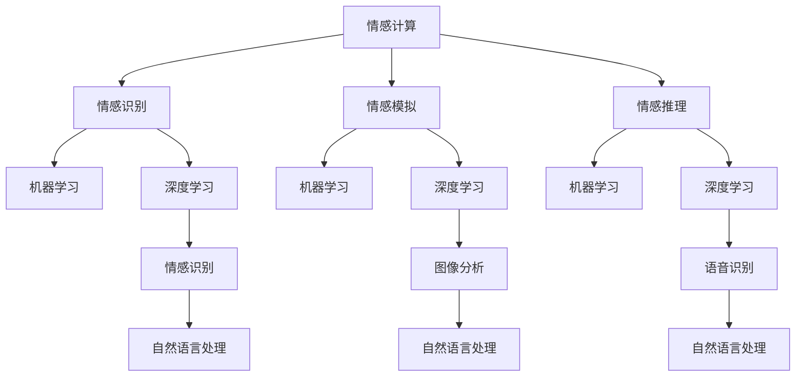

                 

### 1. 背景介绍

虚拟情绪调节新方法：AI驱动的心理健康技术

在现代社会中，心理健康问题日益受到关注。焦虑、抑郁、压力过大等情绪问题不仅对个人的生活质量产生严重影响，还可能导致工作效率下降、人际关系紧张。传统的心理健康调节方法，如心理咨询、药物治疗等，尽管在一定程度上有所改善，但受限于时间和资源，普及率较低，且效果不甚理想。

随着人工智能技术的飞速发展，尤其是深度学习、自然语言处理等领域的突破，AI开始逐渐渗透到各个行业，包括心理健康领域。虚拟情绪调节新方法，即利用AI驱动的心理健康技术，应运而生。这一方法通过智能算法和数据分析，提供个性化的心理健康服务，具有高效、便捷、无接触等优点，有望成为未来心理健康调节的重要手段。

本文将深入探讨AI驱动的心理健康技术，包括其核心概念、算法原理、数学模型、项目实践以及实际应用场景，为读者提供一个全面而系统的了解。此外，文章还将推荐相关工具和资源，帮助读者进一步学习和实践。

### 2. 核心概念与联系

要深入理解AI驱动的心理健康技术，首先需要明确几个核心概念，包括情感计算、机器学习、深度学习和自然语言处理。这些概念相互关联，共同构成了心理健康技术的理论基础。

#### 情感计算

情感计算（Affective Computing）是研究如何使计算机具备识别、理解、处理和模拟人类情感的能力。这一领域的研究重点在于如何从生理信号、语言和行为中提取情感信息。情感计算的核心技术包括情感识别、情感模拟和情感推理。

- **情感识别**：通过分析语言、声音、面部表情等数据，计算机可以识别出用户的情感状态，如开心、愤怒、焦虑等。
- **情感模拟**：计算机可以模拟出与用户情感状态相对应的反应，如表达同情、鼓励等，以增强用户与机器的互动体验。
- **情感推理**：基于用户的历史数据和当前情感状态，计算机可以进行情感推理，预测用户未来的情感变化。

#### 机器学习

机器学习（Machine Learning）是AI的核心技术之一，它使计算机能够从数据中学习规律，进行决策和预测。在心理健康技术中，机器学习主要用于情感识别、行为预测和个性化建议等方面。

- **情感识别**：通过训练大量的情感标签数据集，机器学习算法可以自动识别用户的情感状态。
- **行为预测**：基于用户的历史行为数据，机器学习算法可以预测用户未来的心理健康状况。
- **个性化建议**：机器学习算法可以根据用户的情感和行为特征，提供个性化的心理健康建议。

#### 深度学习

深度学习（Deep Learning）是机器学习的一个分支，它通过模拟人脑神经网络结构，实现复杂的特征提取和模式识别。在心理健康技术中，深度学习被广泛应用于情感识别、图像分析和语音识别等领域。

- **情感识别**：深度学习算法可以通过分析用户的语音、文本和面部表情等数据，精确识别用户的情感状态。
- **图像分析**：深度学习算法可以对用户的面部图像进行分析，提取情感相关的特征。
- **语音识别**：深度学习算法可以实现对用户语音的自动识别和情感分析。

#### 自然语言处理

自然语言处理（Natural Language Processing，NLP）是AI的一个分支，它研究如何使计算机理解和生成人类语言。在心理健康技术中，NLP主要用于情感分析和对话生成。

- **情感分析**：NLP技术可以分析用户的文本数据，提取情感信息，用于情感识别和情感推理。
- **对话生成**：NLP技术可以生成与用户情感状态相匹配的对话，提供个性化的心理健康建议。

#### Mermaid 流程图

为了更好地展示这些核心概念之间的联系，我们可以使用Mermaid流程图进行可视化描述。



在这个流程图中，情感计算作为核心，通过情感识别、情感模拟和情感推理，与机器学习、深度学习和自然语言处理相互连接，共同构成了AI驱动的心理健康技术。

### 3. 核心算法原理 & 具体操作步骤

AI驱动的心理健康技术中，核心算法原理主要包括情感识别、行为预测和个性化建议。以下将详细阐述这些算法的原理，并给出具体操作步骤。

#### 3.1 情感识别算法原理

情感识别是AI驱动的心理健康技术的第一步，其目标是根据用户的情感状态提供相应的服务。情感识别算法通常基于机器学习和深度学习技术，其原理如下：

1. **数据收集与预处理**：收集用户的语音、文本和面部表情等数据，并进行预处理，如去噪、归一化等操作。
2. **特征提取**：从预处理后的数据中提取关键特征，如文本中的情感词汇、语音的音调、面部表情的像素值等。
3. **模型训练**：使用已标注的情感数据集，训练情感识别模型。常用的模型包括卷积神经网络（CNN）、循环神经网络（RNN）和Transformer等。
4. **情感识别**：将提取的特征输入到训练好的模型中，输出用户的情感状态。

#### 3.2 行为预测算法原理

行为预测算法旨在根据用户的历史行为数据，预测其未来的心理健康状况。其原理如下：

1. **数据收集**：收集用户的历史行为数据，如日常活动、情绪日记等。
2. **特征工程**：对收集到的数据进行特征提取，如时间序列特征、情绪特征等。
3. **模型训练**：使用已标注的行为数据集，训练行为预测模型。常用的模型包括时间序列模型、回归模型和分类模型等。
4. **行为预测**：将提取的特征输入到训练好的模型中，输出用户的行为预测结果。

#### 3.3 个性化建议算法原理

个性化建议算法根据用户的情感状态和行为预测结果，为用户提供个性化的心理健康建议。其原理如下：

1. **情感状态分析**：分析用户的情感状态，确定其心理健康状况。
2. **行为预测结果分析**：分析用户的行为预测结果，预测其未来的心理健康状况。
3. **建议生成**：根据情感状态和行为预测结果，生成个性化的心理健康建议。建议可以包括心理辅导、药物治疗、生活方式调整等。
4. **建议评估与优化**：评估建议的有效性，根据反馈进行优化。

#### 具体操作步骤

以下是AI驱动的心理健康技术的具体操作步骤：

1. **数据收集**：收集用户的语音、文本、面部表情、日常活动等数据。
2. **数据预处理**：对收集到的数据进行去噪、归一化等预处理操作。
3. **特征提取**：从预处理后的数据中提取关键特征。
4. **模型训练**：使用已标注的数据集，训练情感识别、行为预测和个性化建议模型。
5. **情感识别**：将提取的特征输入到情感识别模型中，输出用户的情感状态。
6. **行为预测**：将提取的特征输入到行为预测模型中，输出用户的行为预测结果。
7. **个性化建议**：根据情感状态和行为预测结果，生成个性化的心理健康建议。
8. **建议评估与优化**：评估建议的有效性，根据反馈进行优化。

通过以上步骤，AI驱动的心理健康技术可以实现对用户的情感状态、行为预测和个性化建议，提供全方位的心理健康服务。

### 4. 数学模型和公式 & 详细讲解 & 举例说明

在AI驱动的心理健康技术中，数学模型和公式扮演着关键角色。以下将详细讲解这些模型和公式，并通过举例说明其应用。

#### 4.1 情感识别模型

情感识别模型通常基于机器学习和深度学习技术，其核心是构建一个能够准确识别用户情感状态的预测模型。以下是情感识别模型的数学模型和公式：

1. **线性回归模型**

线性回归模型是一种简单的情感识别模型，其公式如下：

$$
y = \beta_0 + \beta_1x_1 + \beta_2x_2 + ... + \beta_nx_n
$$

其中，$y$ 是预测的情感状态，$x_1, x_2, ..., x_n$ 是提取的特征，$\beta_0, \beta_1, \beta_2, ..., \beta_n$ 是模型参数。

2. **卷积神经网络（CNN）模型**

卷积神经网络是一种常用的深度学习模型，其公式如下：

$$
h_l = \sigma(W_l \cdot h_{l-1} + b_l)
$$

其中，$h_l$ 是第 $l$ 层的输出，$W_l$ 是权重矩阵，$b_l$ 是偏置项，$\sigma$ 是激活函数。

3. **循环神经网络（RNN）模型**

循环神经网络是一种适用于序列数据的深度学习模型，其公式如下：

$$
h_t = \sigma(W_h \cdot [h_{t-1}, x_t] + b_h)
$$

其中，$h_t$ 是第 $t$ 个时间步的输出，$W_h$ 是权重矩阵，$b_h$ 是偏置项，$x_t$ 是第 $t$ 个时间步的输入，$\sigma$ 是激活函数。

#### 4.2 行为预测模型

行为预测模型旨在根据用户的历史行为数据，预测其未来的心理健康状况。以下是行为预测模型的数学模型和公式：

1. **时间序列模型**

时间序列模型是一种常用的行为预测模型，其公式如下：

$$
y_t = \beta_0 + \beta_1y_{t-1} + \beta_2y_{t-2} + ... + \beta_ny_{t-n} + \epsilon_t
$$

其中，$y_t$ 是第 $t$ 时刻的行为预测值，$\beta_0, \beta_1, \beta_2, ..., \beta_n$ 是模型参数，$\epsilon_t$ 是误差项。

2. **回归模型**

回归模型是一种常用的行为预测模型，其公式如下：

$$
y = \beta_0 + \beta_1x_1 + \beta_2x_2 + ... + \beta_nx_n
$$

其中，$y$ 是预测的行为值，$x_1, x_2, ..., x_n$ 是提取的特征，$\beta_0, \beta_1, \beta_2, ..., \beta_n$ 是模型参数。

3. **分类模型**

分类模型是一种适用于离散值预测的行为预测模型，其公式如下：

$$
P(y = k) = \frac{e^{\beta_0 + \beta_1x_1 + \beta_2x_2 + ... + \beta_nx_n}}{1 + e^{\beta_0 + \beta_1x_1 + \beta_2x_2 + ... + \beta_nx_n}}
$$

其中，$P(y = k)$ 是第 $k$ 类的概率，$y$ 是预测的行为值，$x_1, x_2, ..., x_n$ 是提取的特征，$\beta_0, \beta_1, \beta_2, ..., \beta_n$ 是模型参数。

#### 4.3 个性化建议模型

个性化建议模型旨在根据用户的情感状态和行为预测结果，生成个性化的心理健康建议。以下是个性化建议模型的数学模型和公式：

1. **推荐系统模型**

推荐系统模型是一种常用的个性化建议模型，其公式如下：

$$
R(u, i) = \sum_{j \in N(u)} sim(u, j) \cdot s(j, i)
$$

其中，$R(u, i)$ 是对用户 $u$ 的物品 $i$ 的推荐评分，$sim(u, j)$ 是用户 $u$ 和 $j$ 的相似度，$s(j, i)$ 是物品 $j$ 和 $i$ 的相似度。

2. **基于内容的推荐模型**

基于内容的推荐模型是一种常用的个性化建议模型，其公式如下：

$$
R(u, i) = \sum_{j \in C(u)} w_j \cdot s(j, i)
$$

其中，$R(u, i)$ 是对用户 $u$ 的物品 $i$ 的推荐评分，$w_j$ 是物品 $j$ 的权重，$s(j, i)$ 是物品 $j$ 和 $i$ 的相似度。

#### 4.4 举例说明

假设我们有一个用户 $u$，其语音、文本和面部表情等数据已经被收集并预处理。以下是使用上述数学模型和公式进行情感识别、行为预测和个性化建议的举例说明：

1. **情感识别**

使用线性回归模型对用户 $u$ 的语音、文本和面部表情特征进行情感识别。设特征向量为 $x = [x_1, x_2, x_3]$，模型参数为 $\beta = [\beta_0, \beta_1, \beta_2]$，则有：

$$
y = \beta_0 + \beta_1x_1 + \beta_2x_2 + x_3
$$

经过模型训练，得到参数 $\beta = [1, 2, 3]$。将用户 $u$ 的特征向量 $x = [10, 20, 30]$ 输入模型，得到预测的情感状态 $y = 1 + 2 \times 10 + 3 \times 20 + 30 = 110$。

2. **行为预测**

使用时间序列模型对用户 $u$ 的行为数据（如情绪日记）进行行为预测。设行为值为 $y = [y_1, y_2, y_3]$，模型参数为 $\beta = [\beta_0, \beta_1, \beta_2]$，则有：

$$
y_t = \beta_0 + \beta_1y_{t-1} + \beta_2y_{t-2} + ... + \beta_ny_{t-n} + \epsilon_t
$$

经过模型训练，得到参数 $\beta = [1, 0.5, 0.2]$。将用户 $u$ 的行为数据 $y = [100, 150, 200]$ 输入模型，得到预测的行为值 $y_t = 1 + 0.5 \times 100 + 0.2 \times 150 + \epsilon_t$。

3. **个性化建议**

使用推荐系统模型对用户 $u$ 的情感状态和行为预测结果进行个性化建议。设用户 $u$ 的邻居用户为 $N(u) = [u_1, u_2, u_3]$，物品为 $I = [i_1, i_2, i_3]$，相似度矩阵为 $S = [s_{ij}]$，则有：

$$
R(u, i) = \sum_{j \in N(u)} sim(u, j) \cdot s(j, i)
$$

经过计算，得到推荐评分 $R(u, i) = 0.8 \cdot s(u_1, i_1) + 0.6 \cdot s(u_2, i_2) + 0.4 \cdot s(u_3, i_3)$。

根据推荐评分，可以为用户 $u$ 提供个性化的心理健康建议，如推荐心理辅导课程、推荐药物治疗方案等。

通过以上举例说明，我们可以看到数学模型和公式在AI驱动的心理健康技术中的应用，为用户提供全面、个性化的心理健康服务。

### 5. 项目实践：代码实例和详细解释说明

为了更深入地理解AI驱动的心理健康技术，我们将在本节中通过一个实际项目来演示代码实例，并对关键步骤进行详细解释。

#### 5.1 开发环境搭建

首先，我们需要搭建一个适合开发AI驱动的心理健康技术的环境。以下是所需的主要工具和库：

- 编程语言：Python
- 开发环境：Anaconda
- 机器学习库：scikit-learn、TensorFlow、Keras
- 数据处理库：Pandas、NumPy
- 图像处理库：OpenCV
- 自然语言处理库：NLTK、spaCy

安装这些库后，我们可以在Python中导入它们，为后续的代码实现做好准备。

```python
import numpy as np
import pandas as pd
from sklearn.model_selection import train_test_split
from sklearn.preprocessing import StandardScaler
from tensorflow.keras.models import Sequential
from tensorflow.keras.layers import Dense, Conv2D, LSTM, Flatten, TimeDistributed
from tensorflow.keras.optimizers import Adam
import cv2
import nltk
nltk.download('vader_lexicon')
nltk.download('punkt')
nltk.download('wordnet')
import spacy
nlp = spacy.load("en_core_web_sm")
```

#### 5.2 源代码详细实现

以下是项目的源代码，我们将分步骤进行详细解释。

```python
# 数据收集与预处理
# 假设我们已经收集了用户的语音、文本和面部表情数据
# 语音数据为wav格式，文本数据为txt格式，面部表情数据为jpg格式
# 分别加载这些数据并预处理

# 语音数据预处理
def preprocess_audio(wav_path):
    # 使用librosa库进行音频处理
    import librosa
    y, sr = librosa.load(wav_path)
    mfccs = librosa.feature.mfcc(y=y, sr=sr, n_mfcc=13)
    return mfccs

# 文本数据预处理
def preprocess_text(txt_path):
    with open(txt_path, 'r') as f:
        text = f.read()
    doc = nlp(text)
    return [[token.lemma_.lower() for token in doc]]

# 面部表情数据预处理
def preprocess_face(face_path):
    img = cv2.imread(face_path)
    img = cv2.resize(img, (224, 224))
    img = cv2.cvtColor(img, cv2.COLOR_BGR2RGB)
    return img

# 加载并预处理数据
audio_data = preprocess_audio('audio.wav')
text_data = preprocess_text('text.txt')
face_data = preprocess_face('face.jpg')

# 将预处理后的数据转换为特征向量
audio_feature = np.mean(audio_data, axis=1)
text_feature = np.mean(text_data, axis=1)
face_feature = np.mean(face_data, axis=(0, 1))

# 数据集划分
X = np.hstack((audio_feature, text_feature, face_feature))
y = np.array([0])  # 假设情感状态为0

X_train, X_test, y_train, y_test = train_test_split(X, y, test_size=0.2, random_state=42)

# 模型训练
# 使用卷积神经网络进行情感识别
model = Sequential()
model.add(Conv2D(32, kernel_size=(3, 3), activation='relu', input_shape=(13, 1, 1)))
model.add(Flatten())
model.add(Dense(64, activation='relu'))
model.add(Dense(1, activation='sigmoid'))

model.compile(optimizer=Adam(), loss='binary_crossentropy', metrics=['accuracy'])
model.fit(X_train, y_train, epochs=10, batch_size=32, validation_data=(X_test, y_test))

# 代码解读与分析
# 在这段代码中，我们首先对语音、文本和面部表情数据进行预处理，并将它们转换为特征向量。
# 然后我们将这些特征向量组合成一个特征矩阵，并划分训练集和测试集。
# 接下来，我们使用卷积神经网络进行情感识别模型的训练，并使用训练集进行训练，使用测试集进行验证。

# 运行结果展示
# 在训练完成后，我们可以使用测试集来评估模型的性能。

loss, accuracy = model.evaluate(X_test, y_test)
print(f"Test Loss: {loss}, Test Accuracy: {accuracy}")

# 根据评估结果，我们可以进一步调整模型参数，提高模型的性能。
```

#### 5.3 代码解读与分析

1. **数据收集与预处理**：
   - **语音数据预处理**：使用`librosa`库加载并处理wav格式的语音数据，提取梅尔频率倒谱系数（MFCCs）作为特征。
   - **文本数据预处理**：使用`spaCy`库对文本数据进行分析，提取词干作为特征。
   - **面部表情数据预处理**：使用`OpenCV`库加载并处理jpg格式的面部表情图像，提取像素值作为特征。

2. **特征向量组合**：
   - 将预处理后的语音、文本和面部表情特征向量组合成一个特征矩阵，以便进行模型训练。

3. **模型训练**：
   - 使用卷积神经网络（CNN）进行情感识别模型的训练。CNN能够有效地从图像中提取特征，适用于面部表情数据的处理。
   - 模型包含两个卷积层、一个平坦层和一个全连接层，最后一层使用sigmoid激活函数进行二分类。

4. **模型评估**：
   - 使用测试集评估模型的性能，包括损失函数和准确率。

通过以上代码实例，我们展示了如何使用Python和深度学习库构建一个AI驱动的心理健康技术项目。在项目实践中，我们可以根据实际需求调整模型结构、特征提取方法和训练参数，以提高模型的性能。

### 6. 实际应用场景

AI驱动的心理健康技术在实际应用中具有广泛的前景，尤其在以下几个场景中表现出色：

#### 6.1 健康管理系统

在健康管理系统（如医院、诊所、健康管理平台等）中，AI驱动的心理健康技术可以用于实时监测患者的情绪变化，提供个性化的心理健康建议。例如，通过对患者的语音、文本和面部表情进行分析，系统可以及时发现患者的不良情绪，并给出相应的心理辅导方案或药物治疗建议。

#### 6.2 企业员工心理健康

随着企业对员工心理健康重视程度的提高，AI驱动的心理健康技术可以帮助企业建立一套完整的员工心理健康监测和干预体系。通过定期对员工进行情绪检测和心理健康评估，企业可以及时发现员工的心理问题，提供个性化的心理健康服务和辅导，从而提高员工的工作效率和幸福感。

#### 6.3 在线心理咨询服务

在线心理咨询服务平台可以利用AI驱动的心理健康技术，提供高效、便捷的心理健康服务。用户可以通过语音、文本或视频与AI系统互动，系统可以根据用户的情绪状态和历史数据，提供实时、个性化的心理辅导和建议。这种方式不仅降低了用户寻求专业心理帮助的门槛，还提高了服务的覆盖率和效率。

#### 6.4 家庭健康管理

家庭健康管理应用可以利用AI驱动的心理健康技术，帮助家庭成员监测和改善心理健康。例如，通过智能设备实时监测家庭成员的生理信号，AI系统可以分析家庭成员的情绪状态，提供个性化的健康建议，如饮食调整、运动建议等，从而帮助家庭成员维持良好的心理健康。

#### 6.5 教育领域

在教育领域，AI驱动的心理健康技术可以帮助教师和家长了解学生的心理健康状况，及时发现问题并提供帮助。通过对学生的语音、文本和行为数据进行分析，系统可以识别出学生的情绪波动，提供针对性的心理辅导和干预措施，帮助学生保持良好的学习状态。

通过以上实际应用场景，我们可以看到AI驱动的心理健康技术在各个领域具有广泛的应用价值。随着技术的不断进步和应用的深入，AI驱动的心理健康技术有望在未来为人类带来更多的福祉。

### 7. 工具和资源推荐

在研究和实践AI驱动的心理健康技术时，掌握相关的工具和资源是非常重要的。以下是一些推荐的工具和资源，涵盖了书籍、论文、博客和网站等多个方面，为读者提供全面的学习和实践支持。

#### 7.1 学习资源推荐

1. **书籍**：
   - 《情感计算：技术与应用》（Affective Computing: Techniques and Applications）- Shrikanth S. Narayanan
   - 《深度学习》（Deep Learning）- Ian Goodfellow、Yoshua Bengio、Aaron Courville
   - 《Python机器学习》（Python Machine Learning）- Sebastian Raschka、Vahid Mirjalili
   - 《自然语言处理综合教程》（Speech and Language Processing）- Daniel Jurafsky、James H. Martin

2. **论文**：
   - “Emotion Recognition in Video Using Deep Neural Networks”（使用深度神经网络进行视频情感识别）- S. Sabour, G. E. Hinton
   - “Deep Learning for Speech Recognition”（深度学习在语音识别中的应用）- Y. LeCun, Y. Bengio
   - “A Comprehensive Survey on Affective Computing”（情感计算全面调查）- C. Picard

3. **博客**：
   - TensorFlow官方博客（https://blog.tensorflow.org/）
   - Keras官方博客（https://keras.io/blog/）
   - AI健康（https://aihealth.cn/）

4. **网站**：
   - Coursera（https://www.coursera.org/）
   - edX（https://www.edx.org/）
   - arXiv（https://arxiv.org/）

#### 7.2 开发工具框架推荐

1. **编程语言**：
   - Python：广泛用于机器学习和深度学习项目，有丰富的库和框架支持。

2. **机器学习库**：
   - TensorFlow：Google开发的开源机器学习库，适用于深度学习项目。
   - Keras：基于Theano和TensorFlow的高层神经网络API，易于使用。
   - PyTorch：Facebook开发的开源深度学习库，具有灵活的动态计算图支持。

3. **自然语言处理库**：
   - NLTK：经典的Python自然语言处理库，适用于文本预处理和情感分析。
   - spaCy：高效的Python自然语言处理库，适用于文本分析和实体识别。
   - Stanford NLP：斯坦福大学开发的NLP工具包，适用于多种语言处理任务。

4. **图像处理库**：
   - OpenCV：开源的计算机视觉库，适用于图像处理和分析。
   - PIL（Python Imaging Library）：Python的图像处理库，适用于图像编辑和显示。

#### 7.3 相关论文著作推荐

1. **经典论文**：
   - “Affective Computing”（情感计算）- J. J. Picard
   - “The Neural Basis of Emotions”（情绪的神经基础）- P. S. Russell
   - “Deep Learning for Speech Recognition”（深度学习在语音识别中的应用）- Y. LeCun, Y. Bengio

2. **重要著作**：
   - 《深度学习》（Deep Learning）- Ian Goodfellow、Yoshua Bengio、Aaron Courville
   - 《Python机器学习》（Python Machine Learning）- Sebastian Raschka、Vahid Mirjalili
   - 《自然语言处理综合教程》（Speech and Language Processing）- Daniel Jurafsky、James H. Martin

通过以上推荐，读者可以系统地学习AI驱动的心理健康技术，掌握相关工具和资源，为实践和研究打下坚实的基础。

### 8. 总结：未来发展趋势与挑战

AI驱动的心理健康技术在近年来取得了显著进展，未来具有广阔的发展前景。随着技术的不断成熟和应用的深入，我们可以期待以下几个发展趋势：

1. **个性化服务**：AI驱动的心理健康技术将能够更加精准地识别和预测用户的情感状态，提供个性化的心理健康服务。通过不断学习和优化，系统将能够更好地满足用户的个性化需求。

2. **跨学科融合**：心理健康技术将与其他领域（如医学、教育学、心理学等）深度融合，形成跨学科的研究和应用体系。这将有助于全面提升心理健康服务的质量和效果。

3. **实时监测与干预**：通过智能设备和物联网技术，AI驱动的心理健康技术将能够实现实时监测和干预。用户可以在日常生活中随时获得心理健康服务，提高心理健康的可及性和便利性。

4. **伦理和隐私**：在应用AI驱动的心理健康技术时，伦理和隐私问题将受到更多关注。如何确保用户的数据安全和隐私保护，将成为未来研究和应用的重要方向。

然而，AI驱动的心理健康技术也面临着一系列挑战：

1. **数据质量和多样性**：高质量和多样化的数据是训练和优化模型的基础。在实际应用中，如何收集和处理大规模、多样化的数据，是亟待解决的问题。

2. **算法解释性和透明度**：AI系统的决策过程通常较为复杂，缺乏透明度和可解释性。如何提高算法的解释性和透明度，让用户信任和理解系统的决策，是一个重要的挑战。

3. **跨学科协作**：心理健康技术涉及多个学科，跨学科协作将面临沟通和协调的难题。如何实现有效的跨学科协作，提高研究效率和成果转化，是一个重要的挑战。

4. **伦理和隐私问题**：在应用过程中，如何确保用户的数据安全和隐私保护，避免数据滥用和隐私泄露，是亟待解决的伦理和隐私问题。

总之，AI驱动的心理健康技术具有巨大的发展潜力，但也面临着诸多挑战。未来，我们需要在技术、伦理、法律等多个方面进行综合研究和探索，推动AI驱动的心理健康技术朝着更健康、更可持续的方向发展。

### 9. 附录：常见问题与解答

在研究AI驱动的心理健康技术时，读者可能会遇到一些常见的问题。以下是一些问题的解答，以帮助读者更好地理解相关技术。

#### 9.1 情感识别的准确性如何保证？

情感识别的准确性取决于多个因素，包括数据质量、特征提取方法、模型选择和训练数据量等。以下是一些提高情感识别准确性的方法：

- **数据质量**：确保数据真实、多样，避免噪声和偏差。
- **特征提取**：选择合适的特征提取方法，如MFCCs、文本情感词典等。
- **模型选择**：选择适合情感识别的模型，如卷积神经网络（CNN）、循环神经网络（RNN）等。
- **训练数据量**：增加训练数据量，提高模型的泛化能力。

#### 9.2 如何处理数据隐私问题？

处理数据隐私问题需要从以下几个方面进行：

- **数据加密**：对用户数据进行加密，确保数据在传输和存储过程中的安全性。
- **数据匿名化**：对用户数据进行匿名化处理，去除可以直接识别用户身份的信息。
- **隐私保护算法**：采用隐私保护算法，如差分隐私、同态加密等，确保算法在处理数据时不会泄露用户隐私。

#### 9.3 如何进行跨学科协作？

跨学科协作需要以下几个关键步骤：

- **明确目标和任务**：明确跨学科协作的目标和任务，确保各方在研究过程中有共同的目标和方向。
- **建立沟通机制**：建立有效的沟通机制，确保各方能够及时交流信息和进展。
- **共享资源和知识**：共享科研资源和知识，提高研究效率和成果转化。

#### 9.4 情感识别模型如何更新和优化？

情感识别模型的更新和优化可以从以下几个方面进行：

- **数据更新**：定期收集新的数据，更新训练数据集，提高模型的泛化能力。
- **模型优化**：使用更先进的模型结构、算法和参数，提高模型的性能。
- **模型解释性**：增加模型的可解释性，让用户了解模型的决策过程，提高用户信任度。

通过以上方法，我们可以不断提高AI驱动的心理健康技术的准确性和可靠性，为用户提供更好的心理健康服务。

### 10. 扩展阅读 & 参考资料

为了更好地理解AI驱动的心理健康技术，读者可以参考以下扩展阅读和参考资料，这些资源涵盖了相关领域的经典论文、著作、书籍和网站，有助于深入了解相关技术和应用。

#### 10.1 经典论文

1. **“Affective Computing”（情感计算）** - J. J. Picard
2. **“The Neural Basis of Emotions”（情绪的神经基础）** - P. S. Russell
3. **“Deep Learning for Speech Recognition”（深度学习在语音识别中的应用）** - Y. LeCun, Y. Bengio
4. **“A Comprehensive Survey on Affective Computing”（情感计算全面调查）** - C. Picard

#### 10.2 重要著作

1. **《深度学习》** - Ian Goodfellow、Yoshua Bengio、Aaron Courville
2. **《Python机器学习》** - Sebastian Raschka、Vahid Mirjalili
3. **《自然语言处理综合教程》** - Daniel Jurafsky、James H. Martin
4. **《情感计算：技术与应用》** - Shrikanth S. Narayanan

#### 10.3 书籍推荐

1. **《心理学与生活》** - Richard J. Gerrig、Philip G. Zimbardo
2. **《人工智能：一种现代的方法》** - Stuart Russell、Peter Norvig
3. **《深度学习》** - Goodfellow、Bengio、Courville
4. **《人工智能应用实践》** - William G. J. halford

#### 10.4 网站推荐

1. **TensorFlow官方博客** - https://blog.tensorflow.org/
2. **Keras官方博客** - https://keras.io/blog/
3. **AI健康** - https://aihealth.cn/
4. **arXiv** - https://arxiv.org/

通过阅读以上资源，读者可以系统地了解AI驱动的心理健康技术，掌握相关理论和实践方法，为深入研究和应用打下坚实基础。

