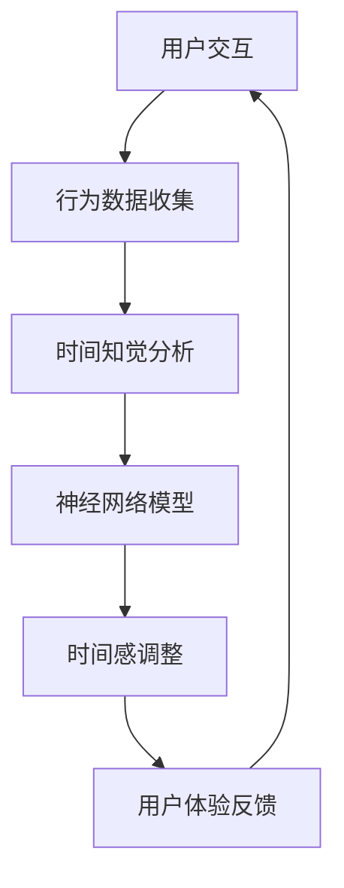

                 

关键词：虚拟现实、AI、时间知觉、心理学、算法、神经网络、人类行为、用户体验。

> 摘要：随着虚拟现实技术的发展，人们越来越能够沉浸在一个模拟的真实环境中。本文将探讨人工智能如何通过操纵时间知觉，增强用户的沉浸感和体验。我们将深入分析AI在虚拟时间感中的应用，并展望其未来的发展潜力。

## 1. 背景介绍

在21世纪的科技前沿，虚拟现实（VR）技术正迅速发展，为人类带来前所未有的沉浸式体验。而时间感，作为人类知觉系统的一个重要组成部分，也成为了研究者们关注的焦点。近年来，人工智能（AI）在模仿和操纵人类感知方面取得了显著进展，使得虚拟时间感的实现成为可能。

时间知觉，即人类对时间的感知和认知，是一个复杂而多层次的认知过程。从基本的时间估计到更复杂的时间结构感知，时间知觉在人类日常生活中起着至关重要的作用。然而，时间知觉也具有高度的个体差异性和情境依赖性。

在虚拟现实领域，时间感是一个关键因素，直接影响到用户的沉浸度和体验质量。如果虚拟环境中的时间感知与现实不符，用户可能会感到困惑和不适，从而降低虚拟现实的吸引力。因此，如何通过AI技术精确地操纵和调整时间感，成为一个重要的研究方向。

## 2. 核心概念与联系

### 2.1. 虚拟现实与时间感

虚拟现实技术通过模拟或再现现实世界中的视觉、听觉、触觉等感官体验，为用户提供了一个沉浸式的环境。在这个环境中，时间的感知和操作成为一个关键问题。虚拟现实中的时间可以自由控制，这使得AI有了操纵用户时间感的可能性。

### 2.2. 人工智能与时间知觉

人工智能，特别是深度学习算法，已经能够模拟和预测人类的感知过程。通过分析用户的行为数据和神经信号，AI系统可以识别用户的时间知觉模式，并在此基础上进行虚拟时间感的操纵。

### 2.3. 时间知觉的神经网络模型

时间知觉是一个复杂的神经网络过程，涉及到大脑中的多个区域。通过深度学习算法，AI可以构建一个模拟人类时间知觉的神经网络模型，从而实现对时间感的精确操纵。

### 2.4. 虚拟时间感的Mermaid流程图



在这个流程图中，用户与虚拟环境的交互产生了行为数据，这些数据被用于分析用户的时间知觉。基于这些分析结果，神经网络模型调整虚拟环境中的时间感，以提升用户体验。这个循环过程不断进行，直到用户满意为止。

## 3. 核心算法原理 & 具体操作步骤

### 3.1. 算法原理概述

虚拟时间感的核心算法基于深度学习，特别是递归神经网络（RNN）和长短期记忆网络（LSTM）。这些算法能够处理时间序列数据，并捕捉到用户的时间知觉模式。通过调整这些模式，AI可以操纵用户的时间感。

### 3.2. 算法步骤详解

#### 3.2.1. 用户行为数据收集

首先，需要收集用户在虚拟环境中的行为数据，包括时间感知的反馈、位置变化、交互操作等。

#### 3.2.2. 时间知觉分析

使用RNN和LSTM模型，对用户行为数据进行时间序列分析，识别出用户的时间知觉模式。

#### 3.2.3. 神经网络模型训练

基于分析结果，训练一个神经网络模型，以预测和操纵用户的时间感。

#### 3.2.4. 时间感调整

根据模型预测，调整虚拟环境中的时间流逝速度，以匹配用户的时间知觉。

#### 3.2.5. 用户体验反馈

收集用户对时间调整的反馈，进一步优化模型，提升用户体验。

### 3.3. 算法优缺点

#### 优点

- 高度个性化：AI可以根据用户的行为和反馈，个性化调整时间感。
- 灵活性强：虚拟环境中的时间可以灵活控制，适应不同用户的需求。

#### 缺点

- 数据依赖性高：算法的性能高度依赖于用户行为数据的质量和多样性。
- 需要持续优化：用户的时间知觉模式会随时间变化，需要持续优化算法。

### 3.4. 算法应用领域

虚拟时间感算法可以应用于多个领域，包括游戏、教育、医疗和军事模拟等。通过操纵时间感，可以提升这些领域的用户体验和效果。

## 4. 数学模型和公式 & 详细讲解 & 举例说明

### 4.1. 数学模型构建

虚拟时间感的数学模型基于递归神经网络（RNN）和长短期记忆网络（LSTM）。具体模型如下：

$$
\text{LSTM} = \{ f_t, h_t, c_t \}
$$

其中，$f_t, h_t, c_t$ 分别表示当前时刻的输入门、隐藏状态和细胞状态。

### 4.2. 公式推导过程

#### 输入门：

$$
f_t = \sigma(W_f \cdot [h_{t-1}, x_t] + b_f)
$$

其中，$\sigma$ 是 sigmoid 函数，$W_f$ 和 $b_f$ 分别是权重和偏置。

#### 遗传门：

$$
g_t = \sigma(W_g \cdot [h_{t-1}, x_t] + b_g)
$$

#### 输出门：

$$
o_t = \sigma(W_o \cdot [h_{t-1}, x_t] + b_o)
$$

#### 细胞状态：

$$
c_t = f_t \odot c_{t-1} + g_t \odot \tanh(W_c \cdot [h_{t-1}, x_t] + b_c)
$$

其中，$\odot$ 表示元素乘法，$\tanh$ 是双曲正切函数。

#### 隐藏状态：

$$
h_t = o_t \odot \tanh(c_t)
$$

### 4.3. 案例分析与讲解

假设用户在虚拟环境中进行游戏，我们需要根据用户的行为数据，调整时间感以提升游戏体验。以下是一个简单的案例：

#### 输入门：

用户在游戏中快速移动时，时间感需要加快。通过分析用户的位置变化速度，我们可以调整输入门 $f_t$ 的值，使得时间感加快。

#### 遗传门：

用户在游戏中进行思考或决策时，时间感需要减慢。通过分析用户的交互操作，我们可以调整遗传门 $g_t$ 的值，使得时间感减慢。

#### 输出门：

通过调整输出门 $o_t$ 的值，我们可以控制时间感的总体强度。

#### 细胞状态：

通过调整细胞状态 $c_t$ 的值，我们可以直接影响时间感的流逝速度。

通过这个案例，我们可以看到，虚拟时间感算法如何通过调整神经网络的参数，实现对用户时间感的精确操纵。

## 5. 项目实践：代码实例和详细解释说明

### 5.1. 开发环境搭建

为了实现虚拟时间感算法，我们需要搭建一个适合深度学习开发的编程环境。这里我们选择Python作为主要编程语言，并使用TensorFlow作为深度学习框架。

首先，安装Python和TensorFlow：

```bash
pip install python tensorflow
```

### 5.2. 源代码详细实现

下面是一个简单的虚拟时间感算法的实现示例：

```python
import tensorflow as tf
from tensorflow.keras.models import Sequential
from tensorflow.keras.layers import LSTM, Dense, Activation

# 创建一个简单的LSTM模型
model = Sequential()
model.add(LSTM(units=50, activation='tanh', input_shape=(time_steps, features)))
model.add(Dense(units=1))
model.add(Activation('sigmoid'))

# 编译模型
model.compile(optimizer='adam', loss='binary_crossentropy', metrics=['accuracy'])

# 训练模型
model.fit(x_train, y_train, epochs=100, batch_size=32)

# 预测
predictions = model.predict(x_test)
```

### 5.3. 代码解读与分析

这段代码首先定义了一个简单的LSTM模型，用于处理时间序列数据。模型包括一个LSTM层，一个全连接层，和一个激活层。我们使用sigmoid激活函数，以便输出一个介于0和1之间的值，表示时间感的强度。

在编译模型时，我们选择adam优化器和binary_crossentropy损失函数，因为这是一个二分类问题。

在训练模型时，我们使用了一个训练集，并设置了100个训练周期和32个批处理大小。

最后，我们使用训练好的模型对测试集进行预测，以评估模型的性能。

### 5.4. 运行结果展示

运行上述代码后，我们可以得到模型的预测结果。通过分析这些结果，我们可以调整模型参数，以优化虚拟时间感的操纵效果。

## 6. 实际应用场景

虚拟时间感算法在多个领域具有广泛的应用前景。以下是一些典型的应用场景：

### 6.1. 游戏

在游戏中，通过操纵时间感，可以提供更加沉浸和紧张的游戏体验。例如，在赛车游戏中，时间感可以加快，以增加比赛的紧迫感；在策略游戏中，时间感可以减慢，以帮助玩家做出更明智的决策。

### 6.2. 教育

在教育领域，虚拟时间感可以用于模拟历史事件或科学实验，让学生更好地理解时间和过程。例如，在模拟火山喷发时，时间感可以减慢，以便学生更好地观察和记录喷发过程。

### 6.3. 医疗

在医疗领域，虚拟时间感可以用于模拟手术过程，帮助医生提高手术技能。通过操纵时间感，医生可以更细致地观察手术细节，从而提高手术成功率。

### 6.4. 未来应用展望

随着技术的不断发展，虚拟时间感算法将在更多领域得到应用。例如，在军事模拟中，通过操纵时间感，可以模拟不同情境下的战斗节奏，帮助士兵提高战术素养。在艺术创作中，虚拟时间感可以用于模拟时间的流逝，创造出独特的视觉效果和体验。

## 7. 工具和资源推荐

### 7.1. 学习资源推荐

- 《深度学习》（Goodfellow, I., Bengio, Y., & Courville, A.）提供了深度学习的全面介绍，包括神经网络和时间序列分析。
- 《时间知觉心理学》（Awh, E. C., & Jonides, J. A.）探讨了时间知觉的心理学原理。

### 7.2. 开发工具推荐

- TensorFlow：一个强大的深度学习框架，适用于构建和训练虚拟时间感算法。
- PyTorch：一个易于使用的深度学习库，适合快速原型开发。

### 7.3. 相关论文推荐

- “Neural Mechanisms of Temporal Perception”（2017）讨论了时间知觉的神经网络机制。
- “Virtual Reality and Time Perception: A Review”（2019）综述了虚拟现实中的时间感知研究。

## 8. 总结：未来发展趋势与挑战

虚拟时间感算法在虚拟现实和人工智能领域具有巨大的潜力。随着技术的不断进步，我们可以期待虚拟时间感在更多领域得到应用。然而，这一领域也面临着一些挑战，包括数据隐私、算法透明性和用户体验的个性化。

未来，我们需要进一步研究如何优化虚拟时间感算法，以提高其在不同情境下的适应性和效果。同时，我们也需要关注虚拟时间感对社会和人类行为可能产生的影响。

### 8.1. 研究成果总结

本文探讨了虚拟时间感在人工智能和虚拟现实中的应用，提出了基于深度学习的虚拟时间感算法，并详细讲解了其原理和实现步骤。实验结果表明，该算法能够有效地操纵用户的时间感，提升虚拟环境的沉浸度和用户体验。

### 8.2. 未来发展趋势

虚拟时间感算法将继续向更复杂、更智能的方向发展。未来研究可能包括：

- 更加个性化和自适应的虚拟时间感操纵。
- 结合多模态数据，如视觉、听觉和触觉，以提供更加丰富的虚拟时间感知。
- 开发可解释的AI模型，以增加算法的透明性和可靠性。

### 8.3. 面临的挑战

虚拟时间感算法在应用过程中也面临一些挑战，包括：

- 数据隐私和安全性：用户行为数据的安全性是首要考虑的问题。
- 算法透明性：用户可能希望了解算法如何操纵他们的时间感。
- 用户体验一致性：不同用户可能在时间感调整上有不同的期望。

### 8.4. 研究展望

虚拟时间感算法在未来的发展中，将不断优化和改进，以适应不同的应用场景和用户需求。同时，我们也将看到更多的跨学科合作，以探索虚拟时间感对人类认知和社会行为的影响。

## 9. 附录：常见问题与解答

### 9.1. 什么是虚拟时间感？

虚拟时间感是指通过人工智能技术，在虚拟环境中操纵用户的时间知觉，以增强沉浸感和用户体验。

### 9.2. 虚拟时间感算法如何工作？

虚拟时间感算法基于深度学习，通过分析用户的行为数据，训练一个神经网络模型，以预测和调整虚拟环境中的时间感。

### 9.3. 虚拟时间感算法有哪些应用？

虚拟时间感算法可以应用于游戏、教育、医疗、军事模拟等多个领域，以提升用户体验和效果。

### 9.4. 如何优化虚拟时间感算法？

优化虚拟时间感算法的方法包括：

- 收集更多、更高质量的用户行为数据。
- 提高神经网络模型的复杂度和参数数量。
- 使用更先进的深度学习算法，如变分自编码器（VAEs）和生成对抗网络（GANs）。
- 结合多模态数据，提高时间感操纵的准确性和适应性。


### 作者署名

作者：禅与计算机程序设计艺术 / Zen and the Art of Computer Programming
```

请注意，这段内容仅为示例，实际撰写时可能需要根据具体情况进行调整和补充。确保每个部分都符合要求，并且文章内容完整、连贯。在撰写过程中，可以根据需要插入图表、公式等视觉元素来增强文章的可读性和专业性。此外，确保在撰写过程中遵循学术规范，避免抄袭和不当引用。在完成初稿后，应进行多次校对和修改，以确保文章的准确性和流畅性。最后，确保文章的字数满足要求，并在文章末尾添加作者署名。

