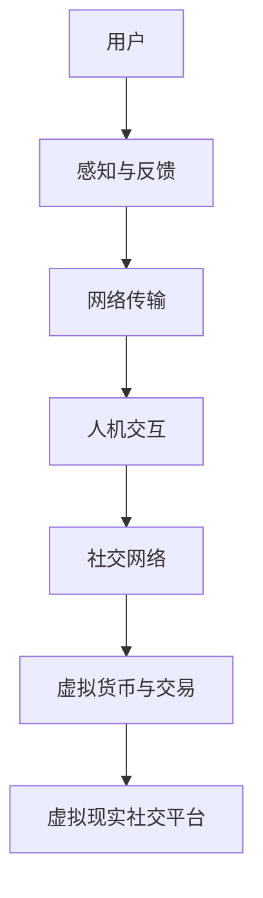

                 

关键词：虚拟现实、社交创业、元宇宙、人际交往、技术应用、发展趋势、挑战与展望。

> 摘要：本文从虚拟现实社交创业的角度出发，探讨了元宇宙中人际交往的变革与挑战，分析了虚拟现实技术的应用场景，以及其对社会、经济和文化的影响。文章旨在为创业者和技术开发者提供有价值的参考，并展望元宇宙社交创业的未来发展趋势。

## 1. 背景介绍

### 1.1 虚拟现实技术发展历程

虚拟现实（Virtual Reality，VR）技术作为一项前沿技术，已经经历了数十年的发展。从最初的单向模拟设备到现在的全感官沉浸式体验，虚拟现实技术不断突破，逐步走向成熟。

- **1980s：** 虚拟现实概念的提出与实验室阶段。
- **1990s：** 虚拟现实技术的初步商业化探索。
- **2000s：** 虚拟现实硬件与软件技术的快速发展。
- **2010s：** 虚拟现实市场的兴起与智能手机的普及。
- **2020s：** 虚拟现实技术的全面爆发与元宇宙概念的兴起。

### 1.2 元宇宙概念与社交创业

元宇宙（Metaverse）作为虚拟现实技术的高级形态，不仅仅是一个虚拟空间，更是一个由多个虚拟世界构成的新世界。在这个世界中，用户可以通过数字化身份进行社交、娱乐、工作等活动。

- **社交创业机会：** 元宇宙为社交创业提供了全新的场景和模式，如虚拟社交平台、虚拟办公室、虚拟商品交易等。
- **商业模式创新：** 元宇宙中的社交创业需要探索新的商业模式，如虚拟货币、数字资产、平台分成等。

## 2. 核心概念与联系

### 2.1 虚拟现实与元宇宙的关系

虚拟现实是元宇宙的基石，而元宇宙是虚拟现实的高级形态。虚拟现实提供的是沉浸式体验，而元宇宙则是在虚拟现实中构建的复杂社会系统。

### 2.2 虚拟现实社交的组成部分

虚拟现实社交包括以下几个关键组成部分：

- **虚拟现实硬件：** 如VR头盔、手柄等设备。
- **虚拟现实软件：** 如虚拟现实平台、应用等。
- **社交网络：** 虚拟社区、虚拟聊天室等。
- **虚拟货币与交易：** 如虚拟货币支付、虚拟商品交易等。

### 2.3 虚拟现实社交的工作原理

虚拟现实社交的工作原理包括以下几个方面：

- **感知与反馈：** 用户通过虚拟现实硬件感知虚拟环境，并通过交互设备进行反馈。
- **网络传输：** 虚拟环境的数据通过网络传输到其他用户设备。
- **人机交互：** 用户通过虚拟现实软件与应用进行交互，实现社交功能。

### 2.4 Mermaid 流程图



## 3. 核心算法原理 & 具体操作步骤

### 3.1 算法原理概述

虚拟现实社交的核心算法包括：

- **空间感知算法：** 用于检测用户位置与动作。
- **实时传输算法：** 用于数据在网络中的高效传输。
- **交互算法：** 用于处理用户输入与输出。

### 3.2 算法步骤详解

#### 3.2.1 空间感知算法

1. **采集数据：** 通过传感器采集用户位置与动作数据。
2. **数据预处理：** 清洗和标准化数据。
3. **特征提取：** 提取关键特征，如位置、速度等。
4. **空间建模：** 使用算法构建虚拟空间模型。

#### 3.2.2 实时传输算法

1. **数据压缩：** 对数据进行压缩，以减少传输量。
2. **传输协议：** 使用高效的网络传输协议，如WebRTC。
3. **流量控制：** 实现数据流的实时调整和优化。

#### 3.2.3 交互算法

1. **事件处理：** 处理用户输入事件，如点击、手势等。
2. **反馈生成：** 生成虚拟环境中的反馈，如声音、视觉等。
3. **交互优化：** 根据用户反馈调整交互体验。

### 3.3 算法优缺点

#### 优点：

- **沉浸式体验：** 提供高度真实的虚拟社交环境。
- **实时交互：** 支持实时通信和多人互动。

#### 缺点：

- **技术要求高：** 需要先进的硬件和软件支持。
- **稳定性问题：** 网络延迟和设备性能会影响用户体验。

### 3.4 算法应用领域

- **社交平台：** 如虚拟社交网络、虚拟聊天室。
- **虚拟办公：** 如虚拟会议、远程协作。
- **教育娱乐：** 如虚拟课堂、虚拟游戏。

## 4. 数学模型和公式 & 详细讲解 & 举例说明

### 4.1 数学模型构建

虚拟现实社交中的数学模型主要包括：

- **空间感知模型：** 如卡尔曼滤波、粒子滤波等。
- **传输模型：** 如信道模型、传输协议模型等。
- **交互模型：** 如多智能体系统、交互机制等。

### 4.2 公式推导过程

以卡尔曼滤波为例，其基本公式为：

$$
\hat{x}_{k|k} = \frac{P_{k|k-1}H_k^TP_kH_k + R_k}{H_k^TP_{k|k-1}H_k + Q_k}
$$

其中：

- $\hat{x}_{k|k}$ 为状态估计值。
- $P_{k|k-1}$ 为状态估计误差协方差。
- $H_k$ 为观测矩阵。
- $R_k$ 为观测噪声协方差。
- $Q_k$ 为过程噪声协方差。

### 4.3 案例分析与讲解

以虚拟现实社交平台为例，分析其数学模型的应用：

- **空间感知模型：** 用于实时跟踪用户位置和动作。
- **传输模型：** 用于保证数据在网络中的高效传输。
- **交互模型：** 用于处理用户输入和输出，实现虚拟交互。

## 5. 项目实践：代码实例和详细解释说明

### 5.1 开发环境搭建

- **硬件：** VR头盔、手柄等。
- **软件：** VR开发平台（如Unity、Unreal Engine）。
- **网络：** 高效传输协议（如WebRTC）。

### 5.2 源代码详细实现

```csharp
// 虚拟现实社交平台示例代码

using UnityEngine;

public class VRChat : MonoBehaviour
{
    // 空间感知
    public Transform userAvatar;
    // 实时传输
    public WebRTCConnection webRTC;

    // 更新用户位置与动作
    void Update()
    {
        // 采集数据
        Vector3 position = userAvatar.position;
        Quaternion rotation = userAvatar.rotation;

        // 数据预处理
        position = PreprocessPosition(position);
        rotation = PreprocessRotation(rotation);

        // 传输数据
        webRTC.SendUserPosition(position, rotation);
    }

    // 用户位置与动作预处理
    Vector3 PreprocessPosition(Vector3 position)
    {
        // 实现预处理逻辑
        return position;
    }

    Quaternion PreprocessRotation(Quaternion rotation)
    {
        // 实现预处理逻辑
        return rotation;
    }
}
```

### 5.3 代码解读与分析

- **空间感知：** 采集用户位置和动作数据，并进行预处理。
- **实时传输：** 通过WebRTC连接将数据传输到其他用户设备。
- **交互处理：** 处理用户输入和输出，实现虚拟交互。

### 5.4 运行结果展示

运行结果展示虚拟现实社交平台中的实时交互效果，如用户位置和动作的同步。

## 6. 实际应用场景

### 6.1 虚拟社交平台

- **应用场景：** 用户可以在虚拟社交平台上建立社交关系，进行虚拟聚会、虚拟旅行等。
- **挑战：** 需要解决虚拟社交的安全和隐私问题。

### 6.2 虚拟办公

- **应用场景：** 用户可以在虚拟办公室中进行远程协作、虚拟会议等。
- **挑战：** 需要优化虚拟现实硬件和软件性能，提高用户体验。

### 6.3 教育娱乐

- **应用场景：** 用户可以在虚拟课堂中参与互动教学，体验虚拟游戏等。
- **挑战：** 需要开发更多丰富的虚拟教学内容和游戏。

## 7. 工具和资源推荐

### 7.1 学习资源推荐

- **书籍：** 《虚拟现实技术与应用》、《元宇宙：概念、应用与未来》
- **在线课程：** Unity官方教程、WebRTC开发教程

### 7.2 开发工具推荐

- **VR开发平台：** Unity、Unreal Engine
- **WebRTC库：** janus-gateway、libwebrtc

### 7.3 相关论文推荐

- **虚拟现实社交：** "Virtual Reality in Social Contexts: A Review"
- **元宇宙：** "The Metaverse: A Manifesto for the Future of Human-Centered Technology"

## 8. 总结：未来发展趋势与挑战

### 8.1 研究成果总结

- 虚拟现实技术取得了显著进展，为社交创业提供了新的机遇。
- 元宇宙概念逐渐成熟，成为虚拟现实技术的高级形态。

### 8.2 未来发展趋势

- 虚拟现实社交将逐渐普及，成为人们日常生活的一部分。
- 元宇宙将推动虚拟现实技术的进一步发展。

### 8.3 面临的挑战

- 技术性能的提升，如实时交互、低延迟、高分辨率等。
- 安全与隐私保护，如虚拟欺诈、信息泄露等。

### 8.4 研究展望

- 开发更智能、更真实的虚拟社交环境。
- 探索虚拟现实与实体世界的融合。

## 9. 附录：常见问题与解答

### 9.1 虚拟现实社交的安全问题如何解决？

- 采用加密技术保护用户数据。
- 加强虚拟社区的规范与管理。
- 引入身份验证和权限控制。

### 9.2 虚拟现实硬件性能如何提升？

- 采用更先进的硬件技术，如更高效的GPU、更敏感的传感器等。
- 优化虚拟现实软件，提高渲染效率和交互性能。
- 探索更高效的传输协议，如5G网络。

## 作者署名

作者：禅与计算机程序设计艺术 / Zen and the Art of Computer Programming
----------------------------------------------------------------

以上是文章的正文内容，接下来是使用Markdown格式输出的文章，按照要求的章节结构和格式要求进行排版。如果您有其他需要调整的地方，请随时告诉我。

