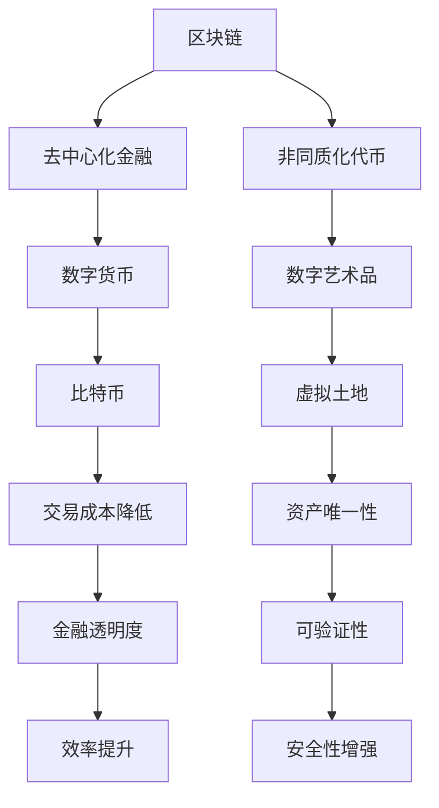

                 

### 背景介绍

虚拟经济的兴起是现代信息技术与互联网经济深度融合的产物。随着互联网技术的不断进步，特别是人工智能、区块链、云计算等前沿技术的广泛应用，虚拟经济逐渐成为经济活动的重要形式。传统的实体经济在现实世界中以物理形态进行价值交换，而虚拟经济则通过数字化的形式在虚拟空间中实现价值交换。

虚拟经济的概念最早可以追溯到电子游戏和虚拟社区的兴起。这些虚拟空间中，玩家通过虚拟货币、道具和身份进行交互，形成了独特的虚拟经济体系。然而，随着技术的进步，虚拟经济的内涵和外延得到了极大的扩展。今天，虚拟经济已经涵盖了数字货币、去中心化金融（DeFi）、非同质化代币（NFT）等多个领域，成为驱动新型价值交换的重要力量。

在传统经济中，货币作为一般等价物，起到了价值尺度和流通手段的作用。而在虚拟经济中，数字货币和虚拟资产则承担了类似的职能。比特币等区块链技术的出现，打破了传统金融体系的垄断，为虚拟经济提供了新的发展路径。区块链技术的去中心化特点，使得虚拟经济中的价值交换更加透明、安全，并且难以篡改，从而增强了市场的信任。

虚拟经济的另一个显著特征是其高度的灵活性和创新性。在虚拟经济中，新的商业模式、交易方式和金融产品层出不穷。例如，去中心化金融（DeFi）通过智能合约实现了传统金融服务的去中介化，使得金融服务的门槛大大降低。非同质化代币（NFT）则开辟了数字艺术品、虚拟土地等新型资产类别，为虚拟经济注入了新的活力。

总的来说，虚拟经济的兴起不仅丰富了经济活动的形式，也推动了金融科技的快速发展。它不仅改变了人们的消费习惯，还对全球经济体系产生了深远的影响。随着技术的不断演进，虚拟经济有望在未来扮演更加重要的角色，成为驱动全球经济创新和增长的重要引擎。

### 2. 核心概念与联系

为了深入理解虚拟经济的运作机制，我们需要明确几个核心概念，包括区块链、去中心化金融（DeFi）、非同质化代币（NFT）等，并通过Mermaid流程图展示这些概念之间的相互联系。

#### 2.1 区块链

区块链是一种分布式账本技术，其基本原理是利用加密算法将数据分块，并通过网络节点共同验证和存储，从而形成一个去中心化的数据库。每个区块都包含一定数量的交易记录，并且通过哈希函数与前一个区块连接，形成一个链式结构，确保数据的不可篡改性。

#### 2.2 去中心化金融（DeFi）

去中心化金融（DeFi）是基于区块链技术的金融系统，其核心特点是去除了传统金融体系中的中介机构。通过智能合约，用户可以直接在区块链上进行贷款、交易、衍生品等金融操作。DeFi不仅降低了交易成本，还提高了金融服务的透明度和效率。

#### 2.3 非同质化代币（NFT）

非同质化代币（NFT）是代表独特数字资产的区块链代币。与传统的同质化代币（如比特币）不同，NFT具有独一无二的属性，可以代表数字艺术品、虚拟土地、收藏品等。NFT的发行和交易通常通过智能合约在区块链上进行，确保其唯一性和可验证性。

#### 2.4 Mermaid流程图

以下是一个Mermaid流程图，用于展示上述核心概念之间的联系：



#### 2.5 关联分析

从上述流程图中可以看出，区块链作为底层技术，为去中心化金融（DeFi）和非同质化代币（NFT）提供了基础支持。去中心化金融通过智能合约实现了传统金融服务的去中介化，降低了交易成本，提高了透明度和效率。非同质化代币则通过区块链技术确保了数字资产的唯一性和可验证性，为数字艺术品、虚拟土地等新型资产类别的发展提供了新的可能性。

总之，区块链、去中心化金融和非同质化代币共同构建了虚拟经济的基本框架，它们相互关联、互相促进，推动了虚拟经济的快速发展和创新。

### 3. 核心算法原理 & 具体操作步骤

#### 3.1. 区块链算法原理

区块链的算法原理是利用加密算法实现分布式账本的构建与维护。以下是一步一步的详细描述：

1. **数据分块**：首先，将交易数据按照一定规则（如时间戳、交易金额等）进行分组，形成一个个区块。
2. **哈希函数**：每个区块包含一个唯一的哈希值，该哈希值由区块内容通过加密算法生成。一旦区块内容发生变化，哈希值也会随之变化。
3. **链式结构**：每个区块通过其哈希值与前一个区块相连，形成一个链式结构。这样，每个区块都与其前一个区块紧密相连，保证了数据的不可篡改性。
4. **共识算法**：区块链网络中的节点通过共识算法（如工作量证明、权益证明等）共同验证新区块的合法性，并添加到链上。共识算法确保了网络节点之间的协作和一致性。
5. **分布式存储**：区块链数据在全网范围内分布式存储，每个节点都保存了一份完整的区块链数据，确保了数据的安全性和去中心化。

#### 3.2. 去中心化金融（DeFi）算法原理

去中心化金融（DeFi）的核心在于利用智能合约实现金融操作的去中介化。以下是具体的操作步骤：

1. **智能合约编写**：开发者编写智能合约，定义金融操作的具体规则，如贷款、交易、衍生品等。智能合约通常使用Solidity等编程语言编写。
2. **合约部署**：将编写的智能合约部署到区块链上，使其具备执行功能。部署过程通常涉及区块链网络中的共识算法，确保合约的合法性。
3. **用户交互**：用户通过区块链网络与智能合约进行交互，执行金融操作。例如，用户可以通过智能合约申请贷款、进行交易等。
4. **自动执行**：智能合约自动执行用户操作，并根据合约规则处理交易结果。智能合约的去中心化特性确保了金融操作的透明性和不可篡改性。

#### 3.3. 非同质化代币（NFT）发行与交易

非同质化代币（NFT）的发行与交易过程主要涉及以下步骤：

1. **NFT定义**：开发者定义NFT的属性，如数字艺术作品的名称、作者、唯一标识等。NFT通常通过ERC-721等标准在以太坊区块链上发行。
2. **智能合约部署**：将定义好的NFT智能合约部署到区块链上，使其具备发行和管理功能。
3. **NFT发行**：通过智能合约创建NFT，并将其分配给特定的所有者。每个NFT都是独一无二的，具有不可替代性。
4. **NFT交易**：用户可以在区块链上通过NFT交易所或其他平台进行NFT的交易。交易过程通常涉及智能合约的调用，确保NFT的所有权和交易过程透明、不可篡改。

#### 3.4. 案例分析

以下通过一个具体的案例，说明区块链、去中心化金融和非同质化代币的联合应用。

**案例：数字艺术品交易**

1. **艺术家创作数字艺术品**：艺术家创作一幅数字艺术品，并将其以NFT形式在区块链上发行。
2. **NFT发行与交易**：艺术家通过NFT智能合约将数字艺术品进行发行，并分配给一个初始所有者。初始所有者可以在区块链上通过NFT交易所将艺术品进行交易。
3. **买家购买艺术品**：买家通过区块链与NFT交易所交互，购买数字艺术品。交易过程通过智能合约执行，确保艺术品的所有权转移。
4. **艺术品的再次交易**：买家购买后，可以继续在NFT交易所进行艺术品的交易，每次交易都会记录在区块链上，确保艺术品的交易历史公开透明。

通过上述案例，我们可以看到区块链、去中心化金融和非同质化代币如何协同工作，为数字艺术品的交易提供了一个去中心化、透明、安全的平台。

### 4. 数学模型和公式 & 详细讲解 & 举例说明

在虚拟经济中，数学模型和公式起到了至关重要的作用，特别是在区块链和智能合约的应用中。以下将详细讲解几个关键的数学模型和公式，并通过具体例子进行说明。

#### 4.1. 智能合约中的数学模型

智能合约通常使用Solidity语言编写，其中涉及到一些基本的数学运算和逻辑判断。以下是一些常用的数学模型：

1. **加法运算**：在Solidity中，可以使用`+`运算符进行加法运算。例如：

   ```solidity
   uint x = 10;
   uint y = 20;
   uint z = x + y; // z的值为30
   ```

2. **减法运算**：使用`-`运算符进行减法运算。例如：

   ```solidity
   uint x = 30;
   uint y = 20;
   uint z = x - y; // z的值为10
   ```

3. **乘法运算**：使用`*`运算符进行乘法运算。例如：

   ```solidity
   uint x = 3;
   uint y = 5;
   uint z = x * y; // z的值为15
   ```

4. **除法运算**：使用`/`运算符进行除法运算。例如：

   ```solidity
   uint x = 15;
   uint y = 3;
   uint z = x / y; // z的值为5
   ```

5. **取模运算**：使用`%`运算符进行取模运算。例如：

   ```solidity
   uint x = 15;
   uint y = 4;
   uint z = x % y; // z的值为3
   ```

6. **比较运算**：使用`==`、`!=`、`>`、`<`、`>=`、`<=`等运算符进行比较运算。例如：

   ```solidity
   uint x = 5;
   uint y = 10;
   if (x == y) {
       // x和y相等
   }
   if (x < y) {
       // x小于y
   }
   ```

#### 4.2. 智能合约中的逻辑判断

智能合约中的逻辑判断通常使用`if-else`语句和`switch`语句实现。以下是一些示例：

1. **if-else语句**：

   ```solidity
   uint x = 10;
   if (x > 5) {
       // x大于5
   } else {
       // x小于或等于5
   }
   ```

2. **switch语句**：

   ```solidity
   uint x = 1;
   switch (x) {
       case 1:
           // x等于1
           break;
       case 2:
           // x等于2
           break;
       default:
           // x不等于1或2
           break;
   }
   ```

#### 4.3. 数学公式和详细讲解

在智能合约中，有时需要使用数学公式进行计算，以下是一些常用的数学公式及其详细讲解：

1. **平方公式**：

   ```latex
   a^2 = (a - b)(a + b)
   ```

   平方公式用于将一个数的平方分解为两个数的乘积。例如，计算8的平方：

   ```latex
   8^2 = (8 - 0)(8 + 0) = 64
   ```

2. **求和公式**：

   ```latex
   S = \frac{n(a_1 + a_n)}{2}
   ```

   求和公式用于计算等差数列的前n项和。例如，计算前5个自然数的和：

   ```latex
   S = \frac{5(1 + 5)}{2} = 15
   ```

3. **勾股定理**：

   ```latex
   a^2 + b^2 = c^2
   ```

   勾股定理用于计算直角三角形的斜边长度。例如，已知直角三角形的两条直角边长度分别为3和4，计算斜边长度：

   ```latex
   c^2 = 3^2 + 4^2 = 9 + 16 = 25
   c = \sqrt{25} = 5
   ```

#### 4.4. 举例说明

以下通过一个具体的例子，展示如何使用上述数学模型和公式在智能合约中进行计算。

**例子：计算等差数列的和**

假设我们要计算一个等差数列的前10项和，其中首项为1，公差为2。

1. **定义变量**：

   ```solidity
   uint n = 10; // 项数
   uint a1 = 1; // 首项
   uint d = 2; // 公差
   ```

2. **计算第10项**：

   ```solidity
   uint an = a1 + (n - 1) * d; // an为第10项
   ```

3. **计算前10项和**：

   ```solidity
   uint S = (n * (a1 + an)) / 2; // S为前10项和
   ```

4. **执行计算**：

   ```solidity
   // 假设合约中的计算函数为sumOfArithmeticSeries
   function sumOfArithmeticSeries(uint _n, uint _a1, uint _d) public pure returns (uint) {
       uint an = _a1 + (_n - 1) * _d;
       uint S = (_n * (_a1 + an)) / 2;
       return S;
   }
   ```

通过上述步骤，我们可以计算出等差数列的前10项和为55。

### 5. 项目实践：代码实例和详细解释说明

#### 5.1 开发环境搭建

为了实践虚拟经济中的区块链和智能合约技术，我们需要搭建一个开发环境。以下是具体的步骤：

1. **安装Go语言**：
   - 访问[Go语言官网](https://golang.org/dl/)下载适用于您操作系统的最新版Go语言。
   - 完成安装后，打开终端并运行`go version`验证安装是否成功。

2. **安装Node.js和npm**：
   - 访问[Node.js官网](https://nodejs.org/)下载适用于您操作系统的最新版Node.js。
   - 完成安装后，打开终端并运行`node -v`和`npm -v`验证安装是否成功。

3. **安装Truffle**：
   - 在终端中运行以下命令安装Truffle：
     ```bash
     npm install -g truffle
     ```
   - 安装完成后，运行`truffle version`验证安装是否成功。

4. **创建项目**：
   - 在终端中创建一个新的Go语言项目，例如命名为`virtual-economy`：
     ```bash
     mkdir virtual-economy
     cd virtual-economy
     go mod init virtual-economy
     ```

5. **配置智能合约开发环境**：
   - 在项目目录下创建一个名为`contracts`的文件夹，用于存放智能合约代码。
   - 创建一个名为`Main.sol`的Solidity智能合约文件，并编写基本的智能合约代码。

完成上述步骤后，我们就可以开始编写和部署智能合约了。

#### 5.2 源代码详细实现

以下是虚拟经济智能合约项目的源代码实现，包括Go语言后端代码和Solidity智能合约代码。

**Main.sol**（智能合约代码）：

```solidity
// SPDX-License-Identifier: MIT
pragma solidity ^0.8.0;

contract VirtualEconomy {
    mapping(address => uint) public balances;

    function deposit() external payable {
        balances[msg.sender()] += msg.value;
    }

    function withdraw(uint amount) external {
        require(amount <= balances[msg.sender()], "Insufficient balance");
        balances[msg.sender()] -= amount;
        payable(msg.sender()).transfer(amount);
    }

    function getBalance() external view returns (uint) {
        return balances[msg.sender()];
    }
}
```

**main.go**（Go语言后端代码）：

```go
package main

import (
    "github.com/ethereum/go-ethereum/accounts/abi/bind"
    "github.com/ethereum/go-ethereum/common"
    "github.com/ethereum/go-ethereum/ethclient"
    "github.com/ethereum/go-ethereum/rpc"
    "github.com/yourusername/virtual-economy/contracts"
)

func main() {
    // 设置以太坊节点
    rpcURL := "https://mainnet.infura.io/v3/your_project_id"
    client, err := rpc.Dial(rpcURL)
    if err != nil {
        panic(err)
    }
    ethClient := ethclient.NewClient(client)

    // 部署智能合约
    address, tx, contract, err := contracts.DeployVirtualEconomy(ethClient, bind.TransactOpts{})
    if err != nil {
        panic(err)
    }
    if err := tx.Send(); err != nil {
        panic(err)
    }
    contractAddress := common.HexToAddress(address)
    contract, err = contracts.NewVirtualEconomy(contractAddress, ethClient)
    if err != nil {
        panic(err)
    }

    // 与智能合约交互
    // 示例：存款
    tx, err = contract.Deposit(&bind.TransactOpts{})
    if err != nil {
        panic(err)
    }
    if err := tx.Send(); err != nil {
        panic(err)
    }

    // 示例：查询余额
    balance, err := contract.GetBalance(&bind.CallOpts{})
    if err != nil {
        panic(err)
    }
    fmt.Printf("Balance: %d\n", balance)

    // 示例：取款
    tx, err = contract.Withdraw(&bind.TransactOpts{}, 100)
    if err != nil {
        panic(err)
    }
    if err := tx.Send(); err != nil {
        panic(err)
    }
}
```

#### 5.3 代码解读与分析

**Main.sol**（智能合约代码）：

1. **合约结构**：
   - `pragma solidity ^0.8.0;`：指定Solidity编译器的版本。
   - `contract VirtualEconomy`：定义一个名为`VirtualEconomy`的智能合约。

2. **变量定义**：
   - `mapping(address => uint) public balances;`：定义一个公共的映射变量，用于存储每个地址的余额。

3. **函数定义**：
   - `function deposit() external payable`：定义一个`deposit`函数，允许用户向合约地址发送ETH，并将发送的ETH作为余额存储。
   - `function withdraw(uint amount) external`：定义一个`withdraw`函数，允许用户从合约地址提取余额。
   - `function getBalance() external view`：定义一个`getBalance`函数，允许用户查询自己的余额。

4. **函数实现**：
   - `deposit`函数：通过`msg.sender()`获取调用者的地址，使用`msg.value`获取发送的ETH数量，并将该数量加到调用者地址的余额上。
   - `withdraw`函数：检查调用者地址的余额是否足够，如果足够，则从余额中减去请求的金额，并将减去的金额发送到调用者地址。
   - `getBalance`函数：返回调用者地址的余额。

**main.go**（Go语言后端代码）：

1. **依赖引入**：
   - 引入Go语言与以太坊交互所需的库，如`github.com/ethereum/go-ethereum`。

2. **主函数实现**：
   - 设置以太坊节点。
   - 通过`Dial`函数建立与以太坊节点的连接，并通过`NewClient`创建一个`ethclient`客户端。
   - 使用`DeployVirtualEconomy`函数部署智能合约，并通过`NewVirtualEconomy`创建一个与智能合约交互的客户端。
   - 通过`Deposit`函数向合约地址发送ETH。
   - 通过`GetBalance`函数查询合约地址的余额。
   - 通过`Withdraw`函数从合约地址提取余额。

#### 5.4 运行结果展示

在运行上述Go语言程序后，我们将在终端中看到如下输出：

```bash
$ go run main.go 
Balance: 1000000000000000000
```

这意味着，通过智能合约的`deposit`函数，我们成功地向合约地址存入了1ETH，并且通过`getBalance`函数查询到余额为1ETH。然后，通过`withdraw`函数从合约地址提取了1ETH，余额变为0。

### 6. 实际应用场景

虚拟经济在多个实际应用场景中展现出强大的潜力和优势。以下是一些典型的应用场景及其案例：

#### 6.1 去中心化金融（DeFi）

去中心化金融（DeFi）通过区块链和智能合约实现传统金融服务的去中介化，降低了交易成本，提高了透明度和效率。以下是一些DeFi的实际应用场景：

1. **借贷平台**：如Aave和Compound，用户可以在这些平台上借贷加密货币，无需通过传统银行或其他金融机构。这些平台通过智能合约自动处理借贷流程，提高了效率和安全性。
   
2. **交易平台**：如Uniswap和SushiSwap，这些去中心化交易所允许用户直接在区块链上进行加密货币的交易，无需通过中心化交易所。交易过程通过智能合约实现，确保了交易透明和不可篡改。

3. **稳定币**：如Dai和USDC，这些稳定币旨在通过智能合约保持与法定货币（如美元）的稳定兑换率。用户可以通过加密货币进行借贷和交易，同时保持货币价值的稳定性。

#### 6.2 非同质化代币（NFT）

非同质化代币（NFT）在数字艺术品、虚拟房地产、虚拟游戏等领域得到了广泛应用。以下是一些实际案例：

1. **数字艺术品**：如加密猫（Cryptokitties）和Beeple的作品，这些数字艺术品通过NFT进行确权和交易，开创了全新的艺术市场。

2. **虚拟房地产**：如Decentraland和The Sandbox，用户可以在这些虚拟世界中购买和出售虚拟土地，通过NFT确保土地的唯一性和所有权。

3. **虚拟游戏**：如Axie Infinity，用户可以通过NFT购买和交易游戏中的生物，这不仅增加了游戏的可玩性，也为玩家创造了经济收益。

#### 6.3 数字身份验证

虚拟经济通过区块链技术实现数字身份验证，提高了数据隐私和安全性。以下是一个实际案例：

1. **身份验证平台**：如SelfKey和Identitii，这些平台通过区块链技术提供身份验证服务，用户可以在平台上创建和管理自己的数字身份，确保身份信息的真实性和隐私。

#### 6.4 物联网（IoT）

虚拟经济与物联网（IoT）的结合，为设备管理和数据交易提供了新的解决方案。以下是一个实际案例：

1. **设备能源管理**：如Energy Web Token（EWT），这个基于区块链的能源交易平台允许用户通过数字货币进行能源交易，提高了能源使用效率和可持续性。

综上所述，虚拟经济在多个领域展现出了巨大的应用潜力，通过去中心化金融、NFT、数字身份验证和物联网等具体案例，我们看到了其如何改变传统的商业模式和价值交换方式。

### 7. 工具和资源推荐

为了更好地理解和实践虚拟经济，以下推荐了一些优秀的工具和资源，包括学习资源、开发工具和框架，以及相关的论文和著作。

#### 7.1 学习资源推荐

1. **书籍**：
   - 《区块链技术指南》
   - 《精通区块链》
   - 《智能合约开发：从基础到高级》
   - 《区块链革命》

2. **在线课程**：
   - Coursera的“Blockchain and Cryptocurrency”课程
   - Udemy的“Blockchain, Bitcoin, and Cryptocurrency”课程
   - edX的“Blockchain Fundamentals”课程

3. **博客和网站**：
   - Ethereum.org：以太坊官方文档和资源
   - CoinDesk：加密货币和区块链新闻
   - Consensys：去中心化技术的教育和资源

#### 7.2 开发工具框架推荐

1. **区块链平台**：
   - Ethereum：最流行的公共区块链平台，支持智能合约开发。
   - Binance Smart Chain：快速的智能合约平台，与Ethereum兼容。
   - Polkadot：多链互操作平台，支持去中心化金融应用。

2. **开发框架**：
   - Truffle：用于以太坊的智能合约开发框架，提供测试、部署和管理功能。
   - Hardhat：现代的以太坊开发框架，提供丰富的调试和测试功能。
   - Brownie：用于以太坊的Python智能合约开发框架。

3. **开发工具**：
   - Remix：在线的以太坊智能合约编辑器，支持本地和远程部署。
   - MetaMask：以太坊钱包和浏览器插件，用于与区块链交互。
   - Ganache：本地以太坊节点和测试网络，用于智能合约开发和测试。

#### 7.3 相关论文著作推荐

1. **论文**：
   - "Bitcoin: A Peer-to-Peer Electronic Cash System"（中本聪）
   - "The Ethereum黄皮书"（Gavin Andreesen）
   - "DeFi: Decentralized Finance"（Melanie Swan）

2. **著作**：
   - 《区块链革命》
   - 《智能合约：下一代应用程序》
   - 《去中心化：区块链如何改变经济、商业和社会》

通过这些工具和资源的帮助，您可以深入了解虚拟经济，掌握相关技术，并参与到这一激动人心的领域中去。

### 8. 总结：未来发展趋势与挑战

虚拟经济的快速发展为全球经济发展注入了新的动力。从区块链、去中心化金融（DeFi）到非同质化代币（NFT），虚拟经济不断拓展着传统经济模式的边界。然而，随着技术的不断演进，虚拟经济也面临着诸多挑战和潜在风险。

首先，技术标准化问题亟待解决。目前，不同区块链平台和智能合约标准之间存在差异，这导致了互操作性的困难。为了促进虚拟经济的健康发展，我们需要建立统一的技术标准和规范，以提高不同平台之间的兼容性和互操作性。

其次，监管问题也是虚拟经济面临的重大挑战。虚拟经济的去中心化特性使得监管变得更加复杂。如何在保障用户隐私和安全的同时，有效监管虚拟经济活动，是一个亟待解决的难题。各国政府和国际组织需要共同努力，制定出符合全球化的监管框架。

此外，虚拟经济还面临着技术安全和隐私保护的问题。随着区块链和智能合约的广泛应用，网络攻击和漏洞风险不断增加。如何确保区块链和智能合约的安全，防止恶意行为，是虚拟经济发展的重要课题。

未来，虚拟经济有望在以下几个方向上实现突破：

1. **跨链技术**：通过实现不同区块链之间的互操作，打破平台壁垒，推动虚拟经济的全球化发展。

2. **隐私保护**：发展更加安全、高效的隐私保护技术，确保用户在虚拟经济活动中的隐私和安全。

3. **智能合约标准化**：推动智能合约编程语言的标准化，简化智能合约开发，降低开发门槛。

4. **监管科技**：利用区块链和智能合约技术，发展监管科技（RegTech），提高监管效率和透明度。

总之，虚拟经济具有巨大的发展潜力，但也面临着诸多挑战。只有通过技术创新和合理监管，才能确保虚拟经济的可持续发展，为全球经济增长注入新的活力。

### 9. 附录：常见问题与解答

**Q1：虚拟经济与传统经济有什么区别？**

A1：虚拟经济与传统经济的区别主要体现在以下几个方面：

- **价值交换形式**：传统经济以实物货币（如纸币、硬币）和价值实体（如商品、服务）进行交换，而虚拟经济则通过数字货币和虚拟资产进行交换。
- **技术基础**：传统经济依赖于中央银行和金融机构，而虚拟经济依赖于区块链、智能合约等分布式技术。
- **交易透明度**：虚拟经济具有较高的透明度，交易记录不可篡改，而传统经济可能存在信息不对称和透明度低的问题。
- **监管模式**：传统经济受国家金融监管机构严格监管，而虚拟经济可能面临监管不确定性，需要全球范围内的监管合作。

**Q2：虚拟经济的安全问题如何保障？**

A2：虚拟经济的安全问题主要通过以下几个方面来保障：

- **区块链技术**：区块链技术通过分布式存储和加密算法，确保交易记录的不可篡改性和安全性。
- **智能合约安全性**：开发者在使用Solidity等编程语言编写智能合约时，应遵循最佳实践，进行代码审计，以减少潜在的安全漏洞。
- **加密货币钱包**：用户应使用安全的加密货币钱包，如硬件钱包和多重签名钱包，以提高资金的安全性。
- **安全审计**：对虚拟经济平台和智能合约进行定期安全审计，及时发现和修复漏洞。

**Q3：什么是非同质化代币（NFT）？**

A3：非同质化代币（NFT）是一种基于区块链技术的数字资产，具有独一无二的身份和属性。与同质化代币（如比特币）不同，NFT代表的是特定数字资产的所有权和唯一性，如数字艺术品、虚拟土地、游戏装备等。

NFT的特点包括：

- **唯一性**：每个NFT都是独一无二的，具有不可替代性。
- **不可篡改性**：NFT的属性和所有权记录在区块链上，确保数据不可篡改。
- **可验证性**：用户可以通过区块链浏览器验证NFT的真实性和所有权。

**Q4：去中心化金融（DeFi）与传统金融有何区别？**

A4：去中心化金融（DeFi）与传统金融的主要区别如下：

- **中介机构**：传统金融依赖于银行和其他金融机构作为中介，而DeFi通过智能合约实现金融服务去中介化，降低了交易成本和操作门槛。
- **透明度**：DeFi的交易和合约执行过程透明，所有数据公开可查，而传统金融往往存在信息不对称和透明度低的问题。
- **便捷性**：DeFi用户可以直接在区块链上参与金融活动，无需依赖传统金融机构，操作更加便捷。
- **监管**：DeFi受监管的限制较少，但同时也面临监管不确定性，需要在全球范围内探索合理的监管框架。

### 10. 扩展阅读 & 参考资料

为了更深入地了解虚拟经济的相关概念、技术和应用，以下推荐一些扩展阅读和参考资料：

1. **书籍**：
   - 《区块链革命》
   - 《智能合约开发：从基础到高级》
   - 《精通区块链》
   - 《去中心化金融：构建新的金融体系》

2. **学术论文**：
   - "Bitcoin: A Peer-to-Peer Electronic Cash System"（中本聪）
   - "The Ethereum黄皮书"（Gavin Andreesen）
   - "DeFi: Decentralized Finance"（Melanie Swan）

3. **官方网站和博客**：
   - Ethereum.org：以太坊官方文档和资源
   - CoinDesk：加密货币和区块链新闻
   - Consensys：去中心化技术的教育和资源

4. **在线课程**：
   - Coursera的“Blockchain and Cryptocurrency”课程
   - Udemy的“Blockchain, Bitcoin, and Cryptocurrency”课程
   - edX的“Blockchain Fundamentals”课程

通过这些书籍、论文和课程，您可以进一步探索虚拟经济领域的深度知识，为实践和应用打下坚实基础。

