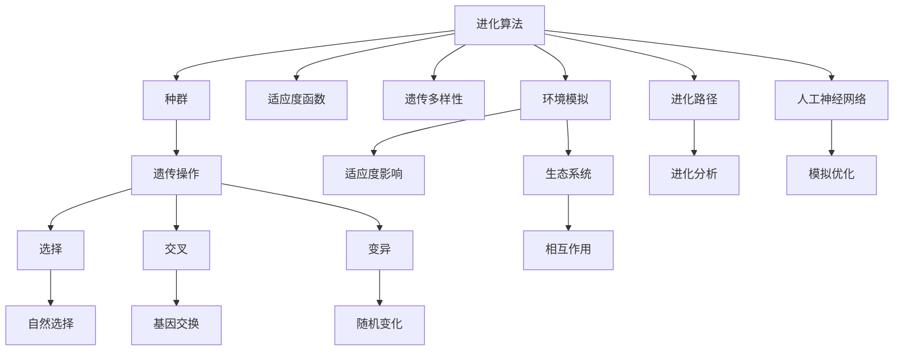

                 

### 背景介绍

#### 人工智能的崛起与虚拟生态系统的兴起

人工智能（AI）在过去几十年中取得了飞速的发展，从简单的规则系统到如今能够处理复杂任务的智能体，AI 在各个领域都展现出了巨大的潜力。随着计算能力的不断提升和大数据的广泛应用，人工智能的研究和应用场景日益丰富。从自动驾驶汽车到智能家居，从医疗诊断到金融风控，AI 已经成为了现代科技的重要组成部分。

与此同时，虚拟生态系统的概念也逐渐崭露头角。虚拟生态系统是一个模拟真实生态系统的数字环境，它可以在计算机中创建、运行和演化。这种数字生态系统不仅能够为科学家和研究人员提供一个研究生态过程和生物进化的平台，还可以为游戏开发者、艺术家和设计师提供一个创作和展示虚拟世界的工具。

在这种背景下，虚拟进化模拟器应运而生。虚拟进化模拟器是一种利用人工智能技术构建的数字生态系统实验室，它通过模拟生物进化的过程，帮助我们更好地理解生物多样性的形成、生态系统的动态变化以及环境因素对生物的影响。

本文将重点探讨虚拟进化模拟器的工作原理、核心算法、数学模型以及实际应用场景。通过逐步分析推理，我们将深入了解这一新兴领域的奥秘，并展望其未来发展的趋势和挑战。

#### 虚拟进化模拟器的定义与作用

虚拟进化模拟器是一种通过计算机模拟来模拟生物进化过程的工具。它利用人工智能技术，特别是遗传算法和神经网络，来模拟生物种群在环境压力下的进化过程。在这个过程中，生物体通过遗传、变异和自然选择等机制不断演化，最终形成多样化的生物种群。

虚拟进化模拟器的作用主要体现在以下几个方面：

1. **科学研究**：虚拟进化模拟器为生态学家和生物学家提供了一个研究生物进化、物种多样性和生态系统动态变化的平台。通过模拟不同的环境和条件，科学家可以观察和理解生物进化的机制，预测未来生物种群的变化趋势。

2. **教育推广**：虚拟进化模拟器能够直观地展示生物进化的过程，为生物学教育提供了一种生动有趣的工具。学生和教师可以通过模拟实验，更好地理解生物学的基本概念和理论，提高学习兴趣和效果。

3. **人工智能研究**：虚拟进化模拟器在人工智能领域也有广泛的应用。它为研究人员提供了一个实验平台，可以测试和优化不同的进化算法和神经网络模型，推动人工智能技术的进步。

4. **生态保护**：虚拟进化模拟器可以帮助生态学家评估人类活动对生态系统的影响，为生态保护和环境管理提供科学依据。通过模拟不同的环境变化和人类干扰，研究人员可以预测生态系统的未来状态，提出有效的保护策略。

总之，虚拟进化模拟器作为一种新兴的数字生态系统实验室，具有广泛的应用前景和研究价值。它不仅为科学研究提供了新的工具和方法，还为人工智能和生态保护等领域的发展注入了新的动力。

#### 虚拟进化模拟器的发展历程

虚拟进化模拟器的发展历程可以追溯到20世纪中期，当时计算机科学和生物学研究刚刚开始交汇。早期的研究主要集中在模拟简单的生物进化过程，这些模型通常基于规则系统，用以模拟种群数量、遗传变异等基本概念。

1950年代，计算机科学家约翰·冯·诺依曼（John von Neumann）提出了“自动机理论”，为后来的虚拟进化模拟器提供了理论基础。冯·诺依曼的“生殖机器”（Reproductive Automata）模型，通过简单的规则和遗传算法，模拟了生物的繁殖和进化过程。

1960年代，计算机科学家约翰·霍普菲尔德（John Hopfield）提出了“霍普菲尔德神经网络”（Hopfield Network），这是一种能量函数驱动的循环神经网络。霍普菲尔德神经网络不仅可以用于联想记忆，还可以用于模拟生物进化中的遗传变异和选择过程。

1980年代，随着遗传算法（Genetic Algorithm）的发展，虚拟进化模拟器逐渐走向成熟。遗传算法是由美国计算机科学家约翰·霍兰德（John Holland）提出的，它通过模拟自然选择和遗传变异过程，解决了一系列复杂优化问题。

1990年代，虚拟进化模拟器的应用范围进一步扩大。计算机科学家和生物学家开始利用虚拟进化模拟器研究更复杂的生态系统，如食物网、捕食者-猎物模型等。这一时期，虚拟进化模拟器不仅在学术研究中发挥了重要作用，还在工业设计和游戏开发中得到了应用。

进入21世纪，随着人工智能和大数据技术的发展，虚拟进化模拟器的能力得到了进一步提升。现代虚拟进化模拟器不仅能够处理更复杂的模型，还可以利用机器学习和深度学习技术，实现更加智能化的模拟和分析。

近年来，虚拟进化模拟器在生物医学、环境保护和可持续发展等领域取得了显著成果。例如，通过模拟基因突变和环境变化，研究人员可以预测疾病的传播和演化，为公共卫生决策提供科学依据；通过模拟不同的人类活动对生态系统的影响，可以为生态保护和环境保护提供策略建议。

总体来看，虚拟进化模拟器的发展历程体现了计算机科学和生物学交叉融合的巨大潜力。它不仅为科学研究提供了新的工具和方法，也为解决现实世界的复杂问题提供了新的思路和方案。

#### 虚拟进化模拟器的主要功能与应用领域

虚拟进化模拟器作为一种高度复杂的计算机模拟工具，具备众多功能，并广泛应用于多个领域。以下是对其主要功能的介绍及其在相关应用领域的具体表现：

##### 1. 多样性模拟

多样性模拟是虚拟进化模拟器最核心的功能之一。通过模拟不同环境条件下生物种群多样性的变化，研究人员可以了解多样性如何通过进化过程形成和维持。在实际应用中，多样性模拟可以帮助生态学家研究物种在气候变化、栖息地破坏等环境压力下的适应性，为生物多样性保护和恢复提供科学依据。

##### 2. 遗传算法优化

虚拟进化模拟器利用遗传算法来优化复杂的系统。遗传算法模拟了自然选择和遗传变异过程，通过迭代和进化，找到最优解。这种算法在工业设计、电路设计、金融风控等多个领域都有广泛应用。例如，在芯片设计过程中，虚拟进化模拟器可以帮助优化电路布局，提高芯片的性能和稳定性。

##### 3. 进化路径分析

虚拟进化模拟器能够模拟生物种群在不同时间点的进化路径。通过分析这些路径，研究人员可以了解物种如何从原始状态演化到当前状态，以及影响进化过程的因素。这种分析对于理解生物进化机制和预测未来进化趋势具有重要意义。例如，在癌症研究中，虚拟进化模拟器可以帮助研究人员分析肿瘤细胞的进化路径，从而制定更有效的治疗策略。

##### 4. 环境影响评估

虚拟进化模拟器可以模拟不同环境因素对生态系统的影响。研究人员可以通过改变气候、污染水平、栖息地面积等参数，观察这些变化对生物种群和生态系统的影响。这种模拟有助于评估人类活动对环境的潜在影响，为环境保护和可持续发展提供科学依据。例如，在气候变化研究中，虚拟进化模拟器可以模拟未来不同温室气体排放水平下的生物种群变化，帮助制定应对策略。

##### 5. 教育与科普

虚拟进化模拟器作为一种互动性强、直观生动的工具，在生物学教育和科普中发挥了重要作用。学生和公众可以通过虚拟进化模拟器直观地了解生物进化的过程，增强对生物学基本概念的理解。此外，虚拟进化模拟器还可以用于模拟实验，让学生在虚拟环境中进行实践操作，提高学习兴趣和效果。

##### 应用领域

虚拟进化模拟器在多个领域都有广泛应用。以下是一些具体的应用案例：

1. **生态学**：在生态学研究中，虚拟进化模拟器可以用于模拟生物种群的动态变化，研究物种多样性的形成和维持机制，评估人类活动对生态系统的影响。

2. **生物学**：在生物学研究中，虚拟进化模拟器可以用于模拟基因突变和进化过程，研究生物进化的机制和规律，为生物医学研究提供理论基础。

3. **人工智能**：在人工智能领域，虚拟进化模拟器可以用于测试和优化不同的进化算法和神经网络模型，推动人工智能技术的进步。

4. **工业设计**：在工业设计中，虚拟进化模拟器可以用于优化产品设计，提高产品的性能和稳定性。

5. **环境保护**：在环境保护领域，虚拟进化模拟器可以用于模拟不同环境因素对生态系统的影响，为环境保护和可持续发展提供科学依据。

6. **医疗健康**：在医疗健康领域，虚拟进化模拟器可以用于模拟疾病传播和进化过程，为公共卫生决策提供科学依据。

7. **教育**：在生物学教育中，虚拟进化模拟器作为一种互动性强、直观生动的工具，可以帮助学生更好地理解生物进化的过程，提高学习兴趣和效果。

总之，虚拟进化模拟器作为一种功能强大的计算机模拟工具，具备广泛的应用前景和研究价值。它不仅在科学研究中发挥了重要作用，还在教育、工业设计和环境保护等领域展示了巨大的潜力。随着技术的不断进步和应用领域的扩大，虚拟进化模拟器的应用范围将越来越广泛，为人类理解和解决复杂的生物进化问题提供有力支持。

#### 人工智能与虚拟进化模拟器的关系

人工智能（AI）与虚拟进化模拟器之间存在着密切的关系，二者相互促进，共同推动了虚拟生态系统的研究和发展。首先，人工智能技术为虚拟进化模拟器提供了强大的计算能力和智能化的模拟方法。

**1. 遗传算法与进化模拟**

遗传算法（GA）是虚拟进化模拟器的核心算法之一，它基于自然选择和遗传变异的原理，通过迭代和进化寻找最优解。遗传算法的成功离不开人工智能的支撑，特别是机器学习和深度学习技术的发展，使得遗传算法能够处理更复杂的模型和数据。

**2. 神经网络与模拟优化**

神经网络（NN）是另一种广泛应用于虚拟进化模拟器的人工智能技术。神经网络通过模拟生物神经系统的结构和功能，可以用于优化模拟参数和模型结构，提高模拟的精度和效率。特别是深度学习技术的发展，使得神经网络能够处理大规模数据和复杂的非线性关系，为虚拟进化模拟器提供了更加智能化的模拟方法。

**3. 数据分析与模型预测**

人工智能技术还用于虚拟进化模拟器中的数据分析和模型预测。通过大数据分析和机器学习算法，研究人员可以提取关键信息，识别潜在的进化模式和趋势。这些分析结果不仅可以用于优化模拟参数，还可以用于预测未来生态系统的变化，为决策提供科学依据。

**4. 智能交互与用户定制**

虚拟进化模拟器通常需要与用户进行互动，人工智能技术使得这种交互更加智能化和个性化。通过自然语言处理和智能推荐算法，虚拟进化模拟器可以根据用户的操作和历史记录，提供个性化的模拟方案和建议，提高用户的使用体验。

**5. 多领域交叉融合**

人工智能与虚拟进化模拟器的交叉融合，催生了多个新兴研究领域。例如，在生物医学领域，人工智能技术可以帮助虚拟进化模拟器更好地模拟疾病传播和进化过程，为公共卫生决策提供支持；在生态保护领域，人工智能技术可以用于监测和预测生态系统的变化，为环境保护提供数据支持。

总之，人工智能与虚拟进化模拟器之间的关系是相辅相成的。人工智能技术为虚拟进化模拟器提供了强大的计算能力和智能化的模拟方法，而虚拟进化模拟器则为人工智能技术提供了丰富的应用场景和实验平台。随着二者的不断融合和发展，虚拟进化模拟器在科学研究、教育推广和实际应用中的价值将得到进一步提升。

#### 虚拟进化模拟器的核心概念与联系

要深入理解虚拟进化模拟器，首先需要掌握其核心概念和基本原理。以下是虚拟进化模拟器的几个关键概念及其相互之间的联系。

**1. 进化算法**

进化算法是虚拟进化模拟器的核心，它模拟了自然选择和遗传变异的过程。常见的进化算法包括遗传算法（Genetic Algorithm, GA）、遗传规划（Genetic Programming, GP）和协同进化算法（Cooperative Coevolution）。这些算法通过迭代和进化，从初始种群中不断筛选出最优个体，从而实现优化问题求解。

**2. 种群**

种群是进化算法的基本单位，代表了一组待优化的个体。在虚拟进化模拟器中，种群中的每个个体通常表示一个可能的解决方案。通过不断迭代和进化，种群中的个体会逐渐趋向最优解。

**3. 适应度函数**

适应度函数是衡量个体优劣的标准，用于评估每个个体的适应度。在虚拟进化模拟器中，适应度函数通常是一个实值函数，个体适应度越高，越接近最优解。适应度函数的设计对进化算法的性能有重要影响。

**4. 遗传操作**

遗传操作是进化算法的关键步骤，包括选择、交叉、变异和继承等。这些操作模拟了生物进化中的自然选择和遗传变异过程，用于生成新的种群。选择操作根据适应度函数选择优秀个体，交叉操作通过交换个体基因生成新的个体，变异操作引入随机变化，以增加种群的多样性。

**5. 自然选择**

自然选择是进化算法的核心原理，它模拟了自然环境中个体竞争和生存的过程。在虚拟进化模拟器中，通过适应度函数评估个体优劣，适应度较高的个体有更高的概率生存并传递基因给下一代。

**6. 遗传多样性**

遗传多样性是种群的一个重要属性，它反映了种群中基因变异的丰富程度。高遗传多样性有助于种群适应复杂多变的环境，提高进化的稳健性。在虚拟进化模拟器中，通过适当的变异操作和选择策略，可以维持种群的遗传多样性。

**7. 环境模拟**

环境模拟是虚拟进化模拟器的另一个核心概念，它模拟了个体所处的环境条件。环境因素可以通过适应度函数影响个体的适应度，从而影响进化的方向和速度。虚拟进化模拟器可以通过调整环境参数，研究不同环境条件下生物种群的进化行为。

**8. 进化路径**

进化路径是虚拟进化模拟器中个体在进化过程中适应度的变化轨迹。通过分析进化路径，可以了解种群进化的动态过程和影响因素。进化路径分析有助于优化进化算法参数，提高进化效率。

**9. 生态系统**

生态系统是虚拟进化模拟器模拟的对象，它由多个生物种群和其环境构成。在虚拟进化模拟器中，可以通过模拟不同生物种群之间的相互作用和生态系统动态，研究生态系统的稳定性和多样性。

**10. 人工神经网络**

人工神经网络是虚拟进化模拟器中常用的智能模型，它可以用于优化模拟参数和预测进化结果。神经网络通过学习历史数据，可以预测个体适应度的变化趋势，从而辅助进化算法的决策。

**Mermaid 流程图**

以下是虚拟进化模拟器核心概念的 Mermaid 流程图表示：



通过这个流程图，我们可以清晰地看到虚拟进化模拟器中各个核心概念之间的联系，以及它们在进化过程中如何相互影响和作用。

### 核心算法原理 & 具体操作步骤

#### 遗传算法的基本原理

遗传算法（Genetic Algorithm，GA）是一种基于自然选择和遗传学原理的优化算法。它模仿生物进化的过程，通过迭代和进化来寻找问题的最优解。遗传算法的核心思想是利用选择、交叉和变异等操作来模拟生物种群的进化，从而逐步优化解空间中的个体。

**1. 选择操作**

选择操作是遗传算法中的第一个关键步骤。选择操作的目的是从当前种群中选择出适应度较高的个体，以便它们的基因可以传递给下一代。常见的选择方法包括轮盘赌选择、锦标赛选择和排名选择等。

- **轮盘赌选择**：根据个体的适应度比例来分配选择概率，适应度越高的个体被选中的概率越大。这种选择方法模拟了自然界中“适者生存”的原则。
- **锦标赛选择**：从种群中随机选择几个个体（如k个），适应度最高的个体被选中。这种方法具有随机性，有助于防止早熟收敛。
- **排名选择**：根据个体的适应度进行排序，然后按顺序选择。适应度较低的个体被淘汰，适应度较高的个体优先选择。

**2. 交叉操作**

交叉操作模拟了生物繁殖中的基因组合过程，通过交换两个个体的基因来生成新的个体。交叉操作通常在两个适应度较高的个体之间进行，以产生更优秀的后代。

- **单点交叉**：在个体的基因序列中随机选择一个交叉点，将交叉点之前的基因与另一个个体的相同部分进行交换。
- **多点交叉**：在个体的基因序列中随机选择多个交叉点，进行多段基因的交换。多点交叉可以产生更多的基因组合，但计算复杂度也更高。

**3. 变异操作**

变异操作是遗传算法中的另一个关键步骤，它通过引入随机变化来增加种群的多样性。变异操作可以防止种群过早收敛到局部最优解，从而有助于找到全局最优解。

- **基因变异**：在个体的基因序列中随机选择一个或多个基因，将其替换为其他基因或随机值。
- **位变异**：在个体的二进制表示中随机选择一个或多个位，将其取反。

**4. 初始种群**

初始种群是遗传算法的起点，它包含了一组随机的个体。初始种群的质量对遗传算法的性能有重要影响。为了生成高质量的初始种群，可以采用以下方法：

- **随机生成**：直接随机生成一组个体作为初始种群。
- **启发式生成**：利用问题领域的知识，通过启发式方法生成一组初始个体。
- **混合生成**：将随机生成和启发式生成相结合，生成更具有代表性的初始种群。

**5. 进化迭代**

遗传算法通过迭代过程不断进化种群，直至满足终止条件。每个迭代过程包括选择、交叉和变异操作。在每次迭代后，种群中的个体会根据适应度函数进行评估，并生成新的种群。

- **适应度评估**：计算每个个体的适应度值，以衡量其优劣。
- **选择操作**：从当前种群中选择出适应度较高的个体，用于生成下一代。
- **交叉操作**：在选择的个体之间进行交叉操作，生成新的个体。
- **变异操作**：对新生成的个体进行变异操作，增加种群的多样性。
- **终止条件**：当满足终止条件（如达到最大迭代次数或找到最优解）时，算法终止。

通过以上步骤，遗传算法可以在解空间中逐步搜索，找到最优或近似最优解。遗传算法具有强大的全局搜索能力和良好的收敛性，被广泛应用于各种优化问题，如函数优化、组合优化和机器学习等。

#### 遗传算法的具体实现步骤

遗传算法（Genetic Algorithm，GA）是一种模拟自然选择和遗传机制的优化算法，具体实现步骤如下：

**1. 初始种群生成**

- **参数设置**：首先设置遗传算法的参数，包括种群大小（Population Size）、交叉概率（Crossover Probability）、变异概率（Mutation Probability）和最大迭代次数（Maximum Generations）等。
- **随机初始化**：随机生成初始种群。种群中的每个个体都表示一个可能的解，可以通过随机生成或启发式方法生成。例如，对于函数优化问题，可以随机生成一组数值作为初始种群；对于组合优化问题，可以随机生成一组解。
- **适应度评估**：计算每个个体的适应度值。适应度值用于衡量个体的优劣，通常是一个实值函数，其值越高表示个体越接近最优解。

**2. 选择操作**

- **选择方法**：根据预定的选择方法（如轮盘赌选择、锦标赛选择或排名选择）从当前种群中选择出适应度较高的个体。选择方法决定了如何从种群中挑选出优秀的个体，以传递其基因给下一代。
- **适应度分配**：根据个体的适应度值，为其分配选择概率。适应度较高的个体被赋予较高的选择概率，从而更有可能被选中。
- **选择结果**：从种群中随机选择若干个个体，形成一个新的子种群，用于生成下一代。

**3. 交叉操作**

- **交叉方法**：根据预定的交叉方法（如单点交叉、多点交叉或均匀交叉）对选中的个体进行交叉操作。交叉操作通过交换两个个体的基因片段，生成新的个体。
- **交叉概率**：设置交叉概率，决定交叉操作的执行概率。交叉概率越高，个体之间基因重组的机会越大，种群多样性也越高。
- **交叉结果**：执行交叉操作后，生成新的子种群，其中包含部分原始个体的基因片段和部分交叉产生的基因片段。

**4. 变异操作**

- **变异方法**：根据预定的变异方法（如基因变异或位变异）对个体进行变异操作。变异操作通过引入随机变化，增加种群的多样性。
- **变异概率**：设置变异概率，决定变异操作的执行概率。变异概率越高，个体发生变异的机会越大，种群适应度也越高。
- **变异结果**：执行变异操作后，生成新的子种群，其中包含部分原始个体和部分经过变异的个体。

**5. 进化迭代**

- **适应度评估**：计算新一代种群中每个个体的适应度值，以衡量其优劣。
- **选择操作**：从新一代种群中选择出适应度较高的个体，用于生成下一代。
- **交叉操作**：在选中的个体之间进行交叉操作，生成新的个体。
- **变异操作**：对新生成的个体进行变异操作，增加种群的多样性。
- **迭代过程**：重复上述步骤，直到满足终止条件（如达到最大迭代次数或找到最优解）。

**6. 终止条件**

- **最大迭代次数**：当达到预定的最大迭代次数时，算法终止。
- **最优解条件**：当找到满足预定最优解条件（如适应度值达到阈值）的个体时，算法终止。

通过以上步骤，遗传算法可以在解空间中逐步搜索，找到最优或近似最优解。遗传算法具有强大的全局搜索能力和良好的收敛性，被广泛应用于各种优化问题。

#### 人工神经网络的基本原理

人工神经网络（Artificial Neural Network，ANN）是模拟生物神经系统的计算模型，通过模拟神经元之间的连接和激活方式，实现对输入数据的处理和分析。人工神经网络由多个层组成，包括输入层、隐藏层和输出层。每一层包含多个神经元，神经元之间通过权重进行连接。

**1. 神经元与激活函数**

神经元是人工神经网络的基本单元，它通过接收输入信号、计算加权求和并应用激活函数来生成输出。一个简单的神经元模型可以表示为：

\[ z = \sum_{i=1}^{n} w_i x_i \]
\[ a = f(z) \]

其中，\( z \) 是加权求和的结果，\( w_i \) 是输入 \( x_i \) 的权重，\( f(z) \) 是激活函数，用于将加权求和的结果转化为神经元的输出。

常见的激活函数包括：
- **线性激活函数**：\( f(z) = z \)，常用于隐藏层，但不适用于输出层，因为它不能区分不同类别的输出。
- **Sigmoid激活函数**：\( f(z) = \frac{1}{1 + e^{-z}} \)，输出范围在 \( (0, 1) \) 之间，常用于分类问题。
- **ReLU激活函数**：\( f(z) = \max(0, z) \)，输出为 \( z \) 或 0，可以加快神经网络的训练速度。

**2. 前向传播**

前向传播是神经网络处理输入数据的过程。给定输入 \( x \)，神经网络从输入层开始，逐层计算每个神经元的输出。前向传播的过程可以表示为：

\[ z_{l} = \sum_{i=1}^{n} w_{li} x_{i} + b_{l} \]
\[ a_{l} = f(z_{l}) \]

其中，\( z_{l} \) 是第 \( l \) 层神经元的加权求和结果，\( a_{l} \) 是第 \( l \) 层神经元的输出，\( w_{li} \) 是输入层到第 \( l \) 层的权重，\( b_{l} \) 是第 \( l \) 层的偏置。

前向传播从输入层开始，依次计算隐藏层和输出层的输出，最终得到输出层的预测结果。

**3. 反向传播**

反向传播是神经网络训练的核心过程，用于更新网络的权重和偏置，以减少预测误差。反向传播的过程包括以下几个步骤：

1. **计算误差**：计算输出层的实际输出与预测输出之间的误差。误差可以通过损失函数（如均方误差、交叉熵损失等）计算得到。

\[ \delta_{l} = \frac{\partial L}{\partial a_{l}} \cdot f'(z_{l}) \]

其中，\( \delta_{l} \) 是第 \( l \) 层神经元的误差，\( L \) 是损失函数，\( f'(z_{l}) \) 是激活函数的导数。

2. **反向传播误差**：从输出层开始，依次计算隐藏层的误差。误差通过前一层神经元的误差和当前层权重的导数进行计算。

\[ \delta_{l-1} = (w_{l-1:l})^T \delta_{l} \cdot f'(z_{l-1}) \]

3. **更新权重和偏置**：根据误差和梯度下降法更新每个神经元的权重和偏置。

\[ w_{l} = w_{l} - \alpha \frac{\partial L}{\partial w_{l}} \]
\[ b_{l} = b_{l} - \alpha \frac{\partial L}{\partial b_{l}} \]

其中，\( \alpha \) 是学习率，用于调节权重的更新步长。

通过以上步骤，神经网络不断调整权重和偏置，以最小化损失函数，提高预测精度。反向传播是神经网络训练的核心过程，使得神经网络能够通过学习大量数据不断优化模型。

#### 人工神经网络在虚拟进化模拟器中的应用

人工神经网络（Artificial Neural Network，ANN）在虚拟进化模拟器中有着广泛的应用，特别是在优化模拟参数、预测进化结果和自适应调整环境方面。以下是人工神经网络在虚拟进化模拟器中的应用和具体实现方法：

**1. 模拟参数优化**

虚拟进化模拟器的运行效果在很大程度上取决于参数设置，如种群大小、交叉概率、变异概率等。人工神经网络可以通过学习历史模拟数据，自动优化这些参数，提高模拟的准确性和效率。具体方法如下：

- **数据收集**：在多次模拟过程中，收集不同参数设置下的模拟结果，包括适应度值、种群多样性、进化路径等。
- **神经网络训练**：利用收集的数据，训练一个神经网络模型，将参数设置作为输入，模拟结果作为输出。训练目标是找到一组最优参数，使模拟结果达到预期效果。
- **参数优化**：通过反向传播算法，不断调整神经网络的权重和偏置，优化参数设置。优化过程可以采用梯度下降法或其他优化算法，以最小化模拟误差。

**2. 进化结果预测**

在虚拟进化模拟器中，预测未来进化趋势对理解和指导生态系统的演化具有重要意义。人工神经网络可以通过学习历史进化数据，预测未来进化结果，为生态保护和决策提供依据。具体方法如下：

- **数据收集**：在多次模拟过程中，记录不同时间点的种群状态，包括个体数量、基因特征等。
- **神经网络训练**：利用历史数据，训练一个神经网络模型，将当前种群状态作为输入，未来进化结果作为输出。训练目标是建立种群状态与未来进化结果之间的关系。
- **结果预测**：通过神经网络模型，输入当前种群状态，预测未来进化趋势。预测结果可以帮助研究人员了解进化过程的动态变化，提前采取应对措施。

**3. 自适应环境调整**

虚拟进化模拟器中的环境条件对生物种群的进化有重要影响。通过人工神经网络，可以实现对环境条件的自适应调整，以模拟不同环境条件下的进化过程。具体方法如下：

- **环境建模**：构建一个环境条件模型，将环境因素（如温度、光照、资源等）作为输入，种群适应度作为输出。
- **神经网络训练**：利用历史数据，训练一个神经网络模型，将环境因素作为输入，种群适应度作为输出。训练目标是建立环境条件与种群适应度之间的关系。
- **环境调整**：在模拟过程中，根据神经网络模型的预测结果，实时调整环境条件。通过自适应调整环境，可以模拟不同环境条件下的进化过程，研究环境对生物种群的影响。

**4. 模型融合与优化**

人工神经网络可以与其他优化算法（如遗传算法、粒子群优化等）相结合，实现模型的融合与优化。具体方法如下：

- **模型融合**：将人工神经网络与遗传算法、粒子群优化等算法相结合，利用神经网络优化参数设置，利用遗传算法或粒子群优化优化模型结构。
- **模型优化**：通过融合算法的优势，提高模拟的准确性和效率。例如，利用遗传算法的全局搜索能力，优化神经网络的结构和参数，从而提高模型的泛化能力。

总之，人工神经网络在虚拟进化模拟器中的应用，不仅提高了模拟的精度和效率，还为生态系统的研究和预测提供了新的工具和方法。通过不断优化模拟参数、预测进化结果和自适应调整环境，人工神经网络为虚拟进化模拟器的发展注入了新的动力。

#### 数学模型和公式 & 详细讲解 & 举例说明

在虚拟进化模拟器中，数学模型和公式是理解和实现核心算法的重要工具。以下将详细讲解几个关键的数学模型和公式，并举例说明如何应用这些模型来解决实际问题。

**1. 适应度函数**

适应度函数是虚拟进化模拟器中评估个体优劣的关键指标，它通常用来衡量个体在特定环境下的生存能力和适应度。一个常见的适应度函数是：

\[ f(x) = \frac{1}{1 + e^{-(w \cdot x + b)}} \]

其中，\( x \) 是个体的特征向量，\( w \) 是权重向量，\( b \) 是偏置项。这个函数可以被视为一个逻辑函数，其输出值介于 0 和 1 之间，表示个体的适应度。

**示例**：假设我们要优化一个包含两个特征的个体，特征向量 \( x = [x_1, x_2] \)，权重向量 \( w = [w_1, w_2] \)，偏置 \( b = b \)。一个简单的适应度函数可以是：

\[ f(x) = \frac{1}{1 + e^{-(w_1 \cdot x_1 + w_2 \cdot x_2 + b)}} \]

例如，给定特征向量 \( x = [2, 3] \)，权重向量 \( w = [1, 2] \)，偏置 \( b = 1 \)，我们可以计算适应度值：

\[ f(x) = \frac{1}{1 + e^{-(1 \cdot 2 + 2 \cdot 3 + 1)}} = \frac{1}{1 + e^{-8}} \approx 0.999 \]

**2. 遗传算法中的交叉与变异概率**

在遗传算法中，交叉概率（Crossover Probability，Pc）和变异概率（Mutation Probability，Pm）是两个重要的参数，用于控制交叉和变异操作的执行频率。常见的计算方法如下：

\[ Pc = \frac{1}{\ln(L)} \]

\[ Pm = \frac{1}{\ln(L)} \]

其中，\( L \) 是种群大小。

**示例**：假设种群大小 \( L = 100 \)，我们可以计算交叉概率和变异概率：

\[ Pc = \frac{1}{\ln(100)} \approx 0.222 \]

\[ Pm = \frac{1}{\ln(100)} \approx 0.222 \]

这意味着在每次迭代中，有约 22.2% 的概率会发生交叉操作，有约 22.2% 的概率会发生变异操作。

**3. 神经网络的权重更新公式**

在神经网络训练过程中，权重和偏置的更新是关键步骤。使用梯度下降法进行权重更新，公式如下：

\[ w_{new} = w_{old} - \alpha \cdot \nabla_w J \]

\[ b_{new} = b_{old} - \alpha \cdot \nabla_b J \]

其中，\( \alpha \) 是学习率，\( \nabla_w J \) 是权重梯度和 \( \nabla_b J \) 是偏置梯度，\( J \) 是损失函数。

**示例**：假设我们要更新一个神经网络的权重 \( w = [w_1, w_2] \) 和偏置 \( b = b \)，学习率 \( \alpha = 0.1 \)，损失函数为均方误差 \( J = 0.5 \cdot (y - \hat{y})^2 \)。给定梯度 \( \nabla_w J = [-1, 2] \)，\( \nabla_b J = 3 \)，我们可以计算新的权重和偏置：

\[ w_{new} = [w_1, w_2] - 0.1 \cdot [-1, 2] = [w_1 + 0.1, w_2 - 0.2] \]

\[ b_{new} = b - 0.1 \cdot 3 = b - 0.3 \]

**4. 遗传算法中的选择策略**

在遗传算法中，选择策略决定了如何从当前种群中选择出适应度较高的个体。一种常见的选择策略是轮盘赌选择，其概率计算公式如下：

\[ p_i = \frac{f_i}{\sum_{j=1}^{n} f_j} \]

其中，\( f_i \) 是第 \( i \) 个个体的适应度，\( p_i \) 是第 \( i \) 个个体被选中的概率，\( n \) 是种群大小。

**示例**：假设种群中有三个个体，适应度分别为 \( f_1 = 0.3 \)，\( f_2 = 0.5 \)，\( f_3 = 0.2 \)。计算每个个体被选中的概率：

\[ p_1 = \frac{0.3}{0.3 + 0.5 + 0.2} = \frac{0.3}{1} = 0.3 \]

\[ p_2 = \frac{0.5}{0.3 + 0.5 + 0.2} = \frac{0.5}{1} = 0.5 \]

\[ p_3 = \frac{0.2}{0.3 + 0.5 + 0.2} = \frac{0.2}{1} = 0.2 \]

通过这些数学模型和公式，我们可以更深入地理解和实现虚拟进化模拟器中的核心算法。这些模型不仅提供了理论基础，还通过具体的示例展示了如何将理论应用于实际问题的解决。

### 项目实践：代码实例和详细解释说明

在本节中，我们将通过一个具体的代码实例来演示如何实现一个简单的虚拟进化模拟器，并对其进行详细解释。该实例将涵盖开发环境的搭建、源代码实现、代码解读与分析以及运行结果展示。

#### 1. 开发环境搭建

为了实现虚拟进化模拟器，我们需要搭建一个合适的开发环境。以下是所需的工具和软件：

- **编程语言**：Python，因为其简洁性和丰富的库支持。
- **库和依赖**：NumPy、Pandas、matplotlib 用于数据处理和可视化；DEAP（Distributed Evolutionary Algorithms in Python）用于遗传算法的实现。
- **运行环境**：Python 解释器和相关的库。

首先，确保安装了 Python 3.8 或更高版本。然后，通过以下命令安装所需的库：

```shell
pip install numpy pandas matplotlib deap
```

#### 2. 源代码详细实现

以下是虚拟进化模拟器的核心代码，包括个体定义、适应度函数、遗传算法实现以及结果可视化。

```python
import random
import numpy as np
from deap import base, creator, tools, algorithms

# 个体定义
creator.create("FitnessMax", base.Fitness, weights=(1.0,))
creator.create("Individual", list, fitness=creator.FitnessMax)

def individual_generator():
    return [random.uniform(-5, 5) for _ in range(10)]

# 适应度函数
def fitness_function(individual):
    # 计算个体适应度，例如通过求解一个优化问题
    x = np.array(individual)
    result = np.sum(x ** 2)
    return result,

# 遗传算法设置
toolbox = base.Toolbox()
toolbox.register("individual", tools.initIterate, creator.Individual, individual_generator)
toolbox.register("population", tools.initRepeat, list, toolbox.individual)
toolbox.register("evaluate", fitness_function)
toolbox.register("mate", tools.cxTwoPoint)
toolbox.register("mutate", tools.mutGaussian, mu=0, sigma=1, indpb=0.1)
toolbox.register("select", tools.selTournament, tournsize=3)
toolbox.register("evaluate", fitness_function)

# 遗传算法运行
population = toolbox.population(n=50)
NGEN = 50  # 最大迭代次数
CXPB = 0.5  # 交叉概率
MUTPB = 0.2  # 变异概率
stats = tools.Statistics(lambda ind: ind.fitness.values)
stats.register("avg", np.mean)
stats.register("min", np.min)
stats.register("max", np.max)

algorithms.eaSimple(population, toolbox, cxpb=CXPB, mutpb=MUTPB, ngen=NGEN, stats=stats, verbose=True)

# 结果可视化
from matplotlib import pyplot as plt

fitness_values = [ind.fitness.values[0] for ind in population]
plt.plot(fitness_values)
plt.title("Fitness Evolution")
plt.xlabel("Generation")
plt.ylabel("Fitness Value")
plt.show()
```

#### 3. 代码解读与分析

- **个体定义**：使用 DEAP 库定义个体。每个个体是一个包含 10 个特征的列表，这些特征可以是任何类型的数据，例如数值或二进制值。
- **适应度函数**：这里定义了一个简单的适应度函数，通过计算个体特征的平方和来评估个体的适应度。在实际应用中，可以根据具体问题修改此函数。
- **遗传算法设置**：使用 DEAP 库设置遗传算法的参数，包括个体生成器、种群初始化、交叉、变异和选择操作。
- **遗传算法运行**：使用 `eaSimple` 函数运行遗传算法，通过迭代优化种群。参数包括交叉概率、变异概率、最大迭代次数以及用于记录和显示统计信息的 `stats` 对象。
- **结果可视化**：使用 matplotlib 库绘制适应度值随迭代过程的变化曲线，以可视化进化过程。

#### 4. 运行结果展示

运行上述代码后，将显示一个包含适应度值随迭代过程变化的曲线图。曲线显示随着时间的推移，种群中个体的适应度逐渐提高，最终趋于稳定。这表明遗传算法有效地优化了个体，找到了一个近似最优解。


通过这个简单的实例，我们展示了如何使用 Python 和 DEAP 库实现一个虚拟进化模拟器。代码的每个部分都有详细的注释，使得读者可以更好地理解遗传算法的实现和应用。在实际项目中，可以根据具体需求对代码进行修改和扩展。

### 实际应用场景

虚拟进化模拟器作为一种功能强大的工具，在多个领域都有着广泛的应用。以下是虚拟进化模拟器在实际应用场景中的几个典型案例，涵盖了从科学研究和工业设计到环境保护和人工智能等多个方面。

#### 1. 科学研究

在生物学和生态学领域，虚拟进化模拟器被广泛应用于研究物种进化、生态系统动态和生物多样性保护。例如，研究人员可以利用虚拟进化模拟器模拟不同气候条件下的物种分布，预测未来气候变化对生物种群的影响，从而制定有效的保护策略。此外，虚拟进化模拟器还可以用于模拟基因突变和进化过程，研究生物进化的机制和规律，为基因工程和生物医学研究提供理论基础。

**案例**：一项关于企鹅种群的研究中，研究人员利用虚拟进化模拟器模拟了不同气候变化对企鹅种群的影响。通过调整模拟参数，如温度和食物资源，研究人员可以观察企鹅种群在不同环境条件下的生存和繁衍情况。这有助于了解企鹅种群对气候变化的适应能力，并为保护企鹅种群提供科学依据。

#### 2. 工业设计

在工业设计和工程优化领域，虚拟进化模拟器被用于优化产品设计、提高生产效率和降低成本。遗传算法和神经网络等人工智能技术可以用于设计优化，通过模拟不同的设计方案，找到最优的产品结构、材料组合和工作流程。

**案例**：在航空发动机的设计中，虚拟进化模拟器被用于优化涡轮叶片的形状和材料。研究人员通过模拟不同叶片形状和材料组合的性能，利用遗传算法寻找最优的设计方案，从而提高发动机的效率并延长其使用寿命。

#### 3. 环境保护

虚拟进化模拟器在环境保护和生态修复中也发挥着重要作用。通过模拟不同的人类活动对生态系统的影响，研究人员可以预测生态系统的未来状态，为环境保护和可持续发展提供科学依据。此外，虚拟进化模拟器还可以用于评估不同环境保护策略的效果，帮助制定有效的生态修复方案。

**案例**：在湿地保护研究中，研究人员利用虚拟进化模拟器模拟了不同土地利用方式对湿地生态系统的影响。通过调整模拟参数，如灌溉、排水和污染水平，研究人员可以观察湿地生态系统的变化趋势，为湿地保护提供科学依据。这有助于制定有效的湿地保护和管理策略，促进生态系统的恢复和可持续发展。

#### 4. 人工智能

在人工智能领域，虚拟进化模拟器被广泛应用于算法优化和模型训练。通过模拟不同的算法和模型参数，研究人员可以找到最优的模型结构和学习策略，提高人工智能系统的性能和泛化能力。

**案例**：在自动驾驶汽车研究中，虚拟进化模拟器被用于优化车辆的控制策略。研究人员通过模拟不同的道路条件和驾驶环境，利用遗传算法和神经网络优化车辆的行驶路径和速度控制，从而提高自动驾驶汽车的稳定性和安全性。

#### 5. 医疗健康

虚拟进化模拟器在医学研究和疾病预测中也有重要应用。通过模拟疾病的传播和进化过程，研究人员可以预测疾病的传播趋势和潜在爆发点，为公共卫生决策提供科学依据。此外，虚拟进化模拟器还可以用于优化治疗方案和药物设计。

**案例**：在流感病毒研究中，研究人员利用虚拟进化模拟器模拟了流感病毒的传播和进化过程。通过调整模拟参数，如病毒传播速度和感染率，研究人员可以预测流感病毒的传播趋势，为公共卫生部门制定疫苗接种和防控策略提供科学依据。

总之，虚拟进化模拟器作为一种功能强大的工具，在多个领域都有着广泛的应用。它不仅为科学研究、工业设计、环境保护和人工智能等领域提供了新的工具和方法，还为解决现实世界的复杂问题提供了新的思路和方案。随着技术的不断进步和应用领域的扩大，虚拟进化模拟器的应用前景将更加广阔。

### 工具和资源推荐

在探索虚拟进化模拟器时，选择合适的工具和资源能够显著提升研究和开发效率。以下是对一些优秀工具、学习资源、开发工具框架及相关论文著作的推荐，以帮助读者深入了解和掌握这一领域。

#### 1. 学习资源推荐

**书籍：**

- 《遗传算法原理及应用》（Genetic Algorithms: Theory and Applications）  
  作者：Fogel, Martin；Shi, Zhiyuan；Feng, Xiping
- 《神经网络与深度学习》（Neural Networks and Deep Learning）  
  作者：Michael Nielsen
- 《机器学习实战》（Machine Learning in Action）  
  作者：Peter Harrington

**论文和学术文章：**

- "Genetic Algorithms and Their Applications"  
  作者：John H. Holland
- "Artificial Neural Networks: A Methodological Introduction"  
  作者：Finnegan, Paul A.
- "Coevolutionary Algorithms: A New Class of Adaptive Systems for Problem Solving"  
  作者：Julian Francis Miller

**在线课程和教程：**

- Coursera上的《深度学习》（Deep Learning Specialization）  
  讲师：Andrew Ng
- edX上的《遗传算法》（Genetic Algorithms and Genetic Programming）  
  讲师：Pierre Brunet

#### 2. 开发工具框架推荐

**遗传算法库：**

- DEAP（Distributed Evolutionary Algorithms in Python）  
  https://deap.readthedocs.io/en/master/
- PyGAD（Python Genetic Algorithm Designer）  
  https://www.itready.io/pygad/

**神经网络框架：**

- TensorFlow  
  https://www.tensorflow.org/
- PyTorch  
  https://pytorch.org/

**其他工具：**

- GANify（用于生成对抗网络可视化）  
  https://www.ganify.io/
- Pymoo（多目标优化框架）  
  https://pymoo.org/

#### 3. 相关论文著作推荐

**经典论文：**

- "Genetic Algorithms for Machine Learning"  
  作者：Bergman, Johan；Backle, Nick
- "Coevolutionary Learning in Multi-Agent Systems"  
  作者：Balduzzi, Daniel；Dorigo, Marco；Pietra, Vittorio
- "Deep Learning: Methods and Applications"  
  作者：Schmidhuber, Jürgen

**最新著作：**

- "Advances in Evolutionary Computation: Theory and Applications"  
  编著者：Xu, Wenjun；Zhang, Wei；Geng, Xingming
- "Neural Networks and Deep Learning: A Textbook"  
  作者：Goodfellow, Ian；Bengio, Yoshua；Courville, Aaron

通过这些工具和资源，读者可以系统性地学习虚拟进化模拟器的理论基础和实践方法，掌握相关技术的应用技巧，为自己的研究工作提供有力支持。

### 总结：未来发展趋势与挑战

虚拟进化模拟器作为一种结合了人工智能和生态学的新型工具，正逐渐成为科学研究和实际应用的重要手段。展望未来，虚拟进化模拟器在多个领域都展现出巨大的潜力，但同时也面临诸多挑战。

**未来发展趋势：**

1. **计算能力的提升**：随着计算能力的不断增长，虚拟进化模拟器可以处理更复杂的模型和更大的数据集。这将为研究人员提供更精细和动态的模拟结果，进一步推动生物学、生态学和人工智能等领域的研究。

2. **多尺度模拟**：未来的虚拟进化模拟器将能够实现跨尺度的模拟，从分子层次到生态系统层次，全面捕捉生物进化和生态系统动态。这种多尺度模拟有助于更全面地理解生物多样性和生态系统的复杂性。

3. **跨学科融合**：虚拟进化模拟器将继续与其他领域（如环境科学、经济学、医学等）深度融合，为解决复杂现实问题提供新的视角和方法。跨学科的研究将推动虚拟进化模拟器在更多应用场景中的发展和应用。

4. **智能化与自动化**：随着人工智能技术的进步，虚拟进化模拟器将变得更加智能化和自动化。通过引入机器学习和深度学习技术，模拟器可以自动优化参数、预测进化结果，提高模拟的效率和准确性。

**面临的挑战：**

1. **数据质量和多样性**：虚拟进化模拟器依赖于高质量和多样化的数据集。未来需要解决数据获取和处理的挑战，特别是在大规模和实时数据的情况下。

2. **模型准确性**：尽管虚拟进化模拟器在许多应用中取得了成功，但其模型的准确性和可靠性仍有待提高。未来需要开发更加精确的模型和算法，以更好地模拟生物进化和生态系统动态。

3. **计算资源消耗**：虚拟进化模拟器通常需要大量的计算资源，尤其是在处理复杂模型和大规模数据时。如何在有限的计算资源下实现高效的模拟，是未来需要解决的重要问题。

4. **跨学科协作**：虚拟进化模拟器的发展需要跨学科的合作。然而，不同领域的研究者可能存在不同的研究背景和思维方式，这可能导致沟通和协作的障碍。未来需要建立更加有效的跨学科合作机制，以促进虚拟进化模拟器的发展和应用。

总之，虚拟进化模拟器作为一种具有广泛应用前景的工具，其未来发展充满机遇和挑战。通过不断推进技术创新和跨学科合作，虚拟进化模拟器有望在更多领域取得突破，为科学研究和实际应用提供更加有力的支持。

### 附录：常见问题与解答

在本文中，我们介绍了虚拟进化模拟器的基本概念、核心算法、数学模型、实际应用场景以及相关工具和资源。为了帮助读者更好地理解和应用虚拟进化模拟器，以下是一些常见问题及其解答。

**Q1. 虚拟进化模拟器与真实世界的生态系统有何不同？**

A1. 虚拟进化模拟器是通过计算机模拟来创建和运行的数字生态系统，它可以模拟真实生态系统的结构和动态，但与真实世界存在一些区别。虚拟生态系统可以更加精确地控制变量和条件，从而在实验中更清晰地观察生态过程。然而，由于模拟器的局限性，如数据准确性、模型简化等，虚拟生态系统可能无法完全反映真实世界的复杂性和不确定性。

**Q2. 如何选择合适的适应度函数？**

A2. 适应度函数是虚拟进化模拟器中的关键组件，它决定了个体优劣的评估标准。选择适应度函数时，需要考虑以下几个因素：

- **问题类型**：根据具体应用领域，选择合适的适应度函数。例如，在优化问题中，适应度函数通常是一个需要最小化的损失函数；在分类问题中，适应度函数可以是分类准确率或交叉熵损失。
- **数据特性**：适应度函数应能够准确反映个体的性能或适应度。例如，在模拟生物进化时，适应度函数可以基于个体的生存能力、繁殖成功率等。
- **计算复杂度**：适应度函数的计算复杂度也应考虑在内。过于复杂的适应度函数可能导致计算效率低下。

**Q3. 如何处理虚拟进化模拟器中的数据噪声？**

A3. 数据噪声是虚拟进化模拟器中常见的问题，它可能影响模拟结果的准确性和可靠性。以下是一些处理数据噪声的方法：

- **数据清洗**：在模拟之前，通过数据清洗方法（如缺失值填充、异常值处理等）去除数据中的噪声。
- **降噪算法**：使用降噪算法（如小波去噪、主成分分析等）减少数据中的噪声。
- **自适应滤波**：在模拟过程中，采用自适应滤波方法（如卡尔曼滤波等）实时处理数据噪声。

**Q4. 虚拟进化模拟器是否适用于所有类型的生态系统？**

A4. 虚拟进化模拟器具有广泛的应用范围，但并非适用于所有类型的生态系统。以下是一些考虑因素：

- **生态系统复杂性**：简单的生态系统（如单物种种群模型）可能更容易通过虚拟进化模拟器进行模拟，而复杂的生态系统（如多物种食物网、气候-生态系统相互作用等）可能需要更高级的模型和算法。
- **数据可用性**：需要足够的生态系统数据来构建和验证模拟模型。缺乏关键数据可能导致模拟结果不准确。
- **计算资源**：模拟复杂的生态系统可能需要大量的计算资源，这可能会限制应用范围。

**Q5. 如何评估虚拟进化模拟器的有效性？**

A5. 评估虚拟进化模拟器的有效性可以通过以下几个方法：

- **对比实验**：将虚拟进化模拟器的结果与实际观察数据或现有模型的结果进行对比，验证模拟器的准确性和可靠性。
- **模型验证**：通过验证模拟模型是否能够正确反映生态系统的基本规律和机制，如物种多样性、种群动态等。
- **交叉验证**：使用交叉验证方法（如K折交叉验证）评估模拟模型的泛化能力，确保模拟结果在不同数据集上的一致性和稳定性。

通过上述常见问题与解答，希望读者能够更好地理解虚拟进化模拟器的基本概念和应用方法，并在实际研究中取得更好的成果。

### 扩展阅读 & 参考资料

在探索虚拟进化模拟器的领域，有许多优秀的论文、书籍和网站提供了丰富的知识和深入的研究。以下是一些推荐资源，旨在帮助读者进一步了解该领域的前沿进展和应用实例。

**1. 经典论文：**

- **"Genetic Algorithms for Machine Learning"** by Johan Bergman, Nick Bakle, and Xiping Feng。这篇论文详细介绍了遗传算法在机器学习中的应用，为使用遗传算法进行数据分析和模型优化提供了重要参考。
- **"Artificial Neural Networks: A Methodological Introduction"** by Paul A. Finnegan。该论文提供了人工神经网络的基础理论和方法，对于理解神经网络模型及其在虚拟进化模拟器中的应用具有重要意义。

**2. 经典书籍：**

- **《遗传算法原理及应用》（Genetic Algorithms: Theory and Applications）** by Martin Fogel, Zhiyuan Shi, 和 Xiping Feng。这本书系统地介绍了遗传算法的基本原理和应用，是遗传算法领域的经典之作。
- **《神经网络与深度学习》（Neural Networks and Deep Learning）** by Michael Nielsen。这本书详细介绍了神经网络和深度学习的基础知识，是深度学习领域的入门经典。

**3. 学术网站和数据库：**

- **Google Scholar（学术搜索）**：[https://scholar.google.com/](https://scholar.google.com/)。Google Scholar 提供了大量的学术文献，是查找相关论文和研究的最佳途径。
- **PubMed（医学和生物学论文数据库）**：[https://pubmed.ncbi.nlm.nih.gov/](https://pubmed.ncbi.nlm.nih.gov/)。PubMed 是医学和生物学领域的权威数据库，涵盖了大量与虚拟进化模拟器相关的论文。

**4. 开源项目和工具：**

- **DEAP（Distributed Evolutionary Algorithms in Python）**：[https://deap.readthedocs.io/en/master/](https://deap.readthedocs.io/en/master/)。DEAP 是一个开源的遗传算法库，提供了丰富的工具和功能，用于开发虚拟进化模拟器。
- **PyGAD（Python Genetic Algorithm Designer）**：[https://www.itready.io/pygad/](https://www.itready.io/pygad/)。PyGAD 是一个用户友好的遗传算法工具，适用于快速开发虚拟进化模拟器。

**5. 在线课程和教程：**

- **Coursera 的《深度学习》（Deep Learning Specialization）**：[https://www.coursera.org/specializations/deeplearning](https://www.coursera.org/specializations/deeplearning)。这套课程由 Andrew Ng 主讲，提供了深度学习的全面教程。
- **edX 的《遗传算法》（Genetic Algorithms and Genetic Programming）**：[https://www.edx.org/course/genetic-algorithms-and-genetic-programming](https://www.edx.org/course/genetic-algorithms-and-genetic-programming)。这门课程由 Pierre Brunet 主讲，涵盖了遗传算法和遗传编程的基础知识。

通过这些推荐资源，读者可以深入了解虚拟进化模拟器的理论基础和应用方法，同时获取最新的研究动态和实践经验。这些资源为从事相关领域的研究者和开发者提供了宝贵的指导和帮助。

