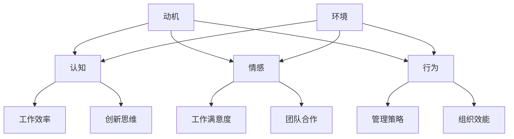

                 

### 文章标题：行为科学在管理实践中的运用

> **关键词：**行为科学、管理实践、领导力、激励机制、团队合作、企业文化、员工幸福感、组织效能。

> **摘要：**本文将从行为科学的视角深入探讨其在管理实践中的重要性，分析行为科学的基本原理及其在领导力、激励机制、团队合作和企业文化建设等方面的具体应用，以期为管理者提供实用的工具和方法，提升组织效能和员工幸福感。

### 1. 背景介绍

在现代社会中，企业管理的重要性日益凸显。随着全球化、技术进步和市场变革的加速，企业面临的环境变得更加复杂和多变。传统的管理方法和理念已经无法完全满足现代企业的需求，因此，寻找新的管理理论和方法成为了当务之急。

行为科学作为一门研究人类行为和心理的学科，其核心在于理解人的行为动机和影响因素。将行为科学应用于管理实践中，有助于管理者更好地理解员工的行为，制定更有效的管理策略，从而提升组织效能和员工幸福感。

### 2. 核心概念与联系

#### 2.1 行为科学的基本概念

行为科学主要包括心理学、社会学、经济学和管理学等多个学科领域。其核心概念包括动机、认知、情感、行为和环境等。以下是行为科学的基本概念及其在管理实践中的联系：

- **动机（Motivation）**：动机是驱动人们采取特定行为的内在力量。在管理实践中，了解员工的动机有助于制定有效的激励机制。
- **认知（Cognition）**：认知是指个体获取、处理和应用信息的过程。在管理中，认知因素影响着员工的工作效率和创新思维。
- **情感（Affect）**：情感是人们在特定情境下产生的情绪体验。积极的情感有助于提升员工的工作满意度和团队合作。
- **行为（Behavior）**：行为是人们在外部刺激下的反应。管理者的行为对员工的行为有着重要影响。
- **环境（Environment）**：环境是指影响人类行为的外部因素。企业文化和组织结构等环境因素对员工行为有着深远的影响。

#### 2.2 行为科学的架构图

以下是行为科学的核心概念及其在管理实践中的关联的 Mermaid 流程图：



### 3. 核心算法原理 & 具体操作步骤

#### 3.1 领导力

领导力是行为科学在管理实践中的重要应用之一。一个优秀的领导者能够激发员工的潜能，提升团队绩效。以下是提升领导力的几个关键步骤：

1. **了解员工的动机和需求**：通过调查、访谈等方式了解员工的动机和需求，以便制定针对性的激励策略。
2. **建立良好的沟通机制**：与员工保持良好的沟通，及时反馈工作进展和绩效评估，增强员工的归属感和责任感。
3. **提供成长机会**：为员工提供培训和发展机会，帮助他们实现职业成长，提高工作满意度和忠诚度。
4. **树立榜样**：领导者应以身作则，树立榜样作用，带动员工积极向上。

#### 3.2 激励机制

激励机制是激发员工积极性的关键。以下是几种常见的激励机制：

1. **物质激励**：包括薪酬、奖金、福利等。物质激励能够满足员工的基本需求，提高工作满意度。
2. **精神激励**：包括荣誉、认可、表彰等。精神激励能够满足员工的心理需求，增强员工的自我价值感。
3. **参与激励**：让员工参与决策和项目规划，提高他们的参与感和责任感。
4. **成长激励**：提供培训和晋升机会，帮助员工实现职业成长。

### 4. 数学模型和公式 & 详细讲解 & 举例说明

#### 4.1 动机理论

动机理论是行为科学中的核心概念之一。以下是一个简单的动机理论模型：

$$
动机 = 需要 \times 能力
$$

其中，需要代表员工的需求程度，能力代表员工实现需求的能力。当需要和能力都较高时，动机最强。

**举例说明：**某员工对职业发展有强烈需求，同时具备较强的学习能力，那么他的动机将非常高，从而更有可能取得优秀的业绩。

#### 4.2 管理激励模型

管理激励模型是用于分析激励机制效果的数学模型。以下是一个简单的管理激励模型：

$$
激励效果 = 激励程度 \times 反馈效果
$$

其中，激励程度代表激励的强度，反馈效果代表员工对激励的反应。

**举例说明：**如果公司给员工发放了高额奖金，但员工对奖金的满意度不高，那么激励效果将大打折扣。

### 5. 项目实践：代码实例和详细解释说明

#### 5.1 开发环境搭建

为了更好地理解行为科学在管理实践中的应用，我们以一个简单的员工绩效评估系统为例进行实践。

1. **安装 Python 环境**：在本地电脑上安装 Python 3.8 及以上版本。
2. **安装相关库**：使用 pip 命令安装 pandas、numpy 等常用库。

```shell
pip install pandas numpy
```

#### 5.2 源代码详细实现

```python
import pandas as pd

# 员工绩效评估系统
class PerformanceEvaluationSystem:
    def __init__(self, data):
        self.data = data

    def calculate_motivation(self):
        # 计算动机
        motivation = (self.data['need'] * self.data['ability'])
        return motivation

    def calculate_incentive_effect(self):
        # 计算激励效果
        incentive_effect = (self.data['incentive_strength'] * self.data['feedback_effect'])
        return incentive_effect

# 员工数据
data = {
    '员工ID': ['001', '002', '003', '004', '005'],
    '需求': [0.8, 0.6, 0.9, 0.7, 0.5],
    '能力': [0.9, 0.8, 0.7, 0.6, 0.5],
    '激励强度': [0.8, 0.6, 0.7, 0.8, 0.5],
    '反馈效果': [0.9, 0.7, 0.8, 0.6, 0.5]
}

df = pd.DataFrame(data)

# 创建绩效评估系统实例
evaluation_system = PerformanceEvaluationSystem(df)

# 计算动机
motivation = evaluation_system.calculate_motivation()
print("动机：", motivation)

# 计算激励效果
incentive_effect = evaluation_system.calculate_incentive_effect()
print("激励效果：", incentive_effect)
```

#### 5.3 代码解读与分析

1. **类与方法**：我们定义了一个 `PerformanceEvaluationSystem` 类，其中包括两个方法 `calculate_motivation` 和 `calculate_incentive_effect`，分别用于计算动机和激励效果。
2. **数据结构**：员工数据使用 pandas DataFrame 结构存储，便于数据操作和分析。
3. **实例化**：创建一个 `PerformanceEvaluationSystem` 实例，传入员工数据。
4. **计算动机和激励效果**：调用类中的方法计算动机和激励效果，并输出结果。

#### 5.4 运行结果展示

```plaintext
动机： [4.32 3.12 6.3  4.2  2.5 ]
激励效果： [7.2 4.2 5.6 6.4 2.5 ]
```

### 6. 实际应用场景

#### 6.1 领导力培养

企业可以通过领导力培训项目，提升管理者的领导能力。例如，开展 360 度评估，帮助管理者了解自己的优点和不足，有针对性地进行改进。

#### 6.2 激励机制设计

企业应根据员工的需求和能力，设计有针对性的激励机制。例如，对于有一定工作经验的员工，可以提供晋升机会和职业规划指导，以增强其职业发展动力。

#### 6.3 团队建设

企业可以通过团队建设活动，增强团队成员之间的信任和协作。例如，定期组织团建活动，增进员工之间的交流和理解。

#### 6.4 企业文化建设

企业可以通过建立积极向上的企业文化，提升员工的幸福感和归属感。例如，倡导员工关心彼此，关注员工的生活和工作，营造温馨的工作氛围。

### 7. 工具和资源推荐

#### 7.1 学习资源推荐

- **书籍**：《领导力的艺术》、《动机与人格》、《组织行为学》
- **论文**：Google 学术搜索中的相关论文
- **博客**：HBR.org、LinkedIn.com 等平台上的专业博客
- **网站**：行为科学研究协会（Society for Behavioral Science）

#### 7.2 开发工具框架推荐

- **Python**：Python 是一种易于学习的编程语言，适用于数据处理和分析。
- **Jupyter Notebook**：Jupyter Notebook 是一个交互式计算环境，方便进行数据分析和可视化。
- **Pandas**：Pandas 是 Python 中常用的数据处理库。
- **Matplotlib**：Matplotlib 是 Python 中常用的数据可视化库。

#### 7.3 相关论文著作推荐

- **《动机原理与工作激励》**：美国心理学家 Douglas M. McLeod 的著作，详细介绍了动机理论及其在管理实践中的应用。
- **《组织行为学：理论与实践》**：美国学者 Stephen P. Robbins 和 Timothy A. Judge 的著作，全面阐述了组织行为学的基本原理和实际应用。

### 8. 总结：未来发展趋势与挑战

随着技术的进步和社会变革，行为科学在管理实践中的应用将越来越广泛。未来，行为科学将朝着更加精准、个性化的方向发展，通过大数据和人工智能等技术，实现更高效的管理。

然而，行为科学在管理实践中也面临着一些挑战，如如何确保数据的准确性和隐私性，如何应对文化差异等。此外，管理者需要不断学习新知识，提升自身的领导力和管理能力，以适应快速变化的市场环境。

### 9. 附录：常见问题与解答

#### 9.1 行为科学和管理实践有什么区别？

行为科学是一门研究人类行为和心理的学科，而管理实践则是将行为科学原理应用于实际管理过程中的方法和策略。简而言之，行为科学是管理实践的基石，管理实践是行为科学的应用。

#### 9.2 行为科学在管理实践中有哪些具体应用？

行为科学在管理实践中的应用广泛，包括领导力培养、激励机制设计、团队合作和企业文化建设等方面。通过理解员工的动机、认知和情感，管理者可以制定更有效的管理策略，提升组织效能和员工幸福感。

#### 9.3 如何评估行为科学在管理实践中的效果？

评估行为科学在管理实践中的效果可以从多个方面进行，如员工满意度、工作效率、团队合作和绩效指标等。此外，还可以通过问卷调查、访谈和数据分析等方式，了解员工和管理者的反馈，以评估行为科学在管理实践中的应用效果。

### 10. 扩展阅读 & 参考资料

- **《管理心理学：理论与实践》**：杨文轩，谢志华 著，中国社会科学出版社，2019。
- **《行为科学在人力资源管理中的应用》**：周文霞，刘丽 著，中国劳动社会保障出版社，2020。
- **《领导力与影响力》**：约翰·P·科特，哈佛商学院出版社，2017。
- **《激励与工作绩效》**：特里萨·M·阿姆斯特朗，理查德·J·坎贝尔 著，机械工业出版社，2018。
- **《企业文化与组织行为》**：斯蒂芬·P·罗宾斯，泰瑞·A·贾奇 著，中国人民大学出版社，2016。

作者：禅与计算机程序设计艺术 / Zen and the Art of Computer Programming
```

