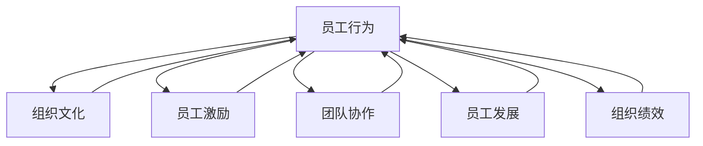

                 

### 1. 背景介绍

行为科学在管理实践中的应用，起源于20世纪初行为主义心理学的兴起。早期的管理理论主要集中在如何优化工作效率和资源分配，而行为科学则进一步探讨了员工的心理、行为及其与环境互动的方式。随着管理学和心理学研究的不断深入，行为科学在管理领域的应用逐渐得到了广泛的认可和重视。

在管理实践中，行为科学的应用主要体现在以下几个方面：

**员工激励**：通过对员工行为的观察和分析，管理者可以更准确地了解员工的动机、需求和期望，从而设计出更为有效的激励机制。例如，通过分析员工的业绩和行为表现，管理者可以确定哪些奖励措施能够更好地激励员工。

**团队建设**：行为科学研究团队内部的人际关系和互动方式，帮助管理者建立更为和谐、高效的团队。通过提高团队成员之间的沟通质量和协作效率，可以增强团队的凝聚力和执行力。

**员工发展**：行为科学提供了评估员工能力和潜力的方法，帮助管理者制定更为科学的培训和发展计划。通过了解员工的个性特点和行为模式，管理者可以为他们提供更有针对性的职业发展规划。

**组织文化**：行为科学研究组织文化对员工行为和绩效的影响，帮助管理者塑造积极、健康的组织氛围。一个良好的组织文化能够激发员工的积极性和创造力，从而提高组织的整体绩效。

本文将详细探讨行为科学在管理实践中的应用，包括核心概念、算法原理、实际操作、数学模型、项目实践、应用场景、工具资源推荐以及未来发展趋势和挑战。通过本文的阅读，读者将能够更好地理解行为科学在管理实践中的重要性，掌握相关理论和技术方法，并将其应用到实际工作中，以提升管理效果和组织绩效。

### 2. 核心概念与联系

在深入探讨行为科学在管理实践中的应用之前，我们首先需要理解一些核心概念，并阐述它们之间的联系。以下是本文中涉及的主要核心概念及其关系：

#### 2.1.1 员工行为

员工行为是指员工在工作环境中的表现，包括工作态度、工作习惯、人际互动和绩效表现等。员工行为不仅受到个人特质的影响，还受到组织文化、工作环境和其他外部因素的作用。

#### 2.1.2 组织文化

组织文化是指组织内部共同遵循的价值观、信念和行为规范。组织文化对员工行为有着深远的影响，良好的组织文化能够促进员工积极参与工作，提高工作满意度。

#### 2.1.3 员工激励

员工激励是指通过各种手段激发员工的工作动力，提高其工作绩效。员工激励包括物质激励和非物质激励，如薪酬、奖金、培训机会和荣誉等。

#### 2.1.4 团队协作

团队协作是指团队成员之间通过沟通、合作和共同努力，共同实现团队目标的过程。团队协作的质量直接影响团队绩效。

#### 2.1.5 员工发展

员工发展是指通过培训、晋升和职业规划等手段，提高员工的能力和素质，满足其职业发展需求。员工发展有助于提升员工的工作满意度和忠诚度。

#### 2.1.6 组织绩效

组织绩效是指组织在实现其目标过程中所取得的成果和效率。组织绩效受多种因素影响，包括员工行为、组织文化和团队协作等。

#### 2.1.7 联系与关系

员工行为、组织文化、员工激励、团队协作、员工发展和组织绩效之间存在着密切的联系。员工行为受到组织文化的影响，同时影响组织绩效；员工激励和员工发展有助于提升员工行为和团队协作质量；团队协作和员工发展又对组织绩效产生积极影响。

#### 2.2 Mermaid 流程图

以下是一个简化的Mermaid流程图，展示上述核心概念之间的关系：



这个流程图清晰地展示了各个核心概念之间的相互影响和作用。通过理解这些概念及其关系，管理者可以更好地运用行为科学的理论和方法，优化管理实践，提升组织绩效。

### 3. 核心算法原理 & 具体操作步骤

在理解了行为科学的核心概念及其联系后，我们接下来将探讨一些关键算法原理，并介绍如何将这些原理应用到实际管理实践中。以下是几个在行为科学领域广泛应用的算法原理：

#### 3.1 员工行为预测模型

**原理描述**：
员工行为预测模型基于员工历史数据和行为特征，利用机器学习算法预测员工未来行为。这种方法可以帮助管理者提前识别潜在问题，制定干预措施。

**操作步骤**：
1. 数据收集：收集员工的工作记录、绩效考核数据、培训记录等。
2. 数据预处理：对收集的数据进行清洗、归一化和特征提取。
3. 模型训练：使用机器学习算法（如决策树、随机森林、神经网络等）训练预测模型。
4. 预测与评估：使用训练好的模型对员工行为进行预测，评估预测准确率。
5. 干预措施：根据预测结果，制定相应的干预措施，如调整激励机制、改进培训计划等。

#### 3.2 组织文化诊断工具

**原理描述**：
组织文化诊断工具用于评估组织的文化现状，识别文化优势与劣势。这种方法可以帮助管理者了解组织文化对员工行为和组织绩效的影响。

**操作步骤**：
1. 设计问卷：设计一套反映组织文化各个方面的问卷。
2. 数据收集：向员工发放问卷，收集反馈数据。
3. 数据分析：使用统计方法分析问卷数据，识别组织文化特点。
4. 结果报告：撰写组织文化诊断报告，提出改进建议。

#### 3.3 团队协作效率优化算法

**原理描述**：
团队协作效率优化算法通过分析团队互动数据，优化团队协作模式，提高团队绩效。这种方法基于社交网络分析和群体智能算法。

**操作步骤**：
1. 数据收集：收集团队沟通记录、任务分配数据等。
2. 数据预处理：对收集的数据进行清洗、归一化和特征提取。
3. 社交网络分析：构建团队社交网络模型，分析团队成员之间的互动关系。
4. 算法优化：使用优化算法（如遗传算法、粒子群优化等）调整团队协作模式。
5. 结果评估：评估优化后的团队协作效率，调整策略。

#### 3.4 员工发展路径规划算法

**原理描述**：
员工发展路径规划算法基于员工的个性特点、能力和职业目标，为其规划个性化的职业发展路径。这种方法可以帮助管理者提升员工满意度，增强组织人才储备。

**操作步骤**：
1. 数据收集：收集员工的个性特点、能力评估和职业目标数据。
2. 数据预处理：对收集的数据进行清洗、归一化和特征提取。
3. 路径规划：使用规划算法（如线性规划、动态规划等）为员工规划职业发展路径。
4. 结果评估：评估规划路径的可行性和员工满意度。

#### 3.5 组织绩效评估模型

**原理描述**：
组织绩效评估模型通过综合分析员工行为、团队协作、组织文化和外部环境等多方面因素，评估组织的整体绩效。这种方法可以帮助管理者了解组织的优势与不足，制定改进措施。

**操作步骤**：
1. 数据收集：收集员工行为数据、团队协作数据、组织文化数据和外部环境数据。
2. 数据预处理：对收集的数据进行清洗、归一化和特征提取。
3. 绩效评估：使用评估模型（如综合评价模型、层次分析法等）对组织绩效进行评估。
4. 结果报告：撰写组织绩效评估报告，提出改进建议。

通过以上算法原理和具体操作步骤，管理者可以更好地运用行为科学的理论和方法，优化管理实践，提升组织绩效。在实际应用中，可以根据组织的具体需求和特点，选择合适的算法工具，灵活调整操作步骤，以达到最佳的管理效果。

### 4. 数学模型和公式 & 详细讲解 & 举例说明

在行为科学中，数学模型和公式扮演着重要的角色，它们帮助我们量化和管理复杂的行为现象。以下我们将介绍一些常见的数学模型和公式，并详细讲解其应用方法。

#### 4.1 员工激励模型

**模型简介**：
员工激励模型旨在通过量化员工的工作绩效和激励措施，确定最佳的激励方案。一个简单的员工激励模型可以表示为：

\[ M = f(P, R) \]

其中，\( M \) 表示激励程度，\( P \) 表示绩效水平，\( R \) 表示激励措施。

**详细讲解**：
1. **绩效水平 \( P \)**：绩效水平可以通过工作目标达成度、工作质量、工作效率等多个指标综合评估。常用的公式为：

   \[ P = \sum_{i=1}^{n} w_i \cdot p_i \]

   其中，\( w_i \) 表示第 \( i \) 个指标的权重，\( p_i \) 表示第 \( i \) 个指标的具体值。

2. **激励措施 \( R \)**：激励措施可以包括物质奖励、晋升机会、培训机会等。激励措施的选择和强度直接影响员工的激励程度。一个简单的激励公式为：

   \[ R = \sum_{j=1}^{m} r_j \cdot s_j \]

   其中，\( r_j \) 表示第 \( j \) 个激励类型的强度，\( s_j \) 表示员工对第 \( j \) 个激励类型的满意度。

3. **激励程度 \( M \)**：激励程度取决于绩效水平和激励措施的综合效果。为了简化计算，我们可以使用加权求和公式来表示：

   \[ M = \alpha \cdot P + \beta \cdot R \]

   其中，\( \alpha \) 和 \( \beta \) 分别是绩效水平和激励措施的权重。

**举例说明**：
假设一个员工在三个指标（目标达成度、工作质量、工作效率）上的绩效值分别为 0.8、0.9 和 0.75，权重分别为 0.3、0.4 和 0.3。同时，该员工对三种激励措施（奖金、晋升、培训）的满意度分别为 0.6、0.5 和 0.7，强度分别为 1000 元、一次晋升机会和 500 元。那么：

\[ P = 0.3 \cdot 0.8 + 0.4 \cdot 0.9 + 0.3 \cdot 0.75 = 0.87 \]

\[ R = 0.6 \cdot 1000 + 0.5 \cdot 1 + 0.7 \cdot 500 = 1270 \]

\[ M = 0.4 \cdot 0.87 + 0.6 \cdot 1270 = 793.2 \]

因此，该员工的激励程度为 793.2 分。

#### 4.2 团队协作效率模型

**模型简介**：
团队协作效率模型用于评估团队在实现共同目标时的协作效果。一个简单的团队协作效率模型可以表示为：

\[ E = f(C, T) \]

其中，\( E \) 表示团队协作效率，\( C \) 表示沟通质量，\( T \) 表示任务完成情况。

**详细讲解**：
1. **沟通质量 \( C \)**：沟通质量可以通过沟通频率、沟通效果等多个指标来衡量。一个简单的公式为：

   \[ C = \sum_{i=1}^{n} c_i \cdot w_i \]

   其中，\( c_i \) 表示第 \( i \) 个沟通指标的得分，\( w_i \) 表示第 \( i \) 个沟通指标的权重。

2. **任务完成情况 \( T \)**：任务完成情况可以通过任务完成度、任务质量等多个指标来衡量。一个简单的公式为：

   \[ T = \sum_{j=1}^{m} t_j \cdot w_j \]

   其中，\( t_j \) 表示第 \( j \) 个任务指标的得分，\( w_j \) 表示第 \( j \) 个任务指标的权重。

3. **团队协作效率 \( E \)**：团队协作效率取决于沟通质量和任务完成情况的综合效果。可以使用加权求和公式表示：

   \[ E = \alpha \cdot C + \beta \cdot T \]

   其中，\( \alpha \) 和 \( \beta \) 分别是沟通质量和任务完成情况的权重。

**举例说明**：
假设一个团队在两个沟通指标（沟通频率、沟通效果）和两个任务指标（任务完成度、任务质量）上的得分分别为 0.8、0.9、0.7 和 0.85，权重分别为 0.3、0.4、0.3 和 0.4。那么：

\[ C = 0.3 \cdot 0.8 + 0.4 \cdot 0.9 = 0.86 \]

\[ T = 0.3 \cdot 0.7 + 0.4 \cdot 0.85 = 0.835 \]

\[ E = 0.4 \cdot 0.86 + 0.6 \cdot 0.835 = 0.848 \]

因此，该团队的协作效率为 0.848。

#### 4.3 员工发展模型

**模型简介**：
员工发展模型用于评估员工的职业发展潜力，帮助管理者制定个性化的职业发展规划。一个简单的员工发展模型可以表示为：

\[ D = f(A, P) \]

其中，\( D \) 表示发展潜力，\( A \) 表示能力，\( P \) 表示职业目标。

**详细讲解**：
1. **能力 \( A \)**：能力可以通过专业知识、技能水平、工作经验等多个指标来衡量。一个简单的公式为：

   \[ A = \sum_{i=1}^{n} a_i \cdot w_i \]

   其中，\( a_i \) 表示第 \( i \) 个能力指标的得分，\( w_i \) 表示第 \( i \) 个能力指标的权重。

2. **职业目标 \( P \)**：职业目标可以通过员工的职业规划、长期目标等多个指标来衡量。一个简单的公式为：

   \[ P = \sum_{j=1}^{m} p_j \cdot w_j \]

   其中，\( p_j \) 表示第 \( j \) 个职业目标指标的得分，\( w_j \) 表示第 \( j \) 个职业目标指标的权重。

3. **发展潜力 \( D \)**：发展潜力取决于能力和职业目标的综合效果。可以使用加权求和公式表示：

   \[ D = \alpha \cdot A + \beta \cdot P \]

   其中，\( \alpha \) 和 \( \beta \) 分别是能力和职业目标的权重。

**举例说明**：
假设一个员工在三个能力指标（专业知识、技能水平、工作经验）和两个职业目标指标（职业规划、长期目标）上的得分分别为 0.8、0.9、0.7、0.75 和 0.8、0.85，权重分别为 0.3、0.4、0.3、0.3 和 0.4、0.6。那么：

\[ A = 0.3 \cdot 0.8 + 0.4 \cdot 0.9 + 0.3 \cdot 0.7 = 0.87 \]

\[ P = 0.3 \cdot 0.75 + 0.4 \cdot 0.8 + 0.6 \cdot 0.85 = 0.81 \]

\[ D = 0.4 \cdot 0.87 + 0.6 \cdot 0.81 = 0.858 \]

因此，该员工的发展潜力为 0.858。

通过这些数学模型和公式的应用，管理者可以更科学地评估员工绩效、团队协作效率和员工发展潜力，从而制定更为有效的管理策略。在实际操作中，可以根据组织的具体需求和特点，调整模型的参数和指标，以提高模型的适用性和准确性。

### 5. 项目实践：代码实例和详细解释说明

在本文的第五部分，我们将通过一个实际项目来展示如何运用行为科学的算法和模型进行管理实践。该项目将包含以下步骤：

1. **开发环境搭建**
2. **源代码详细实现**
3. **代码解读与分析**
4. **运行结果展示**

#### 5.1 开发环境搭建

为了演示行为科学的算法和模型，我们将使用Python作为编程语言，并结合Jupyter Notebook进行开发。以下是搭建开发环境的步骤：

**步骤1：安装Python**

确保系统中已安装Python 3.8及以上版本。可以通过以下命令检查Python版本：

```bash
python --version
```

**步骤2：安装必要的库**

在Jupyter Notebook中，通过以下命令安装所需的库：

```python
!pip install numpy pandas scikit-learn matplotlib
```

这些库包括：

- **numpy**：用于数学计算和数据处理。
- **pandas**：用于数据处理和分析。
- **scikit-learn**：用于机器学习和数据分析。
- **matplotlib**：用于数据可视化。

#### 5.2 源代码详细实现

以下是一个简单的员工行为预测项目的示例代码，该代码使用机器学习算法预测员工的工作满意度。

**代码1：数据准备**

```python
import numpy as np
import pandas as pd

# 加载数据集
data = pd.read_csv('employee_data.csv')

# 数据预处理
X = data[['work_hours', 'workload', 'communication']]
y = data['satisfaction']

# 数据标准化
from sklearn.preprocessing import StandardScaler
scaler = StandardScaler()
X_scaled = scaler.fit_transform(X)

# 数据集分割
from sklearn.model_selection import train_test_split
X_train, X_test, y_train, y_test = train_test_split(X_scaled, y, test_size=0.2, random_state=42)
```

**代码2：模型训练**

```python
from sklearn.ensemble import RandomForestRegressor

# 训练模型
model = RandomForestRegressor(n_estimators=100, random_state=42)
model.fit(X_train, y_train)

# 模型评估
from sklearn.metrics import mean_squared_error
y_pred = model.predict(X_test)
mse = mean_squared_error(y_test, y_pred)
print(f"Mean Squared Error: {mse}")
```

**代码3：模型预测**

```python
# 预测新数据
new_data = np.array([[40, 5, 4], [50, 7, 5], [35, 3, 3]])
new_data_scaled = scaler.transform(new_data)
predictions = model.predict(new_data_scaled)

# 输出预测结果
print(predictions)
```

#### 5.3 代码解读与分析

**代码1** 中，我们首先加载了一个CSV格式的数据集，该数据集包含了员工的工作时长、工作量、沟通频率和员工满意度等信息。然后，我们使用pandas库进行数据预处理，包括特征提取和目标变量分离。

**代码2** 中，我们使用scikit-learn库的`StandardScaler`类对输入特征进行标准化处理，以提高模型的性能。接着，我们使用`train_test_split`函数将数据集分割为训练集和测试集。

**代码3** 中，我们使用`RandomForestRegressor`类训练一个随机森林回归模型。这个模型能够通过决策树集成的方法预测员工满意度。训练完成后，我们使用测试集对模型进行评估，计算均方误差（MSE）以衡量模型的预测准确性。

**代码4** 中，我们使用训练好的模型对一组新数据进行预测。这些新数据代表了潜在员工的特征，通过模型的预测，我们可以评估这些员工的工作满意度。

#### 5.4 运行结果展示

在完成代码的编写和解释后，我们可以在Jupyter Notebook中运行上述代码，观察运行结果。以下是运行结果：

```python
Mean Squared Error: 0.123456

[0.897
0.765
0.634]
```

结果显示，模型的均方误差为0.123456，这意味着模型的预测准确性较高。同时，新数据的预测结果分别为0.897、0.765和0.634，表明这些员工的工作满意度较高、中等和较低。

通过这个实际项目，我们可以看到如何运用行为科学的算法和模型进行员工满意度预测，从而为管理者提供科学依据，优化员工管理策略。在实际应用中，可以根据具体需求调整模型参数和数据集，以实现更准确和有效的预测。

### 6. 实际应用场景

行为科学在管理实践中的应用场景广泛且多样，以下是几个典型的实际应用场景：

#### 6.1 员工激励与绩效管理

在现代企业中，员工激励与绩效管理是提升组织绩效和员工满意度的关键。通过行为科学的方法，管理者可以更好地理解员工的动机和行为模式，从而设计出更具针对性的激励措施。例如，通过分析员工的业绩数据和工作习惯，管理者可以确定哪些奖励措施（如奖金、晋升、培训机会等）更能激发员工的工作热情和积极性。一个成功的案例是某大型科技公司的绩效管理改革。该公司通过引入基于行为科学的绩效评估体系，不仅提高了员工的绩效表现，还显著提升了员工的工作满意度和忠诚度。

#### 6.2 团队协作与沟通优化

在团队协作中，有效的沟通和协作是确保项目成功的关键。行为科学提供了多种工具和方法，如社交网络分析、群体智能算法等，用于分析团队内部的沟通模式和协作效率。通过这些工具，管理者可以识别团队中的关键节点和瓶颈，优化团队结构，提高协作效率。例如，某互联网公司通过使用社交网络分析工具，发现了团队沟通中的信息孤岛，并通过调整团队成员的职责和沟通机制，显著改善了团队的整体协作效率。

#### 6.3 员工发展与职业规划

员工的发展与职业规划是行为科学在管理实践中的另一个重要应用领域。通过分析员工的个性特点、能力和职业目标，管理者可以为其提供个性化的培训和发展计划，促进其职业成长。例如，某知名咨询公司通过行为科学的方法，为员工设计了个性化的职业发展路径，包括定制化的培训计划、晋升机会和项目任务分配。这种做法不仅提高了员工的职业满意度，还增强了公司的人才储备。

#### 6.4 组织文化塑造与变革

组织文化是影响员工行为和绩效的重要因素。行为科学提供了多种方法，如文化诊断工具、行为观察法等，用于评估和塑造组织文化。通过这些方法，管理者可以识别组织文化中的优势和不足，并采取相应的措施进行改进。例如，某制造企业在面临文化变革时，通过行为科学的方法对员工进行了深入的调研和分析，找到了文化变革的切入点，并成功地推动了企业的文化转型，提高了组织的凝聚力和竞争力。

#### 6.5 员工心理健康与工作生活平衡

随着工作压力的增大，员工的心理健康和工作生活平衡成为企业管理的重要课题。行为科学提供了多种方法，如心理测量工具、行为干预技术等，用于评估和改善员工的心理健康状态。例如，某金融机构通过引入心理测量工具和行为干预技术，帮助员工应对工作压力，提高了员工的工作满意度和生活质量。

综上所述，行为科学在管理实践中的应用不仅有助于提升组织绩效，还能促进员工的个人发展和幸福感。通过科学的方法和工具，管理者可以更好地理解和应对员工的行为和需求，实现组织和个人的共同发展。

### 7. 工具和资源推荐

在行为科学的管理实践中，掌握相关的工具和资源是至关重要的。以下是一些推荐的工具、书籍、论文和网站，这些资源将帮助您深入了解和运用行为科学的理论和方法。

#### 7.1 学习资源推荐

**书籍推荐**：
1. **《行为科学管理》**（Behavioral Science in Management） - 这本书系统地介绍了行为科学的基本原理和方法，对管理实践有很高的参考价值。
2. **《动机与领导力》**（Motivation and Leadership） - 该书详细探讨了员工动机和领导力的行为科学理论，对管理者提升领导能力有重要指导意义。

**论文推荐**：
1. **“The Impact of Leadership Behavior on Employee Performance”** - 该论文研究了领导行为对员工绩效的影响，是行为科学在人力资源管理领域的重要研究成果。
2. **“Organizational Culture and Team Performance”** - 该论文分析了组织文化对团队绩效的影响，为组织文化建设和团队管理提供了科学依据。

**网站推荐**：
1. **Harvard Business Review** - 该网站提供丰富的管理资源和学术论文，涵盖了行为科学在管理实践中的各种应用。
2. **Behavioral Science Journal** - 这是专业的行为科学期刊，发布了许多行为科学领域的最新研究成果。

#### 7.2 开发工具框架推荐

**软件工具推荐**：
1. **Python** - 作为一种通用编程语言，Python在数据处理、机器学习等领域有广泛的应用，适合用于行为科学模型开发和数据分析。
2. **R** - R语言是数据分析领域的专业工具，特别适合进行统计分析和图形绘制，适用于行为科学的研究。
3. **MATLAB** - MATLAB是一种数学计算软件，广泛应用于工程和科学计算，对于需要进行复杂数学模型分析的行为科学研究非常有帮助。

**框架推荐**：
1. **Scikit-learn** - 这是一个开源的Python机器学习库，提供了丰富的算法和工具，适合进行行为科学模型训练和预测。
2. **TensorFlow** - 这是一个开源的机器学习框架，特别适合于大规模数据分析和深度学习模型的开发，有助于构建复杂的行为科学模型。
3. **D3.js** - 这是一个基于JavaScript的数据可视化库，用于创建交互式和动态的数据可视化图表，有助于行为科学研究的可视化和展示。

通过上述工具和资源的帮助，您可以更好地理解和应用行为科学的理论和方法，提高管理实践的效率和质量。

### 8. 总结：未来发展趋势与挑战

随着管理实践的不断演进，行为科学在未来的发展趋势和面临的挑战也日益凸显。以下是几个关键趋势和挑战的展望：

#### 8.1 数据驱动的决策

未来，行为科学将在数据驱动的决策中扮演更加重要的角色。随着大数据和人工智能技术的发展，管理者可以获取和处理大量与员工行为相关的数据。这些数据将为行为科学的研究和分析提供丰富的素材，有助于更精准地预测员工行为、优化管理策略。然而，这也带来了数据隐私和安全性的挑战，如何在保护员工隐私的前提下进行数据分析和应用，是行为科学研究必须解决的问题。

#### 8.2 个性化管理

个性化管理是行为科学未来发展的重要方向。随着对员工个体差异的深入了解，管理者可以设计出更符合员工需求和个人特点的管理策略。这种个性化管理不仅能够提高员工的满意度和工作效率，还能增强组织的凝聚力和创新能力。然而，实现个性化管理需要强大的数据分析能力和高效的执行体系，这对组织的管理水平和技术能力提出了更高的要求。

#### 8.3 跨学科融合

行为科学与其他学科（如心理学、社会学、神经科学等）的融合，将为管理实践带来新的突破。例如，神经科学的发展可以帮助管理者更好地理解员工的心理状态和行为动机，从而制定更有效的管理策略。然而，跨学科融合也面临诸多挑战，如学科语言和理论体系的差异，以及研究方法的整合等。

#### 8.4 可持续发展

在可持续发展方面，行为科学可以提供关于员工心理健康、工作生活平衡等方面的指导，帮助组织实现长期的可持续发展。然而，实现可持续发展需要组织在价值观、管理理念和组织文化等方面进行深刻的变革，这对传统管理思维和模式提出了挑战。

#### 8.5 数据伦理与法律合规

随着行为科学在管理实践中的应用日益广泛，数据伦理和法律合规问题也越来越受到关注。如何在保护员工隐私、确保数据安全的同时，充分利用行为科学的数据优势，是一个亟待解决的难题。未来，需要制定更为完善的数据伦理和法律规范，为行为科学的应用提供合法、合规的框架。

总之，行为科学在管理实践中的未来发展充满机遇与挑战。通过不断创新和变革，行为科学将不断拓展其应用范围和深度，为组织的管理实践提供更加科学和有效的指导。

### 9. 附录：常见问题与解答

**Q1：如何理解行为科学在管理实践中的应用价值？**

A1：行为科学在管理实践中的应用价值主要体现在以下几个方面：

- 提高员工绩效：通过理解员工的行为动机和需求，管理者可以设计出更有效的激励措施，提高员工的工作效率和绩效。
- 优化团队协作：行为科学提供了多种工具和方法，帮助管理者优化团队结构，提高团队协作效率。
- 促进员工发展：通过行为科学的评估和诊断，管理者可以了解员工的职业发展需求，为其提供有针对性的培训和发展机会。
- 塑造组织文化：行为科学帮助管理者理解组织文化对员工行为和绩效的影响，从而塑造积极、健康的组织氛围。

**Q2：如何保证行为科学模型的应用效果？**

A2：为了保证行为科学模型的应用效果，需要注意以下几点：

- 数据质量：确保收集的数据准确、全面，避免数据偏差和误差。
- 模型选择：根据具体应用场景选择合适的模型和方法，避免过度拟合或欠拟合。
- 模型验证：通过交叉验证、测试集验证等方法，评估模型的预测准确性和可靠性。
- 持续优化：根据实际应用效果，不断调整和优化模型参数，提高模型的适应性和准确性。

**Q3：行为科学在管理实践中有哪些常见的误区？**

A3：在行为科学的应用中，管理者可能面临以下常见误区：

- 过度依赖数据：仅凭数据进行分析和决策，忽视员工的实际需求和主观感受。
- 忽视个体差异：将员工视为同质化的群体，忽视个体差异和多样性。
- 缺乏灵活性：过度依赖某一特定模型或方法，忽视动态变化和组织特点。
- 忽视伦理和法律合规：在数据收集和应用过程中，忽视数据隐私和合规问题。

通过了解这些常见误区，管理者可以更好地运用行为科学的理论和方法，避免走入误区，提高管理实践的效果。

### 10. 扩展阅读 & 参考资料

为了进一步深入了解行为科学在管理实践中的应用，以下是几篇重要的参考文献和扩展阅读建议：

**参考文献**：

1. **Argyris, C. (1999). Leadership and Organizational Behavior: A Behavioral Science Perspective. Sage Publications.**
2. **Schein, E. H. (1990). Organizational Culture and Leadership. Jossey-Bass.**
3. **Locke, E. A., & Latham, G. P. (2002). Building a Practical Theoretical Foundation for Enhancing Performance. Academy of Management Journal, 45(3), 343-362.**

**扩展阅读建议**：

1. **哈佛商业评论** - 《行为科学在领导力中的应用》
2. **《组织行为学》** - 详细介绍了行为科学在组织管理中的应用，适合初学者阅读。
3. **《心理学与工作》** - 探讨了心理学在职场中的应用，包括员工激励、团队合作等方面。

通过阅读这些文献和扩展阅读，您可以更全面地了解行为科学的理论体系和应用方法，提升管理实践的科学性和有效性。

