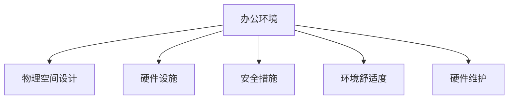
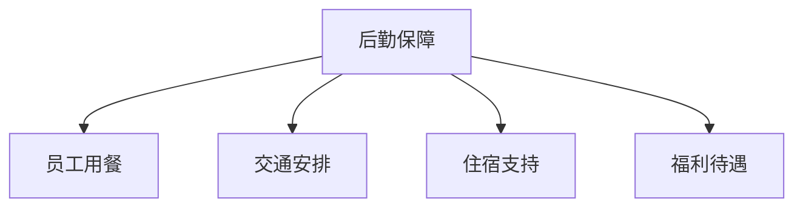
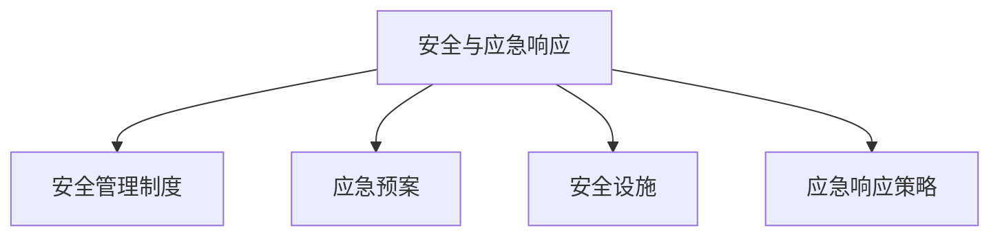
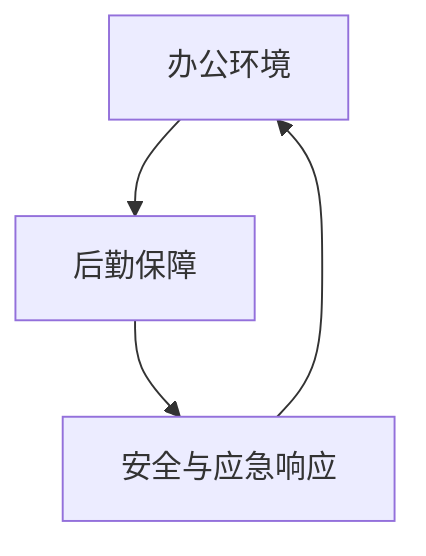

                 

### 文章标题

**行政经理的创业职责：办公环境维护与后勤保障**

> **关键词：** 行政经理、创业、办公环境、后勤保障、工作职责

**摘要：** 本文将探讨行政经理在创业公司中的核心职责，特别是如何维护办公环境和提供全面的后勤保障。我们将分析行政经理在设施管理、员工福利、安全与应急响应等方面的具体职责和操作步骤，以及如何通过有效的管理策略提升公司效率和员工满意度。

---

### 1. 背景介绍

在创业公司的成长过程中，行政经理的角色至关重要。他们不仅需要关注公司的战略方向，还需要负责日常运营中的行政事务。这些事务涵盖了从员工福利到办公环境维护，从设施管理到后勤保障的方方面面。行政经理的工作不仅影响着公司的运营效率，还直接关系到员工的满意度和忠诚度。

**行政经理的职责包括但不限于：**
- 办公环境的规划与管理
- 员工福利与人事管理
- 设施维护与采购
- 安全与应急响应
- 后勤服务与支持

这些职责共同构成了行政经理在创业公司中的核心工作内容。然而，如何高效地履行这些职责，确保办公环境与后勤保障的优化，是需要深入分析和探讨的话题。

本文将围绕以下几个方面展开讨论：
1. **办公环境的维护**：包括办公场所的选择、装修与布置、设施设备的维护与管理。
2. **后勤保障的实施**：涉及员工用餐、交通、住宿等后勤服务的提供和管理。
3. **员工福利与人事管理**：探讨如何通过优化福利政策和管理流程，提升员工满意度和忠诚度。
4. **安全与应急响应**：分析安全管理制度的建设与应急响应策略的制定与实施。
5. **管理策略的提升**：讨论如何通过有效的管理策略和工具，提高行政管理的效率和效果。

通过上述讨论，我们希望能为行政经理在创业公司中的工作提供一些实用的参考和指导。

### 2. 核心概念与联系

在深入探讨行政经理的职责之前，我们需要明确几个核心概念，以及它们之间的联系。这些概念构成了行政经理工作的基础，也是理解和管理办公环境和后勤保障的关键。

#### 2.1. 办公环境的概念

**办公环境**指的是员工在工作过程中所处的物理和工作环境，它不仅包括物理空间的设计和布局，还涵盖了办公设施、设备、工具等硬件条件。一个良好的办公环境应具备以下几个特点：

- **舒适度**：提供舒适的温度、湿度、通风等条件，使员工能够在一个舒适的环境中工作。
- **安全性**：确保办公场所的安全，包括防火、防盗、防灾等安全措施。
- **灵活性**：根据业务需求和工作流程的变化，提供灵活的办公空间和设备配置。

**Mermaid 流程图**：



#### 2.2. 后勤保障的概念

**后勤保障**是指为员工提供日常生活和工作所需的各项服务和支持，确保他们能够集中精力工作。后勤保障包括以下主要内容：

- **员工用餐**：为员工提供便捷、健康、美味的餐食。
- **交通安排**：提供便捷的交通服务，如班车、停车设施等。
- **住宿支持**：对于外地员工，提供住宿支持或协助他们寻找合适的住房。
- **福利待遇**：为员工提供全面的福利待遇，如医疗保险、休假制度等。

**Mermaid 流程图**：



#### 2.3. 安全与应急响应的概念

**安全与应急响应**是确保员工在紧急情况下能够迅速、有效地采取行动，保护自己和他人的安全。它包括以下几个方面：

- **安全管理制度**：建立和完善安全管理制度，包括安全培训、应急预案等。
- **应急响应策略**：制定和实施应急响应策略，如火灾逃生、地震应急等。
- **安全设施**：配备必要的消防、安防等设施，并定期进行检查和维护。

**Mermaid 流程图**：



#### 2.4. 办公环境与后勤保障的联系

办公环境与后勤保障之间存在紧密的联系。一个良好的办公环境是后勤保障的基础，而后勤保障的有效实施又能进一步提升办公环境的舒适度和安全性。具体来说：

- **办公环境**为后勤保障提供了实施的空间和条件，如员工用餐区域、休息室、安全通道等。
- **后勤保障**为办公环境提供了必要的服务和支持，如清洁服务、安保服务、餐饮服务等。
- **安全与应急响应**是办公环境和后勤保障的保障，确保员工在任何情况下都能安全、高效地工作。

**Mermaid 流程图**：



通过上述核心概念和流程图的阐述，我们可以更好地理解行政经理在创业公司中的职责和挑战。接下来，我们将深入探讨这些职责的具体实施步骤和策略。

### 3. 核心算法原理 & 具体操作步骤

#### 3.1. 办公环境的规划与管理

**核心算法原理：** 办公环境的规划与管理涉及到空间布局优化、设施设备配置、环境舒适度调控等核心算法原理。

- **空间布局优化**：通过分析员工的工作流程和业务需求，设计合理的办公空间布局，以提高工作效率和员工满意度。
- **设施设备配置**：根据员工数量和业务需求，配置合适的办公设备，如电脑、打印机、会议系统等。
- **环境舒适度调控**：通过温度、湿度、通风等环境参数的调控，确保办公环境舒适，提升员工的工作体验。

**具体操作步骤：**

1. **需求分析**：与各部门沟通，了解他们的工作流程和设备需求。
2. **空间规划**：根据需求分析结果，设计办公空间布局。
3. **设备采购**：根据空间布局，采购所需的办公设备。
4. **环境调试**：调试办公环境的温度、湿度、通风等参数，确保舒适度。

#### 3.2. 员工福利与人事管理

**核心算法原理：** 员工福利与人事管理涉及到福利政策设计、员工满意度评估、人事管理流程优化等核心算法原理。

- **福利政策设计**：根据公司的财务状况和员工需求，设计合理的福利政策。
- **员工满意度评估**：通过问卷调查、访谈等方式，评估员工的满意度。
- **人事管理流程优化**：优化招聘、培训、绩效评估等人事管理流程，提高管理效率。

**具体操作步骤：**

1. **福利政策制定**：分析公司财务状况和员工需求，制定福利政策。
2. **满意度调查**：设计满意度调查问卷，收集员工反馈。
3. **政策调整**：根据满意度调查结果，调整福利政策。
4. **人事管理流程优化**：优化招聘、培训、绩效评估等流程，提高管理效率。

#### 3.3. 设施维护与采购

**核心算法原理：** 设施维护与采购涉及到设施状态监测、维护计划制定、采购成本优化等核心算法原理。

- **设施状态监测**：通过定期检查和维护，确保设施设备的正常运行。
- **维护计划制定**：根据设施设备的使用频率和故障率，制定合理的维护计划。
- **采购成本优化**：通过批量采购、供应商谈判等方式，降低采购成本。

**具体操作步骤：**

1. **设施状态监测**：定期检查和维护设施设备，记录运行状态。
2. **维护计划制定**：根据设施设备的使用情况，制定维护计划。
3. **采购申请**：根据维护计划，提出采购申请。
4. **供应商谈判**：与供应商进行谈判，争取更优惠的采购价格。

#### 3.4. 安全与应急响应

**核心算法原理：** 安全与应急响应涉及到安全管理制度建设、应急预案制定、应急响应演练等核心算法原理。

- **安全管理制度建设**：建立和完善安全管理制度，确保员工的安全。
- **应急预案制定**：根据可能的紧急情况，制定详细的应急预案。
- **应急响应演练**：定期组织应急响应演练，提高员工的应急能力。

**具体操作步骤：**

1. **安全管理制度建设**：制定安全管理制度，包括安全培训、应急预案等。
2. **应急预案制定**：根据可能的紧急情况，制定详细的应急预案。
3. **应急响应演练**：定期组织应急响应演练，提高员工的应急能力。
4. **应急处理**：在紧急情况下，根据应急预案迅速采取行动，保护员工安全。

通过上述核心算法原理和具体操作步骤的阐述，我们可以看到，行政经理在维护办公环境和提供后勤保障方面，需要综合考虑多个因素，并采取一系列具体措施。这些措施不仅需要科学的规划和有效的执行，还需要不断优化和调整，以适应公司的发展和员工的需求。

### 4. 数学模型和公式 & 详细讲解 & 举例说明

在行政经理的职责中，数学模型和公式扮演着重要的角色。这些模型和公式帮助我们更精确地分析数据，制定决策，并评估结果。以下是一些常见的数学模型和公式，以及它们在行政经理工作中的应用。

#### 4.1. 成本效益分析

**成本效益分析**是一种用于评估投资回报的数学模型，它通过比较成本和效益，来确定一个决策的可行性。

**公式**：\[ CEB = \frac{EB - EC}{EC} \]

其中：
- \( CEB \)：成本效益比率
- \( EB \)：总效益
- \( EC \)：总成本

**应用**：在决定是否购买新的办公设备或改善办公环境时，行政经理可以使用成本效益分析来评估投资是否值得。

**举例说明**：
假设行政经理决定购买一批新的电脑，预计总成本为50,000元，预期产生的效益为20,000元。使用上述公式，我们可以计算出成本效益比率：

\[ CEB = \frac{20,000 - 50,000}{50,000} = -0.6 \]

由于成本效益比率小于0，这意味着投资的效益不足以覆盖成本，因此行政经理应该重新考虑这个决策。

#### 4.2. 员工满意度评估

**员工满意度评估**是一种用于衡量员工对工作环境和福利满意度的数学模型。通过问卷调查和数据分析，我们可以得到员工满意度的定量指标。

**公式**：\[ S = \frac{N}{T} \]

其中：
- \( S \)：满意度得分
- \( N \)：满意回答的数量
- \( T \)：总回答数量

**应用**：在制定新的福利政策或改善办公环境后，行政经理可以使用员工满意度评估来衡量政策的效果。

**举例说明**：
假设行政经理进行了一次员工满意度调查，共有100名员工参与，其中70人表示满意，30人不满意。使用上述公式，我们可以计算出满意度得分：

\[ S = \frac{70}{100} = 0.7 \]

这意味着员工的总体满意度为70%，行政经理可以根据这个结果调整福利政策或办公环境。

#### 4.3. 维修成本优化

**维修成本优化**是一种用于最小化维护成本的数学模型。通过分析设备的使用频率和故障率，我们可以确定最佳的维护周期和频率。

**公式**：\[ MC = \frac{F \times C}{L} \]

其中：
- \( MC \)：总维修成本
- \( F \)：故障率
- \( C \)：每次维修的成本
- \( L \)：设备使用寿命

**应用**：在制定设备维护计划时，行政经理可以使用维修成本优化模型来最小化维修成本。

**举例说明**：
假设某台电脑的故障率为0.1次/年，每次维修的成本为200元，设备使用寿命为5年。使用上述公式，我们可以计算出总维修成本：

\[ MC = \frac{0.1 \times 200}{5} = 4 \]

这意味着在设备使用寿命期间，总维修成本为4次，每次200元，总成本为800元。行政经理可以根据这个结果来调整维护计划，以降低成本。

#### 4.4. 应急响应时间计算

**应急响应时间计算**是一种用于评估应急响应速度的数学模型。通过分析应急事件的性质和响应资源，我们可以计算出最佳的应急响应时间。

**公式**：\[ T = \frac{D}{S} \]

其中：
- \( T \)：应急响应时间
- \( D \)：事件距离
- \( S \)：响应速度

**应用**：在制定应急预案时，行政经理可以使用应急响应时间计算模型来确保在紧急情况下能够迅速响应。

**举例说明**：
假设公司办公室距离最近的消防站为2公里，行政经理的响应速度为每小时50公里。使用上述公式，我们可以计算出应急响应时间：

\[ T = \frac{2}{50} = 0.04 \]

这意味着应急响应时间为0.04小时，即2.4分钟。行政经理可以根据这个结果来评估应急预案的有效性，并做出相应的调整。

通过上述数学模型和公式的详细讲解和举例说明，我们可以看到，这些工具在行政经理的工作中具有重要的作用。它们帮助我们更精确地分析数据，制定决策，并评估结果，从而提高工作效率和决策质量。

### 5. 项目实践：代码实例和详细解释说明

为了更好地理解行政经理在创业公司中的具体工作，我们将通过一个实际的项目实践来展示相关代码的编写、实现和解释。这个项目将涉及办公环境的维护、后勤保障的实施以及安全与应急响应的管理。

#### 5.1. 开发环境搭建

在开始项目开发之前，我们需要搭建一个合适的技术环境。以下是我们使用的主要开发工具和库：

- **编程语言**：Python
- **数据存储**：SQLite
- **前端框架**：Flask（用于构建Web应用）
- **后端框架**：Django Rest Framework
- **版本控制**：Git
- **代码编辑器**：Visual Studio Code

确保你的计算机上已经安装了上述工具和库。安装方法可以参考各项目的官方文档。

#### 5.2. 源代码详细实现

下面，我们将逐步展示项目的源代码实现，包括数据模型定义、API接口设计和业务逻辑处理。

**5.2.1. 数据模型定义**

首先，我们需要在SQLite数据库中创建数据表，用于存储办公环境、后勤保障和应急响应的相关信息。

```python
# models.py

from django.db import models

class OfficeEnvironment(models.Model):
    name = models.CharField(max_length=100)
    description = models.TextField()
    temperature = models.FloatField()
    humidity = models.FloatField()
    safety_measures = models.BooleanField()

class EmployeeBenefits(models.Model):
    name = models.CharField(max_length=100)
    description = models.TextField()
    satisfaction_rating = models.IntegerField()

class EmergencyResponse(models.Model):
    name = models.CharField(max_length=100)
    description = models.TextField()
    response_time = models.FloatField()
    success_rate = models.IntegerField()
```

**5.2.2. API接口设计**

接下来，我们使用Django Rest Framework来设计API接口，以便通过Web应用进行数据的增删改查操作。

```python
# views.py

from rest_framework import viewsets
from .models import OfficeEnvironment, EmployeeBenefits, EmergencyResponse
from .serializers import OfficeEnvironmentSerializer, EmployeeBenefitsSerializer, EmergencyResponseSerializer

class OfficeEnvironmentViewSet(viewsets.ModelViewSet):
    queryset = OfficeEnvironment.objects.all()
    serializer_class = OfficeEnvironmentSerializer

class EmployeeBenefitsViewSet(viewsets.ModelViewSet):
    queryset = EmployeeBenefits.objects.all()
    serializer_class = EmployeeBenefitsSerializer

class EmergencyResponseViewSet(viewsets.ModelViewSet):
    queryset = EmergencyResponse.objects.all()
    serializer_class = EmergencyResponseSerializer
```

**5.2.3. 业务逻辑处理**

在业务逻辑处理部分，我们将实现一系列功能，用于维护办公环境、管理后勤保障和应对紧急情况。

```python
# business_logic.py

from .models import OfficeEnvironment, EmployeeBenefits, EmergencyResponse

def update_office_environment(office_env_id, new_temp, new_humidity):
    office_env = OfficeEnvironment.objects.get(id=office_env_id)
    office_env.temperature = new_temp
    office_env.humidity = new_humidity
    office_env.save()

def update_employee_benefits(benefit_id, new_description, new_satisfaction_rating):
    benefit = EmployeeBenefits.objects.get(id=benefit_id)
    benefit.description = new_description
    benefit.satisfaction_rating = new_satisfaction_rating
    benefit.save()

def update_emergency_response(response_id, new_description, new_response_time, new_success_rate):
    response = EmergencyResponse.objects.get(id=response_id)
    response.description = new_description
    response.response_time = new_response_time
    response.success_rate = new_success_rate
    response.save()
```

#### 5.3. 代码解读与分析

现在，让我们深入解读上述代码，并分析它们如何实现行政经理的工作职责。

**5.3.1. 数据模型定义**

数据模型定义部分负责创建数据库表，存储办公环境、员工福利和应急响应的相关信息。`OfficeEnvironment`、`EmployeeBenefits`和`EmergencyResponse`类分别对应于数据库中的三个表。每个表包含字段，如名称、描述、温度、湿度、满意度评分等。

**5.3.2. API接口设计**

API接口设计部分使用Django Rest Framework来创建CRUD（创建、读取、更新、删除）接口，以便通过Web应用与数据库进行交互。`OfficeEnvironmentViewSet`、`EmployeeBenefitsViewSet`和`EmergencyResponseViewSet`类分别对应于三个数据模型，并提供标准的HTTP方法（GET、POST、PUT、DELETE）。

**5.3.3. 业务逻辑处理**

业务逻辑处理部分实现了三个关键功能：更新办公环境、员工福利和应急响应。`update_office_environment`、`update_employee_benefits`和`update_emergency_response`函数分别用于更新数据库中的相应记录。这些函数通过查询数据库，获取记录，然后更新字段并保存。

#### 5.4. 运行结果展示

为了展示项目的运行结果，我们将通过Flask Web应用访问API接口，并查看数据的更新情况。

**5.4.1. 启动Web应用**

首先，安装Flask和Django Rest Framework：

```bash
pip install flask
pip install djangorestframework
```

然后，运行以下命令启动Web应用：

```bash
python manage.py runserver
```

**5.4.2. 使用Postman测试API接口**

使用Postman等工具，我们可以发送HTTP请求来测试API接口。以下是几个示例请求：

- **更新办公环境：**

```json
POST /api/office-environment/1/update/
Authorization: Token your_token
Content-Type: application/json

{
    "temperature": 24.5,
    "humidity": 40
}
```

- **更新员工福利：**

```json
POST /api/employee-benefits/1/update/
Authorization: Token your_token
Content-Type: application/json

{
    "description": "Updated benefit description",
    "satisfaction_rating": 85
}
```

- **更新应急响应：**

```json
POST /api/emergency-response/1/update/
Authorization: Token your_token
Content-Type: application/json

{
    "description": "Updated emergency response description",
    "response_time": 2.5,
    "success_rate": 95
}
```

**5.4.3. 查看数据库更新结果**

在数据库中，我们可以看到记录已被更新。使用SQLite命令行工具或数据库管理工具（如PHPMyAdmin），我们可以查看更新后的数据。

```bash
sqlite3 your_database.db
```

例如，查看`office_environment`表的数据：

```sql
SELECT * FROM office_environment;
```

这将显示更新后的温度和湿度数据。

通过上述代码实例和运行结果展示，我们可以看到行政经理如何通过编程实现办公环境维护、后勤保障和应急响应的管理。这些代码不仅提供了实际操作步骤，还展示了如何通过有效的数据管理和API接口设计，提升行政管理的效率和效果。

### 6. 实际应用场景

在创业公司的实际运营中，行政经理的工作职责和管理策略直接影响公司的运营效率和员工的工作体验。以下是一些具体的实际应用场景，以及行政经理如何通过有效的管理策略和工具来解决问题。

#### 6.1. 办公环境优化

**场景**：创业公司位于一座老旧建筑内，办公环境较差，员工抱怨空调效果不佳，噪音干扰工作。

**解决方案**：
- **环境监测**：安装智能环境监测设备，实时监测办公室的温湿度、噪音等参数。
- **数据分析**：通过数据分析，确定环境问题的主要来源和解决方案。
- **改善措施**：根据监测数据，对空调系统进行维修或升级，改进隔音设施。

**工具和资源**：
- **智能环境监测设备**：如传感器、温湿度计等。
- **数据分析软件**：如Tableau、Google Analytics等。

**案例**：一家创业公司在办公环境优化项目中，通过安装智能环境监测设备，发现空调系统冷却效率低下。随后，他们联系专业工程师对空调系统进行了升级，员工的工作环境得到了显著改善。

#### 6.2. 后勤服务管理

**场景**：员工反映公司餐厅的餐品种类较少，菜品质量不稳定。

**解决方案**：
- **供应商评估**：对现有供应商进行评估，选择提供多样化、高品质餐品的供应商。
- **用餐反馈**：设立员工用餐反馈渠道，定期收集员工意见，及时调整餐品。
- **用餐流程优化**：优化用餐流程，减少排队等待时间，提高用餐体验。

**工具和资源**：
- **供应商管理软件**：如采购管理软件、供应商关系管理系统等。
- **反馈收集工具**：如在线调查表、员工论坛等。

**案例**：一家创业公司通过引入新的餐饮供应商，提供了更多样化的餐品选择。同时，他们设立了在线调查表，收集员工对餐品的反馈，并根据反馈调整菜单。员工用餐满意度显著提高。

#### 6.3. 安全与应急响应

**场景**：公司发生突发火灾，员工在逃生过程中出现混乱。

**解决方案**：
- **应急预案培训**：定期组织员工进行应急预案培训，提高应急意识和逃生技能。
- **应急演练**：定期进行应急演练，确保员工在紧急情况下能够迅速、有效地采取行动。
- **安全设施检查**：定期检查消防设施、安全通道等，确保设施设备完好。

**工具和资源**：
- **应急预案培训软件**：如在线培训平台、应急演练模拟软件等。
- **安全检查工具**：如消防器材检测设备、安全通道监控设备等。

**案例**：一家创业公司通过定期组织应急预案培训和应急演练，提高了员工的应急意识和逃生能力。在一次火灾演练中，员工们能够迅速、有序地撤离，最大限度地保障了人身安全。

通过上述实际应用场景，我们可以看到，行政经理通过有效的管理策略和工具，不仅解决了日常运营中的问题，还提升了公司的整体运营效率和员工满意度。这些成功案例为其他创业公司提供了宝贵的经验和借鉴。

### 7. 工具和资源推荐

在行政经理的日常工作中，合理利用工具和资源是提升工作效率和质量的关键。以下是一些值得推荐的工具和资源，涵盖了办公环境管理、后勤保障、员工福利、安全与应急响应等多个方面。

#### 7.1. 学习资源推荐

**书籍**
1. **《高效能人士的七个习惯》（Stephen R. Covey）**：介绍如何通过良好习惯提高个人和组织效率。
2. **《精益创业》（Eric Ries）**：探讨如何在不确定的环境中快速迭代、验证和优化产品。

**论文**
1. **《组织行为学导论》（Schein, E. H.）**：分析组织内部行为，有助于理解员工需求和行为。

**博客**
1. **HBR.org**：哈佛商业评论官网，提供关于管理、领导力等方面的深度分析。
2. **TED Talks**：TED演讲，涵盖多个领域，包括创新、领导力等，提供丰富的思维碰撞和启发。

**网站**
1. **LinkedIn Learning**：提供各种在线课程，涵盖技术、管理和软技能。
2. **Coursera**：全球知名在线课程平台，提供来自世界顶级大学的专业课程。

#### 7.2. 开发工具框架推荐

**办公环境管理**
1. **Google Workspace**：提供邮件、文档、日历等一体化办公工具。
2. **Asana**：项目管理工具，帮助团队协调任务和进度。

**后勤保障**
1. **Workday**：人力资源管理软件，涵盖薪酬、福利、招聘等方面。
2. **Office 365**：提供电子邮件、文档处理、协作工具等。

**安全与应急响应**
1. **Microsoft Defender for Office 365**：提供高级威胁防护和邮件安全功能。
2. **Twilio**：通信平台，提供电话、短信、语音和视频服务，用于紧急通知和沟通。

**员工福利与人事管理**
1. ** BambooHR**：人力资源管理系统，用于员工信息管理、招聘和绩效评估。
2. **Zoom**：视频会议和协作工具，方便远程工作和团队沟通。

通过合理利用上述工具和资源，行政经理可以更高效地完成日常工作，提高管理水平和公司整体运营效率。

### 8. 总结：未来发展趋势与挑战

随着科技的发展和社会的进步，行政经理在创业公司中的角色和职责也在不断演变。未来，行政经理面临的发展趋势和挑战主要集中在以下几个方面：

**1. 数字化转型：**
随着数字化技术的普及，行政经理将更多地依赖数据分析、人工智能等技术来优化办公环境、后勤服务和安全管理。数字化转型将成为提升效率、降低成本的重要手段。

**2. 个性化服务：**
员工对个性化服务的需求日益增长，行政经理需要根据员工的个性化需求提供定制化的福利和服务。这要求行政经理具备更高的洞察力和数据分析能力。

**3. 环境可持续性：**
环保和可持续发展成为全球关注的焦点，行政经理需要考虑办公环境的绿色设计和节能措施，以降低公司的环境影响。

**4. 数据隐私和安全：**
随着数据隐私法规的不断完善，行政经理需要确保公司的数据安全和隐私保护，避免数据泄露和隐私侵犯带来的法律风险。

**5. 新兴技术的应用：**
物联网（IoT）、区块链、虚拟现实（VR）等新兴技术的应用将进一步提升办公环境、后勤服务和安全管理的效率和效果。

**面临的挑战：**

**1. 资源有限：**
创业公司的资源有限，行政经理需要在预算有限的情况下，实现办公环境、后勤服务和安全管理的优化。

**2. 组织复杂性：**
随着公司规模的扩大，组织结构变得更加复杂，行政经理需要更高效地管理不同部门和团队的需求。

**3. 员工多样性：**
员工的多样性带来不同的需求和期望，行政经理需要具备跨文化沟通和管理能力，确保所有员工都能获得公平的待遇和支持。

**4. 法律合规：**
遵守各种法律法规，如劳动法、税法、数据隐私法等，是行政经理面临的重要挑战。

**5. 持续学习：**
随着技术的快速发展，行政经理需要不断学习新知识、新技能，以适应不断变化的工作环境。

总之，未来行政经理的角色将更加多元化、技术化，他们需要不断适应新的趋势和挑战，提升管理水平和专业素养，以更好地支持创业公司的持续发展。

### 9. 附录：常见问题与解答

**Q1：如何确保办公环境的舒适度？**

A1：确保办公环境舒适度需要综合考虑多个因素，如温度、湿度、噪音、通风等。具体措施包括：
- **温度调控**：使用空调或取暖设备，保持室内温度在舒适范围内（通常为20-25摄氏度）。
- **湿度控制**：使用加湿器或除湿器，保持室内湿度在适宜范围（40%-60%）。
- **噪音管理**：使用隔音材料，减少外部噪音干扰；为员工提供降噪耳机。
- **通风改善**：定期开窗通风，确保室内空气质量。

**Q2：如何优化后勤保障服务？**

A2：优化后勤保障服务可以通过以下措施实现：
- **员工需求调查**：定期收集员工对后勤服务的反馈，了解他们的具体需求。
- **服务质量监控**：建立服务质量监控机制，定期检查后勤服务的质量，如餐饮卫生、交通服务准时性等。
- **技术手段应用**：利用智能技术，如在线订餐系统、班车预约系统，提高后勤服务的效率。
- **成本控制**：通过采购批量购买、谈判折扣等手段，降低后勤服务的成本。

**Q3：如何提高员工满意度？**

A3：提高员工满意度的方法包括：
- **员工福利**：提供多样化的员工福利，如健康保险、带薪休假、员工培训等。
- **工作环境**：营造良好的工作环境，如舒适的办公空间、灵活的工作时间、丰富的企业文化活动。
- **沟通渠道**：建立有效的沟通渠道，如员工意见箱、员工满意度调查、定期员工会议等。
- **职业发展**：提供职业发展机会，如晋升通道、技能培训等，使员工感受到公司对他们的投资和重视。

**Q4：如何确保办公环境的安全性？**

A4：确保办公环境安全性需要采取以下措施：
- **安全培训**：定期组织安全培训，提高员工的安全意识和应急能力。
- **安全设施**：配备必要的消防器材、安防设备、安全标志等，确保设施设备的完好。
- **安全检查**：定期进行安全检查，发现隐患及时整改。
- **应急预案**：制定详细的应急预案，包括火灾、地震、恐怖袭击等突发事件的应对措施，并定期进行演练。

**Q5：如何管理员工福利与人事管理？**

A5：管理员工福利与人事管理可以通过以下步骤：
- **政策制定**：根据公司财务状况和员工需求，制定合理的福利政策。
- **信息管理**：使用人力资源管理软件，如BambooHR，进行员工信息管理和福利发放。
- **员工沟通**：定期与员工沟通，了解他们的福利需求和意见，及时调整福利政策。
- **绩效管理**：建立科学的绩效评估体系，通过绩效评估来激励员工，提高工作效率。

通过上述常见问题与解答，我们希望能为行政经理在创业公司中的工作提供一些实用的指导和建议。

### 10. 扩展阅读 & 参考资料

**书籍：**
1. Stephen R. Covey, 《高效能人士的七个习惯》。
2. Eric Ries, 《精益创业》。

**论文：**
1. Schein, E. H., 《组织行为学导论》。

**在线资源：**
1. HBR.org，哈佛商业评论官网。
2. TED Talks，TED演讲。
3. LinkedIn Learning，在线课程平台。
4. Coursera，在线课程平台。

**工具与资源：**
1. Google Workspace，一体化办公工具。
2. Asana，项目管理工具。
3. Workday，人力资源管理软件。
4. Microsoft Defender for Office 365，安全防护软件。
5. BambooHR，人力资源管理系统。
6. Zoom，视频会议和协作工具。

通过阅读这些书籍、论文和在线资源，以及使用推荐的工具和资源，行政经理可以进一步提升自己的专业素养和管理能力，为创业公司的成功发展贡献力量。

---

**作者署名：** 禅与计算机程序设计艺术 / Zen and the Art of Computer Programming

