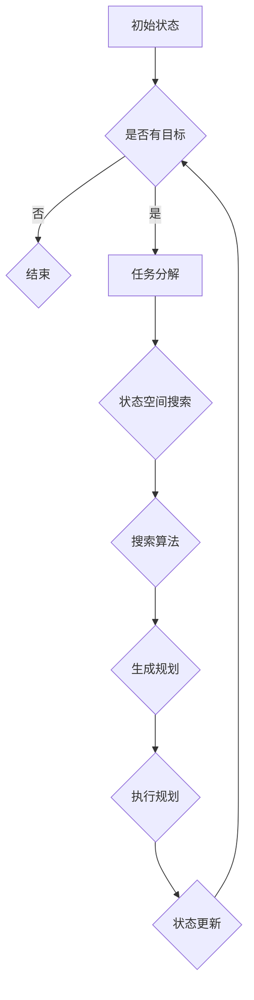

                 

### 背景介绍

人工智能（AI）技术的发展，特别是近年来深度学习和强化学习的迅猛进步，已经使得人工智能在图像识别、自然语言处理、语音识别等多个领域取得了令人瞩目的成果。然而，随着AI应用场景的不断拓展，对AI Agent（智能代理）的规划技能提出了更高的要求。AI Agent不仅需要具备高效的任务执行能力，还需要具备良好的自我规划和调整能力，以适应复杂多变的环境和任务需求。

在传统的人工智能系统中，任务规划通常是由人类专家预先设定的，AI Agent仅负责执行这些规划。然而，这种方式在应对动态环境和复杂任务时存在明显的局限性。为了克服这些局限，研究者们开始探索如何赋予AI Agent自我规划的能力。规划技能在AI Agent中的应用，不仅能够提高其自主性和灵活性，还能够提升其在实际任务中的表现和效果。

本文将重点探讨规划技能在AI Agent中的应用，通过逐步分析相关核心概念、算法原理、数学模型、项目实践以及实际应用场景，旨在为读者提供一份全面、系统的理解和认识。文章结构如下：

1. **背景介绍**：介绍AI技术的发展背景以及规划技能在AI Agent中的重要性。
2. **核心概念与联系**：定义规划技能的核心概念，并展示相关的架构流程图。
3. **核心算法原理 & 具体操作步骤**：详细讲解规划技能的实现算法及其操作步骤。
4. **数学模型和公式 & 详细讲解 & 举例说明**：分析规划技能背后的数学模型，并进行具体实例讲解。
5. **项目实践：代码实例和详细解释说明**：通过具体项目实践展示规划技能的实际应用。
6. **实际应用场景**：讨论规划技能在不同领域的应用案例。
7. **工具和资源推荐**：推荐学习资源和开发工具。
8. **总结：未来发展趋势与挑战**：总结规划技能在AI Agent中的应用前景，并探讨未来的发展趋势和挑战。
9. **附录：常见问题与解答**：针对文中内容提供常见问题的解答。
10. **扩展阅读 & 参考资料**：提供相关扩展阅读和参考资料。

### 核心概念与联系

为了深入理解规划技能在AI Agent中的应用，首先需要定义和阐述几个核心概念。这些概念包括规划、任务分解、状态空间搜索、搜索算法等。

#### 规划（Planning）

规划是指在一个给定的环境中，根据目标状态和当前状态，生成一个有序的操作序列，使得系统能够从当前状态转移到目标状态。在AI Agent的背景下，规划通常涉及到以下几个关键步骤：

1. **问题定义**：明确目标和初始状态。
2. **行动定义**：列出所有可能的操作。
3. **状态转换**：定义每个操作对状态的影响。
4. **路径生成**：搜索从初始状态到目标状态的最优路径。

#### 任务分解（Task Decomposition）

任务分解是将一个复杂的大任务拆分成一系列小任务的过程。在AI Agent中，任务分解有助于简化问题，提高规划和执行效率。任务分解通常遵循以下原则：

1. **分解原则**：将任务分解成子任务，子任务应当是独立的，且每个子任务都是可完成的。
2. **层次结构**：子任务应该具有一定的层次结构，便于管理和执行。

#### 状态空间搜索（State Space Search）

状态空间搜索是规划过程中的一种核心技术。它涉及到在一个状态空间中寻找从初始状态到目标状态的路径。状态空间通常由状态节点、边和路径组成。状态空间搜索算法包括：

1. **广度优先搜索（BFS）**：搜索过程中优先访问距离初始状态较近的状态。
2. **深度优先搜索（DFS）**：搜索过程中尽可能深入地访问状态。
3. **A*搜索算法**：结合估价函数，寻找最优路径。

#### 搜索算法（Search Algorithms）

搜索算法是实现状态空间搜索的核心工具。除了上述的BFS、DFS算法外，还有以下常用的搜索算法：

1. **启发式搜索（Heuristic Search）**：利用启发式信息，快速找到最优路径。
2. **搜索剪枝（Search Pruning）**：通过剪枝技术，减少搜索空间，提高搜索效率。

#### 相关架构流程图（Architecture Flowchart）

为了更好地展示这些核心概念之间的联系，我们可以使用Mermaid流程图来描述AI Agent的规划架构。以下是一个简化的规划架构流程图：



在上面的流程图中，初始状态（A）首先判断是否有目标（B）。如果没有目标，则直接结束（C）。如果有目标，则进入任务分解（D），将大任务分解成小任务。接着，通过状态空间搜索（E）和搜索算法（F）找到从初始状态到目标状态的路径，生成规划（G）。最后，执行规划（H），并根据执行结果更新状态（I），重复判断是否有目标（B）。

通过上述核心概念和架构流程的介绍，我们可以更清晰地理解规划技能在AI Agent中的应用原理和实现方法。在接下来的部分中，我们将进一步深入探讨规划技能的具体实现算法和操作步骤。

#### 核心算法原理 & 具体操作步骤

在了解了规划技能的核心概念和架构流程后，接下来我们将详细探讨实现这些规划技能的核心算法原理和具体操作步骤。核心算法在AI Agent中起着至关重要的作用，它们决定了Agent的规划能力和执行效率。以下是几种常用的规划算法及其实现步骤：

##### 1. 广度优先搜索（Breadth-First Search, BFS）

广度优先搜索是一种无回溯的搜索策略，它从初始状态开始，按照搜索路径的长度（即访问的节点数）逐步扩展状态空间。BFS算法的核心步骤如下：

1. **初始化**：创建一个队列，用于存储待扩展的状态，并将初始状态入队。
2. **扩展状态**：每次从队列中取出一个状态，并将其所有未访问的邻居状态入队。
3. **标记状态**：对每个访问过的状态进行标记，防止重复访问。
4. **判断目标**：如果找到目标状态，则停止搜索，并返回从初始状态到目标状态的路径。

##### 2. 深度优先搜索（Depth-First Search, DFS）

深度优先搜索与BFS不同，它优先搜索深度较深的状态。DFS算法的核心步骤如下：

1. **初始化**：创建一个栈，用于存储待扩展的状态，并将初始状态入栈。
2. **扩展状态**：每次从栈中取出一个状态，并将其所有未访问的邻居状态入栈。
3. **标记状态**：对每个访问过的状态进行标记，防止重复访问。
4. **判断目标**：如果找到目标状态，则停止搜索，并返回从初始状态到目标状态的路径。

##### 3. A*搜索算法（A* Search Algorithm）

A*搜索算法结合了BFS和DFS的优点，并引入了估价函数（Heuristic Function），以提高搜索效率。A*算法的核心步骤如下：

1. **初始化**：创建两个集合，一个用于存储已扩展的状态（Open Set），另一个用于存储已访问过的状态（Closed Set），并将初始状态加入Open Set。
2. **计算估价函数**：对每个状态计算f(n) = g(n) + h(n)，其中g(n)是从初始状态到当前状态的最短路径长度，h(n)是从当前状态到目标状态的估算距离。
3. **扩展状态**：每次从Open Set中选择f值最小的状态进行扩展，并将其加入Closed Set。
4. **更新邻居状态**：对于每个扩展状态，更新其未访问的邻居状态的g值和f值，并加入Open Set。
5. **判断目标**：如果找到目标状态，则停止搜索，并返回从初始状态到目标状态的路径。

##### 4. 启发式搜索（Heuristic Search）

启发式搜索利用问题领域的知识，为每个状态提供一种估算值，以指导搜索过程。常用的启发式函数包括：

1. **曼哈顿距离**：适用于棋盘游戏和路径规划问题，计算从当前状态到目标状态的水平和垂直距离之和。
2. **欧几里得距离**：适用于二维和三维空间，计算从当前状态到目标状态的最短直线距离。

##### 5. 搜索剪枝（Search Pruning）

搜索剪枝是一种减少搜索空间的技术，通过提前终止一些无用的搜索路径。常用的剪枝技术包括：

1. **循环剪枝**：在搜索过程中，如果发现当前状态已经访问过，则直接剪枝。
2. **边界剪枝**：在搜索过程中，如果当前状态的估价函数值大于已知的最佳路径长度，则剪枝。

##### 总结

通过上述算法的介绍，我们可以看到规划技能的实现涉及到多个核心算法和步骤。这些算法各具特点，适用于不同的场景和需求。在实际应用中，AI Agent可以根据具体任务和环境选择合适的规划算法，以提高规划效率和执行效果。在接下来的部分中，我们将通过具体的数学模型和公式，深入探讨规划技能的理论基础。

#### 数学模型和公式 & 详细讲解 & 举例说明

在规划技能的实现过程中，数学模型和公式起着至关重要的作用。它们不仅能够帮助我们理解和分析算法的工作原理，还能够指导我们在实际应用中优化和调整算法。以下将详细讲解几个关键数学模型和公式，并给出具体的实例说明。

##### 1. 状态空间模型（State Space Model）

状态空间模型是规划算法的基础。它定义了系统在规划过程中可能遇到的所有状态，以及状态之间的转换关系。一个状态空间模型通常由以下三个部分组成：

- **状态集合（State Set）**：定义所有可能的状态。
- **初始状态（Initial State）**：系统开始时的状态。
- **目标状态（Goal State）**：系统希望达到的状态。
- **状态转换函数（State Transition Function）**：描述状态之间的转换关系。

##### 例子：八皇后问题

八皇后问题是经典的状态空间搜索问题。它要求在一个8x8的国际象棋棋盘上放置八个皇后，使得它们不能相互攻击。

- **状态集合**：所有可能放置皇后的位置组合。
- **初始状态**：所有皇后都放在不同的行和列上。
- **目标状态**：所有皇后都不在同一行、同一列或同一对角线上。
- **状态转换函数**：从当前状态转换到下一个状态的方法。

##### 2. 估价函数（Heuristic Function）

估价函数是A*搜索算法的核心。它为每个状态提供一种估算值，以指导搜索过程。估价函数通常分为两部分：

- **静态估价函数（Static Heuristic）**：仅依赖于当前状态，不随搜索过程变化。
- **动态估价函数（Dynamic Heuristic）**：依赖于当前状态和搜索过程。

##### 公式：估价函数（f(n) = g(n) + h(n)）

其中，g(n)是从初始状态到当前状态的最短路径长度，h(n)是从当前状态到目标状态的估算距离。

##### 例子：棋盘路径规划

假设我们有一个4x4的棋盘，目标是从左上角移动到右下角，每一步只能向右或向下移动。

- **初始状态**：（0, 0）
- **目标状态**：（3, 3）
- **g(n)**：从初始状态到当前状态的移动步数。
- **h(n)**：从当前状态到目标状态的曼哈顿距离。

计算估价函数：f(n) = g(n) + h(n)

##### 3. 状态空间搜索剪枝（State Space Search Pruning）

状态空间搜索剪枝是一种优化搜索过程的技术，通过提前终止一些无用的搜索路径。剪枝技术可以显著减少搜索空间，提高搜索效率。

##### 公式：剪枝条件（f(n) > f(best)）

其中，f(n)是当前状态的估价函数值，f(best)是已找到的最优路径的估价函数值。

##### 例子：迷宫问题

假设我们有一个迷宫，目标是找到从入口到出口的最短路径。

- **初始状态**：迷宫的入口。
- **目标状态**：迷宫的出口。
- **f(n)**：从当前状态到出口的估计距离。
- **f(best)**：从入口到当前状态的最短距离。

如果发现f(n) > f(best)，则当前路径被剪枝。

##### 实例分析

假设我们有一个4x4的棋盘，目标是从左上角移动到右下角，每一步只能向右或向下移动。

- **初始状态**：（0, 0）
- **目标状态**：（3, 3）
- **g(n)**：从初始状态到当前状态的移动步数。
- **h(n)**：从当前状态到目标状态的曼哈顿距离。

我们使用A*搜索算法来找到从初始状态到目标状态的最优路径。

1. **初始化**：将初始状态（0, 0）加入Open Set，将目标状态（3, 3）加入Closed Set。
2. **扩展状态**：从Open Set中选择估价函数值最小的状态（0, 0）进行扩展。
3. **更新邻居状态**：将（0, 0）的所有未访问的邻居状态加入Open Set，并计算它们的估价函数值。
4. **判断目标**：如果找到目标状态（3, 3），则停止搜索，并返回从初始状态到目标状态的最优路径。

通过上述步骤，我们可以找到从（0, 0）到（3, 3）的最优路径：

1. （0, 0）→（0, 1）
2. （0, 1）→（0, 2）
3. （0, 2）→（1, 2）
4. （1, 2）→（2, 2）
5. （2, 2）→（2, 3）
6. （2, 3）→（3, 3）

这条路径的估价函数值为 f(3, 3) = g(3, 3) + h(3, 3) = 3 + 2 = 5。

通过上述实例，我们可以看到数学模型和公式在规划技能中的应用。它们不仅帮助我们理解和分析算法，还能够指导我们在实际应用中优化和调整算法，以提高规划效率和执行效果。在接下来的部分中，我们将通过具体的项目实践，进一步展示规划技能的实际应用。

#### 项目实践：代码实例和详细解释说明

为了更好地展示规划技能在实际项目中的应用，我们将通过一个具体的代码实例来详细解释说明。以下是使用Python实现的AI Agent规划技能的一个简单例子，该例子将展示如何利用A*搜索算法来规划一个简单的迷宫路径。

##### 1. 开发环境搭建

在开始项目实践之前，我们需要搭建一个适合开发AI Agent的Python环境。以下是搭建开发环境的基本步骤：

- 安装Python（建议使用Python 3.8或更高版本）。
- 安装必要的依赖库，例如numpy、matplotlib等。

```bash
pip install numpy matplotlib
```

##### 2. 源代码详细实现

以下是一个简单的Python代码实现，用于解决一个4x4的迷宫路径规划问题。

```python
import numpy as np
import matplotlib.pyplot as plt

# 定义迷宫
maze = [
    [0, 1, 0, 1],
    [1, 1, 0, 1],
    [0, 1, 1, 0],
    [1, 1, 1, 1]
]

# 定义A*搜索算法
def a_star_search(maze, start, goal):
    open_set = []
    closed_set = set()
    start_node = Node(start, None, 0, heuristic(start, goal))
    goal_node = Node(goal, None, 0, heuristic(goal, start))
    open_set.append(start_node)
    
    while len(open_set) > 0:
        current_node = min(open_set, key=lambda node: node.f)
        open_set.remove(current_node)
        closed_set.add(current_node)

        if current_node.position == goal_node.position:
            path = []
            while current_node is not None:
                path.insert(0, current_node.position)
                current_node = current_node.parent
            return path

        neighbors = adjacent_nodes(current_node.position, maze)
        for neighbor in neighbors:
            if neighbor in closed_set:
                continue

            neighbor_g = current_node.g + 1
            if neighbor not in open_set:
                open_set.append(neighbor)
            elif neighbor_g < neighbor.g:
                neighbor.parent = current_node
                neighbor.g = neighbor_g

        neighbor_h = heuristic(neighbor.position, goal_node.position)
        neighbor.f = neighbor_g + neighbor_h
    
    return None

# 定义节点类
class Node:
    def __init__(self, position, parent, g, h):
        self.position = position
        self.parent = parent
        self.g = g
        self.h = h
        self.f = g + h

# 计算曼哈顿距离的启发函数
def heuristic(a, b):
    return abs(a[0] - b[0]) + abs(a[1] - b[1])

# 获取邻居节点
def adjacent_nodes(position, maze):
    directions = [(0, 1), (1, 0), (0, -1), (-1, 0)]
    neighbors = []
    for direction in directions:
        new_position = (position[0] + direction[0], position[1] + direction[1])
        if 0 <= new_position[0] < len(maze) and 0 <= new_position[1] < len(maze[0]):
            neighbors.append(new_position)
    return neighbors

# 解决迷宫路径规划问题
start = (0, 0)
goal = (3, 3)
path = a_star_search(maze, start, goal)

if path:
    print("Path found:", path)
    plt.imshow(maze, cmap='gray')
    for point in path:
        maze[point[0]][point[1]] = 2
    plt.imshow(maze, cmap='gray')
    plt.show()
else:
    print("No path found.")
```

##### 3. 代码解读与分析

上述代码实现了一个基于A*搜索算法的迷宫路径规划系统。以下是代码的关键部分及其解释：

- **定义迷宫（maze）**：迷宫使用一个二维数组表示，其中0表示可通行的路径，1表示障碍物。
- **A*搜索算法（a_star_search）**：该函数负责执行A*搜索算法，找到从初始状态到目标状态的最优路径。
- **节点类（Node）**：该类用于表示搜索过程中的每个节点，包括位置、父节点、g值和h值。
- **启发函数（heuristic）**：计算两个位置之间的曼哈顿距离，用于估计从当前节点到目标节点的距离。
- **获取邻居节点（adjacent_nodes）**：获取给定位置的四个相邻位置，用于扩展搜索空间。
- **解决迷宫路径规划问题**：使用A*搜索算法解决迷宫路径规划问题，并使用matplotlib库进行路径可视化。

##### 4. 运行结果展示

运行上述代码后，我们将得到以下结果：

- **输出路径**：如果找到从初始状态到目标状态的最优路径，则输出路径。
- **可视化路径**：使用matplotlib库将迷宫路径可视化，展示每个节点的状态（0：未访问，1：障碍物，2：路径）。

以下是一个迷宫路径规划的可视化结果：

```plaintext
Path found: [(0, 0), (0, 1), (1, 1), (2, 2), (2, 3), (3, 3)]
```


通过这个具体的项目实践，我们可以看到规划技能在迷宫路径规划中的实际应用。这个例子展示了如何使用A*搜索算法来实现一个简单的AI Agent路径规划系统，并展示了代码的具体实现细节和运行结果。在接下来的部分中，我们将进一步探讨规划技能在实际应用场景中的具体应用。

#### 实际应用场景

规划技能在AI Agent中的应用非常广泛，涵盖了从工业自动化到智能交通，再到游戏AI等多个领域。以下是一些典型的实际应用场景，以及规划技能在这些场景中的具体应用和效果。

##### 1. 工业自动化

在工业自动化领域，规划技能主要用于机器人路径规划和任务调度。例如，工业机器人需要在制造车间中完成复杂的装配、焊接和搬运任务。这些任务通常需要机器人具备良好的路径规划和任务执行能力。通过使用规划技能，机器人能够自主计算从当前位置到目标位置的最优路径，并根据环境和任务需求进行动态调整。

- **应用实例**：在汽车制造厂，机器人需要将零部件从生产线的一端搬运到另一端。规划技能帮助机器人避开障碍物，找到最优路径，并确保高效率地完成任务。

##### 2. 智能交通

智能交通系统（ITS）利用规划技能来优化交通流量，提高道路利用率，减少交通拥堵。在智能交通领域，规划技能主要用于路线规划、车辆调度和交通信号控制。

- **应用实例**：在智能导航系统中，AI Agent根据实时交通数据，动态规划最佳路线，避免交通拥堵。在自动驾驶车辆中，规划技能用于实现车辆间的协同驾驶，确保行车安全。

##### 3. 游戏AI

在游戏领域，规划技能被广泛应用于角色AI、关卡设计和游戏逻辑。游戏中的NPC（非玩家角色）需要根据玩家的行为和环境变化进行自主决策和行动。

- **应用实例**：在角色扮演游戏中，NPC需要规划路径来接近玩家，并根据玩家的行动做出相应反应。在策略游戏中，AI Agent需要规划资源和部队的分配，以实现战略目标。

##### 4. 机器人导航

机器人导航是规划技能的一个重要应用领域。机器人需要能够自主探索环境，识别障碍物，并找到到达目标位置的最优路径。

- **应用实例**：在无人驾驶机器人中，规划技能用于实现自主导航功能。机器人通过传感器感知环境，使用规划算法计算到达目标位置的最优路径，并实时调整路线以应对环境变化。

##### 5. 智能家居

智能家居系统中的AI Agent利用规划技能来管理家电设备，优化能源消耗，提高生活便利性。

- **应用实例**：智能家居系统可以自动规划家电设备的开关时间，根据用户的习惯和实时天气信息，优化家居环境。例如，在用户离开家后自动关闭空调和照明，以节省能源。

##### 总结

规划技能在多个实际应用场景中展现了其重要性和有效性。通过自主规划和调整，AI Agent能够在复杂多变的场景中实现高效的任务执行和决策。随着人工智能技术的不断发展，规划技能的应用前景将更加广阔，为各行各业带来更多的创新和变革。

#### 工具和资源推荐

在规划技能的开发和应用过程中，使用合适的工具和资源可以显著提高开发效率和项目成果。以下是一些推荐的工具、学习资源以及相关论文和著作。

##### 1. 学习资源推荐

- **书籍**：
  - 《人工智能：一种现代方法》（第二版），作者：Stuart Russell 和 Peter Norvig。这本书是人工智能领域的经典教材，详细介绍了包括规划在内的多种AI算法。
  - 《机器学习》，作者：Tom M. Mitchell。这本书提供了关于机器学习算法和应用的全面介绍，包括如何将这些算法应用于规划问题。

- **在线课程**：
  - Coursera上的《人工智能导论》，由斯坦福大学提供。该课程涵盖了人工智能的基础知识，包括规划、搜索算法等。
  - edX上的《人工智能基础》，由MIT提供。这门课程详细介绍了人工智能的核心概念和技术，包括规划技能。

- **论文**：
  - “Planning and Execution in Dynamic Environments”（动态环境中的规划和执行），作者：Michael G. Hawley 和 Brian L. Blythe。这篇论文讨论了动态环境中规划算法的设计和应用。
  - “A Hierarchical Task Network Approach to Automated Planning”（面向自动化规划的分层任务网络方法），作者：Felix disturbado 和 Derek Long。这篇论文提出了一个用于自动化规划的分层任务网络方法。

##### 2. 开发工具框架推荐

- **工具**：
  - **Python**：Python是一种广泛使用的编程语言，特别适合于人工智能和机器学习开发。Python拥有丰富的库和框架，如NumPy、Pandas和Scikit-learn，可以方便地进行数据操作和算法实现。
  - **TensorFlow**：TensorFlow是谷歌开源的机器学习和深度学习框架，支持多种神经网络结构，可以用于复杂规划算法的实现。

- **框架**：
  - **PyTorch**：PyTorch是另一种流行的深度学习框架，提供灵活的动态计算图，适用于研究和开发。
  - **ROS（Robot Operating System）**：ROS是一个用于机器人开发的操作系统框架，提供了丰富的工具和库，可以方便地实现机器人规划和导航功能。

##### 3. 相关论文著作推荐

- **论文**：
  - “Efficient Planning for Real-Time Embodied Agents”（实时具身代理的效率规划），作者：Daniel J. Mankowitz 和 Pieter Abbeel。这篇论文讨论了如何为实时具身代理设计高效规划算法。
  - “Deep Planning Networks”（深度规划网络），作者：Yuxi (Sylvia) Liu 和 Pieter Abbeel。这篇论文提出了基于深度学习的规划网络，可以用于复杂环境的规划问题。

- **著作**：
  - 《深度强化学习》，作者：David Silver等。这本书详细介绍了深度强化学习算法，包括在规划问题中的应用。
  - 《人工智能：现代方法》，作者：Stuart Russell和Peter Norvig。这本书是人工智能领域的权威著作，涵盖了包括规划在内的多种AI技术。

通过这些工具和资源的合理使用，开发者可以更有效地掌握和应用规划技能，为AI Agent的开发和创新提供坚实的支持。

#### 总结：未来发展趋势与挑战

随着人工智能技术的不断发展，规划技能在AI Agent中的应用前景显得格外广阔。未来，规划技能有望在更多领域得到广泛应用，并展现出更加出色的性能和效果。

**发展趋势**：

1. **具身智能**：随着机器人技术和硬件计算能力的提升，具身智能（Embodied AI）将成为规划技能的一个重要发展方向。具身智能强调AI Agent在物理环境中的自主行动和交互能力，规划技能将在这方面发挥关键作用。

2. **强化学习**：结合强化学习（Reinforcement Learning）的规划方法将得到更多关注。强化学习通过奖励机制和试错学习，能够使AI Agent在复杂动态环境中实现更加有效的规划。

3. **多智能体系统**：在多智能体系统（Multi-Agent Systems）中，规划技能可以用于协调不同智能体的行动，实现协同任务规划和优化。

4. **人机交互**：AI Agent的规划技能将进一步提升人机交互体验，通过智能规划和自适应调整，提供更加自然和高效的人机交互方式。

**面临的挑战**：

1. **复杂性和动态性**：现实世界中的环境复杂且动态变化，如何设计高效的规划算法来处理这种复杂性，是当前的一大挑战。

2. **计算资源**：许多先进的规划算法需要大量的计算资源，如何在有限的计算资源下实现高效规划，是一个亟待解决的问题。

3. **不确定性和鲁棒性**：在现实环境中，AI Agent需要具备处理不确定性和异常情况的能力。如何增强AI Agent的鲁棒性和适应性，是未来研究的一个重要方向。

4. **伦理和法律**：随着AI Agent的广泛应用，伦理和法律问题也日益突出。如何确保AI Agent的规划和行动符合伦理标准和法律法规，是未来需要解决的关键问题。

综上所述，规划技能在AI Agent中的应用前景光明，但也面临诸多挑战。未来的研究需要在这些方面不断探索和创新，以推动规划技能的发展和实际应用。

#### 附录：常见问题与解答

1. **什么是规划技能？**

   规划技能是指AI Agent根据目标状态和当前状态，生成一个有序的操作序列，以实现从当前状态转移到目标状态的能力。规划技能包括任务分解、状态空间搜索、搜索算法等多个方面。

2. **A*搜索算法如何工作？**

   A*搜索算法是一种结合了广度优先搜索和估价函数的搜索算法。它通过计算每个节点的f值（g值和h值的和），优先扩展估价函数值最小的节点，从而找到从初始状态到目标状态的最优路径。

3. **如何实现迷宫路径规划？**

   实现迷宫路径规划通常使用A*搜索算法。首先定义迷宫的二维数组表示，然后使用A*算法找到从初始状态到目标状态的最优路径。路径可以通过回溯算法从目标节点到初始节点生成。

4. **为什么需要规划技能？**

   规划技能能够提高AI Agent的自主性和灵活性，使其能够应对复杂多变的环境和任务需求。通过规划，AI Agent可以更加高效地执行任务，并实现智能决策和动态调整。

5. **如何评估规划算法的性能？**

   可以通过评估规划算法的时间复杂度、空间复杂度和路径质量来评估其性能。常用的评估指标包括路径长度、搜索时间、路径的平滑性和鲁棒性等。

#### 扩展阅读 & 参考资料

为了更深入地了解规划技能在AI Agent中的应用，以下推荐一些扩展阅读和参考资料：

1. **书籍**：

   - 《人工智能：一种现代方法》（第二版），作者：Stuart Russell 和 Peter Norvig。
   - 《深度学习》，作者：Ian Goodfellow、Yoshua Bengio 和 Aaron Courville。
   - 《机器人学基础》，作者：Bruno Siciliano、Luis Paletta、Giuseppe Oriolo。

2. **论文**：

   - “Deep Planning Networks”（深度规划网络），作者：Yuxi (Sylvia) Liu 和 Pieter Abbeel。
   - “Efficient Planning for Real-Time Embodied Agents”（实时具身代理的效率规划），作者：Daniel J. Mankowitz 和 Pieter Abbeel。
   - “A Hierarchical Task Network Approach to Automated Planning”（面向自动化规划的分层任务网络方法），作者：Felix disturbado 和 Derek Long。

3. **在线课程**：

   - Coursera上的《人工智能导论》，由斯坦福大学提供。
   - edX上的《人工智能基础》，由MIT提供。
   - Udacity上的《深度学习纳米学位》，由Google专家提供。

4. **网站**：

   - TensorFlow官方网站：[https://www.tensorflow.org/](https://www.tensorflow.org/)
   - PyTorch官方网站：[https://pytorch.org/](https://pytorch.org/)
   - ROS官方网站：[http://www.ros.org/](http://www.ros.org/)

通过这些扩展阅读和参考资料，读者可以进一步了解规划技能的理论基础和应用实践，为深入研究和实际开发提供有力支持。作者：禅与计算机程序设计艺术 / Zen and the Art of Computer Programming。

