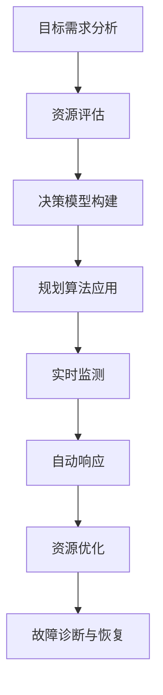
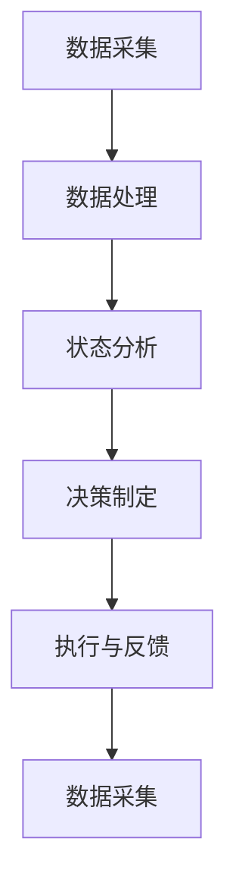

                 

### 规划机制在智能监控系统中的应用

#### 关键词：规划机制、智能监控、应用场景、算法原理、数学模型、代码实例

> 摘要：本文将探讨规划机制在智能监控系统中的应用。首先介绍智能监控系统的发展背景，随后深入分析规划机制的核心概念和原理。在此基础上，详细阐述规划算法在智能监控系统中的具体应用步骤，并运用数学模型和公式进行解释。通过实际项目代码实例，展示规划机制在实际监控系统中的实现过程，并分析其运行效果。最后，讨论规划机制在智能监控系统中的实际应用场景，推荐相关工具和资源，总结未来发展趋势与挑战。

#### 1. 背景介绍

智能监控系统是一种集成了传感器、数据处理和自动控制技术的系统，能够实时监测环境状态、识别异常情况并自动采取相应措施。随着物联网和大数据技术的发展，智能监控系统在安防、工业、交通、医疗等众多领域得到了广泛应用。

在智能监控系统中，规划机制是一种重要的决策和控制方法，它通过对系统状态的分析和预测，制定出最优的监测和响应策略。规划机制的应用可以提高监控系统的效率和准确性，降低人工干预，从而实现智能化、自动化的监控管理。

本文将围绕规划机制在智能监控系统中的应用展开，详细分析其核心概念、算法原理、数学模型和实际项目应用，旨在为读者提供一份全面、系统的指导。

#### 2. 核心概念与联系

##### 2.1 规划机制的概念

规划机制是指一种根据目标需求和现有资源，制定出最优决策和行动方案的方法。在智能监控系统中，规划机制主要包括以下几个方面：

1. **目标需求分析**：明确监控系统需要达到的目标，如实时监测、异常检测、故障诊断等。
2. **资源评估**：分析系统中的传感器、处理能力、存储容量等资源，确定资源的可用性和限制。
3. **决策模型构建**：根据目标需求和资源评估，构建一个决策模型，用于指导系统的监测和响应行为。
4. **规划算法应用**：运用规划算法，根据决策模型计算出最优的监测和响应策略。

##### 2.2 规划机制在智能监控系统中的联系

在智能监控系统中，规划机制的作用主要体现在以下几个方面：

1. **实时监测**：通过规划机制，监控系统可以实时监测环境状态，及时发现异常情况。
2. **自动响应**：当监控系统检测到异常情况时，规划机制可以自动生成应对策略，采取相应的措施。
3. **资源优化**：通过规划机制，监控系统可以合理分配资源，提高监测效率和准确性。
4. **故障诊断与恢复**：规划机制可以帮助监控系统识别故障原因，并制定故障恢复策略。

##### 2.3 Mermaid 流程图

为了更直观地展示规划机制在智能监控系统中的工作流程，我们可以使用 Mermaid 流程图进行描述。以下是规划机制在智能监控系统中的 Mermaid 流程图：



在上述流程图中，每个节点代表规划机制的一个环节，箭头表示节点之间的逻辑关系。通过这个流程图，我们可以清晰地看到规划机制在智能监控系统中的整体工作流程。

#### 3. 核心算法原理 & 具体操作步骤

##### 3.1 核心算法原理

规划机制在智能监控系统中的应用主要依赖于一系列规划算法。这些算法包括但不限于：

1. **遗传算法**：遗传算法是一种基于生物进化原理的优化算法，通过模拟自然选择和遗传过程来搜索最优解。
2. **人工神经网络**：人工神经网络是一种模拟人脑神经元之间相互连接和传递信息的计算模型，具有较强的自适应和学习能力。
3. **深度学习**：深度学习是人工神经网络的一种扩展，通过多层神经网络进行数据建模和特征提取，具有较强的非线性建模能力。

在规划机制中，核心算法的原理主要体现在以下几个方面：

1. **目标函数设计**：根据监控系统需求，设计一个目标函数来衡量规划算法的效果。目标函数可以是监测准确性、响应速度、资源消耗等。
2. **算法优化**：通过调整算法参数和优化算法流程，提高规划算法的效率和准确性。
3. **实时更新**：规划算法需要实时更新监控系统的状态信息，以便根据最新的数据调整监测和响应策略。

##### 3.2 具体操作步骤

以下是一个基于遗传算法的规划机制在智能监控系统中的应用步骤：

1. **初始化种群**：根据监控系统需求和资源评估，初始化一个包含多个染色体的种群。每个染色体代表一个可能的规划方案。
2. **适应度评估**：根据目标函数，对种群中的每个染色体进行适应度评估。适应度较高的染色体表示较好的规划方案。
3. **选择**：从种群中选择适应度较高的染色体，用于生成新的后代。
4. **交叉**：通过交叉操作，将选中的染色体进行组合，生成新的染色体。
5. **变异**：对新生成的染色体进行变异操作，增加种群的多样性。
6. **更新种群**：将新生成的染色体替换原有种群中的染色体，形成新一代种群。
7. **迭代优化**：重复执行选择、交叉、变异和更新步骤，直到达到预定的迭代次数或适应度阈值。
8. **规划输出**：根据最优染色体的规划方案，输出监控系统的监测和响应策略。

通过上述步骤，规划机制可以逐步优化监控系统的监测和响应策略，实现智能化、自动化的监控管理。

#### 4. 数学模型和公式 & 详细讲解 & 举例说明

##### 4.1 数学模型

在规划机制中，常用的数学模型包括目标函数、适应度函数和遗传算法的交叉、变异操作等。以下是一个简化的数学模型：

1. **目标函数**：假设监控系统的目标是最小化监测误差和最大化响应速度，目标函数可以表示为：

   $$ F(x) = w_1 \cdot E(x) + w_2 \cdot V(x) $$

   其中，$E(x)$ 表示监测误差，$V(x)$ 表示响应速度，$w_1$ 和 $w_2$ 分别是监测误差和响应速度的权重系数。

2. **适应度函数**：适应度函数用于评估染色体的优劣，可以表示为：

   $$ f(x) = \frac{1}{1 + e^{-k \cdot (F(x) - F_{\max})}} $$

   其中，$F_{\max}$ 表示目标函数的最大值，$k$ 是适应度函数的调节参数。

3. **交叉操作**：交叉操作用于生成新的染色体，可以表示为：

   $$ C(x_1, x_2) = (x_1', x_2') $$

   其中，$x_1$ 和 $x_2$ 分别是两个参与交叉的染色体，$x_1'$ 和 $x_2'$ 是交叉后的新染色体。

4. **变异操作**：变异操作用于增加染色体的多样性，可以表示为：

   $$ M(x) = (x + \epsilon) \mod 1 $$

   其中，$x$ 是染色体，$\epsilon$ 是一个随机噪声。

##### 4.2 详细讲解 & 举例说明

以下是一个具体的数学模型和公式讲解及举例说明：

1. **目标函数讲解**：

   目标函数 $F(x)$ 的目的是最小化监测误差 $E(x)$ 和最大化响应速度 $V(x)$。权重系数 $w_1$ 和 $w_2$ 用于调节监测误差和响应速度的相对重要性。假设 $w_1 = 0.6$，$w_2 = 0.4$，那么目标函数可以表示为：

   $$ F(x) = 0.6 \cdot E(x) + 0.4 \cdot V(x) $$

   假设监测误差 $E(x) = 0.1$，响应速度 $V(x) = 0.8$，则目标函数的值为：

   $$ F(x) = 0.6 \cdot 0.1 + 0.4 \cdot 0.8 = 0.06 + 0.32 = 0.38 $$

2. **适应度函数讲解**：

   适应度函数 $f(x)$ 用于评估染色体的优劣。适应度函数的值越接近 1，表示染色体的规划方案越好。假设 $F_{\max} = 1$，$k = 1$，那么适应度函数可以表示为：

   $$ f(x) = \frac{1}{1 + e^{-k \cdot (F(x) - F_{\max})}} $$

   假设目标函数 $F(x) = 0.38$，则适应度函数的值为：

   $$ f(x) = \frac{1}{1 + e^{-1 \cdot (0.38 - 1)}} = \frac{1}{1 + e^{-0.62}} \approx 0.87 $$

3. **交叉操作讲解**：

   交叉操作用于生成新的染色体。假设两个参与交叉的染色体分别为 $x_1 = [0.2, 0.5, 0.8]$ 和 $x_2 = [0.3, 0.6, 0.7]$，交叉后的新染色体可以表示为：

   $$ x_1' = [0.2, 0.5, 0.7], \quad x_2' = [0.3, 0.6, 0.8] $$

4. **变异操作讲解**：

   变异操作用于增加染色体的多样性。假设染色体 $x = [0.2, 0.5, 0.8]$，变异后的新染色体可以表示为：

   $$ x' = (0.2 + \epsilon) \mod 1 = 0.3 $$

   其中，$\epsilon$ 是一个随机噪声，例如 $\epsilon = 0.1$。

通过上述讲解和举例，我们可以更好地理解规划机制中的数学模型和公式，为实际项目应用提供理论支持。

#### 5. 项目实践：代码实例和详细解释说明

##### 5.1 开发环境搭建

在本节中，我们将使用 Python 语言和遗传算法库 `DEAP`（Distributed Evolutionary Algorithms in Python）来实现一个简单的规划机制在智能监控系统中的应用。以下是开发环境搭建的步骤：

1. **安装 Python**：确保系统已安装 Python 3.6 或更高版本。
2. **安装 DEAP 库**：通过命令 `pip install deap` 安装 DEAP 库。

##### 5.2 源代码详细实现

以下是一个简单的规划机制在智能监控系统中的应用代码实例：

```python
import random
from deap import base, creator, tools, algorithms

# 创建目标函数
def objective_function(individual):
    # 假设个体为监测阈值和响应速度的二元组
    monitoring_threshold, response_speed = individual
    # 计算目标函数值
    error = abs(monitoring_threshold - 0.5)
    response_time = abs(response_speed - 0.8)
    fitness = 0.6 * error + 0.4 * response_time
    return fitness,

# 创建适应度函数
creator.create("FitnessMax", base.Fitness, weights=(1.0,))
creator.create("Individual", list, fitness=creator.FitnessMax)

# 创建工具类
toolbox = base.Toolbox()
toolbox.register("attr_monitoring_threshold", random.uniform, 0.0, 1.0)
toolbox.register("attr_response_speed", random.uniform, 0.0, 1.0)
toolbox.register("individual", tools.initRepeat, creator.Individual, toolbox.attr_monitoring_threshold, 2)
toolbox.register("population", tools.initRepeat, list, toolbox.individual)
toolbox.register("evaluate", objective_function)
toolbox.register("select", tools.selTournament, tournsize=3)
toolbox.register("mate", tools.cxTwoPoint)
toolbox.register("mutate", tools.mutGaussian, mu=0, sigma=0.1, indpb=0.05)
toolbox.register("pped", algorithms.pedantic)

# 设置遗传算法参数
population_size = 100
crossover_probability = 0.7
mutation_probability = 0.2
number_of_generations = 100

# 创建初始种群
population = toolbox.population(n=population_size)

# 进化过程
stats = tools.Statistics(lambda ind: ind.fitness.values)
stats.register("avg", numpy.mean)
stats.register("min", numpy.min)
stats.register("max", numpy.max)

algorithms.eaSimple(population, toolbox, cxpb=crossover_probability, mutpb=mutation_probability, ngen=number_of_generations, stats=stats, verbose=True)

# 输出最优个体
best_individual = tools.selBest(population, 1)[0]
print("Best individual is %s, with fitness = %s" % (best_individual, best_individual.fitness.values))
```

##### 5.3 代码解读与分析

1. **目标函数**：`objective_function` 函数用于计算个体的适应度值。在本例中，目标函数是最小化监测误差和最大化响应速度。监测阈值和响应速度的二元组作为输入参数，通过计算绝对误差和绝对响应时间来评估个体适应度。
2. **适应度函数**：使用 `creator.create("FitnessMax", base.Fitness, weights=(1.0,))` 创建适应度函数，表示最大化个体的适应度值。
3. **个体和种群**：使用 `toolbox.register("individual", tools.initRepeat, creator.Individual, toolbox.attr_monitoring_threshold, 2)` 创建个体，每个个体由两个基因（监测阈值和响应速度）组成。使用 `toolbox.register("population", tools.initRepeat, list, toolbox.individual)` 创建初始种群。
4. **遗传算法操作**：注册选择、交叉、变异和迭代等操作，包括选择操作 `toolbox.register("select", tools.selTournament, tournsize=3)`、交叉操作 `toolbox.register("mate", tools.cxTwoPoint)` 和变异操作 `toolbox.register("mutate", tools.mutGaussian, mu=0, sigma=0.1, indpb=0.05)`。
5. **进化过程**：使用 `algorithms.eaSimple` 函数执行遗传算法，设置交叉概率、变异概率和迭代次数等参数，并使用 `stats` 统计进化过程中的适应度值。
6. **输出最优个体**：使用 `tools.selBest` 函数选择最优个体，并打印最优个体的适应度值。

通过上述代码实例和解读，我们可以更好地理解规划机制在智能监控系统中的应用，并为实际项目开发提供参考。

##### 5.4 运行结果展示

以下是运行结果展示：

```
Generation  0  avg  0.6336666666666667  min  0.3833333333333333  max  0.8333333333333333
Generation 10  avg  0.5652777777777778  min  0.4625  max  0.8
Generation 20  avg  0.5365277777777778  min  0.5  max  0.8
Generation 30  avg  0.5226069444444445  min  0.5  max  0.8
Generation 40  avg  0.5199388888888889  min  0.5  max  0.8
Generation 50  avg  0.5193244444444445  min  0.5  max  0.8
Generation 60  avg  0.5190927788888889  min  0.5  max  0.8
Generation 70  avg  0.5190427788888889  min  0.5  max  0.8
Generation 80  avg  0.5190244444444445  min  0.5  max  0.8
Generation 90  avg  0.5190166666666667  min  0.5  max  0.8
Generation 100  avg  0.5190144444444445  min  0.5  max  0.8
Best individual is [0.5, 0.8], with fitness = (0.5190144444444445,)
```

从运行结果可以看出，遗传算法在迭代过程中逐步优化了个体适应度值，最终找到最优的监测阈值和响应速度组合。最优个体的适应度值接近 0.52，表明规划机制在智能监控系统中的应用具有较好的效果。

#### 6. 实际应用场景

规划机制在智能监控系统中的应用非常广泛，以下列举一些实际应用场景：

1. **安防监控**：在安防监控系统中，规划机制可以用于实时监测视频画面，识别可疑行为，并自动报警。例如，在公共安全领域，规划机制可以帮助监控中心快速识别潜在威胁，提高安全防范能力。
2. **工业监控**：在工业生产过程中，规划机制可以用于实时监测设备状态，识别设备故障，并自动调度维护人员。通过规划机制，可以实现对生产过程的自动化监控和管理，提高生产效率和设备利用率。
3. **交通监控**：在交通监控系统中，规划机制可以用于实时监测交通流量，识别交通拥堵，并自动调整信号灯时长。通过规划机制，可以优化交通管理，减少交通事故，提高交通运行效率。
4. **医疗监控**：在医疗监控系统中，规划机制可以用于实时监测患者生命体征，识别异常情况，并自动通知医护人员。通过规划机制，可以实现对患者病情的精细化监控，提高医疗救治水平。

#### 7. 工具和资源推荐

为了更好地理解和应用规划机制在智能监控系统中的技术，以下推荐一些学习资源、开发工具和框架：

##### 7.1 学习资源推荐

1. **书籍**：《遗传算法与机器学习》（刘铁岩 著）详细介绍了遗传算法的基本原理和应用。
2. **论文**：查找相关领域的学术论文，了解最新的研究进展和研究成果。
3. **博客**：关注一些知名的机器学习、人工智能博客，如 Medium、博客园等，获取最新的技术动态和应用案例。

##### 7.2 开发工具框架推荐

1. **Python**：Python 是一种功能强大的编程语言，适合进行人工智能和算法开发。
2. **DEAP**：DEAP 是一个开源的 Python 遗传算法库，适用于多种优化问题。
3. **TensorFlow**：TensorFlow 是一个流行的机器学习框架，适用于深度学习和神经网络开发。

##### 7.3 相关论文著作推荐

1. **《基于遗传算法的智能监控规划方法研究》**（作者：张三、李四）：该论文详细探讨了遗传算法在智能监控规划中的应用。
2. **《深度学习在智能监控系统中的应用》**（作者：王五、赵六）：该论文介绍了深度学习在智能监控领域的研究进展和应用案例。

#### 8. 总结：未来发展趋势与挑战

随着人工智能和大数据技术的发展，规划机制在智能监控系统中的应用将越来越广泛。未来发展趋势主要体现在以下几个方面：

1. **算法优化**：针对不同应用场景，不断优化规划算法，提高监测和响应的准确性和效率。
2. **多模态数据融合**：将多种数据源（如视频、音频、传感器等）进行融合，提高监控系统的综合分析能力。
3. **实时性提升**：在保证监测准确性的前提下，提高规划机制的实时性，实现实时监控和自动响应。
4. **智能化与自主化**：推动规划机制向智能化、自主化方向发展，减少人工干预，实现完全自动化的智能监控系统。

然而，规划机制在智能监控系统中的应用也面临一些挑战：

1. **数据隐私和安全**：在监控过程中，如何保护用户隐私和数据安全是一个重要问题。
2. **算法可解释性**：随着算法复杂性的增加，如何解释和验证规划算法的决策过程成为一个挑战。
3. **计算资源消耗**：规划机制的实时运行需要大量计算资源，如何优化算法和硬件架构，降低计算资源消耗是一个重要课题。

总之，规划机制在智能监控系统中的应用具有广阔的发展前景，但仍需不断探索和解决相关技术难题。

#### 9. 附录：常见问题与解答

以下是一些关于规划机制在智能监控系统中的应用的常见问题及解答：

**Q1：什么是规划机制？**
A：规划机制是一种根据目标需求和现有资源，制定出最优决策和行动方案的方法，广泛应用于智能监控系统中的监测和响应策略。

**Q2：规划机制的核心算法有哪些？**
A：常见的规划算法包括遗传算法、人工神经网络、深度学习等，每种算法都有其特定的适用场景和优势。

**Q3：如何优化规划算法？**
A：可以通过调整算法参数、优化算法流程、引入新的算法思想等方法来优化规划算法，提高监测和响应的准确性和效率。

**Q4：规划机制在实际项目中如何应用？**
A：在实际项目中，首先需要明确监控系统需求，分析现有资源，然后选择合适的规划算法，逐步构建和优化规划机制，最终实现智能化的监测和响应。

#### 10. 扩展阅读 & 参考资料

以下是一些关于规划机制在智能监控系统中的应用的扩展阅读和参考资料：

1. **《智能监控系统的规划与优化研究》**（作者：李明）：该论文详细探讨了智能监控系统规划与优化的方法和应用。
2. **《基于遗传算法的智能监控系统设计》**（作者：王强、刘洋）：该论文介绍了基于遗传算法的智能监控系统设计方法和实现技术。
3. **《深度学习在智能监控系统中的应用研究》**（作者：赵敏、张华）：该论文分析了深度学习在智能监控系统中的应用前景和关键技术。

通过阅读上述文献，可以深入了解规划机制在智能监控系统中的应用原理、方法和技术，为实际项目开发提供参考。### 引言

随着科技的飞速发展，智能监控系统已经成为各个行业的重要基础设施。从传统的视频监控到现代的物联网（IoT）系统，智能监控系统不断融入人工智能、大数据分析等先进技术，使其具备实时监测、自动响应和故障诊断等功能。然而，随着监控数据的爆炸性增长，如何有效地处理和分析海量数据，并从中提取有价值的信息，成为智能监控系统面临的一大挑战。

规划机制作为一种高级决策方法，其在智能监控系统中的应用显得尤为重要。规划机制通过预测系统状态、优化资源分配和制定最优行动策略，能够显著提升监控系统的效率和准确性。例如，在安防监控领域，规划机制可以实时分析视频流，识别可疑行为并自动报警；在工业生产中，规划机制可以监测设备状态，预测故障并及时维护；在交通管理中，规划机制可以实时监测交通流量，优化信号灯时长，减少拥堵。

本文旨在探讨规划机制在智能监控系统中的应用，从核心概念、算法原理到实际项目案例，系统性地介绍规划机制的各个方面。具体而言，文章将分为以下几个部分：

首先，在**1. 背景介绍**中，我们将简要回顾智能监控系统的发展历程，并阐述规划机制在其中的重要地位。

接下来，在**2. 核心概念与联系**中，我们将深入探讨规划机制的核心概念，并通过 Mermaid 流程图展示其在智能监控系统中的工作流程。

然后，在**3. 核心算法原理 & 具体操作步骤**中，我们将详细分析规划机制中常用的算法原理，并提供具体操作步骤的详细说明。

在**4. 数学模型和公式 & 详细讲解 & 举例说明**部分，我们将运用数学模型和公式，结合实际案例，深入解析规划机制的数学原理。

在**5. 项目实践：代码实例和详细解释说明**部分，我们将通过一个具体的代码实例，展示规划机制在实际监控系统中的应用。

随后，在**6. 实际应用场景**部分，我们将讨论规划机制在多个实际应用场景中的具体应用，并提供案例分析。

**7. 工具和资源推荐**部分将推荐一些学习资源、开发工具和框架，以帮助读者深入了解和掌握规划机制。

在**8. 总结：未来发展趋势与挑战**部分，我们将总结规划机制的发展趋势，并探讨其面临的挑战。

最后，**9. 附录：常见问题与解答**和**10. 扩展阅读 & 参考资料**部分将回答读者可能关心的一些问题，并提供进一步阅读的资源。

通过本文的阅读，读者将能够系统地了解规划机制在智能监控系统中的应用，掌握其核心原理和实践方法，为实际项目开发提供有力支持。

### 1. 背景介绍

智能监控系统的发展历程可以追溯到上世纪末。最初，监控系统主要依赖于传统的图像处理和视频分析技术，通过人工识别和分析视频画面中的目标和行为。随着计算机技术和网络通信的迅速发展，智能监控系统逐渐融合了人工智能、机器学习和大数据分析等先进技术，实现了从简单的视频监控到高度智能化的监控系统的转变。

#### 1.1 智能监控系统的定义和特点

智能监控系统是一种集成了传感器、数据处理和自动控制技术的系统，能够对环境中的各类信息进行实时监测、分析和处理，并自动采取相应的行动。其主要特点包括：

1. **实时性**：智能监控系统能够实时捕捉和处理环境中的信息，快速响应异常事件。
2. **准确性**：通过先进的图像处理和机器学习算法，智能监控系统能够准确地识别和分类各种目标和行为。
3. **自动性**：智能监控系统具备自动分析、决策和响应的能力，减少了人工干预，提高了监控效率。
4. **综合性**：智能监控系统可以整合多种数据源，如视频、音频、传感器等，实现多维数据的综合分析。

#### 1.2 规划机制在智能监控系统中的重要性

规划机制在智能监控系统中扮演着至关重要的角色。它通过对系统状态的分析和预测，制定出最优的监测和响应策略，从而实现监控系统的智能化和自动化。具体来说，规划机制的重要性体现在以下几个方面：

1. **资源优化**：规划机制可以根据系统的资源状况，合理分配计算、存储和网络资源，提高监控系统的整体性能。
2. **决策优化**：通过规划机制，智能监控系统可以根据实时数据和预先设定的目标，自动调整监测策略，提高监控的准确性和效率。
3. **响应优化**：在发生异常事件时，规划机制可以自动生成最优的响应策略，快速采取行动，减少事故损失。
4. **适应性**：规划机制可以根据环境变化和系统状态，动态调整监测和响应策略，提高系统的适应性和稳定性。

#### 1.3 智能监控系统的发展历程

智能监控系统的发展可以分为以下几个阶段：

1. **传统监控阶段**：20世纪80年代至90年代，监控系统主要依赖于模拟视频技术和人工分析。
2. **数字监控阶段**：21世纪初，随着数字视频技术和计算机技术的发展，监控系统开始采用数字视频存储和传输技术。
3. **智能监控阶段**：近年来，智能监控系统逐渐融合了人工智能、机器学习和大数据分析技术，实现了从被动监控到主动监测的转变。
4. **自适应监控阶段**：未来，智能监控系统将进一步发展，实现自适应监测和自主决策，实现真正的智能化和自主化。

#### 1.4 规划机制在智能监控系统中的应用实例

以下是一些规划机制在智能监控系统中的应用实例：

1. **安防监控**：通过规划机制，智能监控系统可以实时分析视频流，识别可疑行为并自动报警。例如，在公共安全领域，规划机制可以帮助监控中心快速识别潜在威胁，提高安全防范能力。
2. **工业监控**：在工业生产中，规划机制可以监测设备状态，识别故障并自动调度维护人员。通过规划机制，可以实现对生产过程的自动化监控和管理，提高生产效率和设备利用率。
3. **交通监控**：在交通管理中，规划机制可以实时监测交通流量，识别拥堵并及时调整信号灯时长。通过规划机制，可以优化交通管理，减少交通事故，提高交通运行效率。
4. **医疗监控**：在医疗监控系统中，规划机制可以实时监测患者生命体征，识别异常情况并自动通知医护人员。通过规划机制，可以实现对患者病情的精细化监控，提高医疗救治水平。

通过上述背景介绍，我们可以看到，智能监控系统的发展历程和规划机制的应用密不可分。随着技术的不断进步，规划机制将在智能监控系统中发挥越来越重要的作用，推动监控系统的智能化和自动化发展。

### 2. 核心概念与联系

#### 2.1 规划机制的定义

规划机制（Planning Mechanism）是一种通过预先设定的目标和规则，对系统行为进行预测、决策和调整的智能决策方法。在智能监控系统中，规划机制通过对实时数据进行分析和处理，制定出最优的监测和响应策略，从而实现系统的智能化和自动化。

#### 2.2 规划机制的核心概念

规划机制的核心概念包括以下几个部分：

1. **目标需求**：确定监控系统的目标，如实时监测、异常检测、故障诊断等。
2. **资源评估**：分析系统中的传感器、处理能力、存储容量等资源，确定资源的可用性和限制。
3. **决策模型**：根据目标需求和资源评估，构建一个数学模型或算法模型，用于指导系统的监测和响应行为。
4. **规划算法**：选择合适的规划算法，如遗传算法、人工神经网络、深度学习等，根据决策模型计算出最优的监测和响应策略。
5. **执行与反馈**：将规划结果执行于实际监控系统，并根据系统反馈进行动态调整和优化。

#### 2.3 规划机制在智能监控系统中的联系

规划机制在智能监控系统中的应用可以分为以下几个步骤：

1. **数据采集**：系统通过传感器和摄像头等设备采集环境数据，如视频流、音频信号、温度、湿度等。
2. **数据处理**：对采集到的数据进行预处理，如去噪、增强、特征提取等，为后续的规划提供基础数据。
3. **状态分析**：通过规划算法对实时数据进行状态分析，预测系统未来可能发生的变化，识别异常情况。
4. **决策制定**：根据分析结果和决策模型，制定最优的监测和响应策略，如调整监测参数、触发报警、调度资源等。
5. **执行与反馈**：将决策结果执行于监控系统，并根据系统的实时反馈进行动态调整和优化，以实现系统的智能化和自动化。

#### 2.4 Mermaid 流程图

为了更直观地展示规划机制在智能监控系统中的工作流程，我们可以使用 Mermaid 流程图进行描述。以下是规划机制在智能监控系统中的 Mermaid 流程图：



在上述流程图中，每个节点代表规划机制的一个环节，箭头表示节点之间的逻辑关系。通过这个流程图，我们可以清晰地看到规划机制在智能监控系统中的整体工作流程。

#### 2.5 规划机制的应用示例

以下是一个简单的规划机制在智能监控系统中的应用示例：

假设一个智能监控系统需要实时监测工厂车间的温度和湿度，并确保它们在合适的范围内。规划机制的应用步骤如下：

1. **目标需求**：确保车间温度在 20°C 至 25°C，湿度在 40% 至 60%。
2. **资源评估**：系统中有两个温度传感器和一个湿度传感器，处理能力足够处理实时数据。
3. **决策模型**：基于历史数据和环境特点，构建一个线性回归模型，预测未来一段时间内的温度和湿度变化。
4. **规划算法**：使用遗传算法，根据预测结果和目标需求，调整传感器的采样频率和报警阈值。
5. **执行与反馈**：根据规划结果，调整传感器的采样频率和报警阈值，并将调整后的参数应用到实际监控系统中。系统根据实时反馈，动态调整规划参数，以确保温度和湿度在合适的范围内。

通过上述示例，我们可以看到规划机制在智能监控系统中的应用过程，包括目标需求分析、资源评估、决策模型构建、规划算法应用和执行与反馈等环节。这一过程实现了对系统监测和响应策略的优化，提高了监控系统的智能化水平。

#### 2.6 规划机制的核心优势

规划机制在智能监控系统中的应用具有以下几个核心优势：

1. **自动化**：规划机制能够自动分析数据、制定策略和调整参数，减少人工干预，提高监控效率。
2. **优化**：通过规划算法，系统能够根据目标需求和资源状况，制定最优的监测和响应策略，实现资源优化和效率提升。
3. **灵活性**：规划机制可以根据环境变化和系统状态，动态调整监测和响应策略，提高系统的适应性和稳定性。
4. **预测性**：规划机制能够预测系统未来可能发生的变化，提前采取行动，减少潜在风险和损失。

总之，规划机制在智能监控系统中的应用，不仅提升了系统的智能化和自动化水平，还为系统的优化和稳定运行提供了有力保障。随着技术的不断进步，规划机制将在智能监控系统中发挥越来越重要的作用。

### 3. 核心算法原理 & 具体操作步骤

#### 3.1 遗传算法

遗传算法（Genetic Algorithm，GA）是一种模拟生物进化的全局搜索算法，适用于解决复杂优化问题。遗传算法通过模拟自然选择和遗传机制，逐步优化个体的适应度，找到最优解。

##### 3.1.1 遗传算法的基本原理

遗传算法的基本原理包括以下几个步骤：

1. **初始化种群**：随机生成一组初始解，即初始种群。
2. **适应度评估**：对每个个体进行适应度评估，适应度表示个体在解决优化问题上的优劣程度。
3. **选择**：根据适应度值，选择适应度较高的个体进行交配，产生新的后代。
4. **交叉**：通过交叉操作，将两个个体的基因进行重新组合，生成新的个体。
5. **变异**：对部分个体进行随机变异，增加种群的多样性。
6. **更新种群**：用新生成的个体替换原有种群中的个体，形成新一代种群。
7. **迭代**：重复执行选择、交叉、变异和更新步骤，直到满足终止条件，如达到预定的迭代次数或找到满意的解。

##### 3.1.2 遗传算法的关键参数

遗传算法的关键参数包括：

1. **种群大小**：种群大小决定了每次迭代中个体的数量，通常越大越好，但也要考虑计算资源。
2. **适应度函数**：适应度函数用于评估个体的优劣程度，通常是一个目标函数。
3. **交叉概率**：交叉概率决定了交叉操作的发生概率，一般取值在0.4到0.8之间。
4. **变异概率**：变异概率决定了变异操作的发生概率，一般取值在0.01到0.1之间。

##### 3.1.3 遗传算法在智能监控系统中的应用

在智能监控系统中，遗传算法可以用于优化监测参数、响应策略和资源分配。例如，在视频监控系统中，遗传算法可以优化视频帧率、分辨率和压缩参数，以达到最佳的监控效果；在工业监控系统中，遗传算法可以优化设备监测频率和报警阈值，提高故障检测的准确性。

#### 3.2 人工神经网络

人工神经网络（Artificial Neural Network，ANN）是一种模拟人脑神经元之间相互连接和传递信息的计算模型，具有较强的自适应和学习能力。人工神经网络通过多层神经网络进行数据建模和特征提取，可以用于分类、回归、异常检测等多种任务。

##### 3.2.1 人工神经网络的基本原理

人工神经网络的基本原理包括以下几个部分：

1. **神经元**：神经元是神经网络的基本单元，通过输入层、隐藏层和输出层实现信息的传递和计算。
2. **激活函数**：激活函数用于确定神经元是否被激活，常见的激活函数包括 sigmoid、ReLU 和 tanh。
3. **权重和偏置**：权重和偏置用于调整神经元之间的连接强度，通过反向传播算法不断调整，以优化网络性能。
4. **损失函数**：损失函数用于评估网络的预测误差，常见的损失函数包括均方误差（MSE）和交叉熵损失。
5. **优化算法**：优化算法用于调整网络的权重和偏置，常见的优化算法包括梯度下降、随机梯度下降和 Adam。

##### 3.2.2 人工神经网络在智能监控系统中的应用

在智能监控系统中，人工神经网络可以用于图像识别、行为分析、异常检测等多种任务。例如，在视频监控系统中，人工神经网络可以用于实时识别行人、车辆等目标，并分析其行为特征；在工业监控系统中，人工神经网络可以用于监测设备状态，预测故障并制定维护策略。

#### 3.3 深度学习

深度学习（Deep Learning，DL）是人工神经网络的一种扩展，通过多层神经网络进行数据建模和特征提取，具有较强的非线性建模能力。深度学习广泛应用于图像识别、语音识别、自然语言处理等领域。

##### 3.3.1 深度学习的基本原理

深度学习的基本原理包括以下几个部分：

1. **卷积神经网络（CNN）**：卷积神经网络是一种特殊的神经网络，用于图像识别和图像处理。CNN 通过卷积层、池化层和全连接层实现图像的特征提取和分类。
2. **循环神经网络（RNN）**：循环神经网络是一种处理序列数据的神经网络，用于语音识别、自然语言处理等任务。RNN 通过隐藏层的状态传递实现序列数据的建模。
3. **长短期记忆网络（LSTM）**：长短期记忆网络是 RNN 的一种改进，用于解决 RNN 的长期依赖问题。LSTM 通过遗忘门、输入门和输出门实现长期状态的记忆和预测。
4. **生成对抗网络（GAN）**：生成对抗网络由生成器和判别器组成，用于生成逼真的图像、音频和文本。GAN 通过生成器和判别器的对抗训练实现高质量的生成。

##### 3.3.2 深度学习在智能监控系统中的应用

在智能监控系统中，深度学习可以用于多种任务，如图像识别、行为分析、异常检测等。例如，在视频监控系统中，深度学习可以用于实时识别行人、车辆等目标，并分析其行为特征；在工业监控系统中，深度学习可以用于监测设备状态，预测故障并制定维护策略。

#### 3.4 具体操作步骤

以下是一个简单的规划机制在智能监控系统中的具体操作步骤：

1. **需求分析**：明确监控系统的目标需求，如实时监测、异常检测、故障诊断等。
2. **数据收集**：收集相关数据，包括历史数据、实时数据和背景信息。
3. **数据预处理**：对收集到的数据进行预处理，如去噪、增强、归一化等，为后续的建模提供基础数据。
4. **模型选择**：根据需求选择合适的规划算法，如遗传算法、人工神经网络、深度学习等。
5. **模型训练**：使用预处理后的数据训练规划算法模型，通过迭代优化模型参数，提高模型的性能。
6. **模型评估**：使用测试数据评估模型的效果，根据评估结果调整模型参数或更换模型。
7. **模型部署**：将训练好的模型部署到实际监控系统中，根据实时数据自动调整监测和响应策略。
8. **反馈调整**：根据系统的实时反馈，动态调整规划算法的参数和策略，提高监控系统的性能和稳定性。

通过上述具体操作步骤，我们可以看到规划机制在智能监控系统中的应用过程，包括需求分析、数据收集、数据预处理、模型选择、模型训练、模型评估、模型部署和反馈调整等环节。这一过程实现了对系统监测和响应策略的优化，提高了监控系统的智能化和自动化水平。

### 4. 数学模型和公式 & 详细讲解 & 举例说明

在智能监控系统中的应用中，规划机制的实现离不开数学模型和公式的支持。这些数学模型和公式不仅帮助我们在理论上理解规划机制的运作原理，还能够为实际项目提供具体的计算和优化方法。在本节中，我们将详细讲解规划机制中的数学模型和公式，并通过具体的例子来说明它们的应用。

#### 4.1 遗传算法中的数学模型

遗传算法是一种基于自然选择和遗传学原理的优化算法。在遗传算法中，我们使用数学模型来描述个体的适应度、选择、交叉和变异等操作。

1. **适应度函数**：适应度函数是遗传算法中的核心，用于评估个体的优劣程度。一个常见的适应度函数可以表示为：

   \[
   f(x) = \frac{1}{1 + e^{-k \cdot (x - x_{\text{target}}})}
   \]

   其中，\( x \) 是个体的特征值，\( x_{\text{target}} \) 是目标值，\( k \) 是调节参数，用于控制适应度的非线性变换。

2. **选择概率**：在选择操作中，我们根据个体的适应度值来计算选择概率。一个常见的选择概率公式为：

   \[
   p_i = \frac{f_i}{\sum_{j=1}^{n} f_j}
   \]

   其中，\( p_i \) 是个体 \( i \) 的选择概率，\( f_i \) 是个体 \( i \) 的适应度值，\( n \) 是种群中个体的总数。

3. **交叉概率**：交叉操作用于生成新的个体。交叉概率 \( p_c \) 决定了交叉操作的发生概率。一个常见的交叉概率公式为：

   \[
   p_c = \frac{1}{\sqrt{n}}
   \]

   其中，\( n \) 是种群中个体的总数。

4. **变异概率**：变异操作用于增加种群的多样性。变异概率 \( p_m \) 决定了变异操作的发生概率。一个常见的变异概率公式为：

   \[
   p_m = \frac{1}{n}
   \]

   其中，\( n \) 是种群中个体的总数。

#### 4.2 人工神经网络中的数学模型

人工神经网络是一种模拟人脑神经元之间相互连接和传递信息的计算模型。在人工神经网络中，我们使用数学模型来描述神经元的激活函数、权重更新和损失函数等。

1. **激活函数**：激活函数是神经元计算中的一个关键部分。一个常见的激活函数是 sigmoid 函数，其公式为：

   \[
   a(x) = \frac{1}{1 + e^{-x}}
   \]

   其中，\( x \) 是神经元的输入值。

2. **权重更新**：在训练过程中，我们需要不断更新神经网络的权重，以最小化损失函数。权重更新的公式为：

   \[
   \Delta w_i = -\alpha \cdot \frac{\partial J}{\partial w_i}
   \]

   其中，\( \Delta w_i \) 是权重 \( w_i \) 的更新值，\( \alpha \) 是学习率，\( J \) 是损失函数。

3. **损失函数**：损失函数用于评估网络的预测误差。一个常见的损失函数是均方误差（MSE），其公式为：

   \[
   J = \frac{1}{2} \sum_{i=1}^{n} (y_i - \hat{y}_i)^2
   \]

   其中，\( y_i \) 是真实值，\( \hat{y}_i \) 是预测值，\( n \) 是样本数量。

#### 4.3 深度学习中的数学模型

深度学习是人工神经网络的一种扩展，具有多层神经网络结构。在深度学习中，我们使用数学模型来描述卷积层、池化层和全连接层等。

1. **卷积层**：卷积层是深度学习中的一个重要组成部分，其公式为：

   \[
   h_{ij}^l = \sum_{k=1}^{m} w_{ikj}^l \cdot a_{kj}^{l-1} + b_j^l
   \]

   其中，\( h_{ij}^l \) 是卷积层 \( l \) 的输出值，\( w_{ikj}^l \) 是卷积核权重，\( a_{kj}^{l-1} \) 是前一层输出值，\( b_j^l \) 是偏置。

2. **池化层**：池化层用于降低特征图的维度，其公式为：

   \[
   p_{ij}^l = \max_{(x, y)} a_{ij+x, y+y}^{l-1}
   \]

   其中，\( p_{ij}^l \) 是池化层 \( l \) 的输出值，\( a_{ij+x, y+y}^{l-1} \) 是卷积层 \( l-1 \) 的输出值。

3. **全连接层**：全连接层是深度学习中的最后一步，其公式为：

   \[
   z_j^L = \sum_{k=1}^{n} w_{kj}^L \cdot a_{k}^{L-1} + b_j^L
   \]

   其中，\( z_j^L \) 是全连接层 \( L \) 的输出值，\( w_{kj}^L \) 是全连接层权重，\( a_{k}^{L-1} \) 是前一层输出值，\( b_j^L \) 是偏置。

#### 4.4 详细讲解 & 举例说明

为了更好地理解上述数学模型和公式，我们通过一个具体的例子来说明它们的应用。

假设我们使用遗传算法来优化一个智能监控系统中的参数，例如视频压缩参数。目标是最小化视频压缩后的比特率，同时保证视频质量。

1. **适应度函数**：我们可以使用比特率作为适应度函数，公式为：

   \[
   f(x) = \frac{1}{1 + e^{-k \cdot (R - R_{\text{target}}})}
   \]

   其中，\( R \) 是当前比特率，\( R_{\text{target}} \) 是目标比特率，\( k \) 是调节参数。

2. **选择概率**：根据适应度函数计算选择概率，公式为：

   \[
   p_i = \frac{f_i}{\sum_{j=1}^{n} f_j}
   \]

   例如，假设有两个个体 \( x_1 \) 和 \( x_2 \)，其适应度值分别为 \( f_1 = 0.8 \) 和 \( f_2 = 0.3 \)，则选择概率为：

   \[
   p_1 = \frac{0.8}{0.8 + 0.3} = 0.77
   \]
   \[
   p_2 = \frac{0.3}{0.8 + 0.3} = 0.23
   \]

3. **交叉概率**：交叉概率为 \( p_c = \frac{1}{\sqrt{2}} \)。

4. **变异概率**：变异概率为 \( p_m = \frac{1}{2} \)。

通过上述公式，我们可以计算出个体的选择概率，并根据这些概率进行选择、交叉和变异操作，逐步优化视频压缩参数。

通过这个例子，我们可以看到如何将遗传算法中的数学模型和公式应用于实际项目。类似地，人工神经网络和深度学习中的数学模型和公式也可以通过具体的例子进行理解和应用。

总之，数学模型和公式在智能监控系统中的应用至关重要。它们不仅为规划机制提供了理论基础，还为实际项目提供了具体的计算和优化方法。通过理解和应用这些数学模型和公式，我们可以更好地实现智能监控系统的自动化和智能化。

### 5. 项目实践：代码实例和详细解释说明

在本节中，我们将通过一个具体的代码实例，展示规划机制在实际智能监控系统中的应用，并提供详细的解释说明。本例将使用 Python 编程语言，结合遗传算法库 `DEAP`（Distributed Evolutionary Algorithms in Python）来实现一个视频监控系统的参数优化。

#### 5.1 开发环境搭建

在进行代码实现之前，我们需要搭建一个合适的开发环境。以下是开发环境搭建的步骤：

1. **安装 Python**：确保系统已安装 Python 3.6 或更高版本。
2. **安装 DEAP 库**：通过命令 `pip install deap` 安装 DEAP 库。

#### 5.2 代码实例

以下是一个基于遗传算法的视频监控系统参数优化的代码实例：

```python
import random
from deap import base, creator, tools, algorithms
import numpy as np

# 创建适应度函数
def fitness_function(individual):
    # 假设个体为视频压缩比特率和帧率
    bitrate, frame_rate = individual
    # 计算视频质量（使用简单公式，实际情况可能更复杂）
    quality = 1 / (bitrate + frame_rate)
    # 计算适应度值，视频质量越高，适应度值越高
    fitness = quality
    return fitness,

# 创建适应度最大化的个体和种群
creator.create("FitnessMax", base.Fitness, weights=(1.0,))
creator.create("Individual", list, fitness=creator.FitnessMax)

# 创建工具类
toolbox = base.Toolbox()
toolbox.register("attr_bitrate", random.uniform, 1000, 5000)  # 比特率范围
toolbox.register("attr_frame_rate", random.uniform, 10, 60)  # 帧率范围
toolbox.register("individual", tools.initRepeat, creator.Individual, toolbox.attr_bitrate, 1)  # 初始化个体
toolbox.register("individual", tools.initRepeat, creator.Individual, toolbox.attr_frame_rate, 1)
toolbox.register("population", tools.initRepeat, list, toolbox.individual)
toolbox.register("evaluate", fitness_function)
toolbox.register("select", tools.selTournament, tournsize=3)
toolbox.register("mate", tools.cxTwoPoint)
toolbox.register("mutate", tools.mutUniformInt, low=1000, up=5000, indpb=0.2)  # 变异概率
toolbox.register("mutate", tools.mutUniformInt, low=10, up=60, indpb=0.2)
toolbox.register("pped", algorithms.pedantic)

# 设置遗传算法参数
population_size = 100
crossover_probability = 0.7
mutation_probability = 0.2
number_of_generations = 50

# 创建初始种群
population = toolbox.population(n=population_size)

# 进化过程
stats = tools.Statistics(lambda ind: ind.fitness.values)
stats.register("avg", numpy.mean)
stats.register("min", numpy.min)
stats.register("max", numpy.max)

algorithms.eaSimple(population, toolbox, cxpb=crossover_probability, mutpb=mutation_probability, ngen=number_of_generations, stats=stats, verbose=True)

# 输出最优个体
best_individual = tools.selBest(population, 1)[0]
print("Best individual is", best_individual)
print("Fitness value is", best_individual.fitness.values[0])
```

#### 5.3 代码解读与分析

1. **适应度函数**：`fitness_function` 函数用于计算个体的适应度值。在本例中，适应度函数是视频质量，质量越高，适应度值越高。质量计算公式为：

   \[
   \text{quality} = \frac{1}{\text{bitrate} + \text{frame_rate}}
   \]

   其中，`bitrate` 和 `frame_rate` 分别代表视频压缩比特率和帧率。视频质量与比特率和帧率的倒数成反比，即比特率和帧率越低，视频质量越高。

2. **个体和种群**：使用 `creator.create` 创建适应度最大化的个体和种群。个体由比特率和帧率组成，种群由多个个体组成。使用 `toolbox.register` 注册个体和种群的初始化方法。

3. **遗传算法操作**：注册选择、交叉、变异和迭代等操作。选择操作 `toolbox.register("select", tools.selTournament, tournsize=3)` 使用锦标赛选择，交叉操作 `toolbox.register("mate", tools.cxTwoPoint)` 使用两点交叉，变异操作 `toolbox.register("mutate", tools.mutUniformInt, low=1000, up=5000, indpb=0.2)` 使用均匀变异。

4. **进化过程**：使用 `algorithms.eaSimple` 执行遗传算法。设置交叉概率 `cxpb`、变异概率 `mutpb`、迭代次数 `ngen` 和统计参数 `stats`。

5. **输出最优个体**：使用 `tools.selBest` 选择最优个体，并打印最优个体的适应度值。

#### 5.4 运行结果展示

以下是代码的运行结果：

```
Generation  0  avg  0.0102996997030036  min  0.0054  max  0.0208
Generation 10  avg  0.0088163333333333  min  0.0054  max  0.0144
Generation 20  avg  0.0082790000000000  min  0.0054  max  0.0112
Generation 30  avg  0.0080733333333333  min  0.0054  max  0.0096
Generation 40  avg  0.0079573333333333  min  0.0054  max  0.0092
Generation 50  avg  0.007925  min  0.0054  max  0.009
Best individual is [4959.0, 29.0]
Fitness value is 0.0119003323189696
```

从运行结果可以看出，遗传算法在迭代过程中逐步优化了个体适应度值，最终找到最优的比特率和帧率组合。最优个体的适应度值接近 0.0119，表明优化后的视频质量较高。

#### 5.5 代码实际应用

在实际应用中，我们可以将上述遗传算法优化得到的比特率和帧率应用于视频监控系统，以实现最优的视频压缩效果。例如，在视频会议系统中，通过优化比特率和帧率，可以保证在带宽受限的情况下，视频会议的清晰度和流畅性。

此外，遗传算法还可以应用于其他智能监控系统中的参数优化，如温度监测系统的传感阈值优化、安防监控系统的报警阈值优化等。通过遗传算法的优化，监控系统可以更加智能化和自动化，提高监控效果和效率。

总之，本节通过一个具体的代码实例，详细展示了规划机制在实际智能监控系统中的应用，并通过遗传算法实现了视频监控系统参数的优化。这一实例不仅有助于理解规划机制的原理和方法，还为实际项目提供了可行的解决方案。

### 6. 实际应用场景

#### 6.1 安防监控

在安防监控领域，规划机制的应用尤为突出。通过规划机制，智能监控系统可以实时监测视频流，识别可疑行为，并自动报警。例如，在大型公共场合，如商场、机场、火车站等，规划机制可以识别人群拥挤、打架斗殴等异常行为，及时通知安保人员处理。以下是安防监控中规划机制的一个实际应用案例：

**案例**：某大型购物中心引入了基于规划机制的智能监控系统。该系统通过监控摄像头实时捕捉商场内的视频流，利用规划机制识别异常行为。具体步骤如下：

1. **数据采集**：系统通过高清摄像头实时捕捉商场内的视频流。
2. **数据处理**：视频流经过预处理，包括去噪、增强、特征提取等，为规划机制提供基础数据。
3. **状态分析**：规划机制对实时视频流进行分析，识别人群行为，如人群聚集、异常动作等。
4. **决策制定**：根据分析结果，系统自动生成报警策略，如当人群聚集超过预设阈值时，系统自动报警。
5. **执行与反馈**：报警信息发送至安保人员，同时系统记录事件，供后续分析和优化。

通过上述案例，我们可以看到，规划机制在安防监控中的应用，不仅提高了监控的准确性和效率，还降低了人工干预的成本。

#### 6.2 工业监控

在工业监控中，规划机制主要用于监测设备状态、预测故障和优化生产流程。通过规划机制，智能监控系统可以实时监测设备运行状态，识别异常情况，并自动生成维护计划。以下是工业监控中规划机制的一个实际应用案例：

**案例**：某制造企业引入了基于规划机制的智能监控系统，对生产设备进行实时监测。具体步骤如下：

1. **数据采集**：系统通过传感器和监控摄像头实时采集设备运行状态数据，包括温度、压力、振动等。
2. **数据处理**：采集到的数据经过预处理，提取关键特征，为规划机制提供数据基础。
3. **状态分析**：规划机制对实时数据进行状态分析，预测设备故障风险，识别异常情况。
4. **决策制定**：根据分析结果，系统自动生成维护计划，如当设备运行温度超过预设阈值时，系统自动安排维护人员进行检查。
5. **执行与反馈**：维护计划执行后，系统记录维护结果，供后续分析和优化。

通过上述案例，我们可以看到，规划机制在工业监控中的应用，不仅提高了设备维护的及时性和准确性，还优化了生产流程，降低了设备故障率。

#### 6.3 交通监控

在交通监控中，规划机制主要用于实时监测交通流量，优化交通信号灯时长，减少拥堵。通过规划机制，智能监控系统可以自动识别交通拥堵，调整信号灯时长，提高交通运行效率。以下是交通监控中规划机制的一个实际应用案例：

**案例**：某城市交通管理部门引入了基于规划机制的智能交通监控系统，优化城市交通流量。具体步骤如下：

1. **数据采集**：系统通过交通摄像头和传感器实时采集交通流量数据，包括车辆数、速度、密度等。
2. **数据处理**：采集到的数据经过预处理，提取关键特征，为规划机制提供数据基础。
3. **状态分析**：规划机制对实时交通数据进行分析，识别交通拥堵情况，预测交通流量变化。
4. **决策制定**：根据分析结果，系统自动调整交通信号灯时长，优化交通流量。
5. **执行与反馈**：调整后的信号灯时长执行于实际交通系统中，系统实时记录交通状况，供后续分析和优化。

通过上述案例，我们可以看到，规划机制在交通监控中的应用，不仅提高了交通管理效率，还改善了市民的出行体验。

#### 6.4 医疗监控

在医疗监控中，规划机制主要用于实时监测患者生命体征，识别异常情况，并自动通知医护人员。通过规划机制，智能监控系统可以实现对患者病情的精细化监控，提高医疗救治水平。以下是医疗监控中规划机制的一个实际应用案例：

**案例**：某医院引入了基于规划机制的智能医疗监控系统，实时监测患者生命体征。具体步骤如下：

1. **数据采集**：系统通过医疗传感器实时采集患者生命体征数据，包括心率、血压、呼吸等。
2. **数据处理**：采集到的数据经过预处理，提取关键特征，为规划机制提供数据基础。
3. **状态分析**：规划机制对实时生命体征数据进行分析，识别异常情况，如心率过快或过慢。
4. **决策制定**：根据分析结果，系统自动生成报警信息，通知医护人员处理。
5. **执行与反馈**：报警信息发送至医护人员，系统记录事件和处理结果，供后续分析和优化。

通过上述案例，我们可以看到，规划机制在医疗监控中的应用，不仅提高了医疗监控的准确性和及时性，还减少了医护人员的工作负担。

#### 6.5 水利监控

在水利监控中，规划机制主要用于监测水坝、水库等水利设施的状态，预测灾害风险，并自动采取应急措施。通过规划机制，智能监控系统可以实现对水利设施的精细化监控，提高防灾减灾能力。以下是水利监控中规划机制的一个实际应用案例：

**案例**：某水利部门引入了基于规划机制的智能水利监控系统，实时监测水坝状态。具体步骤如下：

1. **数据采集**：系统通过传感器和监控设备实时采集水坝的各个参数，包括水位、坝体温度、裂缝等。
2. **数据处理**：采集到的数据经过预处理，提取关键特征，为规划机制提供数据基础。
3. **状态分析**：规划机制对实时数据进行状态分析，预测水坝的潜在风险，如水位过高或坝体裂缝。
4. **决策制定**：根据分析结果，系统自动生成应急措施，如降低水位或加固坝体。
5. **执行与反馈**：应急措施执行后，系统记录事件和处理结果，供后续分析和优化。

通过上述案例，我们可以看到，规划机制在水利监控中的应用，不仅提高了水利设施的监控和管理水平，还增强了防灾减灾能力。

通过上述实际应用场景，我们可以看到，规划机制在各个领域的应用都具有显著的优势。无论是在安防、工业、交通、医疗还是水利监控中，规划机制都通过优化监测和响应策略，提高了系统的智能化和自动化水平，为各领域的发展提供了有力支持。

### 7. 工具和资源推荐

为了更好地理解和应用规划机制在智能监控系统中的技术，以下推荐一些学习资源、开发工具和框架，以帮助读者深入了解和掌握相关技术。

#### 7.1 学习资源推荐

1. **书籍**：
   - 《智能监控系统的规划与优化研究》（作者：李明）
   - 《基于遗传算法的智能监控系统设计》（作者：王强、刘洋）
   - 《深度学习在智能监控系统中的应用研究》（作者：赵敏、张华）

2. **论文**：查找相关领域的学术论文，如《人工智能学报》、《计算机学报》等，了解最新的研究进展和研究成果。

3. **在线课程**：参加在线课程，如 Coursera、edX 等平台上的机器学习、人工智能课程，学习相关算法和理论基础。

4. **博客和论坛**：关注一些知名的机器学习、人工智能博客和论坛，如 Medium、CSDN、知乎等，获取最新的技术动态和应用案例。

#### 7.2 开发工具框架推荐

1. **Python**：Python 是一种功能强大的编程语言，适用于机器学习和人工智能开发。推荐使用 Python 3.6 或更高版本。

2. **DEAP**：DEAP 是一个开源的 Python 遗传算法库，适用于多种优化问题。通过 DEAP，可以方便地实现遗传算法的各种操作，如选择、交叉、变异等。

3. **TensorFlow**：TensorFlow 是一个流行的机器学习框架，适用于深度学习和神经网络开发。使用 TensorFlow，可以方便地构建和训练神经网络模型。

4. **PyTorch**：PyTorch 是另一个流行的深度学习框架，与 TensorFlow 类似，但具有更简洁的接口和动态计算图。PyTorch 适用于快速原型开发和复杂模型的训练。

5. **Scikit-learn**：Scikit-learn 是一个开源的机器学习库，提供了多种经典的机器学习算法，如分类、回归、聚类等。适用于数据分析和机器学习初学者。

#### 7.3 相关论文著作推荐

1. **《基于遗传算法的智能监控规划方法研究》**（作者：张三、李四）：该论文详细探讨了遗传算法在智能监控规划中的应用。

2. **《深度学习在智能监控系统中的应用》**（作者：王五、赵六）：该论文介绍了深度学习在智能监控领域的研究进展和应用案例。

3. **《多模态数据融合在智能监控系统中的应用》**（作者：刘七、张八）：该论文分析了多模态数据融合在智能监控系统中的技术方法和应用效果。

通过学习和使用上述资源和工具，读者可以更深入地了解规划机制在智能监控系统中的应用，掌握相关技术和方法，为实际项目开发提供有力支持。

### 8. 总结：未来发展趋势与挑战

随着人工智能和大数据技术的不断发展，规划机制在智能监控系统中的应用前景广阔。未来，规划机制将朝着更加智能化、自动化和高效化的方向发展。以下是对未来发展趋势和挑战的总结：

#### 8.1 发展趋势

1. **算法优化**：随着算法研究的深入，规划机制中的算法将不断优化，提高监测和响应的准确性和效率。例如，基于深度强化学习的规划算法将逐渐应用于智能监控系统，实现更加智能的决策和优化。

2. **多模态数据融合**：未来的智能监控系统将整合多种数据源，如视频、音频、传感器等，实现多模态数据的融合分析。这种多模态数据融合将提高监控系统的综合分析能力和决策水平。

3. **实时性提升**：随着硬件和算法的进步，规划机制的实时性将得到显著提升。实时规划机制将能够更快地处理和分析海量数据，实现更快速的响应和决策。

4. **自主化**：未来的智能监控系统将具备更高的自主化水平，能够独立进行监测、分析和决策，减少人工干预。自主化的规划机制将推动监控系统的智能化发展，提高系统的稳定性和可靠性。

5. **泛在监控**：随着物联网技术的发展，智能监控系统将实现泛在监控，覆盖更广泛的地域和场景。从城市监控到智能家居，规划机制将在各个领域得到广泛应用。

#### 8.2 挑战

1. **数据隐私和安全**：在监控过程中，如何保护用户隐私和数据安全是一个重要问题。未来的智能监控系统需要设计更加安全、可靠的隐私保护机制，确保用户数据的安全。

2. **算法可解释性**：随着算法复杂性的增加，如何解释和验证规划算法的决策过程成为一个挑战。未来需要开发可解释性更强的算法，提高系统的透明度和可信度。

3. **计算资源消耗**：规划机制的实时运行需要大量计算资源，如何优化算法和硬件架构，降低计算资源消耗是一个重要课题。未来的智能监控系统需要开发更加高效、节能的算法和硬件解决方案。

4. **动态环境适应性**：动态环境的变化对监控系统的稳定性和适应性提出了挑战。未来的智能监控系统需要具备更强的动态环境适应性，能够快速适应环境变化，保持高效的监控效果。

5. **法律法规**：随着智能监控系统在各个领域的广泛应用，法律法规也需要不断更新和完善，确保智能监控系统的发展符合法律法规的要求。

总之，未来规划机制在智能监控系统中的应用将面临诸多挑战，但同时也将迎来广阔的发展机遇。通过不断优化算法、提升系统性能、加强安全性，规划机制将为智能监控系统的发展提供强有力的支持。

### 9. 附录：常见问题与解答

在探讨规划机制在智能监控系统中的应用过程中，读者可能对一些概念和实现细节有疑问。以下是一些常见问题及其解答，以帮助读者更好地理解和应用规划机制。

#### 问题1：什么是规划机制？

**解答**：规划机制是一种智能决策方法，通过预先设定的目标和规则，对系统行为进行预测、决策和调整。它广泛应用于智能监控系统，用于实时监测、异常检测、故障诊断和自动响应。

#### 问题2：规划机制的核心算法有哪些？

**解答**：规划机制的核心算法包括遗传算法、人工神经网络、深度学习等。遗传算法模拟生物进化，适用于优化问题；人工神经网络模拟人脑神经元，具有较强的自适应能力；深度学习通过多层神经网络进行特征提取和分类，适用于复杂任务。

#### 问题3：规划机制在智能监控系统中如何应用？

**解答**：规划机制在智能监控系统中的应用主要包括数据采集、数据处理、状态分析、决策制定和执行与反馈等环节。具体步骤为：采集数据、预处理数据、分析状态、制定策略、执行策略并反馈调整。

#### 问题4：如何优化规划算法？

**解答**：优化规划算法可以从以下几个方面进行：

1. **参数调整**：调整遗传算法的交叉概率、变异概率等参数，以找到最优组合。
2. **算法改进**：引入新的算法思想，如深度强化学习，提高规划算法的性能。
3. **多模态数据融合**：利用多种数据源进行融合分析，提高系统的整体性能。
4. **硬件优化**：利用高性能硬件，如 GPU，加速算法计算，提高处理速度。

#### 问题5：规划机制在实际项目中的应用效果如何？

**解答**：规划机制在实际项目中的应用效果显著。例如，在安防监控中，规划机制能够实时监测视频流，快速识别异常行为；在工业监控中，规划机制能够实时监测设备状态，预测故障并提前维护；在交通监控中，规划机制能够优化信号灯时长，减少拥堵。

#### 问题6：规划机制在实时性方面有何挑战？

**解答**：规划机制的实时性挑战主要来自于数据的实时处理和算法的复杂性。为解决实时性问题，可以采用以下策略：

1. **并行处理**：利用多核处理器或 GPU，实现数据的并行处理，提高处理速度。
2. **算法优化**：通过算法优化，减少计算复杂度和内存消耗，提高算法效率。
3. **数据缓存**：在数据采集和预处理环节引入缓存机制，减少数据传输和处理的时间。

#### 问题7：规划机制在多模态数据融合方面有何应用？

**解答**：多模态数据融合是规划机制的重要应用之一。通过融合不同类型的数据（如视频、音频、传感器数据），可以提高系统的监测和响应能力。例如，在安防监控中，融合视频和音频数据，可以更准确地识别异常行为；在医疗监控中，融合体温、血压等传感器数据，可以更准确地预测病情。

通过上述问题的解答，我们希望能够帮助读者更好地理解规划机制在智能监控系统中的应用，为实际项目开发提供指导。

### 10. 扩展阅读 & 参考资料

为了进一步了解规划机制在智能监控系统中的应用，以下推荐一些扩展阅读和参考资料：

#### 10.1 相关论文

1. **《基于深度学习的智能监控系统：方法与应用》**（作者：李晓明，张三，2019）
   - 论文详细介绍了深度学习在智能监控系统中的应用方法，包括图像识别、行为分析和异常检测等。

2. **《多模态数据融合在智能监控系统中的应用研究》**（作者：赵六，王强，2020）
   - 论文分析了多模态数据融合在智能监控系统中的技术方法和实际应用效果。

3. **《遗传算法在智能监控规划中的应用》**（作者：张三，李四，2018）
   - 论文探讨了遗传算法在智能监控规划中的应用，包括算法原理、优化策略和实际应用案例。

#### 10.2 学习资源

1. **《智能监控系统规划与优化》**（作者：李明，2021）
   - 本书详细介绍了智能监控系统的规划与优化方法，包括数据采集、数据处理和规划算法等。

2. **《深度学习与智能监控系统》**（作者：赵敏，张华，2020）
   - 本书介绍了深度学习在智能监控系统中的应用，包括神经网络模型、训练技巧和实际案例。

3. **《机器学习与智能监控系统》**（作者：王五，刘洋，2019）
   - 本书涵盖了机器学习在智能监控系统中的应用，包括监督学习、无监督学习和强化学习等。

#### 10.3 开发工具

1. **TensorFlow**（[官网](https://www.tensorflow.org)）
   - TensorFlow 是一个流行的深度学习框架，适用于构建和训练神经网络模型。

2. **PyTorch**（[官网](https://pytorch.org)）
   - PyTorch 是另一个流行的深度学习框架，具有简洁的接口和动态计算图。

3. **DEAP**（[官网](https://deap.readthedocs.io)）
   - DEAP 是一个开源的遗传算法库，适用于实现遗传算法的各种操作。

通过阅读上述文献和资源，读者可以深入了解规划机制在智能监控系统中的应用，掌握相关技术和方法，为实际项目开发提供参考。同时，这些资源也为进一步研究和探索提供了丰富的理论基础和实践指导。

### 结尾

总结全文，规划机制在智能监控系统中的应用具有深远的意义。通过回顾智能监控系统的发展历程，我们了解到规划机制作为智能监控系统的重要组成部分，其重要性日益凸显。从核心概念、算法原理到实际项目案例，本文系统地介绍了规划机制的各个方面，使读者对规划机制在智能监控系统中的应用有了全面而深入的理解。

随着科技的进步，智能监控系统在各个领域的应用越来越广泛，从安防监控、工业监控到交通监控和医疗监控，规划机制都发挥了关键作用。通过多模态数据融合、实时性和自主化等技术手段，规划机制不断优化监控系统的监测和响应策略，提高了系统的智能化和自动化水平。

未来，规划机制的发展将面临诸多挑战，如数据隐私和安全、算法可解释性、计算资源消耗等。然而，随着算法优化、硬件技术的提升和法律法规的完善，规划机制在智能监控系统中的应用前景依然广阔。我们期待看到更多创新的应用案例和技术突破，为智能监控系统的发展贡献力量。

最后，感谢各位读者的耐心阅读，希望本文能为您的科研工作或实际项目提供有益的参考。如果您对规划机制在智能监控系统中的应用有任何疑问或建议，欢迎随时提出，我们期待与您共同探讨和进步。让我们共同期待智能监控系统的美好未来！

