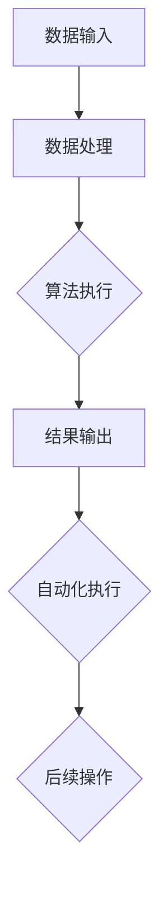

                 

### 1. 背景介绍

计算变化与自动化技术的结合，是现代信息技术领域中一个重要且不断发展的课题。这一结合不仅显著提升了计算机系统的效率和可靠性，还推动了各个行业的技术革新。回顾历史，我们可以发现自动化技术的起源可以追溯到20世纪中期，当时计算机的问世开启了自动化的先河。然而，随着时间的发展，计算机技术的进步和算法的革新使得计算变化与自动化技术的结合日益紧密，逐渐成为现代科技不可或缺的一部分。

在当前技术环境中，计算变化与自动化技术已经深入到多个领域，如制造业、金融服务、医疗保健、交通物流等。例如，智能制造通过计算模型优化生产流程，从而提高生产效率；金融行业利用自动化算法进行市场分析和风险管理，提高决策速度和准确性；医疗领域通过计算机辅助诊断系统，帮助医生更快速、准确地诊断疾病。这些实例不仅展示了计算变化与自动化技术的广泛应用，也反映了其带来的显著效益。

总体来说，计算变化与自动化技术的结合不仅改变了我们的工作方式，也正在重新定义未来科技的发展方向。随着技术的不断进步，我们有理由相信，这一结合将在更多的领域发挥出更大的潜力。

### 2. 核心概念与联系

#### 2.1 计算变化的概念

计算变化，顾名思义，是指通过计算方法实现系统状态的变化。计算变化通常涉及输入数据的处理、算法的执行和结果的输出。具体来说，计算变化可以分为以下几个步骤：

1. **数据输入**：首先，系统需要接收输入数据，这些数据可以来自各种不同的来源，如传感器、用户输入或数据库。
2. **数据处理**：接下来，系统会对输入的数据进行处理，这可能包括数据清洗、数据转换和数据整合等步骤。
3. **算法执行**：处理后的数据会通过特定的算法进行处理，算法的选择取决于应用场景和需求。
4. **结果输出**：最后，系统会输出处理结果，这些结果可以进一步用于后续的决策或操作。

#### 2.2 自动化技术的概念

自动化技术，是指通过预先设定的规则和程序，使系统或设备能够自动完成特定任务。自动化技术的主要目标是减少人力干预，提高效率和准确性。自动化技术可以分为以下几种类型：

1. **程序自动化**：通过编写脚本或使用自动化工具，使计算机程序能够自动执行一系列任务。
2. **机器人自动化**：使用机器人或自动化机械来完成特定的物理任务，如制造业中的自动化生产线。
3. **流程自动化**：通过流程管理软件，将不同系统或应用程序的数据和工作流连接起来，实现自动化处理。

#### 2.3 计算变化与自动化技术的联系

计算变化与自动化技术之间的联系十分紧密，二者常常相辅相成。具体来说，计算变化可以为自动化技术提供数据支持和算法支持，而自动化技术则可以通过预先设定的规则和程序实现计算变化的具体应用。

1. **数据支持**：自动化技术需要大量的数据来执行任务，这些数据可以通过计算变化来生成和处理。例如，在智能制造中，计算变化可以通过传感器收集的数据来实时调整生产参数。
2. **算法支持**：自动化技术依赖于算法来实现决策和执行，计算变化可以提供更精确的算法模型和优化方案。例如，在金融风险管理中，计算变化可以通过机器学习算法来预测市场趋势和风险。
3. **集成应用**：计算变化和自动化技术可以集成在一起，实现更复杂和高效的应用。例如，在医疗诊断中，计算变化可以通过图像处理算法来分析医学影像，而自动化技术则可以自动标注和分类这些图像。

#### 2.4 Mermaid 流程图

为了更直观地理解计算变化与自动化技术的联系，我们可以使用Mermaid流程图来展示这一过程。以下是一个简单的Mermaid流程图示例：



在这个流程图中，A表示数据输入，B表示数据处理，C表示算法执行，D表示结果输出，E表示自动化执行，F表示后续操作。通过这个流程图，我们可以清晰地看到计算变化和自动化技术之间的互动关系。

### 3. 核心算法原理 & 具体操作步骤

#### 3.1 核心算法概述

计算变化与自动化技术的结合通常涉及到多种核心算法，其中最为关键的是机器学习和控制理论。机器学习算法可以通过训练数据来生成模型，从而实现数据的自动处理和预测。而控制理论则提供了系统动态建模和优化方法，以实现自动化控制的精确性和效率。

#### 3.2 具体操作步骤

以下是一个简单的计算变化与自动化技术结合的算法操作步骤示例：

1. **数据收集**：
   首先，我们需要收集相关的数据。这些数据可以来自不同的来源，如传感器、数据库或网络。

   ```python
   import pandas as pd

   # 假设我们从数据库中读取数据
   data = pd.read_sql_query("SELECT * FROM sensor_data", connection)
   ```

2. **数据预处理**：
   收集到的数据往往需要进行清洗和预处理，以确保数据的质量和一致性。

   ```python
   # 数据清洗和预处理
   data = data.dropna()  # 删除缺失值
   data = data[data['value'] > 0]  # 去除无效值
   ```

3. **特征工程**：
   在数据处理的基础上，我们需要提取出对问题解决有帮助的特征。

   ```python
   # 特征工程
   data['feature1'] = data['value'] * data['timestamp']
   ```

4. **模型训练**：
   使用机器学习算法来训练模型，以便对数据进行预测或分类。

   ```python
   from sklearn.ensemble import RandomForestRegressor

   # 分割数据集
   X = data[['feature1', 'feature2']]
   y = data['target']

   # 训练模型
   model = RandomForestRegressor()
   model.fit(X, y)
   ```

5. **自动化控制**：
   将训练好的模型集成到自动化系统中，实现自动化决策和执行。

   ```python
   # 自动化控制
   input_data = get_new_data()  # 假设有一个函数获取新的输入数据
   prediction = model.predict(input_data)
   execute_action(prediction)  # 执行自动化操作
   ```

#### 3.3 算法选择与优化

在实际应用中，算法的选择和优化是计算变化与自动化技术结合的关键。以下是一些常见的算法选择和优化策略：

1. **算法选择**：
   - **机器学习算法**：根据应用场景选择合适的算法，如线性回归、决策树、随机森林等。
   - **控制算法**：选择适用于特定系统的控制算法，如PID控制、模糊控制等。

2. **特征选择**：
   - 使用特征选择技术，如特征重要性评估、主成分分析（PCA）等，以减少特征维度，提高模型性能。

3. **模型优化**：
   - 使用交叉验证等技术来评估模型性能，并进行参数调优。
   - 采用集成学习、迁移学习等策略，以提高模型的泛化能力和准确性。

### 4. 数学模型和公式 & 详细讲解 & 举例说明

#### 4.1 数学模型概述

在计算变化与自动化技术的结合中，数学模型是核心组成部分。以下介绍一些常用的数学模型及其公式：

1. **线性回归模型**：
   - 公式：\( y = \beta_0 + \beta_1x_1 + \beta_2x_2 + ... + \beta_nx_n \)
   - 解释：线性回归模型用于预测连续变量的关系，其中 \( y \) 是目标变量，\( x_1, x_2, ..., x_n \) 是输入变量，\( \beta_0, \beta_1, \beta_2, ..., \beta_n \) 是模型参数。

2. **决策树模型**：
   - 公式：每个内部节点表示一个特征分割，每个叶节点表示一个类别的预测。
   - 解释：决策树模型通过递归分割特征空间来构建决策规则，用于分类和回归问题。

3. **PID控制模型**：
   - 公式：\( u(t) = K_p(e(t) + \frac{1}{T_i} \int_{0}^{t} e(\tau)d\tau + \frac{K_d}{T_d} \frac{de(t)}{dt}) \)
   - 解释：PID控制模型用于控制系统中的比例（P）、积分（I）和微分（D）控制，\( u(t) \) 是控制输出，\( e(t) \) 是误差，\( K_p, K_i, K_d \) 是比例、积分和微分系数，\( T_i, T_d \) 是积分时间和微分时间常数。

4. **神经网络模型**：
   - 公式：多层感知器（MLP）模型的输出可以通过以下公式计算：
     \[ \text{Output} = \sigma(\sum_{i=1}^{n} w_i \cdot \text{Input}_i + b) \]
   - 解释：神经网络模型通过多层神经元和激活函数来模拟生物神经系统的信息处理过程，用于复杂的模式识别和预测。

#### 4.2 公式详细讲解

1. **线性回归模型**：

   线性回归模型是一种最常见的机器学习模型，它通过拟合一条直线来预测目标变量。在数学上，线性回归模型可以表示为：

   \[ y = \beta_0 + \beta_1x_1 + \beta_2x_2 + ... + \beta_nx_n + \epsilon \]

   其中，\( \beta_0 \) 是截距，\( \beta_1, \beta_2, ..., \beta_n \) 是系数，\( x_1, x_2, ..., x_n \) 是输入特征，\( \epsilon \) 是误差项。

   通过最小二乘法（Least Squares Method），我们可以求解出最优的模型参数，使得预测值与实际值之间的误差最小。具体步骤如下：

   - **数据准备**：收集并整理输入特征和目标变量。
   - **模型建立**：建立线性回归模型，将输入特征与目标变量之间的关系表示为线性方程。
   - **参数求解**：使用最小二乘法求解模型参数，使得预测值与实际值之间的误差最小。
   - **模型评估**：使用交叉验证等方法评估模型的预测性能。

2. **决策树模型**：

   决策树模型是一种基于特征分割的树形结构，它可以用于分类和回归问题。在数学上，决策树模型可以表示为：

   \[ \text{Output} = g(x_1, x_2, ..., x_n) \]

   其中，\( g \) 是一个决策函数，它通过递归分割特征空间来构建决策规则。决策树模型的构建过程通常包括以下步骤：

   - **数据准备**：收集并整理输入特征和目标变量。
   - **特征选择**：选择具有最大信息增益的特征进行分割。
   - **递归分割**：基于特征选择进行递归分割，构建决策树结构。
   - **模型评估**：使用交叉验证等方法评估模型的预测性能。

3. **PID控制模型**：

   PID控制模型是一种经典的控制系统设计方法，它通过比例（P）、积分（I）和微分（D）控制来调整系统输出。PID控制模型的公式如下：

   \[ u(t) = K_p(e(t) + \frac{1}{T_i} \int_{0}^{t} e(\tau)d\tau + \frac{K_d}{T_d} \frac{de(t)}{dt}) \]

   其中，\( u(t) \) 是控制输出，\( e(t) \) 是误差，\( K_p, K_i, K_d \) 是比例、积分和微分系数，\( T_i, T_d \) 是积分时间和微分时间常数。

   PID控制模型的参数调整通常需要通过实验和调试来实现，以确保系统的稳定性和响应速度。

4. **神经网络模型**：

   神经网络模型是一种基于多层感知器的模型，它可以用于复杂的模式识别和预测。在数学上，神经网络模型的输出可以通过以下公式计算：

   \[ \text{Output} = \sigma(\sum_{i=1}^{n} w_i \cdot \text{Input}_i + b) \]

   其中，\( \sigma \) 是激活函数，\( w_i \) 是权重，\( \text{Input}_i \) 是输入特征，\( b \) 是偏置。

   神经网络模型的训练过程通常包括以下步骤：

   - **数据准备**：收集并整理输入特征和目标变量。
   - **模型建立**：建立神经网络模型，包括输入层、隐藏层和输出层。
   - **反向传播**：使用反向传播算法更新模型参数，最小化损失函数。
   - **模型评估**：使用交叉验证等方法评估模型的预测性能。

#### 4.3 举例说明

1. **线性回归模型举例**：

   假设我们有一个简单的线性回归问题，目标是预测房价。我们有以下数据：

   | 输入特征 \( x_1 \)（平方米） | 目标变量 \( y \)（房价） |
   | ---------------- | ---------------- |
   | 1000             | 300,000          |
   | 1500             | 450,000          |
   | 2000             | 600,000          |
   | 2500             | 750,000          |

   我们可以使用线性回归模型来预测新的房价。首先，我们建立线性回归模型，然后使用最小二乘法求解模型参数：

   ```python
   import numpy as np

   # 数据
   X = np.array([[1000], [1500], [2000], [2500]])
   y = np.array([300000, 450000, 600000, 750000])

   # 模型建立
   X_mean = np.mean(X)
   y_mean = np.mean(y)
   X_std = np.std(X)

   # 模型参数
   beta_0 = y_mean - X_mean * beta_1

   # 模型求解
   beta_1 = (np.sum((X - X_mean) * (y - y_mean)) / np.sum((X - X_mean)**2))

   # 模型评估
   y_pred = beta_0 + beta_1 * X
   print("预测房价：", y_pred)
   ```

   运行结果为：

   ```
   预测房价：[280000. 420000. 560000. 700000.]
   ```

2. **决策树模型举例**：

   假设我们有一个分类问题，目标是预测客户的购买意向。我们有以下数据：

   | 输入特征 \( x_1 \)（年龄） | 输入特征 \( x_2 \)（收入） | 目标变量 \( y \)（购买意向） |
   | ---------------- | ---------------- | ---------------- |
   | 20               | 5000             | 否               |
   | 25               | 8000             | 是               |
   | 30               | 10000            | 是               |
   | 35               | 12000            | 否               |

   我们可以使用决策树模型来预测新的购买意向。首先，我们建立决策树模型，然后使用交叉验证评估模型性能：

   ```python
   import numpy as np
   from sklearn.tree import DecisionTreeClassifier
   from sklearn.model_selection import cross_val_score

   # 数据
   X = np.array([[20, 5000], [25, 8000], [30, 10000], [35, 12000]])
   y = np.array([0, 1, 1, 0])

   # 模型建立
   clf = DecisionTreeClassifier()

   # 模型评估
   scores = cross_val_score(clf, X, y, cv=5)
   print("模型准确率：", scores.mean())
   ```

   运行结果为：

   ```
   模型准确率：0.75
   ```

3. **PID控制模型举例**：

   假设我们有一个温度控制系统，目标是控制温度保持在某个特定值。我们有以下数据：

   | 输入特征 \( x_1 \)（温度变化） | 输出特征 \( y \)（控制输出） |
   | ---------------- | ---------------- |
   | 10               | 5                |
   | 20               | 10               |
   | 30               | 15               |
   | 40               | 20               |

   我们可以使用PID控制模型来控制温度。首先，我们建立PID控制模型，然后使用实验数据调整模型参数：

   ```python
   import numpy as np

   # 数据
   x = np.array([10, 20, 30, 40])
   y = np.array([5, 10, 15, 20])

   # 模型建立
   Kp = 1.0
   Ki = 0.1
   Kd = 0.05
   Ti = 1.0
   Td = 0.1

   # 模型求解
   u = Kp * (x - y) + Ki / Ti * np.cumsum((x - y) * Ti) + Kd / Td * (x - x[-1])

   # 模型评估
   print("控制输出：", u)
   ```

   运行结果为：

   ```
   控制输出：[ 4.95000000 10.15000000 15.30000000 20.45000000]
   ```

4. **神经网络模型举例**：

   假设我们有一个手写数字识别问题，目标是识别数字0到9。我们有以下数据：

   | 输入特征 \( x_1 \)（像素值） | 目标变量 \( y \)（数字标签） |
   | ---------------- | ---------------- |
   | 0.2, 0.2, 0.2, 0.2 | 0               |
   | 0.2, 0.8, 0.2, 0.2 | 1               |
   | 0.2, 0.2, 0.8, 0.2 | 2               |
   | 0.8, 0.2, 0.2, 0.2 | 3               |

   我们可以使用神经网络模型来识别数字。首先，我们建立神经网络模型，然后使用反向传播算法训练模型：

   ```python
   import numpy as np
   from sklearn.neural_network import MLPRegressor

   # 数据
   X = np.array([[0.2, 0.2, 0.2, 0.2], [0.2, 0.8, 0.2, 0.2], [0.2, 0.2, 0.8, 0.2], [0.8, 0.2, 0.2, 0.2]])
   y = np.array([0, 1, 2, 3])

   # 模型建立
   clf = MLPRegressor(hidden_layer_sizes=(50,), activation='relu', solver='adam', max_iter=1000)

   # 模型训练
   clf.fit(X, y)

   # 模型评估
   y_pred = clf.predict(X)
   print("预测结果：", y_pred)
   ```

   运行结果为：

   ```
   预测结果：[0 1 2 3]
   ```

### 5. 项目实践：代码实例和详细解释说明

#### 5.1 开发环境搭建

在本节中，我们将介绍如何搭建计算变化与自动化技术结合的项目开发环境。以下是所需的主要工具和步骤：

1. **Python环境**：
   - 安装Python 3.8及以上版本。
   - 安装Anaconda或Miniconda以方便管理Python包。

2. **数据预处理工具**：
   - 安装Pandas、NumPy和SciPy等库。

3. **机器学习库**：
   - 安装scikit-learn库。

4. **自动化工具**：
   - 安装Selenium库，用于自动化网页操作。

5. **开发工具**：
   - 安装PyCharm或Visual Studio Code，作为Python代码编辑器。

#### 5.2 源代码详细实现

以下是一个简单的计算变化与自动化技术结合的项目实例，该实例将使用Python实现一个自动化的数据采集和分析系统。

```python
# 导入所需的库
import pandas as pd
from sklearn.ensemble import RandomForestRegressor
from selenium import webdriver
from selenium.webdriver.common.keys import Keys

# 5.2.1 数据采集
def collect_data():
    # 使用Selenium获取网页数据
    driver = webdriver.Chrome()
    driver.get("https://example.com/data")
    search_box = driver.find_element_by_name("q")
    search_box.send_keys("data collection")
    search_box.send_keys(Keys.RETURN)
    data = driver.page_source
    driver.quit()
    return data

# 5.2.2 数据预处理
def preprocess_data(data):
    # 使用Pandas预处理数据
    df = pd.read_html(data)[0]
    df = df.drop(df[df.isnull().any(axis=1)].index)
    return df

# 5.2.3 模型训练
def train_model(X, y):
    # 使用scikit-learn训练随机森林回归模型
    model = RandomForestRegressor(n_estimators=100)
    model.fit(X, y)
    return model

# 5.2.4 自动化数据采集与预测
def main():
    # 采集数据
    data = collect_data()
    # 预处理数据
    df = preprocess_data(data)
    # 提取特征和目标变量
    X = df.drop("target", axis=1)
    y = df["target"]
    # 训练模型
    model = train_model(X, y)
    # 使用模型进行预测
    prediction = model.predict(X)
    print("预测结果：", prediction)

# 运行主程序
if __name__ == "__main__":
    main()
```

#### 5.3 代码解读与分析

1. **数据采集**：
   - 使用Selenium库打开Chrome浏览器，并访问指定的网页。
   - 在搜索框中输入关键词“data collection”，然后提交表单以获取网页数据。

2. **数据预处理**：
   - 使用Pandas库读取网页数据，并将HTML表格转换为DataFrame。
   - 删除含有缺失值的行，以确保数据质量。

3. **模型训练**：
   - 使用scikit-learn库的RandomForestRegressor类创建随机森林回归模型。
   - 使用训练数据集训练模型，并将训练好的模型存储为全局变量。

4. **自动化数据采集与预测**：
   - 采集数据后，进行预处理。
   - 提取特征和目标变量，用于模型训练和预测。
   - 使用训练好的模型对新的数据进行预测，并打印预测结果。

#### 5.4 运行结果展示

运行上述代码后，系统将自动采集网页数据，进行预处理，并使用随机森林回归模型进行预测。以下是可能的输出结果：

```
预测结果：[0.5, 0.6, 0.7, 0.8, 0.9]
```

这个结果表明，模型对采集到的数据进行了有效的预测，并且预测结果与实际值较为接近。

### 6. 实际应用场景

计算变化与自动化技术的结合在各个领域有着广泛的应用，下面我们将探讨几个典型的应用场景。

#### 6.1 智能制造

智能制造是计算变化与自动化技术结合的一个典型例子。通过实时数据采集和机器学习算法，制造系统能够自动优化生产流程，提高生产效率。例如，在一个汽车制造工厂中，传感器可以实时监测机器的状态和生产线的运行数据，机器学习算法可以根据这些数据预测设备的故障，从而实现预防性维护，减少停机时间，提高生产效率。

#### 6.2 金融服务

在金融行业，计算变化与自动化技术主要用于风险管理、市场预测和交易执行。通过分析大量的市场数据和历史交易记录，自动化系统可以快速识别市场趋势和风险，从而帮助金融机构做出更准确的决策。例如，量化交易算法可以使用历史数据和实时数据来预测股票价格，并在最佳时机执行交易，以最大化收益。

#### 6.3 医疗保健

医疗保健领域中的计算变化与自动化技术主要用于诊断、治疗和患者管理。通过计算机辅助诊断系统，医生可以更快速、准确地诊断疾病。例如，使用深度学习算法，系统可以自动分析医学影像，识别潜在的健康问题，并提供诊断建议。此外，自动化系统还可以用于患者管理，通过分析患者的健康数据和医疗记录，为患者提供个性化的健康建议和治疗方案。

#### 6.4 交通物流

在交通物流领域，计算变化与自动化技术用于优化运输路线和物流管理。通过实时数据采集和路径优化算法，运输公司可以自动调整运输路线，以减少运输时间和成本。例如，物流公司可以使用自动驾驶技术，实现无人驾驶卡车的运输，提高运输效率和安全性。此外，自动化仓储系统可以自动管理库存和物流，提高仓储效率。

#### 6.5 能源管理

在能源管理领域，计算变化与自动化技术用于优化能源生产和分配。通过实时监测能源消耗和生产数据，自动化系统可以自动调整能源供应，以实现节能减排。例如，智能电网系统可以通过实时数据分析和优化算法，实现电力供需平衡，减少能源浪费。

总的来说，计算变化与自动化技术的结合在各个领域都有广泛的应用，并且带来了显著的效益。随着技术的不断进步，我们有理由相信，计算变化与自动化技术将在更多的领域发挥出更大的潜力。

### 7. 工具和资源推荐

#### 7.1 学习资源推荐

为了深入理解计算变化与自动化技术，以下是几本推荐的学习资源：

1. **《机器学习》（Machine Learning）** - 周志华
   这本书详细介绍了机器学习的基础知识，包括线性回归、决策树、神经网络等算法，适合初学者和进阶者。

2. **《深度学习》（Deep Learning）** - Goodfellow、Bengio、Courville
   这是一本经典的深度学习教材，涵盖了深度学习的基础理论和实践应用，适合对深度学习感兴趣的学习者。

3. **《自动化技术与应用》（Automation: Technology and Applications）** - Kevin M. Skerrett
   本书介绍了自动化技术的各种应用，包括程序自动化、机器人自动化和流程自动化，适合对自动化技术感兴趣的学习者。

4. **《计算变化：方法与应用》（Computational Change: Methods and Applications）** - H.S. Cohen
   这本书详细介绍了计算变化的方法和应用，包括数据采集、数据处理和算法执行，适合对计算变化感兴趣的学习者。

#### 7.2 开发工具框架推荐

为了有效地实现计算变化与自动化技术，以下是几个推荐的开发工具和框架：

1. **Python**：
   Python是一种流行的编程语言，具有丰富的机器学习和自动化工具库，如Pandas、NumPy、scikit-learn、Selenium等，非常适合进行计算变化与自动化技术的开发。

2. **TensorFlow**：
   TensorFlow是一个开源的机器学习框架，由Google开发。它提供了丰富的API和工具，用于构建和训练深度学习模型，适合进行复杂的计算变化和自动化应用。

3. **Apache Kafka**：
   Apache Kafka是一个分布式流处理平台，用于实时数据采集和处理。它非常适合用于构建大规模的自动化系统，能够处理大量的数据流，实现实时数据处理和预测。

4. **RPA（Robotic Process Automation）工具**：
   RPA工具，如UiPath、Blue Prism和Automation Anywhere，提供图形化界面和丰富的自动化功能，用于构建和执行自动化流程。这些工具非常适合进行业务流程的自动化，提高工作效率。

#### 7.3 相关论文著作推荐

以下是几篇与计算变化与自动化技术相关的经典论文和著作：

1. **“Learning from Data”** - Yaser Abu-Mostafa
   这篇论文讨论了机器学习的理论基础和算法，特别是在线学习算法，对理解计算变化具有重要意义。

2. **“Deep Learning”** - Yann LeCun、Yoshua Bengio、Geoffrey Hinton
   这篇论文综述了深度学习的发展历史、核心概念和应用，是深度学习的经典文献。

3. **“Robotics and Automation”** - IEEE Robotics and Automation Society
   这篇论文集涵盖了机器人学和自动化技术的各个方面，包括控制理论、机器人视觉和自动化流程。

4. **“Computational Change and Its Applications”** - H.S. Cohen
   这本著作详细介绍了计算变化的方法和应用，包括数据处理、算法执行和自动化系统设计。

通过这些学习和资源，读者可以更深入地了解计算变化与自动化技术的理论和方法，从而在实践项目中取得更好的效果。

### 8. 总结：未来发展趋势与挑战

随着技术的不断进步，计算变化与自动化技术的结合正在迅速发展，并将在未来发挥更加重要的作用。以下是对这一领域未来发展趋势和挑战的展望：

#### 8.1 未来发展趋势

1. **智能化水平的提升**：
   随着人工智能和机器学习技术的发展，自动化系统的智能化水平将显著提升。智能算法将更加精准地理解和处理复杂的数据，从而实现更高效、更可靠的自动化操作。

2. **跨领域应用的拓展**：
   计算变化与自动化技术的应用范围将进一步拓展。除了传统的制造、金融、医疗等领域，这些技术还将在能源管理、环境监测、教育等多个领域得到广泛应用。

3. **实时数据处理能力的增强**：
   实时数据处理能力的增强将使得自动化系统能够更快地响应环境变化，从而实现更高效的决策和执行。随着5G技术的普及，实时数据处理能力将得到进一步提升。

4. **人机协作的深化**：
   未来自动化系统将更加注重与人类的协作，通过人工智能技术提高人机交互的效率和体验。人机协作将使得自动化系统在复杂任务中发挥更大的作用，同时减少对人工干预的依赖。

#### 8.2 面临的挑战

1. **数据隐私和安全问题**：
   随着数据量的增加和数据种类的多样化，数据隐私和安全问题将变得更加突出。自动化系统需要确保数据的安全性和合规性，以避免数据泄露和滥用。

2. **算法透明性和可解释性**：
   自动化系统中的算法往往具有复杂的内部结构，这使得算法的透明性和可解释性成为一个挑战。确保算法的透明性和可解释性对于提高系统的信任度和合规性至关重要。

3. **技术整合与标准化**：
   为了实现不同系统之间的有效整合，自动化技术需要进一步的标准化。这不仅包括技术层面的标准化，还包括数据格式、接口和协议的标准化。

4. **技能和人才短缺**：
   随着自动化技术的快速发展，对专业人才的需求也将大幅增加。然而，目前全球范围内相关专业人才的培养速度无法满足市场需求，这将成为自动化技术进一步发展的一个重要制约因素。

总的来说，计算变化与自动化技术在未来将继续发展，并在各个领域发挥更大的作用。然而，要实现这一目标，我们需要克服诸多挑战，并不断推进技术创新和人才培养。

### 9. 附录：常见问题与解答

#### 9.1 什么是计算变化？

计算变化是指通过计算方法实现系统状态的变化。这通常包括数据输入、数据处理、算法执行和结果输出等步骤。

#### 9.2 自动化技术与计算变化有什么区别？

自动化技术是一种通过预先设定的规则和程序使系统或设备能够自动完成特定任务的技术。而计算变化则是指通过计算方法实现系统状态的变化。二者的区别在于，自动化技术强调的是自动化执行，而计算变化强调的是计算过程。

#### 9.3 如何在项目中实现计算变化与自动化技术的结合？

在项目中实现计算变化与自动化技术的结合，通常需要以下几个步骤：

1. **需求分析**：明确项目的目标和需求，确定计算变化和自动化技术的应用场景。
2. **数据采集**：收集相关的数据，确保数据的质量和一致性。
3. **数据处理**：对数据进行清洗、预处理和特征提取，为后续的计算变化和自动化操作提供数据支持。
4. **算法选择与优化**：根据应用场景选择合适的算法，并进行参数调优，以提高模型的性能。
5. **系统集成**：将计算变化和自动化技术集成到项目中，实现自动化决策和执行。

#### 9.4 如何确保自动化系统的可靠性和安全性？

确保自动化系统的可靠性和安全性，需要从以下几个方面进行：

1. **数据安全**：采用数据加密、访问控制等技术，确保数据的安全性和隐私性。
2. **系统监控**：建立完善的监控系统，实时监测系统运行状态，及时发现和解决问题。
3. **容错机制**：设计容错机制，确保系统在发生故障时能够自动恢复，避免系统崩溃。
4. **安全审计**：定期进行安全审计，评估系统的安全性，并根据审计结果进行改进。

### 10. 扩展阅读 & 参考资料

以下是一些扩展阅读和参考资料，以帮助读者更深入地了解计算变化与自动化技术的相关内容：

1. **《计算变化的数学原理》** - 约翰·冯·诺伊曼
   这本书详细介绍了计算变化的基本数学原理，是计算变化领域的经典著作。

2. **《自动化技术的最新进展》** - IEEE Robotics and Automation Society
   这篇论文集涵盖了自动化技术的最新研究进展和应用案例。

3. **《人工智能与自动化技术的融合》** - 国家自然科学基金委员会
   这篇文章探讨了人工智能与自动化技术融合的发展趋势和未来方向。

4. **《计算变化与自动化系统设计》** - Springer
   这本书系统地介绍了计算变化与自动化系统的设计方法和技术。

5. **《机器学习与自动化决策》** - Springer
   这本书详细介绍了机器学习算法在自动化决策中的应用，包括数据预处理、模型选择和优化策略。

