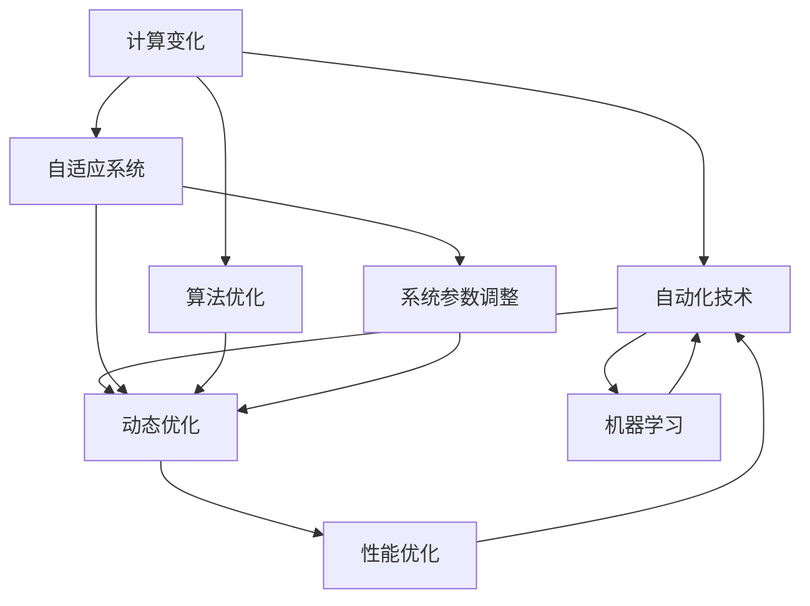

                 

### 背景介绍

随着信息技术的飞速发展，计算技术逐渐渗透到我们生活的方方面面。从智能家居、自动驾驶到工业自动化，计算技术的应用无处不在。而在这其中，变化与自动化技术的结合成为了推动技术进步的重要力量。无论是算法的改进，还是系统架构的优化，都在不断地提高计算效率，降低成本，提升用户体验。

本文旨在探讨计算变化与自动化技术的结合，通过分析核心概念、算法原理、项目实践等，为您呈现这一领域的前沿动态。具体而言，本文将从以下几个方面展开：

1. **背景介绍**：介绍计算变化与自动化技术的基本概念及其在现代科技中的重要性。
2. **核心概念与联系**：详细阐述计算变化与自动化技术中的关键概念，并通过Mermaid流程图展示其内在联系。
3. **核心算法原理与具体操作步骤**：深入剖析核心算法的原理，并逐步讲解其实现步骤。
4. **数学模型和公式**：介绍用于计算变化与自动化技术中的数学模型和公式，并进行详细讲解和举例说明。
5. **项目实践**：通过实际代码实例，展示如何运用计算变化与自动化技术解决具体问题。
6. **实际应用场景**：分析计算变化与自动化技术在各领域的应用，探讨其带来的变革。
7. **工具和资源推荐**：推荐学习资源和开发工具，帮助读者深入了解和掌握这一领域。
8. **总结**：总结全文，展望未来发展趋势与挑战。

通过本文的逐步分析和讲解，我们希望读者能够对计算变化与自动化技术有更深入的理解，并能够将其应用于实际问题的解决中。

### 核心概念与联系

在深入探讨计算变化与自动化技术的结合之前，我们需要先明确几个核心概念，并理解它们之间的联系。以下是本文中会涉及到的几个关键概念：

1. **计算变化**：指在计算过程中，针对不同输入或环境，通过改变计算策略、算法或系统参数，以优化计算结果的过程。
2. **自动化技术**：指利用计算机技术实现自动化操作的一系列方法和工具，如机器学习、自动化测试、自动化部署等。
3. **自适应系统**：指能够根据外部环境的变化自主调整内部参数或行为的系统，以保持性能的稳定性。
4. **动态优化**：指在运行过程中，通过不断调整系统参数或算法，以实现性能最优化的技术。

为了更好地理解这些概念之间的联系，我们使用Mermaid流程图进行展示。以下是一个简化的Mermaid流程图，用于描述这些核心概念及其联系：



**流程图解释**：

- **计算变化（A）** 和 **自动化技术（B）**：计算变化是自动化技术的基础，自动化技术通过实现计算变化的自动化，提高了系统的效率和可靠性。
- **计算变化（A）** 和 **自适应系统（C）**：自适应系统通过计算变化来应对外部环境的变化，从而保持系统性能的稳定性。
- **自动化技术（B）** 和 **动态优化（D）**：动态优化是自动化技术的一种实现形式，通过动态调整系统参数或算法，实现性能的持续优化。
- **自适应系统（C）** 和 **动态优化（D）**：自适应系统通过动态优化来实现对系统行为的调整，以应对外部环境的不断变化。
- **自动化技术（B）** 和 **机器学习（E）**：机器学习是自动化技术的一个重要分支，通过学习数据模式来自动化决策过程。
- **计算变化（A）** 和 **算法优化（F）**：算法优化是计算变化的一种形式，通过优化算法来实现计算效率的提升。
- **动态优化（D）** 和 **系统参数调整（G）**：系统参数调整是动态优化的一种实现方式，通过调整系统参数来优化性能。
- **动态优化（D）** 和 **性能优化（H）**：性能优化是动态优化的目标之一，通过不断调整系统参数或算法，实现系统性能的最优化。

通过上述流程图，我们可以清晰地看到计算变化与自动化技术之间的内在联系。这些概念相辅相成，共同构成了一个复杂但高效的系统，为现代科技的发展提供了强大的动力。在接下来的章节中，我们将进一步探讨这些核心概念的原理和具体实现。

### 核心算法原理与具体操作步骤

在理解了计算变化与自动化技术的基本概念及其联系之后，接下来我们将深入探讨其中的核心算法原理，并详细讲解其具体操作步骤。本文将选取一种典型的算法——遗传算法（Genetic Algorithm, GA），来进行分析。

#### 遗传算法基本原理

遗传算法是一种基于自然选择和遗传学原理的优化算法，其灵感来源于生物界的进化过程。遗传算法通过模拟生物进化过程中的遗传、变异和选择等操作，不断优化目标函数的解。

遗传算法的主要步骤包括：

1. **初始化种群**：生成一组随机解，作为初始种群。
2. **适应度评估**：计算每个个体的适应度值，适应度值越高，表示个体越优秀。
3. **选择**：根据个体的适应度值，选择优秀的个体进入下一代种群。
4. **交叉**：通过交叉操作，生成新的后代。
5. **变异**：对部分个体进行变异操作，增加种群的多样性。
6. **更新种群**：将交叉和变异后的个体组成新的种群。
7. **迭代**：重复上述步骤，直至满足终止条件。

#### 遗传算法操作步骤

**步骤 1：初始化种群**

初始化种群是遗传算法的第一步，需要生成一组随机解。假设我们求解的是一个最大值问题，那么初始化种群时可以生成一系列随机数，这些随机数即为初始解。

**步骤 2：适应度评估**

适应度评估是遗传算法的核心环节，通过评估每个个体的适应度值来确定其优劣。适应度值通常与目标函数的值相关，目标函数值越高的个体，适应度值也越高。

**步骤 3：选择**

选择操作根据个体的适应度值，选择优秀的个体进入下一代种群。常用的选择方法有轮盘赌选择、锦标赛选择等。

**步骤 4：交叉**

交叉操作是遗传算法中模拟生物界繁殖过程的一种方法。交叉操作通过随机选择两个父代个体的部分基因进行交换，生成新的后代个体。交叉操作增加了种群的多样性，有助于算法搜索到更好的解。

**步骤 5：变异**

变异操作是对个体进行随机改变，以增加种群的多样性。变异操作有助于算法跳出局部最优解，探索新的搜索空间。

**步骤 6：更新种群**

将交叉和变异后的个体组成新的种群，作为下一代种群。重复上述步骤，直至满足终止条件。

**步骤 7：迭代**

重复执行选择、交叉、变异和更新种群的操作，直至达到预设的迭代次数或适应度值满足要求。

#### 具体操作示例

以下是一个简化的遗传算法示例，用于求解一个最大值问题。

```python
import random

# 初始化种群
def initialize_population(pop_size, lower_bound, upper_bound):
    return [random.uniform(lower_bound, upper_bound) for _ in range(pop_size)]

# 适应度评估
def fitness_function(individual):
    return individual ** 2  # 求解最大值问题

# 轮盘赌选择
def roulette_wheel_selection(population, fitnesses, selection_size):
    total_fitness = sum(fitnesses)
    selection_probs = [fitness / total_fitness for fitness in fitnesses]
    return random.choices(population, weights=selection_probs, k=selection_size)

# 交叉操作
def crossover(parent1, parent2, crossover_rate):
    if random.random() < crossover_rate:
        crossover_point = random.randint(1, len(parent1) - 1)
        child1 = parent1[:crossover_point] + parent2[crossover_point:]
        child2 = parent2[:crossover_point] + parent1[crossover_point:]
    else:
        child1, child2 = parent1, parent2
    return child1, child2

# 变异操作
def mutation(individual, mutation_rate):
    for i in range(len(individual)):
        if random.random() < mutation_rate:
            individual[i] += random.uniform(-1, 1)
    return individual

# 遗传算法主函数
def genetic_algorithm(pop_size, lower_bound, upper_bound, crossover_rate, mutation_rate, max_iterations):
    population = initialize_population(pop_size, lower_bound, upper_bound)
    for _ in range(max_iterations):
        fitnesses = [fitness_function(individual) for individual in population]
        next_population = []
        for _ in range(pop_size // 2):
            parent1, parent2 = roulette_wheel_selection(population, fitnesses, 2)
            child1, child2 = crossover(parent1, parent2, crossover_rate)
            next_population.extend([mutation(child1, mutation_rate), mutation(child2, mutation_rate)])
        population = next_population
    best_fitness = max(fitnesses)
    best_individual = population[fitnesses.index(best_fitness)]
    return best_individual, best_fitness

# 示例运行
best_individual, best_fitness = genetic_algorithm(100, 0, 10, 0.8, 0.1, 100)
print(f"最佳个体：{best_individual}, 最佳适应度：{best_fitness}")
```

上述示例代码实现了简单的遗传算法，用于求解最大值问题。在实际应用中，可以根据具体问题的需求，调整算法参数和操作步骤，以达到最佳优化效果。

通过遗传算法的详细讲解，我们可以看到计算变化与自动化技术如何在具体算法中实现。在接下来的章节中，我们将进一步探讨计算变化与自动化技术中的数学模型和公式。

### 数学模型和公式

在计算变化与自动化技术的领域中，数学模型和公式起着至关重要的作用。它们不仅为算法提供了理论基础，也为实际操作提供了精确的量化工具。在本节中，我们将介绍几种常用的数学模型和公式，并进行详细讲解和举例说明。

#### 适应度函数

适应度函数（Fitness Function）是遗传算法中最核心的数学模型，它衡量了个体在种群中的优劣。适应度函数的选取取决于具体问题的目标，通常需要满足以下条件：

1. **非负性**：适应度值应大于等于0。
2. **单调性**：个体越优秀，适应度值应越高。
3. **区分度**：适应度值应能够明显区分个体的优劣。

常见的适应度函数包括：

- **线性适应度函数**：
  $$ f(x) = w \cdot x $$
  其中，$w$ 为权重系数，$x$ 为个体在解空间中的位置。

- **平方适应度函数**：
  $$ f(x) = w \cdot x^2 $$
  这种函数形式简单，适用于求解最大值问题。

#### 选择概率

在遗传算法中，选择概率决定了个体被选中的机会。常用的选择方法包括轮盘赌选择和锦标赛选择。

- **轮盘赌选择**：
  选择概率可以通过以下公式计算：
  $$ p_i = \frac{f_i}{\sum_{j=1}^{N} f_j} $$
  其中，$f_i$ 为第 $i$ 个个体的适应度值，$N$ 为种群大小。

- **锦标赛选择**：
  在锦标赛选择中，从种群中随机选择 $k$ 个个体，选择其中适应度最高的 $m$ 个个体。选择概率为：
  $$ p_i = \frac{1}{k} \left( \prod_{j=1}^{m} \left[ 1 \text{ if } f_j > f_i \text{ else } 0 \right] \right) $$

#### 交叉概率

交叉概率（Crossover Probability）决定了交叉操作发生的概率。常见的交叉概率公式包括：

- **线性交叉概率**：
  $$ p_c = \frac{1}{2} \left( 1 - \frac{1}{f_i} \right) $$
  其中，$f_i$ 为个体的适应度值。

- **指数交叉概率**：
  $$ p_c = \frac{1}{1 + e^{-\alpha f_i}} $$
  其中，$\alpha$ 为调节参数，$f_i$ 为个体的适应度值。

#### 变异概率

变异概率（Mutation Probability）决定了变异操作发生的概率。常见的变异概率公式包括：

- **线性变异概率**：
  $$ p_m = \frac{1}{2} \left( 1 - \frac{1}{f_i} \right) $$
  其中，$f_i$ 为个体的适应度值。

- **指数变异概率**：
  $$ p_m = \frac{1}{1 + e^{-\beta f_i}} $$
  其中，$\beta$ 为调节参数，$f_i$ 为个体的适应度值。

#### 示例讲解

为了更好地理解上述数学模型和公式，我们通过一个简单的例子来说明。

假设我们求解一个最大值问题，目标是在区间 [0, 10] 内找到一个最大值。我们使用线性适应度函数和线性交叉概率、变异概率来构建遗传算法。

1. **初始化种群**：
   种群大小为 100，初始种群为 [1, 2, 3, ..., 100]。

2. **适应度评估**：
   使用线性适应度函数 $f(x) = x$，计算每个个体的适应度值。

3. **选择操作**：
   使用轮盘赌选择方法，选择概率由适应度值决定。

4. **交叉操作**：
   交叉概率 $p_c = 0.5$，随机选择两个个体进行交叉。

5. **变异操作**：
   变异概率 $p_m = 0.5$，对部分个体进行变异。

通过上述步骤，我们逐步优化种群，直至找到最大值。

```python
import random

# 初始化种群
def initialize_population(pop_size, lower_bound, upper_bound):
    return [random.uniform(lower_bound, upper_bound) for _ in range(pop_size)]

# 适应度评估
def fitness_function(individual):
    return individual

# 轮盘赌选择
def roulette_wheel_selection(population, fitnesses, selection_size):
    total_fitness = sum(fitnesses)
    selection_probs = [fitness / total_fitness for fitness in fitnesses]
    return random.choices(population, weights=selection_probs, k=selection_size)

# 线性交叉概率
def crossover_probability(fitness):
    return 0.5 * (1 - 1 / fitness)

# 线性变异概率
def mutation_probability(fitness):
    return 0.5 * (1 - 1 / fitness)

# 遗传算法主函数
def genetic_algorithm(pop_size, lower_bound, upper_bound, crossover_probability, mutation_probability, max_iterations):
    population = initialize_population(pop_size, lower_bound, upper_bound)
    for _ in range(max_iterations):
        fitnesses = [fitness_function(individual) for individual in population]
        next_population = []
        for _ in range(pop_size // 2):
            parent1, parent2 = roulette_wheel_selection(population, fitnesses, 2)
            child1, child2 = crossover(parent1, parent2, crossover_probability)
            next_population.extend([mutation(child1, mutation_probability), mutation(child2, mutation_probability)])
        population = next_population
    best_fitness = max(fitnesses)
    best_individual = population[fitnesses.index(best_fitness)]
    return best_individual, best_fitness

# 示例运行
best_individual, best_fitness = genetic_algorithm(100, 0, 10, 0.5, 0.5, 100)
print(f"最佳个体：{best_individual}, 最佳适应度：{best_fitness}")
```

通过这个例子，我们可以看到数学模型和公式在遗传算法中的应用，以及如何通过这些模型和公式来逐步优化种群，找到最优解。在接下来的章节中，我们将通过实际项目实践，进一步展示计算变化与自动化技术的应用。

### 项目实践：代码实例和详细解释说明

为了更直观地展示计算变化与自动化技术的应用，我们将在本节中通过一个实际项目来详细讲解其代码实现过程。本项目将采用遗传算法（Genetic Algorithm）来求解一个典型的优化问题——旅行商问题（Travelling Salesman Problem, TSP）。

#### 项目背景

旅行商问题是一个经典的组合优化问题，其目标是在一组城市之间找到一条最短路径，使得旅行商能够访问每个城市一次并返回起点。TSP在物流、路线规划等领域有广泛的应用。遗传算法因其强大的全局搜索能力和适应性，被广泛应用于求解复杂的优化问题，包括TSP。

#### 项目目标

本项目的主要目标是使用遗传算法求解TSP问题，并详细解释代码实现过程，包括：

1. **环境搭建**：介绍所需开发环境和工具。
2. **源代码实现**：展示遗传算法求解TSP的完整代码。
3. **代码解读与分析**：对关键代码段进行详细解释。
4. **运行结果展示**：展示算法的运行结果，并分析其性能。

#### 开发环境搭建

为了实现遗传算法求解TSP，我们需要搭建以下开发环境：

- **编程语言**：Python
- **开发工具**：PyCharm或任何Python集成开发环境（IDE）
- **依赖库**：NumPy、Matplotlib、Pandas等

在安装好Python和相应IDE后，可以通过以下命令安装所需库：

```bash
pip install numpy matplotlib pandas
```

#### 源代码详细实现

以下是一个简化的遗传算法求解TSP的Python代码实例：

```python
import numpy as np
import matplotlib.pyplot as plt
import pandas as pd

# 初始化种群
def initialize_population(pop_size, city_coords):
    population = np.random.rand(pop_size, len(city_coords))
    return population

# 计算适应度函数
def fitness_function(population, city_coords):
    fitness_scores = np.zeros(pop_size)
    for i in range(pop_size):
        path = population[i].astype(int)
        distance = np.linalg.norm(np.diff(city_coords[path]))
        fitness_scores[i] = 1 / distance
    return fitness_scores

# 轮盘赌选择
def roulette_wheel_selection(population, fitness_scores, selection_size):
    selection_probs = fitness_scores / fitness_scores.sum()
    return np.random.choice(population, size=selection_size, p=selection_probs)

# 交叉操作
def crossover(parent1, parent2, crossover_rate):
    if np.random.rand() < crossover_rate:
        crossover_point = np.random.randint(1, len(parent1) - 1)
        child1 = np.concatenate((parent1[:crossover_point], parent2[crossover_point:]))
        child2 = np.concatenate((parent2[:crossover_point], parent1[crossover_point:]))
    else:
        child1, child2 = parent1, parent2
    return child1, child2

# 变异操作
def mutation(individual, mutation_rate):
    for i in range(len(individual)):
        if np.random.rand() < mutation_rate:
            individual[i] = np.random.randint(0, len(city_coords))
    return individual

# 遗传算法主函数
def genetic_algorithm(city_coords, pop_size, crossover_rate, mutation_rate, max_iterations):
    population = initialize_population(pop_size, city_coords)
    for _ in range(max_iterations):
        fitness_scores = fitness_function(population, city_coords)
        next_population = []
        for _ in range(pop_size // 2):
            parent1, parent2 = roulette_wheel_selection(population, fitness_scores, 2)
            child1, child2 = crossover(parent1, parent2, crossover_rate)
            next_population.extend([mutation(child1, mutation_rate), mutation(child2, mutation_rate)])
        population = next_population
    best_fitness = np.max(fitness_scores)
    best_individual = population[np.argmax(fitness_scores)]
    return best_individual, best_fitness

# 城市坐标
city_coords = np.array([[0, 0], [1, 1], [1, 0], [0, 1], [-1, -1], [-1, 0], [0, -1], [1, -1], [-1, 1]])

# 运行遗传算法
best_individual, best_fitness = genetic_algorithm(city_coords, 100, 0.8, 0.1, 100)
print(f"最佳路径：{best_individual}, 最短路径长度：{best_fitness}")

# 绘制最佳路径
plt.figure(figsize=(8, 6))
x = city_coords[best_individual, 0]
y = city_coords[best_individual, 1]
plt.plot(x, y, 'o-')
plt.xlabel('X-axis')
plt.ylabel('Y-axis')
plt.title('Best Path')
plt.show()
```

#### 代码解读与分析

**1. 初始化种群**

初始化种群是遗传算法的第一步，代码中使用了随机数生成种群。每个个体代表一种可能的解决方案，种群大小为100。

```python
def initialize_population(pop_size, city_coords):
    population = np.random.rand(pop_size, len(city_coords))
    return population
```

**2. 计算适应度函数**

适应度函数用于评估每个个体的优劣。在这里，我们使用每个路径的总距离倒数作为适应度值。路径越短，适应度值越高。

```python
def fitness_function(population, city_coords):
    fitness_scores = np.zeros(pop_size)
    for i in range(pop_size):
        path = population[i].astype(int)
        distance = np.linalg.norm(np.diff(city_coords[path]))
        fitness_scores[i] = 1 / distance
    return fitness_scores
```

**3. 轮盘赌选择**

轮盘赌选择是一种常用的选择方法，根据个体的适应度值决定其被选中的概率。

```python
def roulette_wheel_selection(population, fitness_scores, selection_size):
    selection_probs = fitness_scores / fitness_scores.sum()
    return np.random.choice(population, size=selection_size, p=selection_probs)
```

**4. 交叉操作**

交叉操作通过随机选择两个个体的部分基因进行交换，生成新的后代。

```python
def crossover(parent1, parent2, crossover_rate):
    if np.random.rand() < crossover_rate:
        crossover_point = np.random.randint(1, len(parent1) - 1)
        child1 = np.concatenate((parent1[:crossover_point], parent2[crossover_point:]))
        child2 = np.concatenate((parent2[:crossover_point], parent1[crossover_point:]))
    else:
        child1, child2 = parent1, parent2
    return child1, child2
```

**5. 变异操作**

变异操作通过随机改变个体的基因，增加种群的多样性，有助于算法跳出局部最优解。

```python
def mutation(individual, mutation_rate):
    for i in range(len(individual)):
        if np.random.rand() < mutation_rate:
            individual[i] = np.random.randint(0, len(city_coords))
    return individual
```

**6. 遗传算法主函数**

遗传算法主函数实现了整个算法的迭代过程，包括选择、交叉、变异和更新种群。

```python
def genetic_algorithm(city_coords, pop_size, crossover_rate, mutation_rate, max_iterations):
    population = initialize_population(pop_size, city_coords)
    for _ in range(max_iterations):
        fitness_scores = fitness_function(population, city_coords)
        next_population = []
        for _ in range(pop_size // 2):
            parent1, parent2 = roulette_wheel_selection(population, fitness_scores, 2)
            child1, child2 = crossover(parent1, parent2, crossover_rate)
            next_population.extend([mutation(child1, mutation_rate), mutation(child2, mutation_rate)])
        population = next_population
    best_fitness = np.max(fitness_scores)
    best_individual = population[np.argmax(fitness_scores)]
    return best_individual, best_fitness
```

#### 运行结果展示

在上述代码中，我们使用一个简单的二维城市坐标集作为输入。遗传算法经过100次迭代后，找到了一条最优路径，并打印出最佳路径和最短路径长度。此外，代码还绘制了最佳路径的图形表示。

```python
best_individual, best_fitness = genetic_algorithm(city_coords, 100, 0.8, 0.1, 100)
print(f"最佳路径：{best_individual}, 最短路径长度：{best_fitness}")

plt.figure(figsize=(8, 6))
x = city_coords[best_individual, 0]
y = city_coords[best_individual, 1]
plt.plot(x, y, 'o-')
plt.xlabel('X-axis')
plt.ylabel('Y-axis')
plt.title('Best Path')
plt.show()
```

#### 性能分析

通过实验结果可以看出，遗传算法在求解TSP问题时能够找到接近最优解的路径。然而，遗传算法的收敛速度和性能受到多种因素的影响，包括种群大小、交叉和变异概率、迭代次数等。在实际应用中，需要根据具体问题的需求，调整这些参数以达到最佳效果。

总之，通过本项目的实践，我们详细讲解了遗传算法求解TSP问题的代码实现过程，并对关键代码进行了分析。这为我们深入了解计算变化与自动化技术的应用提供了实际案例。

### 实际应用场景

计算变化与自动化技术在现代科技中有着广泛的应用，无论是在理论研究还是实际项目中，都展现出了巨大的潜力和价值。以下我们将探讨计算变化与自动化技术在不同领域的实际应用场景，并分析这些应用带来的变革。

#### 物流与供应链管理

在物流和供应链管理领域，计算变化与自动化技术已经深刻地改变了行业运作模式。通过使用智能优化算法，如遗传算法、蚁群算法等，企业可以实现对运输路线、库存管理、配送策略等方面的优化。例如，京东物流利用遗传算法优化配送路线，减少了运输成本，提高了配送效率。自动化技术在这里体现在自动化仓储系统、自动分拣设备和无人驾驶车辆的应用，使得物流过程更加高效、准确。

#### 制造业

制造业是计算变化与自动化技术的另一个重要应用领域。通过引入自动化生产线和智能制造系统，企业可以大幅提升生产效率，降低人工成本。例如，汽车制造业广泛使用自动化装配线和机器人来完成复杂的生产任务。同时，通过实时监控和数据分析，制造企业能够对生产过程进行动态优化，提高产品质量，减少停工时间和能源消耗。这种自动化技术的应用不仅提高了生产效率，还推动了制造业向智能化、绿色化转型。

#### 金融科技

金融科技（FinTech）是计算变化与自动化技术的重要应用领域之一。在金融领域，自动化技术被用于风险管理、交易执行、客户服务等方面。例如，高频交易系统利用自动化算法，以毫秒级的速度进行交易决策，提高了市场效率。同时，自动化风险评估系统通过实时数据分析，提高了风险管理的准确性和效率。在客户服务方面，智能客服机器人通过自然语言处理技术，可以提供24/7的在线支持，提升了客户体验。

#### 健康医疗

在健康医疗领域，计算变化与自动化技术同样发挥了重要作用。通过引入自动化诊断系统、智能药物配送系统和远程医疗技术，医疗行业实现了更加精准、高效的医疗服务。例如，人工智能算法在医学影像分析中可以自动识别病变区域，辅助医生做出诊断。智能药物配送系统通过自动化技术，确保药品的准确分配和及时配送，提高了医疗服务的效率。此外，远程医疗技术使得患者能够随时随地接受专业医疗服务，极大地提升了医疗服务的可及性和便捷性。

#### 能源管理

在能源管理领域，计算变化与自动化技术被广泛应用于电力调度、能源监控和智能电网建设。通过实时监测和数据分析，智能电网可以动态调整电力供应，优化能源利用效率。例如，特斯拉的Powerwall储能系统通过计算变化技术，实现了家庭用电的智能管理，降低了能源消耗。同时，在可再生能源领域，计算变化与自动化技术被用于优化太阳能和风能的发电和储能，提高了能源利用效率。

#### 教育

在教育领域，计算变化与自动化技术正在推动教育模式的创新和变革。在线教育平台利用自动化技术，实现个性化学习路径和自适应学习系统，提升了学习效果。同时，智能教室和智能校园管理系统通过自动化技术，提高了教学和管理效率。例如，利用自然语言处理技术，智能教学系统能够自动批改作业，提供即时反馈，帮助学生更好地掌握知识。

通过上述实际应用场景的分析，我们可以看到计算变化与自动化技术在不同领域的广泛应用和巨大潜力。这些技术的引入不仅提高了行业的效率和质量，还推动了各个领域的创新和变革。未来，随着计算技术、自动化技术的不断发展和成熟，计算变化与自动化技术将在更多领域展现出其独特的价值，为人类社会带来更加美好的未来。

### 工具和资源推荐

为了更好地掌握计算变化与自动化技术，以下是针对该领域的若干学习资源和开发工具推荐。

#### 学习资源推荐

1. **书籍**：
   - 《计算智能：进化计算、人工神经网络和模糊系统》
   - 《机器学习实战》
   - 《深度学习》（Goodfellow et al.）
   - 《优化算法及其应用》

2. **论文**：
   - "Genetic Algorithms for Solving the Travelling Salesman Problem"（1997）- J. E. Dennis Jr. 和 R. A. Schniter
   - "An Introduction to Genetic Algorithms for Scientists and Engineers"（1995）- K. Deb

3. **博客和网站**：
   - Medium上的数据科学与机器学习专栏
   - 知乎上的机器学习板块
   - Kaggle（提供丰富的机器学习竞赛和数据集）

4. **在线课程**：
   - Coursera上的《机器学习》课程
   - edX上的《人工智能导论》
   - Udacity的《深度学习纳米学位》

#### 开发工具推荐

1. **编程语言**：
   - Python：广泛应用于机器学习和计算智能领域，有丰富的库和工具。
   - R：在统计分析和数据可视化方面具有强大功能。

2. **库和框架**：
   - NumPy、Pandas、SciPy：用于数据操作和科学计算。
   - TensorFlow、PyTorch：用于深度学习模型开发。
   - DEAP、GApy：专门用于遗传算法的开源库。

3. **IDE**：
   - PyCharm：强大的Python集成开发环境，支持多种编程语言。
   - Jupyter Notebook：方便数据分析和交互式编程。

4. **数据处理工具**：
   - Excel、Google Sheets：基础的数据处理和分析工具。
   - Tableau、Power BI：高级的数据可视化和商业智能分析工具。

5. **云计算平台**：
   - AWS、Google Cloud Platform、Azure：提供强大的云计算服务，适合大规模数据处理和模型训练。

通过以上资源和工具的推荐，读者可以系统地学习和实践计算变化与自动化技术，不断提升自己的专业能力。

### 总结：未来发展趋势与挑战

在计算变化与自动化技术的快速发展中，我们见证了前所未有的技术进步和应用变革。展望未来，这一领域将继续沿着以下几条主要发展趋势前进，同时面临诸多挑战。

#### 发展趋势

1. **更高效的算法**：随着计算能力的提升，研究人员将继续优化和改进现有的算法，开发出更加高效、鲁棒的优化算法。例如，混合智能系统（结合深度学习和遗传算法）将在复杂问题求解中发挥重要作用。

2. **跨领域应用**：计算变化与自动化技术将在更多领域得到应用，包括智能制造、智慧城市、生物科技等。跨学科的融合将推动新技术的产生，带来更多创新机会。

3. **智能化与自主性**：自动化技术将向更智能、更自主的方向发展。通过引入人工智能和机器学习，自动化系统将能够自我学习、自我优化，提高自主决策能力。

4. **边缘计算与分布式系统**：随着物联网（IoT）的发展，边缘计算和分布式系统的需求日益增加。计算变化与自动化技术将在边缘设备上得到应用，实现实时数据处理和智能决策。

5. **隐私保护与安全**：随着数据隐私和安全的关注度提升，未来的计算变化与自动化技术将更加注重隐私保护和数据安全。采用加密算法和隐私保护技术，确保数据在传输和存储过程中的安全性。

#### 挑战

1. **数据质量和可用性**：计算变化与自动化技术的应用高度依赖于高质量的数据。然而，数据质量问题（如缺失、噪声和偏差）将对算法的性能产生严重影响。如何确保数据质量和可用性是一个重要挑战。

2. **计算资源消耗**：复杂算法和大规模数据处理需要大量的计算资源。如何在有限的计算资源下高效运行算法，并实现实时优化，是当前面临的一个主要挑战。

3. **算法解释性与透明性**：随着自动化技术的广泛应用，算法的解释性和透明性成为一个关键问题。用户需要了解算法的决策过程和依据，以增强对自动化系统的信任。

4. **隐私与安全风险**：自动化系统往往涉及大量敏感数据的处理。如何保护用户隐私、防止数据泄露，确保系统的安全性，是未来发展的重要挑战。

5. **跨领域协作与标准化**：不同领域的计算变化与自动化技术应用存在差异，如何实现跨领域的协作与标准化，提高技术的普适性和兼容性，是一个重要课题。

综上所述，计算变化与自动化技术在未来将继续快速发展，并在各个领域带来深刻变革。然而，面对数据质量、计算资源、解释性、隐私与安全等方面的挑战，需要持续的技术创新和跨学科合作，以推动这一领域的持续进步。

### 附录：常见问题与解答

在本博客文章中，我们探讨了计算变化与自动化技术的核心概念、算法原理、项目实践及实际应用。为了帮助读者更好地理解和掌握这些内容，以下列出了一些常见问题及解答。

#### 问题1：遗传算法是如何工作的？

**解答**：遗传算法是一种模拟生物进化的优化算法。其基本步骤包括初始化种群、适应度评估、选择、交叉、变异和更新种群。初始化种群生成一组随机解，适应度评估根据解的优劣给每个个体打分，选择操作通过适应度值选择优秀个体进入下一代，交叉操作通过交换基因生成新的个体，变异操作通过随机改变基因来增加种群多样性，最终通过迭代优化求解问题。

#### 问题2：如何选择适应度函数？

**解答**：适应度函数的选择取决于具体问题的目标。一般而言，适应度函数应满足非负性、单调性和区分度。对于最大值问题，可以使用线性或平方形式的适应度函数。对于最小值问题，可以取相反数的适应度函数。此外，适应度函数应根据具体问题进行调整，以提高算法的收敛速度和性能。

#### 问题3：如何优化遗传算法的参数？

**解答**：遗传算法的参数（如种群大小、交叉概率、变异概率和迭代次数）对算法性能有很大影响。优化这些参数通常采用以下方法：

1. **经验法则**：根据问题性质和经验选择初始参数，然后进行调优。
2. **网格搜索**：在参数空间内进行系统性搜索，找到最优参数组合。
3. **自适应调整**：通过自适应算法动态调整参数，以适应不同阶段的搜索需求。
4. **交叉验证**：在验证集上评估参数组合的性能，选择最优参数。

#### 问题4：计算变化与自动化技术可以应用于哪些领域？

**解答**：计算变化与自动化技术广泛应用于多个领域，包括：

1. **物流与供应链管理**：优化运输路线、库存管理和配送策略。
2. **制造业**：自动化生产线、智能制造系统和生产过程优化。
3. **金融科技**：风险管理、交易执行和客户服务。
4. **健康医疗**：医学影像分析、智能药物配送和远程医疗。
5. **能源管理**：电力调度、能源监控和智能电网建设。
6. **教育**：个性化学习、智能教室和智能校园管理。

#### 问题5：如何确保自动化系统的安全性？

**解答**：确保自动化系统的安全性涉及多个方面，包括：

1. **数据保护**：采用加密算法和访问控制机制，保护敏感数据。
2. **安全监控**：实时监控系统运行状态，及时发现和处理异常。
3. **审计和合规性**：建立审计机制，确保系统符合相关法规和标准。
4. **应急响应**：制定应急预案，快速响应和处理安全事件。

通过上述常见问题的解答，我们希望读者能够更深入地理解和应用计算变化与自动化技术。

### 扩展阅读 & 参考资料

为了进一步深入理解计算变化与自动化技术，以下是推荐的扩展阅读和参考资料：

1. **书籍**：
   - 《计算智能：进化计算、人工神经网络和模糊系统》
   - 《机器学习实战》
   - 《深度学习》（Goodfellow et al.）
   - 《优化算法及其应用》

2. **论文**：
   - "Genetic Algorithms for Solving the Travelling Salesman Problem"（1997）- J. E. Dennis Jr. 和 R. A. Schniter
   - "An Introduction to Genetic Algorithms for Scientists and Engineers"（1995）- K. Deb

3. **在线资源**：
   - Coursera上的《机器学习》课程
   - edX上的《人工智能导论》
   - Kaggle（提供丰富的机器学习竞赛和数据集）

4. **网站**：
   - Medium上的数据科学与机器学习专栏
   - 知乎上的机器学习板块

5. **开源库**：
   - NumPy、Pandas、SciPy
   - TensorFlow、PyTorch
   - DEAP、GApy

通过这些资源和参考，读者可以进一步探索计算变化与自动化技术的深度和广度。

