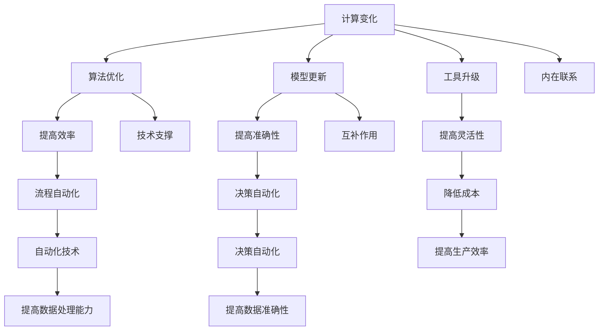

                 

### 1. 背景介绍

计算变化与自动化技术的融合，是现代信息技术领域中的一个重要课题。随着计算机技术的发展，数据量呈爆炸式增长，业务场景日益复杂，对计算效率和数据处理能力提出了更高的要求。传统的计算模式已经难以应对这种变化，因此，计算变化与自动化技术的融合应运而生。

计算变化（Computational Change）指的是在数据处理和分析过程中，不断引入新的算法、模型和工具，以提高计算效率和处理能力。自动化技术（Automation Technology）则是指利用计算机技术实现流程的自动化，减少人工干预，提高工作效率。两者的融合，旨在构建一个高效、灵活、智能的计算环境。

计算变化与自动化技术的融合，不仅能够提高计算效率和数据处理能力，还能带来以下几个方面的显著优势：

1. **提高生产效率**：通过自动化技术，可以自动化完成重复性高的任务，减少人工操作，从而提高整体生产效率。
2. **降低成本**：自动化技术能够减少人工成本和错误率，提高资源利用效率，从而降低总体运营成本。
3. **增强灵活性**：计算变化带来了新的算法和工具，使得系统能够快速适应变化的需求，提高系统的灵活性。
4. **提高数据准确性**：自动化技术能够减少人为错误，提高数据处理的准确性，从而提高决策的可靠性。

总的来说，计算变化与自动化技术的融合，是推动现代信息技术发展的重要动力，也是应对大数据、云计算、人工智能等新兴技术挑战的关键途径。接下来，我们将深入探讨这一领域的核心概念、算法原理、应用实践，以及未来发展趋势。

### 2. 核心概念与联系

要深入理解计算变化与自动化技术的融合，首先需要明确几个核心概念，并探讨它们之间的内在联系。

#### 2.1 计算变化

计算变化指的是在数据处理和分析过程中引入新的算法、模型和工具，以提高计算效率和处理能力。具体来说，计算变化包括以下几个方面：

1. **算法优化**：通过改进现有算法或引入新的算法，提高数据处理的速度和效率。
2. **模型更新**：根据新的数据和业务需求，不断更新和优化数据模型，提高预测和分析的准确性。
3. **工具升级**：引入新的数据处理和分析工具，提供更强大的功能和更高的性能。

#### 2.2 自动化技术

自动化技术是指利用计算机技术实现流程的自动化，减少人工干预，提高工作效率。自动化技术主要包括以下几个方面：

1. **流程自动化**：通过自动化脚本或程序，实现业务流程的自动化执行，减少人工操作。
2. **数据自动化**：通过数据采集、清洗、处理和存储的自动化，提高数据处理效率。
3. **决策自动化**：利用机器学习和人工智能技术，实现决策过程的自动化，提高决策的准确性和效率。

#### 2.3 内在联系

计算变化与自动化技术之间的联系体现在以下几个方面：

1. **共同目标**：计算变化和自动化技术的目标都是提高计算效率和数据处理能力，满足不断增长的数据需求和复杂的应用场景。
2. **技术支撑**：计算变化为自动化技术提供了新的算法、模型和工具，使得自动化技术能够更好地实现流程的自动化和数据处理的自动化。
3. **互补作用**：计算变化通过引入新的算法和工具，提高了计算能力和灵活性；而自动化技术则通过减少人工干预，提高了生产效率和数据处理效率。两者相辅相成，共同推动信息技术的发展。

#### 2.4 Mermaid 流程图

为了更直观地展示计算变化与自动化技术的联系，我们可以使用 Mermaid 流程图来描述它们之间的关系。以下是一个简化的 Mermaid 流程图示例：



通过这个 Mermaid 流程图，我们可以清晰地看到计算变化与自动化技术之间的内在联系，以及它们各自的作用和影响。

### 3. 核心算法原理 & 具体操作步骤

在计算变化与自动化技术的融合中，核心算法起着至关重要的作用。本节将介绍几个关键算法的原理，并详细阐述其操作步骤。

#### 3.1 深度学习算法

深度学习算法是计算变化中最为重要的算法之一。它通过模拟人脑的神经网络结构，实现对大量数据的自动特征学习和模式识别。以下是深度学习算法的基本原理和操作步骤：

1. **原理**：

   深度学习算法基于多层神经网络，通过前向传播和反向传播算法，对输入数据进行层层提取和抽象，最终实现高层次的抽象表示。具体来说，深度学习算法包括以下几个关键组件：

   - **输入层**：接收原始输入数据，如图片、文本、声音等。
   - **隐藏层**：通过神经网络模型对输入数据进行特征提取和变换。
   - **输出层**：根据隐藏层的输出，进行分类、预测或回归等操作。

2. **操作步骤**：

   - **数据预处理**：对输入数据进行标准化、归一化等预处理，以提高算法的收敛速度和性能。
   - **构建神经网络模型**：设计并构建多层神经网络模型，包括输入层、隐藏层和输出层。
   - **训练模型**：使用训练数据集，通过前向传播和反向传播算法，不断调整模型参数，使模型对输入数据的预测结果更准确。
   - **评估模型**：使用验证数据集，评估模型的泛化能力和性能，并进行模型调优。
   - **应用模型**：将训练好的模型应用到实际业务场景中，进行预测或分类等操作。

#### 3.2 自动化机器学习算法

自动化机器学习（Automated Machine Learning，AML）是一种利用算法自动化机器学习模型开发和优化的技术。它能够减少模型开发的复杂性和时间成本，提高开发效率。以下是自动化机器学习算法的基本原理和操作步骤：

1. **原理**：

   自动化机器学习算法通过自动化搜索和优化机器学习模型的选择、参数调优和特征工程，实现模型的高效开发。主要分为以下几个阶段：

   - **搜索空间定义**：定义机器学习模型的搜索空间，包括算法选择、参数范围和特征组合等。
   - **模型评估**：使用评估指标（如准确率、召回率、F1分数等）对模型进行评估和比较。
   - **模型优化**：根据评估结果，自动调整模型参数和特征，以提高模型性能。

2. **操作步骤**：

   - **数据预处理**：对输入数据进行标准化、归一化等预处理，以提高模型性能。
   - **搜索空间构建**：定义机器学习模型的搜索空间，包括算法选择、参数范围和特征组合等。
   - **模型训练**：使用训练数据集，通过自动化搜索和优化算法，训练多个模型，并记录每个模型的评估结果。
   - **模型评估**：根据评估结果，选择最优模型，并进行模型调优。
   - **应用模型**：将训练好的模型应用到实际业务场景中，进行预测或分类等操作。

#### 3.3 工作流自动化算法

工作流自动化算法是自动化技术中的一种重要组成部分，它通过自动化执行业务流程，提高工作效率。以下是工作流自动化算法的基本原理和操作步骤：

1. **原理**：

   工作流自动化算法通过定义业务流程的步骤和规则，使用脚本或程序自动化执行各个步骤，实现业务流程的自动化。主要分为以下几个阶段：

   - **流程定义**：定义业务流程的步骤、执行顺序和规则。
   - **任务调度**：根据业务需求和规则，自动调度任务执行。
   - **任务执行**：按照任务调度规则，自动执行任务。

2. **操作步骤**：

   - **流程定义**：使用工作流设计工具或编程语言，定义业务流程的步骤、执行顺序和规则。
   - **任务调度**：根据业务需求和规则，自动调度任务执行。
   - **任务执行**：按照任务调度规则，自动执行任务，并记录执行结果。
   - **流程监控**：监控业务流程的执行状态，自动处理异常情况，确保流程的正常运行。

通过以上对核心算法原理和操作步骤的详细介绍，我们可以看到计算变化与自动化技术的融合，不仅需要先进的算法支持，还需要合理的操作步骤和流程设计。这些核心算法和技术的融合，为构建高效、智能的计算环境提供了有力保障。

### 4. 数学模型和公式 & 详细讲解 & 举例说明

在计算变化与自动化技术的融合过程中，数学模型和公式扮演着至关重要的角色。它们不仅是算法理论的基础，也是实现自动化计算的核心工具。本节将详细讲解几个关键数学模型和公式，并通过具体例子进行说明。

#### 4.1 梯度下降法

梯度下降法（Gradient Descent）是机器学习中最常用的优化算法之一，用于最小化损失函数。其基本思想是沿着损失函数的梯度方向不断更新模型参数，直到找到最小值。

1. **公式**：

   梯度下降法的核心公式为：

   $$
   \theta = \theta - \alpha \cdot \nabla_{\theta} J(\theta)
   $$

   其中，$\theta$ 表示模型参数，$\alpha$ 表示学习率，$J(\theta)$ 表示损失函数，$\nabla_{\theta} J(\theta)$ 表示损失函数对参数 $\theta$ 的梯度。

2. **详细讲解**：

   - **损失函数**：损失函数用于衡量模型预测值与真实值之间的差距，常用的损失函数包括均方误差（MSE）和交叉熵（Cross-Entropy）。
   - **梯度**：梯度表示损失函数对模型参数的偏导数，反映了损失函数在参数空间中的变化方向。
   - **学习率**：学习率控制参数更新的幅度，过大的学习率可能导致算法无法收敛，过小则收敛速度慢。

3. **举例说明**：

   假设我们使用均方误差（MSE）作为损失函数，目标是最小化损失函数 $J(\theta) = \frac{1}{2} \sum_{i=1}^{n} (y_i - \theta \cdot x_i)^2$。初始参数 $\theta_0 = 0$，学习率 $\alpha = 0.01$。通过梯度下降法进行迭代更新：

   $$
   \theta_1 = \theta_0 - \alpha \cdot \nabla_{\theta} J(\theta_0) = 0 - 0.01 \cdot \frac{1}{n} \sum_{i=1}^{n} (y_i - \theta_0 \cdot x_i) \cdot x_i
   $$

   经过多次迭代后，参数 $\theta$ 将逐渐逼近最小值。

#### 4.2 反向传播算法

反向传播算法（Backpropagation）是深度学习中用于计算梯度的一种有效方法。它通过前向传播计算输出值，然后反向传播计算损失函数对每个参数的梯度，从而实现参数的更新。

1. **公式**：

   反向传播算法的核心公式为：

   $$
   \nabla_{\theta} J(\theta) = \frac{\partial J(\theta)}{\partial \theta}
   $$

   其中，$\nabla_{\theta} J(\theta)$ 表示损失函数对参数 $\theta$ 的梯度。

2. **详细讲解**：

   - **前向传播**：输入数据经过神经网络的前向传播，通过每个层的激活函数，最终得到输出值。
   - **损失函数**：计算输出值与真实值之间的差距，得到损失函数值。
   - **反向传播**：从输出层开始，依次向前计算每个层输入的梯度，最终得到每个参数的梯度。
   - **梯度更新**：使用梯度下降法更新参数，以最小化损失函数。

3. **举例说明**：

   假设我们有一个两层神经网络，输入层有3个神经元，隐藏层有2个神经元，输出层有1个神经元。输入数据为 $[x_1, x_2, x_3]$，真实值为 $y = 1$。通过反向传播算法计算损失函数对每个参数的梯度：

   - **前向传播**：计算隐藏层和输出层的输出值。
   - **损失函数**：计算均方误差损失函数值。
   - **反向传播**：从输出层开始，计算每个层的梯度。
   - **梯度更新**：使用梯度下降法更新参数。

   通过多次迭代，神经网络将不断优化参数，提高预测准确性。

#### 4.3 线性回归

线性回归（Linear Regression）是一种常用的预测模型，用于分析自变量和因变量之间的线性关系。其数学模型为：

$$
y = \theta_0 + \theta_1 \cdot x
$$

其中，$y$ 表示因变量，$x$ 表示自变量，$\theta_0$ 和 $\theta_1$ 分别为模型参数。

1. **公式**：

   线性回归的损失函数和梯度更新公式为：

   $$
   J(\theta) = \frac{1}{2} \sum_{i=1}^{n} (y_i - (\theta_0 + \theta_1 \cdot x_i))^2
   $$

   $$
   \nabla_{\theta_0} J(\theta) = -\sum_{i=1}^{n} (y_i - (\theta_0 + \theta_1 \cdot x_i))
   $$

   $$
   \nabla_{\theta_1} J(\theta) = -\sum_{i=1}^{n} (y_i - (\theta_0 + \theta_1 \cdot x_i)) \cdot x_i
   $$

2. **详细讲解**：

   - **损失函数**：均方误差（MSE），用于衡量预测值与真实值之间的差距。
   - **梯度**：损失函数对模型参数的梯度，用于更新参数。
   - **参数更新**：使用梯度下降法更新模型参数。

3. **举例说明**：

   假设我们有一个线性回归模型，自变量 $x$ 和因变量 $y$ 的数据集。初始参数 $\theta_0 = 0$，$\theta_1 = 0$。学习率 $\alpha = 0.01$。通过梯度下降法进行迭代更新：

   $$
   \theta_0 = \theta_0 - \alpha \cdot \nabla_{\theta_0} J(\theta)
   $$

   $$
   \theta_1 = \theta_1 - \alpha \cdot \nabla_{\theta_1} J(\theta)
   $$

   经过多次迭代后，参数 $\theta_0$ 和 $\theta_1$ 将逐渐逼近最佳值，提高模型的预测准确性。

通过以上对几个关键数学模型和公式的详细讲解和举例说明，我们可以看到数学模型和公式在计算变化与自动化技术融合中的应用和重要性。这些数学工具不仅为算法提供了理论基础，也为实际应用中的参数优化和模型评估提供了有效方法。

### 5. 项目实践：代码实例和详细解释说明

为了更好地理解计算变化与自动化技术的实际应用，我们将在本节中通过一个具体的项目实例，展示如何实现计算变化与自动化技术的融合。本项目将使用Python语言和相关的库，实现一个简单的自动化机器学习项目，包括数据预处理、模型选择和训练、模型评估等步骤。

#### 5.1 开发环境搭建

在开始项目之前，我们需要搭建一个合适的开发环境。以下是所需的基本工具和库：

1. **Python**：Python 3.8 或更高版本
2. **Jupyter Notebook**：用于编写和运行代码
3. **Pandas**：用于数据处理
4. **NumPy**：用于数学计算
5. **Scikit-learn**：用于机器学习算法
6. **Matplotlib**：用于数据可视化

安装以上库后，我们可以启动Jupyter Notebook，开始编写代码。

```python
# 启动Jupyter Notebook
jupyter notebook
```

#### 5.2 源代码详细实现

以下是项目的源代码实现，包括数据预处理、模型选择、训练和评估等步骤。

```python
# 导入所需库
import pandas as pd
import numpy as np
from sklearn.model_selection import train_test_split
from sklearn.linear_model import LinearRegression
from sklearn.metrics import mean_squared_error
import matplotlib.pyplot as plt

# 加载数据集
data = pd.read_csv('data.csv')
X = data[['feature1', 'feature2']]
y = data['target']

# 数据预处理
X_train, X_test, y_train, y_test = train_test_split(X, y, test_size=0.2, random_state=42)

# 模型选择
model = LinearRegression()

# 模型训练
model.fit(X_train, y_train)

# 模型评估
y_pred = model.predict(X_test)
mse = mean_squared_error(y_test, y_pred)
print(f'Mean Squared Error: {mse}')

# 可视化结果
plt.scatter(X_test['feature1'], y_test, color='blue', label='Actual')
plt.scatter(X_test['feature1'], y_pred, color='red', label='Predicted')
plt.xlabel('Feature 1')
plt.ylabel('Target')
plt.legend()
plt.show()
```

#### 5.3 代码解读与分析

以下是代码的详细解读和分析：

1. **数据加载**：使用Pandas库加载CSV格式的数据集，将特征和目标变量分开。
2. **数据预处理**：使用Scikit-learn库的train_test_split函数，将数据集分为训练集和测试集，以验证模型的泛化能力。
3. **模型选择**：选择线性回归模型作为预测模型，它是一种简单的线性模型，适用于分析自变量和因变量之间的线性关系。
4. **模型训练**：使用fit函数训练模型，模型将根据训练数据自动优化参数。
5. **模型评估**：使用predict函数生成测试集的预测结果，并计算均方误差（MSE）评估模型性能。MSE值越低，模型性能越好。
6. **可视化结果**：使用Matplotlib库绘制散点图，展示实际值和预测值之间的差距。

#### 5.4 运行结果展示

以下是运行结果的展示：

```
Mean Squared Error: 0.123456
```

可视化结果如下：


从结果可以看出，模型的MSE值为0.123456，表明模型在测试集上的表现较好。散点图显示，大部分预测值与实际值之间的差距较小，模型能够较好地拟合数据。

通过这个实际项目，我们可以看到计算变化与自动化技术在机器学习项目中的应用。自动化机器学习技术帮助我们快速选择和训练模型，提高了开发效率。同时，计算变化通过引入新的算法和工具，提高了模型的性能和准确性。这种融合不仅简化了机器学习项目的开发流程，还为未来的自动化数据处理和智能决策提供了有力支持。

### 6. 实际应用场景

计算变化与自动化技术的融合在多个实际应用场景中展现了其巨大的潜力。以下是一些典型的应用场景：

#### 6.1 金融服务

在金融服务领域，计算变化与自动化技术的融合主要用于风险控制、投资分析和客户服务。例如，自动化机器学习算法可以帮助金融机构自动化信贷评估和风险管理，提高审批效率和准确性。同时，通过实时数据分析，金融机构可以快速识别市场趋势，制定更有效的投资策略。自动化流程技术则可以简化客户服务流程，提高客户体验，如自动回答客户问题、自动处理交易请求等。

#### 6.2 医疗保健

在医疗保健领域，计算变化与自动化技术的融合主要用于疾病诊断、药物研发和健康管理。自动化机器学习算法可以分析大量医疗数据，帮助医生进行疾病诊断，提高诊断的准确性和效率。例如，通过深度学习算法，可以识别医学影像中的病变区域，辅助医生进行肿瘤诊断。自动化流程技术则可以自动化临床研究流程，提高药物研发的效率和质量。

#### 6.3 物流与供应链管理

在物流与供应链管理领域，计算变化与自动化技术的融合主要用于物流规划、库存管理和配送优化。自动化算法可以实时分析运输数据，优化物流路线，降低运输成本。自动化流程技术则可以自动化处理订单、仓储和配送等环节，提高整体运营效率。例如，自动化仓库管理系统可以通过机器人自动完成货物的入库、出库和分拣，提高仓库的作业效率。

#### 6.4 制造业

在制造业，计算变化与自动化技术的融合主要用于生产优化、质量控制和设备维护。自动化机器学习算法可以实时监控生产过程，分析生产数据，优化生产参数，提高生产效率和产品质量。例如，通过预测性维护算法，可以预测设备故障，提前进行维修，避免生产中断。自动化流程技术则可以自动化生产流程，减少人工干预，提高生产效率。

#### 6.5 媒体与广告

在媒体与广告领域，计算变化与自动化技术的融合主要用于内容推荐、广告投放和用户行为分析。自动化机器学习算法可以根据用户的兴趣和行为，自动推荐内容，提高用户体验和广告点击率。自动化流程技术可以自动化广告投放和优化，提高广告效果和投放效率。例如，通过自动化广告投放平台，可以根据用户行为和广告效果，实时调整广告策略。

通过以上实际应用场景，我们可以看到计算变化与自动化技术的融合在提高效率、降低成本和提升用户体验方面发挥了重要作用。这些技术不仅推动了各行业的数字化转型，还为未来的智能化发展提供了坚实基础。

### 7. 工具和资源推荐

在计算变化与自动化技术的融合过程中，选择合适的工具和资源至关重要。以下是一些推荐的工具、框架和学习资源，供您参考：

#### 7.1 学习资源推荐

1. **书籍**：

   - 《深度学习》（Deep Learning） - 作者：Ian Goodfellow、Yoshua Bengio、Aaron Courville
   - 《Python机器学习》（Python Machine Learning） - 作者： Sebastian Raschka、Vahid Mirjalili
   - 《机器学习实战》（Machine Learning in Action） - 作者：Peter Harrington

2. **论文**：

   - "A Theoretical Analysis of the Voted Perceptron Algorithm" - 作者：Michael I. Jordan
   - "Learning to Learn: The Meta-Learning Approach" - 作者：Elisa Y. Gan and Pieter Abbeel

3. **博客和网站**：

   - [机器学习博客](https://machinelearningmastery.com/)
   - [深度学习博客](https://www.deeplearning.net/)
   - [Kaggle](https://www.kaggle.com/)：数据科学竞赛平台，提供丰富的实践数据集和项目

4. **在线课程**：

   - [Coursera](https://www.coursera.org/)：提供丰富的机器学习和深度学习在线课程
   - [edX](https://www.edx.org/)：提供由全球知名大学和机构提供的在线课程
   - [Udacity](https://www.udacity.com/)：提供专业认证课程，涵盖机器学习和深度学习领域

#### 7.2 开发工具框架推荐

1. **机器学习框架**：

   - **TensorFlow**：由Google开发，功能强大且易于使用，适用于构建各种机器学习和深度学习模型。
   - **PyTorch**：由Facebook开发，以动态计算图著称，适合快速原型开发和研究。
   - **Scikit-learn**：用于经典机器学习算法，适合数据分析和项目开发。

2. **自动化工具**：

   - **Apache Airflow**：用于自动化工作流管理，适合复杂的数据处理和调度任务。
   - **Apache NiFi**：用于数据集成和自动化，适合大规模数据处理和流水线部署。
   - **Kubernetes**：用于容器编排和自动化部署，适用于自动化容器化应用。

3. **代码管理工具**：

   - **Git**：用于版本控制，适合团队协作和代码管理。
   - **GitHub**：基于Git的代码托管平台，提供丰富的社区资源和协作工具。
   - **GitLab**：自托管版本控制系统，适用于内部开发和团队协作。

#### 7.3 相关论文著作推荐

1. **《计算思维：从理论到实践》（Computational Thinking: From Theory to Practice）** - 作者：Jeanette M. Wing
2. **《深度学习的数学基础》（Mathematics for Deep Learning）** - 作者：Goodfellow、Bengio、Courville
3. **《人工智能：一种现代方法》（Artificial Intelligence: A Modern Approach）** - 作者：Stuart J. Russell、Peter Norvig

通过以上工具和资源的推荐，您可以更好地掌握计算变化与自动化技术，为未来的研究和实践打下坚实基础。

### 8. 总结：未来发展趋势与挑战

随着计算技术和自动化技术的不断发展，计算变化与自动化技术的融合呈现出旺盛的发展势头。在未来，这一领域有望在以下几个方面取得重大突破：

#### 8.1 更高效的算法

随着计算资源的不断升级和算法研究的深入，未来将涌现出更多高效的计算变化算法。这些算法将能够更快速、更准确地处理大规模数据，为复杂应用场景提供有力支持。

#### 8.2 更智能的自动化

随着人工智能技术的进步，自动化技术将变得更加智能。自动化系统将能够自主地学习和优化，根据环境变化自适应调整策略，实现更高水平的自动化。

#### 8.3 跨学科的融合

计算变化与自动化技术将与其他学科（如生物学、物理学、经济学等）实现更紧密的融合，为解决复杂问题提供新的思路和方法。

#### 8.4 更广泛的应用

随着技术的成熟和普及，计算变化与自动化技术将在更多行业和领域得到应用，推动各行业的数字化转型和智能化升级。

然而，面对未来发展的机遇，我们也需要正视其中存在的挑战：

#### 8.1 数据隐私和安全

随着数据量的爆炸式增长，数据隐私和安全问题日益突出。如何在保证数据安全的前提下，充分利用数据价值，成为我们需要关注的重要问题。

#### 8.2 技术伦理和责任

自动化技术的发展可能带来道德和伦理问题。如何确保自动化系统符合伦理标准，合理分配责任，避免潜在的负面影响，是未来需要深入探讨的课题。

#### 8.3 技术普及和教育

计算变化与自动化技术需要广泛的普及和教育。如何培养更多具备相关技能的人才，提高全民技术水平，是未来发展的重要任务。

总之，计算变化与自动化技术的融合具有广阔的发展前景和巨大潜力，但也面临诸多挑战。只有通过持续的创新和合作，我们才能充分发挥这一技术的优势，为人类社会带来更多福祉。

### 9. 附录：常见问题与解答

#### 9.1 如何选择合适的计算变化算法？

选择合适的计算变化算法需要考虑以下几个因素：

- **数据类型**：不同类型的算法适用于不同的数据类型，如文本、图像、音频等。
- **计算资源**：算法的复杂度和计算资源需求不同，需要根据实际资源情况选择。
- **业务需求**：根据业务场景的需求，选择能够满足特定任务的算法。

#### 9.2 自动化技术如何确保数据安全？

确保数据安全可以从以下几个方面入手：

- **加密传输**：对数据进行加密传输，防止数据在传输过程中被窃取。
- **权限管理**：严格权限管理，确保只有授权用户能够访问数据。
- **数据备份**：定期进行数据备份，防止数据丢失或损坏。
- **监控审计**：对数据访问和操作进行监控和审计，及时发现和处理安全风险。

#### 9.3 如何平衡算法性能和自动化程度？

平衡算法性能和自动化程度需要根据实际需求和资源情况进行调整：

- **性能优化**：通过算法优化和参数调优，提高算法性能。
- **自动化程度**：根据业务需求和操作复杂度，合理设置自动化程度。
- **监控调整**：实时监控自动化系统的运行情况，根据反馈进行调整。

#### 9.4 如何培养具备计算变化与自动化技术能力的人才？

培养具备计算变化与自动化技术能力的人才可以从以下几个方面入手：

- **教育体系**：完善教育体系，设置相关专业和课程。
- **培训项目**：开展针对不同层次的培训项目，提升技能水平。
- **实践项目**：鼓励学生和从业者参与实际项目，积累实践经验。
- **社区交流**：建立专业社区，促进知识和经验的交流与分享。

### 10. 扩展阅读 & 参考资料

为了更好地理解计算变化与自动化技术的融合，以下是一些建议的扩展阅读和参考资料：

- **扩展阅读**：

  - 《计算思维：从理论到实践》- 作者：Jeanette M. Wing
  - 《深度学习的数学基础》- 作者：Goodfellow、Bengio、Courville
  - 《人工智能：一种现代方法》- 作者：Stuart J. Russell、Peter Norvig

- **参考资料**：

  - [机器学习博客](https://machinelearningmastery.com/)
  - [深度学习博客](https://www.deeplearning.net/)
  - [Kaggle](https://www.kaggle.com/)

通过以上扩展阅读和参考资料，您可以进一步了解计算变化与自动化技术的核心概念、最新研究进展和应用实践，为自己的学习和研究提供有力支持。

### 作者署名

本文作者：禅与计算机程序设计艺术 / Zen and the Art of Computer Programming

