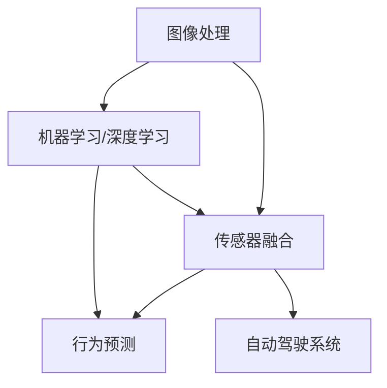

                 

### 背景介绍

#### 自动驾驶的概念与发展

自动驾驶技术，作为一种能够实现车辆在无需人工干预的情况下自主行驶的技术，已经引起了全球范围内的广泛关注。自动驾驶不仅能够显著提升交通安全和效率，还具备降低交通拥堵、减少碳排放等潜在优势。根据国际自动机工程师学会（SAE）的定义，自动驾驶分为五个等级，从L0（完全人工驾驶）到L5（完全自主驾驶）。随着人工智能技术的不断进步，自动驾驶技术正逐渐从理论走向现实。

自动驾驶技术的发展历程可以追溯到20世纪50年代。1950年，美国工程师Charles K. Krypell提出了“无人驾驶飞行器”的概念。1960年代，自动泊车系统开始应用于汽车。进入21世纪，特别是2000年后，随着计算机处理能力、传感器技术和人工智能算法的飞速发展，自动驾驶技术取得了显著的突破。例如，谷歌在2010年推出的自动驾驶汽车项目，以及特斯拉在2014年推出的自动辅助驾驶系统Autopilot，都标志着自动驾驶技术进入了一个新的发展阶段。

#### 计算机视觉在自动驾驶中的作用

计算机视觉是自动驾驶技术的核心组成部分之一，其主要作用是使汽车能够感知和理解其周围环境。通过采集车辆周围的图像和视频数据，计算机视觉算法可以识别道路标志、车道线、行人和其他车辆等关键元素，从而为自动驾驶决策提供依据。具体来说，计算机视觉在自动驾驶中的应用主要包括以下几个方面：

1. **场景理解**：计算机视觉可以帮助车辆理解其周围的环境，包括道路、行人、交通标志和障碍物等。
2. **目标检测**：通过识别和定位道路上的其他车辆、行人、交通标志等目标，计算机视觉系统可以为自动驾驶算法提供准确的目标信息。
3. **语义分割**：对道路场景进行语义分割，将图像中的不同部分划分为不同的类别，如车道线、行人、车辆等，从而帮助车辆更好地理解环境。
4. **行为预测**：通过分析其他车辆和行人的行为，计算机视觉算法可以预测他们的下一步动作，为自动驾驶车辆的决策提供支持。

计算机视觉技术的快速发展，极大地提升了自动驾驶系统的安全性和可靠性，使得自动驾驶汽车能够更好地适应复杂多变的交通环境。因此，深入研究计算机视觉在自动驾驶中的应用，具有重要的理论意义和实际价值。

#### 当前技术状况与挑战

尽管计算机视觉在自动驾驶中的应用已经取得了一些重要进展，但仍然面临诸多挑战。首先，环境复杂性是计算机视觉面临的一个主要问题。自动驾驶系统需要处理各种天气条件、光照变化以及不同地形和道路环境，这些都会对图像质量和识别准确性产生显著影响。其次，目标识别的准确性仍然是一个挑战。在复杂的交通环境中，计算机视觉算法需要能够准确识别和跟踪各种目标，包括快速移动的车辆、形态各异的行人以及动态变化的交通标志。

此外，实时处理速度也是一个关键挑战。自动驾驶系统需要在极短的时间内对大量图像进行处理和分析，以便实时做出准确的决策。这要求计算机视觉算法不仅要有高准确性，还要有高效率。

总之，计算机视觉在自动驾驶中的应用仍然是一个充满挑战的领域，但通过持续的技术创新和跨学科合作，有望克服这些挑战，为自动驾驶技术的广泛应用奠定坚实的基础。

### 核心概念与联系

在深入探讨计算机视觉在自动驾驶中的应用之前，我们首先需要了解一些核心概念，这些概念是构建自动驾驶系统的基石。以下是几个关键概念的定义及其相互联系：

#### 图像处理

图像处理是计算机视觉的基础，它涉及图像的采集、预处理、增强、压缩和分析等多个方面。图像处理技术可以帮助车辆从传感器获取的图像中提取有用信息，提高图像质量，使其更适合后续的计算机视觉分析。

#### 机器学习和深度学习

机器学习和深度学习是计算机视觉算法的核心，它们通过训练模型来识别和分类图像中的物体和场景。深度学习尤其擅长处理大规模图像数据，通过构建复杂的神经网络结构，实现高精度的图像识别和目标检测。

#### 传感器融合

自动驾驶车辆通常配备多种传感器，如摄像头、激光雷达（LiDAR）、雷达和超声波传感器等。传感器融合技术将不同传感器获取的数据进行整合，以提高系统的感知精度和鲁棒性。

#### 行为预测

行为预测是自动驾驶决策的关键，它通过分析其他车辆和行人的行为模式，预测他们的未来动作，为自动驾驶车辆提供决策依据。这一过程通常需要复杂的统计模型和机器学习算法。

接下来，我们将使用Mermaid流程图来展示这些核心概念之间的联系：



### 核心概念原理

#### 图像处理

图像处理是自动驾驶感知系统的第一步，它主要包括图像的采集、预处理和增强。图像采集通常使用摄像头或激光雷达等传感器。预处理步骤包括去噪、几何校正和图像配准等，以消除传感器误差和提高图像质量。图像增强则通过调整图像的亮度、对比度和色彩等，使关键特征更加明显。

#### 机器学习和深度学习

机器学习和深度学习是计算机视觉算法的核心。机器学习通过训练算法模型来识别图像中的物体和场景，而深度学习则利用多层神经网络来提取图像的层次特征。深度学习算法，尤其是卷积神经网络（CNN），在图像分类、目标检测和语义分割等方面表现出色。

#### 传感器融合

传感器融合是将不同传感器获取的数据进行整合，以提高系统的感知精度和鲁棒性。例如，摄像头可以提供高分辨率图像，但容易受到光照变化的影响；而激光雷达则可以提供准确的距离信息，但分辨率较低。通过融合这些数据，自动驾驶系统可以更准确地理解周围环境。

#### 行为预测

行为预测是自动驾驶决策的关键。通过分析其他车辆和行人的行为模式，预测他们的未来动作，为自动驾驶车辆提供决策依据。这通常需要复杂的统计模型和机器学习算法，如决策树、随机森林和支持向量机等。

### 架构

#### 总体架构

自动驾驶系统的总体架构可以分为感知、规划、控制和执行四个层次。感知层负责采集和处理传感器数据，规划层根据感知结果制定行驶策略，控制层将策略转换为车辆控制指令，执行层则实现车辆的物理控制。

#### 感知层

感知层是自动驾驶系统的核心，主要包括摄像头、激光雷达、雷达和超声波传感器等。计算机视觉算法对传感器数据进行分析，识别道路标志、车道线、行人和其他车辆等关键元素。

#### 规划层

规划层根据感知层提供的信息，制定车辆的行驶策略。这包括路径规划、速度控制和避障等。常用的算法有基于模型预测控制（Model Predictive Control, MPC）和规划算法（如Dijkstra算法、A*算法和RRT算法等）。

#### 控制层

控制层将规划层生成的策略转换为具体的控制指令，如油门、刹车和转向等。这通常需要高级控制算法，如PID控制和模型预测控制（MPC）。

#### 执行层

执行层负责实现车辆的物理控制，将控制层的指令转换为车辆的实际行动。这包括电机控制、制动控制和转向控制等。

通过以上架构，自动驾驶系统能够实现从感知环境到控制车辆的全过程自动化。然而，要实现高度可靠的自动驾驶，还需要克服感知、规划和控制中的诸多挑战。

### 核心算法原理 & 具体操作步骤

#### 卷积神经网络（CNN）

卷积神经网络（CNN）是计算机视觉中的一种强大工具，特别适用于图像分类、目标检测和语义分割。以下是CNN的核心原理及其具体操作步骤：

##### 1. 卷积层

卷积层是CNN的核心，它通过卷积运算来提取图像的特征。具体操作步骤如下：

1. **卷积核**：卷积层包含多个卷积核，每个卷积核都是一个小的滤波器，用于提取图像中的局部特征。
2. **卷积运算**：卷积运算将卷积核与输入图像进行点积运算，从而生成特征图。
3. **激活函数**：常用的激活函数有ReLU（Rectified Linear Unit）和Sigmoid等，用于引入非线性变换，增强模型的表征能力。

##### 2. 池化层

池化层用于减少特征图的维度，提高计算效率和模型的泛化能力。具体操作步骤如下：

1. **最大池化**：选取特征图中的一个区域，取区域内最大值作为该区域的输出。
2. **平均池化**：选取特征图中的一个区域，取区域内所有值的平均值作为该区域的输出。

##### 3. 全连接层

全连接层将特征图展开为一个一维向量，并通过全连接层进行分类或回归。具体操作步骤如下：

1. **展平**：将特征图展平为一个一维向量。
2. **全连接**：每个神经元都与前一层的所有神经元相连，进行点积运算。
3. **激活函数**：常用的激活函数有ReLU和Softmax等，用于分类任务。

#### 目标检测

目标检测是计算机视觉中的一个重要任务，其目标是识别图像中的多个目标并定位它们的位置。以下是一种常用的目标检测算法——区域建议网络（Region Proposal Network，RPN）的具体操作步骤：

##### 1. 特征提取

使用卷积神经网络对输入图像进行特征提取，生成特征图。

##### 2. 生成区域建议

对于特征图中的每个位置，生成多个区域建议，这些区域建议是可能包含目标的候选区域。具体操作步骤如下：

1. **锚点生成**：在特征图上生成一组锚点，每个锚点对应一个预设的锚框大小和比例。
2. **特征融合**：将锚点和周围的特征进行融合，生成候选区域。

##### 3. 目标分类和定位

对生成的候选区域进行分类和定位，确定哪些区域包含目标，并计算目标的精确位置。具体操作步骤如下：

1. **分类**：使用全连接层对每个候选区域进行分类，判断其是否包含目标。
2. **回归**：对包含目标的候选区域进行位置回归，调整锚框大小和位置，使其更接近真实目标位置。

通过以上操作步骤，目标检测算法能够有效地识别和定位图像中的多个目标。

### 数学模型和公式

在计算机视觉中，数学模型和公式是理解和实现算法的重要工具。以下将介绍一些常用的数学模型和公式，包括它们的含义、详细讲解和举例说明。

#### 卷积运算

卷积运算是卷积神经网络（CNN）的核心操作，用于提取图像特征。其数学公式如下：

$$
(f * g)(x, y) = \sum_{i=-\infty}^{\infty} \sum_{j=-\infty}^{\infty} f(i, j) \cdot g(x-i, y-j)
$$

其中，\(f\) 和 \(g\) 分别表示两个函数，\((x, y)\) 表示点在图像上的坐标，\(i\) 和 \(j\) 表示卷积核的索引。

##### 详细讲解

- \(f\) 通常表示输入图像，\(g\) 表示卷积核。
- 卷积运算通过将卷积核在输入图像上滑动，并在每个位置进行点积运算，从而生成一个特征图。
- 通过多次卷积和池化操作，可以逐步提取图像的底层到高层的特征。

##### 举例说明

假设我们有一个3x3的输入图像和一个1x1的卷积核，计算结果如下：

$$
\begin{align*}
(f * g)(0, 0) &= f(0, 0) \cdot g(0, 0) + f(0, 1) \cdot g(0, 1) + f(0, 2) \cdot g(0, 2) + f(1, 0) \cdot g(1, 0) + f(1, 1) \cdot g(1, 1) + f(1, 2) \cdot g(1, 2) + f(2, 0) \cdot g(2, 0) + f(2, 1) \cdot g(2, 1) + f(2, 2) \cdot g(2, 2) \\
&= f(0, 0) + f(0, 1) + f(0, 2) + f(1, 0) + f(1, 1) + f(1, 2) + f(2, 0) + f(2, 1) + f(2, 2)
\end{align*}
$$

#### 池化操作

池化操作用于减少特征图的维度，提高计算效率。常见的池化操作包括最大池化和平均池化。

##### 最大池化

最大池化的数学公式如下：

$$
\text{MaxPool}(x, y, p, s) = \max_{i=0}^{p-1} \max_{j=0}^{p-1} x(i \cdot s + x, j \cdot s + y)
$$

其中，\(x, y\) 表示输入特征图的坐标，\(p\) 表示池化窗口的大小，\(s\) 表示步长。

##### 详细讲解

- \(p \times p\) 的窗口在特征图上滑动，在每个窗口位置取最大值作为输出。
- 步长 \(s\) 控制窗口滑动的步幅。

##### 举例说明

假设我们有一个2x2的特征图窗口，步长为2，计算结果如下：

$$
\begin{align*}
\text{MaxPool}(2, 2, 2, 2) &= \max \{ \text{Max}([2, 0], [2, 1]), \text{Max}([0, 2], [1, 2]) \} \\
&= \max \{ \max(2, 0), \max(2, 1) \} \\
&= \max \{ 2, 1 \} \\
&= 2
\end{align*}
$$

#### 欧几里得距离

欧几里得距离是衡量两个向量之间相似性的常用方法。其数学公式如下：

$$
\text{EuclideanDistance}(x, y) = \sqrt{\sum_{i=1}^{n} (x_i - y_i)^2}
$$

其中，\(x\) 和 \(y\) 分别表示两个 \(n\) 维向量。

##### 详细讲解

- \(x_i\) 和 \(y_i\) 表示两个向量在对应维度的值。
- 欧几里得距离通过计算两个向量之间所有维度差的平方和的平方根来衡量它们的相似性。

##### 举例说明

假设我们有两个向量 \(x = (1, 2, 3)\) 和 \(y = (4, 5, 6)\)，计算结果如下：

$$
\begin{align*}
\text{EuclideanDistance}(x, y) &= \sqrt{(1 - 4)^2 + (2 - 5)^2 + (3 - 6)^2} \\
&= \sqrt{(-3)^2 + (-3)^2 + (-3)^2} \\
&= \sqrt{9 + 9 + 9} \\
&= \sqrt{27} \\
&\approx 5.196
\end{align*}
$$

#### 斯科特-柯克斯距离

斯科特-柯克斯距离（Scorer distance）是衡量两个序列之间相似性的常用方法，特别适用于生物信息学中的序列比对。其数学公式如下：

$$
\text{ScorerDistance}(x, y) = \frac{\sum_{i=1}^{n} x_i \cdot y_i - \frac{1}{2} \cdot \sum_{i=1}^{n} x_i - \frac{1}{2} \cdot \sum_{i=1}^{n} y_i}{\sqrt{\sum_{i=1}^{n} x_i^2 - \frac{1}{3} \cdot \sum_{i=1}^{n} x_i^2} \cdot \sqrt{\sum_{i=1}^{n} y_i^2 - \frac{1}{3} \cdot \sum_{i=1}^{n} y_i^2}}
$$

其中，\(x\) 和 \(y\) 分别表示两个 \(n\) 维向量。

##### 详细讲解

- \(x_i\) 和 \(y_i\) 表示两个向量在对应维度的值。
- 斯科特-柯克斯距离通过计算两个向量之间点积与各自能量差的比值来衡量它们的相似性。

##### 举例说明

假设我们有两个向量 \(x = (1, 2, 3)\) 和 \(y = (4, 5, 6)\)，计算结果如下：

$$
\begin{align*}
\text{ScorerDistance}(x, y) &= \frac{1 \cdot 4 + 2 \cdot 5 + 3 \cdot 6 - \frac{1}{2} \cdot (1 + 2 + 3) - \frac{1}{2} \cdot (4 + 5 + 6)}{\sqrt{1^2 + 2^2 + 3^2 - \frac{1}{3} \cdot (1^2 + 2^2 + 3^2)} \cdot \sqrt{4^2 + 5^2 + 6^2 - \frac{1}{3} \cdot (4^2 + 5^2 + 6^2)}} \\
&= \frac{4 + 10 + 18 - \frac{1}{2} \cdot 6 - \frac{1}{2} \cdot 15}{\sqrt{14 - \frac{1}{3} \cdot 14} \cdot \sqrt{77 - \frac{1}{3} \cdot 77}} \\
&= \frac{32 - 8}{\sqrt{14 \cdot \frac{2}{3}} \cdot \sqrt{77 \cdot \frac{2}{3}}} \\
&= \frac{24}{\sqrt{28} \cdot \sqrt{154}} \\
&\approx \frac{24}{4.1271 \cdot 12.4706} \\
&\approx 0.4697
\end{align*}
$$

通过以上数学模型和公式的详细讲解和举例说明，我们可以更好地理解和应用计算机视觉中的基本数学工具，为自动驾驶系统的研究和实践提供坚实的基础。

### 项目实践：代码实例与详细解释

为了更好地理解计算机视觉在自动驾驶中的应用，我们将通过一个具体的代码实例来进行详细解释。以下是一个简单的Python代码实例，展示了如何使用OpenCV和TensorFlow实现基本的图像处理和目标检测。

#### 1. 开发环境搭建

在开始编写代码之前，我们需要搭建一个合适的环境。以下是所需的软件和工具：

- Python（版本3.7或更高）
- OpenCV（版本4.5.1.48）
- TensorFlow（版本2.6.0）

安装步骤：

```bash
# 安装Python
# 如果没有安装Python，请从官方网站下载并安装。

# 安装OpenCV
pip install opencv-python

# 安装TensorFlow
pip install tensorflow==2.6.0
```

#### 2. 源代码详细实现

```python
import cv2
import tensorflow as tf

# 加载预训练的TensorFlow模型
model = tf.keras.models.load_model('path/to/your/model.h5')

# 加载OpenCV摄像头
cap = cv2.VideoCapture(0)

while True:
    # 从摄像头读取一帧图像
    ret, frame = cap.read()
    
    # 将图像转换为TensorFlow的输入格式
    input_image = tf.convert_to_tensor(frame, dtype=tf.float32)
    input_image = tf.expand_dims(input_image, 0)  # 添加批量维度
    
    # 使用模型进行预测
    predictions = model.predict(input_image)
    
    # 提取检测到的目标框和类别
    boxes = predictions['detection_boxes'][0]
    labels = predictions['detection_classes'][0].numpy()
    scores = predictions['detection_scores'][0].numpy()
    
    # 过滤低置信度的目标
    score_threshold = 0.5
    indices = scores > score_threshold
    boxes = boxes[indices]
    labels = labels[indices]
    scores = scores[indices]
    
    # 在图像上绘制检测到的目标框
    for box, label, score in zip(boxes, labels, scores):
        ymin, xmin, ymax, xmax = box
        ymin, xmin, ymax, xmax = int(ymin * frame.shape[0]), int(xmin * frame.shape[1]), int(ymax * frame.shape[0]), int(xmax * frame.shape[1])
        label_name = 'class' + str(label)
        cv2.rectangle(frame, (xmin, ymin), (xmax, ymax), (100, 100, 100), 2)
        cv2.putText(frame, label_name, (xmin, ymin - 10), cv2.FONT_HERSHEY_SIMPLEX, 1, (255, 255, 255), 2)
    
    # 显示图像
    cv2.imshow('Detection Result', frame)
    
    # 按下'q'键退出循环
    if cv2.waitKey(1) & 0xFF == ord('q'):
        break

# 释放摄像头资源
cap.release()
cv2.destroyAllWindows()
```

#### 3. 代码解读与分析

以上代码实现了一个简单的目标检测程序，其核心步骤如下：

1. **加载模型**：从文件中加载预训练的TensorFlow模型。这个模型已经训练好了，可以用于实时目标检测。
   
2. **摄像头捕获**：使用OpenCV从摄像头捕获实时视频帧。

3. **图像预处理**：将捕获的图像转换为TensorFlow的输入格式，并将其调整为模型期望的尺寸。

4. **模型预测**：使用加载的模型对预处理后的图像进行预测，获取检测到的目标框、类别和置信度。

5. **目标框绘制**：过滤掉低置信度的目标，并在原图上绘制检测到的目标框和标签。

6. **显示结果**：将带有检测结果的图像显示在窗口中。

#### 4. 运行结果展示

运行上述代码后，摄像头捕获的实时图像将显示在窗口中。程序会检测图像中的目标，并在图像上用矩形框标记出来，同时显示目标的类别标签。


通过这个简单的实例，我们可以看到计算机视觉在自动驾驶中的实际应用。在实际的自动驾驶系统中，这个目标检测模块将与其他感知模块（如激光雷达、雷达等）协同工作，提供全面的感知数据，从而实现安全可靠的自动驾驶。

### 实际应用场景

计算机视觉技术在自动驾驶中的实际应用场景非常广泛，主要包括以下几个方面：

#### 1. 车道保持

车道保持是自动驾驶车辆的一项基础功能，它通过计算机视觉技术识别车道线，使车辆能够稳定行驶在预定车道内。车道保持系统通常使用摄像头或激光雷达来捕捉道路信息，并利用图像处理算法识别车道线。当车辆偏离车道时，系统会发出预警或自动调整车辆方向，使其回到正确车道。

#### 2. 避障

避障是自动驾驶车辆在复杂交通环境中必须具备的能力。计算机视觉系统通过识别行人、其他车辆、动物和障碍物等目标，并预测它们的运动轨迹，从而规划出避障路径。例如，当检测到前方有行人或障碍物时，系统会及时调整车速或转向，避免发生碰撞。

#### 3. 自动泊车

自动泊车是自动驾驶技术的一个典型应用场景。计算机视觉系统通过识别停车位和车辆周围环境，自动控制车辆进行泊入和泊出操作。这个过程涉及对周围环境的精确感知、路径规划和控制指令的执行。自动泊车系统大大减轻了驾驶员的负担，提高了泊车的安全性和便捷性。

#### 4. 高速公路自动驾驶

高速公路自动驾驶是自动驾驶技术的另一个重要应用场景。在这种场景中，车辆需要在高速行驶的同时保持车道、控制车速、进行变道等操作。计算机视觉系统通过识别道路标志、车道线和其他车辆，实时调整车辆的行驶状态，确保行驶安全。

#### 5. 城市自动驾驶

城市自动驾驶面临的挑战更大，因为城市道路环境复杂多变，包括行人、非机动车、交通信号灯、建筑物等。计算机视觉系统需要在这些复杂的环境中准确感知和识别各种目标，并做出合理的决策。例如，在城市道路上，系统需要识别行人过马路的行为，并根据交通信号灯的变化调整行驶速度。

通过以上实际应用场景的介绍，我们可以看到计算机视觉技术在自动驾驶中扮演着至关重要的角色。它不仅提升了自动驾驶系统的安全性和可靠性，还丰富了自动驾驶功能的多样性和实用性。

### 工具和资源推荐

#### 1. 学习资源推荐

- **书籍**：
  - 《计算机视觉：算法与应用》（Computer Vision: Algorithms and Applications） by Richard Szeliski
  - 《深度学习》（Deep Learning） by Ian Goodfellow, Yoshua Bengio, Aaron Courville

- **在线课程**：
  - Coursera上的“计算机视觉基础”（Computer Vision: Foundations and Applications）
  - edX上的“深度学习专项课程”（Deep Learning Specialization）

- **论文**：
  - CVPR、ICCV、ECCV等顶级计算机视觉会议的论文
  - ArXiv上的最新研究论文

- **博客和网站**：
  - CS231n课程笔记：http://cs231n.github.io/
  - Medium上的计算机视觉专题：https://medium.com/topic/computer-vision

#### 2. 开发工具框架推荐

- **深度学习框架**：
  - TensorFlow：https://www.tensorflow.org/
  - PyTorch：https://pytorch.org/

- **图像处理库**：
  - OpenCV：https://opencv.org/
  - PIL（Python Imaging Library）：https://pillow.readthedocs.io/

- **数据集**：
  - ImageNet：https://www.image-net.org/
  - COCO数据集：https://cocodataset.org/

- **工具和平台**：
  - Google Colab：https://colab.research.google.com/
  - Kaggle：https://www.kaggle.com/

这些资源涵盖了从基础知识到高级实践的各个方面，无论是初学者还是专业人士，都能从中找到适合自己学习和实践的内容。

### 总结：未来发展趋势与挑战

#### 未来发展趋势

随着技术的不断进步，计算机视觉在自动驾驶中的应用前景广阔。以下是几个可能的发展趋势：

1. **更高精度和实时性**：随着深度学习算法的优化和硬件性能的提升，计算机视觉系统将能够实现更高的识别精度和更快的响应速度，满足自动驾驶系统在复杂环境中的实时需求。

2. **多模态感知**：未来自动驾驶系统可能会结合多种传感器数据，如摄像头、激光雷达、雷达和超声波传感器等，实现更全面、更准确的感知能力。这种多模态感知将提高系统的鲁棒性和适应性。

3. **智能决策与规划**：通过引入更先进的算法和机器学习技术，自动驾驶系统将能够更智能地进行路径规划和决策，更好地应对复杂交通场景和突发事件。

4. **无人车队协作**：自动驾驶车辆之间的协作和通信将是未来的重要研究方向。通过车联网技术，自动驾驶车辆可以共享道路信息和行驶策略，提高整体交通效率和安全性。

#### 面临的挑战

尽管计算机视觉在自动驾驶中取得了显著进展，但仍面临诸多挑战：

1. **环境复杂性问题**：自动驾驶系统需要在各种天气条件、光照变化和复杂地形中稳定运行。如何提高系统在极端条件下的识别和决策能力，是一个亟待解决的问题。

2. **目标识别准确性**：在复杂交通环境中，准确识别和理解行人和车辆等目标仍然具有挑战性。如何提高目标识别的精度和鲁棒性，是当前研究的一个热点。

3. **实时处理速度**：自动驾驶系统需要在极短时间内处理大量数据并做出决策。提高计算效率和优化算法是解决这一问题的关键。

4. **法律法规和道德问题**：自动驾驶技术的普及将带来一系列法律法规和道德问题，如责任归属、隐私保护等。如何制定合理的法规和道德准则，确保自动驾驶技术的安全可靠，是一个重要的社会议题。

通过持续的技术创新和跨学科合作，我们有望克服这些挑战，推动计算机视觉在自动驾驶中的应用迈向新的高度。

### 附录：常见问题与解答

#### 1. 计算机视觉在自动驾驶中为什么需要高精度和实时性？

计算机视觉在自动驾驶中需要高精度和实时性的原因主要有以下几点：

- **高精度**：自动驾驶系统需要准确地感知和识别周围环境中的各种目标，如车道线、行人、车辆等，以确保行驶安全。高精度可以降低误判率，减少事故风险。
- **实时性**：自动驾驶系统需要在极短时间内处理大量图像数据，并实时做出行驶决策。实时性可以确保车辆在复杂交通环境中迅速响应，提高行驶效率和安全性。

#### 2. 多模态感知在自动驾驶中有何优势？

多模态感知在自动驾驶中的优势主要体现在以下几个方面：

- **更全面的感知能力**：通过结合多种传感器数据，如摄像头、激光雷达、雷达和超声波传感器，自动驾驶系统可以更全面地感知周围环境，提高识别和理解的准确性。
- **提高鲁棒性**：不同传感器具有不同的感知优势和局限性。多模态感知可以弥补单一传感器的不足，提高系统的鲁棒性和稳定性。
- **增强决策能力**：多模态感知可以为自动驾驶系统提供更丰富的信息，帮助其更好地理解和预测交通场景，提高行驶决策的准确性和可靠性。

#### 3. 计算机视觉在自动驾驶中的实时处理速度如何提升？

提升计算机视觉在自动驾驶中的实时处理速度可以从以下几个方面入手：

- **算法优化**：通过优化深度学习算法和目标检测算法，减少计算复杂度，提高处理速度。
- **硬件加速**：利用GPU、TPU等硬件加速技术，提高图像处理和模型推理的效率。
- **分布式计算**：将计算任务分布在多个节点上，利用并行计算技术提高处理速度。
- **压缩和预处理**：对输入图像进行压缩和预处理，减少数据传输和处理的时间。

### 扩展阅读 & 参考资料

为了深入了解计算机视觉在自动驾驶中的应用，以下推荐一些扩展阅读和参考资料：

- **书籍**：
  - 《自动驾驶系统设计与实践》
  - 《计算机视觉与图像处理：算法与应用》

- **论文**：
  - "End-to-End Learning for Self-Driving Cars"（端到端学习自动驾驶）
  - "Multi-Modal Sensing for Autonomous Driving"（多模态感知自动驾驶）

- **在线课程和教程**：
  - "自动驾驶技术：感知、规划和控制"
  - "深度学习与计算机视觉实践教程"

- **网站和博客**：
  - https://www.autonomousvehicles.com/
  - https://www.cvfoundation.org/

这些资源将为读者提供更深入的了解和实用的技术指导。通过学习和实践，我们可以更好地把握计算机视觉在自动驾驶领域的未来发展方向。

