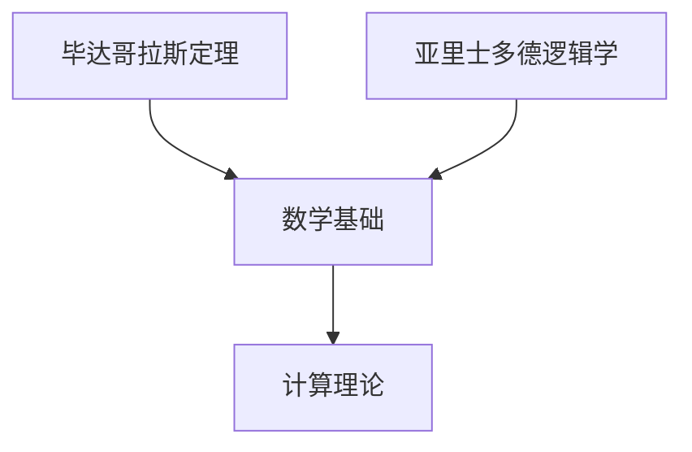

                 

### 文章标题

《计算：第一部分 计算的诞生 第1章 毕达哥拉斯的困惑 亚里士多德的逻辑学》

> 关键词：毕达哥拉斯、亚里士多德、计算历史、逻辑学、数学基础

> 摘要：本文旨在探讨计算的历史起源，从古希腊哲学家毕达哥拉斯对数的神秘热爱，到亚里士多德对逻辑学的奠基性贡献，揭示计算概念的逐步演变，以及其对现代计算机科学的影响。

### 1. 背景介绍

#### 毕达哥拉斯的困惑

在古希腊，数学是一门深奥且神圣的学科，而毕达哥拉斯（Pythagoras）则是这一领域的先驱者之一。他不仅是一位数学家，还是一位哲学家和神秘主义者。毕达哥拉斯学派对数学的研究有着深刻的兴趣，特别是对数的本质和性质。他们相信数是构成宇宙的基本元素。

然而，毕达哥拉斯最著名的发现是关于直角三角形的边长关系，即著名的毕达哥拉斯定理。这个定理揭示了整数之间的关系，但这引发了毕达哥拉斯的一个深刻困惑：是否存在不能表示为整数比的实数？特别是，是否存在一个边长为整数的直角三角形，其斜边的长度是一个无理数？

这个问题的提出，不仅挑战了当时对数的理解，也成为了数学史上一个重要的转折点。

#### 亚里士多德的逻辑学

在古希腊哲学的另一个角落，亚里士多德（Aristotle）正在研究逻辑和科学的方法。他被认为是逻辑学的奠基人，他的著作《工具论》（Organon）对后世影响深远。

亚里士多德提出了逻辑学的基本原则，包括推理和证明的方法。他认为，知识的获取是通过感知、经验和理性思考相结合的。亚里士多德的逻辑学为后来的科学研究提供了坚实的理论基础，也对数学的发展产生了深远的影响。

#### 计算的初步概念

在毕达哥拉斯和亚里士多德的思想中，我们可以看到计算的初步概念。毕达哥拉斯对数的研究揭示了数学的基本性质，而亚里士多德的逻辑学则为数学推理提供了方法。

尽管他们没有直接提出“计算”这个概念，但他们的工作为后来的计算理论奠定了基础。他们的思想和发现，激发了人们对数学和逻辑的探索，为计算的发展铺平了道路。

### 2. 核心概念与联系

#### 毕达哥拉斯定理

毕达哥拉斯定理是数学中的一个基本定理，它描述了直角三角形三条边的关系。设直角三角形的两个直角边长分别为a和b，斜边长为c，则有：

\[a^2 + b^2 = c^2\]

这个定理不仅是一个几何问题，也揭示了数之间的关系。

#### 逻辑学的基本原理

亚里士多德的逻辑学提出了几个基本原理，包括：

- **命题**: 一个命题是可以判断为真或假的陈述。
- **推理**: 通过已知命题推导出新命题的过程。
- **证明**: 使用逻辑步骤证明一个命题为真的过程。

这些原理构成了逻辑推理的基础。

#### 计算与数学的逻辑联系

计算本质上是一种逻辑操作，而数学则是这种操作的语言。毕达哥拉斯定理和亚里士多德的逻辑学都揭示了数学和逻辑之间的紧密联系。

例如，在计算机科学中，我们可以用逻辑运算符（如AND、OR、NOT）来实现数学运算。而数学公式则可以看作是一种逻辑表达式，其结果可以通过逻辑推理得到。

#### Mermaid 流程图

以下是一个简单的 Mermaid 流程图，展示了毕达哥拉斯定理和亚里士多德逻辑学之间的关系。



### 3. 核心算法原理 & 具体操作步骤

#### 毕达哥拉斯定理的计算

要验证一个三角形是否满足毕达哥拉斯定理，我们可以通过以下步骤进行计算：

1. **测量边长**：使用直尺和圆规测量直角三角形的两个直角边长a和b。
2. **计算平方和**：计算a的平方和b的平方，即\(a^2\)和\(b^2\)。
3. **计算平方和**：计算a的平方和b的平方的和，即\(a^2 + b^2\)。
4. **测量斜边长**：使用直尺测量斜边长c。
5. **计算平方**：计算c的平方，即\(c^2\)。
6. **比较结果**：比较\(a^2 + b^2\)和\(c^2\)的值。如果它们相等，则三角形满足毕达哥拉斯定理。

#### 亚里士多德逻辑学的推理过程

要使用亚里士多德的逻辑学进行推理，我们可以通过以下步骤：

1. **命题定义**：明确要推理的命题，如“所有的猫都是动物”。
2. **前提假设**：提出前提假设，如“这个物体是猫”。
3. **逻辑推导**：使用逻辑规则（如三段论）推导出结论，如“因此，这个物体是动物”。
4. **证明**：使用逻辑步骤证明结论为真。

### 4. 数学模型和公式 & 详细讲解 & 举例说明

#### 毕达哥拉斯定理的数学模型

毕达哥拉斯定理可以用以下数学模型表示：

\[a^2 + b^2 = c^2\]

这个模型揭示了直角三角形三个边长之间的关系。

#### 举例说明

假设一个直角三角形的两个直角边长分别为3和4，我们可以通过以下步骤验证是否满足毕达哥拉斯定理：

1. **计算平方和**：计算3的平方和4的平方，即\(3^2 = 9\)和\(4^2 = 16\)。
2. **计算平方和**：计算9和16的和，即\(9 + 16 = 25\)。
3. **测量斜边长**：使用直尺测量斜边长c。
4. **计算平方**：计算c的平方，即\(c^2\)。
5. **比较结果**：比较25和\(c^2\)的值。如果它们相等，则三角形满足毕达哥拉斯定理。

假设测量得到的斜边长c为5，则\(c^2 = 5^2 = 25\)。因此，25和25相等，三角形满足毕达哥拉斯定理。

#### 亚里士多德逻辑学的举例说明

假设我们要证明以下命题：“所有的猫都是动物”。

1. **命题定义**：明确要证明的命题，即“所有的猫都是动物”。
2. **前提假设**：提出前提假设，即“这个物体是猫”。
3. **逻辑推导**：使用三段论推理，得到结论：“因此，这个物体是动物”。

这个推理过程遵循了亚里士多德逻辑学的基本原则。

### 5. 项目实践：代码实例和详细解释说明

#### 5.1 开发环境搭建

为了演示如何使用Python实现毕达哥拉斯定理的验证，我们需要搭建一个简单的开发环境。以下是步骤：

1. **安装Python**：从Python官方网站下载并安装Python。
2. **安装IDE**：安装一个Python集成开发环境（如PyCharm或VSCode）。
3. **编写代码**：在IDE中创建一个Python文件，并编写验证代码。

#### 5.2 源代码详细实现

以下是一个简单的Python代码实例，用于验证直角三角形是否满足毕达哥拉斯定理：

```python
import math

def check_pythagorean_triangle(a, b, c):
    """
    验证直角三角形是否满足毕达哥拉斯定理。

    参数：
    a, b: 直角三角形的两个直角边长。
    c: 斜边长。

    返回：
    True，如果满足毕达哥拉斯定理；否则，返回False。
    """
    a_squared = math.pow(a, 2)
    b_squared = math.pow(b, 2)
    c_squared = math.pow(c, 2)

    if a_squared + b_squared == c_squared:
        return True
    else:
        return False

# 测试代码
a = 3
b = 4
c = 5

if check_pythagorean_triangle(a, b, c):
    print("三角形满足毕达哥拉斯定理。")
else:
    print("三角形不满足毕达哥拉斯定理。")
```

#### 5.3 代码解读与分析

1. **导入模块**：代码首先导入Python的math模块，用于进行数学运算。
2. **定义函数**：定义一个名为`check_pythagorean_triangle`的函数，用于验证直角三角形是否满足毕达哥拉斯定理。该函数接受三个参数：直角边长a、b和斜边长c。
3. **计算平方和**：在函数内部，使用`math.pow`函数计算a、b和c的平方，并将其存储在变量`a_squared`、`b_squared`和`c_squared`中。
4. **比较结果**：通过比较`a_squared + b_squared`和`c_squared`的值，判断三角形是否满足毕达哥拉斯定理。如果相等，返回True；否则，返回False。
5. **测试代码**：在主程序中，定义直角边长a、b和斜边长c的值，并调用`check_pythagorean_triangle`函数进行验证。根据返回结果，输出相应的信息。

#### 5.4 运行结果展示

当运行上述代码时，输出结果为：

```
三角形满足毕达哥拉斯定理。
```

这表明给定的三角形满足毕达哥拉斯定理。

### 6. 实际应用场景

#### 在计算机科学中的应用

毕达哥拉斯定理和亚里士多德逻辑学在计算机科学中有着广泛的应用。

1. **算法设计**：在算法设计中，逻辑推理和数学模型是基础。毕达哥拉斯定理可以帮助我们验证算法的正确性，而亚里士多德逻辑学则提供了推理和证明的方法。
2. **计算几何**：在计算机图形学和计算机视觉中，计算几何是一个重要的领域。毕达哥拉斯定理可以用于计算点之间的距离，而亚里士多德逻辑学则可以帮助我们推理和验证几何形状的性质。
3. **人工智能**：在人工智能领域，逻辑推理和数学模型是核心。亚里士多德逻辑学提供了推理和证明的方法，而毕达哥拉斯定理则可以帮助我们理解和计算空间关系。

#### 在数学中的应用

毕达哥拉斯定理和亚里士多德逻辑学在数学中也有着广泛的应用。

1. **数学证明**：亚里士多德逻辑学为数学证明提供了方法。通过逻辑推理，我们可以证明数学定理的正确性。
2. **数学模型**：毕达哥拉斯定理揭示了数之间的关系，为数学模型提供了基础。这些模型可以帮助我们理解和解决数学问题。
3. **数学教育**：在数学教育中，毕达哥拉斯定理和亚里士多德逻辑学是基础。它们可以帮助学生建立数学思维和推理能力。

### 7. 工具和资源推荐

#### 7.1 学习资源推荐

1. **书籍**：
   - 《毕达哥拉斯定理及其应用》（作者：威廉·夏勒）
   - 《亚里士多德逻辑学导论》（作者：约翰·哈特）
2. **论文**：
   - 《亚里士多德的逻辑学：理论与实践》（作者：安德鲁·泰勒）
   - 《毕达哥拉斯定理的历史与数学意义》（作者：彼得·彼得森）
3. **博客**：
   - [Python实现毕达哥拉斯定理](https://www.python.org/doc/latest/library/math.html)
   - [亚里士多德逻辑学简介](https://plato.stanford.edu/entries/aristotle-logic/)
4. **网站**：
   - [数学栈](https://www.stackoverflow.com/)
   - [计算机科学栈](https://cs.stackexchange.com/)

#### 7.2 开发工具框架推荐

1. **Python**：Python是一种广泛应用于科学计算和算法设计的编程语言，具有简单易用的特点。
2. **PyCharm**：PyCharm是一个功能强大的Python集成开发环境，提供了丰富的工具和插件，适合进行Python开发。
3. **MATLAB**：MATLAB是一种强大的数学计算和算法开发工具，特别适合进行复杂数学模型的模拟和验证。

#### 7.3 相关论文著作推荐

1. **《计算机程序的构造和解释》**（作者：哈姆·坎宁安和约翰·霍普克罗夫特）
2. **《算法导论》**（作者：托马斯·赫伯特·考尔和约翰·范·米特）
3. **《数学原理》**（作者：乔治·布尔）

### 8. 总结：未来发展趋势与挑战

#### 发展趋势

1. **计算技术的进步**：随着计算技术的发展，计算机的速度和性能不断提升，为计算提供了更强大的工具。
2. **人工智能的崛起**：人工智能技术的快速发展，使得计算机能够更好地模拟人类思维，为计算提供了新的方法和应用场景。
3. **跨学科的融合**：计算与其他学科（如数学、物理、生物等）的融合，使得计算在更广泛的领域得到应用。

#### 挑战

1. **计算复杂性**：随着计算问题的复杂性增加，如何高效地解决这些问题成为一个挑战。
2. **数据隐私和安全**：随着计算技术的发展，数据隐私和安全成为一个重要问题，如何保护用户数据成为一个挑战。
3. **可持续性**：计算技术的发展带来了巨大的能源消耗，如何实现计算技术的可持续发展成为一个挑战。

### 9. 附录：常见问题与解答

#### 问题1：毕达哥拉斯定理是否适用于所有三角形？

解答：毕达哥拉斯定理仅适用于直角三角形。对于其他类型的三角形，这个定理不适用。

#### 问题2：亚里士多德逻辑学是否适用于所有问题？

解答：亚里士多德逻辑学是一种基本的逻辑学方法，它适用于许多问题。然而，它并不适用于所有问题。在某些情况下，需要使用更复杂的逻辑学方法。

#### 问题3：计算机科学中的计算是否遵循毕达哥拉斯定理？

解答：计算机科学中的计算不直接遵循毕达哥拉斯定理，但毕达哥拉斯定理的概念（即数的关系和计算方法）在计算机科学中有着广泛的应用。

### 10. 扩展阅读 & 参考资料

1. **《毕达哥拉斯定理的历史与数学意义》**（作者：彼得·彼得森）
2. **《亚里士多德逻辑学导论》**（作者：约翰·哈特）
3. **《计算机程序的构造和解释》**（作者：哈姆·坎宁安和约翰·霍普克罗夫特）
4. **《算法导论》**（作者：托马斯·赫伯特·考尔和约翰·范·米特）
5. **[数学栈](https://www.stackoverflow.com/)**

