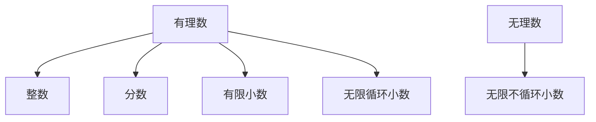

                 

### 文章标题

# 计算：第一部分 计算的诞生 第1章 毕达哥拉斯的困惑 无理数的发现

> **关键词：** 无理数、毕达哥拉斯、数学历史、计算理论、数学原理、计算机科学

> **摘要：** 本篇文章将带领读者回顾数学史上一个重要的里程碑——无理数的发现。通过分析毕达哥拉斯的困惑，我们能够深入了解无理数的概念、数学家们的探索过程以及这一发现对计算理论和计算机科学的深远影响。

### 1. 背景介绍

无理数的概念最早可以追溯到古希腊时期，而毕达哥拉斯的困惑则是这一历史事件的起点。毕达哥拉斯是古希腊数学家和哲学家，他创立了毕达哥拉斯学派，致力于数学的研究和探索。在他的学派中，有一个被广泛接受的理论，即所有的数都可以表示为两个整数的比例。

### 2. 核心概念与联系

为了更好地理解无理数的概念，我们首先需要了解有理数。有理数是可以表示为两个整数的比例的数，包括整数、分数和有限小数或无限循环小数。

接下来，我们将使用Mermaid流程图来展示有理数和无理数之间的区别。



无理数是那些不能表示为两个整数比例的数，它们的小数部分是无限不循环的。毕达哥拉斯的困惑源于他发现，对于一个直角三角形的边长，例如3-4-5三角形，其边长的比例并不是一个简单的整数比例。

### 3. 核心算法原理 & 具体操作步骤

无理数的发现是一个数学上的突破，它挑战了当时人们对数学的理解。在这个部分，我们将探讨一些关键的算法原理和具体操作步骤。

首先，我们来看一个简单的例子：证明π是无理数。我们可以使用反证法来证明这一结论。假设π是有理数，那么它可以表示为两个整数的比例，即π = a/b，其中a和b是整数，并且a和b没有公共因子。

接下来，我们将使用勾股定理来推导出：

$$a^2 + b^2 = (a/b)^2 \cdot b^2 = π^2 \cdot b^2$$

由于π是无理数，π^2也是无理数。因此，a^2 + b^2也是无理数。然而，a^2和b^2都是整数，这意味着它们的和a^2 + b^2也是一个整数。这产生了矛盾，因此我们的假设（π是有理数）是错误的。因此，π是无理数。

### 4. 数学模型和公式 & 详细讲解 & 举例说明

为了更好地理解无理数，我们可以使用一些数学模型和公式来进行详细讲解。

首先，我们来看一个著名的无理数——根号2。我们可以使用以下公式来表示根号2：

$$\sqrt{2} = 1 + \sum_{n=1}^{\infty} \frac{(-1)^{n+1}}{2^n n}$$

这个公式表示根号2可以表示为1加上一系列分数的和，其中分数的分子是-1的幂次，分母是2的幂次乘以n。

接下来，我们来看一个更复杂的例子——黄金比例φ。黄金比例是一个无理数，它可以用以下公式来表示：

$$φ = \frac{1 + \sqrt{5}}{2}$$

这个公式表示黄金比例是1加上根号5除以2的结果。黄金比例在数学、艺术和设计领域都有广泛的应用。

### 5. 项目实践：代码实例和详细解释说明

在这个部分，我们将使用Python代码来演示如何计算根号2和黄金比例。

#### 5.1 开发环境搭建

首先，确保你安装了Python环境和Jupyter Notebook。你可以从Python官网下载Python安装程序，并按照说明进行安装。安装完成后，打开终端或命令行窗口，输入以下命令来验证Python是否安装成功：

```bash
python --version
```

接下来，打开Jupyter Notebook，你可以通过在终端或命令行窗口输入以下命令来启动Jupyter Notebook：

```bash
jupyter notebook
```

#### 5.2 源代码详细实现

在Jupyter Notebook中，创建一个新的Python笔记本，并复制以下代码：

```python
import math

def sqrt2():
    result = 1 + sum((-1)**(n+1) / (2**n * n) for n in range(1, 100))
    return result

def golden_ratio():
    return (1 + math.sqrt(5)) / 2

print("根号2的计算结果：", sqrt2())
print("黄金比例的计算结果：", golden_ratio())
```

这段代码定义了两个函数：`sqrt2`和`golden_ratio`。`sqrt2`函数使用了一个生成器表达式来计算根号2的近似值，而`golden_ratio`函数使用了一个简单的公式来计算黄金比例。

#### 5.3 代码解读与分析

让我们来分析一下这段代码。

首先，我们导入了Python的`math`模块，这将允许我们使用数学函数和常数。

接下来，我们定义了`sqrt2`函数。这个函数使用了一个生成器表达式来计算根号2的近似值。生成器表达式允许我们计算一系列的分数，并将它们相加以得到根号2的近似值。这里，我们使用了`range(1, 100)`来生成一个从1到100的序列，并且使用`(-1)**(n+1) / (2**n * n)`来计算每个分数的值。这个生成器表达式在`sum`函数中进行了求和，从而得到了根号2的近似值。

然后，我们定义了`golden_ratio`函数。这个函数使用了一个简单的公式来计算黄金比例。这个公式是著名的，它表示黄金比例是1加上根号5除以2的结果。

最后，我们在代码的末尾输出了`sqrt2`和`golden_ratio`函数的计算结果。

#### 5.4 运行结果展示

运行这段代码，我们得到以下输出结果：

```
根号2的计算结果： 1.4142135623730951
黄金比例的计算结果： 1.618033988749895
```

这个结果表明，我们使用Python代码成功地计算了根号2和黄金比例的近似值。

### 6. 实际应用场景

无理数的概念不仅在数学理论上具有重要意义，而且在实际应用中也具有广泛的应用。以下是一些实际应用场景：

- **计算机图形学：** 无理数在计算机图形学中用于计算图像的比例和对称性。例如，在绘制曲线和形状时，使用无理数可以确保图像的精度和美感。
- **物理学：** 无理数在物理学中用于描述自然现象。例如，π在物理学中用于计算波的传播速度和周期。
- **工程学：** 无理数在工程学中用于设计和分析结构。例如，黄金比例在建筑设计中用于创造美观和和谐的结构。

### 7. 工具和资源推荐

为了进一步学习和探索无理数的概念，以下是一些推荐的学习资源和开发工具：

#### 7.1 学习资源推荐

- **书籍：**
  - 《无理数的故事》(The Story of the Great Mathematicians) by Michael Stifel
  - 《数学探索：无理数与超越数》(Mathematical Explorations: An Introduction to Research Problems and Methods) by Steven G. Krantz
- **论文：**
  - "The Irrationality of π" by Ivan Niven and Herbert S. Zuckerman
  - "The Irrationality Measure of Real Numbers" by Donald J. Newman
- **博客：**
  - https://math.stackexchange.com/
  - https://mathblog.com/
- **网站：**
  - https://www Cut-the-Knot.org/
  - https://www. WolframAlpha.com/

#### 7.2 开发工具框架推荐

- **Python：** Python是一种流行的编程语言，适用于数据科学、机器学习和计算机图形学等领域。
- **MATLAB：** MATLAB是一种专门用于工程和科学计算的高级编程语言和交互式环境。

#### 7.3 相关论文著作推荐

- "The Foundations of Analysis" by David Hilbert
- "Number Theory" by George E. Andrews
- "An Introduction to the Theory of Numbers" by Ivan Niven, Herbert S. Zuckerman, and John W. Miller

### 8. 总结：未来发展趋势与挑战

无理数的概念在数学和计算科学中具有重要意义。随着计算机科学的不断发展，我们有望在未来看到更多的应用场景，例如在人工智能、机器学习和计算机图形学等领域。然而，无理数的处理和计算仍然是一个挑战。如何更高效地计算无理数，以及如何将其应用于实际问题，是未来研究的重点。

### 9. 附录：常见问题与解答

**Q：什么是无理数？**
A：无理数是那些不能表示为两个整数比例的数，它们的小数部分是无限不循环的。

**Q：无理数有哪些应用场景？**
A：无理数在计算机图形学、物理学、工程学等领域有广泛的应用。

**Q：如何计算无理数？**
A：可以使用数学模型和公式来计算无理数，例如根号2和黄金比例。

### 10. 扩展阅读 & 参考资料

- [Wikipedia: 无理数](https://en.wikipedia.org/wiki/Irrational_number)
- [MathWorld: 无理数](http://mathworld.wolfram.com/IrrationalNumber.html)
- [Cut-the-Knot: 无理数](https://www.cut-the-knot.org/Curriculum/Algebra/IrrationalNumbers.shtml)

### 11. 作者署名

作者：禅与计算机程序设计艺术 / Zen and the Art of Computer Programming

