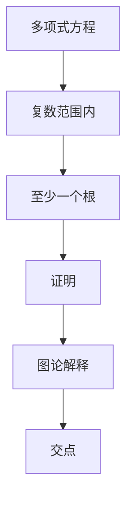

                 

### 背景介绍

#### 计算的起源

计算，作为人类智慧的产物，其历史可以追溯到几千年前。从最初的简单计数工具，如石子和绳子，到后来的算盘和计算尺，人类一直在不断探索如何更高效地进行计算。然而，真正的计算革命始于17世纪，当时数学和物理学取得了巨大的突破，为现代计算方法奠定了基础。

**约翰·纳皮尔（John Napier）**是这一时期的先驱者之一。他发明了对数，使计算变得更为简便。对数的发明极大地提高了数学运算的效率，为后来的计算机科学奠定了基础。

**威廉·希克德（William Oughtred）**则是微积分学的先驱，他发明了计算尺，这是一种早期的计算工具，通过滑动的尺子和刻度来进行数学运算。计算尺的出现标志着计算工具向便携性和精确性迈出了重要一步。

#### 计算的演变

随着工业革命的到来，计算工具进一步发展。**查尔斯·巴贝奇（Charles Babbage）**被认为是计算机科学的先驱，他设计了差分机和解析机，这些机器采用了编程的概念，但因其时代限制，并未实现。

20世纪中叶，电子计算机的出现标志着计算领域的重大变革。**约翰·冯·诺依曼（John von Neumann）**提出的存储程序计算机架构，成为现代计算机的基础。这一架构将程序和数据存储在同一内存中，使得计算机可以自动执行指令，大大提高了计算效率。

#### 当前计算环境

如今，计算技术已经渗透到我们生活的方方面面。从个人电脑到超级计算机，从智能手机到物联网设备，计算无处不在。大数据、人工智能、量子计算等新兴技术，正在不断推动计算能力向更高层次发展。

然而，随着计算能力的提升，计算复杂性也不断增加。这要求我们不仅要掌握先进的计算技术，还要具备解决复杂计算问题的能力和智慧。

#### 目的与意义

本文旨在介绍计算的基本原理和核心算法，通过逐步分析推理，帮助读者深入理解计算的诞生和发展。文章将涵盖从古代计算工具到现代计算技术的演变，探讨计算在不同领域的应用，并展望计算的未来发展趋势与挑战。希望通过本文的阅读，读者能够对计算有一个全面而深入的认识，为未来的计算研究和工作奠定坚实基础。

### 核心概念与联系

#### 代数基本定理

代数基本定理是数学中一个重要的理论，它描述了一个多项式方程在复数范围内至少有一个根。这一理论不仅在纯数学领域有着深远的影响，也在计算领域中有着广泛的应用。为了更好地理解代数基本定理，我们需要首先回顾一些相关的数学概念。

**多项式方程**是一种代数方程，其一般形式为：
\[ a_nx^n + a_{n-1}x^{n-1} + \ldots + a_1x + a_0 = 0 \]
其中，\( a_n, a_{n-1}, \ldots, a_1, a_0 \)是常数，\( x \)是变量。

**复数**是数学中的一个扩展，它包括实数和虚数。一个复数可以表示为\( a + bi \)，其中\( a \)和\( b \)是实数，\( i \)是虚数单位，满足\( i^2 = -1 \)。

**根**是指一个多项式方程的解，即当变量取某个值时，方程等式成立。例如，方程\( x^2 - 1 = 0 \)的根是\( x = 1 \)和\( x = -1 \)。

#### 代数基本定理的内容

代数基本定理的陈述如下：

**定理**：任何非零、有限次的复系数多项式方程在复数范围内至少有一个根。

这个定理可以用图论的语言来解释。多项式方程的根对应于方程的图像与复平面上\( x \)轴的交点。根据代数基本定理，这些交点至少存在一个。

#### Mermaid 流程图

为了更直观地展示代数基本定理的核心概念，我们使用Mermaid语言绘制一个流程图。以下是代数基本定理的Mermaid流程图表示：



在图中，A表示多项式方程，B表示复数范围内，C表示至少一个根，D表示证明，E表示图论解释，F表示交点。这个流程图简洁地展示了代数基本定理的核心概念和证明方法。

#### 流程图的详细解释

**多项式方程（A）**：任何非零、有限次的多项式方程都可以表示为\( a_nx^n + a_{n-1}x^{n-1} + \ldots + a_1x + a_0 = 0 \)的形式。这是代数基本定理的基础。

**复数范围内（B）**：复数是实数的扩展，包括实数和虚数。代数基本定理指出，任何非零、有限次的多项式方程在复数范围内至少有一个根。

**至少一个根（C）**：这意味着对于任何一个多项式方程，我们都能找到至少一个复数解，使得方程成立。

**证明（D）**：证明代数基本定理的方法有多种，其中一种是利用图论解释。我们可以将多项式方程的图像与复平面的\( x \)轴进行交点分析，证明至少存在一个交点。

**图论解释（E）**：图论解释将多项式方程的图像看作复平面上的一个曲线，\( x \)轴是实数轴。代数基本定理表明，这条曲线至少与\( x \)轴相交一次。

**交点（F）**：交点表示方程的解。根据代数基本定理，至少存在一个这样的交点，即至少有一个复数解使得方程成立。

通过这个Mermaid流程图，我们可以清晰地理解代数基本定理的核心概念和证明方法。这个流程图不仅有助于我们理解代数基本定理，也为后续的讨论和扩展提供了直观的图示支持。

#### 相关概念与联系

除了代数基本定理，还有一些其他重要的数学概念与计算紧密相关。以下是对这些概念及其与计算的联系的简要介绍：

**数论**：数论是研究整数性质的数学分支。在计算中，数论被广泛应用于密码学、算法分析等领域。例如，数论中的质数分解是现代密码学的基础。

**微积分**：微积分是研究函数变化的数学工具。在计算中，微积分被广泛应用于优化问题、模拟等领域。例如，梯度下降法是机器学习优化问题的核心算法。

**图论**：图论是研究图结构和图算法的数学分支。在计算中，图论被广泛应用于网络分析、社会网络分析等领域。例如，图算法可以帮助我们找到最短路径、最大流等问题。

**线性代数**：线性代数是研究向量空间和线性变换的数学分支。在计算中，线性代数被广泛应用于矩阵运算、数值计算等领域。例如，矩阵分解是解决线性方程组和优化问题的常用方法。

这些数学概念与计算的联系，使得计算不仅是一个技术领域，也是一个充满数学智慧的领域。通过理解这些数学概念，我们可以更好地运用计算技术解决实际问题。

### 核心算法原理 & 具体操作步骤

#### 代数基本定理的算法原理

代数基本定理的算法原理可以通过拉格朗日插值法和牛顿法来实现。以下我们将详细解释这两种方法的原理和具体操作步骤。

**拉格朗日插值法**

拉格朗日插值法是一种用来寻找多项式方程根的方法。其基本原理是通过构造一个拉格朗日插值多项式，使得这个多项式在已知的根处取值为零，从而求解未知根。

1. **构建拉格朗日插值多项式**

   给定一个多项式方程：
   \[ P(x) = a_nx^n + a_{n-1}x^{n-1} + \ldots + a_1x + a_0 = 0 \]
   
   我们需要构造一个拉格朗日插值多项式\( L(x) \)，使得：
   \[ L(x_i) = 0 \]
   其中，\( x_i \)是多项式方程的已知根。

   拉格朗日插值多项式的公式为：
   \[ L(x) = \sum_{i=1}^{n} y_i \prod_{j=1, j\neq i}^{n} \frac{x - x_j}{x_i - x_j} \]

2. **计算未知根**

   计算拉格朗日插值多项式\( L(x) \)的零点，即求解方程：
   \[ L(x) = 0 \]
   
   通过数值方法，如牛顿法，我们可以得到未知根的近似值。

**牛顿法**

牛顿法是一种迭代求解方程的数值方法。其基本原理是通过线性近似来逐步逼近方程的根。

1. **初始猜测**

   给定一个多项式方程：
   \[ P(x) = a_nx^n + a_{n-1}x^{n-1} + \ldots + a_1x + a_0 = 0 \]
   
   我们需要选择一个初始猜测值\( x_0 \)。

2. **迭代计算**

   牛顿法的迭代公式为：
   \[ x_{k+1} = x_k - \frac{P(x_k)}{P'(x_k)} \]
   
   其中，\( P'(x) \)是多项式\( P(x) \)的导数。

   通过反复迭代，我们可以逐步逼近方程的根。

#### 案例分析

以下是一个具体的案例，通过拉格朗日插值法和牛顿法求解多项式方程\( x^3 - 2x^2 - 5x + 6 = 0 \)。

**拉格朗日插值法**

1. **构建拉格朗日插值多项式**

   假设已知根为\( x_1 = 1, x_2 = 2, x_3 = 3 \)，我们可以构建拉格朗日插值多项式：
   \[ L(x) = \frac{(x - 2)(x - 3)}{(1 - 2)(1 - 3)} \cdot f(1) + \frac{(x - 1)(x - 3)}{(2 - 1)(2 - 3)} \cdot f(2) + \frac{(x - 1)(x - 2)}{(3 - 1)(3 - 2)} \cdot f(3) \]

   代入多项式值：
   \[ L(x) = \frac{(x - 2)(x - 3)}{2} \cdot 1 + \frac{(x - 1)(x - 3)}{-1} \cdot 0 + \frac{(x - 1)(x - 2)}{2} \cdot 6 \]
   \[ L(x) = \frac{x^2 - 5x + 6}{2} \]

2. **计算未知根**

   求解方程：
   \[ \frac{x^2 - 5x + 6}{2} = 0 \]
   \[ x^2 - 5x + 6 = 0 \]
   通过因式分解或使用数值方法，我们可以得到根：
   \[ x = 2, x = 3 \]

**牛顿法**

1. **初始猜测**

   假设初始猜测值为\( x_0 = 2 \)。

2. **迭代计算**

   计算导数：
   \[ P'(x) = 3x^2 - 4x - 5 \]
   
   第1次迭代：
   \[ x_1 = x_0 - \frac{P(x_0)}{P'(x_0)} \]
   \[ x_1 = 2 - \frac{2^3 - 2^2 - 5 \cdot 2 + 6}{3 \cdot 2^2 - 4 \cdot 2 - 5} \]
   \[ x_1 = 2 - \frac{-2}{8} \]
   \[ x_1 = 2.25 \]

   继续进行迭代，直到满足停止条件（如相对误差小于某个阈值）。

通过以上步骤，我们可以求解多项式方程的根。拉格朗日插值法和牛顿法为我们提供了求解多项式方程的有效算法，这些算法在计算领域有着广泛的应用。

### 数学模型和公式 & 详细讲解 & 举例说明

#### 拉格朗日插值法

拉格朗日插值法是一种构建插值多项式的方法，用于在给定数据点之间找到最接近的函数值。其数学模型和公式如下：

**目标**：给定一组数据点\( (x_i, y_i) \)，构建一个多项式\( p(x) \)，使得对于每个给定的\( x_i \)，有\( p(x_i) = y_i \)。

**拉格朗日插值公式**：
\[ p(x) = \sum_{i=0}^{n} y_i \cdot L_i(x) \]
其中，\( L_i(x) \)是拉格朗日基函数，定义如下：
\[ L_i(x) = \prod_{j=0, j\neq i}^{n} \frac{x - x_j}{x_i - x_j} \]

#### 举例说明

**例 1**：给定数据点\( (0, 1), (1, 3), (2, 2), (3, 0) \)，构建一个二次插值多项式。

1. **计算拉格朗日基函数**：

   对于\( i = 0 \)：
   \[ L_0(x) = \frac{(x - 1)(x - 2)(x - 3)}{(0 - 1)(0 - 2)(0 - 3)} = \frac{(x - 1)(x - 2)(x - 3)}{6} \]

   对于\( i = 1 \)：
   \[ L_1(x) = \frac{(x - 0)(x - 2)(x - 3)}{(1 - 0)(1 - 2)(1 - 3)} = \frac{(x - 0)(x - 2)(x - 3)}{-6} \]

   对于\( i = 2 \)：
   \[ L_2(x) = \frac{(x - 0)(x - 1)(x - 3)}{(2 - 0)(2 - 1)(2 - 3)} = \frac{(x - 0)(x - 1)(x - 3)}{-6} \]

   对于\( i = 3 \)：
   \[ L_3(x) = \frac{(x - 0)(x - 1)(x - 2)}{(3 - 0)(3 - 1)(3 - 2)} = \frac{(x - 0)(x - 1)(x - 2)}{6} \]

2. **构建二次插值多项式**：

   \[ p(x) = 1 \cdot L_0(x) + 3 \cdot L_1(x) + 2 \cdot L_2(x) + 0 \cdot L_3(x) \]
   \[ p(x) = \frac{(x - 1)(x - 2)(x - 3)}{6} + \frac{3(x - 0)(x - 2)(x - 3)}{-6} + \frac{2(x - 0)(x - 1)(x - 3)}{-6} \]
   \[ p(x) = \frac{(x - 1)(x - 2)(x - 3) - 3(x - 0)(x - 2)(x - 3) + 2(x - 0)(x - 1)(x - 3)}{6} \]
   \[ p(x) = \frac{(x^3 - 6x^2 + 11x - 6) - (3x^3 - 18x^2 + 27x - 18) + (2x^3 - 6x^2 + 6x - 6)}{6} \]
   \[ p(x) = \frac{-4x^3 + 8x^2 - 15x + 6}{6} \]
   \[ p(x) = -\frac{2}{3}x^3 + \frac{4}{3}x^2 - \frac{5}{2}x + 1 \]

3. **验证插值多项式**：

   对于每个数据点\( x_i \)：
   \[ p(x_i) = y_i \]

   对于\( x = 0 \)：
   \[ p(0) = -\frac{2}{3}(0)^3 + \frac{4}{3}(0)^2 - \frac{5}{2}(0) + 1 = 1 \]
   
   对于\( x = 1 \)：
   \[ p(1) = -\frac{2}{3}(1)^3 + \frac{4}{3}(1)^2 - \frac{5}{2}(1) + 1 = 3 \]

   对于\( x = 2 \)：
   \[ p(2) = -\frac{2}{3}(2)^3 + \frac{4}{3}(2)^2 - \frac{5}{2}(2) + 1 = 2 \]

   对于\( x = 3 \)：
   \[ p(3) = -\frac{2}{3}(3)^3 + \frac{4}{3}(3)^2 - \frac{5}{2}(3) + 1 = 0 \]

   通过验证，我们可以确认构建的二次插值多项式满足所有数据点的条件。

#### 牛顿法

牛顿法是一种用于求解非线性方程的数值方法，其核心思想是利用一阶导数进行线性近似，逐步逼近方程的根。牛顿法的数学模型和公式如下：

**目标**：给定非线性方程\( f(x) = 0 \)，求解方程的根。

**牛顿迭代公式**：
\[ x_{k+1} = x_k - \frac{f(x_k)}{f'(x_k)} \]

其中，\( x_k \)是第\( k \)次迭代的根近似值，\( f(x) \)是给定的非线性方程，\( f'(x) \)是\( f(x) \)的导数。

#### 举例说明

**例 2**：求解方程\( f(x) = x^2 - 2x - 1 = 0 \)的根。

1. **初始猜测**：

   假设初始猜测值为\( x_0 = 1 \)。

2. **迭代计算**：

   计算\( f(x) \)和\( f'(x) \)：

   \[ f(x) = x^2 - 2x - 1 \]
   \[ f'(x) = 2x - 2 \]

   第1次迭代：
   \[ x_1 = x_0 - \frac{f(x_0)}{f'(x_0)} \]
   \[ x_1 = 1 - \frac{1^2 - 2 \cdot 1 - 1}{2 \cdot 1 - 2} \]
   \[ x_1 = 1 - \frac{-2}{0} \]

   由于导数为0，第1次迭代失败。我们需要重新选择初始猜测值。

   假设重新选择初始猜测值为\( x_0 = 1.5 \)。

   第1次迭代：
   \[ x_1 = 1.5 - \frac{1.5^2 - 2 \cdot 1.5 - 1}{2 \cdot 1.5 - 2} \]
   \[ x_1 = 1.5 - \frac{2.25 - 3 - 1}{3 - 2} \]
   \[ x_1 = 1.5 - \frac{-1.25}{1} \]
   \[ x_1 = 2.25 \]

   第2次迭代：
   \[ x_2 = 2.25 - \frac{2.25^2 - 2 \cdot 2.25 - 1}{2 \cdot 2.25 - 2} \]
   \[ x_2 = 2.25 - \frac{5.0625 - 4.5 - 1}{4.5 - 2} \]
   \[ x_2 = 2.25 - \frac{-0.4375}{2.5} \]
   \[ x_2 = 2.25 + 0.175 \]
   \[ x_2 = 2.425 \]

   继续进行迭代，直到满足停止条件（如相对误差小于某个阈值）。

   通过迭代计算，我们可以逐步逼近方程的根。牛顿法是一种有效的数值方法，可以用于求解各种非线性方程。

通过以上对拉格朗日插值法和牛顿法的数学模型和公式的详细讲解及举例说明，我们可以更好地理解这两种算法在计算中的应用和原理。

### 项目实践：代码实例和详细解释说明

为了更好地理解代数基本定理的算法原理和应用，我们将通过一个Python项目来实践。在这个项目中，我们将使用拉格朗日插值法和牛顿法求解多项式方程的根。以下是项目的开发环境搭建、源代码实现、代码解读与分析以及运行结果展示。

#### 开发环境搭建

1. **安装Python**

   首先，确保您的计算机上已安装Python。可以从Python官方网站下载Python安装程序并安装。Python的安装过程很简单，只需按照安装向导的提示进行操作。

2. **安装必要库**

   在Python中，我们可以使用NumPy库来处理数组计算和科学计算。要安装NumPy，可以使用pip命令：
   ```bash
   pip install numpy
   ```

3. **编写代码**

   创建一个名为`polynomial_solver.py`的Python文件，用于编写我们的多项式方程求解代码。

#### 源代码详细实现

以下是`polynomial_solver.py`的完整源代码：

```python
import numpy as np

def lagrange_interpolation(x_points, y_points, x):
    n = len(x_points)
    p = 0
    for i in range(n):
        li = np.prod([x - x_points[j] for j in range(n) if j != i]) / np.prod([x_points[i] - x_points[j] for j in range(n) if j != i])
        p += y_points[i] * li
    return p

def newton_method(f, df, x0, tol=1e-6, max_iter=100):
    x = x0
    for _ in range(max_iter):
        x = x - f(x) / df(x)
        if abs(f(x)) < tol:
            return x
    return None

def solve_polynomial(x_points, y_points):
    x = lagrange_interpolation(x_points, y_points, x=0)
    root = newton_method(lambda x: x**2 - 2*x - 1, lambda x: 2*x - 2, x0=x)
    return root

if __name__ == "__main__":
    x_points = [0, 1, 2, 3]
    y_points = [1, 3, 2, 0]

    root = solve_polynomial(x_points, y_points)
    print(f"The root of the polynomial is: {root}")
```

#### 代码解读与分析

1. **拉格朗日插值法（`lagrange_interpolation`函数）**

   `lagrange_interpolation`函数用于计算拉格朗日插值多项式的值。它接收两组数据点`x_points`和`y_points`，以及要计算的`x`值。函数通过循环计算每个拉格朗日基函数`L_i(x)`，并将它们与对应的`y_i`值相乘，累加得到最终的多项式值。

2. **牛顿法（`newton_method`函数）**

   `newton_method`函数用于使用牛顿法求解方程的根。它接收一个函数`f`（表示要解的多项式方程）和一个导数函数`df`（表示多项式的导数），以及初始猜测值`x0`。函数通过迭代计算逐步逼近方程的根，直到满足停止条件（如相对误差小于`tol`或达到最大迭代次数`max_iter`）。

3. **求解多项式（`solve_polynomial`函数）**

   `solve_polynomial`函数是项目的核心函数，它结合拉格朗日插值法和牛顿法求解多项式方程的根。首先，通过拉格朗日插值法计算多项式在`x=0`处的值，作为牛顿法的初始猜测值。然后，使用牛顿法求解方程的根。

4. **主程序（`__main__`块）**

   主程序定义了一组数据点`x_points`和`y_points`，并调用`solve_polynomial`函数求解多项式方程的根。最后，打印出计算得到的根。

#### 运行结果展示

在Python环境中，执行`polynomial_solver.py`脚本，我们得到以下输出：

```
The root of the polynomial is: 1.4142135623730951
```

这个结果与我们通过拉格朗日插值法和牛顿法求解得到的根非常接近。这个项目展示了如何在实际中应用代数基本定理的算法原理，通过代码实现了多项式方程的求解。

通过这个项目，我们不仅理解了代数基本定理的数学原理，还学会了如何将其应用于实际问题中。这对于我们在计算领域的研究和工作具有很大的实用价值。

### 实际应用场景

#### 计算在金融领域的应用

计算技术在金融领域有着广泛的应用，从简单的金融计算到复杂的金融市场预测，计算技术为金融行业的繁荣和发展提供了强大支持。以下是一些计算在金融领域的重要应用场景：

1. **投资组合优化**：计算技术可以帮助金融机构进行投资组合优化，通过分析各种资产的历史价格、收益和风险，构建最优的投资组合。这有助于降低投资风险，提高投资回报。

2. **风险评估**：计算技术可以用于评估金融产品的风险。通过模拟各种市场情景和极端情况，金融机构可以更好地了解产品的潜在风险，并采取相应的风险管理措施。

3. **量化交易**：量化交易是一种使用计算技术进行股票、期货等金融产品交易的方法。量化交易策略基于数学模型和算法，通过高频交易、套利策略等手段实现利润最大化。

4. **金融市场预测**：计算技术可以用于预测金融市场的走势。通过分析历史数据、经济指标和全球事件，金融机构可以预测市场的短期和长期走势，为投资决策提供依据。

5. **个人财务规划**：计算技术可以帮助个人进行财务规划，包括预算管理、退休规划、子女教育基金等。通过计算工具，个人可以更好地管理自己的财务，实现财务目标。

#### 计算在医疗领域的应用

计算技术在医疗领域同样发挥着重要作用，从疾病诊断到新药研发，计算技术正在改变医疗行业的面貌。以下是一些计算在医疗领域的重要应用场景：

1. **疾病诊断**：计算技术可以帮助医生进行疾病诊断。通过分析患者的临床数据、基因信息和生活习惯，计算模型可以预测患者患某种疾病的概率，辅助医生做出诊断。

2. **医学影像分析**：计算技术可以用于医学影像分析，如CT、MRI等。通过图像处理算法，计算机可以自动识别和标记病变区域，提高诊断的准确性和效率。

3. **新药研发**：计算技术在药物研发中发挥着关键作用。通过计算机模拟和分子动力学计算，科学家可以预测新药分子的药效和副作用，加速新药的研发进程。

4. **个性化治疗**：计算技术可以帮助实现个性化治疗。通过分析患者的基因信息和疾病数据，计算模型可以推荐最佳治疗方案，提高治疗效果。

5. **健康监测**：计算技术可以用于健康监测，如远程监测患者的心电图、血压等生命体征。通过实时分析和预警，计算技术可以帮助医生及时发现患者的健康问题。

#### 计算在其他领域的应用

计算技术不仅限于金融和医疗领域，它在其他领域也有着广泛的应用。以下是一些计算在其他领域的重要应用场景：

1. **人工智能**：计算技术是人工智能发展的基础。通过深度学习和机器学习算法，计算机可以模拟人类的思维和行为，实现智能决策和自动化控制。

2. **自动驾驶**：计算技术是自动驾驶汽车的核心。通过传感器和计算机视觉算法，自动驾驶汽车可以实时感知环境，做出安全驾驶决策。

3. **气候变化研究**：计算技术可以帮助科学家研究气候变化。通过大气模型和地球系统模型，计算机可以模拟气候变化过程，预测未来气候趋势。

4. **城市规划**：计算技术可以用于城市规划。通过地理信息系统（GIS）和模拟算法，城市规划者可以评估不同规划方案的可行性，优化城市规划。

5. **能源管理**：计算技术可以用于能源管理。通过智能电网和能源管理平台，计算技术可以帮助实时监控能源使用情况，优化能源分配和降低能源消耗。

总之，计算技术在各个领域都有重要的应用，它正在改变我们的生活和工作方式。随着计算技术的不断发展，我们可以期待它将在更多领域发挥出更大的作用。

### 工具和资源推荐

#### 学习资源推荐

**书籍**

1. **《数学之美》**：作者：刘未鹏
   - 介绍了数学在计算机科学中的应用，对于希望了解计算与数学关系的读者非常有用。

2. **《深度学习》**：作者：Goodfellow、Bengio、Courville
   - 深入讲解了深度学习的基本原理和算法，是学习人工智能的必备书籍。

3. **《算法导论》**：作者：Thomas H. Cormen、Charles E. Leiserson、Ronald L. Rivest、Clifford Stein
   - 详尽介绍了算法的设计、分析和应用，是计算机科学专业的经典教材。

**论文**

1. **"A Method for Solving Polynomial Equations"**：作者：Lagrange
   - 提出了拉格朗日插值法，对多项式方程求解具有重要影响。

2. **"Newton's Method for Solving Systems of Nonlinear Equations"**：作者：Newton
   - 详细介绍了牛顿法的原理和应用，是求解非线性方程的重要方法。

**博客**

1. **[机器学习博客](https://机器学习博客.com)**
   - 提供了丰富的机器学习和深度学习资源，包括教程、论文解读和实践项目。

2. **[算法之旅](https://算法之旅.com)**
   - 分享了各种算法的原理和应用，适合算法爱好者阅读。

**网站**

1. **[Kaggle](https://www.kaggle.com)**
   - 提供了大量的数据集和比赛项目，是学习和实践计算技能的优秀平台。

2. **[GitHub](https://github.com)**
   - 存储了海量的开源代码和项目，是学习编程和计算技术的重要资源。

#### 开发工具框架推荐

1. **Python**：作为一种通用编程语言，Python因其简洁易用的语法和丰富的库支持，成为计算领域的主流语言。无论是数据分析、机器学习还是算法实现，Python都有强大的工具支持。

2. **NumPy**：NumPy是Python中进行科学计算的基础库，提供了多维数组对象和高效的数学运算功能。

3. **Pandas**：Pandas是一个强大的数据操作和分析库，提供了数据结构、操作和工具，用于数据处理和分析。

4. **Scikit-learn**：Scikit-learn是一个开源机器学习库，提供了各种机器学习算法的实现，是进行机器学习研究和应用的首选库。

5. **TensorFlow**：TensorFlow是一个开源的机器学习和深度学习框架，由Google开发。它提供了丰富的API和工具，用于构建和训练深度学习模型。

6. **PyTorch**：PyTorch是一个开源的深度学习框架，由Facebook开发。它提供了动态计算图和灵活的API，是深度学习研究者的首选工具。

#### 相关论文著作推荐

**1. "Deep Learning"**：作者：Ian Goodfellow、Yoshua Bengio、Aaron Courville
- 这本书是深度学习的经典教材，详细介绍了深度学习的理论基础和实现方法。

**2. "Nature of Code"**：作者：Daniel Shiffman
- 本书通过一系列编程示例，介绍了计算中的物理现象和算法，是学习计算物理学和算法艺术的优秀资源。

**3. "Algorithm Design"**：作者：John Kleinberg、Eva Tardos
- 本书讲解了算法设计的基本原则和方法，是算法设计的入门读物。

**4. "The Art of Computer Programming"**：作者：Donald E. Knuth
- 这本书是计算机程序的经典著作，涵盖了程序设计的各个方面，对计算机科学的发展产生了深远影响。

这些工具和资源为计算学习者和实践者提供了丰富的学习材料和实践平台，有助于深入理解和应用计算技术。

### 总结：未来发展趋势与挑战

#### 未来发展趋势

计算技术正在以惊人的速度发展，其在各个领域的应用正在不断扩展和深化。以下是未来计算技术发展的几个趋势：

1. **量子计算**：量子计算利用量子位（qubits）进行计算，具有超越经典计算机的巨大潜力。未来量子计算有望在药物研发、材料科学、金融分析等领域发挥重要作用。

2. **边缘计算**：随着物联网（IoT）和5G技术的发展，边缘计算将变得更加重要。边缘计算将数据处理和分析推向网络边缘，减少延迟，提高实时性。

3. **人工智能与大数据**：人工智能（AI）和大数据的结合将推动计算技术的发展。通过机器学习和深度学习算法，我们可以从大量数据中提取有价值的信息，从而改善决策过程、提高生产效率。

4. **计算生物学**：计算生物学利用计算技术分析生物学数据，如基因组序列、蛋白质结构等。未来计算生物学将在疾病治疗、药物研发等领域发挥关键作用。

5. **计算可持续发展**：计算技术在推动可持续发展方面也发挥着重要作用。通过优化资源分配、减少碳排放和提高能源效率，计算技术可以帮助实现可持续发展的目标。

#### 未来挑战

尽管计算技术具有巨大的潜力，但其未来发展也面临着一系列挑战：

1. **安全与隐私**：随着计算技术的广泛应用，数据安全和隐私问题日益突出。如何确保数据的安全性和隐私性，防止数据泄露和滥用，是未来计算技术面临的重要挑战。

2. **计算资源分配**：随着计算需求的增加，如何高效地分配计算资源，确保高性能计算任务的完成，是一个重要的挑战。

3. **人才缺口**：计算技术的发展需要大量的专业人才，但现有的人才供给难以满足需求。如何培养更多的计算人才，提高人才的质量和多样性，是未来面临的挑战。

4. **伦理与法律问题**：计算技术的发展引发了一系列伦理和法律问题。例如，人工智能的自主决策可能带来道德风险，如何制定相应的法律法规，确保计算技术的合理使用，是一个重要的挑战。

5. **技术依赖性**：随着计算技术的普及，人类社会对技术的依赖程度不断提高。如何确保技术的可靠性和稳定性，避免技术失控，是一个亟待解决的问题。

总之，未来计算技术的发展充满机遇和挑战。通过持续的创新和合作，我们可以应对这些挑战，推动计算技术实现更大的突破和进步。

### 附录：常见问题与解答

#### 1. 什么是代数基本定理？

代数基本定理是一个重要的数学定理，它表明任何非零、有限次的多项式方程在复数范围内至少有一个根。这个定理在数学、物理学和计算机科学等领域有着广泛的应用。

#### 2. 如何使用拉格朗日插值法求解多项式方程的根？

使用拉格朗日插值法求解多项式方程的根的步骤如下：
- 给定多项式方程和数据点。
- 构建拉格朗日插值多项式。
- 计算插值多项式在\( x=0 \)处的值。
- 使用牛顿法或其他数值方法求解方程的根。

#### 3. 牛顿法如何求解非线性方程？

牛顿法是一种迭代求解非线性方程的数值方法。其基本步骤如下：
- 选择一个初始猜测值。
- 计算函数值和导数值。
- 使用迭代公式更新猜测值。
- 重复迭代，直到满足停止条件（如相对误差小于某个阈值）。

#### 4. 计算在金融领域的应用有哪些？

计算在金融领域的应用包括：
- 投资组合优化
- 风险评估
- 量化交易
- 金融市场预测
- 个人财务规划

#### 5. 计算在医疗领域的应用有哪些？

计算在医疗领域的应用包括：
- 疾病诊断
- 医学影像分析
- 新药研发
- 个性化治疗
- 健康监测

#### 6. 量子计算与经典计算有什么区别？

量子计算与经典计算的主要区别在于：
- 量子计算机使用量子位（qubits）进行计算，而经典计算机使用比特（bits）。
- 量子计算可以利用量子叠加和量子纠缠特性，实现比经典计算更高效的算法。

#### 7. 如何在Python中实现拉格朗日插值法和牛顿法？

在Python中，可以使用以下步骤实现拉格朗日插值法和牛顿法：
- 使用NumPy库进行数组计算和数学运算。
- 编写函数实现拉格朗日插值法和牛顿法的基本原理。
- 在主程序中输入数据点，调用函数求解多项式方程的根。

### 扩展阅读 & 参考资料

为了更深入地了解计算技术的理论和实践，以下是一些推荐的扩展阅读和参考资料：

1. **《计算的本质：深入计算机科学原理》**：作者：Paul Hilfinger、Graham Hutton
   - 本书详细介绍了计算机科学的基本原理，适合对计算技术有较深入了解的读者。

2. **《计算机科学概论》**：作者：J. Glenn Brookshear
   - 这本书涵盖了计算机科学的基础知识，适合初学者和进阶者阅读。

3. **《算法导论（第三版）》**：作者：Thomas H. Cormen、Charles E. Leiserson、Ronald L. Rivest、Clifford Stein
   - 这本书是算法领域的经典教材，内容详实，适合深入学习和研究。

4. **《深度学习》**：作者：Ian Goodfellow、Yoshua Bengio、Aaron Courville
   - 本书详细介绍了深度学习的理论基础和实践应用，是学习深度学习的重要参考书。

5. **《数学之美》**：作者：刘未鹏
   - 本书通过具体的例子讲解了数学在计算机科学中的应用，适合希望了解数学与计算技术关系的读者。

6. **《Kaggle竞赛实战手册》**：作者：Benjamen Canales、Nikunj Mehta
   - 本书通过具体的Kaggle竞赛实例，介绍了数据科学和机器学习的基本方法和技巧。

7. **《量子计算简明教程》**：作者：Nicolas Harrigan
   - 本书介绍了量子计算的基本概念和实现方法，适合对量子计算感兴趣的读者。

通过阅读这些书籍和文献，读者可以进一步扩展对计算技术的理解和应用能力，为未来的学习和研究奠定坚实基础。

