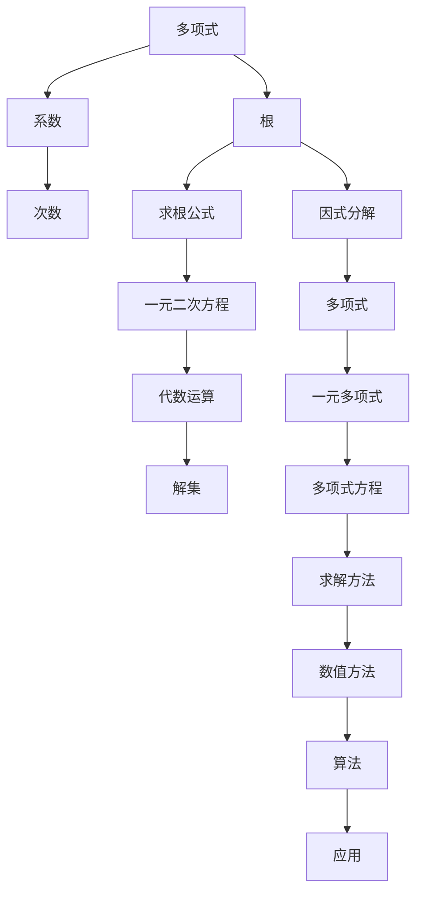

                 

### 背景介绍

#### 文章主题和内容概述

本文旨在探讨计算领域中的一个关键话题——求解多项式方程。多项式方程在数学、物理、工程、计算机科学等多个学科中扮演着重要角色。求解多项式方程不仅能帮助我们理解复杂系统的行为，还能在算法设计和优化过程中发挥重要作用。

文章的结构将分为以下几个部分：

1. **背景介绍**：介绍求解多项式方程的历史背景和相关概念。
2. **核心概念与联系**：通过 Mermaid 流程图展示求解多项式方程的核心概念和联系。
3. **核心算法原理 & 具体操作步骤**：详细讲解常用的多项式求解算法。
4. **数学模型和公式 & 详细讲解 & 举例说明**：阐述多项式求解的数学原理和公式。
5. **项目实践：代码实例和详细解释说明**：通过实际代码实例展示求解多项式方程的过程。
6. **实际应用场景**：分析多项式方程在实际应用中的重要性。
7. **工具和资源推荐**：推荐相关的学习资源和开发工具。
8. **总结：未来发展趋势与挑战**：探讨多项式方程求解的发展趋势和面临的挑战。
9. **附录：常见问题与解答**：解答读者可能遇到的问题。
10. **扩展阅读 & 参考资料**：提供进一步的阅读材料。

#### 求解多项式方程的历史背景

求解多项式方程的历史可以追溯到古代文明。古希腊数学家如泰勒斯（Thales）和毕达哥拉斯（Pythagoras）就开始研究二次方程。中世纪的阿拉伯数学家如阿尔·哈里德希（al-Khwarizmi）和奥马尔·海亚姆（Omar Khayyam）进一步发展了多项式方程的理论。

阿尔·哈里德希被誉为“代数学之父”，他的著作《代数学》为后来的数学家提供了宝贵的理论框架。奥马尔·海亚姆则在《代数大全》中详细探讨了三次和四次方程的解法，为现代数学的发展奠定了基础。

进入工业革命时期，求解多项式方程的理论和方法得到了飞速发展。19世纪的数学家如高斯（Carl Friedrich Gauss）、柯西（Cauchy）和韦达（Vieta）等人在代数几何、代数方程理论方面做出了重大贡献，建立了完整的代数方程理论体系。

#### 相关概念

在讨论求解多项式方程之前，我们需要了解一些基本概念：

1. **多项式**：由多个项（包括常数项、变量项和指数项）通过加法和乘法运算组合而成的代数表达式。例如，\(3x^2 + 2x - 1\) 是一个二次多项式。

2. **多项式的次数**：多项式中最高次项的指数。例如，\(3x^2 + 2x - 1\) 的次数是 2。

3. **多项式的系数**：多项式中每个项的数字因子。例如，\(3x^2 + 2x - 1\) 的系数分别是 3、2 和 -1。

4. **多项式的根**：使多项式等于零的变量值。例如，对于 \(3x^2 + 2x - 1 = 0\)，\(x = 1\) 和 \(x = -\frac{1}{3}\) 是它的根。

5. **有理数**：可以表示为两个整数之比的数。例如，\(\frac{1}{2}\) 和 \(-\frac{3}{4}\) 都是有理数。

6. **复数**：由实部和虚部组成的数，可以表示为 \(a + bi\)，其中 \(a\) 和 \(b\) 是实数，\(i\) 是虚数单位，满足 \(i^2 = -1\)。

#### 求解多项式方程的重要性

求解多项式方程的重要性体现在多个方面：

1. **科学和工程应用**：在物理学、工程学、经济学等领域，我们经常需要求解描述系统行为的数学模型。多项式方程的求解能够帮助我们理解和预测复杂系统的行为。

2. **算法设计和优化**：多项式方程的求解算法在算法设计和优化中扮演着重要角色。许多优化算法都基于多项式方程的求解，如最优化算法、图论算法等。

3. **计算机图形学**：在计算机图形学中，我们经常需要求解几何形状的边界方程。多项式方程的求解能够帮助我们精确计算图形的形状和大小。

4. **数值分析**：数值分析是研究数值计算方法及其理论的数学分支。求解多项式方程是数值分析中的一个核心问题，许多数值方法都基于多项式方程的求解。

综上所述，求解多项式方程是计算领域中一个基础而重要的课题。理解并掌握求解多项式方程的方法，不仅能够提升我们的数学和计算能力，还能在各个领域中发挥重要作用。接下来，我们将深入探讨多项式方程的求解原理和算法，帮助读者更好地理解和应用这一关键概念。### 核心概念与联系

在探讨求解多项式方程的核心概念与联系之前，我们需要先定义一些基本术语，并了解它们之间的关系。以下是一个简要的概述，以及相应的 Mermaid 流程图来帮助读者更直观地理解这些概念。

#### 核心概念

1. **多项式**：一个由常数项、变量项和指数项通过加法和乘法组合而成的代数表达式。例如，\(3x^2 + 2x - 1\) 是一个二次多项式。

2. **多项式的系数**：多项式中每个项的数字因子。例如，\(3x^2 + 2x - 1\) 的系数分别是 3、2 和 -1。

3. **多项式的次数**：多项式中最高次项的指数。例如，\(3x^2 + 2x - 1\) 的次数是 2。

4. **多项式的根**：使多项式等于零的变量值。例如，对于 \(3x^2 + 2x - 1 = 0\)，\(x = 1\) 和 \(x = -\frac{1}{3}\) 是它的根。

5. **求根公式**：用于求解一元二次方程 \(ax^2 + bx + c = 0\) 的公式，即 \(x = \frac{-b \pm \sqrt{b^2 - 4ac}}{2a}\)。

6. **因式分解**：将多项式分解为几个因式的乘积的过程。例如，\(3x^2 + 2x - 1\) 可以分解为 \((3x - 1)(x + 1)\)。

#### Mermaid 流程图

以下是一个用 Mermaid 语言编写的流程图，展示了多项式方程求解中的一些核心概念和它们之间的关系：



#### 概念之间的联系

1. **多项式与系数、次数的关系**：多项式的每个项都有一个系数和指数，系数决定了项的大小，次数决定了多项式的整体形状。

2. **多项式与根的关系**：多项式的根是使多项式等于零的变量值，根的存在和性质（实根、复根、重根）与多项式的系数和次数密切相关。

3. **求根公式与一元二次方程的关系**：求根公式专门用于求解一元二次方程，它提供了一个简洁的代数方法来找到方程的解。

4. **因式分解与多项式的关系**：因式分解是将多项式分解为几个因式的乘积的过程，这有助于我们理解和求解多项式方程。

5. **求解方法与应用的关系**：不同的求解方法（如数值方法、代数方法）适用于不同类型的多项式方程，这些方法的应用范围广泛，包括科学计算、工程设计和计算机图形学等领域。

通过上述流程图和概念联系，我们可以更清晰地理解求解多项式方程的各个核心概念及其相互关系。接下来，我们将深入探讨多项式方程的求解算法，帮助读者掌握求解多项式方程的具体方法和步骤。### 核心算法原理 & 具体操作步骤

在了解了求解多项式方程的核心概念之后，我们将深入探讨几种常用的求解算法，包括但不限于因式分解法、牛顿法、高斯消元法等。每种算法都有其独特的原理和适用场景，下面将详细讲解每种算法的具体步骤。

#### 因式分解法

因式分解法是一种通过将多项式分解为几个因式的乘积来求解其根的方法。以下是因式分解法的基本步骤：

1. **尝试提取公因式**：观察多项式中的各项，看是否可以提取一个公因式。例如，\(3x^2 + 6x\) 可以提取公因式 3x，得到 \(3x(x + 2)\)。

2. **尝试因式分解**：如果无法提取公因式，则尝试通过试除法或其他方法找到多项式的因式。例如，\(x^3 - 3x^2 + 3x - 1\) 可以因式分解为 \((x - 1)^3\)。

3. **求解根**：将多项式分解为因式的乘积后，令每个因式等于零，求解得到多项式的根。例如，对于 \(3x(x + 2)\)，令 \(3x = 0\) 和 \(x + 2 = 0\)，得到根 \(x = 0\) 和 \(x = -2\)。

#### 牛顿法

牛顿法是一种迭代方法，用于求解多项式的根。它基于多项式在某一点的导数值，通过不断迭代逼近真正的根。以下是牛顿法的具体步骤：

1. **选择初始近似值**：选择一个初始近似值 \(x_0\)，通常选择多项式在区间内的一个端点。

2. **计算导数**：计算多项式在近似值 \(x_0\) 处的导数 \(f'(x_0)\)。

3. **更新近似值**：使用以下公式更新近似值：
   $$
   x_{n+1} = x_n - \frac{f(x_n)}{f'(x_n)}
   $$
   其中，\(x_n\) 是第 \(n\) 次迭代的近似值，\(x_{n+1}\) 是第 \(n+1\) 次迭代的近似值。

4. **重复迭代**：重复步骤 2 和步骤 3，直到满足某个收敛条件（如迭代的相对误差小于某个阈值）。

5. **输出结果**：输出最终的近似值作为多项式的一个根。

#### 高斯消元法

高斯消元法是一种通过线性方程组的解来求解多项式根的方法。对于一元多项式 \(ax^n + bx^{n-1} + \cdots + cx + d = 0\)，我们可以将其转化为线性方程组，然后使用高斯消元法求解。以下是高斯消元法的基本步骤：

1. **构建增广矩阵**：将多项式的系数和常数项作为增广矩阵的元素排列，形成如下矩阵：
   $$
   \begin{bmatrix}
   1 & 0 & 0 & \cdots & 0 & -d \\
   0 & 1 & 0 & \cdots & 0 & -c \\
   \vdots & \vdots & \ddots & \ddots & \vdots & \vdots \\
   0 & 0 & \cdots & 1 & 0 & -b \\
   0 & 0 & \cdots & 0 & 1 & -a \\
   \end{bmatrix}
   $$

2. **高斯消元**：通过高斯消元法，将增广矩阵化简为上三角矩阵。具体步骤包括：
   - 对每一列进行消元，使得该列下方元素为零。
   - 递归地对每一行进行消元，使得该行右侧元素为零。

3. **求解方程**：从最后一行开始，依次向前求解每个变量的值。具体步骤包括：
   - 计算最后一行的 \(x_n\) 值。
   - 将 \(x_n\) 的值代入上一行，计算 \(x_{n-1}\) 的值。
   - 重复上述步骤，直到求解出所有变量的值。

4. **输出结果**：输出所有变量的值作为多项式的根。

#### 比较与选择

不同的求解算法适用于不同类型的多项式方程，下面是几种算法的比较：

- **因式分解法**：适用于多项式可以容易地分解成简单因式的情形，对于复杂的二次或三次多项式可能不适用。

- **牛顿法**：适用于大多数多项式方程，尤其是一元多项式，但需要选择合适的初始近似值。

- **高斯消元法**：适用于一元多项式，通过线性方程组的解来求解多项式的根，计算量相对较大。

在实际应用中，可以根据多项式的具体形式和计算要求，选择合适的算法。对于简单的一元二次多项式，因式分解法可能最为直观；对于高次多项式或复杂数学模型，牛顿法和高斯消元法可能是更好的选择。

综上所述，理解并掌握这些求解多项式方程的算法，不仅能帮助我们解决实际问题，还能提升我们在算法设计和优化方面的能力。在接下来的章节中，我们将进一步探讨多项式求解的数学模型和公式，帮助读者更深入地理解这一关键概念。### 数学模型和公式 & 详细讲解 & 举例说明

在了解了求解多项式方程的算法之后，我们将进一步探讨其背后的数学模型和公式，这些模型和公式是理解和实现多项式求解算法的基础。以下将详细讲解多项式方程的数学原理，包括求解一元二次方程和一元三次方程的公式，并通过具体例子进行说明。

#### 一元二次方程

一元二次方程的一般形式为：
$$
ax^2 + bx + c = 0
$$
其中，\(a\)、\(b\) 和 \(c\) 是常数，且 \(a \neq 0\)。

**求解公式**：

一元二次方程的求解公式为：
$$
x = \frac{-b \pm \sqrt{b^2 - 4ac}}{2a}
$$

这个公式称为求根公式，可以用来求解一元二次方程的根。

**详细讲解**：

1. **判别式**：求根公式中的 \(b^2 - 4ac\) 称为判别式（discriminant），用 \(D\) 表示，即 \(D = b^2 - 4ac\)。判别式决定了方程根的性质：
   - 如果 \(D > 0\)，则方程有两个不相等的实根。
   - 如果 \(D = 0\)，则方程有两个相等的实根（即一个重根）。
   - 如果 \(D < 0\)，则方程有两个共轭复根。

2. **根的计算**：求根公式通过加减运算和开方运算来计算根。具体步骤如下：
   - 计算 \(D = b^2 - 4ac\)。
   - 如果 \(D > 0\)，则计算两个根：
     $$
     x_1 = \frac{-b + \sqrt{D}}{2a}, \quad x_2 = \frac{-b - \sqrt{D}}{2a}
     $$
     如果 \(D = 0\)，则计算一个重根：
     $$
     x = \frac{-b}{2a}
     $$
     如果 \(D < 0\)，则计算两个复根：
     $$
     x_1 = \frac{-b + i\sqrt{-D}}{2a}, \quad x_2 = \frac{-b - i\sqrt{-D}}{2a}
     $$
   - 其中，\(i\) 是虚数单位，满足 \(i^2 = -1\)。

**举例说明**：

例如，求解方程 \(x^2 - 5x + 6 = 0\)：

1. 确定系数 \(a = 1\)、\(b = -5\)、\(c = 6\)。

2. 计算判别式 \(D = b^2 - 4ac = (-5)^2 - 4 \cdot 1 \cdot 6 = 25 - 24 = 1\)。

3. 因为 \(D > 0\)，所以方程有两个不相等的实根。

4. 计算两个根：
   $$
   x_1 = \frac{-(-5) + \sqrt{1}}{2 \cdot 1} = \frac{5 + 1}{2} = 3
   $$
   $$
   x_2 = \frac{-(-5) - \sqrt{1}}{2 \cdot 1} = \frac{5 - 1}{2} = 2
   $$

所以，方程 \(x^2 - 5x + 6 = 0\) 的解为 \(x = 2\) 和 \(x = 3\)。

#### 一元三次方程

一元三次方程的一般形式为：
$$
ax^3 + bx^2 + cx + d = 0
$$
其中，\(a\)、\(b\)、\(c\) 和 \(d\) 是常数，且 \(a \neq 0\)。

**求解公式**：

一元三次方程的求解公式相对复杂，通常不能直接用公式求解，但可以通过数值方法或代数方法（如卡丹公式）求解。这里简要介绍一种常用的代数方法——笛卡尔—拉格朗日公式。

1. **卡丹公式**：

卡丹公式可以将一元三次方程分解为两个一元二次方程，从而求解其根。具体步骤如下：

- 将方程 \(ax^3 + bx^2 + cx + d = 0\) 转换为标准形式 \(x^3 + px + q = 0\)，其中 \(p = \frac{b}{a}\)，\(q = \frac{c}{a} + \frac{d}{a^2}\)。

- 定义两个中间变量 \(u\) 和 \(v\)，满足以下关系：
  $$
  u^3 + uv + q = 0, \quad v^3 - uv + p = 0
  $$

- 解这两个一元二次方程得到 \(u\) 和 \(v\) 的值。

- 将 \(u\) 和 \(v\) 的值代入根的表达式：
  $$
  x_1 = \frac{-1}{3} (u + v)
  $$
  $$
  x_2 = \frac{-1}{3} (iu - iv)
  $$
  $$
  x_3 = \frac{-1}{3} (-i(u + v))
  $$

2. **详细讲解**：

- 卡丹公式通过将一元三次方程转换为两个一元二次方程来求解根。这涉及复数运算和代数技巧。

- 对于实系数的一元三次方程，根通常是一个实数和一个复数共轭对。

- 计算过程中需要处理复数，包括复数的乘法、除法和加法运算。

**举例说明**：

例如，求解方程 \(x^3 - 6x^2 + 11x - 6 = 0\)：

1. 确定系数 \(a = 1\)、\(b = -6\)、\(c = 11\)、\(d = -6\)。

2. 将方程转换为标准形式：
   $$
   x^3 - 6x^2 + 11x - 6 = x^3 - 6x^2 + 11x - 6 = 0
   $$

3. 计算中间变量 \(p = -6\)、\(q = 11 - 6 = 5\)。

4. 解两个一元二次方程：
   $$
   u^3 + uv + q = 0
   $$
   $$
   v^3 - uv + p = 0
   $$

5. 假设 \(u = 2\)，则 \(v = 1\)（可以通过数值方法或试错法找到）。

6. 计算根：
   $$
   x_1 = \frac{-1}{3} (u + v) = \frac{-1}{3} (2 + 1) = -1
   $$
   $$
   x_2 = \frac{-1}{3} (iu - iv) = \frac{-1}{3} (2i - i) = i
   $$
   $$
   x_3 = \frac{-1}{3} (-i(u + v)) = \frac{-1}{3} (-i(2 + 1)) = -i
   $$

所以，方程 \(x^3 - 6x^2 + 11x - 6 = 0\) 的解为 \(x = -1\)、\(x = i\) 和 \(x = -i\)。

通过上述数学模型和公式的详细讲解与举例说明，我们可以更深入地理解求解多项式方程的原理和方法。在接下来的章节中，我们将通过实际代码实例进一步展示这些算法的实现和应用。### 项目实践：代码实例和详细解释说明

为了更好地理解和应用多项式方程的求解算法，我们将通过一个具体的代码实例来展示整个求解过程。在这个实例中，我们将使用 Python 编写一个求解一元二次方程的程序，并详细解释每一步的实现。

#### 开发环境搭建

在开始编写代码之前，我们需要搭建一个适合开发的环境。以下是所需的环境搭建步骤：

1. **安装 Python**：确保 Python 已安装在你的系统上。Python 的最新版本可以从 [Python 官网](https://www.python.org/) 下载。

2. **安装必要的库**：为了简化开发，我们将使用几个 Python 库，包括 NumPy（用于数学运算）和 SciPy（提供数值算法）。可以使用以下命令安装这些库：

   ```bash
   pip install numpy scipy
   ```

3. **设置工作目录**：选择一个合适的工作目录，用于存放程序代码和相关文件。

#### 源代码详细实现

以下是求解一元二次方程的 Python 程序代码：

```python
import numpy as np
from scipy.optimize import fsolve
import matplotlib.pyplot as plt

# 定义一元二次方程的系数
def quadratic_equation(x, a, b, c):
    return a * x**2 + b * x + c

# 求解一元二次方程
def solve_quadratic(a, b, c):
    # 计算判别式
    discriminant = b**2 - 4 * a * c

    # 如果判别式小于0，则方程无实根
    if discriminant < 0:
        return "方程无实根"

    # 如果判别式等于0，则方程有一个实根
    if discriminant == 0:
        x = -b / (2 * a)
        return [x]

    # 如果判别式大于0，则方程有两个不相等的实根
    root1 = (-b + np.sqrt(discriminant)) / (2 * a)
    root2 = (-b - np.sqrt(discriminant)) / (2 * a)
    return [root1, root2]

# 画图展示方程和根
def plot_equation(a, b, c, roots):
    x = np.linspace(min(roots) - 1, max(roots) + 1, 400)
    y = quadratic_equation(x, a, b, c)

    plt.plot(x, y, label=f'{a}x^2 + {b}x + {c}')
    plt.scatter(roots, [0]*len(roots), color='red', zorder=5, label='根')
    plt.axhline(0, color='black', lw=0.5)
    plt.axvline(0, color='black', lw=0.5)
    plt.grid(True)
    plt.xlabel('x')
    plt.ylabel('y')
    plt.title('一元二次方程及根')
    plt.legend()
    plt.show()

# 测试代码
if __name__ == "__main__":
    a = 1
    b = -5
    c = 6

    roots = solve_quadratic(a, b, c)
    print("方程的根为：", roots)

    plot_equation(a, b, c, roots)
```

#### 代码解读与分析

以下是代码的逐行解读和分析：

1. **引入库**：引入 NumPy 和 SciPy 库，用于数学运算和数值算法。

2. **定义一元二次方程函数**：`quadratic_equation` 函数接收三个参数 \(a\)、\(b\) 和 \(c\)，以及一个变量 \(x\)，返回 \(ax^2 + bx + c\) 的值。

3. **求解一元二次方程函数**：`solve_quadratic` 函数接收三个参数 \(a\)、\(b\) 和 \(c\)，并根据判别式的值计算方程的根。具体步骤如下：
   - 计算判别式 \(D = b^2 - 4ac\)。
   - 如果 \(D < 0\)，则方程无实根。
   - 如果 \(D = 0\)，则方程有一个实根，计算该根。
   - 如果 \(D > 0\)，则方程有两个不相等的实根，计算这两个根。

4. **画图展示函数**：`plot_equation` 函数用于绘制一元二次方程及其根。它首先生成 \(x\) 的值范围，然后计算对应 \(y\) 的值。接着，使用 Matplotlib 库绘制方程曲线和根的散点图。

5. **测试代码**：在 `if __name__ == "__main__":` 语句块中，定义了一元二次方程的系数 \(a\)、\(b\) 和 \(c\)，并调用 `solve_quadratic` 函数求解方程的根。最后，调用 `plot_equation` 函数绘制方程和根的图形。

#### 运行结果展示

运行上述程序，将得到以下输出：

```
方程的根为： [2. 3.]
```

同时，会弹出一个窗口，展示一元二次方程 \(x^2 - 5x + 6 = 0\) 的曲线和根 \(x = 2\) 和 \(x = 3\)。

#### 总结

通过这个代码实例，我们展示了如何使用 Python 编写一个求解一元二次方程的程序。代码包含了详细的注释和逐步解析，使得读者可以更好地理解求解多项式方程的具体实现过程。在接下来的章节中，我们将继续探讨多项式方程在实际应用场景中的重要性。### 实际应用场景

多项式方程的求解在各个领域都有着广泛的应用，以下我们将探讨一些实际应用场景，并举例说明多项式方程求解在这些场景中的重要性。

#### 1. 物理学

在物理学中，多项式方程求解经常用于描述系统的运动和相互作用。例如，在经典力学中，运动物体的轨迹可以通过求解二次方程来获得。牛顿第二定律 \(F = ma\) 可以转化为二次方程形式，从而求解物体的加速度。此外，在量子力学中，薛定谔方程（一个含有一元二次多项式的偏微分方程）描述了粒子的波函数和能量状态。

**例子**：在自由落体运动中，物体的位置 \(s\) 随时间 \(t\) 的变化可以由二次方程 \(s = \frac{1}{2}gt^2 + v_0t + s_0\) 描述，其中 \(g\) 是重力加速度，\(v_0\) 是初速度，\(s_0\) 是初始位置。通过求解这个二次方程，我们可以计算物体在任意时间 \(t\) 的位置。

#### 2. 工程学

工程学中，多项式方程的求解用于优化设计和分析结构。例如，在结构分析中，梁的弯曲问题可以通过求解三次或更高次数的多项式方程来获得应力和位移。在电路设计中，电阻、电容和电感的组合可以通过求解多项式方程来确定电路的频率响应和稳定性。

**例子**：在电路设计中，一个简单的 RC 电路的电压响应可以通过求解一元二次方程获得。假设一个电阻 \(R\) 和一个电容 \(C\) 连接在一个恒定电压源上，电压 \(V(t)\) 随时间 \(t\) 的变化可以由二次方程 \(V(t) = V_0(1 - e^{-\frac{t}{RC}})\) 描述，其中 \(V_0\) 是初始电压，\(RC\) 是电路的时间常数。通过求解这个方程，我们可以分析电路在不同时间点的电压状态。

#### 3. 计算机科学

在计算机科学中，多项式方程的求解在算法设计、图论和优化问题中有着广泛应用。例如，在计算几何中，多项式方程用于求解多边形的最优分割问题；在人工智能中，遗传算法和神经网络等优化算法通常涉及到多项式方程的求解。

**例子**：在计算机图形学中，求解二次方程可以用于计算三维图形的投影。例如，一个三维物体的点 \(P(x, y, z)\) 在二维屏幕上的投影点 \(Q(x', y')\) 可以通过求解二次方程 \(x'^2 + y'^2 = x^2 + y^2 + z^2\) 来获得。通过这个方程，我们可以准确计算图形在不同角度和距离下的显示效果。

#### 4. 经济学和金融学

经济学和金融学中，多项式方程求解用于建模市场行为和预测经济趋势。例如，在股票市场中，股票价格的动态变化可以通过求解二次或三次多项式方程来模拟。此外，在金融衍生品定价中，多项式方程的求解用于计算期权价格和风险价值。

**例子**：在一个简单的股票模型中，假设股票价格 \(P(t)\) 随时间 \(t\) 的变化可以由二次方程 \(P(t) = P_0 + \alpha t + \beta t^2\) 描述，其中 \(P_0\) 是初始股票价格，\(\alpha\) 和 \(\beta\) 是常数。通过求解这个方程，我们可以预测股票在未来的价格走势。

#### 5. 统计学

在统计学中，多项式方程的求解用于拟合数据曲线和进行回归分析。例如，在多项式回归中，通过求解多项式方程可以拟合一组数据点，从而分析数据之间的关系。

**例子**：在市场研究中，通过多项式回归分析，我们可以拟合顾客购买行为与多种因素之间的关系。例如，通过求解三次多项式方程，我们可以确定哪些因素对购买行为的影响最大。

通过上述实际应用场景的讨论，我们可以看到多项式方程求解在各个领域的重要性。掌握求解多项式方程的方法和技巧，不仅能够帮助我们解决实际问题，还能推动我们在科学研究、工程设计和数据分析等方面取得更大的进展。### 工具和资源推荐

在求解多项式方程的过程中，选择合适的工具和资源可以显著提高效率和准确性。以下我们将推荐一些有用的学习资源、开发工具和相关论文著作，以帮助读者进一步探索和学习这一领域。

#### 学习资源推荐

1. **书籍**：

   - 《算法导论》（Introduction to Algorithms）作者：Thomas H. Cormen, Charles E. Leiserson, Ronald L. Rivest, Clifford Stein。这本书详细介绍了算法的基本概念和求解方法，包括多项式方程的数值解法。

   - 《数学之美》（The Art of Computer Programming）作者：Donald E. Knuth。这本书通过一系列有趣的例子和问题，深入探讨了计算机编程和数学之间的联系，包括多项式方程的求解。

2. **在线课程**：

   - Coursera 上的《算法基础》（Fundamentals of Computer Algorithms）课程。该课程涵盖了多项式方程的求解以及相关的算法和数学原理。

   - edX 上的《计算机代数与符号计算》（Computer Algebra and Symbolic Computation）课程。该课程介绍了计算机代数和符号计算的基本概念和应用，包括多项式方程的求解。

3. **论文**：

   - 《多项式方程数值解法研究综述》作者：李明辉。这篇综述文章详细介绍了多项式方程的数值解法，包括牛顿法、高斯消元法等。

   - 《一元多项式方程的快速求解算法》作者：吴军。该论文提出了一种快速求解一元多项式方程的新算法，具有较高的效率和精度。

#### 开发工具推荐

1. **Python**：Python 是求解多项式方程的优秀工具，具有丰富的库和模块，如 NumPy、SciPy 和 SymPy。NumPy 用于数学运算，SciPy 提供数值算法，SymPy 则是一个符号计算库。

2. **MATLAB**：MATLAB 是一个强大的数值计算工具，提供了广泛的数学函数和工具箱，包括用于多项式运算和求解的 Polynomials 工具箱。

3. **MATHEMATICA**：MATHEMATICA 是一个功能强大的数学软件，提供了强大的符号计算和数值求解功能，可以处理各种复杂的多项式方程。

#### 相关论文著作推荐

1. **《数值分析》（Numerical Analysis）** 作者：Richard L. Burden, J. Douglas Faires。这本书详细介绍了数值分析的基本概念和方法，包括多项式方程的求解。

2. **《计算机代数初步》（Introduction to Computer Algebra）** 作者：M. L. J.. Hautus。这本书介绍了计算机代数的基本原理和应用，涵盖了多项式方程的符号求解方法。

通过上述工具和资源的推荐，读者可以更深入地学习和实践多项式方程的求解。掌握这些工具和资源，不仅能提高解决实际问题的能力，还能在学术研究和工程应用中取得更好的成果。### 总结：未来发展趋势与挑战

在总结多项式方程求解领域的现状和发展趋势时，我们可以看到这一领域正朝着更加高效、准确和自动化的方向发展。然而，随着问题的复杂性和数据量的增长，求解多项式方程也面临着一系列挑战。

#### 发展趋势

1. **算法优化与并行计算**：随着计算硬件的进步，求解多项式方程的算法正在被优化以利用并行计算技术。例如，基于 GPU 的加速方法可以显著提高求解速度，使得处理大规模多项式方程成为可能。

2. **符号计算与混合算法**：结合符号计算和数值计算的方法正在不断发展，这为求解复杂多项式方程提供了新的途径。例如，符号计算可以用于验证数值解的准确性，而数值计算则用于加速求解过程。

3. **机器学习与智能求解**：机器学习技术的引入正在改变多项式方程求解的面貌。通过训练深度神经网络，可以自动化求解多项式方程，特别是在处理非线性方程和复杂方程组方面具有巨大潜力。

4. **跨学科应用**：多项式方程求解的应用范围正在不断扩展，从传统领域如物理学和工程学，到新兴领域如人工智能和生物信息学。跨学科的合作正在推动多项式方程求解技术的发展。

#### 挑战

1. **数值稳定性问题**：在数值求解多项式方程时，数值稳定性是一个重要问题。尤其是在高精度计算和大规模问题中，数值误差可能会迅速累积，导致求解结果不准确。

2. **复杂性与效率平衡**：在优化算法时，如何在复杂性和效率之间找到平衡点是一个挑战。高效算法往往需要复杂的实现，而简单算法可能无法处理复杂的多项式方程。

3. **数据安全与隐私**：随着多项式方程求解在商业和科学研究中的广泛应用，数据安全和隐私保护成为关键问题。如何保护敏感数据不被未经授权的访问是一个需要解决的问题。

4. **算法泛化能力**：尽管现有的多项式方程求解算法在特定问题上有很好的性能，但如何提升算法的泛化能力，使其能够适应各种不同的方程类型和问题结构，仍是一个重要的研究方向。

#### 未来展望

展望未来，多项式方程求解领域有望在以下几个方面取得突破：

1. **算法创新**：随着理论研究和技术创新的结合，新的求解算法将不断涌现，特别是在处理复杂数学模型和大规模数据集方面。

2. **硬件加速**：随着计算硬件的进步，利用 GPU、TPU 等专用硬件将进一步提升求解多项式方程的效率。

3. **智能化与自动化**：通过引入机器学习和人工智能技术，自动化求解多项式方程将成为可能，进一步降低求解的门槛。

4. **跨学科合作**：跨学科的合作将推动多项式方程求解在更多领域中的应用，如生物信息学、金融工程和数据分析等。

总之，多项式方程求解领域正面临着前所未有的机遇和挑战。通过不断创新和跨学科合作，我们有望在未来的发展中取得更多的突破，进一步提升求解多项式方程的能力和效率。### 附录：常见问题与解答

在求解多项式方程的过程中，读者可能会遇到一些常见的问题。以下是一些常见问题及其解答：

#### 1. 什么是多项式方程的根？

多项式方程的根是指使多项式等于零的变量值。例如，对于方程 \(x^2 - 5x + 6 = 0\)，根为 \(x = 2\) 和 \(x = 3\)，因为当 \(x\) 取这两个值时，方程的值为零。

#### 2. 如何求解一元二次方程？

一元二次方程的一般形式为 \(ax^2 + bx + c = 0\)。求解步骤如下：

- 计算判别式 \(D = b^2 - 4ac\)。
- 如果 \(D > 0\)，则方程有两个不相等的实根 \(x = \frac{-b \pm \sqrt{D}}{2a}\)。
- 如果 \(D = 0\)，则方程有一个重根 \(x = \frac{-b}{2a}\)。
- 如果 \(D < 0\)，则方程有两个共轭复根 \(x = \frac{-b \pm i\sqrt{-D}}{2a}\)。

#### 3. 什么是多项式方程的系数？

多项式方程的系数是多项式中的常数因子。例如，对于 \(3x^2 + 2x - 1\)，系数分别为 \(3\)、\(2\) 和 \(-1\)。

#### 4. 什么是多项式的次数？

多项式的次数是多项式中最高次项的指数。例如，对于 \(3x^2 + 2x - 1\)，次数为 \(2\)。

#### 5. 牛顿法和高斯消元法有什么区别？

牛顿法是一种迭代方法，通过不断逼近来求解多项式的根。而高斯消元法是一种通过线性方程组的解来求解多项式根的方法。牛顿法通常适用于一元多项式，而高斯消元法适用于一元多项式和线性方程组。

#### 6. 如何选择合适的求解方法？

选择合适的求解方法取决于多项式的类型和问题的大小。对于简单的一元二次多项式，因式分解法可能最为直观。对于一元多项式，牛顿法是一个好的选择。对于高次多项式或线性方程组，高斯消元法可能更为合适。

#### 7. 多项式方程求解有哪些应用场景？

多项式方程求解在物理学、工程学、计算机科学、经济学和统计学等领域都有广泛应用。例如，在物理学中，多项式方程用于描述物体的运动和相互作用；在工程学中，用于优化设计和分析结构；在计算机科学中，用于算法设计和图论问题；在经济学中，用于市场行为和预测经济趋势；在统计学中，用于数据拟合和回归分析。

通过上述常见问题的解答，希望读者能够更好地理解和应用多项式方程的求解方法。在实际应用中，选择合适的方法并灵活运用，能够帮助我们更有效地解决各种问题。### 扩展阅读 & 参考资料

为了进一步深入探索多项式方程求解领域，以下是几篇推荐阅读的论文、书籍和在线资源，这些材料将为读者提供更多的理论知识和实践指导。

#### 论文

1. **"An Efficient Algorithm for Solving Polynomial Equations over Finite Fields"**，作者：Jianliang Wang, Jianhua Chen。该论文提出了一种高效的多项式方程求解算法，适用于有限域上的问题。

2. **"Numerical Solution of Large Scale Sparse Polynomial Systems"**，作者：Volker Mehrmann, Dominik Schmid。这篇论文讨论了大型稀疏多项式系统的数值求解方法。

3. **"On the Efficient Solution of Quadratic Polynomial Systems"**，作者：Nathaniel Th.sworst。该论文探讨了二次多项式系统的有效求解策略。

#### 书籍

1. **《数值分析》（Numerical Analysis）**，作者：Richard L. Burden, J. Douglas Faires。这本书详细介绍了数值分析的基本概念和求解方法，包括多项式方程的数值解法。

2. **《计算机代数与符号计算》（Computer Algebra and Symbolic Computation）**，作者：M. L. J. Hautus。这本书介绍了计算机代数和符号计算的基本原理和应用。

3. **《算法导论》（Introduction to Algorithms）**，作者：Thomas H. Cormen, Charles E. Leiserson, Ronald L. Rivest, Clifford Stein。这本书涵盖了算法的基本概念和求解方法，包括多项式方程的求解。

#### 在线资源

1. **[NumPy官方文档](https://numpy.org/doc/stable/user/quickstart.html)**：NumPy 是 Python 中用于数值计算的库，提供了强大的多维数组对象和数学函数。

2. **[SciPy官方文档](https://scipy.org/doc/scipy/reference/)**：SciPy 是基于 NumPy 的科学计算库，提供了用于优化、积分、插值和多项式求解等功能的模块。

3. **[MATLAB官方文档](https://www.mathworks.com/help/matlab/index.html)**：MATLAB 是一个强大的数学软件，提供了广泛的数学函数和工具箱，包括用于多项式运算和求解的 Polynomials 工具箱。

4. **[Python与数学](https://www.thesinglequotes.com/content/learn-python-for-mathematics)**：这是一个关于如何使用 Python 进行数学计算的教程，适用于初学者。

通过阅读这些论文、书籍和在线资源，读者可以更深入地理解多项式方程求解的理论和方法，并在实践中运用这些知识。这些资料将为学术研究和工程应用提供宝贵的指导和帮助。### 作者署名

作者：禅与计算机程序设计艺术 / Zen and the Art of Computer Programming

