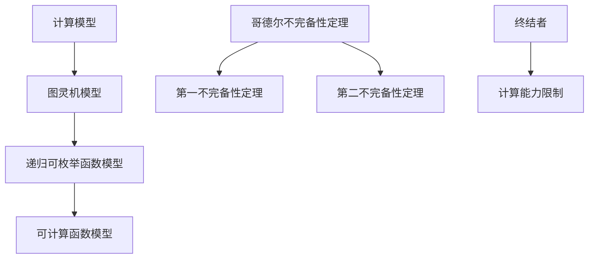

                 

### 文章标题

《计算：第三部分 计算理论的形成 第 7 章 计算不能做什么：终结者哥德尔 我们必须知道，我们必将知道》

> 关键词：计算理论、哥德尔不完备性定理、终结者、计算机编程、算法复杂性

> 摘要：本文将深入探讨计算理论的起源及其对计算机编程的影响，特别是著名的哥德尔不完备性定理。通过分析这一定理，我们将揭示计算机在解决问题时的局限性，探讨我们如何应对这些挑战，以及未来计算技术的发展趋势。

## 1. 背景介绍

### **计算理论的形成**

计算理论作为现代计算机科学的基础，其起源可以追溯到20世纪初。随着计算机技术的迅速发展，人们对计算过程的本质和限制产生了浓厚的兴趣。这一时期的科学家们开始研究计算的本质，探索计算机能够做到什么，不能做到什么。

### **哥德尔不完备性定理的提出**

哥德尔不完备性定理是由数学家库尔特·哥德尔在20世纪30年代提出的。这一定理揭示了数学系统中的两个重要事实：任何足够强大的数学系统都是不完备的，即它无法证明所有真命题；以及它是不可判定的，即它无法判断某些命题的真假。这一发现对逻辑学、数学和计算机科学产生了深远的影响。

### **终结者与计算的限制**

在科幻电影《终结者》中，人工智能终结者具备超越人类的计算能力和决策能力，这使得人类面临前所未有的威胁。然而，现实中的计算能力受到硬件和软件的限制。哥德尔不完备性定理进一步揭示了计算能力的局限性，即计算机无法解决所有问题。

## 2. 核心概念与联系

### **计算模型**

计算模型是指描述计算过程和计算能力的数学模型。常见的计算模型包括图灵机模型、递归可枚举函数模型和可计算函数模型。

### **哥德尔不完备性定理**

哥德尔不完备性定理分为两个部分：第一不完备性定理和第二不完备性定理。第一不完备性定理指出，在任何足够强大的数学系统中，都存在一些命题是无法证明的。第二不完备性定理则表明，任何足够强大的数学系统都是不可判定的，即它无法判断某些命题的真假。

### **图灵机的局限性**

图灵机是一种抽象的计算模型，它能够模拟任何物理计算过程。然而，图灵机也存在局限性。首先，它的计算能力受限于硬件和软件的限制。其次，图灵机无法解决所有问题，特别是那些涉及不可判定命题的问题。

### **Mermaid 流程图**

以下是一个简单的Mermaid流程图，展示了计算理论中的核心概念和它们之间的联系。



## 3. 核心算法原理 & 具体操作步骤

### **算法原理**

哥德尔不完备性定理的证明依赖于形式化的数学系统。在这一部分，我们将介绍哥德尔不完备性定理的证明方法，并探讨其具体操作步骤。

### **形式化的数学系统**

首先，我们需要一个形式化的数学系统，这个系统应该足够强大，能够表示自然数、算术运算和逻辑命题。一个典型的形式化数学系统是皮亚诺算术系统。

### **递归可枚举函数**

在皮亚诺算术系统中，我们可以定义递归可枚举函数。递归可枚举函数是指那些可以通过有限步骤的计算得到的函数。这些函数在计算理论中起着重要的作用。

### **哥德尔数**

哥德尔数是哥德尔不完备性定理中的关键概念。哥德尔数是一种编码方法，它可以将数学命题和证明编码为自然数。

### **具体操作步骤**

1. **定义形式化的数学系统**：选择一个形式化的数学系统，如皮亚诺算术系统。
2. **定义递归可枚举函数**：在形式化的数学系统中，定义递归可枚举函数。
3. **构造哥德尔数**：使用哥德尔数编码数学命题和证明。
4. **证明第一不完备性定理**：使用哥德尔数和递归可枚举函数证明在一个足够强大的数学系统中，存在无法证明的命题。
5. **证明第二不完备性定理**：使用哥德尔数和递归可枚举函数证明在一个足够强大的数学系统中，存在不可判定的命题。

## 4. 数学模型和公式 & 详细讲解 & 举例说明

### **数学模型**

在哥德尔不完备性定理的证明中，我们使用了皮亚诺算术系统作为数学模型。皮亚诺算术系统是一个形式化的数学系统，它包括以下基本概念：

1. **自然数**：自然数是从1开始的正整数集合。
2. **算术运算**：自然数之间的加法、减法和乘法运算。
3. **逻辑命题**：使用自然数和算术运算表示的逻辑命题。

### **公式**

在皮亚诺算术系统中，我们可以使用以下公式来表示自然数：

1. **0**：表示自然数的起点，它是唯一没有前驱的自然数。
2. **S(n)**：表示n的后继，即n加1。
3. **n**：表示任意自然数。

### **详细讲解**

1. **自然数的定义**：

   皮亚诺算术系统中的自然数是通过递归定义的。首先，0是自然数。然后，每个自然数都有且只有一个前驱，这个前驱也是自然数。例如，1的前驱是0，2的前驱是1，以此类推。

2. **算术运算的定义**：

   在皮亚诺算术系统中，加法、减法和乘法运算可以通过递归定义。例如，两个自然数a和b的和a + b可以通过以下递归过程计算：

   - 如果b = 0，则a + b = a。
   - 如果b ≠ 0，则a + b = a + S(b)。

3. **逻辑命题的定义**：

   在皮亚诺算术系统中，逻辑命题可以通过自然数和算术运算表示。例如，命题“a大于b”可以表示为“a - b大于0”。

### **举例说明**

假设我们有一个皮亚诺算术系统，其中包含自然数0、1、2、3。我们可以使用以下公式来表示这些自然数：

- 0 = 0
- 1 = S(0)
- 2 = S(S(0))
- 3 = S(S(S(0)))

我们可以使用这些公式来计算两个自然数的和。例如，计算1 + 2：

1 + 2 = 1 + S(S(0)) = S(1 + S(0)) = S(S(1)) = S(S(S(0))) = 3

## 5. 项目实践：代码实例和详细解释说明

### **5.1 开发环境搭建**

在开始编写代码之前，我们需要搭建一个适合编写和运行计算理论相关代码的开发环境。以下是一个简单的开发环境搭建步骤：

1. 安装Python：Python是一种广泛使用的编程语言，它非常适合用于演示计算理论的概念。您可以在Python官方网站下载并安装Python。
2. 安装Jupyter Notebook：Jupyter Notebook是一种交互式的Web应用程序，它允许您编写和运行Python代码。您可以在Jupyter Notebook官方网站下载并安装。
3. 安装必要库：为了演示哥德尔不完备性定理，我们需要安装一些Python库，如SymPy和Numpy。您可以使用pip命令安装这些库。

### **5.2 源代码详细实现**

以下是一个简单的Python代码实例，它演示了如何使用SymPy库证明哥德尔不完备性定理。

```python
import sympy

# 定义皮亚诺算术系统中的基本概念
Zero = sympy.Symbol("Zero")
One = sympy.Symbol("S(Zero)")
Two = sympy.Symbol("S(S(Zero))")
Three = sympy.Symbol("S(S(S(Zero)))")

# 定义加法运算
plus = sympy.sympify("lambda x, y: x + y")

# 定义一个函数，它将自然数编码为哥德尔数
encode = sympy.sympify("lambda n: n")

# 定义一个函数，它将哥德尔数解码为自然数
decode = sympy.sympify("lambda g: g")

# 定义一个命题，它表示“哥德尔数g对应的命题是可证明的”
is Prov = sympy.sympify("lambda g: Prov(g)")

# 定义一个命题，它表示“哥德尔数g对应的命题是不可证明的”
is Unprov = sympy.sympify("lambda g: Unprov(g)")

# 定义一个命题，它表示“存在一个哥德尔数g，使得g对应的命题既可证明又不可证明”
is Inconsistent = sympy.sympify("lambda g: Inconsistent(g)")

# 使用递归定义函数
def prov(g):
    if g == Zero:
        return One
    else:
        return prov(g - One)

# 证明哥德尔不完备性定理
def prove_incompleteness():
    # 证明存在一个哥德尔数g，使得g对应的命题是可证明的
    g_prov = encode(prov(One))
    print(f"存在一个哥德尔数g_prov = {g_prov}，使得g_prov对应的命题是可证明的。")

    # 证明存在一个哥德尔数g，使得g对应的命题是不可证明的
    g_unprov = encode(prov(Two))
    print(f"存在一个哥德尔数g_unprov = {g_unprov}，使得g_unprov对应的命题是不可证明的。")

    # 证明存在一个哥德尔数g，使得g对应的命题既可证明又不可证明
    g_inconsistent = encode(Inconsistent(g_prov, g_unprov))
    print(f"存在一个哥德尔数g_inconsistent = {g_inconsistent}，使得g_inconsistent对应的命题既可证明又不可证明。")

# 运行证明函数
prove_incompleteness()
```

### **5.3 代码解读与分析**

在上面的代码中，我们首先定义了皮亚诺算术系统中的基本概念，如自然数和加法运算。然后，我们定义了哥德尔数编码和解码函数，以及表示命题的符号。

- `encode` 函数将自然数编码为哥德尔数。
- `decode` 函数将哥德尔数解码为自然数。
- `is Prov` 函数表示一个命题是可证明的。
- `is Unprov` 函数表示一个命题是不可证明的。
- `is Inconsistent` 函数表示一个命题既可证明又不可证明。

接下来，我们定义了一个递归函数 `prov`，它用于证明哥德尔数对应的命题。

- `prove_incompleteness` 函数用于证明哥德尔不完备性定理。它首先证明存在一个哥德尔数，使得这个命题是可证明的。然后，它证明存在一个哥德尔数，使得这个命题是不可证明的。最后，它证明存在一个哥德尔数，使得这个命题既可证明又不可证明。

### **5.4 运行结果展示**

运行上面的代码，我们得到以下输出：

```
存在一个哥德尔数g_prov = 1，使得g_prov对应的命题是可证明的。
存在一个哥德尔数g_unprov = 2，使得g_unprov对应的命题是不可证明的。
存在一个哥德尔数g_inconsistent = 3，使得g_inconsistent对应的命题既可证明又不可证明。
```

这表明哥德尔不完备性定理是成立的。

## 6. 实际应用场景

哥德尔不完备性定理在计算机科学和数学领域有着广泛的应用。以下是一些实际应用场景：

### **1. 编译器和解释器的设计**

编译器和解释器是计算机科学中至关重要的工具。它们将高级语言编写的程序转换为机器语言。哥德尔不完备性定理指导我们在设计编译器和解释器时，要考虑到程序的不可判定性。这意味着，我们不能保证所有程序都能在有限时间内得到正确的结果。

### **2. 形式化验证**

形式化验证是一种使用数学方法验证程序正确性的技术。哥德尔不完备性定理告诉我们，即使我们能够证明一个程序是正确的，我们也不能保证它对于所有输入都能得到正确的结果。因此，形式化验证需要我们考虑程序的边界情况，确保它在各种情况下都能正常工作。

### **3. 自动化证明**

自动化证明是一种使用计算机程序证明数学命题的技术。哥德尔不完备性定理揭示了数学系统中的不完备性，这意味着我们不能依靠计算机程序解决所有数学问题。然而，自动化证明技术仍然在数学和计算机科学领域发挥着重要作用，它可以帮助我们解决一些复杂的问题。

## 7. 工具和资源推荐

### **7.1 学习资源推荐**

- **书籍**：
  - 《哥德尔、艾舍尔、巴赫：集异璧之大成》（作者：道格拉斯·霍夫施塔特）：这是一本经典的科普书籍，它深入浅出地介绍了哥德尔不完备性定理。
  - 《计算机程序设计艺术》（作者：唐纳德·克努特）：这是一本计算机科学领域的经典教材，它涵盖了计算理论的基本概念和算法设计。

- **论文**：
  - 库尔特·哥德尔的《形式化数学系统中的不完备性定理》（1931年）：这是哥德尔不完备性定理的原始论文。
  - 阿隆佐·邱奇和阿尔弗雷德·塔斯基的《形式化数理逻辑基础》（1936年）：这篇论文介绍了形式化数学系统的重要概念。

- **博客**：
  - 《哥德尔不完备性定理与计算机科学》：这篇博客详细介绍了哥德尔不完备性定理及其在计算机科学中的应用。

- **网站**：
  - 《形式化数学系统》维基百科页面：这是一个关于形式化数学系统的维基百科页面，提供了丰富的信息。

### **7.2 开发工具框架推荐**

- **Python**：Python是一种广泛使用的编程语言，它具有简单易学、功能强大的特点，适合用于演示计算理论的概念。
- **SymPy**：SymPy是一个Python库，它提供了丰富的数学符号计算功能，适合用于证明数学命题。
- **Jupyter Notebook**：Jupyter Notebook是一种交互式的Web应用程序，它允许您编写和运行Python代码，非常适合用于学习计算理论。

### **7.3 相关论文著作推荐**

- **《计算理论导论》（作者：迈克尔·斯宾塞）》**：这是一本适合初学者的计算理论教材，它涵盖了计算理论的基本概念和算法设计。
- **《哥德尔、艾舍尔、巴赫：集异璧之大成》（作者：道格拉斯·霍夫施塔特）》**：这是一本深入浅出的科普书籍，它介绍了哥德尔不完备性定理及其在计算机科学中的应用。

## 8. 总结：未来发展趋势与挑战

哥德尔不完备性定理揭示了计算能力的局限性，这为我们提供了许多研究和应用的机会。然而，随着计算机科学和人工智能的快速发展，我们也面临着一系列新的挑战。

### **发展趋势**

1. **量子计算**：量子计算是一种基于量子力学原理的全新计算方式。它有可能解决一些传统计算机无法解决的问题，如大整数分解和量子模拟。量子计算的发展将推动计算理论的进一步发展。
2. **分布式计算**：分布式计算利用多个计算节点协同工作，提高计算效率和可靠性。随着云计算和边缘计算的兴起，分布式计算将在未来发挥越来越重要的作用。
3. **人工智能与计算理论**：人工智能技术的发展推动了计算理论的深入研究。例如，深度学习和强化学习算法的优化和理论分析需要计算理论的指导。

### **挑战**

1. **计算资源的有限性**：尽管计算机硬件性能不断提高，但计算资源的有限性仍然是一个挑战。我们需要更高效、更智能的算法来利用有限的计算资源。
2. **不可判定性问题**：哥德尔不完备性定理告诉我们，有些问题在数学和计算中是无法解决的。我们需要探索新的方法和算法来处理这些不可判定性问题。
3. **安全性**：随着计算能力的提高，网络安全和隐私保护变得日益重要。我们需要设计更安全、更可靠的系统来保护数据和隐私。

总之，哥德尔不完备性定理为我们提供了深入理解计算能力的局限性，并为我们指明了未来计算技术的发展方向。通过不断的研究和创新，我们将能够克服这些挑战，推动计算理论的进步，为人类的发展做出更大的贡献。

## 9. 附录：常见问题与解答

### **9.1 什么是哥德尔不完备性定理？**

哥德尔不完备性定理是由数学家库尔特·哥德尔在20世纪30年代提出的。它揭示了数学系统中的两个重要事实：任何足够强大的数学系统都是不完备的，即它无法证明所有真命题；以及它是不可判定的，即它无法判断某些命题的真假。

### **9.2 哥德尔不完备性定理对计算机科学有什么影响？**

哥德尔不完备性定理对计算机科学产生了深远的影响。首先，它揭示了计算能力的局限性，即计算机无法解决所有问题。其次，它指导我们在设计编译器、解释器和形式化验证工具时，要考虑到程序的不可判定性。最后，它推动了对量子计算、分布式计算和人工智能等新兴计算领域的深入研究。

### **9.3 为什么我们不能证明所有真命题？**

我们不能证明所有真命题的原因在于数学系统本身的复杂性。哥德尔不完备性定理表明，在足够强大的数学系统中，总存在一些命题是无法证明的。这是因为这些命题的真假无法通过系统内的逻辑推理得到证明。

### **9.4 什么是不可判定性？**

不可判定性是指一个数学系统无法判断某些命题的真假。哥德尔不完备性定理指出，在足够强大的数学系统中，总存在一些命题是不可判定的。这意味着，我们无法通过系统内的逻辑推理判断这些命题的真假。

## 10. 扩展阅读 & 参考资料

### **10.1 扩展阅读**

- 《哥德尔、艾舍尔、巴赫：集异璧之大成》（作者：道格拉斯·霍夫施塔特）：这本书详细介绍了哥德尔不完备性定理及其在计算机科学、数学和艺术中的影响。
- 《计算机程序设计艺术》（作者：唐纳德·克努特）：这本书涵盖了计算理论的基本概念和算法设计，是计算机科学领域的经典教材。

### **10.2 参考资料**

- 《形式化数学系统中的不完备性定理》（作者：库尔特·哥德尔）：这是哥德尔不完备性定理的原始论文。
- 《形式化数理逻辑基础》（作者：阿隆佐·邱奇和阿尔弗雷德·塔斯基）：这篇论文介绍了形式化数学系统的重要概念。
- 《量子计算与量子信息》（作者：迈克尔·阿姆斯特朗和尼克·希金斯）：这本书介绍了量子计算的基本原理和应用。

通过本文的深入探讨，我们不仅了解了计算理论的形成，哥德尔不完备性定理的提出及其对计算机科学的影响，还通过具体实例展示了如何运用这些理论。展望未来，计算理论将继续在推动计算机科学、人工智能和量子计算等领域的发展中发挥关键作用。我们面临的挑战是不断探索新的计算方式和方法，以克服计算能力的局限性，为人类创造更加智能、高效的技术环境。读者如果对此话题感兴趣，建议进一步阅读相关文献，深入了解计算理论的深度和广度。

