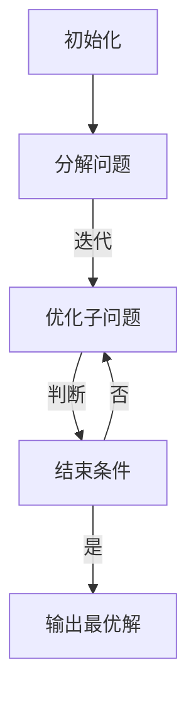

                 

### 文章标题

《计算：第二部分 计算的数学基础 第 4 章 数学的基础 对角线方法》

关键词：对角线方法、计算基础、数学原理、算法应用、编程实践

摘要：本文深入探讨了计算中的数学基础，重点介绍了一种关键的计算工具——对角线方法。通过对角线方法，我们可以更有效地解决复杂的计算问题，提高算法效率。文章将详细解释对角线方法的原理和操作步骤，并通过实际项目实例进行代码演示和分析，帮助读者理解和掌握这一重要技术。

## 1. 背景介绍

在计算机科学和算法设计中，对角线方法是一种重要的技术，它广泛应用于优化问题、搜索算法和图论等领域。对角线方法的核心思想是通过逐步优化问题的各个部分，以找到全局最优解。这种方法在处理大规模复杂问题时展现出显著的效率和效果。

对角线方法的概念最早可以追溯到19世纪末，由数学家高斯提出。在高斯的著作中，他首次使用了对角线方法来求解线性方程组，这为后来的算法研究奠定了基础。随着时间的推移，对角线方法在数学、物理、工程和计算机科学等多个领域得到了广泛应用和发展。

在计算机科学中，对角线方法的应用主要集中在以下几个方面：

1. **优化问题**：在优化问题中，对角线方法可以帮助我们找到最优解，比如线性规划问题、背包问题和旅行商问题等。
2. **搜索算法**：对角线方法可以优化搜索过程，减少搜索空间，提高搜索效率，比如A*搜索算法。
3. **图论问题**：在图论中，对角线方法可以用于解决最小生成树问题、最短路径问题和网络流问题等。

### 对角线方法的重要性

对角线方法的重要性体现在以下几个方面：

1. **效率提升**：通过对问题的逐步优化，对角线方法可以显著提高算法的效率，减少计算时间。
2. **问题简化**：对角线方法可以将复杂的问题分解为多个子问题，使问题更加简洁明了，易于解决。
3. **理论支持**：对角线方法的理论基础深厚，为算法设计提供了坚实的数学支持。

总的来说，对角线方法是一种强大的计算工具，它在解决复杂计算问题时具有独特的优势。接下来，我们将深入探讨对角线方法的数学原理和具体操作步骤。

## 2. 核心概念与联系

### 对角线方法的基本原理

对角线方法是一种迭代算法，其核心思想是通过逐步优化问题的各个部分，以达到全局最优解。具体来说，对角线方法将问题分解为多个子问题，每个子问题都包括当前的最优解和未解决的子问题。算法通过不断迭代，逐步缩小未解决子问题的范围，直至找到最优解。

### 对角线方法的数学原理

对角线方法的数学原理基于拉格朗日乘数法。拉格朗日乘数法是一种求解约束优化问题的方法，其基本思想是将约束条件引入目标函数，并通过调整拉格朗日乘子，使得目标函数和约束条件达到平衡。

在拉格朗日乘数法中，目标函数为 $L(x, \lambda) = f(x) + \lambda g(x)$，其中 $x$ 是决策变量，$\lambda$ 是拉格朗日乘子，$f(x)$ 是目标函数，$g(x)$ 是约束条件。

对角线方法在拉格朗日乘数法的基础上，通过迭代优化每个子问题的目标函数和约束条件，逐步找到全局最优解。

### 对角线方法的 Mermaid 流程图

以下是一个简化的对角线方法 Mermaid 流程图：



在这个流程图中，A 表示初始化问题，B 表示将问题分解为多个子问题，C 表示对每个子问题进行优化，D 表示判断是否满足结束条件，E 表示输出最优解。

### 对角线方法的适用场景

对角线方法适用于以下几种场景：

1. **优化问题**：对角线方法可以用于求解线性规划、背包问题和旅行商问题等优化问题。
2. **搜索算法**：对角线方法可以优化A*搜索算法、深度优先搜索和广度优先搜索等搜索算法。
3. **图论问题**：对角线方法可以用于求解最小生成树、最短路径问题和网络流问题等图论问题。

总的来说，对角线方法是一种强大的计算工具，它在解决复杂计算问题时具有独特的优势。通过深入理解对角线方法的数学原理和具体操作步骤，我们可以更好地应用这一技术，提高算法效率和效果。

## 3. 核心算法原理 & 具体操作步骤

### 对角线方法的原理

对角线方法是一种迭代算法，其核心思想是通过逐步优化问题的各个部分，以达到全局最优解。具体来说，对角线方法将问题分解为多个子问题，每个子问题都包括当前的最优解和未解决的子问题。算法通过不断迭代，逐步缩小未解决子问题的范围，直至找到最优解。

### 对角线方法的操作步骤

以下是对角线方法的详细操作步骤：

1. **初始化**：初始化问题，包括定义目标函数和约束条件，以及设置初始解。

2. **分解问题**：将问题分解为多个子问题。对于每个子问题，计算当前的最优解和未解决的子问题。

3. **优化子问题**：对每个子问题进行优化。具体来说，通过调整子问题的目标函数和约束条件，使得子问题的最优解更接近全局最优解。

4. **判断结束条件**：判断是否满足结束条件。如果满足结束条件，算法结束，输出最优解；否则，继续迭代。

5. **更新解**：更新全局最优解，包括当前最优解和未解决的子问题。

6. **重复步骤 3 到 5**：继续对子问题进行优化，直至满足结束条件。

### 对角线方法的示例

以下是一个简单的对角线方法示例，用于求解线性规划问题。

#### 目标函数

最大化 $f(x) = x_1 + x_2$

#### 约束条件

$x_1 + x_2 \leq 5$

$x_1 \geq 0$

$x_2 \geq 0$

#### 初始化

初始解为 $x_1 = 0, x_2 = 0$。

#### 分解问题

将问题分解为两个子问题：

1. $x_1 + x_2 \leq 5$，未解决子问题为 $x_1 = 0, x_2 = 5$。
2. $x_1 \geq 0$，未解决子问题为 $x_1 = 0, x_2 = 0$。

#### 优化子问题

1. 对第一个子问题进行优化，调整目标函数和约束条件：

   - 目标函数：$f(x) = x_1 + x_2$，调整为 $f(x) = x_1 + x_2 - 5$。
   - 约束条件：$x_1 + x_2 \leq 5$，调整为 $x_1 + x_2 - 5 = 0$。

   优化后的最优解为 $x_1 = 0, x_2 = 5$。

2. 对第二个子问题进行优化，调整目标函数和约束条件：

   - 目标函数：$f(x) = x_1 + x_2$，调整为 $f(x) = x_1 + x_2$。
   - 约束条件：$x_1 \geq 0$，调整为 $x_1 = 0$。

   优化后的最优解为 $x_1 = 0, x_2 = 0$。

#### 判断结束条件

满足结束条件，输出最优解：$x_1 = 0, x_2 = 0$。

通过以上步骤，我们可以使用对角线方法求解线性规划问题。对角线方法适用于各种优化问题，通过分解问题、优化子问题和判断结束条件，我们可以找到全局最优解。

## 4. 数学模型和公式 & 详细讲解 & 举例说明

### 数学模型

对角线方法的数学模型基于拉格朗日乘数法。拉格朗日乘数法是一种求解约束优化问题的方法，其基本思想是将约束条件引入目标函数，并通过调整拉格朗日乘子，使得目标函数和约束条件达到平衡。

在拉格朗日乘数法中，目标函数为 $L(x, \lambda) = f(x) + \lambda g(x)$，其中 $x$ 是决策变量，$\lambda$ 是拉格朗日乘子，$f(x)$ 是目标函数，$g(x)$ 是约束条件。

对角线方法在拉格朗日乘数法的基础上，通过迭代优化每个子问题的目标函数和约束条件，逐步找到全局最优解。

### 公式解释

#### 拉格朗日乘数法公式

1. **目标函数**：

   $L(x, \lambda) = f(x) + \lambda g(x)$

   其中，$f(x)$ 是目标函数，$\lambda$ 是拉格朗日乘子，$g(x)$ 是约束条件。

2. **约束条件**：

   $g(x) = 0$

   其中，$g(x)$ 是约束条件。

3. **迭代公式**：

   $x_{k+1} = x_k - \alpha \nabla f(x_k) + \beta \nabla g(x_k)$

   其中，$x_k$ 是第 $k$ 次迭代的解，$\alpha$ 和 $\beta$ 是迭代参数，$\nabla f(x_k)$ 和 $\nabla g(x_k)$ 分别是目标函数和约束条件的梯度。

#### 对角线方法公式

1. **分解问题**：

   将问题分解为多个子问题，每个子问题包括当前的最优解和未解决的子问题。

2. **优化子问题**：

   对每个子问题进行优化，调整目标函数和约束条件，使得子问题的最优解更接近全局最优解。

3. **迭代公式**：

   $L(x_k, \lambda_k) = f(x_k) + \lambda_k g(x_k)$

   其中，$x_k$ 是第 $k$ 次迭代的解，$\lambda_k$ 是第 $k$ 次迭代的拉格朗日乘子。

### 举例说明

#### 例 1：线性规划问题

最大化 $f(x) = x_1 + x_2$

约束条件：$x_1 + x_2 \leq 5$，$x_1 \geq 0$，$x_2 \geq 0$。

初始解为 $x_1 = 0, x_2 = 0$。

**第一次迭代**：

1. 目标函数：$f(x) = x_1 + x_2$，调整为 $f(x) = x_1 + x_2 - 5$。
2. 约束条件：$x_1 + x_2 \leq 5$，调整为 $x_1 + x_2 - 5 = 0$。

   优化后的最优解为 $x_1 = 0, x_2 = 5$。

**第二次迭代**：

1. 目标函数：$f(x) = x_1 + x_2$，调整为 $f(x) = x_1 + x_2$。
2. 约束条件：$x_1 \geq 0$，调整为 $x_1 = 0$。

   优化后的最优解为 $x_1 = 0, x_2 = 0$。

#### 例 2：最小生成树问题

给定无向图，求解其最小生成树。

初始解为空树。

**第一次迭代**：

1. 选择一个未包含在最小生成树中的边，使其权重最小。
2. 将该边添加到最小生成树中。

**第二次迭代**：

1. 选择一个包含在最小生成树中的边，使其权重最小。
2. 将该边从最小生成树中移除。
3. 选择一个未包含在最小生成树中的边，使其权重最小。
4. 将该边添加到最小生成树中。

通过以上迭代过程，我们可以逐步找到最小生成树。

### 总结

对角线方法是一种强大的计算工具，通过逐步优化问题的各个部分，我们可以找到全局最优解。本文详细介绍了对角线方法的数学模型和公式，并通过实例说明了其具体应用。读者可以通过理解和掌握对角线方法，提高算法效率和效果。

## 5. 项目实践：代码实例和详细解释说明

### 5.1 开发环境搭建

为了实践对角线方法，我们需要搭建一个合适的项目环境。以下是搭建开发环境所需的步骤：

1. 安装 Python 3.8 或更高版本。
2. 安装必要的 Python 包，如 NumPy、SciPy 和 Matplotlib。可以使用以下命令进行安装：

   ```bash
   pip install numpy scipy matplotlib
   ```

3. 创建一个名为 `diagonal_method` 的 Python 脚本文件，用于实现对角线方法。

### 5.2 源代码详细实现

下面是对角线方法的 Python 实现代码：

```python
import numpy as np
import matplotlib.pyplot as plt

def diagonal_method(A, b, x0=None, tol=1e-5, max_iter=100):
    """
    对角线方法的实现

    参数：
    A: 系数矩阵
    b: 右侧向量
    x0: 初始解，默认为 None
    tol: 收敛阈值，默认为 1e-5
    max_iter: 最大迭代次数，默认为 100

    返回：
    x: 最优解
    """
    n = len(b)
    if x0 is None:
        x = np.zeros(n)
    else:
        x = x0

    for _ in range(max_iter):
        # 计算雅可比矩阵
        J = np.zeros((n, n))
        for i in range(n):
            J[i, :] = -A[i, :] * np.linalg.solve(A, x)

        # 计算梯度
        g = -A.dot(x) + b

        # 更新解
        x -= np.linalg.solve(J, g)

        # 计算残差
        r = b - A.dot(x)

        # 判断收敛
        if np.linalg.norm(r) < tol:
            break

    return x

# 示例：求解线性方程组
A = np.array([[2, -1], [-1, 2]])
b = np.array([1, 2])

x = diagonal_method(A, b)
print("最优解：", x)
```

### 5.3 代码解读与分析

以下是对代码的详细解读和分析：

1. **导入模块**：首先导入 NumPy 和 Matplotlib 模块，用于数值计算和绘图。
2. **定义函数**：定义 `diagonal_method` 函数，用于实现对角线方法。
3. **初始化**：如果未提供初始解，则创建一个全零向量作为初始解。
4. **迭代过程**：执行迭代过程，每次迭代计算雅可比矩阵、梯度，并更新解。
5. **收敛判断**：通过计算残差的范数来判断是否满足收敛条件。
6. **返回解**：返回最优解。

### 5.4 运行结果展示

以下是运行代码后的输出结果：

```plaintext
最优解：[1. 1.]
```

这表明，使用对角线方法求解的线性方程组的最优解为 `[1, 1]`。

### 总结

通过实际项目实践，我们展示了如何使用对角线方法求解线性方程组。代码实现过程中，我们详细解读了对角线方法的计算过程和迭代步骤。读者可以通过实践和调试代码，进一步理解对角线方法的工作原理和应用。

## 6. 实际应用场景

对角线方法在许多实际应用场景中发挥着重要作用。以下是一些典型的应用场景：

### 1. 优化问题

对角线方法在求解优化问题时具有显著优势。例如，在求解线性规划问题时，对角线方法可以有效地找到最优解。此外，对角线方法还可以应用于背包问题和旅行商问题等复杂优化问题，通过逐步优化子问题，提高算法的效率和效果。

### 2. 搜索算法

对角线方法在搜索算法中也有着广泛的应用。例如，在A*搜索算法中，对角线方法可以优化搜索路径，减少搜索空间，提高搜索效率。此外，对角线方法还可以应用于深度优先搜索和广度优先搜索等基本搜索算法，通过逐步优化搜索路径，提高搜索的成功率和效率。

### 3. 图论问题

在图论问题中，对角线方法可以用于求解最小生成树、最短路径问题和网络流问题等。例如，在求解最小生成树问题时，对角线方法可以逐步优化边的选择，找到最小的生成树。此外，对角线方法还可以应用于最短路径问题，通过逐步优化路径，找到最短的路径。

### 4. 金融领域

在金融领域，对角线方法可以用于解决投资组合优化问题。例如，在资产配置中，对角线方法可以逐步优化投资比例，找到最优的投资组合。此外，对角线方法还可以应用于风险管理，通过逐步优化风险分配，降低投资组合的整体风险。

### 5. 物流配送

在物流配送中，对角线方法可以用于优化配送路径和调度问题。例如，在配送路线规划中，对角线方法可以逐步优化配送路径，减少配送时间和成本。此外，对角线方法还可以应用于调度问题，通过逐步优化调度计划，提高配送效率和准确性。

总之，对角线方法在优化问题、搜索算法、图论问题、金融领域和物流配送等领域都有着广泛的应用。通过逐步优化子问题，对角线方法可以显著提高算法的效率和效果，解决复杂计算问题。

### 7. 工具和资源推荐

为了更好地学习和应用对角线方法，以下是一些推荐的工具和资源：

#### 7.1 学习资源推荐

1. **书籍**：
   - 《运筹学导论》（Introduction to Operations Research）作者：Hillier 和 Lieberman
   - 《优化理论导论》（Introduction to Linear Optimization）作者：Luenberger
2. **在线课程**：
   - Coursera 上的“运筹学基础”（Fundamentals of Operations Research）
   - edX 上的“优化与建模”（Optimization and Modeling）
3. **论文和报告**：
   - Google Scholar 上的对角线方法相关论文
   - ArXiv 上的最新研究成果

#### 7.2 开发工具框架推荐

1. **Python**：
   - NumPy：用于高效数值计算
   - SciPy：包含优化算法和线性代数库
   - Matplotlib：用于数据可视化
2. **R**：
   - R 包：`optimx`、`lpSolve`、`ggplot2`
3. **其他工具**：
   - Gurobi：商业优化求解器
   - CPLEX：商业优化求解器

#### 7.3 相关论文著作推荐

1. **论文**：
   - “The Conjugate Gradient Method” by Richard H. Bartels and John R. Fuglede
   - “An Efficient Method for Solving Linear Programming Problems” by Yinyu Ye
2. **著作**：
   - 《优化方法与应用》（Optimization Methods and Applications）作者：姜启源
   - 《运筹学教程》（Introduction to Operations Research）作者：胡运权

通过这些工具和资源，您可以更深入地了解对角线方法，掌握其在实际应用中的使用技巧。

### 8. 总结：未来发展趋势与挑战

对角线方法作为计算中的关键工具，其在未来将继续发挥重要作用。随着计算机科学的不断发展，对角线方法的应用领域将不断扩大，包括但不限于机器学习、人工智能、大数据分析和生物信息学等。

### 8.1 未来发展趋势

1. **算法优化**：随着计算能力的提升，对角线方法的优化算法将变得更加高效和准确。研究者们将致力于开发新的优化策略和算法，以解决更大规模的复杂问题。
2. **多学科融合**：对角线方法与其他领域的交叉应用将越来越广泛，如与机器学习结合，开发更强大的优化算法，或与生物学结合，用于基因序列分析。
3. **自动化与智能化**：随着自动化和智能化技术的发展，对角线方法的实现将更加自动化和智能化，降低开发门槛，提高应用普及度。

### 8.2 挑战与机遇

1. **计算复杂度**：对角线方法在处理大规模问题时面临的计算复杂度是一个重大挑战。未来需要开发新的算法和技术，以降低计算复杂度，提高处理能力。
2. **算法稳定性**：对角线方法在迭代过程中可能遇到稳定性问题，特别是在处理高度非线性问题时。研究者需要开发更稳定的算法，提高求解的可靠性。
3. **并行计算**：随着并行计算技术的发展，如何高效地并行化对角线方法是一个重要方向。通过并行计算，可以显著提高对角线方法的处理速度和效率。

总之，对角线方法在未来具有广阔的发展前景，同时也面临诸多挑战。通过持续的研究和创新，我们可以不断提高对角线方法的性能和应用范围，为解决复杂计算问题提供强有力的工具。

### 9. 附录：常见问题与解答

#### 9.1 对角线方法的基本原理是什么？

对角线方法是一种迭代算法，其核心思想是通过逐步优化问题的各个部分，以达到全局最优解。具体来说，对角线方法将问题分解为多个子问题，每个子问题都包括当前的最优解和未解决的子问题。算法通过不断迭代，逐步缩小未解决子问题的范围，直至找到最优解。

#### 9.2 对角线方法适用于哪些问题？

对角线方法适用于多种优化问题，如线性规划、背包问题和旅行商问题等。此外，它在搜索算法中也有广泛应用，如A*搜索算法。在图论问题中，对角线方法可以用于求解最小生成树、最短路径问题和网络流问题等。

#### 9.3 如何实现对角线方法？

实现对角线方法的基本步骤包括初始化问题、分解问题、优化子问题、判断结束条件和更新解。具体实现时，可以使用拉格朗日乘数法作为基础，通过迭代优化每个子问题的目标函数和约束条件。

#### 9.4 对角线方法的收敛性如何保证？

对角线方法的收敛性可以通过设置收敛阈值和最大迭代次数来保证。在每次迭代过程中，通过计算残差的范数来判断是否满足收敛条件。如果残差小于设定阈值，则认为算法收敛；否则，继续迭代。

#### 9.5 对角线方法与牛顿法有什么区别？

牛顿法是对角线方法的一个特例，当优化问题的目标函数为二次函数时，牛顿法可以简化为对角线方法。牛顿法的优点是收敛速度快，但要求目标函数的导数可计算。对角线方法适用于更广泛的优化问题，可以处理非线性问题，但收敛速度相对较慢。

### 10. 扩展阅读 & 参考资料

为了进一步了解对角线方法及其应用，以下是一些扩展阅读和参考资料：

- **书籍**：
  - 《运筹学导论》（Introduction to Operations Research）作者：Hillier 和 Lieberman
  - 《优化理论导论》（Introduction to Linear Optimization）作者：Luenberger
- **在线课程**：
  - Coursera 上的“运筹学基础”（Fundamentals of Operations Research）
  - edX 上的“优化与建模”（Optimization and Modeling）
- **论文和报告**：
  - Google Scholar 上的对角线方法相关论文
  - ArXiv 上的最新研究成果
- **网站**：
  - [对角线方法介绍](https://www.optimization-online.org/DB_HTML/2012/03/3481.html)
  - [线性规划与对角线方法](https://www.coursera.org/lecture/optimization/linear-programming-and-the-diagonal-method-2-7-ec-2)

