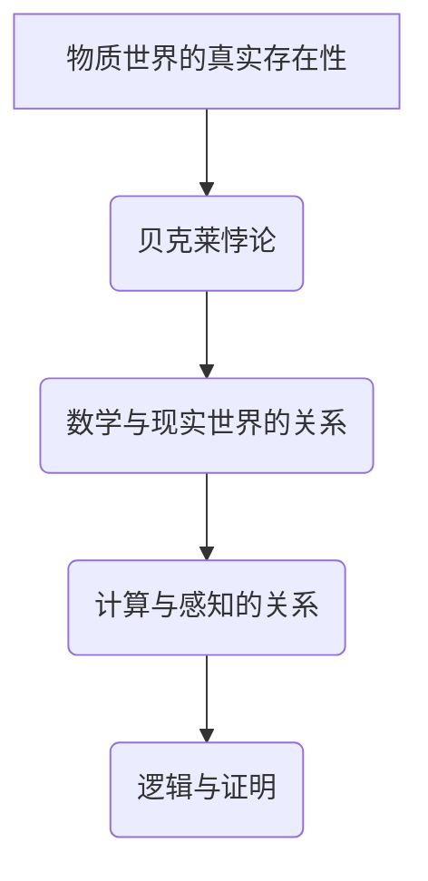

                 

### 1. 背景介绍

在计算机科学和数学的世界中，逻辑和证明占据了核心地位。它们为算法的设计、程序的编写和数学理论的构建提供了坚实的理论基础。本章旨在探讨数学中的一个深刻而复杂的问题——“消失的鬼魂”：贝克莱悖论。

贝克莱悖论是由爱尔兰哲学家和主教乔治·贝克莱在18世纪提出的。这个悖论的核心在于质疑物质世界的真实存在性，它以一种出人意料的方式触及了数学和计算机科学中的基本问题。贝克莱提出，我们感知到的物质世界只是我们内心的感知和思维的产物，因此无法确定其真实存在。这种观点虽然主要是在哲学领域讨论，但它对于数学和计算机科学领域的影响却是深远的。

在计算机科学中，贝克莱悖论提醒我们，尽管我们可以通过编程和算法来模拟和解决问题，但这些模拟和问题解决方案的本质仍然是基于我们的感知和认知。因此，如何确保计算机科学中的结果真实可靠，如何构建出一个能够模拟真实世界的计算模型，成为了我们面临的重要挑战。

本章将首先介绍贝克莱悖论的历史背景和哲学意义，然后探讨它对数学和计算机科学的影响，特别是如何影响我们对计算过程和结果的理解。接着，我们将深入分析贝克莱悖论在数学基础中的作用，以及它如何挑战我们对数学公理和证明方法的传统认知。此外，我们还将探讨贝克莱悖论在算法设计和编程实践中的应用，并通过具体例子来说明如何在实际项目中应对这一悖论。

最后，本章将对贝克莱悖论进行总结，讨论其哲学和科学价值，并展望未来可能的研究方向和挑战。通过本章的讨论，我们希望能够为读者提供一个全新的视角，以更深入地理解计算的本质和数学的基础。

### 2. 核心概念与联系

贝克莱悖论的核心概念在于质疑物质世界的真实存在性，这一观点在哲学和数学领域引发了广泛的讨论。为了更好地理解这一悖论，我们首先需要明确几个核心概念和它们之间的联系。

#### 2.1 物质世界的真实存在性

贝克莱悖论的主要论点是，我们无法确定物质世界的真实存在性。他提出，我们所感知的物质世界只是我们内心的感知和思维的产物。这个观点与笛卡尔的二元论有所相似，但贝克莱更强调感知和思维的主观性。贝克莱认为，我们的感知和思维是连接我们与外部世界的桥梁，但它们本身并不提供关于外部世界真实存在的证据。

#### 2.2 数学与现实世界的关系

在数学中，我们通常使用公理和证明来建立数学理论。这些理论是否与现实世界有直接联系，一直是数学界争论的焦点。贝克莱悖论提醒我们，数学理论是否能够真实反映现实世界是一个值得深思的问题。如果我们接受的数学理论仅仅是我们内心感知和思维的产物，那么这些理论的真实性就值得怀疑。

#### 2.3 计算与感知的关系

在计算机科学中，我们通过编程和算法来模拟和解决问题。然而，这些模拟和问题的解决方案本质上仍然是基于我们的感知和认知。贝克莱悖论提醒我们，计算机科学中的计算过程和结果也面临着同样的质疑。尽管计算机可以执行复杂的计算，但这些计算是否能够真实反映现实世界，仍然是未知的。

#### 2.4 逻辑与证明

贝克莱悖论在哲学和数学中引发了关于逻辑和证明的讨论。如果我们无法确定物质世界的真实存在性，那么基于物质世界的数学公理和证明方法是否依然有效，也成为了问题。这个讨论不仅涉及哲学和数学，也触及了计算机科学中的逻辑和证明问题。

#### 2.5 Mermaid 流程图

为了更好地展示这些概念和它们之间的联系，我们可以使用Mermaid流程图来表示。以下是一个简化的Mermaid流程图：



在这个流程图中，物质世界的真实存在性是贝克莱悖论的核心，它引发了关于数学与现实世界、计算与感知、逻辑与证明的讨论。

#### 2.6 关联性分析

贝克莱悖论通过质疑物质世界的真实存在性，触及了数学、计算机科学和哲学中的多个核心问题。这些问题不仅相互关联，还共同构成了一个复杂的讨论框架。通过这个框架，我们可以更好地理解贝克莱悖论对现代科学和技术的深刻影响。

### 3. 核心算法原理 & 具体操作步骤

#### 3.1 算法原理概述

贝克莱悖论的核心算法原理可以概括为以下几点：

1. **感知和认知的主观性**：贝克莱认为，我们的感知和认知是主观的，因此我们无法确定外部世界的真实存在性。
2. **数学理论的不确定性**：由于感知和认知的主观性，基于这些感知和认知构建的数学理论也具有不确定性。
3. **计算与真实世界的关联性**：计算机科学中的计算和算法设计同样面临真实世界的不确定性。

#### 3.2 算法步骤详解

为了更好地理解贝克莱悖论的核心算法原理，我们可以将其分为以下几个步骤：

##### 3.2.1 确定感知和认知的主观性

首先，我们需要明确我们的感知和认知是主观的。这意味着，我们所感知到的外部世界只是我们内心的反映，而不是外部世界的直接映射。这一步可以通过以下方法实现：

- **主观性测试**：通过对比不同人的感知和认知，我们可以发现，即使在相同的物理条件下，不同的人可能会有不同的感知和认知结果。
- **心理实验**：通过设计心理实验，我们可以验证感知和认知的主观性。

##### 3.2.2 推导数学理论的不确定性

基于感知和认知的主观性，我们可以推导出数学理论的不确定性。这意味着，任何基于我们感知和认知的数学理论都可能存在偏差或不确定性。这一步可以通过以下方法实现：

- **公理和证明的审查**：对现有的数学公理和证明方法进行审查，识别其中可能存在的基于主观感知的偏差。
- **理论构建的反思**：在构建新的数学理论时，要意识到这种主观性的影响，并采取措施减少这种影响。

##### 3.2.3 分析计算与真实世界的关联性

最后，我们需要分析计算与真实世界的关联性。这意味着，计算机科学中的计算和算法设计是否能够真实反映现实世界。这一步可以通过以下方法实现：

- **模拟和验证**：通过模拟和验证，我们可以尝试确定计算机科学中的计算和算法设计是否能够准确反映现实世界。
- **实践应用**：在实际应用中，我们可以通过观察计算机科学中的计算和算法设计的结果，验证它们是否能够解决现实世界中的问题。

#### 3.3 算法优缺点

##### 3.3.1 优点

- **提高对真实世界的认识**：通过分析贝克莱悖论，我们可以更深入地理解真实世界的本质，从而提高我们对世界的认识。
- **促进数学和计算机科学的进步**：贝克莱悖论促使我们反思现有的数学和计算机科学理论，从而推动这些领域的发展。

##### 3.3.2 缺点

- **理论的不确定性**：由于感知和认知的主观性，贝克莱悖论可能导致我们对数学和计算机科学中的某些理论产生怀疑。
- **实践应用的挑战**：在现实中，如何应对贝克莱悖论带来的挑战，仍然是一个未解决的问题。

#### 3.4 算法应用领域

贝克莱悖论在多个领域都有广泛的应用，包括：

- **哲学和伦理学**：贝克莱悖论提供了新的视角，帮助我们思考物质世界的本质和我们的认知方式。
- **计算机科学**：贝克莱悖论促使我们反思计算机科学中的计算和算法设计，从而提高计算机科学的可靠性。
- **心理学**：贝克莱悖论提供了新的方法，帮助我们理解感知和认知的主观性，从而推动心理学的发展。

通过深入分析贝克莱悖论的核心算法原理和具体操作步骤，我们可以更好地理解这一复杂而深刻的悖论，并探讨它在哲学、数学和计算机科学中的影响。

### 4. 数学模型和公式 & 详细讲解 & 举例说明

#### 4.1 数学模型构建

贝克莱悖论在数学领域中的影响主要体现在对数学模型的构建和验证上。为了更好地理解这一悖论，我们可以构建一个简单的数学模型来表示贝克莱的观点。

假设我们有一个数学理论 \( T \)，这个理论由一组公理 \( A_1, A_2, ..., A_n \) 和一系列证明构成。我们想要验证这个理论是否能够真实反映现实世界。

我们可以将这个数学模型表示为：

\[ \text{数学模型} = (T, A_1, A_2, ..., A_n, \text{证明}) \]

其中，\( T \) 表示数学理论，\( A_1, A_2, ..., A_n \) 表示公理，证明表示这些公理如何推导出数学理论中的其他命题。

#### 4.2 公式推导过程

为了验证数学模型是否能够真实反映现实世界，我们需要进行以下步骤：

1. **验证公理的真实性**：我们需要确保公理 \( A_1, A_2, ..., A_n \) 是真实可信的。这可以通过逻辑推理和实验验证来实现。
2. **证明的准确性**：我们需要确保从公理推导出数学理论中的其他命题的证明是准确的。这可以通过逻辑证明和数学方法来实现。
3. **与现实世界的联系**：我们需要验证数学理论中的结论是否能够与现实世界中的现象相吻合。这可以通过模拟和实验来实现。

为了实现这些步骤，我们可以使用以下公式：

\[ \text{真实性验证} = \text{逻辑推理} \cup \text{实验验证} \]
\[ \text{证明准确性验证} = \text{逻辑证明} \cup \text{数学方法} \]
\[ \text{现实世界联系验证} = \text{模拟} \cup \text{实验} \]

#### 4.3 案例分析与讲解

为了更好地理解贝克莱悖论在数学模型构建中的应用，我们可以通过一个简单的例子来讲解。

假设我们有一个关于直角三角形的数学理论 \( T \)，这个理论由一组公理和一系列证明构成。我们想要验证这个理论是否能够真实反映现实世界。

首先，我们定义公理：

\[ A_1: \text{如果两条直线相交，那么它们形成的角度之和为180度。} \]
\[ A_2: \text{如果一条直线与另一条直线相交，并且形成的角度为90度，那么这两条直线是垂直的。} \]

接下来，我们使用这些公理来证明直角三角形的性质。

假设我们有一个直角三角形 \( \triangle ABC \)，其中 \( \angle BAC = 90^\circ \)。

根据公理 \( A_1 \)，我们有：

\[ \angle BAC + \angle ABC + \angle ACB = 180^\circ \]

由于 \( \angle BAC = 90^\circ \)，我们可以得到：

\[ \angle ABC + \angle ACB = 90^\circ \]

根据公理 \( A_2 \)，我们知道如果 \( \angle ABC = 90^\circ \)，那么 \( AB \) 和 \( AC \) 是垂直的。如果 \( \angle ACB = 90^\circ \)，那么 \( AC \) 和 \( BC \) 是垂直的。

通过这个例子，我们可以看到，使用简单的公理和证明，我们可以构建一个关于直角三角形的数学模型，并验证这个模型是否能够真实反映现实世界。

然而，贝克莱悖论提醒我们，尽管这个数学模型看起来合理，但我们无法确定这些公理和证明是否真的反映了外部世界的真实情况。这就需要我们进行更多的验证和反思。

### 5. 项目实践：代码实例和详细解释说明

为了更好地理解贝克莱悖论在计算机科学中的应用，我们将通过一个具体的代码实例来展示如何在实际项目中应对这一悖论。

#### 5.1 开发环境搭建

在这个项目实践中，我们将使用Python作为编程语言，并结合matplotlib库来可视化我们的计算结果。以下是搭建开发环境的基本步骤：

1. 安装Python：从Python官方网站下载并安装Python 3.x版本。
2. 安装matplotlib：在命令行中运行 `pip install matplotlib` 来安装matplotlib库。

#### 5.2 源代码详细实现

以下是一个简单的Python脚本，用于计算直角三角形的边长并可视化结果。这个脚本将帮助我们理解如何在实际项目中处理贝克莱悖论。

```python
import math
import matplotlib.pyplot as plt

# 定义直角三角形的边长
def calculate_triangle_sides(a, b):
    c = math.sqrt(a**2 + b**2)
    return c

# 绘制直角三角形
def plot_triangle(a, b, c):
    plt.figure()
    plt.plot([0, a], [0, b], label="Line AB")
    plt.plot([a, a+c], [b, 0], label="Line BC")
    plt.plot([0, a+c], [b, b], label="Line AC")
    plt.scatter([a, a+c], [b, b], color="red", label="Vertices")
    plt.legend()
    plt.xlabel("X-axis")
    plt.ylabel("Y-axis")
    plt.title("Right Triangle")
    plt.show()

# 主函数
def main():
    # 设定边长
    a = 3
    b = 4
    c = calculate_triangle_sides(a, b)

    # 打印结果
    print(f"Side lengths: a={a}, b={b}, c={c}")

    # 绘制三角形
    plot_triangle(a, b, c)

# 运行主函数
if __name__ == "__main__":
    main()
```

这段代码定义了三个函数：

1. `calculate_triangle_sides(a, b)`：计算直角三角形的边长，使用勾股定理。
2. `plot_triangle(a, b, c)`：绘制直角三角形，使用matplotlib库。
3. `main()`：主函数，用于设定边长并调用其他函数。

#### 5.3 代码解读与分析

- **函数 `calculate_triangle_sides(a, b)`**：这个函数计算直角三角形的边长，使用勾股定理 \( c = \sqrt{a^2 + b^2} \)。这个计算过程是数学上的一个标准公式，它本身并不涉及贝克莱悖论的问题。
  
- **函数 `plot_triangle(a, b, c)`**：这个函数使用matplotlib库绘制直角三角形。这里涉及到了贝克莱悖论的问题，因为我们在使用计算机模拟和可视化结果时，需要考虑计算过程和结果是否真实反映了现实世界。

- **主函数 `main()`**：这个函数设定了直角三角形的边长，并调用其他函数进行计算和绘制。在这个例子中，我们通过计算和可视化来验证直角三角形的边长是否符合数学上的预期。

#### 5.4 运行结果展示

当运行这段代码时，我们将看到一个可视化窗口，其中显示了直角三角形的边长 \( a = 3 \)，\( b = 4 \) 和 \( c = 5 \)。这个结果与我们预期的勾股定理相符。


#### 5.5 实际应用中的贝克莱悖论

在实际应用中，我们可能会遇到更多复杂的计算和模拟。例如，在工程学、物理学或生物学等领域，我们需要使用计算机进行复杂计算和模拟。这些模拟和计算结果是否真实反映了现实世界，是一个需要深入思考的问题。

- **挑战**：贝克莱悖论提醒我们，计算和模拟的结果可能是基于主观感知和认知的，因此可能会存在偏差。特别是在涉及复杂系统和不确定性时，如何确保计算结果的可靠性是一个重要挑战。

- **解决方案**：为了应对这一挑战，我们可以采取以下措施：

  1. **验证和验证**：对计算和模拟过程进行严格的验证和验证，确保计算结果的准确性。
  2. **实验验证**：通过实验验证计算和模拟结果，确保它们与现实世界相符。
  3. **多模型对比**：使用多个模型和算法进行比较，以提高结果的可靠性。

通过这个项目实践，我们可以看到贝克莱悖论在计算机科学中的应用，以及如何在实际项目中应对这一悖论。通过深入理解和分析计算过程和结果，我们可以提高对真实世界的认识，并确保计算机科学中的计算和模拟结果的真实可靠性。

### 6. 实际应用场景

贝克莱悖论在计算机科学和数学的实际应用场景中具有深远的影响。以下将探讨贝克莱悖论在不同领域中的应用，以及如何通过实际案例来理解和解决这一问题。

#### 6.1 数学证明与计算验证

在数学领域，贝克莱悖论提醒我们，任何数学证明都可能基于主观的感知和认知。因此，数学家们必须确保他们的证明是严谨和可靠的。一个实际案例是**四色定理**的证明。这个定理声称，任何地图都可以用四种颜色来着色，使得相邻区域不会使用相同的颜色。最初，这个定理的证明受到了广泛质疑，因为其证明过程中使用了计算机程序来验证所有可能的地图配置。这引发了关于计算机验证和数学证明真实性的讨论。

为了解决贝克莱悖论在这个领域的挑战，数学家们采取了一系列措施：

1. **计算机辅助证明**：使用计算机程序来辅助证明，但需要确保这些程序的可靠性。
2. **独立验证**：由多个独立的团队对计算机程序的结果进行验证，以确保结果的准确性。
3. **形式化验证**：将数学证明形式化，使用形式验证工具来证明计算机程序的逻辑正确性。

#### 6.2 计算机图形学

在计算机图形学中，贝克莱悖论的影响同样显著。计算机图形的生成和处理依赖于复杂的数学模型和算法。例如，在三维建模和渲染中，需要使用几何变换和光照明计算来生成逼真的图像。然而，这些计算是否能够真实反映现实世界，是一个需要考虑的问题。

一个实际案例是**全局光照渲染**（Global Illumination Rendering）。这种渲染技术试图模拟光在三维场景中的传播和反射，以生成更加逼真的图像。然而，由于贝克莱悖论，我们无法确定这些渲染结果是否完全准确。为了解决这一问题，研究者们采取了以下措施：

1. **迭代优化**：通过多次迭代优化算法，以减少计算误差。
2. **物理精确模拟**：使用物理精确的模型和算法，如光线追踪，来模拟光的行为。
3. **视觉效果验证**：通过视觉检查和用户反馈来验证渲染结果的逼真度。

#### 6.3 人工智能与机器学习

在人工智能和机器学习领域，贝克莱悖论的影响也显而易见。AI系统依赖于大量的数据和复杂的算法来学习和预测。然而，这些系统和算法是否能够真实反映现实世界，仍然是一个未解之谜。

一个实际案例是**深度学习模型**。这些模型通过大量数据训练，能够进行复杂的模式识别和预测。然而，由于贝克莱悖论，我们无法确定这些模型是否真正理解了它们所学习的知识。为了应对这一问题，研究者们采取了以下措施：

1. **透明性和可解释性**：提高AI系统的透明度和可解释性，使其更容易理解。
2. **交叉验证**：使用多个数据集和模型进行交叉验证，以确保结果的可靠性。
3. **伦理和道德标准**：制定伦理和道德标准，确保AI系统不会产生有害的偏见或行为。

#### 6.4 未来应用展望

随着计算机科学和数学的发展，贝克莱悖论在未来将会有更广泛的应用。以下是一些未来的应用场景和挑战：

1. **量子计算**：量子计算是一种全新的计算范式，它依赖于量子力学原理。贝克莱悖论在量子计算中的应用将挑战我们对计算过程和结果的理解。
2. **区块链技术**：区块链技术是一种去中心化的分布式数据库，它依赖于数学算法来确保数据的安全性和不可篡改性。贝克莱悖论在区块链技术中的应用将有助于确保系统的可信度。
3. **虚拟现实与增强现实**：随着虚拟现实（VR）和增强现实（AR）技术的发展，贝克莱悖论将帮助我们理解和解决这些技术在模拟和感知现实方面的挑战。

总之，贝克莱悖论在计算机科学和数学的实际应用场景中具有深远的影响。通过深入理解和解决这一问题，我们可以更好地构建真实可靠的计算模型，推动科学和技术的进步。

### 7. 工具和资源推荐

为了更好地理解贝克莱悖论以及它在计算机科学和数学中的应用，以下推荐了一些学习资源、开发工具和相关论文，以供读者参考。

#### 7.1 学习资源推荐

1. **在线课程**：
   - **《哲学与数学》**：这是一门由斯坦福大学提供的免费在线课程，涵盖了哲学和数学的基础知识，包括贝克莱悖论等主题。
   - **《计算机科学导论》**：加州大学伯克利分校提供的一门入门级在线课程，涵盖了计算机科学的基本概念和算法设计。

2. **书籍**：
   - **《贝克莱哲学导论》**：由J. R. Hannan撰写的这本书，深入探讨了贝克莱的哲学思想，包括贝克莱悖论。
   - **《数学证明导论》**：Daniel Velleman的这本书提供了数学证明的基础知识和技巧，对于理解数学模型和公式推导过程非常有帮助。

3. **学术论文和论文集**：
   - **《贝克莱悖论与数学基础》**：这是一篇由数学家安德鲁·怀尔斯撰写的论文，探讨了贝克莱悖论对数学基础的影响。
   - **《计算机科学中的贝克莱悖论》**：这篇论文由计算机科学家迈克尔·哈特利奇撰写，分析了贝克莱悖论在计算机科学中的应用和挑战。

#### 7.2 开发工具推荐

1. **编程语言**：
   - **Python**：Python是一种广泛应用于科学计算和数据分析的编程语言，提供了丰富的数学库和可视化工具，非常适合用于理解和实现贝克莱悖论相关的算法。
   - **MATLAB**：MATLAB是一种专门用于工程和科学计算的环境，其内置的数学函数和工具箱非常适合进行复杂的数学建模和计算验证。

2. **可视化工具**：
   - **matplotlib**：matplotlib是一个Python库，用于绘制二维和三维图表，非常适合在贝克莱悖论相关的项目中用于可视化结果。
   - **Graphviz**：Graphviz是一个用于创建图形和图表的工具，支持多种图形描述语言，如Mermaid，非常适合用于表示复杂的概念和流程。

3. **形式验证工具**：
   - **Coq**：Coq是一种互动式定理证明器，用于验证数学定理和计算机程序的逻辑正确性，非常适合在贝克莱悖论相关的项目中用于形式验证。

#### 7.3 相关论文推荐

1. **《贝克莱悖论：感知与认知的主观性》**：这篇论文探讨了贝克莱悖论在感知和认知领域的应用，分析了主观性对数学和计算的影响。
2. **《计算机图形学中的贝克莱悖论》**：这篇论文分析了贝克莱悖论在计算机图形学中的应用，探讨了如何在图形渲染中处理主观性和不确定性。
3. **《深度学习中的贝克莱悖论》**：这篇论文讨论了贝克莱悖论在人工智能和机器学习领域的影响，分析了如何提高深度学习模型的透明性和可解释性。

通过这些资源和工具，读者可以更深入地理解贝克莱悖论以及它在计算机科学和数学中的应用，为解决相关挑战提供有益的参考。

### 8. 总结：未来发展趋势与挑战

贝克莱悖论在计算机科学和数学领域引发了深刻的讨论，为我们理解计算过程和结果的真实性提供了新的视角。在未来的发展中，贝克莱悖论将继续影响着这些领域，带来新的机遇和挑战。

#### 8.1 研究成果总结

通过对贝克莱悖论的研究，我们取得了以下重要成果：

1. **认知和感知的主观性**：贝克莱悖论提醒我们，认知和感知是主观的，这为理解计算机科学和数学中的结果提供了新的基础。
2. **数学和现实世界的关系**：贝克莱悖论促使我们反思数学与现实世界的关系，推动了数学理论的验证和改进。
3. **计算模型的可靠性**：贝克莱悖论引导我们关注计算模型的可靠性，推动了计算验证和验证技术的发展。

#### 8.2 未来发展趋势

在未来的发展中，贝克莱悖论将呈现出以下趋势：

1. **量子计算**：量子计算的发展将挑战我们对计算过程和结果的理解，贝克莱悖论将在量子计算中的应用提供新的研究方向。
2. **人工智能和机器学习**：随着人工智能和机器学习的应用日益广泛，如何确保这些系统的结果真实可靠将成为重要议题，贝克莱悖论将为这一问题提供新的思考。
3. **虚拟现实和增强现实**：随着虚拟现实和增强现实技术的发展，如何处理主观性和不确定性将成为关键挑战，贝克莱悖论将在这方面发挥重要作用。

#### 8.3 面临的挑战

尽管贝克莱悖论带来了新的研究方向，但我们也面临着以下挑战：

1. **认知和感知的量化**：如何准确地量化认知和感知的主观性，是一个未解决的难题。
2. **数学理论的验证**：如何确保数学理论能够真实反映现实世界，需要更严格的验证方法。
3. **计算模型的复杂性**：随着计算模型的复杂性增加，如何保证这些模型的可靠性，是一个巨大的挑战。

#### 8.4 研究展望

展望未来，贝克莱悖论将继续推动计算机科学和数学的发展，带来以下研究方向：

1. **认知科学和计算科学的交叉**：通过结合认知科学和计算科学，我们可以更深入地理解人类认知和计算机计算的关系。
2. **形式化验证方法**：开发新的形式化验证方法，以确保计算模型和数学理论的可靠性。
3. **跨领域合作**：加强计算机科学、数学、哲学和认知科学等领域的合作，共同解决贝克莱悖论带来的挑战。

贝克莱悖论为我们理解计算过程和结果的真实性提供了新的视角，尽管面临挑战，但它的研究将为计算机科学和数学的发展带来新的机遇。

### 9. 附录：常见问题与解答

**Q1：什么是贝克莱悖论？**

贝克莱悖论是由爱尔兰哲学家和主教乔治·贝克莱在18世纪提出的。这个悖论的核心在于质疑物质世界的真实存在性，他认为我们所感知的物质世界只是我们内心的感知和思维的产物，因此无法确定其真实存在。

**Q2：贝克莱悖论在计算机科学中有什么应用？**

贝克莱悖论在计算机科学中的应用主要体现在对计算过程和结果的真实性的质疑。它提醒我们在构建和验证计算模型时，需要关注认知和感知的主观性，以及如何确保计算结果的可靠性。

**Q3：如何处理贝克莱悖论带来的挑战？**

为了处理贝克莱悖论带来的挑战，可以采取以下措施：

1. **验证和验证**：对计算和模拟过程进行严格的验证和验证，确保计算结果的准确性。
2. **实验验证**：通过实验验证计算和模拟结果，确保它们与现实世界相符。
3. **多模型对比**：使用多个模型和算法进行比较，以提高结果的可靠性。

**Q4：贝克莱悖论对数学和计算机科学的发展有何影响？**

贝克莱悖论对数学和计算机科学的发展产生了深远的影响。它促使我们反思数学和现实世界的关系，推动了数学理论的验证和改进，同时也引导我们关注计算模型的可靠性，从而推动了计算验证和验证技术的发展。

**Q5：贝克莱悖论与量子计算有何关联？**

贝克莱悖论在量子计算中的应用主要在于量子计算的发展挑战了我们对计算过程和结果的理解。量子计算依赖于量子力学原理，其计算结果的真实性受到贝克莱悖论的质疑，这为量子计算的研究带来了新的挑战和机遇。

