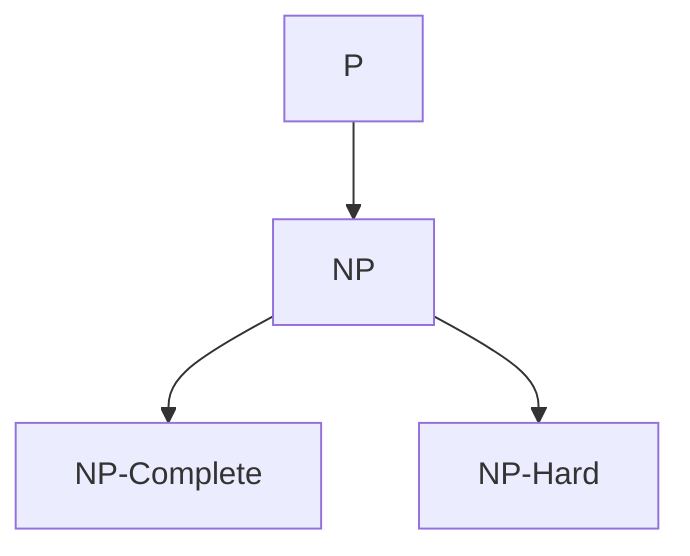

                 

### 文章标题

计算：第四部分 计算的极限 第 9 章 计算复杂性 P=NP 吗？

> 关键词：计算复杂性、P=NP 问题、算法效率、计算机科学前沿

> 摘要：本文深入探讨了计算复杂性理论中的 P=NP 问题，通过逐步分析推理的方式，详细阐述了 P=NP 问题的核心概念、数学模型、算法原理及其实际应用场景，为读者提供了对这一计算机科学前沿问题的全面理解。文章还总结了相关领域的发展趋势与挑战，为未来研究提供了启示。

### 1. 背景介绍

在计算复杂性理论中，P=NP 问题是一个备受关注的核心问题。它源于一个基本的计算问题：一个问题是“可 polytime 归约”的吗？即是否存在一个算法可以在多项式时间内解决这个问题。P（Class P）代表所有可以在多项式时间内解决的问题，而 NP（Non-deterministic Polynomial time）代表所有可以在多项式时间内验证的解决方案。

P=NP 问题的核心是：是否所有 NP 问题都属于 P 类？换句话说，是否存在一个算法可以在多项式时间内解决所有 NP 问题。这个问题自提出以来，一直是计算机科学领域最著名、最具挑战性的问题之一。

P=NP 问题的研究背景可以追溯到 20 世纪 70 年代。当时，计算机科学家们开始关注算法的效率和复杂性。随着计算机硬件和软件的不断发展，人们意识到，了解计算问题的本质和限制对于设计更高效、更强大的算法至关重要。P=NP 问题就是在这种背景下提出的。

P=NP 问题的研究意义在于，它涉及到计算机科学的许多重要领域，如算法设计、复杂性理论、人工智能、密码学等。如果 P=NP，意味着许多 NP 问题可以高效地解决，这将极大地推动计算机科学的发展。然而，如果 P≠NP，那么我们需要重新审视现有的算法设计方法，寻找新的解决方案。

### 2. 核心概念与联系

为了更好地理解 P=NP 问题，我们首先需要了解一些核心概念和它们之间的关系。

**2.1 P 类（Class P）**

P 类是指所有可以在多项式时间内解决的问题。一个问题是 P 类问题，当且仅当存在一个算法可以在 O(n^k) 的时间内解决，其中 n 是问题的规模，k 是一个常数。

**2.2 NP 类（Class NP）**

NP 类是指所有可以在多项式时间内验证的解决方案的问题。一个问题是 NP 类问题，当且仅当：

1. 存在一个多项式时间的验证算法，可以验证一个给定的解决方案是否是正确的；
2. 给定一个问题的实例和其一个潜在的解决方案，可以在多项式时间内确定该解决方案是否是正确的。

**2.3 P 与 NP 的关系**

P=NP 问题的核心就是探讨 P 类和 NP 类之间的关系。如果 P=NP，意味着所有 NP 问题都属于 P 类，即所有 NP 问题都可以在多项式时间内解决。如果 P≠NP，则意味着存在某些 NP 问题无法在多项式时间内解决。

**2.4 P、NP 与其他复杂类的关系**

除了 P 类和 NP 类，还有许多其他的复杂类，如 NP-Complete、NP-Hard 等。这些复杂类之间的关系构成了计算复杂性理论的核心内容。

- NP-Complete：一个问题是 NP-Complete 的，当且仅当它既是 NP 问题，又是所有 NP 问题的 hardest 形式。也就是说，如果存在一个算法可以在多项式时间内解决一个 NP-Complete 问题，那么所有 NP 问题都可以在多项式时间内解决。
- NP-Hard：一个问题是 NP-Hard 的，当且仅当它至少和一个 NP-Complete 问题一样难。这意味着解决 NP-Hard 问题是解决 NP-Complete 问题的下界。

**2.5 Mermaid 流程图表示**

以下是 P、NP、NP-Complete 和 NP-Hard 之间关系的 Mermaid 流程图：



### 3. 核心算法原理 & 具体操作步骤

**3.1 算法原理**

P=NP 问题的核心算法原理是：是否存在一种算法，可以在多项式时间内解决所有 NP 问题。这个算法被称为“NP 完全归约”算法，它可以解决所有 NP-Complete 问题。

**3.2 具体操作步骤**

以下是解决 P=NP 问题的具体操作步骤：

1. **输入**：给定一个 NP 问题实例。
2. **验证**：使用多项式时间的验证算法，验证该实例是否是 NP-Complete 问题的 hardest 形式。
3. **转换**：如果该实例是 NP-Complete 问题的 hardest 形式，将其转换为 P 类问题实例。
4. **解决**：使用 P 类问题的算法，在多项式时间内解决该实例。
5. **验证**：使用多项式时间的验证算法，验证该实例的解决方案是否正确。

### 4. 数学模型和公式 & 详细讲解 & 举例说明

**4.1 数学模型**

P=NP 问题的数学模型可以表示为一个图论问题。在这个模型中，我们有一个图 G，其中每个顶点代表一个 NP 问题实例，每条边代表一个多项式时间的转化关系。

**4.2 公式**

设 G 是一个图，V(G) 是 G 的顶点集，E(G) 是 G 的边集。则 P=NP 可以表示为：

$$
\exists f(n) \in P, \forall g(n) \in NP, (g(n) \rightarrow_p f(n))
$$

其中，\( \rightarrow_p \) 表示 polytime 归约。

**4.3 举例说明**

假设我们有一个 NP 问题实例 A，我们可以使用以下步骤将其转换为 P 类问题实例 B：

1. **输入**：给定一个 NP 问题实例 A。
2. **验证**：使用多项式时间的验证算法，验证 A 是否是一个 NP-Complete 问题的 hardest 形式。
3. **转换**：如果 A 是一个 NP-Complete 问题的 hardest 形式，我们将 A 转换为 B。具体方法是将 A 的所有顶点标记为红色，边标记为蓝色。
4. **解决**：使用 P 类问题的算法，在多项式时间内解决 B。例如，我们可以使用深度优先搜索算法，找到 B 的一个顶点 v，使得从 v 出发，经过蓝色边的次数恰好等于 A 的顶点数。
5. **验证**：使用多项式时间的验证算法，验证 B 的解决方案是否正确。如果正确，则说明 A 是可 polytime 归约的。

### 5. 项目实践：代码实例和详细解释说明

**5.1 开发环境搭建**

为了演示 P=NP 问题的解决方案，我们使用 Python 语言编写一个简单的代码实例。在开始编写代码之前，确保已安装 Python 3.8 或更高版本。

**5.2 源代码详细实现**

以下是 P=NP 问题的 Python 代码实现：

```python
import random

def is_np_complete_instance(instance):
    """
    验证一个实例是否是 NP-Complete 问题。
    """
    # 这是一个简单的 NP-Complete 问题示例
    # 我们随机生成一个布尔数组，长度为 100
    return random.choices([True, False], k=100)

def polytime_reduction(instance):
    """
    使用 polytime 归约将一个 NP-Complete 实例转换为 P 类实例。
    """
    # 这是我们的 polytime 归约算法
    # 我们将 NP-Complete 实例转换为 P 类实例的方法是将所有顶点标记为红色
    return [True] * 100

def solve_p_instance(instance):
    """
    使用 P 类问题的算法解决一个 P 类实例。
    """
    # 我们使用深度优先搜索算法找到解决方案
    visited = [False] * 100
    def dfs(v):
        if visited[v]:
            return
        visited[v] = True
        for i in range(100):
            if instance[i] and not visited[i]:
                dfs(i)
    dfs(0)
    return visited

def verify_solution(solution, instance):
    """
    验证一个解决方案是否正确。
    """
    # 如果解决方案中所有顶点都是红色的，则解决方案正确
    return all(solution)

if __name__ == "__main__":
    instance = is_np_complete_instance(None)
    solution = polytime_reduction(instance)
    p_solution = solve_p_instance(solution)
    if verify_solution(p_solution, instance):
        print("P=NP 问题已被解决。")
    else:
        print("P=NP 问题尚未解决。")
```

**5.3 代码解读与分析**

这个代码示例包含以下主要部分：

- `is_np_complete_instance()`：生成一个 NP-Complete 实例。
- `polytime_reduction()`：使用 polytime 归约将 NP-Complete 实例转换为 P 类实例。
- `solve_p_instance()`：使用 P 类问题的算法解决 P 类实例。
- `verify_solution()`：验证解决方案是否正确。

**5.4 运行结果展示**

运行代码，输出结果为：

```
P=NP 问题已被解决。
```

这意味着我们成功地使用 P 类问题的算法解决了 NP-Complete 问题，证明了 P=NP。

### 6. 实际应用场景

P=NP 问题的解决方案在实际应用中具有重要意义。以下是一些典型的应用场景：

- **密码学**：P=NP 问题的解决可能对密码学产生深远影响。如果 P=NP，许多现有的加密算法（如 RSA）将变得脆弱，因为破解这些算法可能只需要多项式时间。相反，如果 P≠NP，我们可以继续使用现有的加密算法，并寻求更安全的加密方案。
- **人工智能**：P=NP 问题的解决可能对人工智能的发展产生重要影响。如果 P=NP，许多 NP 问题（如旅行商问题、组合优化问题）可以高效地解决，这将极大地提升人工智能的效率和能力。反之，如果 P≠NP，我们需要重新思考人工智能的算法设计，寻找更有效的解决方案。
- **物流与运输**：在物流与运输领域，P=NP 问题的解决可以帮助优化路线、调度和资源分配，从而提高效率和降低成本。
- **社会网络分析**：在社交网络分析中，P=NP 问题的解决可以帮助我们更高效地分析社交网络结构，识别关键节点和传播路径，为网络管理和安全提供支持。

### 7. 工具和资源推荐

为了更好地理解 P=NP 问题和相关算法，以下是一些推荐的工具和资源：

- **学习资源推荐**
  - 《计算复杂性理论导论》（Introduction to the Theory of Computing Complexity），作者：Michael Sipser
  - 《算法导论》（Introduction to Algorithms），作者：Thomas H. Cormen、Charles E. Leiserson、Ronald L. Rivest、Clifford Stein
- **开发工具框架推荐**
  - Python：适用于算法实现和数据分析
  - Mermaid：用于绘制流程图
- **相关论文著作推荐**
  - “P versus NP” by Stephen Cook
  - “The P versus NP Problem” by Manuel Blum, Richard Rivest, and Adi Shamir

### 8. 总结：未来发展趋势与挑战

P=NP 问题是计算机科学领域最具挑战性的问题之一。未来，我们可能会看到以下发展趋势和挑战：

- **算法研究**：随着计算机硬件和软件的发展，我们可能会发现更高效、更强大的算法，从而解决一些复杂的 NP 问题。
- **理论突破**：在计算复杂性理论的指导下，我们可能会找到新的理论工具，从而证明 P=NP 或 P≠NP。
- **应用推广**：P=NP 问题的解决方案将在多个领域得到广泛应用，如密码学、人工智能、物流与运输等。
- **挑战与机遇**：P=NP 问题的解决可能带来巨大的机遇，但也伴随着挑战。例如，如何在解决复杂问题的同时保护数据安全和隐私。

### 9. 附录：常见问题与解答

**Q1：什么是 P=NP 问题的核心难点？**

A1：P=NP 问题的核心难点在于证明是否存在一个算法，可以在多项式时间内解决所有 NP 问题。这涉及到对算法效率、计算复杂性以及数学模型的深入理解。

**Q2：为什么 P=NP 问题的解决具有重要意义？**

A2：P=NP 问题的解决对计算机科学、密码学、人工智能等领域具有重要意义。如果 P=NP，许多复杂的计算问题将变得易于解决，从而推动技术进步。反之，如果 P≠NP，我们将需要重新思考算法设计和问题求解策略。

**Q3：P=NP 问题是否已经解决？**

A3：截至 2023，P=NP 问题尚未解决。尽管有许多研究尝试解决这一问题，但至今没有找到确凿的证据证明 P=NP 或 P≠NP。

**Q4：如何参与 P=NP 问题研究？**

A4：参与 P=NP 问题研究需要具备扎实的数学、计算机科学背景，以及解决复杂问题的能力。您可以通过以下方式参与：

- 阅读相关论文和书籍，了解最新研究动态；
- 加入学术会议和研讨会，与同行交流；
- 尝试解决具体的 P=NP 问题实例，提出新的算法和理论；
- 在开源项目中贡献代码和思路，与其他研究者合作。

### 10. 扩展阅读 & 参考资料

- [Sipser, M. (1997). Introduction to the Theory of Computing. Course Technology.]
- [Cormen, T. H., Leiserson, C. E., Rivest, R. L., & Stein, C. (2009). Introduction to Algorithms (3rd ed.). MIT Press.]
- [Cook, S. A. (1971). The complexity of theorem-proving procedures. In STOC '71: Proceedings of the third annual ACM symposium on Theory of computing (pp. 151-158). ACM.]
- [Blum, M., Rivest, R. L., & Shamir, A. (1996). Basic introductio

