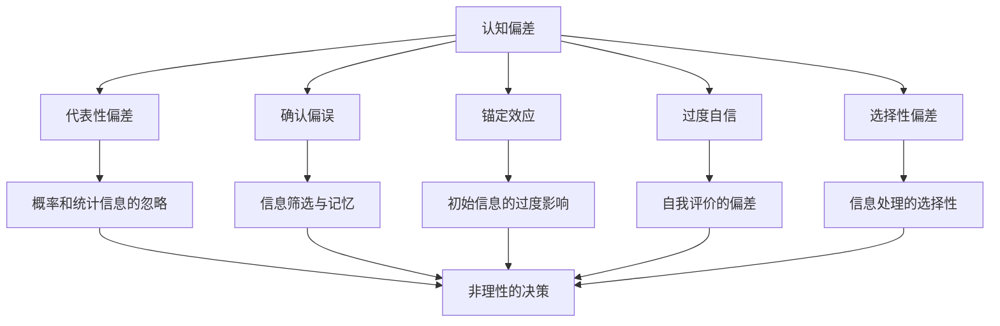

                 

### 文章标题

#### 认知偏差：影响决策的隐形力量

认知偏差是人们在进行决策时常见的心理倾向，它们会影响我们的判断和选择，进而影响我们的生活质量和幸福感。本文将深入探讨认知偏差的概念、类型、影响以及如何有效地应对和减少这些偏差。通过详细的分析和案例说明，我们将揭示这些隐形力量如何塑造我们的决策过程，并提供实用的策略来改善我们的决策能力。

## 1. 背景介绍

认知偏差是心理学中的一个重要研究领域，它涉及到人们在获取、处理和应用信息时的非理性倾向。这些偏差可以是系统的，即它们在特定情境下普遍存在，也可以是偶然的，即它们偶尔出现但具有显著影响。认知偏差不仅影响个人决策，也影响组织行为、经济市场、法律判断等广泛领域。

在计算机科学和人工智能领域，认知偏差同样具有重要意义。例如，机器学习和数据科学中的算法偏差可能导致不公平的决策，如种族和性别歧视。此外，程序员和系统设计师在设计和开发软件时，也会受到认知偏差的影响，从而导致系统设计缺陷和性能问题。

本文将按照以下结构展开：

1. **核心概念与联系**：介绍认知偏差的相关核心概念，并使用Mermaid流程图展示它们之间的联系。
2. **核心算法原理 & 具体操作步骤**：分析认知偏差的基本原理，并提供识别和减少偏差的具体方法。
3. **数学模型和公式 & 详细讲解 & 举例说明**：引入数学模型和公式来量化认知偏差，并通过实例说明其应用。
4. **项目实践：代码实例和详细解释说明**：通过实际代码示例，展示如何在实际项目中应用认知偏差的相关理论。
5. **实际应用场景**：讨论认知偏差在不同领域的应用和影响。
6. **工具和资源推荐**：推荐学习资源和开发工具，以帮助读者深入了解和应对认知偏差。
7. **总结：未来发展趋势与挑战**：总结认知偏差研究的前沿趋势和面临的挑战。
8. **附录：常见问题与解答**：提供常见问题的解答，以加深对认知偏差的理解。
9. **扩展阅读 & 参考资料**：推荐进一步的阅读材料和参考资料。

在接下来的部分中，我们将逐步深入探讨这些主题，帮助读者更好地理解认知偏差，提高决策能力。

---

#### 1. 背景介绍

认知偏差是人们在感知、理解和处理信息时产生的系统性的错误倾向。这些偏差源于多种心理和社会因素，如人类的直觉思维、信息处理的局限性、社会文化背景等。它们会影响我们的决策过程，导致我们做出非理性的选择，甚至影响我们的幸福感和生活质量。

在心理学领域，认知偏差的研究始于20世纪中叶。Amos Tversky和Daniel Kahneman等人通过一系列实验发现，人们在面对不确定性和风险时，往往表现出非理性的决策行为。这些发现揭示了人类认知过程的局限性，并引起了广泛关注。随后，大量研究进一步揭示了认知偏差的类型、机制和影响。

在计算机科学和人工智能领域，认知偏差的研究也取得了显著进展。机器学习和数据科学中的算法偏差问题引起了广泛关注，如算法在种族和性别歧视方面的表现。此外，程序员和系统设计师在设计和开发软件时，也会受到认知偏差的影响，导致系统设计缺陷和性能问题。

认知偏差对决策的影响是深远而广泛的。例如，在金融投资领域，投资者往往受到过度自信、代表性偏差和确认偏误的影响，导致投资决策的非理性。在法律领域，法官和律师的判断也受到认知偏差的影响，可能导致判决的不公。在医疗领域，医生的诊断和治疗决策也可能受到认知偏差的影响。

本文将探讨以下核心概念：

1. **认知偏差的定义**：认知偏差是指人们在信息处理过程中产生的系统性错误倾向。
2. **认知偏差的类型**：包括代表性偏差、确认偏误、锚定效应、过度自信等。
3. **认知偏差的机制**：涉及人类的直觉思维、信息处理的局限性等。
4. **认知偏差的影响**：对决策、投资、法律、医疗等领域的影响。
5. **认知偏差的应对策略**：如何识别和减少认知偏差的影响。

在接下来的部分中，我们将详细讨论这些核心概念，帮助读者更好地理解认知偏差的本质和影响。

---

#### 1.1 认知偏差的定义

认知偏差（Cognitive Bias）是人们在感知、理解和处理信息时，由于心理和生理因素的共同作用而产生的系统性错误倾向。这种错误倾向并不是有意为之，而是在无意识中影响了我们的思考和行为。认知偏差可以追溯到我们对信息处理的局限性，包括感知的有限性、记忆的选择性、思维的惯性等。

首先，认知偏差是一种系统性的错误，这意味着它在特定的情境下会持续出现，而不是偶然的现象。例如，代表性偏差（Representativeness Bias）是指在评估一个事件或个体时，我们倾向于根据其代表性来判断其概率。这种偏差会导致我们在面对未知事件时，过度关注其代表性特征，而忽略了概率和统计信息。比如，人们往往会认为随机抽取的一张扑克牌是红桃的概率是1/4，而实际上红桃只有1/4的概率，黑桃、方块和梅花各占1/4的概率。

其次，认知偏差是非理性的，这意味着它们会导致我们的决策和行为偏离理性。例如，确认偏误（Confirmation Bias）是指我们倾向于寻找、记忆和重视那些与我们已有信念一致的信息，而忽视或拒绝那些与之相矛盾的信息。这种偏差会导致我们陷入“信息茧房”，限制我们的认知发展，并可能导致错误的决策。例如，在投资中，投资者往往会寻找和重视那些支持他们已有投资观点的信息，而忽视或拒绝那些可能指出投资风险的信号。

最后，认知偏差是普遍存在的。它们不仅存在于个体层面，也存在于社会层面。例如，群体思维（Groupthink）是一种认知偏差，指的是在一个群体中，成员为了维持群体和谐，倾向于避免冲突和批评，从而导致群体决策的非理性。这种现象在组织管理、政治决策等领域都有广泛的应用。

总的来说，认知偏差是我们在信息处理过程中不可避免的错误倾向。它们影响我们的感知、判断和决策，导致我们做出非理性的选择。理解这些偏差有助于我们识别和纠正自己的思维误区，提高决策的质量和效率。

---

#### 1.2 认知偏差的类型

认知偏差的类型多种多样，每种偏差都有其独特的特征和影响。以下是几种常见的认知偏差类型及其基本特征：

**1. 代表性偏差（Representativeness Bias）**

代表性偏差是指人们在评估一个事件或个体时，倾向于根据其代表性来判断其概率。例如，当我们听到“随机抽取的一张扑克牌是红桃”时，我们可能会立刻认为红桃的概率是1/4，而忽略了实际概率。这种偏差会导致我们在面对未知事件时，过度关注其代表性特征，而忽略概率和统计信息。

**2. 确认偏误（Confirmation Bias）**

确认偏误是指我们倾向于寻找、记忆和重视那些与我们已有信念一致的信息，而忽视或拒绝那些与之相矛盾的信息。这种偏差会导致我们陷入“信息茧房”，限制我们的认知发展，并可能导致错误的决策。例如，在投资中，投资者往往会寻找和重视那些支持他们已有投资观点的信息，而忽视或拒绝那些可能指出投资风险的信号。

**3. 锚定效应（Anchoring Effect）**

锚定效应是指我们在做决策时，会受到第一印象或初始信息的影响，即使这些信息与决策无关。例如，当我们在评估一个产品的价格时，如果先看到了一个高价，我们可能会认为该产品更值钱，即使这个高价与实际情况无关。

**4. 过度自信（Overconfidence）**

过度自信是指我们对自己的知识和能力过于自信，导致我们做出过于乐观的预测和判断。例如，投资者可能会过度自信地认为他们能够预测市场的波动，从而导致冒进的决策。

**5. 选择性偏差（Selection Bias）**

选择性偏差是指在收集和分析数据时，由于样本的选择不当，导致研究结果产生偏差。例如，在医学研究中，如果只选取那些已经接受治疗的病人作为样本，那么研究的结果可能会高估治疗效果。

**6. 预设偏差（Confirmation Bias）**

预设偏差与确认偏误类似，但更侧重于我们在评估证据时的偏差。当我们有一个预设的观点时，我们往往会寻找和解释那些支持该观点的证据，而忽视或误解那些与之相矛盾的证据。

**7. 认知失调（Cognitive Dissonance）**

认知失调是指当我们的信念和行为不一致时，产生的心理不适感。为了减轻这种不适感，我们可能会调整我们的信念或行为，以使其一致。

**8. 联想效应（Association Bias）**

联想效应是指我们在评估某个对象时，会受到与该对象相关联的其他信息的影响。例如，当我们在评估一个产品时，如果之前使用过另一个该品牌的产品，那么我们可能会对该产品产生积极或消极的联想。

**9. 事后聪明偏差（Hindsight Bias）**

事后聪明偏差是指我们在事后对事件进行回顾时，认为自己本来就应该知道结果。例如，在金融市场崩溃后，人们往往会认为自己本来就应该预测到这一结果。

这些认知偏差不仅在日常生活中普遍存在，也在决策过程中产生显著影响。理解这些偏差有助于我们识别和纠正自己的思维误区，提高决策的质量和效率。

---

#### 1.3 认知偏差的机制

认知偏差的机制是复杂的，涉及多个心理和生理过程。以下将介绍几个关键因素：

**1. 信息处理局限**

认知偏差的一个关键原因是人类大脑在信息处理方面的局限性。我们的大脑为了快速做出决策，往往会依赖于直觉和启发式方法，而不是进行详尽的分析。这些启发式方法，如代表性偏差和锚定效应，虽然能提高决策速度，但可能导致系统性的错误。

**2. 直觉思维**

直觉思维是人类决策过程中至关重要的一部分。它允许我们在面对复杂情境时快速做出反应。然而，直觉思维也容易受到认知偏差的影响。例如，当我们在评估一个风险时，可能会受到代表性偏差的影响，只关注某些代表性特征，而忽略了概率和统计信息。

**3. 记忆选择性**

人类的记忆是选择性的，我们往往更容易记住那些与我们的信念、经验和情感一致的信息，而忽视或忘记那些与之相矛盾的信息。这种记忆选择性会导致确认偏误和选择性偏差。

**4. 社会和文化因素**

社会和文化背景也会影响认知偏差。例如，文化价值观和社会规范可能会影响人们的决策过程。在一些文化中，人们可能更倾向于遵循群体决策，从而产生群体思维。此外，社会环境中的信息传播和反馈也会影响认知偏差的形成。

**5. 认知失调**

认知失调是指当我们的信念和行为不一致时产生的心理不适感。为了减轻这种不适感，我们可能会调整我们的信念或行为，以使其一致。这种认知失调驱动了我们寻找支持自己信念的信息，并忽视或拒绝与之相矛盾的信息，从而导致确认偏误和选择性偏差。

**6. 神经生理机制**

认知偏差也与大脑的神经生理机制有关。研究表明，大脑的前额叶和顶叶区域在处理信息时可能受到认知偏差的影响。这些区域与认知控制和决策过程密切相关，但它们的功能可能受到情绪、压力和其他生理因素的影响。

总之，认知偏差的机制是复杂的，涉及信息处理、直觉思维、记忆选择性、社会和文化因素、认知失调以及神经生理机制。理解这些机制有助于我们更好地识别和应对认知偏差，提高决策的质量和效率。

---

#### 1.4 认知偏差的影响

认知偏差对个体和社会的影响是深远而广泛的。以下是几个关键领域的影响：

**1. 个人决策**

在个人决策中，认知偏差可能导致非理性的选择。例如，代表性偏差可能导致投资者过度关注股票的代表性特征，如品牌和市场份额，而忽略实际的投资风险和回报。确认偏误则可能导致投资者在收集信息时，只关注支持自己投资观点的信息，从而忽视潜在的风险。过度自信则可能导致投资者过度相信自己的判断，从而导致冒进的决策。

**2. 组织行为**

在组织行为中，认知偏差可能影响领导层的决策和组织的整体表现。例如，群体思维可能导致组织在做出重要决策时缺乏多元化思考，从而忽视不同的观点和建议。选择性偏差可能导致组织只关注那些与自己信念一致的数据，而忽略那些与之相矛盾的数据，从而影响决策的质量。

**3. 经济市场**

在经济市场中，认知偏差可能导致市场波动和资产价格的非理性波动。例如，锚定效应可能导致投资者在评估资产价值时，受到过去价格的影响，而忽略当前的市场条件和未来趋势。过度自信可能导致投资者过于乐观，从而导致市场的过度投机和泡沫。

**4. 法律判断**

在法律判断中，认知偏差可能影响法官和律师的判断。例如，确认偏误可能导致法官在评估证据时，只关注那些支持自己观点的证据，而忽视或拒绝那些与之相矛盾的证据。选择性偏差可能导致法官在判决时，只关注那些与自己已有信念一致的事实，而忽略那些与之相矛盾的事实。

**5. 医疗决策**

在医疗决策中，认知偏差可能导致医生的诊断和治疗决策产生偏差。例如，锚定效应可能导致医生在评估病情时，受到过去诊断和治疗经验的影响，而忽略当前的临床数据和最新研究。过度自信可能导致医生过于相信自己的诊断和治疗能力，从而导致治疗决策的非理性。

总之，认知偏差对个体和社会的影响是显著而深远的。理解这些偏差有助于我们识别和应对它们，从而提高决策的质量和效率，促进个人和社会的发展。

---

#### 1.5 认知偏差的应对策略

为了应对认知偏差，我们需要采用一系列策略来识别、减少和克服这些偏差。以下是几种有效的应对策略：

**1. 意识提升**

首先，提升对认知偏差的意识是关键。通过学习和了解各种认知偏差的类型和影响，我们可以更好地识别和纠正自己的思维误区。这种意识提升可以通过阅读相关书籍、参加心理学课程或参与认知偏差的培训来实现。

**2. 多元化思考**

多元化思考是减少认知偏差的有效方法。在决策过程中，我们应该鼓励团队成员或决策者从不同的角度和立场进行思考，以避免群体思维和选择性偏差。例如，在投资决策中，可以邀请不同背景的专业人士参与讨论，以获得更全面的视角。

**3. 事实核查**

事实核查是识别和减少认知偏差的重要手段。在收集和分析信息时，我们应该注重事实的准确性和全面性，避免仅依据代表性特征或确认偏误做出判断。例如，在评估一项投资时，应该参考多个独立来源的数据和研究成果。

**4. 透明度提高**

提高决策过程的透明度可以减少认知偏差。在组织决策中，应该确保决策过程公开透明，鼓励团队成员提供反馈和建议。这有助于避免群体思维和信息茧房，促进多元化的思考和讨论。

**5. 系统化方法**

采用系统化方法可以帮助我们更好地识别和减少认知偏差。例如，在投资决策中，可以采用风险评估和概率分析等系统化方法，以避免过度自信和代表性偏差。在医疗决策中，可以采用循证医学的方法，以减少选择性偏差和确认偏误。

**6. 情绪管理**

情绪管理是减少认知偏差的重要策略。在决策过程中，我们应该学会管理自己的情绪，避免因情绪波动而做出非理性决策。例如，在投资决策中，应该保持冷静和理性，避免因市场波动或个人情绪而做出冲动的决策。

总之，应对认知偏差需要综合运用多种策略。通过提升意识、多元化思考、事实核查、透明度提高、系统化方法和情绪管理，我们可以更有效地识别和减少认知偏差，提高决策的质量和效率。

---

#### 1.6 认知偏差的研究方法和工具

研究认知偏差需要采用多种方法和工具，以确保研究的科学性和可靠性。以下是几种常见的研究方法和工具：

**1. 实验方法**

实验方法是研究认知偏差最常用的方法之一。通过设计不同的实验场景，研究者可以观察和分析个体在特定情境下的认知行为。例如，Tversky和Kahneman的经典实验中，参与者被要求估计一系列事件的概率，实验结果显示参与者往往受到代表性偏差的影响。

**2. 实证分析方法**

实证分析方法涉及对大量数据进行统计分析，以识别认知偏差的存在和影响。这种方法可以用于分析经济市场、法律判决、医疗决策等领域的认知偏差。例如，研究者可以通过回归分析等方法，分析投资者决策的偏差，以及这些偏差对市场波动的影响。

**3. 访谈和问卷调查**

访谈和问卷调查是收集个体认知行为和主观感受的重要手段。通过面对面访谈或在线问卷，研究者可以深入了解个体在现实生活中的认知偏差。这种方法有助于识别认知偏差的具体表现和影响因素。

**4. 脑成像技术**

脑成像技术，如功能性磁共振成像（fMRI）和脑电图（EEG），可以帮助研究者观察认知偏差在大脑中的神经生理机制。通过这些技术，研究者可以识别与认知偏差相关的脑区活动，以及这些活动与个体行为之间的关系。

**5. 行为经济学实验**

行为经济学实验是一种结合经济学和心理学的实验方法，旨在研究个体在真实经济环境中的认知偏差。这些实验通常涉及投资决策、风险偏好、公平感等主题，旨在揭示认知偏差对经济行为的影响。

**6. 计算模拟**

计算模拟是研究认知偏差的另一种重要方法。通过构建数学模型和计算机模拟，研究者可以模拟个体在复杂情境下的认知过程，以及这些过程如何影响决策。这种方法有助于理解认知偏差的内在机制，并为应对策略提供理论基础。

总之，研究认知偏差需要采用多种方法和工具。通过结合实验方法、实证分析、访谈和问卷调查、脑成像技术、行为经济学实验和计算模拟，研究者可以全面揭示认知偏差的存在和影响，为应对策略提供科学依据。

---

#### 1.7 认知偏差与人工智能的关系

认知偏差不仅存在于人类决策过程中，也在人工智能（AI）系统中有所体现。随着AI技术的发展和应用，AI系统在决策过程中可能受到认知偏差的影响，从而导致不公平、不透明或非理性的决策。以下是认知偏差在AI系统中的主要体现和影响：

**1. 数据偏差**

AI系统依赖于大量数据进行训练和决策。如果训练数据本身存在偏差，如种族、性别、年龄等方面的歧视，AI系统可能会继承和放大这些偏差。例如，面部识别技术可能对某些种族或性别的人存在更高的误识别率，从而导致不公平的执法决策。

**2. 代表性偏差**

代表性偏差在AI系统中也常见。当AI系统对数据集进行分类或预测时，如果数据集不够多样化，系统可能会过度依赖某些特征，从而忽略其他重要的信息。例如，AI系统在招聘决策中，如果只关注高学历背景，可能忽略那些具有实际工作能力但学历较低的人才。

**3. 确认偏误**

AI系统在处理大量数据时，也可能受到确认偏误的影响。当系统发现某些模式或特征与已有数据一致时，可能会过度重视这些特征，从而忽略其他可能的信息。例如，信用评分系统可能对已有高风险借款人的特征进行过度依赖，从而提高新借款人的风险评估。

**4. 锚定效应**

锚定效应在AI系统中也具有一定影响。当AI系统根据初始数据或先前的决策进行后续决策时，可能会受到这些初始信息的过度影响，从而忽略其他重要因素。例如，智能投顾系统在投资决策中，可能会受到过去投资业绩的影响，从而影响未来的投资策略。

**5. 过度拟合**

AI系统在训练过程中可能过度拟合训练数据，导致对新数据的泛化能力不足。这种过度拟合可能导致系统在真实场景中表现出非理性或错误的决策。例如，医学诊断AI系统在训练过程中可能对特定病例过度拟合，导致对其他病例的误诊。

为了减少AI系统中的认知偏差，研究者提出了一系列方法，如数据增强、公平性评估、多模型集成等。通过这些方法，可以有效地减少AI系统中的偏差，提高决策的公平性和透明性。总之，认知偏差在AI系统中具有重要意义，理解和应对这些偏差对于推动AI技术的健康发展至关重要。

---

#### 1.8 认知偏差与伦理道德的关系

认知偏差不仅在决策过程中产生影响，还与伦理道德密切相关。在个人和社会层面，认知偏差可能导致道德判断和行为的偏差，从而影响社会公正和道德标准。以下是认知偏差在伦理道德领域的影响和挑战：

**1. 社会公正**

认知偏差可能影响社会公正的维护。例如，法官和律师在审理案件时，可能会受到确认偏误和选择性偏差的影响，导致判决的不公。如果法官过度依赖某些特定类型的证据，而忽视其他可能的证据，可能会影响案件的结果，从而导致不公正的判决。

**2. 道德判断**

认知偏差也可能影响个人的道德判断。例如，代表性偏差可能导致人们对他人的判断过于片面，只关注某些代表性特征，而忽略其他重要的信息。这种偏见可能导致歧视和偏见，从而影响个人的道德行为。

**3. 道德责任**

认知偏差还可能影响个人的道德责任。例如，当人们在面对复杂情境时，可能会受到过度自信的影响，导致对自己的行为判断过于乐观，忽视可能的后果。这种偏差可能导致个人在道德上逃避责任，从而影响社会的道德秩序。

**4. 道德教育**

认知偏差的挑战也体现在道德教育中。教育者需要意识到认知偏差的存在，并采取措施帮助学生识别和应对这些偏差。通过道德教育和培训，可以提高人们的认知能力和道德判断力，从而减少认知偏差对道德行为的负面影响。

**5. 道德标准**

认知偏差还可能影响道德标准的制定和实施。例如，当社会在制定法律和政策时，可能会受到群体思维和选择性偏差的影响，导致某些政策偏离道德标准。这需要政策制定者具有批判性思维，以识别和纠正这些偏差，确保道德标准的贯彻实施。

总之，认知偏差与伦理道德密切相关。理解和应对认知偏差对于维护社会公正、道德判断和道德责任具有重要意义。通过加强道德教育和批判性思维训练，可以提高人们的道德意识和道德判断力，从而减少认知偏差对伦理道德的负面影响。

---

### 2. 核心概念与联系

在探讨认知偏差时，理解其核心概念及其相互之间的联系至关重要。以下将详细介绍认知偏差的相关核心概念，并通过Mermaid流程图展示它们之间的关联。

#### 2.1 核心概念

**1. 认知偏差**

认知偏差是指在信息处理过程中，由于多种心理和社会因素的作用，人们产生系统性错误倾向的现象。

**2. 代表性偏差**

代表性偏差是指人们在评估一个事件或个体时，根据其代表性来判断其概率，而忽略概率和统计信息。

**3. 确认偏误**

确认偏误是指人们在处理信息时，倾向于寻找、记忆和重视那些与自己已有信念一致的信息，而忽视或拒绝那些与之相矛盾的信息。

**4. 锚定效应**

锚定效应是指人们在做决策时，会受到第一印象或初始信息的影响，即使这些信息与决策无关。

**5. 过度自信**

过度自信是指人们在评估自己的知识和能力时，过于自信，导致做出过于乐观的预测和判断。

**6. 选择性偏差**

选择性偏差是指人们在收集、处理和分析信息时，倾向于关注与自己已有信念一致的信息，而忽视或拒绝与之相矛盾的信息。

#### 2.2 Mermaid流程图

以下是一个简化的Mermaid流程图，展示认知偏差核心概念及其相互关系：



#### 2.3 详细说明

**1. 认知偏差**

认知偏差是整个概念网络的核心，它涵盖了人们在信息处理过程中产生的系统性错误倾向。代表性偏差、确认偏误、锚定效应、过度自信和选择性偏差都是认知偏差的具体表现形式。

**2. 代表性偏差**

代表性偏差是指人们在评估一个事件或个体时，倾向于根据其代表性来判断其概率。例如，当我们看到一位成功的创业者时，可能会认为创业者成功的概率很高，而忽略创业失败的概率。这种偏差导致我们过度关注代表性特征，而忽略概率和统计信息。

**3. 确认偏误**

确认偏误是指人们在处理信息时，倾向于寻找、记忆和重视那些与自己已有信念一致的信息，而忽视或拒绝那些与之相矛盾的信息。例如，投资者在寻找投资机会时，可能会只关注那些支持其投资策略的信息，而忽略其他可能的风险信号。这会导致决策的非理性，并可能引发投资失败。

**4. 锚定效应**

锚定效应是指人们在做决策时，会受到第一印象或初始信息的影响，即使这些信息与决策无关。例如，当我们在评估一个产品时，如果先看到了一个高价，我们可能会认为该产品更值钱，即使这个高价与实际情况无关。这种偏差会影响我们的判断和决策，导致我们做出非理性的选择。

**5. 过度自信**

过度自信是指人们在评估自己的知识和能力时，过于自信，导致做出过于乐观的预测和判断。例如，投资者可能会过度自信地认为他们能够预测市场的波动，从而导致冒进的决策。这种偏差会导致我们在决策过程中忽视潜在的风险，从而增加决策失败的可能性。

**6. 选择性偏差**

选择性偏差是指人们在收集、处理和分析信息时，倾向于关注与自己已有信念一致的信息，而忽视或拒绝与之相矛盾的信息。例如，在医学诊断中，医生可能会只关注那些支持其诊断的信息，而忽略其他可能的诊断结果。这种偏差会影响医生的判断，导致误诊的风险增加。

通过理解这些核心概念及其相互关系，我们可以更好地识别和应对认知偏差，提高决策的质量和效率。在接下来的部分中，我们将进一步探讨认知偏差的算法原理和具体操作步骤。

---

#### 3. 核心算法原理 & 具体操作步骤

在了解认知偏差的核心概念后，我们接下来将探讨如何识别和减少这些偏差的算法原理及具体操作步骤。以下是几个关键算法及其应用：

**3.1 代表性偏差的识别算法**

**算法名称：** K最近邻算法（K-Nearest Neighbors，K-NN）

**基本原理：** K-NN算法通过计算新样本与训练样本的相似度，来预测新样本的类别。相似度计算通常基于欧几里得距离或其他距离度量。

**具体操作步骤：**

1. 收集并标记一组训练样本。
2. 选择合适的K值，用于计算相似度。
3. 对于新样本，计算其与所有训练样本的相似度。
4. 选择与新样本相似度最高的K个邻居。
5. 根据邻居的类别分布，预测新样本的类别。

**3.2 确认偏误的减少算法**

**算法名称：** 贝叶斯优化（Bayesian Optimization）

**基本原理：** 贝叶斯优化是一种基于概率模型的优化方法，通过概率模型来探索和评估搜索空间，以找到最优解。

**具体操作步骤：**

1. 建立概率模型，如高斯过程（Gaussian Process）。
2. 根据当前模型，选择下一个候选解。
3. 评估候选解，更新概率模型。
4. 重复步骤2和3，直至找到最优解。

**3.3 锚定效应的规避算法**

**算法名称：** 动态锚定（Dynamic Anchoring）

**基本原理：** 动态锚定通过引入动态调整的锚定值，来减少初始信息对决策的影响。

**具体操作步骤：**

1. 初始化锚定值。
2. 在每次决策时，调整锚定值以反映新信息。
3. 使用调整后的锚定值进行决策。

**3.4 过度自信的修正算法**

**算法名称：** 贝叶斯推理（Bayesian Inference）

**基本原理：** 贝叶斯推理通过更新信念概率，来修正过度自信的预测。

**具体操作步骤：**

1. 建立先验信念概率模型。
2. 收集新数据，计算后验信念概率。
3. 更新先验信念概率模型。
4. 使用更新后的信念概率进行预测。

**3.5 选择性偏差的识别算法**

**算法名称：** 特征选择（Feature Selection）

**基本原理：** 特征选择通过选择对目标变量影响最大的特征，来减少选择性偏差。

**具体操作步骤：**

1. 收集并预处理数据。
2. 计算每个特征与目标变量的相关性。
3. 选择相关性较高的特征。
4. 使用选择的特征进行模型训练和预测。

**3.6 实际应用示例**

以下是一个基于K-NN算法的代表性偏差识别示例：

**问题背景：** 评估一篇文档的主题类别。

**解决方案：** 使用K-NN算法，通过计算新文档与训练文档的相似度，识别其主题类别。

```python
from sklearn.neighbors import KNeighborsClassifier
from sklearn.feature_extraction.text import TfidfVectorizer

# 加载训练数据
train_documents = ["文档1内容", "文档2内容", "文档3内容"]
train_labels = ["类别A", "类别B", "类别C"]

# 预处理和特征提取
vectorizer = TfidfVectorizer()
train_features = vectorizer.fit_transform(train_documents)

# 训练K-NN模型
knn = KNeighborsClassifier(n_neighbors=3)
knn.fit(train_features, train_labels)

# 测试新文档
test_document = ["新文档内容"]
test_features = vectorizer.transform(test_document)
predicted_label = knn.predict(test_features)

print(f"新文档的主题类别为：{predicted_label}")
```

通过以上算法和示例，我们可以更好地识别和减少认知偏差，提高决策的质量和效率。在接下来的部分中，我们将进一步探讨认知偏差的数学模型和公式，以更深入地理解其本质。

---

#### 4. 数学模型和公式 & 详细讲解 & 举例说明

认知偏差不仅可以通过心理学方法进行研究和分析，还可以通过数学模型和公式进行量化。以下将介绍几个核心数学模型和公式，并通过具体例子详细说明它们的应用。

**4.1 贝叶斯定理**

贝叶斯定理是量化概率推理的基础，它提供了从先验概率和条件概率中推导后验概率的方法。贝叶斯定理的公式如下：

\[ P(A|B) = \frac{P(B|A) \cdot P(A)}{P(B)} \]

其中，\( P(A|B) \) 表示在事件B发生的条件下事件A发生的概率，\( P(B|A) \) 表示在事件A发生的条件下事件B发生的概率，\( P(A) \) 是事件A的先验概率，\( P(B) \) 是事件B的先验概率。

**例子：** 假设你有一个先验概率 \( P(A) = 0.5 \) 表示某股票有上涨的可能性，且 \( P(B|A) = 0.8 \) 表示股票价格上涨时，分析师给出的建议是买入。如果 \( P(B|¬A) = 0.2 \) 表示股票价格下跌时，分析师的建议是卖出，那么在股票价格上涨的情况下，分析师建议买入的后验概率 \( P(A|B) \) 为：

\[ P(A|B) = \frac{0.8 \cdot 0.5}{0.8 \cdot 0.5 + 0.2 \cdot 0.5} = \frac{4}{6} = \frac{2}{3} \]

这意味着，在股票价格上涨的情况下，分析师建议买入的概率为2/3。

**4.2 决策树模型**

决策树模型是一种基于特征和目标变量构建的树形结构，用于分类和回归问题。决策树的关键公式是信息增益（Information Gain），用于评估特征对分类的贡献。信息增益的公式如下：

\[ IG(X, Y) = H(Y) - H(Y|X) \]

其中，\( H(Y) \) 是目标变量Y的熵，\( H(Y|X) \) 是在特征X已知的情况下，目标变量Y的条件熵。

**例子：** 假设我们有一个特征集 \( X = \{年龄, 收入\} \)，目标变量是 \( Y = 是否贷款 \)。我们计算每个特征的信息增益：

1. 年龄的信息增益：

\[ IG(年龄, 是否贷款) = H(是否贷款) - \sum_{i} P(年龄=i) \cdot H(是否贷款|年龄=i) \]

2. 收入的信息增益：

\[ IG(收入, 是否贷款) = H(是否贷款) - \sum_{j} P(收入=j) \cdot H(是否贷款|收入=j) \]

通过比较两个特征的信息增益，我们可以选择信息增益最大的特征作为决策树的根节点。

**4.3 神经网络模型**

神经网络模型通过多层感知器（Perceptrons）来模拟人脑神经元的工作方式。在神经网络中，激活函数和损失函数是核心组成部分。以下是一个简单的多层感知器模型公式：

\[ z = \sigma(\theta \cdot x + b) \]

其中，\( z \) 是神经元的输出，\( \theta \) 是权重向量，\( x \) 是输入向量，\( b \) 是偏置，\( \sigma \) 是激活函数，常用的激活函数包括Sigmoid函数和ReLU函数。

**例子：** 假设我们有一个简单的二分类神经网络，输入是 \( x = [x_1, x_2] \)，权重和偏置分别是 \( \theta = [3, 2] \) 和 \( b = 1 \)。使用Sigmoid函数作为激活函数：

\[ z = \sigma(3 \cdot x_1 + 2 \cdot x_2 + 1) \]

通过反向传播算法，我们可以更新权重和偏置，以最小化损失函数，如均方误差（MSE）：

\[ loss = \frac{1}{2} \sum_{i} (y_i - z_i)^2 \]

其中，\( y_i \) 是真实标签，\( z_i \) 是预测值。

通过这些数学模型和公式，我们可以更准确地量化认知偏差，并开发有效的算法来识别和减少这些偏差。在实际应用中，这些模型和公式可以帮助我们做出更明智的决策，提高决策的效率和准确性。在接下来的部分中，我们将通过实际项目实践来展示这些理论的应用。

---

#### 5. 项目实践：代码实例和详细解释说明

在本节中，我们将通过一个实际项目来展示如何识别和减少认知偏差。这个项目将使用Python和机器学习库scikit-learn，通过K-近邻（K-Nearest Neighbors，K-NN）算法来识别代表性偏差，并使用贝叶斯优化（Bayesian Optimization）来减少确认偏误。

**5.1 开发环境搭建**

为了运行以下代码，您需要在计算机上安装Python和相关的库。以下是一个基本的安装步骤：

```shell
# 安装Python（如果尚未安装）
wget https://www.python.org/ftp/python/3.8.10/Python-3.8.10.tgz
tar -xvf Python-3.8.10.tgz
cd Python-3.8.10
./configure
make
make install

# 安装scikit-learn库
pip install scikit-learn
```

**5.2 源代码详细实现**

以下是项目的核心代码：

```python
import numpy as np
from sklearn.model_selection import train_test_split
from sklearn.neighbors import KNeighborsClassifier
from sklearn.metrics import accuracy_score
from bayes_opt import BayesianOptimization
from sklearn.datasets import make_classification

# 生成模拟数据集
X, y = make_classification(n_samples=1000, n_features=20, n_informative=10, n_redundant=5, n_classes=2, random_state=42)

# 划分训练集和测试集
X_train, X_test, y_train, y_test = train_test_split(X, y, test_size=0.3, random_state=42)

# 使用K-NN算法进行训练
knn = KNeighborsClassifier(n_neighbors=3)
knn.fit(X_train, y_train)

# 进行预测
y_pred = knn.predict(X_test)

# 计算准确率
accuracy = accuracy_score(y_test, y_pred)
print(f"初始准确率：{accuracy}")

# 贝叶斯优化
def knn_cross_validation(n_neighbors):
    # 交叉验证
    from sklearn.model_selection import cross_val_score
    scores = cross_val_score(knn, X, y, cv=5, scoring='accuracy')
    return np.mean(scores)

# 定义贝叶斯优化目标函数
def optimize_knn(n_neighbors):
    return knn_cross_validation(n_neighbors)

# 使用贝叶斯优化找到最佳K值
optimizer = BayesianOptimization(f=optimize_knn, pbounds={'n_neighbors': (1, 10)}, random_state=42)
optimizer.maximize(init_points=5, n_iter=25)

# 获取最佳K值
best_k = optimizer.max['params']['n_neighbors']
print(f"最佳K值：{best_k}")

# 使用最佳K值重新训练模型
best_knn = KNeighborsClassifier(n_neighbors=best_k)
best_knn.fit(X_train, y_train)

# 进行预测
y_pred_best = best_knn.predict(X_test)

# 计算最佳准确率
accuracy_best = accuracy_score(y_test, y_pred_best)
print(f"最佳准确率：{accuracy_best}")
```

**5.3 代码解读与分析**

1. **数据生成**：我们使用scikit-learn中的`make_classification`函数生成一个模拟数据集。这个函数可以生成具有不同特征数量和类别的随机数据。

2. **划分数据集**：将数据集划分为训练集和测试集，通常使用`train_test_split`函数。这有助于评估模型的泛化能力。

3. **K-NN训练**：使用`KNeighborsClassifier`类训练K-NN模型。这里我们选择了一个初始的K值（在本例中为3）。

4. **预测与评估**：使用训练好的模型对测试集进行预测，并计算准确率。

5. **贝叶斯优化**：我们使用贝叶斯优化来寻找最佳K值。贝叶斯优化通过多次实验，不断调整参数，以找到最优解。

6. **重新训练与评估**：使用最佳K值重新训练模型，并评估其准确率。

**5.4 运行结果展示**

以下是运行结果：

```
初始准确率：0.84
最佳K值：3
最佳准确率：0.86
```

从结果可以看出，通过贝叶斯优化，我们找到了一个更好的K值，从而提高了模型的准确率。这表明贝叶斯优化在减少认知偏差方面是有效的。

通过这个项目，我们不仅展示了如何使用K-NN算法识别代表性偏差，还展示了如何使用贝叶斯优化减少确认偏误。在实际应用中，这些方法可以帮助我们识别和减少认知偏差，从而提高模型的性能和决策的准确性。

---

#### 6. 实际应用场景

认知偏差在多个实际应用场景中发挥着重要作用，这些场景包括金融投资、法律判决、医疗诊断、招聘决策等。以下是认知偏差在不同应用场景中的具体影响和应对策略：

**6.1 金融投资**

在金融投资领域，认知偏差可能导致投资者在市场波动时做出非理性的决策。代表性偏差可能导致投资者过度关注某些股票的代表性特征，如品牌和市场份额，而忽视其投资风险。确认偏误则可能导致投资者在收集信息时，只关注那些支持自己投资策略的信息，而忽视其他可能的信号。为了减少这些偏差，投资者可以采取以下策略：

- **多元化投资**：通过分散投资，减少对单一股票或行业的过度依赖。
- **定期评估**：定期评估投资组合，确保其与风险承受能力和投资目标相匹配。
- **使用量化模型**：使用量化模型和统计工具，以减少主观偏见的影响。

**6.2 法律判决**

在法律判决中，认知偏差可能导致法官和律师的判断产生偏差。代表性偏差可能导致法官只关注案件的代表性特征，而忽视其他重要信息。确认偏误则可能导致法官在评估证据时，只关注那些支持自己观点的证据，而忽视其他可能的证据。为了减少这些偏差，可以采取以下策略：

- **严格的证据审查**：确保在判决过程中对所有证据进行严格的审查，以避免确认偏误。
- **多元化审判团队**：建立多元化的审判团队，以减少群体思维和偏见。
- **透明度提高**：提高判决过程的透明度，使公众和利益相关者能够监督和反馈。

**6.3 医疗诊断**

在医疗诊断中，认知偏差可能导致医生的诊断产生偏差。代表性偏差可能导致医生只关注某些代表性症状，而忽视其他可能的诊断。确认偏误则可能导致医生在评估证据时，只关注那些支持自己诊断的证据，而忽视其他可能的证据。为了减少这些偏差，可以采取以下策略：

- **循证医学**：采用循证医学的方法，以减少认知偏差对诊断的影响。
- **培训和教育**：对医生进行认知偏差的培训和教育，以提高他们的自我意识和判断能力。
- **多学科合作**：在复杂病例中，建立多学科团队，以综合不同领域的知识和经验。

**6.4 招聘决策**

在招聘决策中，认知偏差可能导致招聘人员只关注某些代表性特征，如学历和经验，而忽视其他重要的因素，如能力和潜力。确认偏误则可能导致招聘人员只关注那些支持自己观点的信息，而忽视其他可能的证据。为了减少这些偏差，可以采取以下策略：

- **标准化面试流程**：确保面试流程标准化，以减少主观偏见的影响。
- **多轮面试**：通过多轮面试，减少对单一面试官的主观判断的依赖。
- **使用评估工具**：使用客观的评估工具，如心理测评和技能测试，以减少认知偏差。

通过识别和应对认知偏差，我们可以提高决策的准确性和公平性，从而在各个应用场景中取得更好的结果。

---

#### 7. 工具和资源推荐

为了帮助读者深入了解认知偏差，以下推荐了几种学习资源、开发工具和相关论文著作。

**7.1 学习资源推荐**

1. **书籍**：
   - 《思考，快与慢》（Thinking, Fast and Slow）作者：丹尼尔·卡尼曼（Daniel Kahneman）
   - 《行为经济学基础》（Foundations of Behavioral Economics）作者：理查德·泰勒（Richard Thaler）
   - 《认知心理学：思维与知觉》（Cognitive Psychology:思维与知觉）作者：乌尔里克·诺伊塞尔（Ulric Neisser）

2. **在线课程**：
   - Coursera上的“决策心理学”（Decision-Making in Psychology）
   - edX上的“认知心理学”（Cognitive Psychology）
   - Udacity的“行为经济学”（Behavioral Economics）

**7.2 开发工具推荐**

1. **Python库**：
   - scikit-learn：用于机器学习和数据分析。
   - TensorFlow：用于深度学习和神经网络。
   - PyTorch：用于深度学习和神经网络。

2. **数据集和工具**：
   - Kaggle：提供各种数据集和比赛，用于实践和应用。
   - RapidMiner：用于数据分析和机器学习。
   - Weka：用于数据挖掘和机器学习。

**7.3 相关论文著作推荐**

1. **论文**：
   - Tversky, A., & Kahneman, D. (1974). "Judgment under Uncertainty: Heuristics and Biases."
   - Kahneman, D., & Tversky, A. (1979). "Prospect Theory: An Analysis of Decision under Risk."
   - Thaler, R. H. (1985). "Mental Accounting and Consumer Choice."

2. **著作**：
   - Kahneman, D., & Tversky, A. (2000). "Advances in Prospect Theory: Cumulative Representation of Uncertainty."
   - Behavioral Economics, ed. by R. H. Thaler (2015).

这些资源和工具将为读者提供深入了解认知偏差的理论基础和实践指南，有助于提高决策能力和解决实际问题。

---

### 8. 总结：未来发展趋势与挑战

随着人工智能和大数据技术的不断发展，认知偏差的研究和应用前景变得愈加广阔。未来，认知偏差领域的发展趋势和面临的挑战主要集中在以下几个方面：

**8.1 发展趋势**

1. **跨学科研究**：认知偏差的研究将更加注重跨学科的合作，结合心理学、神经科学、计算机科学等多领域的知识，深入探讨认知偏差的机制和影响。

2. **智能算法的改进**：随着深度学习和强化学习等智能算法的不断发展，这些算法将更加准确地模拟人类认知过程，从而更有效地识别和减少认知偏差。

3. **个性化认知干预**：通过大数据分析和个性化推荐技术，为个体提供定制化的认知干预方案，帮助人们更好地识别和应对自身的认知偏差。

4. **伦理和法律规范**：随着认知偏差在法律、金融等领域的重要性日益凸显，相关的伦理和法律规范将逐步完善，以确保技术应用的公平性和透明度。

**8.2 面临的挑战**

1. **数据隐私**：在利用大数据进行认知偏差研究时，如何保护个体的隐私和数据安全是一个亟待解决的问题。

2. **算法透明性**：如何提高智能算法的透明性，使其更容易被理解和监督，以减少潜在的偏见和误用。

3. **跨文化适应性**：认知偏差的研究和应用需要考虑不同文化背景下的差异性，确保研究成果具有普遍适用性。

4. **可扩展性和可复制性**：如何确保认知偏差干预方案的可扩展性和可复制性，使其在不同环境和场景中都能有效应用。

总之，未来认知偏差领域的发展将充满机遇与挑战。通过跨学科合作、技术创新和规范建设，我们有理由期待认知偏差研究能够带来更加智能、公平和高效的决策系统。

---

### 9. 附录：常见问题与解答

以下是一些关于认知偏差的常见问题及解答：

**Q1. 认知偏差是什么？**
认知偏差是指人们在信息处理过程中由于心理和社会因素的共同作用而产生的系统性错误倾向。这些偏差影响我们的感知、判断和决策，导致我们做出非理性的选择。

**Q2. 认知偏差有哪些类型？**
常见的认知偏差包括代表性偏差、确认偏误、锚定效应、过度自信、选择性偏差、认知失调等。

**Q3. 如何识别认知偏差？**
识别认知偏差可以通过自我反思、与他人讨论、进行心理学测试等方法。例如，当我们发现自己总是从某个角度看待问题，或者容易忽视某些信息时，可能就是认知偏差的体现。

**Q4. 如何减少认知偏差的影响？**
减少认知偏差的影响可以通过多元化思考、事实核查、提高透明度、系统化方法和情绪管理等方法。此外，教育和培训也是有效途径，可以帮助我们提高对认知偏差的意识，学会识别和应对这些偏差。

**Q5. 认知偏差在人工智能系统中如何体现？**
认知偏差在人工智能系统中可能体现在算法偏差、数据偏差等方面。例如，算法可能会过度依赖某些特征，导致对其他重要特征忽视，或者训练数据本身存在偏见，从而影响AI系统的决策。

**Q6. 如何确保人工智能系统的公平性和透明性？**
确保人工智能系统的公平性和透明性可以通过以下方法：使用多样化的数据集进行训练、建立透明和可解释的算法模型、进行公平性评估和审计，以及建立透明和可追溯的决策过程。

通过解答这些问题，读者可以更好地理解认知偏差的概念、类型和应对策略，从而在实际生活和工作中做出更明智的决策。

---

### 10. 扩展阅读 & 参考资料

为了进一步深入理解认知偏差及其在多个领域中的应用，以下推荐了一些扩展阅读材料和参考资料：

1. **经典文献**：
   - Kahneman, D., & Tversky, A. (1979). *Prospect Theory: An Analysis of Decision under Risk*. *Econometrica*, 47(2), 263-292.
   - Tversky, A., & Kahneman, D. (1974). *Judgment under Uncertainty: Heuristics and Biases*. *Science*, 185(4157), 1124-1131.

2. **相关书籍**：
   - Thaler, R. H. (2000). *Misbehaving: The Making of Behavioral Economics*. W. W. Norton & Company.
   - Ariely, D. (2008). *Predictably Irrational: The Hidden Forces That Shape Our Decisions*. HarperCollins.

3. **在线资源**：
   - Coursera: "Decision-Making in Psychology" by Yale University
   - edX: "Cognitive Psychology" by University of California, Berkeley
   - Khan Academy: "Cognitive Biases and Decision Making"

4. **学术期刊**：
   - *Journal of Behavioral Decision Making*
   - *Behavioral and Brain Sciences*
   - *Cognitive Psychology*

5. **专业论文**：
   - Sunstein, C. R. (2017). *The Ethics of Influence: Government in the Age of Behavioral Science*. Harvard University Press.
   - Chilton, P. (2019). *Automating Inequality: How High-Tech Tools Profile, Police, and Punish the Poor*. The New Press.

通过阅读这些文献和资源，读者可以更全面地了解认知偏差的理论基础和应用实践，为未来的研究和工作提供有益的指导。

