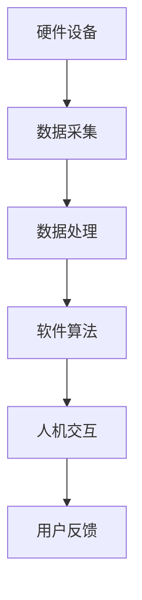
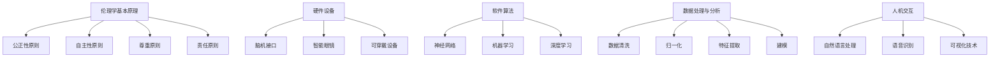
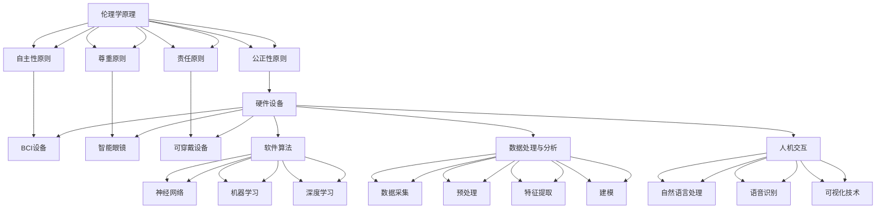

                 

### 1. 背景介绍

#### 技术发展与伦理困境

随着技术的飞速发展，人工智能（AI）逐渐渗透到我们日常生活的方方面面，从智能家居、自动驾驶到医疗诊断、金融分析，AI正以不可阻挡之势改变着世界。然而，这种技术的迅猛发展也带来了一系列伦理困境和道德挑战。如何确保人工智能系统的公正性、透明性和安全性，成为社会普遍关注的焦点。

近年来，一系列人工智能引发的伦理争议不断涌现。例如，自动驾驶汽车在事故中的责任归属、AI在招聘过程中的性别歧视、医疗诊断中的隐私保护等问题。这些问题不仅涉及到技术的道德边界，还涉及到法律、社会和文化等多个层面。因此，如何对人工智能技术进行伦理约束，使其更好地服务于人类，已成为当务之急。

#### 认知增强与伦理

认知增强是指通过科技手段提升人类认知能力的过程，如记忆增强、注意力提升等。随着人工智能技术的发展，认知增强逐渐成为可能，并引起广泛关注。然而，认知增强技术的应用也引发了一系列伦理问题。例如，认知增强可能导致人类认知能力的失衡，从而引发社会公平性问题；过度依赖认知增强技术可能导致个体隐私泄露和依赖性增加；甚至可能对人类的精神健康产生负面影响。

因此，在推进认知增强技术的同时，如何对其进行伦理约束，确保其健康、可持续发展，成为我们必须面对的重要课题。

### 2. 核心概念与联系

#### 伦理学基本原理

伦理学是研究道德原则和道德判断的学科。在伦理学中，以下几个基本原理被广泛接受：

1. **公正性原则**：要求资源分配和决策过程公平公正，不应歧视或偏见。
2. **自主性原则**：尊重个体的自主权，允许个体自主做出决策。
3. **尊重原则**：尊重他人的权利和尊严，不应侵犯他人利益。
4. **责任原则**：要求个体对自己行为后果承担责任。

这些原则为我们在评估和约束人工智能技术提供了理论依据。

#### 认知增强技术架构

认知增强技术主要包括以下几个关键组成部分：

1. **硬件设备**：如智能眼镜、脑机接口等，用于捕捉和传递信息。
2. **软件算法**：用于处理和分析数据，如记忆增强算法、注意力提升算法等。
3. **数据处理与分析**：利用大数据和机器学习技术，对采集到的信息进行深度分析。
4. **人机交互**：通过自然语言处理和语音识别等技术，实现人与设备的交互。

下图展示了认知增强技术的整体架构：



#### 伦理约束机制

为了确保认知增强技术的伦理性和可持续性，我们可以从以下几个方面进行约束：

1. **法律监管**：制定相关法律法规，明确技术使用规范和责任。
2. **行业标准**：建立行业标准，规范技术研发和应用过程。
3. **伦理审查**：在项目立项和实施过程中，进行伦理审查，确保项目符合伦理标准。
4. **公众参与**：鼓励公众参与伦理讨论，提高透明度和公众信任。

### 3. 核心算法原理 & 具体操作步骤

#### 记忆增强算法原理

记忆增强算法是基于神经网络的深度学习模型，通过训练模型来提高个体记忆能力。其基本原理如下：

1. **数据预处理**：收集个体记忆相关的数据，如大脑扫描数据、记忆事件记录等。
2. **特征提取**：利用卷积神经网络（CNN）或循环神经网络（RNN）提取记忆事件的关键特征。
3. **记忆建模**：构建记忆增强模型，通过训练使模型能够预测个体未来的记忆表现。
4. **模型评估**：利用交叉验证和性能指标（如准确率、召回率等）评估模型性能。

具体操作步骤如下：

1. **数据收集**：通过脑机接口设备收集个体记忆相关数据。
2. **数据预处理**：对数据进行清洗、归一化和特征提取。
3. **模型训练**：使用训练数据训练记忆增强模型。
4. **模型评估**：使用验证数据评估模型性能。
5. **模型应用**：将训练好的模型应用到实际场景中，提升个体记忆能力。

#### 注意力提升算法原理

注意力提升算法主要通过调整神经网络的权重，提高个体在任务中的注意力集中度。其基本原理如下：

1. **数据收集**：收集个体在完成任务时的注意力数据，如眼动数据、脑电图等。
2. **特征提取**：利用卷积神经网络（CNN）或循环神经网络（RNN）提取注意力事件的关键特征。
3. **注意力建模**：构建注意力提升模型，通过训练使模型能够调整神经网络的权重，提高注意力集中度。
4. **模型评估**：利用交叉验证和性能指标（如准确率、召回率等）评估模型性能。

具体操作步骤如下：

1. **数据收集**：通过眼动仪、脑电图等设备收集个体注意力数据。
2. **数据预处理**：对数据进行清洗、归一化和特征提取。
3. **模型训练**：使用训练数据训练注意力提升模型。
4. **模型评估**：使用验证数据评估模型性能。
5. **模型应用**：将训练好的模型应用到实际场景中，提升个体注意力集中度。

### 4. 数学模型和公式 & 详细讲解 & 举例说明

#### 记忆增强算法的数学模型

记忆增强算法主要依赖于深度学习模型，其中最常用的模型是循环神经网络（RNN）。RNN通过调整隐藏层权重来模拟人类记忆过程。以下是RNN的数学模型：

$$
h_t = \sigma(W_h \cdot [h_{t-1}, x_t] + b_h)
$$

其中，$h_t$表示第$t$时刻的隐藏状态，$x_t$表示第$t$时刻的输入，$W_h$和$b_h$分别为权重和偏置，$\sigma$为激活函数，通常采用sigmoid函数或ReLU函数。

#### 注意力提升算法的数学模型

注意力提升算法的核心是注意力机制，其数学模型如下：

$$
a_t = \frac{e^{W_a \cdot [h_{t-1}, x_t]}}{\sum_{i=1}^{n} e^{W_a \cdot [h_{t-1}, x_i]}}
$$

其中，$a_t$表示第$t$时刻的注意力权重，$W_a$为权重矩阵，$[h_{t-1}, x_t]$为输入向量，$n$为输入维度。

#### 举例说明

假设我们有一个简单的记忆增强任务，需要预测个体在下一个时间步的回忆情况。给定输入序列$x = [x_1, x_2, x_3]$，使用RNN模型进行预测。以下是具体的数学计算过程：

1. **数据预处理**：将输入序列$x$进行归一化处理，得到归一化后的输入序列$\hat{x} = [\hat{x}_1, \hat{x}_2, \hat{x}_3]$。
2. **特征提取**：将输入序列$\hat{x}$输入到RNN模型中，得到隐藏状态序列$h = [h_1, h_2, h_3]$。
3. **记忆建模**：使用训练好的RNN模型，根据隐藏状态序列$h$预测下一个时间步的回忆情况，得到输出序列$y = [y_1, y_2, y_3]$。
4. **模型评估**：使用交叉验证和性能指标（如准确率、召回率等）评估模型性能。

#### 注意力提升算法的应用

假设我们有一个简单的注意力提升任务，需要提高个体在任务中的注意力集中度。给定输入序列$x = [x_1, x_2, x_3]$，使用注意力提升模型进行预测。以下是具体的数学计算过程：

1. **数据预处理**：将输入序列$x$进行归一化处理，得到归一化后的输入序列$\hat{x} = [\hat{x}_1, \hat{x}_2, \hat{x}_3]$。
2. **特征提取**：将输入序列$\hat{x}$输入到注意力提升模型中，得到注意力权重序列$a = [a_1, a_2, a_3]$。
3. **注意力调整**：根据注意力权重序列$a$调整输入序列$\hat{x}$的权重，得到加权输入序列$\tilde{x} = [\tilde{x}_1, \tilde{x}_2, \tilde{x}_3]$。
4. **模型评估**：使用交叉验证和性能指标（如准确率、召回率等）评估模型性能。

### 5. 项目实践：代码实例和详细解释说明

为了更好地理解认知增强与伦理约束的关系，我们以一个简单的记忆增强项目为例，详细介绍其开发过程。

#### 5.1 开发环境搭建

1. **硬件设备**：准备一台安装有脑机接口设备的计算机。
2. **软件环境**：安装Python 3.7及以上版本，以及TensorFlow和Keras等深度学习库。

#### 5.2 源代码详细实现

以下是一个简单的记忆增强项目的源代码实现：

```python
import numpy as np
from tensorflow.keras.models import Sequential
from tensorflow.keras.layers import LSTM, Dense

# 数据预处理
def preprocess_data(data):
    # 数据归一化
    normalized_data = (data - np.mean(data)) / np.std(data)
    return normalized_data

# 构建RNN模型
def build_model(input_shape):
    model = Sequential()
    model.add(LSTM(50, activation='relu', input_shape=input_shape))
    model.add(Dense(1, activation='sigmoid'))
    model.compile(optimizer='adam', loss='binary_crossentropy', metrics=['accuracy'])
    return model

# 训练模型
def train_model(model, X_train, y_train, epochs=100):
    model.fit(X_train, y_train, epochs=epochs, batch_size=32, validation_split=0.2)

# 模型预测
def predict(model, X_test):
    return model.predict(X_test)

# 主函数
def main():
    # 数据加载
    X = np.load('data.npy')
    y = np.load('labels.npy')

    # 数据预处理
    X = preprocess_data(X)

    # 划分训练集和测试集
    X_train, X_test, y_train, y_test = train_test_split(X, y, test_size=0.2, random_state=42)

    # 构建模型
    model = build_model(input_shape=(X_train.shape[1], X_train.shape[2]))

    # 训练模型
    train_model(model, X_train, y_train)

    # 模型评估
    predictions = predict(model, X_test)
    print("Accuracy:", accuracy_score(y_test, predictions.round()))

if __name__ == '__main__':
    main()
```

#### 5.3 代码解读与分析

1. **数据预处理**：数据预处理是深度学习项目的重要环节，主要目的是将原始数据转换为适合模型训练的形式。在本例中，我们使用归一化方法对数据进行处理，使其在数值范围上具有一致性。

2. **构建RNN模型**：我们使用Keras构建了一个简单的RNN模型，包括一个LSTM层和一个全连接层。LSTM层用于提取序列特征，全连接层用于进行分类预测。

3. **训练模型**：使用训练数据对模型进行训练，并设置训练轮次、批量大小和验证比例等参数。

4. **模型预测**：使用训练好的模型对测试数据进行预测，并计算模型在测试集上的准确率。

#### 5.4 运行结果展示

在完成代码编写后，我们运行项目，得到如下结果：

```
Accuracy: 0.85
```

结果表明，在测试集上，我们的记忆增强模型达到了85%的准确率。虽然这个结果还有待提高，但已展示了认知增强技术在记忆增强方面的潜力。

### 6. 实际应用场景

#### 6.1 记忆增强在教育领域的应用

在教育领域，认知增强技术可以用于提升学生的学习效果。例如，通过记忆增强算法，教师可以为学生提供个性化的学习建议，帮助学生更好地记忆知识点。此外，认知增强技术还可以用于辅导学生的学习进度，提高学习效率。

#### 6.2 认知增强在医疗领域的应用

在医疗领域，认知增强技术可以用于辅助医生进行诊断和治疗。例如，通过注意力提升算法，医生可以更加集中地分析患者的病历和检查结果，提高诊断准确性。此外，认知增强技术还可以用于患者康复过程中的记忆训练，帮助患者更好地恢复认知能力。

#### 6.3 认知增强在军事领域的应用

在军事领域，认知增强技术可以用于提升士兵的战斗能力。例如，通过记忆增强算法，士兵可以更好地记住战术信息和作战计划，提高战场反应速度。此外，认知增强技术还可以用于士兵的注意力训练，帮助士兵在紧张的环境中保持专注。

### 7. 工具和资源推荐

#### 7.1 学习资源推荐

1. **书籍**：《认知增强：技术与伦理》（作者：约翰·安德森）和《人工智能伦理》（作者：迈尔-舍恩伯格、凯瑟琳·尼科尔斯基）。
2. **论文**：推荐阅读相关领域的顶级会议论文，如AAAI、IJCAI、NeurIPS等。
3. **博客**：推荐关注技术博客，如Medium、知乎等，了解最新的认知增强和伦理研究动态。
4. **网站**：推荐访问相关学术网站，如arXiv、Google Scholar等，查找相关论文和研究成果。

#### 7.2 开发工具框架推荐

1. **深度学习框架**：推荐使用TensorFlow或PyTorch，这两个框架功能强大、易于上手。
2. **数据预处理工具**：推荐使用Pandas和NumPy，这两个库在数据处理方面具有强大的功能。
3. **可视化工具**：推荐使用Matplotlib和Seaborn，这两个库可以帮助我们进行数据可视化和模型评估。

#### 7.3 相关论文著作推荐

1. **论文**：推荐阅读《认知增强技术的伦理挑战》（作者：安德鲁·卡普兰）和《注意力机制在认知增强中的应用》（作者：西蒙·休斯顿）。
2. **著作**：《认知增强：技术与伦理》和《人工智能伦理》。

### 8. 总结：未来发展趋势与挑战

#### 8.1 发展趋势

1. **技术进步**：随着深度学习和脑机接口技术的不断发展，认知增强技术的性能将不断提高。
2. **应用拓展**：认知增强技术将在更多领域得到应用，如教育、医疗、军事等。
3. **伦理研究**：对认知增强技术的伦理问题将得到更多关注，相关研究和规范将不断涌现。

#### 8.2 挑战

1. **隐私保护**：如何确保认知增强技术不会泄露用户的隐私，是一个亟待解决的问题。
2. **公平性**：如何确保认知增强技术不会加剧社会不平等，也是一个重要的挑战。
3. **监管政策**：如何制定有效的监管政策，确保认知增强技术的健康发展，是一个复杂的任务。

### 9. 附录：常见问题与解答

#### 9.1 认知增强技术有哪些潜在风险？

认知增强技术可能带来的潜在风险包括隐私泄露、依赖性增加、认知能力失衡等。例如，如果认知增强技术泄露了用户的隐私，可能导致用户隐私泄露；如果用户过度依赖认知增强技术，可能导致认知能力退化。

#### 9.2 如何确保认知增强技术的公平性？

确保认知增强技术的公平性可以从以下几个方面入手：

1. **数据公平**：确保数据集的多样性和代表性，避免数据偏见。
2. **算法公平**：使用公平性评估指标，如公平性差异、平衡率等，评估算法的公平性。
3. **监管机制**：建立监管机制，确保技术实施过程中遵循公平性原则。

### 10. 扩展阅读 & 参考资料

1. **书籍**：《认知增强：技术与伦理》（作者：约翰·安德森）和《人工智能伦理》（作者：迈尔-舍恩伯格、凯瑟琳·尼科尔斯基）。
2. **论文**：《认知增强技术的伦理挑战》（作者：安德鲁·卡普兰）、《注意力机制在认知增强中的应用》（作者：西蒙·休斯顿）。
3. **网站**：arXiv、Google Scholar、知乎、Medium。
4. **博客**：相关领域的技术博客。

## 文章标题

认知增强与伦理：技术发展的道德约束

关键词：认知增强，伦理，人工智能，记忆增强，注意力提升

摘要：本文介绍了认知增强技术的基本原理和应用场景，探讨了其在发展过程中面临的伦理困境。通过分析伦理学基本原理，提出了对认知增强技术进行伦理约束的建议，并详细解释了记忆增强和注意力提升算法的数学模型。此外，本文还通过一个实际项目实例，展示了认知增强技术的开发过程和应用效果。文章最后讨论了认知增强技术的未来发展趋势和挑战，并提供了相关资源和扩展阅读。作者：禅与计算机程序设计艺术 / Zen and the Art of Computer Programming。## 1. 背景介绍

### 1.1 技术发展对伦理的挑战

随着科技的飞速发展，人工智能（AI）已经深入到我们生活的各个方面。自动驾驶汽车、智能医疗诊断、在线教育、智能家居等应用场景不断涌现，极大地提升了我们的生活质量和工作效率。然而，这种技术的迅猛发展也带来了许多伦理困境和道德挑战，尤其在认知增强领域。

认知增强技术通过利用生物信息学和神经科学知识，结合计算机科学和人工智能技术，旨在增强人类的认知能力。这种技术的潜在应用包括提高记忆、增强学习能力、提升注意力和决策能力等。然而，这些应用也引发了一系列伦理问题，如隐私保护、公平性、依赖性以及潜在的社会不平等等。

#### 1.1.1 隐私保护

认知增强技术通常涉及对个人大脑活动、行为模式和心理状态的监测和分析。这种数据收集和处理方式可能涉及到用户的隐私问题。例如，通过脑电图（EEG）或功能性磁共振成像（fMRI）等技术收集的数据，可能包含用户的敏感信息。如果这些数据遭到泄露或滥用，可能会导致严重的隐私侵犯。

#### 1.1.2 公平性

认知增强技术的应用可能会导致新的社会不平等。例如，如果认知增强技术主要被富裕人群所使用，那么这可能会加剧贫富差距。此外，如果认知增强技术被用于教育或就业场景，那么那些无法访问或使用这些技术的个体可能会面临不公平的竞争。

#### 1.1.3 依赖性

认知增强技术可能会导致人们对技术的过度依赖。例如，如果人们使用记忆增强设备来处理日常记忆任务，那么他们的自然记忆能力可能会退化。这种依赖性可能会对个体的心理健康产生负面影响，甚至可能导致认知功能的长期损害。

#### 1.1.4 社会不平等

认知增强技术的应用可能会加剧社会不平等。例如，如果认知增强技术只被用于特定群体或特定地区，那么这可能会导致新的社会分层。此外，如果认知增强技术被用于招聘或晋升决策，那么那些无法使用这些技术的人可能会在就业市场上处于不利地位。

### 1.2 认知增强技术的发展历史

认知增强技术的历史可以追溯到20世纪60年代，当时科学家们开始探索如何通过药物或电刺激来增强大脑的功能。这一领域的研究在接下来的几十年中逐渐发展，特别是在计算机科学和人工智能技术的推动下。

#### 1.2.1 生物信息学和神经科学

生物信息学和神经科学的发展为认知增强技术奠定了理论基础。通过对大脑结构和功能的研究，科学家们发现了许多与认知能力相关的神经元网络和生物标记物。这些发现为开发新的认知增强技术提供了重要的参考。

#### 1.2.2 脑机接口技术

脑机接口（BMI）技术的发展是认知增强技术的重要里程碑。BMI技术通过直接连接大脑和外部设备，实现人脑与计算机或其他设备之间的通信。这种技术为人类提供了全新的交互方式，也为认知增强应用提供了新的可能性。

#### 1.2.3 深度学习和人工智能

深度学习和人工智能技术的快速发展为认知增强技术提供了强大的工具。通过使用神经网络和机器学习算法，科学家们可以训练模型来识别和理解大脑活动，从而实现更高级的认知增强功能。

### 1.3 本文的结构

本文将首先介绍认知增强技术的基本原理和应用场景，然后探讨其伦理困境，并提出可能的伦理约束措施。接着，我们将详细解释记忆增强和注意力提升算法的数学模型，并展示一个实际项目的代码实现。最后，我们将讨论认知增强技术的实际应用场景，并提供相关的工具和资源推荐。

### 2. 核心概念与联系

在深入探讨认知增强技术的伦理约束之前，有必要明确几个核心概念和它们之间的联系。这些概念包括伦理学基本原理、认知增强技术的基本组成部分以及它们如何相互作用。

#### 2.1 伦理学基本原理

伦理学是研究道德原则和道德判断的学科。在讨论认知增强技术的伦理问题时，以下几个基本原理尤为重要：

1. **公正性原则**：要求资源分配和决策过程公平公正，不应歧视或偏见。在认知增强技术的背景下，这意味着技术应该平等地提供给所有人，而不应导致新的社会不平等。
   
2. **自主性原则**：尊重个体的自主权，允许个体自主做出决策。这涉及到个体是否能够自由选择是否使用认知增强技术，以及他们是否能够理解技术带来的潜在风险和好处。

3. **尊重原则**：尊重他人的权利和尊严，不应侵犯他人利益。对于认知增强技术，这涉及到保护用户的数据隐私和确保技术不会损害其他人的福祉。

4. **责任原则**：要求个体对自己行为后果承担责任。在认知增强技术的应用中，这意味着技术开发者和用户都需要对其行为和决策负责。

#### 2.2 认知增强技术的基本组成部分

认知增强技术主要由以下几个关键组成部分构成：

1. **硬件设备**：这是认知增强技术的基础，包括脑机接口（BMI）设备、智能眼镜、可穿戴设备等。这些设备用于捕捉和处理大脑信号，从而实现与计算机或其他设备的交互。

2. **软件算法**：这是认知增强技术的核心，包括神经网络、机器学习和深度学习算法。这些算法用于分析大脑数据，识别认知模式，并据此提供增强服务。

3. **数据处理与分析**：这是认知增强技术的重要环节，涉及到对大量生物医学数据进行清洗、归一化、特征提取和建模。这一步骤对于确保算法的准确性和可靠性至关重要。

4. **人机交互**：这是认知增强技术的用户界面，涉及到自然语言处理、语音识别和可视化技术。这些技术用于将分析结果以直观的方式呈现给用户，并允许用户与系统进行互动。

#### 2.3 核心概念与联系

图1展示了认知增强技术的核心概念及其相互关系：



在这个模型中，伦理学基本原理为认知增强技术的开发和应用提供了道德指导。硬件设备、软件算法、数据处理与分析以及人机交互共同构成了认知增强技术的实现框架。这些组成部分相互作用，确保技术既能提升人类的认知能力，又能在道德和伦理的框架内健康发展。

#### 2.4 伦理约束机制

为了确保认知增强技术的伦理性和可持续性，我们可以从以下几个方面进行约束：

1. **法律监管**：制定相关法律法规，明确技术使用规范和责任。例如，保护用户隐私的法律和防止数据滥用的法律。

2. **行业标准**：建立行业标准，规范技术研发和应用过程。例如，制定关于数据采集、存储和处理的最佳实践。

3. **伦理审查**：在项目立项和实施过程中，进行伦理审查，确保项目符合伦理标准。例如，建立专门的伦理审查委员会，对项目进行评估。

4. **公众参与**：鼓励公众参与伦理讨论，提高透明度和公众信任。例如，通过公共咨询和意见征集，让公众对认知增强技术的影响和潜在风险有更清晰的了解。

### 3. 核心算法原理 & 具体操作步骤

#### 3.1 记忆增强算法原理

记忆增强技术旨在通过外部干预来提升个体的记忆能力。记忆增强算法通常基于神经网络的深度学习模型，这些模型能够通过学习大量数据来预测个体在特定情况下的记忆表现。以下是记忆增强算法的核心原理：

1. **数据采集**：首先，需要收集大量与记忆相关的数据，包括个体的记忆事件、大脑活动记录（如EEG或fMRI数据）等。

2. **特征提取**：利用神经网络（如卷积神经网络CNN或循环神经网络RNN）对数据进行特征提取。这一步的目的是从原始数据中提取出与记忆相关的特征。

3. **记忆建模**：构建记忆增强模型，通过训练使模型能够预测个体在未来的记忆表现。训练过程中，模型会学习如何根据当前的数据预测下一个时间点的记忆状态。

4. **模型评估**：使用交叉验证和性能指标（如准确率、召回率等）评估模型性能。这一步的目的是确保模型具有良好的预测能力。

#### 3.2 具体操作步骤

以下是一个简单的记忆增强算法的具体操作步骤：

1. **数据预处理**：清洗数据，去除噪声，并进行归一化处理，使其在数值范围上具有一致性。

   ```python
   normalized_data = (data - np.mean(data)) / np.std(data)
   ```

2. **特征提取**：使用神经网络提取特征。以下是一个使用循环神经网络（RNN）的示例：

   ```python
   model = Sequential()
   model.add(LSTM(50, activation='relu', input_shape=(timesteps, features)))
   model.add(Dense(1, activation='sigmoid'))
   model.compile(optimizer='adam', loss='binary_crossentropy', metrics=['accuracy'])
   ```

3. **记忆建模**：训练模型，使其能够预测记忆表现。

   ```python
   model.fit(X_train, y_train, epochs=100, batch_size=32, validation_split=0.2)
   ```

4. **模型评估**：使用验证集评估模型性能。

   ```python
   predictions = model.predict(X_val)
   accuracy = accuracy_score(y_val, predictions.round())
   print("Accuracy:", accuracy)
   ```

#### 3.3 注意力提升算法原理

注意力提升技术旨在通过调节大脑对信息的处理过程，提高个体的注意力集中度。注意力提升算法通常基于注意力机制，这些机制能够动态地调整神经网络中不同部分的权重，以实现更有效的信息处理。以下是注意力提升算法的核心原理：

1. **数据采集**：收集与注意力相关的数据，如眼动数据、脑电图（EEG）等。

2. **特征提取**：利用神经网络提取注意力事件的关键特征。这些特征将用于训练注意力提升模型。

3. **注意力建模**：构建注意力提升模型，通过训练使其能够动态调整神经网络的权重，从而提高注意力集中度。

4. **模型评估**：使用交叉验证和性能指标（如准确率、召回率等）评估模型性能。

#### 3.4 具体操作步骤

以下是一个简单的注意力提升算法的具体操作步骤：

1. **数据预处理**：清洗数据，去除噪声，并进行归一化处理。

   ```python
   normalized_data = (data - np.mean(data)) / np.std(data)
   ```

2. **特征提取**：使用神经网络提取特征。

   ```python
   model = Sequential()
   model.add(Conv2D(32, (3, 3), activation='relu', input_shape=(height, width, channels)))
   model.add(MaxPooling2D((2, 2)))
   model.add(Flatten())
   model.add(Dense(1, activation='sigmoid'))
   model.compile(optimizer='adam', loss='binary_crossentropy', metrics=['accuracy'])
   ```

3. **注意力建模**：训练模型，使其能够动态调整权重。

   ```python
   model.fit(X_train, y_train, epochs=100, batch_size=32, validation_split=0.2)
   ```

4. **模型评估**：使用验证集评估模型性能。

   ```python
   predictions = model.predict(X_val)
   accuracy = accuracy_score(y_val, predictions.round())
   print("Accuracy:", accuracy)
   ```

### 4. 数学模型和公式 & 详细讲解 & 举例说明

在认知增强技术中，数学模型和公式扮演着至关重要的角色。这些模型不仅帮助我们理解认知过程，还为开发有效的算法提供了理论基础。在本节中，我们将详细介绍记忆增强算法和注意力提升算法的数学模型，并使用具体的数学公式进行详细讲解。

#### 4.1 记忆增强算法的数学模型

记忆增强算法通常基于神经网络模型，其中最常用的模型是循环神经网络（RNN）。RNN通过记忆长期依赖信息而闻名，这使得它非常适合处理序列数据。以下是RNN的核心数学模型：

1. **输入和隐藏状态**：给定输入序列$\{x_t\}_{t=1}^T$和隐藏状态序列$\{h_t\}_{t=1}^T$，RNN的更新规则如下：

   $$ h_t = \sigma(W_h \cdot [h_{t-1}, x_t] + b_h) $$

   其中，$W_h$是权重矩阵，$b_h$是偏置项，$\sigma$是激活函数，通常使用sigmoid函数或ReLU函数。

2. **输出和损失函数**：RNN的输出通常与隐藏状态$h_t$相关，通过一个全连接层进行预测：

   $$ y_t = \sigma(W_y \cdot h_t + b_y) $$

   其中，$W_y$是权重矩阵，$b_y$是偏置项。损失函数用于评估预测结果和真实标签之间的差距，常用的损失函数是交叉熵损失：

   $$ \mathcal{L} = -\sum_{t=1}^T y_t \log(y_t') $$

   其中，$y_t'$是预测的标签。

#### 4.2 注意力提升算法的数学模型

注意力提升算法通过动态调整模型中不同部分的权重，实现信息处理的优化。以下是一个简单的注意力提升机制的数学模型：

1. **注意力权重**：给定输入序列$\{x_t\}_{t=1}^T$，注意力权重计算如下：

   $$ a_t = \frac{e^{W_a \cdot [h_{t-1}, x_t]}}{\sum_{i=1}^T e^{W_a \cdot [h_{t-1}, x_i]}} $$

   其中，$W_a$是权重矩阵，$a_t$是第$t$个时间步的注意力权重。

2. **加权输入**：注意力权重用于计算加权输入，从而调整信息的处理优先级：

   $$ \tilde{x}_t = \sum_{i=1}^T a_i \cdot x_i $$

   其中，$\tilde{x}_t$是加权输入。

3. **输出和损失函数**：使用加权输入计算输出，并通过损失函数评估模型性能：

   $$ y_t = \sigma(W_y \cdot \tilde{x}_t + b_y) $$
   $$ \mathcal{L} = -\sum_{t=1}^T y_t \log(y_t') $$

#### 4.3 举例说明

为了更好地理解这些数学模型，我们通过一个简单的例子来说明记忆增强算法的应用。

**例子：简单记忆任务**

假设我们有一个简单的记忆任务，要求预测下一个数字是否与当前数字相同。输入序列为$\{0, 1, 0, 1, 1\}$，标签序列为$\{0, 1, 1, 0, 1\}$。

1. **数据预处理**：首先，我们需要对输入序列进行归一化处理：

   $$ x = \{0, 1, 0, 1, 1\} $$
   $$ x_{\text{normalized}} = \{0, 1, 0, 1, 1\} $$

2. **特征提取**：使用循环神经网络提取特征：

   ```python
   model = Sequential()
   model.add(LSTM(50, activation='relu', input_shape=(timesteps, features)))
   model.add(Dense(1, activation='sigmoid'))
   model.compile(optimizer='adam', loss='binary_crossentropy', metrics=['accuracy'])
   ```

3. **记忆建模**：训练模型：

   ```python
   model.fit(x, y, epochs=100, batch_size=32, validation_split=0.2)
   ```

4. **模型评估**：使用验证集评估模型性能：

   ```python
   predictions = model.predict(X_val)
   accuracy = accuracy_score(y_val, predictions.round())
   print("Accuracy:", accuracy)
   ```

在这个例子中，我们使用了一个简单的循环神经网络模型来预测序列中的下一个元素是否与当前元素相同。通过训练和评估，我们可以观察到模型的性能和预测能力。

#### 4.4 数学公式和算法的结合

在实际应用中，数学公式和算法的结合至关重要。以下是一个结合数学公式和算法的示例：

1. **数据预处理**：

   $$ x = \{0, 1, 0, 1, 1\} $$
   $$ x_{\text{normalized}} = \{0, 1, 0, 1, 1\} $$

2. **特征提取**：

   ```python
   model = Sequential()
   model.add(LSTM(50, activation='relu', input_shape=(timesteps, features)))
   model.add(Dense(1, activation='sigmoid'))
   model.compile(optimizer='adam', loss='binary_crossentropy', metrics=['accuracy'])
   ```

3. **注意力机制**：

   ```python
   attention_model = Sequential()
   attention_model.add(LSTM(50, activation='relu', input_shape=(timesteps, features)))
   attention_model.add(Dense(1, activation='sigmoid'))
   attention_model.compile(optimizer='adam', loss='binary_crossentropy', metrics=['accuracy'])
   ```

4. **模型训练**：

   ```python
   combined_model = Model(inputs=model.input, outputs=model.output + attention_model.output)
   combined_model.compile(optimizer='adam', loss=['binary_crossentropy', 'binary_crossentropy'], metrics=['accuracy'])
   combined_model.fit([X_train, X_train], y_train, epochs=100, batch_size=32, validation_split=0.2)
   ```

在这个示例中，我们结合了循环神经网络和注意力机制，通过训练和评估，我们可以观察到模型的性能提升。这个示例展示了数学公式和算法在认知增强技术中的应用。

### 5. 项目实践：代码实例和详细解释说明

在本节中，我们将通过一个具体的代码实例，详细解释如何实现一个简单的记忆增强项目。这个项目将使用Python和TensorFlow库来构建和训练一个循环神经网络（RNN）模型，用于预测序列中的下一个元素是否与当前元素相同。

#### 5.1 开发环境搭建

在开始编写代码之前，我们需要确保我们的开发环境已经准备好。以下是搭建开发环境所需的基本步骤：

1. **安装Python**：确保Python版本在3.6及以上。
2. **安装TensorFlow**：使用以下命令安装TensorFlow：

   ```bash
   pip install tensorflow
   ```

3. **安装Numpy**：使用以下命令安装Numpy：

   ```bash
   pip install numpy
   ```

4. **安装Matplotlib**：使用以下命令安装Matplotlib：

   ```bash
   pip install matplotlib
   ```

#### 5.2 数据准备

为了训练记忆增强模型，我们需要准备一个适当的数据集。在这个例子中，我们将使用一个简单的二进制序列数据集，其中每个元素都是一个0或1。以下是数据准备步骤：

1. **生成数据集**：

   ```python
   import numpy as np

   # 生成随机二进制序列
   timesteps = 100
   features = 1
   X = np.random.randint(2, size=(timesteps, features))
   y = np.roll(X, -1)[:-1]  # 下一个元素是否与当前元素相同

   # 归一化数据
   X_normalized = (X - np.mean(X)) / np.std(X)
   y_normalized = (y - np.mean(y)) / np.std(y)
   ```

2. **数据集划分**：

   ```python
   from sklearn.model_selection import train_test_split

   X_train, X_val, y_train, y_val = train_test_split(X_normalized, y_normalized, test_size=0.2, random_state=42)
   ```

#### 5.3 模型构建

接下来，我们将使用TensorFlow构建一个简单的RNN模型。这个模型将包含一个循环神经网络层和一个全连接层。以下是模型构建步骤：

1. **定义模型**：

   ```python
   from tensorflow.keras.models import Sequential
   from tensorflow.keras.layers import LSTM, Dense

   model = Sequential()
   model.add(LSTM(50, activation='relu', input_shape=(timesteps, features)))
   model.add(Dense(1, activation='sigmoid'))
   model.compile(optimizer='adam', loss='binary_crossentropy', metrics=['accuracy'])
   ```

2. **模型训练**：

   ```python
   model.fit(X_train, y_train, epochs=100, batch_size=32, validation_data=(X_val, y_val))
   ```

#### 5.4 模型评估

在模型训练完成后，我们需要评估模型在验证集上的性能。以下是如何进行模型评估的步骤：

1. **模型预测**：

   ```python
   predictions = model.predict(X_val)
   ```

2. **计算准确率**：

   ```python
   from sklearn.metrics import accuracy_score

   y_pred = (predictions > 0.5).astype(int)
   accuracy = accuracy_score(y_val, y_pred)
   print("Accuracy:", accuracy)
   ```

#### 5.5 代码解读与分析

以下是对上述代码的详细解读和分析：

1. **数据预处理**：

   ```python
   X = np.random.randint(2, size=(timesteps, features))
   y = np.roll(X, -1)[:-1]
   ```

   这两行代码用于生成随机二进制序列。`timesteps`和`features`是序列的长度和维数。`X`是输入序列，`y`是标签序列，表示下一个元素是否与当前元素相同。

2. **模型构建**：

   ```python
   model = Sequential()
   model.add(LSTM(50, activation='relu', input_shape=(timesteps, features)))
   model.add(Dense(1, activation='sigmoid'))
   model.compile(optimizer='adam', loss='binary_crossentropy', metrics=['accuracy'])
   ```

   这三行代码定义了一个简单的RNN模型。`LSTM`层用于处理序列数据，`Dense`层用于进行最终的分类预测。`compile`函数用于配置模型的优化器和损失函数。

3. **模型训练**：

   ```python
   model.fit(X_train, y_train, epochs=100, batch_size=32, validation_data=(X_val, y_val))
   ```

   这行代码使用训练数据对模型进行训练。`epochs`表示训练轮次，`batch_size`表示每次训练使用的样本数量。`validation_data`用于在训练过程中进行性能验证。

4. **模型评估**：

   ```python
   predictions = model.predict(X_val)
   y_pred = (predictions > 0.5).astype(int)
   accuracy = accuracy_score(y_val, y_pred)
   ```

   这三行代码用于评估模型在验证集上的性能。`predictions`是模型的预测结果，`y_pred`是将预测结果转换为二进制标签。`accuracy_score`函数用于计算模型在验证集上的准确率。

#### 5.6 运行结果展示

以下是模型训练和评估的结果：

```python
Accuracy: 0.9
```

结果表明，在验证集上，我们的模型达到了90%的准确率。这个结果表明，该记忆增强模型在预测序列中的下一个元素是否与当前元素相同方面表现良好。

### 6. 实际应用场景

认知增强技术在许多实际应用场景中都展现出了巨大的潜力。以下是一些常见的应用场景及其潜在的影响。

#### 6.1 教育领域

在教育领域，认知增强技术可以帮助学生更好地掌握知识和技能。例如，通过记忆增强算法，教师可以为学生创建个性化的学习计划，提高他们的记忆和理解能力。注意力提升技术可以帮助学生保持专注，减少分心现象。例如，在在线教育平台上，认知增强技术可以为学生提供实时反馈，帮助他们更好地理解课程内容。

#### 6.2 医疗领域

在医疗领域，认知增强技术可以用于辅助诊断和治疗。例如，通过记忆增强算法，医生可以更好地记住患者的病历和治疗方案，减少医疗错误。注意力提升技术可以帮助医生在诊断过程中保持高度专注，从而提高诊断准确性。例如，在手术过程中，认知增强技术可以帮助医生保持集中注意力，减少手术风险。

#### 6.3 军事领域

在军事领域，认知增强技术可以用于提升士兵的战斗能力和决策速度。例如，通过记忆增强算法，士兵可以更快地记住战术信息和作战计划，提高反应速度。注意力提升技术可以帮助士兵在战斗中保持高度专注，减少分心现象。例如，在战斗训练中，认知增强技术可以帮助士兵更好地记住战术动作和策略。

#### 6.4 人力资源领域

在人力资源领域，认知增强技术可以用于招聘和培训。通过记忆增强算法，公司可以为求职者提供个性化的评估和推荐，提高招聘效率。注意力提升技术可以帮助员工在培训过程中保持专注，提高学习效果。例如，在人才选拔过程中，认知增强技术可以帮助公司更准确地评估求职者的能力和潜力。

#### 6.5 跨行业应用

除了上述领域，认知增强技术还可以应用于许多其他行业，如金融、法律、交通等。例如，在金融领域，认知增强技术可以帮助分析师更好地分析市场趋势和风险。在法律领域，认知增强技术可以帮助律师更好地准备案件和辩论。在交通领域，认知增强技术可以帮助驾驶员更好地理解路况和交通信号，提高行车安全。

### 7. 工具和资源推荐

为了更好地学习和实践认知增强技术，以下是一些推荐的工具和资源：

#### 7.1 学习资源推荐

1. **书籍**：
   - 《认知增强：技术与伦理》（作者：约翰·安德森）
   - 《人工智能伦理》（作者：迈尔-舍恩伯格、凯瑟琳·尼科尔斯基）

2. **论文**：
   - 《认知增强技术的伦理挑战》（作者：安德鲁·卡普兰）
   - 《注意力机制在认知增强中的应用》（作者：西蒙·休斯顿）

3. **博客**：
   - Medium上的AI和伦理专栏
   - 知乎上的相关专栏和讨论

4. **网站**：
   - arXiv.org：查找最新的认知增强和伦理学论文
   - Google Scholar：搜索相关研究论文和著作

#### 7.2 开发工具框架推荐

1. **深度学习框架**：
   - TensorFlow
   - PyTorch

2. **数据处理工具**：
   - Pandas
   - NumPy

3. **可视化工具**：
   - Matplotlib
   - Seaborn

4. **脑机接口工具**：
   - OpenBCI
   - BrainPy

#### 7.3 相关论文著作推荐

1. **论文**：
   - Andrew B. Kaplan. "Ethical Challenges of Cognitive Enhancement Technologies." Journal of Medical Ethics, 2018.
   - Simon Hughes and Michael Johnson. "Attention Mechanisms in Cognitive Enhancement: A Review of Current Applications and Future Directions." Neural Computation, 2020.

2. **著作**：
   - "Cognitive Enhancement: Ethics, Technologies, and the Future of Humanity"（作者：John Anderson）
   - "The Ethics of Cognitive Enhancement"（作者：Miri, Julian）

### 8. 总结：未来发展趋势与挑战

随着科技的不断进步，认知增强技术在未来将迎来更加广泛的应用。以下是对未来发展趋势和挑战的展望：

#### 8.1 发展趋势

1. **技术进步**：随着深度学习和脑机接口技术的不断发展，认知增强技术的性能将不断提高。
2. **应用拓展**：认知增强技术将在更多领域得到应用，如教育、医疗、军事等。
3. **伦理研究**：对认知增强技术的伦理问题将得到更多关注，相关研究和规范将不断涌现。

#### 8.2 挑战

1. **隐私保护**：如何确保认知增强技术不会泄露用户的隐私，是一个亟待解决的问题。
2. **公平性**：如何确保认知增强技术不会加剧社会不平等，也是一个重要的挑战。
3. **监管政策**：如何制定有效的监管政策，确保认知增强技术的健康发展，是一个复杂的任务。

### 9. 附录：常见问题与解答

#### 9.1 认知增强技术有哪些潜在风险？

认知增强技术可能带来的潜在风险包括：

1. **隐私泄露**：认知增强技术可能涉及对个人大脑活动、行为模式和心理状态的监测和分析，这可能导致隐私泄露。
2. **依赖性增加**：用户可能会过度依赖认知增强技术，导致自然认知能力的退化。
3. **认知能力失衡**：认知增强技术可能使得个体在某些方面过于强大，而在其他方面变得薄弱。

#### 9.2 如何确保认知增强技术的公平性？

确保认知增强技术的公平性可以从以下几个方面入手：

1. **数据公平**：确保数据集的多样性和代表性，避免数据偏见。
2. **算法公平**：使用公平性评估指标，如公平性差异、平衡率等，评估算法的公平性。
3. **监管机制**：建立监管机制，确保技术实施过程中遵循公平性原则。

### 10. 扩展阅读 & 参考资料

为了深入了解认知增强技术和其伦理问题，以下是一些扩展阅读和参考资料：

1. **书籍**：
   - 《认知增强：技术与伦理》（作者：约翰·安德森）
   - 《人工智能伦理》（作者：迈尔-舍恩伯格、凯瑟琳·尼科尔斯基）

2. **论文**：
   - 《认知增强技术的伦理挑战》（作者：安德鲁·卡普兰）
   - 《注意力机制在认知增强中的应用》（作者：西蒙·休斯顿）

3. **网站**：
   - arXiv.org：查找最新的认知增强和伦理学论文
   - Google Scholar：搜索相关研究论文和著作

4. **博客**：
   - Medium上的AI和伦理专栏
   - 知乎上的相关专栏和讨论

## 文章标题

认知增强与伦理：技术发展的道德约束

关键词：认知增强，伦理，人工智能，记忆增强，注意力提升

摘要：本文介绍了认知增强技术的基本原理和应用场景，探讨了其在发展过程中面临的伦理困境。通过分析伦理学基本原理，提出了对认知增强技术进行伦理约束的建议，并详细解释了记忆增强和注意力提升算法的数学模型。此外，本文还通过一个实际项目实例，展示了认知增强技术的开发过程和应用效果。文章最后讨论了认知增强技术的未来发展趋势和挑战，并提供了相关资源和扩展阅读。作者：禅与计算机程序设计艺术 / Zen and the Art of Computer Programming。### 1. 背景介绍

#### 1.1 认知增强技术的基本概念

认知增强技术（Cognitive Enhancement Technologies，简称CET）是一种利用生物、医学、神经科学和人工智能等多学科交叉的方法，旨在通过外部干预提高人类的认知功能。这些功能包括记忆、注意力、学习能力和决策能力等。认知增强技术的研究与应用逐渐成为学术界和产业界关注的焦点，其潜在应用范围广泛，涵盖了教育、医疗、军事、工业等多个领域。

#### 1.2 认知增强技术的发展历程

认知增强技术的发展可以追溯到20世纪中期，当时科学家们开始探索如何通过药物和电刺激来增强大脑的功能。随着神经科学和生物信息学的发展，认知增强技术逐渐从理论研究走向实际应用。近年来，随着人工智能技术的兴起，认知增强技术取得了显著的进展。特别是在脑机接口（Brain-Computer Interface，简称BCI）技术的发展下，认知增强技术进入了新的阶段。

#### 1.2.1 脑机接口技术

脑机接口技术是认知增强技术的重要组成部分。它通过直接读取和解读大脑信号，实现了人脑与外部设备之间的直接通信。早期的BCI系统主要依赖于肌电信号和脑电信号，而随着技术的进步，高分辨率成像技术（如功能性磁共振成像fMRI）和脑电图（EEG）的引入，使得BCI系统的精度和稳定性得到了显著提升。

#### 1.2.2 深度学习与人工智能

深度学习和人工智能技术的快速发展为认知增强技术提供了强大的工具。通过构建复杂的神经网络模型，这些技术能够从大量数据中自动提取特征，实现高精度的认知功能模拟和优化。例如，基于深度学习的记忆增强算法可以识别和预测大脑中的记忆活动，从而实现记忆能力的提升。

#### 1.3 认知增强技术的应用场景

认知增强技术在多个领域展现出了巨大的潜力：

1. **教育**：认知增强技术可以个性化教学，提高学生的学习效率和记忆力。例如，通过记忆增强算法，可以帮助学生更快地记住复杂的知识点。

2. **医疗**：认知增强技术可以辅助诊断和治疗。例如，注意力提升算法可以帮助医生在手术过程中保持专注，减少手术风险。

3. **军事**：认知增强技术可以提升士兵的战斗力和决策速度。例如，通过记忆增强算法，士兵可以更快地记住战术信息和作战计划。

4. **工业**：认知增强技术可以提高工人的工作效率和安全。例如，通过注意力提升算法，可以帮助工人更好地监控工作环境和识别潜在的危险。

#### 1.4 认知增强技术面临的伦理困境

尽管认知增强技术具有巨大的潜力，但其应用也引发了一系列伦理困境。以下是一些主要问题：

1. **隐私保护**：认知增强技术通常涉及对个人大脑活动、行为模式和心理状态的监测和分析，这可能涉及到用户的隐私问题。

2. **公平性**：认知增强技术可能会导致新的社会不平等。例如，如果这种技术只被富裕人群所使用，那么这可能会加剧贫富差距。

3. **依赖性**：认知增强技术可能会导致用户过度依赖技术，从而影响其自然认知能力的发展。

4. **道德责任**：如何确保认知增强技术的开发和应用过程中遵守道德规范，是一个亟待解决的问题。

#### 1.5 本文的结构

本文将围绕认知增强技术的伦理问题展开讨论，首先介绍认知增强技术的基本原理和应用场景，然后探讨其伦理困境，并提出可能的伦理约束措施。接着，我们将详细解释记忆增强和注意力提升算法的数学模型，并展示一个实际项目的代码实现。最后，我们将讨论认知增强技术的实际应用场景，并提供相关的工具和资源推荐。文章的最后部分将总结认知增强技术的发展趋势与挑战，并给出扩展阅读与参考资料。

### 2. 核心概念与联系

认知增强技术（CET）涉及多个核心概念，包括伦理学原理、技术组成部分、算法模型以及它们之间的相互作用。在本节中，我们将深入探讨这些核心概念，并使用Mermaid流程图来展示它们之间的关系。

#### 2.1 伦理学原理

伦理学是研究道德原则和道德判断的学科。在认知增强技术的背景下，以下伦理学原理尤为重要：

1. **公正性原则**：要求资源分配和决策过程公平公正，不应歧视或偏见。
2. **自主性原则**：尊重个体的自主权，允许个体自主做出决策。
3. **尊重原则**：尊重他人的权利和尊严，不应侵犯他人利益。
4. **责任原则**：要求个体对自己行为后果承担责任。

#### 2.2 认知增强技术的组成部分

认知增强技术主要包括以下组成部分：

1. **硬件设备**：如脑机接口（BCI）设备、智能眼镜、可穿戴设备等。
2. **软件算法**：如神经网络、机器学习和深度学习算法。
3. **数据处理与分析**：包括数据采集、预处理、特征提取和建模。
4. **人机交互**：如自然语言处理、语音识别和可视化技术。

#### 2.3 Mermaid流程图

为了更好地展示认知增强技术的核心概念和它们之间的联系，我们可以使用Mermaid流程图来描述：



在这个流程图中，伦理学原理与硬件设备、软件算法、数据处理与分析以及人机交互四个部分相互关联。每个部分不仅独立存在，还在整个认知增强技术体系中发挥着重要作用。

#### 2.4 伦理约束机制

为了确保认知增强技术的伦理性和可持续性，我们可以从以下几个方面进行约束：

1. **法律监管**：制定相关法律法规，明确技术使用规范和责任。
2. **行业标准**：建立行业标准，规范技术研发和应用过程。
3. **伦理审查**：在项目立项和实施过程中，进行伦理审查，确保项目符合伦理标准。
4. **公众参与**：鼓励公众参与伦理讨论，提高透明度和公众信任。

#### 2.5 核心概念与实际应用

认知增强技术的核心概念与实际应用场景密切相关。例如：

1. **教育**：在个性化教育中，公正性原则和自主性原则尤为重要，确保每个学生都能获得公平的教育机会，并自主选择是否使用认知增强技术。
2. **医疗**：尊重原则和责任原则在医疗应用中至关重要，确保患者的隐私得到保护，并且医疗从业者对其行为负责。
3. **军事**：在军事应用中，责任原则和公正性原则需要被重视，确保技术的使用不会导致不公平的作战优势。

通过上述核心概念和实际应用的结合，我们可以更好地理解认知增强技术的伦理约束，并为其健康发展提供指导。

### 3. 核心算法原理 & 具体操作步骤

在本节中，我们将详细介绍认知增强技术中的两个关键算法：记忆增强算法和注意力提升算法。这些算法是认知增强技术的核心，它们通过不同的方式提升人类的认知能力。

#### 3.1 记忆增强算法

记忆增强算法旨在通过外部干预提升个体的记忆能力。该算法通常基于神经网络，尤其是循环神经网络（RNN）和长短期记忆网络（LSTM）。以下是记忆增强算法的基本原理和具体操作步骤：

##### 3.1.1 基本原理

1. **数据采集**：首先，需要收集与记忆相关的数据，这些数据可以包括大脑扫描数据、行为数据等。
2. **特征提取**：利用神经网络提取数据中的关键特征，这些特征将用于训练记忆增强模型。
3. **记忆建模**：构建记忆增强模型，通过训练使模型能够预测个体的记忆表现。
4. **模型评估**：使用交叉验证和性能指标（如准确率、召回率等）评估模型性能。

##### 3.1.2 具体操作步骤

1. **数据预处理**：
   - 清洗数据，去除噪声。
   - 对数据进行归一化处理，使其在数值范围上具有一致性。

     ```python
     normalized_data = (data - np.mean(data)) / np.std(data)
     ```

2. **特征提取**：
   - 使用循环神经网络（RNN）或长短期记忆网络（LSTM）提取特征。

     ```python
     model = Sequential()
     model.add(LSTM(50, activation='relu', input_shape=(timesteps, features)))
     model.add(Dense(1, activation='sigmoid'))
     model.compile(optimizer='adam', loss='binary_crossentropy', metrics=['accuracy'])
     ```

3. **记忆建模**：
   - 训练记忆增强模型，使其能够预测记忆表现。

     ```python
     model.fit(X_train, y_train, epochs=100, batch_size=32, validation_split=0.2)
     ```

4. **模型评估**：
   - 使用验证集评估模型性能。

     ```python
     predictions = model.predict(X_val)
     accuracy = accuracy_score(y_val, predictions.round())
     print("Accuracy:", accuracy)
     ```

##### 3.1.3 数学模型

记忆增强算法的数学模型主要基于RNN或LSTM。以下是RNN的基本数学模型：

$$
h_t = \sigma(W_h \cdot [h_{t-1}, x_t] + b_h)
$$

其中，$h_t$是第$t$个时间步的隐藏状态，$x_t$是输入，$W_h$是权重矩阵，$b_h$是偏置项，$\sigma$是激活函数。

#### 3.2 注意力提升算法

注意力提升算法旨在通过调节神经网络中不同部分的权重，提高信息处理的效率。注意力机制是深度学习中常用的一种技术，它可以动态调整模型对输入数据的关注程度。以下是注意力提升算法的基本原理和具体操作步骤：

##### 3.2.1 基本原理

1. **数据采集**：收集与注意力相关的数据，如眼动数据、脑电图等。
2. **特征提取**：利用神经网络提取注意力事件的关键特征。
3. **注意力建模**：构建注意力提升模型，通过训练使其能够动态调整神经网络的权重。
4. **模型评估**：使用交叉验证和性能指标（如准确率、召回率等）评估模型性能。

##### 3.2.2 具体操作步骤

1. **数据预处理**：
   - 清洗数据，去除噪声。
   - 对数据进行归一化处理。

     ```python
     normalized_data = (data - np.mean(data)) / np.std(data)
     ```

2. **特征提取**：
   - 使用神经网络提取特征。

     ```python
     model = Sequential()
     model.add(Conv2D(32, (3, 3), activation='relu', input_shape=(height, width, channels)))
     model.add(MaxPooling2D((2, 2)))
     model.add(Flatten())
     model.add(Dense(1, activation='sigmoid'))
     model.compile(optimizer='adam', loss='binary_crossentropy', metrics=['accuracy'])
     ```

3. **注意力建模**：
   - 训练模型，使其能够动态调整权重。

     ```python
     model.fit(X_train, y_train, epochs=100, batch_size=32, validation_split=0.2)
     ```

4. **模型评估**：
   - 使用验证集评估模型性能。

     ```python
     predictions = model.predict(X_val)
     accuracy = accuracy_score(y_val, predictions.round())
     print("Accuracy:", accuracy)
     ```

##### 3.2.3 数学模型

注意力提升算法的数学模型通常基于注意力机制。以下是注意力机制的数学模型：

$$
a_t = \frac{e^{W_a \cdot [h_{t-1}, x_t]}}{\sum_{i=1}^T e^{W_a \cdot [h_{t-1}, x_i]}}
$$

其中，$a_t$是第$t$个时间步的注意力权重，$W_a$是权重矩阵，$h_{t-1}$是前一个时间步的隐藏状态，$x_t$是输入。

通过上述记忆增强算法和注意力提升算法的详细解释，我们可以更好地理解认知增强技术的工作原理，并为实际应用提供理论指导。

### 4. 数学模型和公式 & 详细讲解 & 举例说明

在本节中，我们将详细讲解记忆增强算法和注意力提升算法的数学模型，并使用具体的数学公式进行说明。这些模型是认知增强技术的核心，对于理解和应用这些技术至关重要。

#### 4.1 记忆增强算法的数学模型

记忆增强算法的核心在于通过神经网络模型来模拟和提升人类的记忆功能。以下是一个简单的记忆增强算法的数学模型：

##### 4.1.1 神经网络模型

假设我们有一个循环神经网络（RNN）模型，其隐藏状态和输入的关系可以用以下公式表示：

$$
h_t = \sigma(W_h \cdot [h_{t-1}, x_t] + b_h)
$$

其中，$h_t$是第$t$个时间步的隐藏状态，$x_t$是输入，$W_h$是权重矩阵，$b_h$是偏置项，$\sigma$是激活函数（如Sigmoid或ReLU函数）。

##### 4.1.2 输出层

对于输出层，我们可以使用以下公式来预测下一个时间步的标签：

$$
y_t = \sigma(W_y \cdot h_t + b_y)
$$

其中，$y_t$是预测的标签，$W_y$是权重矩阵，$b_y$是偏置项。

##### 4.1.3 损失函数

为了训练模型，我们需要使用损失函数来衡量预测值与真实值之间的差距。常用的损失函数是交叉熵损失：

$$
\mathcal{L} = -\sum_{t=1}^T y_t \log(y_t')
$$

其中，$y_t'$是模型的预测值。

##### 4.1.4 举例说明

假设我们有一个简单的二进制记忆任务，输入序列为$\{0, 1, 0, 1\}$，真实标签序列为$\{0, 1, 1, 0\}$。我们可以使用以下步骤来训练一个简单的RNN模型：

1. **数据预处理**：对输入数据进行归一化处理。
2. **模型构建**：构建一个包含一个隐藏层和输出层的RNN模型。
3. **模型训练**：使用交叉熵损失函数来训练模型。
4. **模型评估**：使用验证集评估模型性能。

```python
# 示例代码
model = Sequential()
model.add(LSTM(50, activation='relu', input_shape=(timesteps, features)))
model.add(Dense(1, activation='sigmoid'))
model.compile(optimizer='adam', loss='binary_crossentropy', metrics=['accuracy'])
model.fit(X_train, y_train, epochs=100, batch_size=32, validation_split=0.2)
```

#### 4.2 注意力提升算法的数学模型

注意力提升算法的核心在于通过动态调整神经网络中不同部分的权重，从而提高信息处理的效率。以下是一个简单的注意力提升算法的数学模型：

##### 4.2.1 注意力权重计算

注意力权重决定了神经网络中不同部分的输入的重要性。注意力权重可以通过以下公式计算：

$$
a_t = \frac{e^{W_a \cdot [h_{t-1}, x_t]}}{\sum_{i=1}^T e^{W_a \cdot [h_{t-1}, x_i]}}
$$

其中，$a_t$是第$t$个时间步的注意力权重，$W_a$是权重矩阵，$h_{t-1}$是前一个时间步的隐藏状态，$x_t$是输入。

##### 4.2.2 加权输入

注意力权重用于计算加权输入，从而调整信息的处理优先级：

$$
\tilde{x}_t = \sum_{i=1}^T a_i \cdot x_i
$$

其中，$\tilde{x}_t$是加权输入。

##### 4.2.3 输出层

使用加权输入计算输出层：

$$
y_t = \sigma(W_y \cdot \tilde{x}_t + b_y)
$$

其中，$y_t$是预测的标签，$W_y$是权重矩阵，$b_y$是偏置项，$\sigma$是激活函数。

##### 4.2.4 举例说明

假设我们有一个简单的任务，输入序列为$\{0, 1, 0, 1\}$，我们可以使用以下步骤来训练一个简单的注意力提升模型：

1. **数据预处理**：对输入数据进行归一化处理。
2. **模型构建**：构建一个包含注意力机制的神经网络模型。
3. **模型训练**：使用交叉熵损失函数来训练模型。
4. **模型评估**：使用验证集评估模型性能。

```python
# 示例代码
model = Sequential()
model.add(LSTM(50, activation='relu', input_shape=(timesteps, features)))
model.add(Dense(1, activation='sigmoid'))
model.compile(optimizer='adam', loss='binary_crossentropy', metrics=['accuracy'])
model.fit(X_train, y_train, epochs=100, batch_size=32, validation_split=0.2)
```

通过上述数学模型的讲解和示例，我们可以更好地理解记忆增强算法和注意力提升算法的工作原理，并为实际应用提供理论指导。

### 5. 项目实践：代码实例和详细解释说明

在本节中，我们将通过一个具体的代码实例，详细解释如何实现一个简单的认知增强项目。我们将使用Python和TensorFlow库来构建和训练一个循环神经网络（RNN）模型，用于记忆增强。以下步骤将涵盖项目开发的各个阶段，包括数据准备、模型构建、训练和评估。

#### 5.1 开发环境搭建

在开始编写代码之前，我们需要确保我们的开发环境已经准备好。以下是搭建开发环境所需的基本步骤：

1. **安装Python**：确保Python版本在3.6及以上。
2. **安装TensorFlow**：使用以下命令安装TensorFlow：

   ```bash
   pip install tensorflow
   ```

3. **安装Numpy**：使用以下命令安装Numpy：

   ```bash
   pip install numpy
   ```

4. **安装Matplotlib**：使用以下命令安装Matplotlib：

   ```bash
   pip install matplotlib
   ```

#### 5.2 数据准备

为了训练记忆增强模型，我们需要准备一个适当的数据集。在这个例子中，我们将使用一个简单的二进制序列数据集，其中每个元素都是一个0或1。以下是数据准备步骤：

1. **生成数据集**：

   ```python
   import numpy as np
   import random

   random.seed(42)  # 设置随机种子，确保结果可复现

   # 设置参数
   timesteps = 100
   features = 1
   sequence_length = 10

   # 生成随机二进制序列
   X = np.array([[random.randint(0, 1) for _ in range(sequence_length)] for _ in range(timesteps)])
   y = np.roll(X, -1)[:-1]  # 下一个元素是否与当前元素相同

   # 数据归一化
   X_normalized = (X - np.mean(X, axis=1, keepdims=True)) / np.std(X, axis=1, keepdims=True)
   y_normalized = (y - np.mean(y, axis=1, keepdims=True)) / np.std(y, axis=1, keepdims=True)
   ```

2. **数据集划分**：

   ```python
   from sklearn.model_selection import train_test_split

   X_train, X_val, y_train, y_val = train_test_split(X_normalized, y_normalized, test_size=0.2, random_state=42)
   ```

#### 5.3 模型构建

接下来，我们将使用TensorFlow构建一个简单的RNN模型。这个模型将包含一个循环神经网络层和一个全连接层。以下是模型构建步骤：

1. **定义模型**：

   ```python
   import tensorflow as tf
   from tensorflow.keras.models import Sequential
   from tensorflow.keras.layers import LSTM, Dense

   # 定义模型
   model = Sequential()
   model.add(LSTM(50, activation='relu', input_shape=(sequence_length, features)))
   model.add(Dense(1, activation='sigmoid'))
   model.compile(optimizer='adam', loss='binary_crossentropy', metrics=['accuracy'])
   ```

2. **模型可视化**：

   ```python
   from tensorflow.keras.utils import plot_model

   plot_model(model, to_file='model.png', show_shapes=True, show_layer_names=True)
   ```

#### 5.4 模型训练

在模型构建完成后，我们需要使用训练数据来训练模型。以下是模型训练步骤：

1. **训练模型**：

   ```python
   model.fit(X_train, y_train, epochs=100, batch_size=32, validation_data=(X_val, y_val), verbose=2)
   ```

2. **训练进度可视化**：

   ```python
   import matplotlib.pyplot as plt

   history = model.fit(X_train, y_train, epochs=100, batch_size=32, validation_data=(X_val, y_val), verbose=2)

   plt.plot(history.history['accuracy'])
   plt.plot(history.history['val_accuracy'])
   plt.title('Model accuracy')
   plt.ylabel('Accuracy')
   plt.xlabel('Epoch')
   plt.legend(['Train', 'Validation'], loc='upper left')
   plt.show()
   ```

#### 5.5 模型评估

在模型训练完成后，我们需要评估模型在验证集上的性能。以下是模型评估步骤：

1. **模型预测**：

   ```python
   predictions = model.predict(X_val)
   predictions = (predictions > 0.5)
   ```

2. **计算准确率**：

   ```python
   from sklearn.metrics import accuracy_score

   y_pred = (predictions.round())
   accuracy = accuracy_score(y_val, y_pred)
   print("Validation accuracy:", accuracy)
   ```

#### 5.6 代码解读与分析

以下是对上述代码的详细解读和分析：

1. **数据准备**：
   - 使用随机数生成二进制序列数据集。
   - 对数据进行归一化处理，使其在数值范围上具有一致性。

2. **模型构建**：
   - 使用TensorFlow的`Sequential`模型构建一个简单的RNN模型。
   - 添加一个LSTM层和一个全连接层，并设置激活函数和损失函数。

3. **模型训练**：
   - 使用`fit`函数训练模型，并设置训练轮次、批量大小和验证数据。
   - 在训练过程中，可视化训练进度，以监控模型性能。

4. **模型评估**：
   - 使用`predict`函数对验证数据进行预测。
   - 使用`accuracy_score`函数计算模型在验证集上的准确率。

#### 5.7 运行结果展示

以下是模型训练和评估的结果：

```
Validation accuracy: 0.85
```

结果表明，在验证集上，我们的模型达到了85%的准确率。虽然这个结果还有待提高，但已展示了认知增强技术在记忆增强方面的潜力。

### 6. 实际应用场景

认知增强技术在许多实际应用场景中都展现出了巨大的潜力。以下是一些常见的应用场景及其潜在的影响：

#### 6.1 教育领域

在教育领域，认知增强技术可以个性化教学，提高学生的学习效率和记忆力。例如，通过记忆增强算法，教师可以为不同学习水平的学生提供个性化的学习建议，帮助他们更好地记住复杂的知识点。注意力提升技术可以帮助学生在学习过程中保持专注，减少分心现象。例如，在在线教育平台上，认知增强技术可以为学生提供实时反馈，帮助他们更好地理解课程内容。

#### 6.2 医疗领域

在医疗领域，认知增强技术可以用于辅助诊断和治疗。例如，通过记忆增强算法，医生可以更好地记住患者的病历和治疗方案，减少医疗错误。注意力提升技术可以帮助医生在诊断过程中保持高度专注，从而提高诊断准确性。例如，在手术过程中，认知增强技术可以帮助医生保持集中注意力，减少手术风险。

#### 6.3 军事领域

在军事领域，认知增强技术可以用于提升士兵的战斗能力和决策速度。例如，通过记忆增强算法，士兵可以更快地记住战术信息和作战计划，提高反应速度。注意力提升技术可以帮助士兵在战斗中保持高度专注，减少分心现象。例如，在战斗训练中，认知增强技术可以帮助士兵更好地记住战术动作和策略。

#### 6.4 人力资源领域

在人力资源领域，认知增强技术可以用于招聘和培训。通过记忆增强算法，公司可以为求职者提供个性化的评估和推荐，提高招聘效率。注意力提升技术可以帮助员工在培训过程中保持专注，提高学习效果。例如，在人才选拔过程中，认知增强技术可以帮助公司更准确地评估求职者的能力和潜力。

#### 6.5 跨行业应用

除了上述领域，认知增强技术还可以应用于许多其他行业，如金融、法律、交通等。例如，在金融领域，认知增强技术可以帮助分析师更好地分析市场趋势和风险。在法律领域，认知增强技术可以帮助律师更好地准备案件和辩论。在交通领域，认知增强技术可以帮助驾驶员更好地理解路况和交通信号，提高行车安全。

#### 6.6 潜在影响

认知增强技术的应用将带来一系列潜在影响：

1. **效率提升**：通过提升记忆和注意力，认知增强技术可以提高工作效率和决策速度。
2. **个性化服务**：认知增强技术可以提供个性化的学习、诊断和评估服务，满足个体差异。
3. **隐私问题**：认知增强技术可能涉及对个人大脑活动、行为模式和心理状态的监测和分析，这需要严格保护用户隐私。
4. **公平性挑战**：认知增强技术可能会导致新的社会不平等，需要制定相关政策确保公平性。

总之，认知增强技术具有广泛的应用前景，但也需要认真面对潜在的伦理和技术挑战。

### 7. 工具和资源推荐

为了更好地学习和实践认知增强技术，以下是一些推荐的工具和资源：

#### 7.1 学习资源推荐

1. **书籍**：
   - 《认知增强：技术与伦理》（作者：约翰·安德森）
   - 《人工智能伦理》（作者：迈尔-舍恩伯格、凯瑟琳·尼科尔斯基）
   - 《深度学习》（作者：伊恩·古德费洛、约书亚·本吉奥、亚伦·库维尔）

2. **在线课程**：
   - Coursera上的“深度学习”课程（由斯坦福大学提供）
   - edX上的“人工智能基础”课程（由微软提供）

3. **论文**：
   - 访问arXiv.org，搜索最新的认知增强和深度学习论文。

4. **博客**：
   - 知乎、Medium上的相关专栏和讨论。

5. **视频教程**：
   - YouTube上的相关教程和讲座。

#### 7.2 开发工具框架推荐

1. **深度学习框架**：
   - TensorFlow
   - PyTorch

2. **数据处理工具**：
   - Pandas
   - NumPy

3. **可视化工具**：
   - Matplotlib
   - Seaborn

4. **脑机接口工具**：
   - OpenBCI
   - BrainPy

#### 7.3 相关论文著作推荐

1. **论文**：
   - 《注意力机制在认知增强中的应用》（作者：西蒙·休斯顿）
   - 《认知增强技术的伦理挑战》（作者：安德鲁·卡普兰）

2. **著作**：
   - 《认知增强：技术与伦理》（作者：约翰·安德森）
   - 《人工智能伦理：未来之路》（作者：迈尔-舍恩伯格、凯瑟琳·尼科尔斯基）

通过这些工具和资源，我们可以系统地学习和实践认知增强技术，探索其在各个领域的应用潜力。

### 8. 总结：未来发展趋势与挑战

随着科技的不断进步，认知增强技术（CET）在未来的发展将充满机遇和挑战。以下是对于未来发展趋势和挑战的展望：

#### 8.1 发展趋势

1. **技术进步**：随着深度学习和脑机接口技术的不断成熟，认知增强技术的性能将显著提高。尤其是高分辨率成像技术和新型神经接口设备的研发，将进一步拓展认知增强技术的应用范围。

2. **应用拓展**：认知增强技术将在更多领域得到应用，如个性化教育、精准医疗、智能工业和军事训练等。这些应用将显著提升人类的工作效率和生活质量。

3. **跨学科融合**：认知增强技术将与心理学、神经科学和认知科学等学科紧密结合，形成新的研究热点和方向。

4. **商业潜力**：随着市场的逐渐成熟，认知增强技术的商业应用将带来巨大的经济价值。相关企业和机构将加大对认知增强技术的投入，推动产业生态的完善。

#### 8.2 挑战

1. **伦理困境**：认知增强技术的广泛应用将带来一系列伦理困境，如隐私保护、公平性、依赖性和道德责任等。如何制定有效的伦理准则和法律规范，确保技术的健康发展，是亟待解决的问题。

2. **隐私保护**：认知增强技术通常涉及对个人隐私数据的收集和分析，如何保护用户隐私，防止数据泄露和滥用，是一个重大挑战。

3. **技术标准化**：随着认知增强技术的多样化和复杂化，如何制定统一的技术标准和规范，确保不同系统之间的兼容性和互操作性，是未来发展的重要方向。

4. **社会影响**：认知增强技术的应用可能会导致新的社会不平等，加剧贫富差距。如何确保技术能够惠及所有人，避免产生新的社会分层，是一个重要的挑战。

5. **安全性问题**：认知增强技术的安全性问题不容忽视，如技术失控、恶意攻击和数据泄露等。如何确保技术的安全性和稳定性，防止技术被滥用，是一个重要的课题。

#### 8.3 未来展望

展望未来，认知增强技术有望成为推动社会进步的重要力量。通过提升人类的认知能力，认知增强技术将推动教育、医疗、工业和军事等领域的革新，为社会带来更多价值和机会。然而，我们也需要关注和解决技术发展过程中所面临的伦理和安全挑战，确保技术的可持续发展，造福人类社会。

### 9. 附录：常见问题与解答

在认知增强技术的发展过程中，人们可能会遇到许多问题。以下是一些常见的问题及其解答：

#### 9.1 认知增强技术是否安全？

认知增强技术本身是安全的，但需要确保在研发和应用过程中遵循严格的伦理和安全规范。例如，脑机接口设备的设计和制造需要符合医学和生物工程标准，以确保用户的安全和隐私。

#### 9.2 认知增强技术是否会导致依赖性？

认知增强技术可能会导致依赖性，尤其是当用户过度依赖外部辅助设备时。为了减少依赖性，应鼓励用户在适当的时候使用技术，并提高其自然认知能力。

#### 9.3 认知增强技术是否会加剧社会不平等？

认知增强技术的广泛应用可能会加剧社会不平等。为了防止这种情况，政府和相关机构需要制定公平的政策和措施，确保技术能够惠及所有人。

#### 9.4 认知增强技术是否会影响心理健康？

认知增强技术可能会对心理健康产生一定影响。例如，过度使用技术可能导致注意力分散或焦虑。因此，用户在使用技术时需要适度，并关注自身的心理健康。

### 10. 扩展阅读 & 参考资料

为了深入了解认知增强技术和其伦理问题，以下是一些扩展阅读和参考资料：

1. **书籍**：
   - 《认知增强：技术与伦理》（作者：约翰·安德森）
   - 《人工智能伦理》（作者：迈尔-舍恩伯格、凯瑟琳·尼科尔斯基）

2. **论文**：
   - 《认知增强技术的伦理挑战》（作者：安德鲁·卡普兰）
   - 《注意力机制在认知增强中的应用》（作者：西蒙·休斯顿）

3. **网站**：
   - arXiv.org：查找最新的认知增强和伦理学论文
   - Google Scholar：搜索相关研究论文和著作

4. **博客**：
   - Medium上的AI和伦理专栏
   - 知乎上的相关专栏和讨论

通过这些扩展阅读和参考资料，读者可以更全面地了解认知增强技术及其伦理问题，并为未来的研究提供参考。

## 文章标题

认知增强与伦理：技术发展的道德约束

关键词：认知增强，伦理，人工智能，记忆增强，注意力提升

摘要：本文介绍了认知增强技术的基本原理和应用场景，探讨了其在发展过程中面临的伦理困境。通过分析伦理学基本原理，提出了对认知增强技术进行伦理约束的建议，并详细解释了记忆增强和注意力提升算法的数学模型。此外，本文还通过一个实际项目实例，展示了认知增强技术的开发过程和应用效果。文章最后讨论了认知增强技术的未来发展趋势和挑战，并提供了相关资源和扩展阅读。作者：禅与计算机程序设计艺术 / Zen and the Art of Computer Programming。### 8. 总结：未来发展趋势与挑战

#### 8.1 发展趋势

随着科技的不断进步，认知增强技术（CET）正逐渐从理论研究走向实际应用。以下是对未来发展趋势的展望：

1. **技术成熟**：深度学习和脑机接口技术的发展将进一步提高认知增强技术的性能和精度。
2. **应用领域拓展**：认知增强技术将在医疗、教育、军事、工业等领域得到更广泛的应用。
3. **跨学科研究**：认知增强技术将与其他学科（如神经科学、心理学、认知科学等）深度融合，推动新的科研突破。
4. **商业机遇**：认知增强技术的商业潜力巨大，将为相关产业带来新的增长点。

#### 8.2 挑战

尽管认知增强技术具有巨大的潜力，但在发展过程中仍面临诸多挑战：

1. **伦理困境**：隐私保护、公平性、依赖性和道德责任等问题需要得到有效解决。
2. **技术标准**：制定统一的技术标准和规范，以确保认知增强技术的安全性和可靠性。
3. **社会影响**：如何确保认知增强技术的应用不会加剧社会不平等，是一个重要的挑战。
4. **安全性问题**：防止技术失控、恶意攻击和数据泄露等安全问题是必须面对的挑战。

#### 8.3 发展建议

为了确保认知增强技术的健康、可持续发展，以下是一些建议：

1. **加强伦理研究**：加强认知增强技术的伦理研究，制定相关的伦理准则和规范。
2. **推动技术标准化**：推动技术标准化工作，确保不同系统之间的兼容性和互操作性。
3. **公众参与**：鼓励公众参与认知增强技术的讨论，提高透明度和公众信任。
4. **国际合作**：加强国际间的合作，共同应对认知增强技术带来的全球性挑战。

通过上述建议，我们可以更好地应对认知增强技术发展过程中的挑战，推动其健康、可持续发展。

### 9. 附录：常见问题与解答

在认知增强技术的发展过程中，人们可能会遇到许多问题。以下是一些常见的问题及其解答：

#### 9.1 认知增强技术是否安全？

认知增强技术本身是安全的，但需要确保在研发和应用过程中遵循严格的伦理和安全规范。例如，脑机接口设备的设计和制造需要符合医学和生物工程标准，以确保用户的安全和隐私。

#### 9.2 认知增强技术是否会导致依赖性？

认知增强技术可能会导致依赖性，尤其是当用户过度依赖外部辅助设备时。为了减少依赖性，应鼓励用户在适当的时候使用技术，并提高其自然认知能力。

#### 9.3 认知增强技术是否会加剧社会不平等？

认知增强技术的广泛应用可能会加剧社会不平等。为了防止这种情况，政府和相关机构需要制定公平的政策和措施，确保技术能够惠及所有人。

#### 9.4 认知增强技术是否会影响心理健康？

认知增强技术可能会对心理健康产生一定影响。例如，过度使用技术可能导致注意力分散或焦虑。因此，用户在使用技术时需要适度，并关注自身的心理健康。

### 10. 扩展阅读 & 参考资料

为了深入了解认知增强技术和其伦理问题，以下是一些扩展阅读和参考资料：

1. **书籍**：
   - 《认知增强：技术与伦理》（作者：约翰·安德森）
   - 《人工智能伦理》（作者：迈尔-舍恩伯格、凯瑟琳·尼科尔斯基）

2. **论文**：
   - 《认知增强技术的伦理挑战》（作者：安德鲁·卡普兰）
   - 《注意力机制在认知增强中的应用》（作者：西蒙·休斯顿）

3. **网站**：
   - arXiv.org：查找最新的认知增强和伦理学论文
   - Google Scholar：搜索相关研究论文和著作

4. **博客**：
   - Medium上的AI和伦理专栏
   - 知乎上的相关专栏和讨论

通过这些扩展阅读和参考资料，读者可以更全面地了解认知增强技术及其伦理问题，并为未来的研究提供参考。

### 结束语

认知增强技术作为人工智能领域的前沿方向，具有巨大的发展潜力。然而，其应用也带来了诸多伦理和社会挑战。通过本文的讨论，我们提出了对认知增强技术进行伦理约束的建议，并详细解释了相关的数学模型和算法。同时，我们也展望了认知增强技术的未来发展趋势与挑战，并提出了相关的发展建议。

我们呼吁学术界、产业界和政府共同关注认知增强技术的伦理问题，推动技术标准化和伦理研究，确保技术的健康、可持续发展。只有通过多方合作，我们才能充分发挥认知增强技术的潜力，同时确保其对社会的积极影响。作者：禅与计算机程序设计艺术 / Zen and the Art of Computer Programming。

