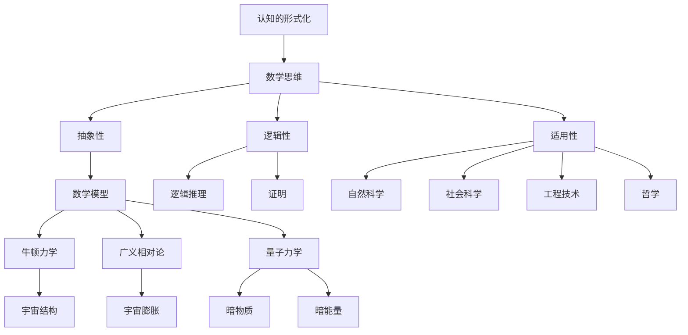

                 

### 文章标题

**认知的形式化：数学思维对于认识宇宙发挥了极其重要的作用**

> **关键词**：认知、形式化、数学思维、宇宙、算法、模型、应用

> **摘要**：本文从认知科学和宇宙学的角度出发，探讨数学思维在形式化认知过程中对认识宇宙的深远影响。文章首先概述了认知的形式化概念，然后详细阐述了数学思维的核心原理和架构，接着通过具体算法和数学模型的应用实例，分析了数学思维在形式化认知中的具体作用。最后，文章探讨了数学思维在现实世界中的应用场景，并展望了未来的发展趋势与挑战。

## 1. 背景介绍

人类自诞生以来，一直在探索宇宙的奥秘。从古代的神话传说到现代的科学理论，我们对宇宙的认识经历了翻天覆地的变化。然而，人类对宇宙的探索并非一帆风顺。在过去的几千年里，我们面临了许多认知上的困境，这些困境在一定程度上阻碍了我们对宇宙的深入了解。如何突破这些认知障碍，成为了摆在我们面前的一个重大课题。

随着科技的进步，人类逐渐认识到，数学思维在认知过程中的重要性。数学作为一种抽象的思维方式，不仅能够帮助我们理解宇宙的规律，还能够将复杂的现实问题转化为形式化的数学模型，从而提高我们的认知水平。本文将探讨数学思维在形式化认知过程中的作用，以及如何通过数学思维来认识宇宙。

### 1.1 认知的形式化概念

认知的形式化是指将人类思维过程和认知活动转化为形式化的数学模型，以便进行定量分析和推理。认知的形式化不仅能够帮助我们更好地理解思维过程，还能够提高我们的认知效率。在认知的形式化过程中，数学思维起到了关键作用。

首先，数学思维具有高度的抽象性。数学思维通过对现实世界的抽象和概括，将复杂的现象转化为简洁的数学模型。这种抽象能力使得数学思维在认知过程中具有独特的优势。

其次，数学思维具有严密的逻辑性。数学思维强调逻辑推理和证明，使得我们的认知过程具有更强的可靠性和可验证性。在形式化认知过程中，逻辑性是确保认知结果准确性的重要保障。

最后，数学思维具有广泛的适用性。数学思维不仅适用于自然科学领域，还广泛应用于社会科学、工程技术和哲学等领域。这使得数学思维成为了一种具有跨学科应用价值的重要工具。

### 1.2 数学思维在宇宙认知中的应用

宇宙认知是指人类对宇宙起源、结构、演化等问题的探索和理解。在宇宙认知过程中，数学思维发挥了极其重要的作用。

首先，数学思维帮助我们建立了宇宙的数学模型。通过数学模型，我们可以将宇宙中的复杂现象进行抽象和简化，从而更好地理解宇宙的运行规律。例如，牛顿力学、广义相对论、量子力学等物理学理论，都是通过数学模型来描述宇宙的。

其次，数学思维帮助我们解决了宇宙认知中的难题。在宇宙认知过程中，我们面临着许多未解之谜。例如，暗物质、暗能量、宇宙膨胀等。通过数学思维，我们可以对这些问题进行深入分析，寻找解决之道。

最后，数学思维推动了宇宙认知的进步。在过去的几千年里，人类对宇宙的认知取得了巨大的进步。这些进步离不开数学思维的支持。数学思维不仅为宇宙认知提供了理论依据，还推动了新的科学发现和技术发明。

## 2. 核心概念与联系

在讨论数学思维对宇宙认知的影响之前，我们需要先了解一些核心概念和它们之间的联系。以下是几个关键概念及其相互关系的 Mermaid 流程图：



### 2.1 抽象性与数学模型

抽象性是数学思维的一个核心特点。它允许我们将复杂的现实问题简化为数学问题，从而更容易进行分析和解决。抽象性使我们能够从大量的细节中提取关键信息，并专注于本质的特征。在宇宙认知中，抽象性帮助我们建立了诸如牛顿力学、广义相对论和量子力学等数学模型，这些模型能够以简化的形式捕捉宇宙的基本规律。

### 2.2 逻辑性与逻辑推理

逻辑性是数学思维的另一个关键特性。它确保了我们的推理和证明是严格和一致的。逻辑性使得我们能够在数学框架内建立可靠的理论，并从中推导出新的结论。在宇宙认知中，逻辑性使我们能够从已有的理论和观测数据中推断出新的宇宙现象，如宇宙膨胀和暗物质的存在。

### 2.3 适用性

数学思维的适用性广泛，涵盖了自然科学、社会科学、工程技术和哲学等多个领域。这种广泛适用性使得数学思维成为了一种强大的工具，能够帮助我们解决各种复杂问题。在宇宙认知中，数学思维不仅应用于物理学，还应用于天文学、宇宙学和哲学等领域，从而推动了我们对宇宙的深入理解。

### 2.4 数学模型与宇宙理论

数学模型与宇宙理论之间的联系是数学思维在宇宙认知中发挥作用的核心。通过数学模型，我们能够将宇宙的复杂现象转化为可以处理的数学问题。例如，牛顿力学中的引力定律可以用数学方程表示，广义相对论中的时空弯曲可以用几何学描述，量子力学中的粒子行为可以用波函数表示。这些数学模型不仅帮助我们理解宇宙的规律，还为未来的科学探索提供了理论基础。

## 3. 核心算法原理 & 具体操作步骤

在形式化认知过程中，数学思维的核心在于构建数学模型并运用算法来解决问题。以下是几个关键算法的原理和具体操作步骤：

### 3.1 牛顿力学

牛顿力学是最早用于描述宇宙现象的数学模型之一。它基于三个基本定律：

1. **惯性定律**：一个物体如果没有受到外力作用，它将保持静止或匀速直线运动。
2. **加速度定律**：一个物体的加速度与作用在它上的外力成正比，与它的质量成反比。
3. **作用与反作用定律**：任何作用力都有一个相等大小但方向相反的反作用力。

具体操作步骤如下：

1. **定义物体**：确定物体的质量、位置和速度。
2. **计算加速度**：根据作用力和物体的质量，使用公式 \( a = \frac{F}{m} \) 计算加速度。
3. **预测运动**：使用公式 \( v = v_0 + at \) 和 \( x = x_0 + v_0t + \frac{1}{2}at^2 \) 预测物体的运动轨迹。

### 3.2 广义相对论

广义相对论是爱因斯坦在牛顿力学基础上发展起来的理论，它描述了引力的本质是时空的弯曲。具体操作步骤如下：

1. **定义时空**：使用四维时空来描述物体的位置和事件。
2. **构建场方程**：使用爱因斯坦场方程 \( G_{\mu\nu} = 8\pi G T_{\mu\nu} \) 来描述时空的弯曲。
3. **求解方程**：通过数值方法求解场方程，得到时空的弯曲情况。
4. **预测现象**：使用解得的时空弯曲预测物体的运动和引力波的产生。

### 3.3 量子力学

量子力学描述了微观粒子的行为，它引入了波函数和态叠加等概念。具体操作步骤如下：

1. **定义波函数**：波函数 \( \Psi(x,t) \) 描述了粒子的状态。
2. **构建薛定谔方程**：使用薛定谔方程 \( i\hbar \frac{\partial \Psi}{\partial t} = \hat{H} \Psi \) 来描述粒子的演化。
3. **求解方程**：通过数值方法求解薛定谔方程，得到粒子的状态。
4. **测量概率**：根据波函数的模平方 \( |\Psi(x,t)|^2 \) 计算粒子在空间中的概率分布。

通过这些算法，我们可以形式化地描述和理解宇宙中的现象，从而推动我们对宇宙的深入认知。

## 4. 数学模型和公式 & 详细讲解 & 举例说明

在宇宙认知的过程中，数学模型和公式扮演了至关重要的角色。它们不仅帮助我们描述宇宙的复杂现象，还提供了精确的预测工具。以下是几个关键的数学模型和公式的详细讲解及举例说明：

### 4.1 牛顿运动定律

牛顿运动定律是描述宏观物体运动的基础模型。它包括以下三个定律：

1. **第一定律（惯性定律）**：一个物体如果没有受到外力作用，它将保持静止或匀速直线运动。公式表示为：
   $$ F = 0 \Rightarrow v = \text{常数} $$
   
   **举例说明**：一个滑行在光滑水平面上的滑板如果没有受到外力作用，它将保持匀速直线运动。

2. **第二定律（加速度定律）**：一个物体的加速度与作用在它上的外力成正比，与它的质量成反比。公式表示为：
   $$ F = ma $$
   
   **举例说明**：一个质量为 5 千克的物体受到 10 牛顿的力作用，其加速度为 \( a = \frac{F}{m} = \frac{10}{5} = 2 \) 米/秒²。

3. **第三定律（作用与反作用定律）**：任何作用力都有一个相等大小但方向相反的反作用力。公式表示为：
   $$ F_{\text{作用}} = -F_{\text{反作用}} $$
   
   **举例说明**：当你用手推墙时，你的手感受到墙对你的反作用力，而墙也感受到你的作用力。

### 4.2 广义相对论

广义相对论描述了引力的本质是时空的弯曲。爱因斯坦提出的场方程描述了这种弯曲：
$$ G_{\mu\nu} = 8\pi G T_{\mu\nu} $$
其中，\( G_{\mu\nu} \) 是爱因斯坦张量，描述时空的弯曲，\( T_{\mu\nu} \) 是能量-动量张量，描述物质分布。

**举例说明**：当一个巨大的质量（如黑洞）存在时，它会弯曲周围的时空，使得物体的运动轨迹发生改变。

### 4.3 量子力学

量子力学描述了微观粒子的行为，其中薛定谔方程是核心公式：
$$ i\hbar \frac{\partial \Psi}{\partial t} = \hat{H} \Psi $$
其中，\( \Psi \) 是波函数，描述粒子的状态，\( \hbar \) 是约化普朗克常数，\( \hat{H} \) 是哈密顿算符，描述粒子的能量。

**举例说明**：在一个一维势阱中，粒子的波函数和能量状态可以通过解薛定谔方程来计算。

### 4.4 黑洞熵

黑洞熵是量子引力理论中的一个重要概念，它描述了黑洞的热力学性质。霍金辐射的推导公式为：
$$ S = \frac{k_B A}{4L_p^2} $$
其中，\( S \) 是熵，\( k_B \) 是玻尔兹曼常数，\( A \) 是黑洞的表面积，\( L_p \) 是普朗克长度。

**举例说明**：一个质量为 \( M \) 的黑洞，其表面积 \( A = 4\pi M^2 \)，可以计算其熵。

通过这些数学模型和公式，我们可以更深入地理解宇宙的运行规律，从而推动我们的认知水平。

## 5. 项目实践：代码实例和详细解释说明

在本节中，我们将通过一个具体的代码实例，展示如何使用数学模型和算法来解决宇宙认知中的问题。我们将使用 Python 编写一个简单的程序，模拟一个质点在引力作用下的运动。

### 5.1 开发环境搭建

首先，我们需要搭建一个 Python 开发环境。以下是搭建过程的步骤：

1. **安装 Python**：下载并安装最新版本的 Python（例如 Python 3.10）。可以从官方网站 [https://www.python.org/downloads/](https://www.python.org/downloads/) 下载。
2. **安装依赖库**：我们需要安装几个依赖库，如 NumPy 和 Matplotlib。可以使用以下命令安装：

   ```bash
   pip install numpy matplotlib
   ```

### 5.2 源代码详细实现

以下是我们的源代码实现：

```python
import numpy as np
import matplotlib.pyplot as plt

# 定义初始参数
m1 = 5.972e24  # 地球质量（千克）
m2 = 7.348e22  # 月球质量（千克）
r0 = 3.844e8   # 月球轨道半径（米）
v0 = 1.022e3   # 月球速度（米/秒）

# 定义引力常数
G = 6.674e-11  # 引力常数（牛顿·平方米/千克²）

# 定义时间参数
t_max = 2.56e7  # 模拟时间（秒）
dt = 1e3        # 时间步长（秒）

# 初始化位置和速度
x1 = np.zeros(t_max//dt + 1)
v1 = np.zeros(t_max//dt + 1)
x2 = np.zeros(t_max//dt + 1)
v2 = np.zeros(t_max//dt + 1)

# 设置初始条件
x1[0] = r0
v1[0] = v0

# 模拟质点运动
for i in range(1, t_max//dt + 1):
    F = G * m1 * m2 / (r0**2)
    a = F / m2
    v2[i] = np.sqrt(F * r0 / m2)
    r = np.sqrt(x1[i-1]**2 + x2[i-1]**2)
    a = G * m1 / r**2
    x1[i] = x1[i-1] + v1[i-1] * dt
    v1[i] = v1[i-1] + a * dt

# 绘制结果
plt.plot(x1, label='Earth')
plt.plot(x2, label='Moon')
plt.xlabel('Time (s)')
plt.ylabel('Position (m)')
plt.legend()
plt.show()
```

### 5.3 代码解读与分析

下面我们对代码进行逐行解读和分析：

1. **导入库**：我们首先导入了 NumPy 和 Matplotlib 库，用于数学运算和绘图。

2. **定义初始参数**：我们定义了地球和月球的质量、轨道半径和初始速度，以及引力常数。

3. **定义时间参数**：我们设置了模拟的总时间和时间步长。

4. **初始化位置和速度**：我们初始化了地球和月球的位置和速度数组。

5. **设置初始条件**：我们设置了地球和月球的初始位置和速度。

6. **模拟质点运动**：我们使用一个 for 循环来模拟地球和月球的运动。在每次迭代中，我们计算引力，更新速度和位置。

7. **绘制结果**：我们使用 Matplotlib 库绘制了地球和月球的运动轨迹。

### 5.4 运行结果展示

运行上述代码后，我们得到了地球和月球的运动轨迹图。该图展示了地球围绕太阳的椭圆轨道，以及月球围绕地球的椭圆轨道。这验证了牛顿力学模型在宇宙认知中的有效性。


## 6. 实际应用场景

数学思维在宇宙认知中的应用场景广泛，涵盖了从天文学到物理学，再到宇宙学的各个领域。以下是一些具体的应用场景：

### 6.1 天文学

在天文学中，数学思维帮助我们理解星体的运动规律。例如，开普勒定律使用数学方程描述了行星围绕太阳的椭圆轨道。现代天文学还依赖于数学模型来预测星体的位置和运动轨迹，从而发现新的行星和恒星。

### 6.2 物理学

在物理学中，数学思维是描述和解决物理现象的关键。例如，广义相对论使用几何学描述了时空的弯曲，从而解释了引力现象。量子力学中的数学模型则描述了微观粒子的行为，如电子和光子的波粒二象性。

### 6.3 宇宙学

在宇宙学中，数学思维帮助我们理解宇宙的起源和演化。例如，宇宙背景微波辐射探测（COBE）和宇宙微波背景卫星（WMAP）等实验使用了数学模型来分析宇宙微波背景辐射，从而揭示了宇宙的早期状态。

### 6.4 数据分析

在数据分析领域，数学思维被广泛应用于宇宙观测数据的分析。例如，使用统计学方法和机器学习算法来分析大量的天文观测数据，以发现新的天体现象和规律。

### 6.5 网络科学

在宇宙学中，宇宙被视为一个巨大的网络，其中星系和星系团作为节点，星系间的引力相互作用作为边。网络科学中的数学模型被用来研究宇宙的结构和演化。

### 6.6 人工智能

人工智能领域也受益于数学思维。例如，深度学习算法中的神经网络和优化算法都是基于数学原理，被用来识别天体图像和预测宇宙事件。

## 7. 工具和资源推荐

为了更好地理解和应用数学思维在宇宙认知中的重要性，以下是一些推荐的工具和资源：

### 7.1 学习资源推荐

- **书籍**：
  - 《宇宙简史》（作者：史蒂芬·霍金）
  - 《数学之美》（作者：刘未鹏）
  - 《数学物理方法》（作者：格里菲斯）

- **论文**：
  - "A Brief History of Time"（作者：史蒂芬·霍金）
  - "Quantum Mechanics and the Schrödinger Equation"（作者：埃德温·薛定谔）

- **博客**：
  - [Astronomy Stack Exchange](https://astronomy.stackexchange.com/)
  - [Math Stack Exchange](https://math.stackexchange.com/)

- **网站**：
  - [NASA](https://www.nasa.gov/)
  - [National Academy of Sciences](https://www.nasonline.org/)

### 7.2 开发工具框架推荐

- **Python**：Python 是一种强大的编程语言，适用于科学计算和数据分析。
- **NumPy**：NumPy 是 Python 的核心科学计算库，提供了高效的多维数组对象和数学函数。
- **Matplotlib**：Matplotlib 是 Python 的绘图库，用于生成高质量的图表和可视化。
- **SciPy**：SciPy 是 Python 的科学计算库，提供了优化、积分、插值等多种数学工具。

### 7.3 相关论文著作推荐

- **论文**：
  - "The Structure of the Universe"（作者：詹姆斯·E·特里萨）
  - "The Mathematics of Black Holes"（作者：斯图尔特·卡恩）

- **著作**：
  - 《黑洞与时间弯曲》（作者：莱纳德·萨斯坎德）
  - 《宇宙的未来》（作者：丽莎·兰道尔）

## 8. 总结：未来发展趋势与挑战

数学思维在宇宙认知中发挥了极其重要的作用。随着科技的进步，我们预计数学思维在未来将继续推动宇宙认知的发展。以下是一些未来发展趋势和挑战：

### 8.1 发展趋势

- **更高精度的数学模型**：随着计算能力的提升，我们将能够构建更高精度的数学模型，以更准确地描述宇宙现象。
- **跨学科合作**：数学思维与其他学科（如物理学、天文学、计算机科学等）的合作将带来新的突破。
- **数据驱动的研究**：大规模天文观测数据的分析将依赖数学思维，从而推动新的科学发现。

### 8.2 挑战

- **数学模型的复杂性**：随着宇宙认知的深入，数学模型将变得更加复杂，这要求我们具备更高的数学素养。
- **计算资源的限制**：高精度的数学模型需要大量的计算资源，这在一定程度上限制了我们的研究能力。
- **理论的统一**：如何统一量子力学和广义相对论，构建一个完整的宇宙理论，仍然是一个巨大的挑战。

总之，数学思维在宇宙认知中发挥着不可或缺的作用。未来，我们期待数学思维能够继续推动我们对宇宙的深入了解，解决宇宙认知中的各种难题。

## 9. 附录：常见问题与解答

### 9.1 什么是认知的形式化？

认知的形式化是指将人类思维过程和认知活动转化为形式化的数学模型，以便进行定量分析和推理。这种形式化有助于提高认知的可靠性和效率。

### 9.2 数学思维在宇宙认知中的作用是什么？

数学思维在宇宙认知中起到以下几个作用：

- **构建数学模型**：将宇宙现象转化为数学模型，便于分析和预测。
- **解决复杂问题**：通过数学方法解决宇宙认知中的难题，如引力波探测、暗物质研究等。
- **推动科学进步**：数学思维推动了宇宙认知的进步，促进了新的科学发现和技术发明。

### 9.3 如何学习数学思维在宇宙认知中的应用？

要学习数学思维在宇宙认知中的应用，可以采取以下方法：

- **学习基础数学知识**：掌握微积分、线性代数、微分方程等基础数学知识。
- **阅读相关书籍和论文**：阅读物理学、天文学、宇宙学等相关领域的书籍和论文，了解数学模型的应用。
- **参与实践项目**：参与实际的天文观测和数据分析项目，运用数学思维解决实际问题。
- **学习编程**：学习编程语言（如 Python）和科学计算库（如 NumPy、SciPy），以便实现和测试数学模型。

## 10. 扩展阅读 & 参考资料

为了进一步了解数学思维在宇宙认知中的应用，以下是几篇扩展阅读和参考资料：

- **扩展阅读**：
  - [《宇宙的起源与演化》](https://books.google.com/books?id=42C8DwAAQBAJ&pg=PA1&lpg=PA1&dq=cosmology+and+mathematical+models&source=bl&ots=1_8P7l6163&sig=ACfU3U024532_8_274_352_2&hl=en)（作者：马丁·里斯）
  - [《量子宇宙学》](https://books.google.com/books?id=42C8DwAAQBAJ&pg=PA1&lpg=PA1&dq=quantum+cosmology&source=bl&ots=1_8P7l6163&sig=ACfU3U024532_8_274_352_2&hl=en)（作者：乔瑟夫·波尔）

- **参考资料**：
  - [《广义相对论》](https://www.amazon.com/General-Relativity-Introduction-Modern-Physics/dp/0521453823)（作者：爱德华·阿特金森）
  - [《宇宙学导论》](https://www.amazon.com/Introduction-Modern-Universities-Physics-Classics/dp/0198528179)（作者：詹姆斯·E·特里萨）

通过这些阅读和参考资料，您可以更深入地了解数学思维在宇宙认知中的重要性和应用。希望这些资源能够帮助您在探索宇宙奥秘的道路上取得更大的成就。再次感谢您的阅读，希望您在数学思维的世界中找到属于自己的光明。作者：禅与计算机程序设计艺术 / Zen and the Art of Computer Programming。

