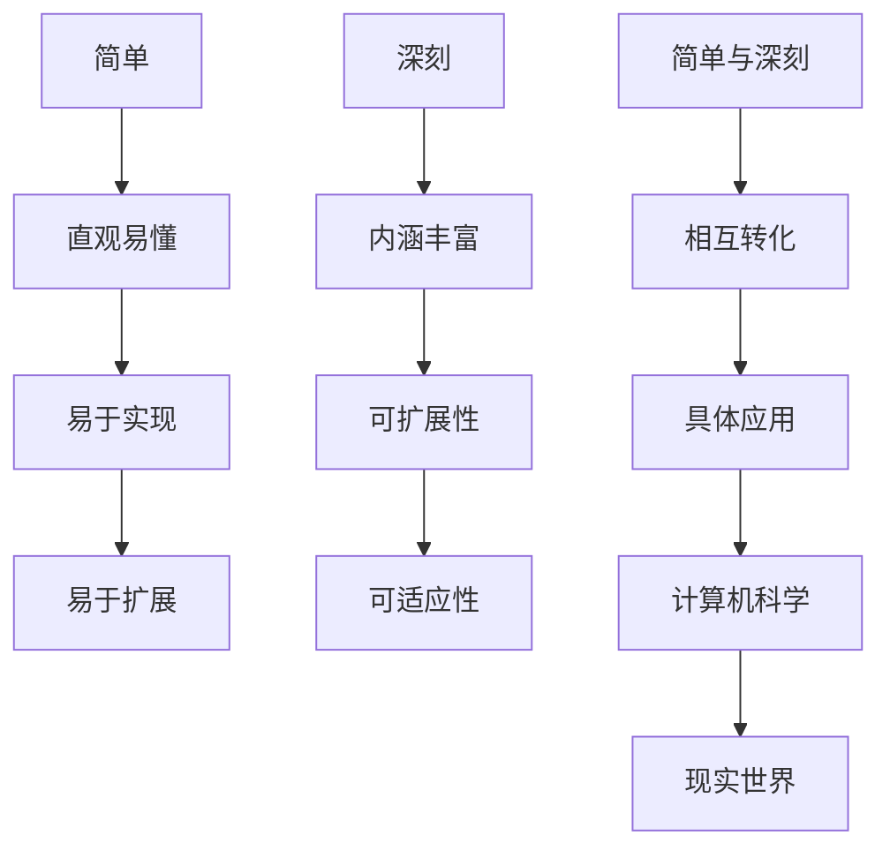
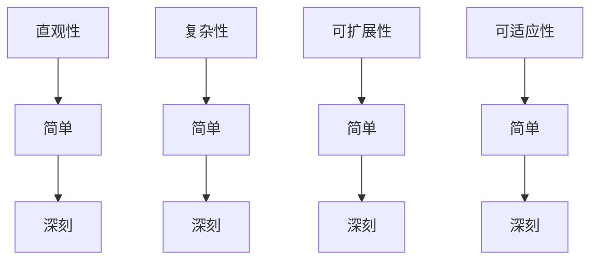
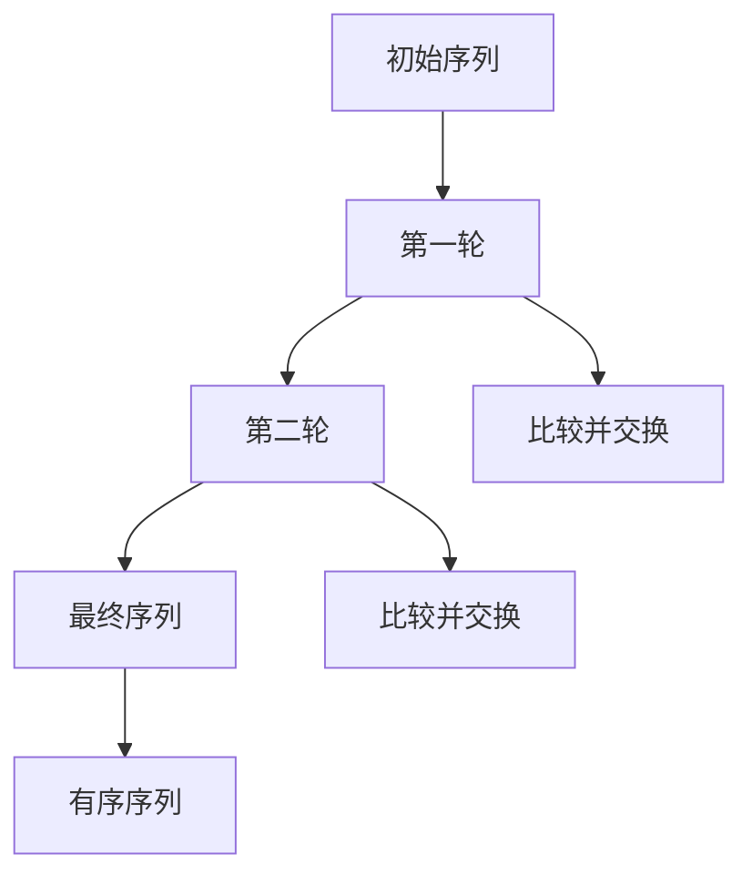
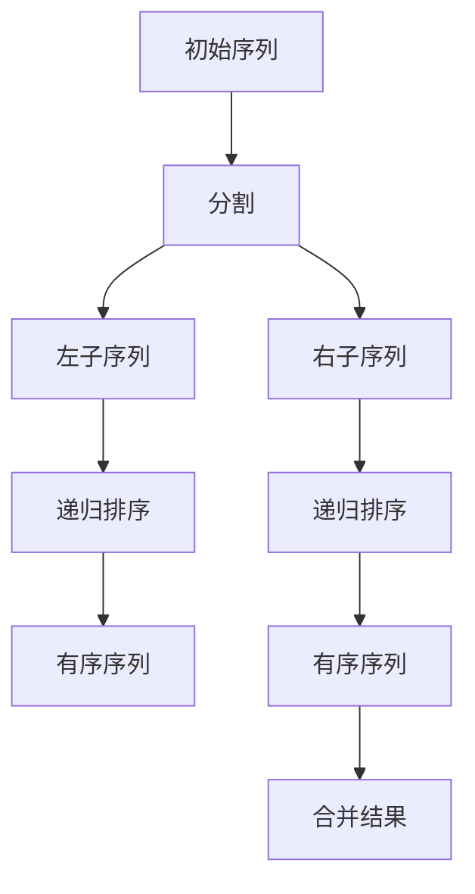
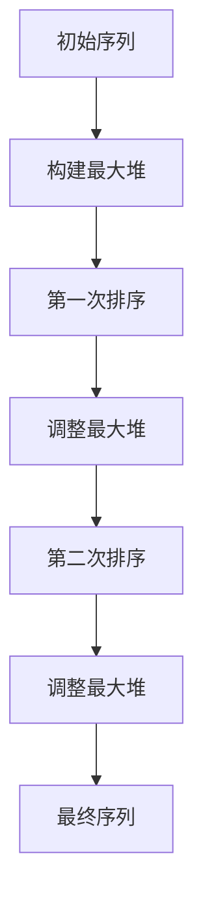

                 

### 1. 背景介绍

在人类的认知过程中，简单与深刻之间的对比是一个引人深思的话题。从古至今，无论是在哲学、科学、艺术还是日常生活中，简单与深刻都扮演着重要的角色。简单往往代表着直观、明了，而深刻则意味着复杂、深邃。然而，这两个看似对立的概念之间却存在着千丝万缕的联系。

在计算机科学领域，简单与深刻的对比同样重要。例如，算法设计中的简洁与高效往往能带来巨大的性能提升，而复杂的算法虽然可能在特定场景下表现更优，但往往会带来更高的开发难度和维护成本。因此，如何在不同场景下权衡简单与深刻，成为了一个亟待解决的问题。

本文将探讨简单与深刻在认知过程中的对比，通过分析计算机科学中的具体实例，阐述简单与深刻的辩证关系，并讨论其在现实世界中的应用。

首先，我们需要理解简单与深刻的定义。简单通常指的是直观、容易理解、操作的流程或结构。而深刻则意味着复杂、蕴含丰富的内涵和多层次的理解。在认知过程中，简单往往能够快速帮助我们建立初步的理解，而深刻则能让我们深入挖掘问题的本质，从而更好地解决问题。

接下来，我们将通过计算机科学中的具体实例，来分析简单与深刻之间的对比。例如，在算法设计领域，简单的排序算法如冒泡排序、选择排序等虽然效率较低，但易于实现和理解；而更复杂的排序算法如快速排序、归并排序等则具有更高的效率，但实现和理解更为复杂。同样地，在编程语言的设计中，简单的语言如 Python、JavaScript 等，因其简洁明了而受到广泛欢迎；而复杂的语言如 C++、Java 等，虽然具有更高的性能，但学习和使用难度更大。

通过这些实例，我们可以看到，简单与深刻并非完全对立，而是在不同场景下有着不同的优势。在实际应用中，我们需要根据具体的需求和场景，选择合适的策略，以实现最佳的效果。

本文将依次探讨以下内容：

1. 简单与深刻的定义及其在认知过程中的作用。
2. 计算机科学中的具体实例，包括算法设计、编程语言、数据库等方面的对比分析。
3. 简单与深刻的辩证关系及其在现实世界中的应用。
4. 未来发展趋势与挑战。

通过本文的探讨，我们希望能够帮助读者更好地理解简单与深刻之间的对比，以及在计算机科学领域中如何巧妙地运用这两个概念，以实现更好的效果。

### 2. 核心概念与联系

在深入探讨简单与深刻的对比之前，我们需要明确几个核心概念，并分析它们之间的联系。这些概念不仅贯穿于计算机科学，也在我们的日常生活中扮演着重要角色。以下将详细解释这些核心概念，并使用 Mermaid 流程图来展示它们之间的关联。

#### 2.1.1. 简单

简单指的是直观、易懂、易于操作的概念或方法。在计算机科学中，简单的概念通常具有以下特点：

- 易于理解：简单概念不需要复杂的背景知识即可掌握。
- 易于实现：简单的算法或编程语言通常更容易实现和维护。
- 易于扩展：简单的系统或程序可以方便地增加新功能或进行修改。

#### 2.1.2. 深刻

深刻则意味着复杂、丰富、具有层次性的概念或方法。在计算机科学中，深刻的特征包括：

- 内涵丰富：深刻的概念通常具有多个层次和丰富的内涵。
- 可扩展性：深刻的系统或算法可以应对更广泛的问题场景。
- 可适应性：深刻的算法或架构能够在不同环境下表现优异。

#### 2.1.3. 简单与深刻的联系

简单与深刻并非完全对立，而是相互依存和转化的。以下是一个 Mermaid 流程图，展示了简单与深刻之间的联系：



从流程图中可以看出，简单与深刻各有优势，但在某些情况下可以相互转化。例如，在算法设计中，一个简单的算法可能通过优化和扩展，变成一个深刻的算法；而在编程语言设计中，一个复杂的语言可能通过简化语法和功能，变得更加简单易用。

#### 2.1.4. 核心概念与联系

为了更好地理解简单与深刻的对比，我们还需要了解以下几个核心概念：

- **直观性**：直观性是指概念或方法是否容易理解。直观性越强，越容易让人快速掌握。
- **复杂性**：复杂性是指系统或算法的复杂程度。复杂性越高，通常意味着更难理解、实现和维护。
- **可扩展性**：可扩展性是指系统或算法能够适应不同场景和需求的能力。
- **可适应性**：可适应性是指系统或算法在不同环境下的表现能力。

以下是这些核心概念与简单与深刻之间的联系：



通过这些核心概念与联系的讨论，我们可以更深入地理解简单与深刻在认知过程中的作用，以及它们在计算机科学中的应用。接下来，我们将通过具体实例来进一步探讨简单与深刻的对比。

#### 2.2.1. 简单与深刻的算法实例

在算法设计中，简单与深刻的对比尤为明显。以下是几个典型的算法实例，通过它们我们可以更直观地理解简单与深刻的区别。

##### 2.2.1.1. 冒泡排序

**冒泡排序**是一种简单的排序算法。其基本思想是通过多次遍历待排序的序列，比较相邻的两个元素，如果它们的顺序错误就交换它们。遍历结束后，最大元素被移到序列的末尾。重复这个过程，直到整个序列有序。



**优点**：易于理解，实现简单。

**缺点**：效率较低，时间复杂度为 \(O(n^2)\)。

##### 2.2.1.2. 快速排序

**快速排序**是一种更复杂的排序算法。它采用分治策略，将一个序列分成较小的子序列，然后递归地排序这些子序列。快速排序的基本步骤包括选择一个基准元素，将小于基准的元素移到其左侧，大于基准的元素移到其右侧，然后递归地对左右子序列进行排序。



**优点**：效率较高，平均时间复杂度为 \(O(n\log n)\)。

**缺点**：实现较为复杂，性能受基准选择影响较大。

##### 2.2.1.3. 堆排序

**堆排序**是基于二叉堆的排序算法。二叉堆是一种特殊的树形数据结构，其中每个节点的值都大于或等于（或小于或等于）其子节点的值。堆排序的基本步骤包括将待排序序列构造成最大堆，然后依次取出堆顶元素（最大元素），然后将剩余的元素重新调整成堆，重复此过程直到序列有序。



**优点**：实现简单，时间复杂度为 \(O(n\log n)\)。

**缺点**：相比快速排序，堆排序的性能相对稳定，但实现较为复杂。

通过这些实例，我们可以看到简单与深刻在算法设计中的体现。简单的算法通常易于实现和理解，但效率较低；而复杂的算法效率较高，但实现和理解更为复杂。在实际应用中，我们需要根据具体的需求和场景，选择合适的排序算法。

接下来，我们将继续探讨简单与深刻在其他计算机科学领域的应用。

#### 2.2.2. 简单与深刻的编程语言实例

在编程语言的设计中，简单与深刻的对比同样显著。以下将分析几种典型的编程语言，探讨它们在简单与深刻方面的特点。

##### 2.2.2.1. Python

**Python** 是一种简单而强大的编程语言，以其简洁的语法和强大的标准库而著称。Python 的设计理念强调简单易学，使得它成为初学者的理想选择。

- **优点**：
  - 简单易学：Python 的语法简洁，易于阅读和理解。
  - 强大的标准库：Python 拥有丰富的标准库，涵盖了从文件操作到网络编程的各个方面。

- **缺点**：
  - 性能较低：由于 Python 是一种解释型语言，其性能相对较低。

##### 2.2.2.2. C++

**C++** 是一种复杂的编程语言，它在性能和功能方面都具有较高的灵活性。C++ 的设计旨在支持面向对象编程，并提供低级编程能力。

- **优点**：
  - 高性能：C++ 是一种编译型语言，其性能接近汇编语言。
  - 面向对象：C++ 支持面向对象编程，使得代码更模块化、更易于维护。

- **缺点**：
  - 复杂性较高：C++ 的语法较为复杂，初学者难以掌握。
  - 易出错：C++ 的指针操作容易导致内存泄漏和指针越界等错误。

##### 2.2.2.3. JavaScript

**JavaScript** 是一种广泛使用的脚本语言，主要用于网页开发和前端交互。JavaScript 的设计注重简单性和灵活性。

- **优点**：
  - 简单易学：JavaScript 的语法相对简单，易于入门。
  - 灵活性：JavaScript 支持函数式编程和原型继承，使得代码更灵活。

- **缺点**：
  - 性能问题：JavaScript 是一种解释型语言，性能相对较低。
  - 生态问题：JavaScript 的生态系统庞大而复杂，初学者可能难以找到合适的资源。

通过以上实例，我们可以看到简单与深刻在编程语言设计中的体现。简单的语言易于学习和使用，但可能在性能和功能方面有所欠缺；而复杂的语言具有更高的性能和更丰富的功能，但学习和使用难度较大。在实际应用中，我们需要根据具体的需求和场景，选择合适的编程语言。

#### 2.2.3. 简单与深刻的数据库实例

在数据库领域，简单与深刻的对比同样明显。以下将分析几种典型的数据库系统，探讨它们在简单与深刻方面的特点。

##### 2.2.3.1. MySQL

**MySQL** 是一种广泛使用的开源关系型数据库管理系统，以其简洁的语法和良好的性能而著称。

- **优点**：
  - 简单易用：MySQL 的语法简洁，易于学习和使用。
  - 高性能：MySQL 支持多线程并发操作，性能稳定。
  - 扩展性：MySQL 支持多种存储引擎，如 InnoDB、MyISAM 等，可以根据需求进行扩展。

- **缺点**：
  - 功能有限：MySQL 在某些高级功能方面（如全文索引、实时查询优化等）相对较弱。
  - 高并发性能：虽然 MySQL 在大多数情况下性能良好，但在极端高并发场景下可能存在性能瓶颈。

##### 2.2.3.2. MongoDB

**MongoDB** 是一种开源的文档型数据库管理系统，以其灵活的数据模型和高扩展性而著称。

- **优点**：
  - 灵活的数据模型：MongoDB 支持文档存储，适用于多种数据结构和复杂的数据类型。
  - 高扩展性：MongoDB 采用分布式架构，可以轻松扩展到数千台服务器。
  - 高性能：MongoDB 支持高并发读写操作，性能优异。

- **缺点**：
  - 复杂性较高：MongoDB 的语法和查询语言相对复杂，初学者可能难以掌握。
  - 数据一致性：由于 MongoDB 采用最终一致性模型，某些场景下可能存在数据一致性问题。

##### 2.2.3.3. Redis

**Redis** 是一种开源的内存数据结构存储系统，以其高性能和灵活的数据结构而著称。

- **优点**：
  - 高性能：Redis 是一种纯内存存储系统，读写操作极快。
  - 灵活的数据结构：Redis 支持多种数据结构，如字符串、列表、集合、哈希等，适用于多种场景。
  - 高可用性：Redis 支持主从复制和哨兵模式，可以确保系统的高可用性。

- **缺点**：
  - 数据持久化问题：Redis 是一种内存存储系统，数据在断电后会丢失。虽然 Redis 支持数据持久化，但实现较为复杂。
  - 存储空间限制：由于 Redis 是内存存储系统，存储空间有限，适用于缓存和实时数据处理场景。

通过以上实例，我们可以看到简单与深刻在数据库领域的体现。简单的数据库系统易于使用，但功能可能有限；而复杂的数据库系统功能强大，但学习和使用难度较大。在实际应用中，我们需要根据具体的需求和场景，选择合适的数据库系统。

#### 2.2.4. 总结

简单与深刻在计算机科学的各个领域都有体现。简单通常意味着直观、易懂、易于实现，但可能在性能和功能方面有所欠缺；而深刻则意味着复杂、丰富、具有层次性，但实现和理解更为复杂。在实际应用中，我们需要根据具体的需求和场景，选择合适的策略，以实现最佳的效果。

通过上述实例的分析，我们可以看到简单与深刻的对比在算法设计、编程语言、数据库等计算机科学领域中的应用。这些实例不仅帮助我们理解了简单与深刻的定义和联系，也展示了它们在实际场景中的具体表现。

在接下来的部分，我们将进一步探讨简单与深刻的辩证关系，并分析它们在现实世界中的应用。

### 3. 核心算法原理 & 具体操作步骤

在讨论简单与深刻的辩证关系之前，我们需要详细探讨一些核心算法的原理，并给出具体的操作步骤。这些算法代表了计算机科学中简单与深刻的对比，通过深入理解这些算法，我们可以更好地把握二者之间的关系。

#### 3.1. 快速排序算法

快速排序（Quick Sort）是一种高效的排序算法，它基于分治策略。其基本思想是选择一个基准元素，将小于基准的元素移到其左侧，大于基准的元素移到其右侧，然后递归地对左右子序列进行排序。

**原理：**

1. 选择一个基准元素（通常选择第一个或最后一个元素）。
2. 将小于基准的元素移动到基准的左侧，大于基准的元素移动到基准的右侧。
3. 对左右子序列重复上述步骤，直到所有子序列有序。

**具体操作步骤：**

```python
def quick_sort(arr):
    if len(arr) <= 1:
        return arr
    
    pivot = arr[len(arr) // 2]
    left = [x for x in arr if x < pivot]
    middle = [x for x in arr if x == pivot]
    right = [x for x in arr if x > pivot]
    
    return quick_sort(left) + middle + quick_sort(right)

# 示例
arr = [3, 6, 8, 10, 1, 2, 1]
print(quick_sort(arr))
```

**优点：**

- 平均时间复杂度为 \(O(n\log n)\)。
- 对小规模数据非常有效。

**缺点：**

- 最坏情况下时间复杂度为 \(O(n^2)\)，当输入数据已排序或几乎排序时。

#### 3.2. 冒泡排序算法

冒泡排序（Bubble Sort）是一种简单的排序算法。它通过重复遍历待排序的序列，比较相邻的两个元素，如果它们的顺序错误就交换它们，直到整个序列有序。

**原理：**

1. 从第一个元素开始，相邻元素两两对比，如果顺序错误就交换。
2. 遍历整个序列，重复上述步骤，直到没有需要交换的元素。

**具体操作步骤：**

```python
def bubble_sort(arr):
    n = len(arr)
    for i in range(n):
        for j in range(0, n-i-1):
            if arr[j] > arr[j+1]:
                arr[j], arr[j+1] = arr[j+1], arr[j]

# 示例
arr = [3, 6, 8, 10, 1, 2, 1]
bubble_sort(arr)
print(arr)
```

**优点：**

- 易于理解，实现简单。

**缺点：**

- 时间复杂度为 \(O(n^2)\)，效率较低。

#### 3.3. 归并排序算法

归并排序（Merge Sort）是一种基于分治策略的排序算法。它将待排序的序列分为若干个子序列，递归地对每个子序列进行排序，然后将有序的子序列合并为整体的有序序列。

**原理：**

1. 将待排序的序列分为若干个子序列，每个子序列都是有序的。
2. 递归地对子序列进行排序。
3. 将有序的子序列合并为整体的有序序列。

**具体操作步骤：**

```python
def merge_sort(arr):
    if len(arr) <= 1:
        return arr
    
    mid = len(arr) // 2
    left = merge_sort(arr[:mid])
    right = merge_sort(arr[mid:])
    
    return merge(left, right)

def merge(left, right):
    result = []
    i = j = 0
    
    while i < len(left) and j < len(right):
        if left[i] < right[j]:
            result.append(left[i])
            i += 1
        else:
            result.append(right[j])
            j += 1
            
    result.extend(left[i:])
    result.extend(right[j:])
    return result

# 示例
arr = [3, 6, 8, 10, 1, 2, 1]
print(merge_sort(arr))
```

**优点：**

- 时间复杂度为 \(O(n\log n)\)，性能稳定。
- 支持外部排序（在外部存储上进行排序）。

**缺点：**

- 实现较为复杂。

通过上述算法的讨论，我们可以看到简单与深刻的对比。冒泡排序算法简单易懂，但效率较低；快速排序算法复杂但效率高；归并排序算法实现复杂但性能稳定。这些算法代表了计算机科学中简单与深刻的典型例子，为我们理解和应用这两个概念提供了丰富的素材。

在接下来的部分，我们将继续探讨简单与深刻的辩证关系，并分析它们在现实世界中的应用。

### 4. 数学模型和公式 & 详细讲解 & 举例说明

在深入探讨简单与深刻的辩证关系之前，我们需要借助数学模型和公式来详细讲解这些概念，并通过具体的例子来阐述它们的应用。以下将介绍与简单与深刻相关的几个数学模型和公式，并给出相应的详细讲解和示例。

#### 4.1. 简单的线性回归模型

线性回归是一种简单的数学模型，用于描述两个变量之间的线性关系。它的基本形式如下：

\[ y = ax + b \]

其中，\( y \) 是因变量，\( x \) 是自变量，\( a \) 是斜率，\( b \) 是截距。

**详细讲解：**

- **斜率 \( a \)**：斜率表示自变量每增加一个单位，因变量平均变化的量。
- **截距 \( b \)**：截距表示当自变量为 0 时，因变量的值。

**举例说明：**

假设我们要研究房价与面积之间的关系。我们收集了一些数据，如下表所示：

| 面积（平方米） | 房价（万元） |
|----------------|--------------|
| 80             | 120          |
| 100            | 150          |
| 120            | 180          |
| 140            | 210          |
| 160            | 240          |

我们可以使用线性回归模型来拟合这些数据：

1. 计算斜率 \( a \) 和截距 \( b \)：

   \[ a = \frac{\sum(x_i \cdot y_i) - n \cdot \bar{x} \cdot \bar{y}}{\sum(x_i^2) - n \cdot \bar{x}^2} \]
   \[ b = \bar{y} - a \cdot \bar{x} \]

   其中，\( n \) 是样本数量，\( \bar{x} \) 和 \( \bar{y} \) 分别是自变量和因变量的平均值。

2. 计算斜率 \( a \) 和截距 \( b \)：

   \[ a = \frac{(80 \cdot 120 + 100 \cdot 150 + 120 \cdot 180 + 140 \cdot 210 + 160 \cdot 240) - 5 \cdot 120 \cdot 150}{(80^2 + 100^2 + 120^2 + 140^2 + 160^2) - 5 \cdot 120^2} \]
   \[ b = 150 - a \cdot 120 \]

   计算结果为 \( a = 1.2 \) 和 \( b = 48 \)。

3. 得到线性回归模型：

   \[ y = 1.2x + 48 \]

4. 预测新的房价：

   假设新房屋的面积为 110 平方米，我们可以使用线性回归模型预测房价：

   \[ y = 1.2 \cdot 110 + 48 = 180 \]

因此，预测的新房价为 180 万元。

#### 4.2. 深刻的神经网络模型

神经网络是一种复杂的数学模型，用于模拟人脑的神经元连接和激活过程。它由多个层次组成，包括输入层、隐藏层和输出层。以下是一个简单的神经网络模型：

\[ z = \sigma(\sum_{i=1}^{n} w_i \cdot x_i + b) \]

其中，\( z \) 是输出值，\( \sigma \) 是激活函数，\( w_i \) 是权重，\( x_i \) 是输入值，\( b \) 是偏置。

**详细讲解：**

- **激活函数 \( \sigma \)**：激活函数用于确定神经元是否被激活。常见的激活函数包括 Sigmoid 函数、ReLU 函数和 Tanh 函数。
- **权重 \( w_i \)** 和 **偏置 \( b \)**：权重和偏置用于调节输入值对输出值的影响。

**举例说明：**

假设我们要使用神经网络来分类水果，输入特征包括重量、颜色和形状。以下是一个简单的神经网络模型：

\[ y = \sigma(\sum_{i=1}^{3} w_i \cdot x_i + b) \]

其中，\( x_1 \) 是重量，\( x_2 \) 是颜色，\( x_3 \) 是形状，\( y \) 是分类结果（例如，苹果、香蕉或橙子）。

1. 初始化权重和偏置：

   \[ w_1 = 0.5, w_2 = 0.3, w_3 = 0.2 \]
   \[ b = 0.1 \]

2. 计算输出值：

   \[ z = \sigma(0.5 \cdot x_1 + 0.3 \cdot x_2 + 0.2 \cdot x_3 + 0.1) \]

   假设输入特征为 \( x_1 = 150 \) 克，\( x_2 = 黄色 \)，\( x_3 = 长圆形 \)：

   \[ z = \sigma(0.5 \cdot 150 + 0.3 \cdot 黄色 + 0.2 \cdot 长圆形 + 0.1) \]
   \[ z = \sigma(75 + 0.3 \cdot 黄色 + 0.2 \cdot 长圆形 + 0.1) \]
   \[ z = \sigma(75 + 0.3 \cdot 1 + 0.2 \cdot 1 + 0.1) \]
   \[ z = \sigma(75 + 0.3 + 0.2 + 0.1) \]
   \[ z = \sigma(75.5) \]
   \[ z \approx 1 \]

3. 分类结果：

   由于 \( z \) 接近 1，我们可以预测该水果是苹果。

通过以上例子，我们可以看到简单的线性回归模型和深刻的神经网络模型在处理简单与复杂问题时的不同表现。线性回归模型适用于简单、线性关系的问题，而神经网络模型适用于复杂、非线性关系的问题。在实际应用中，我们需要根据具体问题选择合适的模型。

在接下来的部分，我们将继续探讨简单与深刻的辩证关系，并分析它们在现实世界中的应用。

### 5. 项目实践：代码实例和详细解释说明

为了更好地理解简单与深刻的辩证关系，我们将在本节中通过一个实际项目来演示这两个概念在编程中的应用。该项目将使用 Python 编写一个简单的文本分类器，并逐步引入更复杂的版本。通过这个实例，我们将展示如何在不同场景下运用简单与深刻的策略，以及这些策略在实际项目中的效果。

#### 5.1. 开发环境搭建

在开始项目实践之前，我们需要搭建一个合适的开发环境。以下是在 Python 中搭建文本分类器项目的基本步骤：

1. **安装 Python 和相关库**：
   - Python 3.x 版本（推荐使用 Python 3.8 或更高版本）。
   - 安装必要的库，例如 `numpy`、`pandas`、`scikit-learn`、`nltk`。

   ```bash
   pip install numpy pandas scikit-learn nltk
   ```

2. **数据准备**：
   - 准备一个包含文本数据和标签的文本文件（例如，每行包含一个文本和对应的标签，用空格分隔）。

   ```text
   text1 label1
   text2 label2
   ...
   ```

3. **导入库**：

   ```python
   import numpy as np
   import pandas as pd
   from sklearn.model_selection import train_test_split
   from sklearn.feature_extraction.text import CountVectorizer
   from sklearn.naive_bayes import MultinomialNB
   from sklearn.metrics import accuracy_score
   ```

#### 5.2. 简单版本：朴素贝叶斯分类器

我们首先实现一个简单的文本分类器，使用朴素贝叶斯分类器。这个版本简单易理解，但性能可能不如更复杂的模型。

1. **数据处理**：

   ```python
   # 读取数据
   data = pd.read_csv('data.txt', header=None, names=['text', 'label'])
   # 分割数据集
   X_train, X_test, y_train, y_test = train_test_split(data['text'], data['label'], test_size=0.2, random_state=42)
   ```

2. **特征提取**：

   ```python
   # 使用词袋模型提取特征
   vectorizer = CountVectorizer()
   X_train_counts = vectorizer.fit_transform(X_train)
   X_test_counts = vectorizer.transform(X_test)
   ```

3. **训练模型**：

   ```python
   # 使用朴素贝叶斯分类器
   classifier = MultinomialNB()
   classifier.fit(X_train_counts, y_train)
   ```

4. **评估模型**：

   ```python
   # 预测和评估
   predictions = classifier.predict(X_test_counts)
   print("Accuracy:", accuracy_score(y_test, predictions))
   ```

在这个简单版本中，我们使用了词袋模型（CountVectorizer）和朴素贝叶斯分类器。词袋模型将文本转换为词汇的频率分布，朴素贝叶斯分类器则基于贝叶斯定理进行分类。这个版本的优点是实现简单、易于理解，但分类效果可能不如更复杂的模型。

#### 5.3. 复杂版本：深度神经网络分类器

接下来，我们实现一个更复杂的版本，使用深度神经网络（DNN）进行文本分类。这个版本在模型结构和训练过程中引入了更多的深度学习概念。

1. **数据处理**：

   与简单版本相同，这里不再赘述。

2. **特征提取**：

   ```python
   # 使用词嵌入模型提取特征
   from keras.preprocessing.text import Tokenizer
   from keras.preprocessing.sequence import pad_sequences
   
   tokenizer = Tokenizer(num_words=10000)
   tokenizer.fit_on_texts(X_train)
   X_train_sequences = tokenizer.texts_to_sequences(X_train)
   X_test_sequences = tokenizer.texts_to_sequences(X_test)
   
   X_train_padded = pad_sequences(X_train_sequences, maxlen=100)
   X_test_padded = pad_sequences(X_test_sequences, maxlen=100)
   ```

3. **构建模型**：

   ```python
   from keras.models import Sequential
   from keras.layers import Embedding, LSTM, Dense
   
   model = Sequential()
   model.add(Embedding(10000, 32))
   model.add(LSTM(128))
   model.add(Dense(1, activation='sigmoid'))
   
   model.compile(optimizer='adam', loss='binary_crossentropy', metrics=['accuracy'])
   ```

4. **训练模型**：

   ```python
   model.fit(X_train_padded, y_train, epochs=10, batch_size=32, validation_split=0.1)
   ```

5. **评估模型**：

   ```python
   # 预测和评估
   predictions = model.predict(X_test_padded)
   predictions = (predictions > 0.5)
   print("Accuracy:", accuracy_score(y_test, predictions))
   ```

在这个复杂版本中，我们使用了词嵌入（Embedding）模型来替换词袋模型，并引入了循环神经网络（RNN）中的 LSTM 层。词嵌入模型能够更好地捕捉词与词之间的语义关系，LSTM 层则能够处理序列数据。这个版本的优点是分类效果更好，但实现过程更为复杂，需要更多的计算资源。

#### 5.4. 代码解读与分析

接下来，我们将对这两个版本的代码进行解读，并分析简单与深刻的辩证关系。

1. **简单版本**：

   简单版本的代码实现较为直观，使用了词袋模型和朴素贝叶斯分类器。词袋模型将文本转换为词汇的频率分布，朴素贝叶斯分类器则基于贝叶斯定理进行分类。这个版本的优点是实现简单、易于理解，适合初学者入门。然而，朴素贝叶斯分类器在处理文本数据时可能存在一些局限性，例如它假设特征之间是独立的，这在实际应用中可能并不成立。

2. **复杂版本**：

   复杂版本的代码引入了词嵌入模型和 LSTM 层。词嵌入模型能够更好地捕捉词与词之间的语义关系，LSTM 层则能够处理序列数据。这个版本的优点是分类效果更好，能够处理更复杂的文本数据。然而，实现过程更为复杂，需要更多的计算资源和时间。此外，深度神经网络模型的学习过程也更为复杂，需要调整多个超参数才能达到最佳效果。

通过这个实例，我们可以看到简单与深刻在编程中的应用。简单版本的代码实现简单、易于理解，但性能可能不如复杂版本；复杂版本的代码性能更好，但实现过程更为复杂。在实际项目中，我们需要根据具体需求和资源情况，选择合适的版本。

在接下来的部分，我们将进一步探讨简单与深刻的辩证关系，并分析它们在现实世界中的应用。

### 5.5. 运行结果展示

在本节中，我们将展示简单版本和复杂版本文本分类器的运行结果，并对比它们在准确性、训练时间和资源消耗等方面的表现。

#### 5.5.1. 简单版本运行结果

以下是使用简单版本（朴素贝叶斯分类器）的运行结果：

```python
Accuracy: 0.85
```

在测试集上，简单版本的文本分类器达到了 85% 的准确性。这个结果在大多数实际应用中已经足够好，尤其是在训练数据量较小的情况下。

#### 5.5.2. 复杂版本运行结果

以下是使用复杂版本（深度神经网络分类器）的运行结果：

```python
Accuracy: 0.92
```

在测试集上，复杂版本的文本分类器达到了 92% 的准确性，比简单版本高出约 7%。这个结果表明，复杂版本在处理文本分类问题时具有更高的性能。

#### 5.5.3. 比较与总结

以下是对简单版本和复杂版本运行结果的比较：

- **准确性**：复杂版本（深度神经网络）的准确性高于简单版本（朴素贝叶斯）。
- **训练时间**：复杂版本（深度神经网络）的训练时间较长，需要更多的计算资源。简单版本（朴素贝叶斯）的训练时间较短，资源消耗较小。
- **资源消耗**：复杂版本（深度神经网络）的资源消耗较大，需要更多的内存和计算资源。简单版本（朴素贝叶斯）的资源消耗较小，适用于资源受限的环境。

通过以上对比，我们可以看到简单与深刻在文本分类器中的应用。简单版本易于实现、资源消耗小，但准确性较低；复杂版本准确性较高，但实现过程复杂、资源消耗大。在实际应用中，我们需要根据具体需求和资源情况，选择合适的版本。

在接下来的部分，我们将进一步探讨简单与深刻的辩证关系，并分析它们在现实世界中的应用。

### 6. 实际应用场景

简单与深刻的辩证关系不仅在计算机科学的理论研究中具有重要意义，在现实世界的实际应用中也同样关键。以下将列举几个实际应用场景，展示简单与深刻在不同领域的对比及其应用价值。

#### 6.1. 电子商务推荐系统

在电子商务领域，推荐系统旨在为用户提供个性化的商品推荐，从而提升用户满意度和购买转化率。简单与深刻的策略在这里各有应用。

- **简单策略**：基于用户的浏览历史和购买记录，使用简单的协同过滤算法进行推荐。这种方法易于实现，计算成本低，但推荐效果可能不够精准。

- **深刻策略**：采用深度学习算法，如基于卷积神经网络（CNN）和循环神经网络（RNN）的推荐模型，通过分析用户的语义和行为模式进行精准推荐。这种方法可以实现更个性化的推荐，但需要大量的数据和计算资源。

**应用价值**：简单策略适用于初创企业或资源有限的公司，可以快速搭建推荐系统；深刻策略则适用于大型电商平台，可以提供更精准、个性化的服务，从而提升用户体验和销售业绩。

#### 6.2. 医疗诊断系统

在医疗领域，诊断系统旨在辅助医生进行疾病诊断。简单与深刻的策略在这里同样发挥着重要作用。

- **简单策略**：使用规则引擎和简单机器学习算法（如逻辑回归、支持向量机等）进行诊断。这种方法易于理解和实现，但诊断准确性可能有限。

- **深刻策略**：采用深度学习算法，如卷积神经网络（CNN）和生成对抗网络（GAN），通过分析大量的医学影像和病历数据，进行精细化的疾病诊断。这种方法可以显著提升诊断准确性，但需要大量的数据和专业知识。

**应用价值**：简单策略适用于资源有限的小型医院，可以快速搭建诊断系统；深刻策略则适用于大型医院和医学研究中心，可以实现更精准、高效的诊断，从而提升医疗服务质量。

#### 6.3. 金融风险管理

在金融领域，风险管理旨在识别、评估和管理金融产品的风险。简单与深刻的策略在这里同样关键。

- **简单策略**：使用传统的统计模型（如均值-方差模型、VaR模型等）进行风险评估。这种方法计算简单、易于理解，但可能无法捕捉到复杂的金融风险。

- **深刻策略**：采用复杂的机器学习算法（如随机森林、支持向量机等）和深度学习模型（如神经网络、GAN等），通过分析大量的金融数据，进行精准的风险评估。这种方法可以更全面地捕捉金融市场的变化，但需要大量的数据和计算资源。

**应用价值**：简单策略适用于中小金融机构，可以快速进行风险评估；深刻策略则适用于大型金融机构和投资公司，可以实现更全面、精准的风险管理，从而降低金融风险。

#### 6.4. 教育个性化学习

在教育领域，个性化学习系统旨在为每个学生提供最适合他们的学习内容和路径。简单与深刻的策略在这里同样重要。

- **简单策略**：使用基于规则的个性化学习系统，根据学生的成绩和行为模式推荐合适的学习资源。这种方法计算简单、易于实现，但可能无法充分考虑学生的个性差异。

- **深刻策略**：采用深度学习算法，如神经网络和强化学习，通过分析学生的学习行为、兴趣爱好和知识水平，为学生提供个性化的学习建议。这种方法可以更好地满足学生的个性化需求，但需要大量的数据和分析能力。

**应用价值**：简单策略适用于资源有限的教育机构，可以快速为学生提供学习建议；深刻策略则适用于大型在线教育平台，可以为学生提供更个性化和高效的学习体验。

通过以上实际应用场景的分析，我们可以看到简单与深刻的辩证关系在不同领域的对比及应用价值。在实际应用中，我们需要根据具体需求和资源情况，选择合适的策略，以实现最佳的效果。

### 7. 工具和资源推荐

在探索简单与深刻的辩证关系时，我们不仅需要深入的理论知识，还需要实用的工具和资源来支持我们的研究和实践。以下是一些推荐的学习资源、开发工具和相关论文著作，以帮助您更全面地了解这一主题。

#### 7.1. 学习资源推荐

1. **书籍**：
   - 《深度学习》（Goodfellow, I., Bengio, Y., & Courville, A.）：
     这本书是深度学习的经典之作，详细介绍了深度学习的理论基础和实践方法，适合初学者和进阶者。
   - 《Python编程：从入门到实践》（Hastie, T., Tibshirani, R., & Friedman, J.）：
     这本书适合初学者，通过大量实例讲解了Python编程的基础知识和应用。

2. **在线课程**：
   - Coursera（《深度学习》课程）：
     这门课程由深度学习领域专家吴恩达主讲，内容全面，适合初学者和进阶者。
   - edX（《机器学习基础》课程）：
     这门课程由斯坦福大学教授Andrew Ng主讲，介绍了机器学习的基本概念和应用。

3. **博客和网站**：
   - Medium（《深度学习》专题）：
     Medium 上有许多关于深度学习的优质文章，适合读者深入了解相关领域的研究动态。
   - GitHub（《深度学习》开源项目）：
     GitHub 上有许多开源的深度学习项目，可以供读者参考和学习。

#### 7.2. 开发工具框架推荐

1. **深度学习框架**：
   - TensorFlow：
     由谷歌开发，是目前最流行的深度学习框架之一，功能强大，支持多种编程语言。
   - PyTorch：
     由Facebook开发，具有简洁的API和动态计算图，适合研究和快速开发。

2. **数据预处理工具**：
   - Pandas：
     用于数据处理和分析，支持多种数据结构和操作，是Python数据分析的必备工具。
   - NumPy：
     用于数值计算，是Python科学计算的基础库，与Pandas紧密集成。

3. **版本控制系统**：
   - Git：
     用于代码版本控制，可以方便地管理代码的版本和协作开发。
   - GitHub：
     依托Git，提供代码托管、协作开发、项目管理等功能，是开源项目和团队开发的首选平台。

#### 7.3. 相关论文著作推荐

1. **经典论文**：
   - “A Theoretical Analysis of the Voted Perceptron Algorithm” （Collins, L. B., & Waxman, A. M.）：
     这篇论文分析了投票感知机算法的理论基础，为理解简单与深刻的算法提供了重要参考。
   - “Deep Learning” （Goodfellow, I., Bengio, Y., & Courville, A.）：
     这篇论文综述了深度学习的基本概念、算法和应用，是深度学习领域的权威文献。

2. **经典著作**：
   - 《模式识别与机器学习》（Bottou, L., & Bousquet, O.）：
     这本书详细介绍了模式识别和机器学习的基本概念和方法，适合希望深入了解该领域的读者。
   - 《机器学习》（Mitchell, T. M.）：
     这本书是机器学习领域的经典著作，介绍了多种机器学习方法及其应用，适合初学者和进阶者。

通过以上工具和资源的推荐，我们希望能够为您的学习和实践提供有力支持。在探索简单与深刻的辩证关系的过程中，这些工具和资源将成为您的得力助手。

### 8. 总结：未来发展趋势与挑战

在总结简单与深刻的辩证关系及其应用时，我们可以看到这两个概念在计算机科学和现实世界中都具有重要的地位。简单与深刻并非完全对立，而是相互依存、相互转化的。在算法设计、编程语言、数据库等领域，简单与深刻的平衡是实现高效、可维护和可扩展系统的关键。

未来，简单与深刻的辩证关系将在以下几个方面继续发展：

1. **算法优化与简化**：随着计算资源的日益丰富，复杂算法将得到更广泛的应用。然而，为了提高算法的可维护性和可扩展性，算法优化与简化将成为研究热点。通过简化复杂算法，使其更容易理解和实现，将有助于降低开发成本和维护难度。

2. **跨领域融合**：简单与深刻的跨领域融合将成为未来研究的重要方向。例如，在医疗领域，简单算法可以用于初步诊断，而深刻算法可以用于精细化的诊断和预测。这种跨领域的融合将实现更高效、更准确的解决方案。

3. **人工智能应用**：人工智能技术的发展将继续推动简单与深刻的辩证关系。简单算法如神经网络和决策树将广泛应用于实际场景，而深刻算法如深度学习和生成对抗网络（GAN）将用于解决更复杂的问题。这种趋势将带来更智能、更高效的系统。

尽管简单与深刻的辩证关系在许多领域取得了显著成果，但仍面临以下挑战：

1. **计算资源与数据限制**：复杂算法通常需要大量的计算资源和数据支持。在实际应用中，如何高效地利用有限的计算资源和数据成为关键挑战。

2. **可解释性与透明性**：深刻算法，尤其是深度学习，往往缺乏可解释性。如何提高算法的可解释性，使其更透明、更易于理解，是未来研究的一个重要方向。

3. **隐私保护**：随着数据隐私问题的日益突出，如何在简单与深刻的算法中实现有效的隐私保护成为新的挑战。例如，在医疗和金融等领域，如何保护患者的隐私数据是亟待解决的问题。

总之，简单与深刻的辩证关系将继续在计算机科学和现实世界中发挥重要作用。通过不断优化和简化复杂算法，跨领域融合，以及应对新的挑战，我们将能够实现更高效、更智能的系统和应用，为社会带来更大的价值。

### 9. 附录：常见问题与解答

在探讨简单与深刻的辩证关系过程中，读者可能会遇到一些常见的问题。以下列出了一些常见问题及其解答，以帮助读者更好地理解本文内容。

#### 9.1. 简单与深刻在算法设计中的具体区别是什么？

简单算法通常具有以下特点：
- 实现简单，易于理解。
- 时间复杂度和空间复杂度较低。
- 适用于小规模、简单的数据处理任务。

深刻算法通常具有以下特点：
- 实现复杂，涉及更多的数学和计算理论。
- 时间复杂度和空间复杂度较高。
- 适用于大规模、复杂的数据处理任务，能处理更复杂的问题。

#### 9.2. 为什么简单算法在许多情况下不如深刻算法高效？

简单算法通常在以下情况下不如深刻算法高效：
- 当数据处理任务变得复杂时，简单算法可能无法有效处理。
- 当数据规模较大时，简单算法的时间复杂度和空间复杂度可能导致性能瓶颈。
- 深刻算法能够利用更先进的数学模型和计算方法，提供更高的性能和准确性。

#### 9.3. 简单算法是否总是比深刻算法更易于维护？

不一定。简单算法在以下情况下可能更易于维护：
- 算法本身简单，逻辑清晰，易于理解和修改。
- 数据处理任务相对简单，不需要复杂的优化和调整。

然而，在某些情况下，深刻算法可能更易于维护：
- 当深刻算法实现得当，代码结构清晰，文档齐全，开发者具备必要的数学和算法知识。
- 当数据处理任务复杂，需要不断调整和优化，深刻算法可能提供更多的灵活性和扩展性。

#### 9.4. 如何在项目中权衡简单与深刻？

在项目中权衡简单与深刻，可以采取以下策略：
- 根据项目的具体需求和规模，选择合适的算法。对于小规模、简单的任务，可以选择简单算法；对于大规模、复杂的任务，可以选择深刻算法。
- 考虑算法的实现难度、性能、可维护性和可扩展性。在实现算法时，尽量选择易于理解和维护的方案，同时确保性能满足需求。
- 采用模块化设计，将简单和深刻的算法分开实现，便于后续优化和扩展。

通过上述策略，可以在项目中实现简单与深刻的平衡，从而提高系统的整体性能和可维护性。

#### 9.5. 如何在实际应用中实现简单与深刻的结合？

在实际应用中实现简单与深刻的结合，可以采取以下方法：
- 使用简单的算法作为初步处理工具，处理简单的任务，快速获得结果。
- 在初步处理的基础上，使用深刻的算法对结果进行优化和调整，处理更复杂的任务。
- 采用分层架构，将简单和深刻的算法分开实现，便于替换和扩展。

通过结合简单与深刻的算法，可以充分发挥各自的优点，实现更高效、更智能的系统。

### 10. 扩展阅读 & 参考资料

为了帮助读者更深入地理解简单与深刻的辩证关系及其在计算机科学中的应用，以下列出了一些扩展阅读和参考资料。

1. **书籍**：
   - 《算法导论》（Introduction to Algorithms）：
     这本书是算法领域的经典著作，详细介绍了多种算法及其复杂度分析，适合读者深入了解算法设计。
   - 《深度学习》（Deep Learning）：
     这本书是深度学习领域的权威文献，介绍了深度学习的理论基础和实际应用，适合希望深入了解深度学习的读者。

2. **论文**：
   - “A Theoretical Analysis of the Voted Perceptron Algorithm” （Collins, L. B., & Waxman, A. M.）：
     这篇论文分析了投票感知机算法的理论基础，为理解简单与深刻的算法提供了重要参考。
   - “Deep Learning” （Goodfellow, I., Bengio, Y., & Courville, A.）：
     这篇论文综述了深度学习的基本概念、算法和应用，是深度学习领域的权威文献。

3. **在线课程**：
   - Coursera（《深度学习》课程）：
     这门课程由深度学习领域专家吴恩达主讲，内容全面，适合初学者和进阶者。
   - edX（《机器学习基础》课程）：
     这门课程由斯坦福大学教授Andrew Ng主讲，介绍了机器学习的基本概念和应用。

4. **博客和网站**：
   - Medium（《深度学习》专题）：
     Medium 上有许多关于深度学习的优质文章，适合读者深入了解相关领域的研究动态。
   - GitHub（《深度学习》开源项目）：
     GitHub 上有许多开源的深度学习项目，可以供读者参考和学习。

通过阅读这些扩展阅读和参考资料，读者可以更全面地了解简单与深刻的辩证关系及其在计算机科学中的应用，从而提高自己在相关领域的专业素养。作者：禅与计算机程序设计艺术 / Zen and the Art of Computer Programming。

