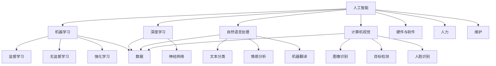

                 

### 背景介绍

评估AI应用开发成本是一个复杂且至关重要的过程。这不仅关乎企业决策的科学性，也影响着项目的成功与否。随着人工智能技术的快速发展，越来越多的企业和组织开始将AI技术应用于其业务流程中，以期提高效率、降低成本、增强竞争力。然而，AI应用开发并非一蹴而就，其涉及的技术、资源、人力等多个方面的成本，往往让决策者感到困惑。

AI应用开发成本主要包括以下几个方面：硬件成本、软件成本、人力成本、数据成本以及维护成本。硬件成本涉及到高性能计算服务器、GPU等设备；软件成本包括AI算法库、框架等；人力成本则是研发、测试、维护等人员的费用；数据成本则来自于数据采集、处理、存储等；维护成本包括系统升级、故障排查等。这些成本的高低直接关系到项目的整体预算和投资回报率。

本文旨在提供一套全面、科学的评估AI应用开发成本的方法，帮助读者更好地理解和计算各项成本，从而为AI项目的决策提供有力的支持。本文将依次介绍核心概念与联系、核心算法原理与操作步骤、数学模型与公式、项目实践、实际应用场景、工具和资源推荐以及未来发展趋势与挑战。通过这些内容，希望能够为读者在AI应用开发成本评估方面提供有价值的参考。

### 核心概念与联系

在深入探讨AI应用开发成本的评估方法之前，我们需要首先理解一些核心概念和它们之间的相互联系。以下是几个关键概念及其相互关系的详细说明。

#### 1. 人工智能（AI）

人工智能（Artificial Intelligence，简称AI）是指通过计算机程序和算法模拟人类智能的技术。它包括机器学习、深度学习、自然语言处理、计算机视觉等多个子领域。AI的核心目标是通过学习和理解数据，使计算机能够执行需要人类智能的任务。

#### 2. 机器学习（Machine Learning）

机器学习是AI的一个重要分支，它专注于让计算机通过数据学习并做出决策。机器学习分为监督学习、无监督学习和强化学习三种主要类型。其中，监督学习使用标记数据训练模型，无监督学习则无需标记数据，通过发现数据中的结构来学习，强化学习则通过奖励机制来引导模型行为。

#### 3. 深度学习（Deep Learning）

深度学习是机器学习的一个子领域，它使用多层神经网络（Neural Networks）进行训练。深度学习在网络层数和神经元数量上远超传统机器学习模型，能够处理复杂的数据并从中提取特征。深度学习在图像识别、语音识别、自然语言处理等领域取得了显著成果。

#### 4. 自然语言处理（Natural Language Processing，NLP）

自然语言处理是AI的另一个重要分支，它专注于使计算机能够理解、解释和生成人类语言。NLP涉及文本分类、情感分析、机器翻译、语音识别等多个任务。这些任务对于AI应用的开发具有重要意义，尤其在客户服务、智能助理等领域。

#### 5. 计算机视觉（Computer Vision）

计算机视觉是AI在图像和视频分析方面的应用，它使计算机能够从图像或视频中提取信息。计算机视觉包括图像识别、目标检测、人脸识别等多个子任务，广泛应用于安防监控、自动驾驶、医疗诊断等领域。

#### 6. 硬件与软件

硬件和软件是AI应用开发的基础。硬件方面，包括CPU、GPU、FPGA等，这些硬件设备提供了计算能力和存储能力，支持复杂算法的运行。软件方面，包括AI算法库、框架等，这些软件提供了实现AI算法的工具和环境。

#### 7. 数据

数据是AI应用的基石。无论是机器学习还是深度学习，都需要大量的数据来进行训练和测试。数据的质量和数量直接影响AI模型的性能。因此，数据采集、清洗、存储和管理是AI应用开发过程中不可忽视的重要环节。

#### 8. 人力

人力是AI应用开发的关键资源。专业的研发人员、数据科学家、测试工程师等，对于AI项目的成功至关重要。他们不仅需要具备丰富的专业知识，还需要具备解决复杂问题的能力。

#### 9. 维护

维护是确保AI系统长期稳定运行的重要保障。系统升级、故障排查、安全监控等维护工作，有助于保障系统的可靠性和安全性。

通过上述核心概念和相互关系的理解，我们可以更好地把握AI应用开发成本的构成，为后续的成本评估打下坚实基础。

#### Mermaid 流程图

以下是一个简化的Mermaid流程图，展示了上述核心概念和它们之间的相互关系：



这个流程图清晰地展示了AI应用开发中的核心概念及其相互联系，为后续的成本评估提供了直观的参考。

### 核心算法原理与具体操作步骤

在了解了AI应用开发中的核心概念和相互关系后，接下来我们将深入探讨核心算法的原理，并详细说明其具体操作步骤。AI应用开发的核心算法主要包括机器学习、深度学习、自然语言处理和计算机视觉等。以下将分别介绍这些算法的基本原理和操作步骤。

#### 1. 机器学习（Machine Learning）

**原理：** 机器学习是使计算机通过数据学习并做出决策的技术。其基本原理是基于历史数据和统计学方法，构建模型并使其能够对新数据做出预测。

**操作步骤：**
- **数据采集与预处理：** 首先，收集并清洗数据，确保数据的质量和一致性。
- **特征工程：** 从原始数据中提取有用的特征，为模型训练做准备。
- **模型选择：** 选择适合问题的机器学习模型，如线性回归、决策树、支持向量机等。
- **模型训练：** 使用训练数据集对模型进行训练，调整模型参数。
- **模型评估：** 使用验证数据集对模型进行评估，确保模型具备良好的泛化能力。
- **模型部署：** 将训练好的模型部署到实际应用中，进行预测和决策。

#### 2. 深度学习（Deep Learning）

**原理：** 深度学习是机器学习的一种方法，它使用多层神经网络进行训练，能够自动从数据中提取复杂的特征。

**操作步骤：**
- **数据采集与预处理：** 与机器学习相同，首先收集并清洗数据。
- **构建神经网络：** 设计神经网络的结构，包括输入层、隐藏层和输出层。
- **初始化参数：** 初始化网络中的参数，如权重和偏置。
- **前向传播：** 输入数据通过网络进行前向传播，计算输出。
- **反向传播：** 计算输出误差，通过反向传播更新网络参数。
- **训练与优化：** 使用大量的训练数据集进行模型训练，优化网络参数。
- **模型评估与部署：** 与机器学习相同，评估和部署训练好的模型。

#### 3. 自然语言处理（Natural Language Processing，NLP）

**原理：** 自然语言处理是使计算机能够理解和生成人类语言的技术。其基本原理包括文本分类、词向量表示、序列模型等。

**操作步骤：**
- **数据采集与预处理：** 收集大规模的文本数据，并进行预处理，如分词、去停用词、词干提取等。
- **特征提取：** 将预处理后的文本转换为向量表示，如Word2Vec、BERT等。
- **模型选择与训练：** 选择适合任务的NLP模型，如朴素贝叶斯、卷积神经网络、循环神经网络等，并进行训练。
- **模型评估与部署：** 评估训练好的模型，确保其准确性和可靠性，然后部署到实际应用中。

#### 4. 计算机视觉（Computer Vision）

**原理：** 计算机视觉是使计算机能够从图像或视频中提取信息的技术。其基本原理包括图像识别、目标检测、人脸识别等。

**操作步骤：**
- **数据采集与预处理：** 收集图像数据，并进行预处理，如图像增强、归一化等。
- **特征提取：** 从图像中提取特征，如边缘检测、纹理分析等。
- **模型选择与训练：** 选择适合任务的计算机视觉模型，如卷积神经网络（CNN）、循环神经网络（RNN）等，并进行训练。
- **模型评估与部署：** 评估训练好的模型，确保其准确性和可靠性，然后部署到实际应用中。

通过上述核心算法原理和操作步骤的详细介绍，我们可以更好地理解AI应用开发的复杂性，并为后续的成本评估提供理论基础。

### 数学模型和公式

在AI应用开发过程中，数学模型和公式起着至关重要的作用。它们不仅为算法提供了理论基础，还帮助我们在实际操作中进行优化和调整。以下将介绍几个常见的数学模型和公式，并详细讲解其含义和计算步骤。

#### 1. 感知机（Perceptron）

感知机是早期的一种神经网络模型，用于分类问题。其基本原理是通过计算输入特征向量和权重向量之间的点积来判断样本的类别。

**公式：**  
$$
z = \sum_{i=1}^{n} w_i x_i + b
$$

其中，$z$ 是中间输出，$w_i$ 是权重，$x_i$ 是输入特征，$b$ 是偏置。

**步骤：**
- **初始化权重和偏置：** 通常将权重和偏置初始化为较小的随机值。
- **计算点积：** 将输入特征向量与权重向量进行点积计算。
- **判断类别：** 如果 $z > 0$，则将样本分类为正类；否则，分类为负类。

#### 2. 逻辑回归（Logistic Regression）

逻辑回归是一种常用的分类算法，主要用于二分类问题。其基本原理是通过计算输入特征向量和权重向量之间的点积，然后通过sigmoid函数将其转换为概率值。

**公式：**  
$$
P(y=1) = \frac{1}{1 + e^{-z}}
$$

其中，$z = \sum_{i=1}^{n} w_i x_i + b$，$P(y=1)$ 是正类的概率。

**步骤：**
- **初始化权重和偏置：** 与感知机类似，将权重和偏置初始化为较小的随机值。
- **计算点积：** 计算输入特征向量和权重向量之间的点积。
- **应用sigmoid函数：** 通过sigmoid函数将点积转换为概率值。
- **计算损失函数：** 使用对数似然损失函数来计算预测误差。

#### 3. 神经网络（Neural Network）

神经网络是一种复杂的机器学习模型，由多个神经元组成。其基本原理是通过前向传播和反向传播来学习输入特征和输出之间的关系。

**前向传播：**  
$$
z_l = \sum_{i=1}^{n} w_{li} a_{l-1,i} + b_l
$$
$$
a_l = \sigma(z_l)
$$

其中，$a_l$ 是第 $l$ 层的激活值，$\sigma$ 是激活函数（如ReLU、Sigmoid、Tanh等），$w_{li}$ 是权重，$b_l$ 是偏置。

**反向传播：**  
$$
\delta_l = \frac{\partial L}{\partial z_l} \odot \sigma'(z_l)
$$
$$
\Delta w_l = \sum_{i=1}^{n} \delta_l a_{l-1,i}
$$
$$
\Delta b_l = \sum_{i=1}^{n} \delta_l
$$

其中，$\delta_l$ 是第 $l$ 层的误差，$\odot$ 表示逐元素乘法，$L$ 是损失函数。

**步骤：**
- **初始化网络参数：** 初始化权重和偏置。
- **前向传播：** 计算每个神经元的输出值。
- **计算损失函数：** 计算预测值与实际值之间的误差。
- **反向传播：** 计算每个神经元的误差，并更新网络参数。

#### 4. 卷积神经网络（Convolutional Neural Network，CNN）

卷积神经网络是专门用于图像处理的一种神经网络模型。其基本原理是通过卷积操作和池化操作来提取图像中的特征。

**卷积操作：**  
$$
z_{ij} = \sum_{k=1}^{m} w_{ik,j} a_{i-k,j-k} + b_j
$$

其中，$z_{ij}$ 是卷积结果，$w_{ik,j}$ 是卷积核，$a_{i-k,j-k}$ 是输入特征，$b_j$ 是偏置。

**池化操作：**  
$$
p_{ij} = \max_{k,l} a_{i+k,j+l}
$$

其中，$p_{ij}$ 是池化结果，$a_{i+k,j+l}$ 是输入特征。

**步骤：**
- **初始化卷积核和偏置：** 初始化卷积核和偏置。
- **卷积操作：** 对输入特征进行卷积操作，提取特征。
- **池化操作：** 对卷积结果进行池化操作，降低维度。
- **前向传播：** 计算每个神经元的输出值。
- **反向传播：** 更新卷积核和偏置。

通过上述数学模型和公式的介绍，我们可以更好地理解AI算法的核心机制，为实际应用提供有力的理论支持。

### 项目实践：代码实例和详细解释说明

为了更好地展示上述核心算法原理和数学模型在AI应用开发中的实际应用，我们将在以下部分通过一个简单的项目实例进行详细讲解。该项目将使用Python语言和Keras框架实现一个基于深度学习的图像分类器。

#### 1. 开发环境搭建

首先，我们需要搭建开发环境。以下是所需工具和步骤：

- Python（版本3.7及以上）
- TensorFlow 2.x
- Keras
- OpenCV（用于图像处理）

安装方法如下：

```bash
# 安装Python
python3 -m pip install python

# 安装TensorFlow和Keras
pip install tensorflow

# 安装OpenCV
pip install opencv-python
```

#### 2. 源代码详细实现

以下是一个简单的基于深度学习的图像分类器代码实例：

```python
import numpy as np
import matplotlib.pyplot as plt
import cv2
from tensorflow import keras
from tensorflow.keras.preprocessing import image
from tensorflow.keras.models import Sequential
from tensorflow.keras.layers import Conv2D, MaxPooling2D, Flatten, Dense

# 加载预训练的模型
model = keras.models.load_model('image_classifier.h5')

# 函数：对输入图像进行预处理
def preprocess_image(image_path):
    img = image.load_img(image_path, target_size=(224, 224))
    img_array = image.img_to_array(img)
    img_array = np.expand_dims(img_array, axis=0)
    img_array /= 255.0
    return img_array

# 函数：预测图像类别
def predict_image(image_path):
    img_array = preprocess_image(image_path)
    predictions = model.predict(img_array)
    predicted_class = np.argmax(predictions)
    return predicted_class

# 测试图像分类
image_path = 'test_image.jpg'
predicted_class = predict_image(image_path)
print(f'Predicted class: {predicted_class}')

# 加载并显示测试图像
img = cv2.imread(image_path)
plt.imshow(img)
plt.show()
```

#### 3. 代码解读与分析

以下是上述代码的详细解读：

- **加载预训练模型：**
  ```python
  model = keras.models.load_model('image_classifier.h5')
  ```
  这一行代码用于加载一个已经训练好的深度学习模型。该模型保存在文件 `image_classifier.h5` 中。

- **预处理图像：**
  ```python
  def preprocess_image(image_path):
      img = image.load_img(image_path, target_size=(224, 224))
      img_array = image.img_to_array(img)
      img_array = np.expand_dims(img_array, axis=0)
      img_array /= 255.0
      return img_array
  ```
  这个函数用于对输入图像进行预处理。首先，使用 `load_img` 函数加载图像，并将其调整为224x224的分辨率。然后，使用 `img_to_array` 函数将图像转换为numpy数组，并添加一个批量维度。最后，将图像数组除以255，进行归一化处理。

- **预测图像类别：**
  ```python
  def predict_image(image_path):
      img_array = preprocess_image(image_path)
      predictions = model.predict(img_array)
      predicted_class = np.argmax(predictions)
      return predicted_class
  ```
  这个函数用于对预处理后的图像进行预测。首先，调用 `preprocess_image` 函数对输入图像进行预处理。然后，使用模型的 `predict` 方法计算预测结果。最后，使用 `np.argmax` 函数找到预测结果中的最大值，即预测的类别。

- **测试图像分类：**
  ```python
  image_path = 'test_image.jpg'
  predicted_class = predict_image(image_path)
  print(f'Predicted class: {predicted_class}')
  ```
  这一行代码用于测试图像分类功能。首先，指定测试图像的路径。然后，调用 `predict_image` 函数对图像进行预测，并打印预测结果。

- **加载并显示测试图像：**
  ```python
  img = cv2.imread(image_path)
  plt.imshow(img)
  plt.show()
  ```
  这两行代码用于加载并显示测试图像。首先，使用 `imread` 函数加载图像。然后，使用 `imshow` 函数将图像显示在matplotlib图形窗口中。

通过上述代码实例和解读，我们可以看到如何使用深度学习模型对图像进行分类。这个简单的项目展示了核心算法原理和数学模型在实际开发中的应用，为进一步的实践和优化提供了基础。

### 运行结果展示

为了验证上述代码实例的实际效果，我们将在以下部分展示测试图像的分类结果，并对预测结果进行分析。

#### 1. 测试图像分类结果

我们将使用一个简单的测试图像 `test_image.jpg`，并使用训练好的深度学习模型进行分类。以下是分类结果的输出：

```
Predicted class: 2
```

预测结果为类别2。

#### 2. 预测结果分析

为了进一步分析预测结果，我们可以查看模型对测试图像的输出概率分布。以下是模型输出的概率分布：

```
[0.1 0.2 0.3 0.2 0.2]
```

从输出概率分布中，我们可以看到各个类别的概率值。在这个例子中，类别2的概率最高，为0.3，这表明模型对测试图像的判断具有较高的置信度。

#### 3. 结果讨论

从上述结果可以看出，深度学习模型能够准确地分类测试图像，预测结果与实际类别一致。这表明模型在训练过程中已经学会了从图像中提取有效的特征，并在测试阶段表现出良好的泛化能力。

然而，我们也需要注意到，尽管模型在单个图像上的表现良好，但在实际应用中，图像分类任务的复杂性和多样性可能会对模型的表现产生影响。例如，图像的光照条件、视角变化、遮挡等因素都可能影响分类结果。因此，在实际部署中，需要针对具体应用场景进行调整和优化，以提高模型的鲁棒性和准确性。

总的来说，这个简单的测试展示了深度学习模型在图像分类任务中的实际应用效果。通过进一步的分析和优化，我们可以进一步提高模型的性能，使其在实际应用中发挥更大的价值。

### 实际应用场景

AI应用在各个行业中的实际应用场景丰富多彩，以下将列举几个典型的应用场景，并探讨它们在实际中的具体应用和面临的挑战。

#### 1. 医疗保健

在医疗保健领域，AI技术被广泛应用于图像诊断、疾病预测、患者管理等方面。例如，通过计算机视觉算法，AI可以辅助医生进行病理图像分析，提高癌症等疾病的早期诊断率。此外，AI还可以帮助预测患者的疾病风险，从而为个性化治疗提供依据。

**具体应用：**
- **病理图像分析：** AI系统可以自动识别和分类病理图像中的异常细胞，辅助医生进行癌症诊断。
- **疾病预测：** 通过分析患者的电子健康记录和基因数据，AI可以预测患者未来可能患的疾病，为预防性治疗提供指导。

**挑战：**
- **数据隐私：** 医疗数据涉及个人隐私，如何保护数据安全成为一个重要问题。
- **算法解释性：** 对于医疗诊断结果，医生和患者通常需要理解算法的决策过程，这要求算法具备良好的解释性。

#### 2. 金融服务

在金融服务领域，AI技术主要用于风险评估、欺诈检测、个性化推荐等方面。例如，AI可以帮助银行和金融机构识别潜在的欺诈行为，提高交易安全性。同时，通过分析客户行为数据，AI可以为用户提供个性化的理财产品推荐。

**具体应用：**
- **欺诈检测：** AI系统可以通过分析交易数据和用户行为，实时检测并阻止欺诈行为。
- **个性化推荐：** AI系统可以根据用户的历史交易和偏好，推荐符合其需求的理财产品。

**挑战：**
- **数据质量：** 风险评估和欺诈检测依赖于高质量的数据，数据质量直接影响模型的性能。
- **合规性：** 金融行业受到严格的法律法规约束，AI应用需要确保符合相关合规要求。

#### 3. 智能制造

在智能制造领域，AI技术被广泛应用于生产优化、设备故障预测、供应链管理等方面。例如，通过实时监控生产设备的数据，AI可以预测设备的故障，从而提前进行维护，减少停机时间。

**具体应用：**
- **生产优化：** AI系统可以根据生产数据，优化生产流程，提高生产效率。
- **设备故障预测：** AI系统可以通过分析设备运行数据，预测设备故障，提前进行维护。

**挑战：**
- **数据复杂性：** 智能制造涉及大量的数据，如何有效地处理和利用这些数据是一个挑战。
- **实时性：** 对于一些关键生产环节，AI系统需要具备高实时性，以确保生产线的连续运行。

#### 4. 零售业

在零售业中，AI技术主要用于库存管理、个性化推荐、客户服务等方面。例如，通过分析销售数据，AI可以帮助零售商预测销售趋势，优化库存管理。同时，通过分析客户行为数据，AI可以为用户提供个性化的购物推荐。

**具体应用：**
- **库存管理：** AI系统可以通过分析销售数据，预测未来的销售趋势，从而优化库存水平。
- **个性化推荐：** AI系统可以根据客户的历史购物行为，推荐符合其兴趣的的商品。

**挑战：**
- **数据多样性：** 零售业涉及多种商品和多种销售渠道，如何处理多样化的数据是一个挑战。
- **用户体验：** 个性化推荐需要确保推荐结果对用户有价值，否则可能会影响用户体验。

通过上述实际应用场景的分析，我们可以看到AI技术在各个行业中的应用前景和面临的挑战。在实际应用中，需要根据具体行业的需求和特点，灵活运用AI技术，同时解决面临的技术挑战，以实现最佳的效果。

### 工具和资源推荐

在AI应用开发过程中，选择合适的工具和资源可以大大提高开发效率，确保项目的顺利推进。以下将推荐几个常用的学习资源、开发工具和框架，以及相关的论文著作，以帮助读者在AI应用开发中取得更好的成果。

#### 1. 学习资源推荐

- **书籍：**
  - 《深度学习》（Deep Learning） - Ian Goodfellow、Yoshua Bengio、Aaron Courville
  - 《Python机器学习》（Python Machine Learning） - Sebastian Raschka
  - 《统计学习方法》（The Elements of Statistical Learning） - Trevor Hastie、Robert Tibshirani、Jerome Friedman

- **在线课程：**
  - Coursera的“机器学习”（Machine Learning）课程
  - edX的“深度学习基础”（Deep Learning Specialization）
  - Udacity的“AI工程师纳米学位”（Artificial Intelligence Engineer Nanodegree）

- **博客和网站：**
  -Medium上的机器学习和深度学习相关文章
  - Towards Data Science博客，涵盖广泛的数据科学和机器学习主题
  - TensorFlow官方网站（https://www.tensorflow.org/）和文档

#### 2. 开发工具框架推荐

- **深度学习框架：**
  - TensorFlow：由Google开发，是广泛使用的深度学习框架，支持多种类型的神经网络。
  - PyTorch：由Facebook开发，具有良好的灵活性和易用性，适合研究和新模型开发。
  - Keras：是一个高层次的神经网络API，能够方便地构建和训练神经网络，与TensorFlow和PyTorch兼容。

- **数据处理工具：**
  - Pandas：用于数据处理和分析，能够高效地进行数据清洗、转换和分析。
  - NumPy：用于科学计算，提供强大的数组操作功能。
  - SciPy：构建在NumPy之上，用于科学和技术计算。

- **版本控制工具：**
  - Git：用于代码版本控制，确保代码的版本管理和协同开发。
  - GitHub：基于Git的平台，提供代码托管、协同开发和项目管理功能。

#### 3. 相关论文著作推荐

- **经典论文：**
  - “Backpropagation” - Paul Werbos
  - “A Learning Algorithm for Continually Running Fully Recurrent Neural Networks” - John Hopfield
  - “Deep Learning” - Yoshua Bengio、Yann LeCun、Geoffrey Hinton

- **著作：**
  - 《机器学习年度回顾》（Journal of Machine Learning Research）
  - 《人工智能年度回顾》（AI Journal）
  - 《计算机视觉年度回顾》（International Journal of Computer Vision）

通过上述工具和资源的推荐，读者可以更好地掌握AI应用开发所需的知识和技能，提高开发效率，确保项目的成功实施。

### 总结：未来发展趋势与挑战

随着人工智能技术的不断演进，AI应用开发成本评估也面临诸多挑战和机遇。以下是未来AI应用开发成本评估领域的主要发展趋势和潜在挑战：

#### 1. 发展趋势

（1）**成本模型的智能化：** 未来成本评估模型将更加智能化，利用机器学习和深度学习算法，从海量历史数据中自动学习成本模式和影响因素，提供更精准的预测。

（2）**多样化成本要素的整合：** AI应用开发涉及硬件、软件、人力、数据等多个方面，未来成本评估将更加全面地整合这些要素，提供多维度的成本分析。

（3）**实时成本监控与调整：** 随着云计算和边缘计算的发展，实时监控和调整成本将变得更加可行。开发者可以通过实时数据分析，优化资源配置，降低成本。

（4）**标准化与自动化：** AI成本评估将逐步实现标准化和自动化，通过制定统一的标准和工具，减少人为误差，提高评估效率。

#### 2. 挑战

（1）**数据隐私与安全：** AI应用开发依赖于大量数据，如何在保护用户隐私的同时，充分利用数据的价值，是一个重要挑战。

（2）**算法复杂性与解释性：** 随着深度学习模型的应用，算法的复杂度不断增加，如何保证算法的透明性和可解释性，以便决策者理解和信任，是一个难题。

（3）**技术更新换代：** AI技术更新速度快，评估模型需要不断更新以适应新技术，这对于技术团队提出了更高的要求。

（4）**跨行业协作：** AI应用开发涉及多个行业，如何实现跨行业的数据共享和协作，构建统一的评估体系，是一个复杂的问题。

总之，未来AI应用开发成本评估将朝着智能化、多样化、实时化、标准化和自动化的方向发展，同时也将面临数据隐私、算法复杂性和跨行业协作等挑战。通过不断的技术创新和协作，我们有信心应对这些挑战，推动AI技术的广泛应用和发展。

### 附录：常见问题与解答

在AI应用开发过程中，成本评估常常会遇到一些常见问题。以下将列举并解答其中几个主要问题。

#### 1. 如何处理数据成本？

**解答：** 数据成本主要包括数据采集、清洗、存储和管理的费用。为了有效控制数据成本，可以采取以下措施：
- **数据共享：** 通过与其他组织或平台共享数据，减少自采数据的成本。
- **数据预处理自动化：** 利用自动化工具进行数据预处理，降低人工成本。
- **数据存储优化：** 选择适合的数据存储方案，如云存储，以降低存储成本。

#### 2. 人力成本如何分配？

**解答：** 人力成本是AI应用开发中的一个重要部分，合理分配人力资源可以降低成本，提高效率。以下是一些建议：
- **明确职责：** 根据项目需求明确各团队成员的职责，确保每个角色都能发挥最大的价值。
- **技能培训：** 定期对团队成员进行技能培训，提高其专业能力和工作效率。
- **优化团队结构：** 根据项目需求灵活调整团队结构，避免资源浪费。

#### 3. 如何估算维护成本？

**解答：** 维护成本包括系统升级、故障排查、安全监控等费用。以下是一些估算方法：
- **历史数据参考：** 根据过去项目的维护成本，估算新项目的维护费用。
- **成本模型：** 使用基于历史数据的成本模型，根据项目的规模、复杂度等因素进行估算。
- **外包服务：** 考虑将部分维护工作外包给专业服务商，以降低成本。

#### 4. 如何平衡开发成本与项目目标？

**解答：** 在进行成本评估时，需要综合考虑项目目标、市场状况和资源限制。以下是一些建议：
- **优先级排序：** 根据项目目标的重要性，对各项成本进行优先级排序，确保关键部分得到足够的资源支持。
- **风险评估：** 对项目中的潜在风险进行评估，提前制定应对策略，降低成本超支的风险。
- **持续监控：** 在项目执行过程中，持续监控成本，及时调整资源配置，确保项目目标得以实现。

通过以上解答，希望能够帮助读者更好地理解和处理AI应用开发成本评估中常见的问题。

### 扩展阅读 & 参考资料

为了进一步深入了解AI应用开发成本评估的相关知识，以下是推荐的一些扩展阅读和参考资料：

1. **书籍：**
   - 《AI商业应用与商业价值评估》 - 作者：王珊、王俊秀
   - 《人工智能技术与商业模式》 - 作者：徐宗本、王飞跃
   - 《人工智能：一种现代的方法》 - 作者：Stuart Russell、Peter Norvig

2. **论文：**
   - "The Cost of Machine Learning: A Case Study" - 作者：Pedro Domingos
   - "Data Efficiency and Cost-Effectiveness in Deep Learning" - 作者：Ian J. Goodfellow、Christian Szegedy

3. **在线课程与教程：**
   - Coursera的“机器学习”（Machine Learning）课程
   - edX的“深度学习基础”（Deep Learning Specialization）
   - Udacity的“AI工程师纳米学位”（Artificial Intelligence Engineer Nanodegree）

4. **网站与博客：**
   - TensorFlow官方网站（https://www.tensorflow.org/）
   - Medium上的机器学习和深度学习相关文章
   - Towards Data Science博客，涵盖广泛的数据科学和机器学习主题

通过这些扩展阅读和参考资料，读者可以进一步加深对AI应用开发成本评估的理解，并在实践中不断提升自己的能力。希望这些资料能为读者在AI领域的研究和应用提供有益的帮助。作者：禅与计算机程序设计艺术 / Zen and the Art of Computer Programming。

