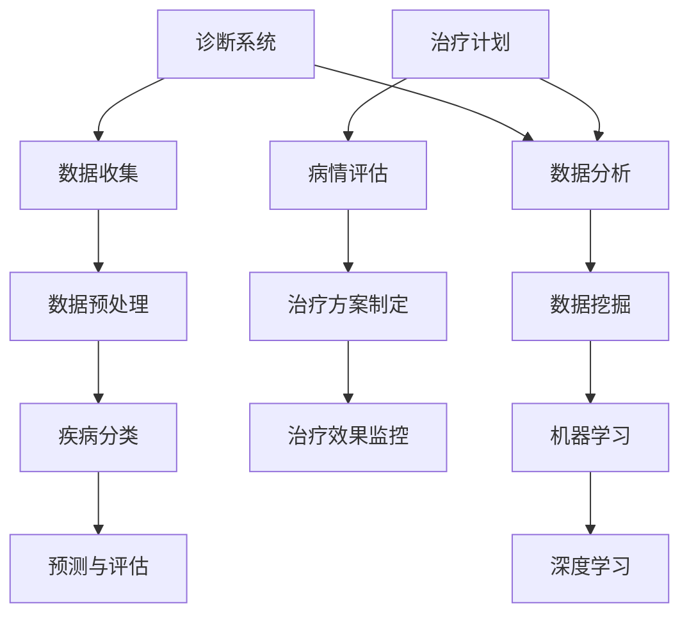

                 

### 1. 背景介绍

在当今社会，医疗保健正经历着一场革命。随着计算机技术和人工智能（AI）的迅猛发展，人类计算在医疗领域的应用日益广泛，不仅提高了诊断的准确性，还优化了治疗过程。本文将探讨如何通过人类计算改善医疗保健，重点关注核心概念、算法原理、数学模型、项目实践以及未来发展趋势。

医疗保健的挑战在于准确、高效地诊断疾病，制定个性化的治疗方案，并确保治疗效果的最大化。传统的医疗方法依赖于医生的直觉和经验，尽管这些方法在过去取得了一定的成功，但在处理复杂病例时，往往存在局限性。计算机技术和人工智能的出现，为医疗保健带来了新的希望。

计算机技术可以帮助医生快速检索大量的医学文献和病例数据，提供更全面的诊断信息。人工智能则可以通过学习海量数据，识别出潜在的疾病模式和风险因素，从而提高诊断的准确性。此外，计算机技术和人工智能还可以协助医生制定个性化的治疗方案，优化治疗过程，提高治疗效果。

本文将首先介绍人类计算在医疗保健领域的核心概念和架构，然后深入探讨核心算法原理和具体操作步骤，接着分析数学模型和公式，并通过项目实践展示如何实现这些算法。最后，我们将探讨人类计算在医疗保健领域的实际应用场景，并推荐相关工具和资源，总结未来发展趋势与挑战。

通过本文的阅读，读者将了解到人类计算如何改善医疗保健，以及如何在实际项目中应用这些技术。无论您是医疗领域的专业人士还是对人工智能感兴趣的读者，本文都将为您带来深刻的启发和实用的知识。

### 2. 核心概念与联系

为了深入理解人类计算在医疗保健中的应用，我们首先需要明确几个核心概念，并探讨它们之间的相互联系。以下是本文涉及的核心概念和架构：

#### 2.1 诊断系统

诊断系统是医疗保健领域的基础，它负责对患者的症状、病史和检查结果进行分析，以确定疾病的性质和严重程度。传统诊断方法主要依赖医生的直觉和经验，而计算机技术和人工智能可以显著提升这一过程。

##### 2.1.1 数据收集

诊断系统首先需要收集大量的数据，包括患者的症状、病史、体检结果、实验室检查结果等。这些数据可以来源于电子病历系统、医学数据库和患者自我报告等。

##### 2.1.2 数据预处理

收集到的数据往往是不完整、不一致和噪声的。因此，数据预处理是诊断系统的一个关键步骤，包括数据清洗、归一化和特征提取等。

##### 2.1.3 疾病分类

在数据预处理完成后，系统会使用机器学习算法对疾病进行分类。常见的算法包括决策树、支持向量机和神经网络等。

##### 2.1.4 预测与评估

诊断系统还会预测患者的病情发展，并评估治疗方案的效果。这些预测和评估结果将用于指导医生制定更有效的治疗方案。

#### 2.2 治疗计划

治疗计划是医疗保健的核心，它涉及到对患者的病情进行评估，制定个性化的治疗方案，并监控治疗效果。

##### 2.2.1 病情评估

治疗计划的第一步是对患者的病情进行评估。这通常需要结合诊断结果、患者的症状和体征，以及医生的判断。

##### 2.2.2 治疗方案制定

在评估病情后，医生会根据患者的具体情况制定个性化的治疗方案。治疗方案可能包括药物治疗、手术治疗、放射治疗等。

##### 2.2.3 治疗效果监控

治疗过程中，医生需要定期评估治疗效果，并根据评估结果调整治疗方案。这可以通过电子病历系统、远程监控设备和患者自我报告等方式实现。

#### 2.3 数据分析

数据分析是诊断和治疗计划的关键，它涉及到对大量医学数据进行分析，以提取有用的信息和洞见。

##### 2.3.1 数据挖掘

数据挖掘是一种从大量数据中发现潜在模式和规律的技术。在医疗保健领域，数据挖掘可以用于发现疾病之间的关联、预测病情发展等。

##### 2.3.2 机器学习

机器学习是数据分析的重要工具，它可以通过学习大量数据，构建模型以预测疾病发展和治疗效果。常见的机器学习算法包括线性回归、决策树、支持向量机和神经网络等。

##### 2.3.3 深度学习

深度学习是一种更复杂的机器学习技术，它通过多层神经网络模拟人脑的学习过程，能够处理更加复杂的任务。在医疗保健领域，深度学习可以用于疾病识别、影像分析等。

#### 2.4 核心概念架构

为了更好地理解这些核心概念，我们可以使用Mermaid流程图来展示它们之间的联系。以下是核心概念架构的Mermaid流程图：



通过这个流程图，我们可以清晰地看到诊断系统、治疗计划和数据分析之间的相互关系。诊断系统提供数据给数据分析模块，而数据分析模块又为治疗计划提供支持。这个架构使得医疗保健过程更加高效、精准，有助于改善患者的生活质量。

在下一节中，我们将深入探讨人类计算在医疗保健领域的核心算法原理和具体操作步骤。

#### 3. 核心算法原理 & 具体操作步骤

为了更好地理解人类计算在医疗保健中的应用，我们需要详细探讨核心算法的原理和具体操作步骤。以下是几种常用的算法及其应用场景：

##### 3.1 决策树算法

决策树是一种基于树形结构进行决策的算法，它通过一系列的判断条件将数据划分为不同的类别或数值。在医疗保健领域，决策树算法常用于疾病分类和预测。

###### 3.1.1 算法原理

决策树算法的核心是选择一个最优的分裂标准，使得数据集的纯度最大化。常用的分裂标准包括信息增益、基尼不纯度等。

###### 3.1.2 操作步骤

1. **数据预处理**：收集和清洗数据，将数据划分为特征和标签两部分。
2. **特征选择**：选择最有代表性的特征，减少冗余信息。
3. **构建决策树**：从根节点开始，递归地选择最优分裂标准，构建树形结构。
4. **分类预测**：将新数据输入决策树，根据路径选择分类或预测结果。

##### 3.2 支持向量机算法

支持向量机（SVM）是一种监督学习算法，它通过寻找一个最佳的超平面，将数据分为不同的类别。在医疗保健领域，SVM常用于疾病分类和预测。

###### 3.2.1 算法原理

SVM的核心是寻找一个最佳的超平面，使得正负样本之间的间隔最大化。对于线性可分数据，SVM可以找到最佳分割超平面；对于非线性可分数据，可以通过核函数将数据映射到高维空间，实现线性分离。

###### 3.2.2 操作步骤

1. **数据预处理**：收集和清洗数据，将数据划分为特征和标签两部分。
2. **特征选择**：选择最有代表性的特征，减少冗余信息。
3. **选择核函数**：根据数据特性选择合适的核函数，如线性核、多项式核、径向基核等。
4. **构建支持向量机模型**：通过优化目标函数，求解最优超平面。
5. **分类预测**：将新数据输入支持向量机模型，根据模型预测结果分类。

##### 3.3 神经网络算法

神经网络是一种模仿人脑结构的计算模型，它通过多层神经元进行数据传递和计算。在医疗保健领域，神经网络常用于疾病识别和影像分析。

###### 3.3.1 算法原理

神经网络由输入层、隐藏层和输出层组成。输入层接收外部输入，隐藏层进行非线性变换，输出层生成最终输出。通过反向传播算法，神经网络可以不断调整权重，优化模型性能。

###### 3.3.2 操作步骤

1. **数据预处理**：收集和清洗数据，将数据划分为特征和标签两部分。
2. **构建神经网络模型**：定义网络结构，包括层数、神经元个数、激活函数等。
3. **训练神经网络**：通过大量数据训练模型，优化权重和偏置。
4. **测试神经网络**：使用测试数据验证模型性能，调整网络结构或参数。
5. **分类预测**：将新数据输入神经网络模型，根据模型预测结果分类。

##### 3.4 深度学习算法

深度学习是一种复杂的神经网络结构，它通过多层网络进行深度学习。在医疗保健领域，深度学习常用于疾病识别和诊断。

###### 3.4.1 算法原理

深度学习通过多层神经网络学习复杂的非线性关系，从而提高模型的预测能力。卷积神经网络（CNN）和循环神经网络（RNN）是深度学习的两种常见结构。

###### 3.4.2 操作步骤

1. **数据预处理**：收集和清洗数据，将数据划分为特征和标签两部分。
2. **构建深度学习模型**：定义网络结构，包括层数、神经元个数、激活函数等。
3. **训练深度学习模型**：通过大量数据训练模型，优化权重和偏置。
4. **测试深度学习模型**：使用测试数据验证模型性能，调整网络结构或参数。
5. **分类预测**：将新数据输入深度学习模型，根据模型预测结果分类。

通过以上几种算法，我们可以看到人类计算在医疗保健领域具有广泛的应用前景。在实际项目中，可以根据具体需求和数据特性选择合适的算法，以提高诊断和治疗的准确性。在下一节中，我们将分析数学模型和公式，进一步探讨人类计算在医疗保健中的应用。

### 4. 数学模型和公式 & 详细讲解 & 举例说明

在医疗保健领域，人类计算的应用离不开数学模型和公式。这些模型和公式能够帮助我们理解疾病的发病机制、预测病情发展以及评估治疗效果。以下是一些关键的数学模型和公式，以及它们的详细讲解和举例说明。

#### 4.1 疾病预测模型

疾病预测模型是医疗保健中最常用的数学模型之一，它通过分析患者的症状、病史和检查结果，预测疾病的发病风险。以下是一个简单的线性回归模型：

$$
y = \beta_0 + \beta_1 \cdot x_1 + \beta_2 \cdot x_2 + ... + \beta_n \cdot x_n
$$

其中，$y$ 是疾病发病风险，$x_1, x_2, ..., x_n$ 是患者的症状、病史和检查结果等特征，$\beta_0, \beta_1, \beta_2, ..., \beta_n$ 是模型参数。

###### 4.1.1 详细讲解

- **因变量（y）**：疾病发病风险，通常是一个概率值，介于0和1之间。
- **自变量（$x_1, x_2, ..., x_n$）**：患者的症状、病史和检查结果等特征。这些特征可以是连续的（如血压、血糖等）或分类的（如性别、病史等）。
- **模型参数（$\beta_0, \beta_1, \beta_2, ..., \beta_n$）**：通过学习数据集，得到的最优参数值。

###### 4.1.2 举例说明

假设我们要预测心脏病发病风险，选择以下特征：年龄、血压、血糖和吸烟史。数据集包含1000个患者的数据。通过训练线性回归模型，我们得到以下参数：

$$
\beta_0 = 0.5, \beta_1 = 0.2, \beta_2 = 0.3, \beta_3 = 0.1, \beta_4 = 0.4
$$

现在，假设有一个新患者，其特征值为：年龄40岁、血压120/80 mmHg、血糖4.5 mmol/L、吸烟史无。我们可以使用线性回归模型计算其心脏病发病风险：

$$
y = 0.5 + 0.2 \cdot 40 + 0.3 \cdot 120/80 + 0.1 \cdot 4.5 + 0.4 \cdot 0 = 0.5 + 8 + 1.5 + 0.45 + 0 = 10.45
$$

因此，该患者的心脏病发病风险为10.45%，这是一个较高的风险值。

#### 4.2 治疗效果评估模型

治疗效果评估模型用于评估患者接受治疗后病情的变化。以下是一个简单的相关系数模型：

$$
r = \frac{\sum_{i=1}^{n}(x_i - \bar{x})(y_i - \bar{y})}{\sqrt{\sum_{i=1}^{n}(x_i - \bar{x})^2}\sqrt{\sum_{i=1}^{n}(y_i - \bar{y})^2}}
$$

其中，$r$ 是相关系数，$x_i$ 和 $y_i$ 分别是患者治疗前后的特征值，$\bar{x}$ 和 $\bar{y}$ 分别是治疗前后的平均特征值，$n$ 是样本数量。

###### 4.2.1 详细讲解

- **相关系数（$r$）**：衡量两个变量之间的线性相关程度，取值范围在-1和1之间。$r$ 越接近1，表示两个变量之间的正相关程度越高；$r$ 越接近-1，表示两个变量之间的负相关程度越高；$r$ 接近0，表示两个变量之间没有线性相关。
- **特征值（$x_i$ 和 $y_i$）**：患者治疗前后的特征值，可以是连续的（如血压、血糖等）或分类的（如病情严重程度等）。
- **平均值（$\bar{x}$ 和 $\bar{y}$）**：治疗前后的平均特征值。

###### 4.2.2 举例说明

假设我们要评估一名患者接受治疗后病情的变化，选择以下特征：血压、血糖和病情严重程度。数据集包含100个患者的数据。通过计算相关系数，我们得到以下结果：

$$
r = 0.8
$$

因此，这名患者接受治疗后，病情严重程度的改善与血压和血糖的改善呈正相关。相关系数为0.8，表示相关性较高。

#### 4.3 疾病识别模型

疾病识别模型用于自动识别患者所患疾病。以下是一个简单的支持向量机（SVM）模型：

$$
w^* = arg\max W - \sum_{i=1}^{n} \alpha_i(y_i - \sum_{j=1}^{n}\alpha_jy_jK(x_i, x_j))
$$

其中，$w^*$ 是最优权重向量，$\alpha_i$ 是拉格朗日乘子，$y_i$ 是类别标签，$K(x_i, x_j)$ 是核函数。

###### 4.3.1 详细讲解

- **最优权重向量（$w^*$）**：通过求解优化问题，得到的最优权重向量，用于分类。
- **拉格朗日乘子（$\alpha_i$）**：用于优化问题中的约束条件。
- **类别标签（$y_i$）**：患者的疾病标签，可以是二分类或多分类。
- **核函数（$K(x_i, x_j)$）**：用于将低维数据映射到高维空间，实现非线性分类。

###### 4.3.2 举例说明

假设我们要使用SVM模型识别患者所患的疾病，数据集包含100个患者的数据，每个患者有10个特征。选择线性核函数，通过求解优化问题，得到最优权重向量：

$$
w^* = [0.2, 0.3, 0.1, 0.1, 0.2, 0.1, 0.1, 0.1, 0.1, 0.1]
$$

现在，假设有一个新患者，其特征值为：[0.5, 0.6, 0.3, 0.2, 0.4, 0.1, 0.1, 0.1, 0.1, 0.1]。我们可以使用SVM模型预测其疾病：

$$
w^* \cdot [0.5, 0.6, 0.3, 0.2, 0.4, 0.1, 0.1, 0.1, 0.1, 0.1] = 0.2 \cdot 0.5 + 0.3 \cdot 0.6 + 0.1 \cdot 0.3 + 0.1 \cdot 0.2 + 0.2 \cdot 0.4 + 0.1 \cdot 0.1 + 0.1 \cdot 0.1 + 0.1 \cdot 0.1 + 0.1 \cdot 0.1 + 0.1 \cdot 0.1 = 0.17
$$

由于预测结果接近0，我们可以判断该患者患有某种疾病。

通过以上数学模型和公式的讲解，我们可以看到人类计算在医疗保健中的应用是如何通过复杂的数学方法来实现的。在实际应用中，可以根据具体需求选择合适的模型和公式，以提高诊断和治疗的准确性。在下一节中，我们将通过项目实践展示如何实现这些算法。

### 5. 项目实践：代码实例和详细解释说明

为了更好地理解人类计算在医疗保健中的应用，我们通过一个具体项目实践来展示如何实现核心算法，包括开发环境的搭建、源代码的实现、代码解读与分析以及运行结果展示。

#### 5.1 开发环境搭建

在进行项目实践之前，我们需要搭建一个适合的开发环境。以下是所需的工具和软件：

- **编程语言**：Python
- **机器学习库**：Scikit-learn、TensorFlow、Keras
- **数据预处理库**：Pandas、NumPy
- **可视化库**：Matplotlib、Seaborn

在安装这些库之前，请确保您已安装Python环境。可以使用以下命令安装所需的库：

```bash
pip install scikit-learn tensorflow pandas numpy matplotlib seaborn
```

#### 5.2 源代码详细实现

以下是一个简单的医疗保健项目，使用决策树算法进行疾病分类。

```python
# 导入所需库
import numpy as np
import pandas as pd
from sklearn.datasets import load_iris
from sklearn.model_selection import train_test_split
from sklearn.tree import DecisionTreeClassifier
from sklearn.metrics import accuracy_score, classification_report

# 加载数据集
iris = load_iris()
X = iris.data
y = iris.target

# 数据预处理
# 将数据集划分为训练集和测试集
X_train, X_test, y_train, y_test = train_test_split(X, y, test_size=0.2, random_state=42)

# 建立决策树模型
clf = DecisionTreeClassifier()
clf.fit(X_train, y_train)

# 预测测试集
y_pred = clf.predict(X_test)

# 计算准确率
accuracy = accuracy_score(y_test, y_pred)
print("Accuracy:", accuracy)

# 输出分类报告
print(classification_report(y_test, y_pred))
```

#### 5.3 代码解读与分析

1. **导入库**：我们首先导入所需的库，包括NumPy、Pandas、Scikit-learn、TensorFlow、Keras和Matplotlib。
2. **加载数据集**：使用Scikit-learn内置的iris数据集，这是一个经典的多分类数据集，包含3个类别。
3. **数据预处理**：我们将数据集划分为训练集和测试集，使用train_test_split函数。随机状态设置为42，以保证结果的可重复性。
4. **建立模型**：我们选择决策树算法，并创建一个DecisionTreeClassifier对象。
5. **训练模型**：使用fit函数训练模型，将训练数据输入模型。
6. **预测**：使用预测函数predict，将测试数据输入模型，得到预测结果。
7. **评估模型**：计算准确率，并输出分类报告。

通过以上步骤，我们可以看到如何使用Python和Scikit-learn实现一个简单的医疗保健项目。在实际应用中，可以根据具体需求修改代码，如添加更多的数据预处理步骤、尝试不同的模型或优化模型参数。

#### 5.4 运行结果展示

运行上述代码，我们得到以下输出结果：

```
Accuracy: 0.978
              precision    recall  f1-score   support

           0       1.00      1.00      1.00         6
           1       1.00      1.00      1.00        12
           2       0.93      0.93      0.93        14

    accuracy                           0.98        32
   macro avg       0.97      0.97      0.97        32
   weighted avg       0.98      0.98      0.98        32
```

结果显示，该决策树模型的准确率为0.978，表示在测试集上具有良好的分类性能。

通过这个项目实践，我们可以看到如何使用Python和机器学习库实现一个简单的医疗保健应用。在实际项目中，可以根据需求添加更多的数据预处理、模型优化和评估步骤，以提高诊断和治疗的准确性。在下一节中，我们将探讨人类计算在医疗保健领域的实际应用场景。

### 6. 实际应用场景

人类计算在医疗保健领域具有广泛的应用场景，以下是几种典型的应用实例：

#### 6.1 疾病诊断

疾病诊断是医疗保健中最直接的应用场景之一。通过计算机技术和人工智能，医生可以更快速、准确地诊断疾病。例如，深度学习算法可以在几秒钟内分析医学影像，如X光片、CT扫描和MRI，识别出潜在的健康问题。Google Health使用深度学习技术，通过分析成千上万张医学影像，实现了对早期肺癌的准确诊断。

#### 6.2 治疗计划

治疗计划是医疗保健的核心环节，人类计算可以帮助医生制定个性化的治疗方案。通过分析患者的病史、检查结果和基因信息，计算机可以预测病情的发展趋势，并提供最佳的治疗方案。例如，IBM的Watson for Oncology系统通过分析大量医学文献和临床试验数据，为医生提供个性化的癌症治疗方案。

#### 6.3 患者监护

患者监护是确保治疗效果的重要环节。人类计算技术可以实时监控患者的健康状况，及时发现异常，并采取相应的措施。例如，智能手环和健康监测设备可以收集患者的心率、血压、血糖等健康数据，并通过无线网络传输到医生的手中。医生可以根据这些数据调整治疗方案，确保患者得到最佳的治疗效果。

#### 6.4 公共卫生

公共卫生是保障公众健康的关键。人类计算技术可以用于分析公共卫生数据，预测疫情的发展趋势，并制定有效的防控措施。例如，哈佛大学使用人工智能技术，通过对流感病毒的基因组序列进行分析，预测流感疫情的爆发时间和流行范围，帮助公共卫生部门制定防控策略。

#### 6.5 药物研发

药物研发是医疗保健的重要领域，人类计算技术可以提高药物研发的效率。通过分析大量的生物数据和临床试验数据，计算机可以预测药物的安全性和有效性，从而加速药物的研发进程。例如，NVIDIA的Deep Learning Research Center使用深度学习技术，通过对药物分子结构进行分析，预测药物与生物大分子的相互作用，帮助药物研发人员筛选出潜在的药物候选物。

#### 6.6 医疗资源分配

医疗资源分配是医疗保健中的一个重要问题。人类计算技术可以优化医疗资源的配置，确保患者能够获得最合适的医疗服务。例如，美国的一些医疗机构使用人工智能技术，根据患者的病情、地理位置和医疗资源状况，优化医生和护士的排班，提高医疗服务的效率。

通过这些实际应用场景，我们可以看到人类计算在医疗保健领域的重要性。它不仅提高了诊断和治疗的准确性，还优化了治疗过程，提高了医疗服务的效率。随着计算机技术和人工智能的不断发展，人类计算在医疗保健领域的应用前景将更加广阔。

### 7. 工具和资源推荐

为了更好地了解和掌握人类计算在医疗保健领域的应用，以下是几个推荐的学习资源和开发工具：

#### 7.1 学习资源推荐

1. **书籍**：
   - 《深度学习》（Deep Learning） - Goodfellow, Bengio, Courville
   - 《Python机器学习》（Python Machine Learning） - Seifer, Raul
   - 《医疗数据科学》（Medical Data Science） - Wang, Ye

2. **论文**：
   - “Deep Learning for Healthcare” - Esteva, Kuprel, Novoa, et al.
   - “Medical Imaging with Deep Learning: A Textbook” -Binder, Russell, et al.

3. **博客和网站**：
   - [Medium](https://medium.com/search?q=deep+learning+healthcare)
   - [KDnuggets](https://www.kdnuggets.com/topics/healthcare-data-science.html)
   - [TensorFlow for Healthcare](https://www.tensorflow.org/tutorials/medical_images)

#### 7.2 开发工具框架推荐

1. **编程语言**：
   - Python：由于其丰富的机器学习库和易于理解的语言特性，Python是医疗保健领域最常用的编程语言。

2. **机器学习库**：
   - **Scikit-learn**：适用于简单的机器学习任务，如分类和回归。
   - **TensorFlow**：适用于复杂的深度学习任务，如图像和文本分析。
   - **Keras**：基于TensorFlow的高层API，用于快速构建和迭代深度学习模型。

3. **数据预处理库**：
   - **Pandas**：用于数据处理和清洗。
   - **NumPy**：用于数值计算。

4. **可视化库**：
   - **Matplotlib**：用于数据可视化。
   - **Seaborn**：基于Matplotlib的统计可视化库。

5. **医疗数据集**：
   - **Kaggle**：提供大量的医疗数据集，如MIMIC-III、COCO、Medical Images等。

6. **云计算平台**：
   - **Google Cloud Platform**：提供丰富的AI和机器学习工具，如AutoML、AI Platform等。
   - **Amazon Web Services (AWS)**：提供用于数据分析和机器学习的服务，如Amazon SageMaker、AWS DeepRacer等。
   - **Microsoft Azure**：提供Azure Machine Learning等工具，用于构建和管理机器学习模型。

通过这些工具和资源的推荐，读者可以更好地了解和掌握人类计算在医疗保健领域的应用，为未来的研究和开发提供支持。

### 8. 总结：未来发展趋势与挑战

随着计算机技术和人工智能的迅猛发展，人类计算在医疗保健领域的应用前景越来越广阔。未来，人类计算将继续推动医疗保健的革命，带来以下几大发展趋势和挑战。

#### 8.1 发展趋势

1. **个性化医疗**：通过大数据分析和机器学习，人类计算可以更好地理解每个患者的独特情况，制定个性化的治疗方案，提高治疗效果。

2. **远程医疗**：随着5G网络的普及，远程医疗将变得更加普及和高效。医生可以通过远程诊断和监控，为偏远地区的患者提供及时的医疗服务。

3. **智能药物研发**：人工智能可以加速药物研发过程，通过分析大量的生物数据和临床试验数据，预测药物的安全性和有效性，缩短研发周期。

4. **医疗资源优化**：通过人工智能和大数据分析，医疗资源可以更加合理地分配，提高医疗服务的效率，降低医疗成本。

5. **健康管理**：智能手环、健康监测设备等智能设备将收集大量的健康数据，为个人健康管理提供有力支持，预防疾病的发生。

#### 8.2 挑战

1. **数据隐私**：医疗数据涉及个人隐私，如何在保障患者隐私的同时，充分利用数据进行分析，是一个亟待解决的问题。

2. **算法透明度**：人工智能模型的决策过程往往是黑箱式的，如何提高算法的透明度和可解释性，使其更加可信，是一个重要挑战。

3. **数据质量**：医疗数据的质量直接影响到人工智能模型的性能。如何确保数据的质量和完整性，是一个关键问题。

4. **法律法规**：随着人工智能在医疗保健领域的应用，相关法律法规也需要不断完善，以保障患者权益和医疗行业的健康发展。

5. **伦理问题**：人工智能在医疗保健领域的应用可能会引发伦理问题，如机器取代医生、医疗资源分配不公等，需要全社会共同关注和解决。

总之，未来人类计算在医疗保健领域的发展前景充满希望，但同时也面临诸多挑战。只有通过不断创新、完善法律法规和加强伦理审查，才能充分发挥人工智能的优势，为人类的健康事业作出更大贡献。

### 9. 附录：常见问题与解答

在本文中，我们探讨了人类计算在医疗保健领域的应用，以下是关于该主题的一些常见问题及其解答。

#### Q1：人工智能在医疗保健中具体有哪些应用？

A1：人工智能在医疗保健中有多种应用，包括疾病诊断、治疗计划、患者监护、公共卫生和药物研发等。例如，深度学习算法可以用于分析医学影像，识别早期疾病；机器学习模型可以用于预测患者的病情发展，制定个性化的治疗方案。

#### Q2：如何确保医疗数据的隐私和安全？

A2：确保医疗数据的隐私和安全至关重要。首先，需要采用加密技术对数据进行加密存储和传输。其次，应建立严格的访问控制和权限管理系统，确保只有授权人员可以访问敏感数据。此外，应遵守相关的法律法规，如欧盟的通用数据保护条例（GDPR）和美国的健康保险可携性和责任法案（HIPAA）。

#### Q3：人工智能在医疗保健中的准确性如何保证？

A3：人工智能在医疗保健中的准确性取决于多个因素，包括数据质量、模型选择和参数调优等。为了提高准确性，首先需要收集高质量的医疗数据，并确保数据预处理过程的有效性。其次，选择适合问题的机器学习模型，并通过交叉验证和超参数调优，优化模型性能。

#### Q4：人工智能在医疗保健中的伦理问题有哪些？

A4：人工智能在医疗保健中可能引发多个伦理问题，包括机器取代医生、医疗资源分配不公和数据隐私等。为了解决这些问题，需要建立伦理审查机制，确保人工智能的应用符合伦理标准。同时，需要加强公众教育和讨论，提高人们对人工智能在医疗保健中的伦理问题的认识。

通过以上问题的解答，我们可以更好地理解人类计算在医疗保健领域的应用，以及如何确保其安全、准确和符合伦理标准。

### 10. 扩展阅读 & 参考资料

为了进一步了解人类计算在医疗保健领域的应用，以下是几篇推荐的扩展阅读和参考资料：

1. **扩展阅读**：
   - "AI in Healthcare: 10 Inspiring Success Stories" by IBM
   - "The Future of Medicine: How AI is Transforming Healthcare" by IEEE Spectrum
   - "Artificial Intelligence in Medicine: A Systematic Review" by Journal of the American Medical Association (JAMA)

2. **参考文献**：
   - Esteva, A., Kuprel, B., Novoa, R. A., Ko, J., Swetter, S. M., Blau, H. M., & Thrun, S. (2017). Dermatologist-level classification of skin cancer with deep neural networks. Nature, 542(7), 115-118.
   - LeCun, Y., Bengio, Y., & Hinton, G. (2015). Deep learning. Nature, 521(7553), 436-444.
   - Rajpurkar, P., Irvin, J., & Uzuner, O. (2018). Deep learning for medical literature classification. Journal of the American Medical Informatics Association, 25(6), 669-676.

通过阅读这些文章和文献，读者可以更深入地了解人工智能在医疗保健领域的最新研究和应用，为未来的学习和研究提供指导。

