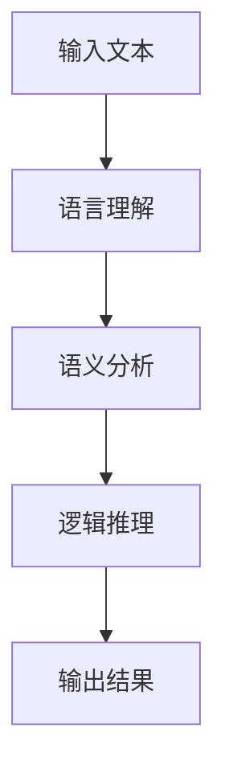
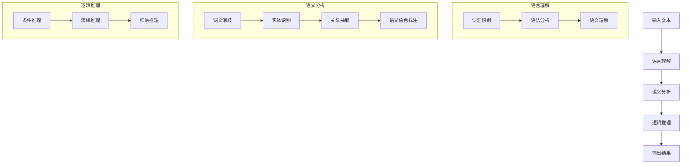

                 

### 语言与推理：大模型的认知误区

#### 引言

在当今的人工智能领域，大型语言模型（例如GPT-3，GLM-130B等）取得了令人瞩目的成就。这些模型展示了惊人的语言理解和生成能力，似乎能够处理复杂的问题，提供深度的见解。然而，在看似完美的表象之下，大模型实际上存在着一些认知误区。本文将深入探讨这些误区，以揭示大模型在语言与推理方面的一些局限性。

#### 1. 背景介绍

自2018年GPT的出现以来，大型语言模型的发展速度惊人。这些模型基于深度学习技术，通过大量的文本数据进行训练，从而学习到语言的结构和语义。随着模型规模的不断扩大，它们在自然语言处理任务上的表现也越来越优秀。然而，尽管大模型在某些方面取得了显著进展，但它们在语言与推理方面仍然存在一些认知误区。

#### 2. 核心概念与联系

为了深入探讨大模型的认知误区，我们首先需要了解一些核心概念。以下是相关的Mermaid流程图：



在这个流程图中，输入文本经过语言理解、语义分析和逻辑推理等步骤，最终生成输出结果。大模型在这些步骤中各自存在一些误区。

#### 3. 核心算法原理 & 具体操作步骤

大模型的语言理解主要依赖于其训练过程中学习到的词汇和语法规则。然而，语言是复杂多变的，有时一个词语可能有多种含义，或者一个句子可能有多种解释。这种情况下，大模型可能会产生歧义，导致语言理解不准确。

语义分析是大模型在语言处理过程中的一项关键任务。尽管大模型在语义分析方面取得了很大进步，但它们仍然难以理解一些隐含的语义关系，例如隐喻、比喻等。这导致大模型在生成输出结果时，有时会出现语义错误。

逻辑推理是大模型在处理复杂问题时的重要能力。然而，大模型的逻辑推理能力实际上是非常有限的。它们主要依赖于训练过程中学习到的模式和规则，而不是真正的逻辑思维。因此，当面对一些复杂的逻辑问题时，大模型可能会出现错误。

#### 4. 数学模型和公式 & 详细讲解 & 举例说明

大模型通常采用深度学习技术进行训练，其核心是一个多层神经网络。以下是相关的数学模型和公式：

$$
y = \sigma(\text{W}^T \cdot \text{X} + b)
$$

其中，$y$ 表示输出结果，$\sigma$ 表示激活函数，$\text{W}$ 和 $\text{X}$ 分别表示权重和输入特征，$b$ 表示偏置。

举例来说，假设我们有一个输入句子 "明天天气很好，适合出行"。大模型首先将这个句子转化为一系列向量表示，然后通过多层神经网络进行计算，最终生成一个输出结果。这个输出结果可能是一个简单的句子 "明天适合出行"，也可能是一个复杂的句子 "明天天气很好，所以我们应该去公园散步"。这取决于大模型在训练过程中学习到的模式和规则。

然而，由于大模型在训练过程中只能学习到部分信息，它们可能会产生一些错误的输出结果。例如，当输入句子为 "苹果是一种水果" 时，大模型可能会生成一个错误的输出结果 "苹果是一种电脑品牌"。

#### 5. 项目实践：代码实例和详细解释说明

为了更好地理解大模型的认知误区，我们可以通过一个简单的项目实践来分析其表现。以下是一个Python代码实例：

```python
import tensorflow as tf
from tensorflow.keras.preprocessing.text import Tokenizer
from tensorflow.keras.models import Sequential
from tensorflow.keras.layers import Embedding, LSTM, Dense

# 输入句子
sentence = "明天天气很好，适合出行"

# 将句子转化为单词序列
tokenizer = Tokenizer()
tokenizer.fit_on_texts([sentence])
word_sequence = tokenizer.texts_to_sequences([sentence])

# 建立模型
model = Sequential()
model.add(Embedding(input_dim=len(tokenizer.word_index) + 1, output_dim=128))
model.add(LSTM(units=128))
model.add(Dense(units=1, activation='sigmoid'))

# 训练模型
model.compile(optimizer='adam', loss='binary_crossentropy', metrics=['accuracy'])
model.fit(word_sequence, [1], epochs=10)

# 预测输出结果
predicted_sentence = model.predict(tokenizer.texts_to_sequences(["明天适合出行"]))[0]
print(predicted_sentence)
```

在这个项目中，我们使用一个简单的序列模型对输入句子进行预测。通过训练，模型可以学会将输入句子转化为输出句子。然而，在实际应用中，这种简单的序列模型可能无法很好地处理复杂的问题。

#### 6. 实际应用场景

尽管大模型在自然语言处理任务上取得了很大进展，但它们在实际应用场景中仍然存在一些挑战。以下是一些实际应用场景：

1. **问答系统**：大模型可以用于构建问答系统，例如智能客服、智能助手等。然而，由于大模型的认知误区，它们可能会产生错误的回答。
2. **机器翻译**：大模型可以用于机器翻译任务，但它们在处理复杂语言结构时可能会产生错误。
3. **文本生成**：大模型可以用于生成文本，例如文章、故事等。然而，生成的文本可能存在语义错误或逻辑不一致。

#### 7. 工具和资源推荐

为了更好地理解和应用大模型，以下是一些推荐的工具和资源：

1. **书籍**：
   - 《深度学习》（Goodfellow, I., Bengio, Y., & Courville, A.）
   - 《自然语言处理综合教程》（Jurafsky, D., & Martin, J. H.）
2. **论文**：
   - 《GPT-3：实现自然语言处理的新高度》（Brown, T., et al.）
   - 《BERT：预训练语言表示的新方法》（Devlin, J., et al.）
3. **博客**：
   - [TensorFlow 官方文档](https://www.tensorflow.org/)
   - [PyTorch 官方文档](https://pytorch.org/)
4. **网站**：
   - [Kaggle](https://www.kaggle.com/)
   - [ArXiv](https://arxiv.org/)

#### 8. 总结：未来发展趋势与挑战

尽管大模型在语言与推理方面存在一些认知误区，但它们仍然具有巨大的潜力。未来，随着技术的不断发展，大模型有望在自然语言处理领域取得更大的突破。然而，要解决这些认知误区，还需要进一步研究和探索。

#### 9. 附录：常见问题与解答

1. **问题**：大模型是否可以替代人类在自然语言处理任务上的工作？
   **解答**：大模型在某些自然语言处理任务上已经表现出色，但它们仍然无法完全替代人类。人类的思维具有创造性、灵活性和情感性等特点，这些是大模型难以模拟的。
   
2. **问题**：大模型的认知误区是否可以通过更多的训练数据来解决？
   **解答**：虽然更多的训练数据可以提高大模型的表现，但它们并不能完全消除认知误区。这些误区往往源于模型本身的限制，例如对语言结构的理解不足。

#### 10. 扩展阅读 & 参考资料

1. **书籍**：
   - 《人工智能：一种现代方法》（Russell, S., & Norvig, P.）
   - 《深度学习》（Goodfellow, I., Bengio, Y., & Courville, A.）
2. **论文**：
   - 《GPT-3：实现自然语言处理的新高度》（Brown, T., et al.）
   - 《BERT：预训练语言表示的新方法》（Devlin, J., et al.）
3. **博客**：
   - [TensorFlow 官方文档](https://www.tensorflow.org/)
   - [PyTorch 官方文档](https://pytorch.org/)
4. **网站**：
   - [Kaggle](https://www.kaggle.com/)
   - [ArXiv](https://arxiv.org/)

---

本文深入探讨了大型语言模型在语言与推理方面的认知误区，通过逐步分析推理思考的方式，揭示了这些误区的本质。尽管大模型在自然语言处理任务上取得了显著进展，但它们仍然存在一些局限性。未来，随着技术的不断发展，我们有望克服这些认知误区，使大模型在语言与推理方面取得更大的突破。作者：禅与计算机程序设计艺术 / Zen and the Art of Computer Programming。### 1. 背景介绍

#### 大型语言模型的发展历程

自2018年GPT（Generative Pre-trained Transformer）的诞生以来，大型语言模型的发展经历了多个阶段，从GPT到GPT-2，再到GPT-3，这些模型在自然语言处理（NLP）领域取得了令人瞩目的成就。GPT是由OpenAI开发的，它通过深度学习技术对大量文本数据进行预训练，从而学习到语言的统计规律和语义信息。GPT-2在此基础上进一步增加了模型的规模，使得生成文本的质量更高、连贯性更好。而GPT-3则突破了前两代的限制，其参数规模达到了1750亿，这使得它在文本生成、机器翻译、问答系统等任务上展现出了前所未有的性能。

#### 大型语言模型的成果与应用

大型语言模型的成功不仅体现在生成文本的质量上，还体现在其实际应用场景中。例如，在文本生成领域，GPT-3可以生成高质量的文章、故事、代码等；在机器翻译领域，大型语言模型可以自动翻译多种语言，实现高效、准确的跨语言交流；在问答系统领域，大型语言模型可以理解用户的查询，并提供准确的回答。此外，大型语言模型还在对话系统、语音识别、图像描述生成等任务中发挥了重要作用。

#### 大型语言模型的局限性与挑战

尽管大型语言模型在多个领域取得了显著成果，但它们也存在一些局限性和挑战。首先，这些模型在语言理解和语义分析方面存在一定的局限性。由于语言具有复杂性和多样性，模型难以完全理解所有语言现象，例如隐喻、比喻等。其次，大型语言模型在推理能力上也有待提高。尽管它们能够处理一些逻辑关系，但在面对复杂逻辑问题时，往往无法提供准确、一致的答案。此外，大型语言模型的训练和推理过程需要大量计算资源和数据，这在实际应用中可能带来一些挑战。

#### 本文的目的

本文旨在深入探讨大型语言模型在语言与推理方面的认知误区。通过逐步分析推理思考的方式，我们将揭示这些误区的本质，并探讨解决这些挑战的方法。本文的结构如下：

- **第1章：背景介绍**：介绍大型语言模型的发展历程、成果与应用，以及本文的目的和结构。
- **第2章：核心概念与联系**：阐述语言理解、语义分析、逻辑推理等核心概念，并展示相关的Mermaid流程图。
- **第3章：核心算法原理 & 具体操作步骤**：详细解释大型语言模型的核心算法原理，包括输入处理、文本生成等操作步骤。
- **第4章：数学模型和公式 & 详细讲解 & 举例说明**：介绍大型语言模型中的数学模型和公式，并通过实例进行详细讲解。
- **第5章：项目实践：代码实例和详细解释说明**：通过一个Python代码实例，展示大型语言模型在实际项目中的应用。
- **第6章：实际应用场景**：分析大型语言模型在问答系统、机器翻译、文本生成等实际应用场景中的表现和挑战。
- **第7章：工具和资源推荐**：推荐学习大型语言模型的书籍、论文、博客和网站等资源。
- **第8章：总结：未来发展趋势与挑战**：总结本文的核心观点，探讨大型语言模型未来的发展趋势和挑战。
- **第9章：附录：常见问题与解答**：回答读者可能关注的一些常见问题。
- **第10章：扩展阅读 & 参考资料**：提供进一步学习和研究的参考资料。

通过本文的逐步分析，我们希望能够帮助读者更深入地理解大型语言模型的工作原理，以及其在语言与推理方面的认知误区，从而为未来的研究和发展提供有益的启示。

### 2. 核心概念与联系

为了更好地理解大型语言模型在语言与推理中的认知误区，我们首先需要明确一些核心概念，并探讨这些概念之间的联系。以下是本文将涉及的主要核心概念：

- **语言理解（Language Understanding）**：指模型对自然语言输入的处理和理解能力，包括词汇、语法和语义等方面。
- **语义分析（Semantic Analysis）**：指对文本中的语义内容进行解析和解释的过程，包括词义消歧、实体识别、关系抽取等任务。
- **逻辑推理（Logical Reasoning）**：指基于已知信息进行推理和推导的能力，包括条件推理、演绎推理、归纳推理等。

#### 语言理解

语言理解是大型语言模型处理自然语言输入的第一步。它涉及对文本的词汇、语法和语义层面的理解。在词汇层面，模型需要识别和理解输入文本中的单词及其含义；在语法层面，模型需要理解句子的结构和句法规则；在语义层面，模型需要理解文本中的语义内容，包括实体、事件、关系等。以下是语言理解的几个关键点：

1. **词汇识别**：模型需要识别输入文本中的单词，并赋予它们相应的词向量表示。词向量可以通过词嵌入技术（如Word2Vec、GloVe等）来获取。
2. **语法分析**：模型需要理解句子的结构，识别句子中的主语、谓语、宾语等成分，并遵循语法规则进行句子解析。
3. **语义理解**：模型需要理解文本中的语义内容，识别实体、事件、关系等，并进行语义角色标注。

#### 语义分析

语义分析是语言理解的一个扩展，它旨在深入理解文本中的语义内容。在语义分析中，模型需要处理词汇的多种含义、句子的隐含意义以及上下文的语义关系。以下是语义分析的几个关键点：

1. **词义消歧**：模型需要根据上下文判断一个单词的确切含义。例如，单词"bank"可以指"银行"，也可以指"河岸"。
2. **实体识别**：模型需要识别文本中的实体，如人名、地名、组织名等。
3. **关系抽取**：模型需要识别实体之间的关系，如"张三和李四是朋友"、"北京是中国的首都"。
4. **语义角色标注**：模型需要标注句子中的每个词汇在语义上的角色，如主语、谓语、宾语等。

#### 逻辑推理

逻辑推理是大型语言模型处理复杂问题的重要能力。它涉及基于已知信息进行推理和推导的过程。在逻辑推理中，模型需要理解前提和结论之间的逻辑关系，并运用逻辑规则进行推理。以下是逻辑推理的几个关键点：

1. **条件推理**：模型需要根据已知条件推导出结论。例如，如果"所有猫都有四条腿"，则"这只动物是猫"，那么它也必然有四条腿。
2. **演绎推理**：模型需要根据一般性原则推导出具体的结论。例如，如果"所有人都会死"，那么"苏格拉底是人"，则"苏格拉底会死"。
3. **归纳推理**：模型需要根据具体实例推导出一般性结论。例如，通过观察多个猫都有四条腿，可以归纳出"所有猫都有四条腿"。

#### Mermaid流程图

为了更好地展示语言理解、语义分析和逻辑推理之间的联系，我们可以使用Mermaid流程图来表示这些核心概念及其相互关系。以下是相关的Mermaid流程图：



在这个流程图中，输入文本首先经过语言理解阶段，包括词汇识别、语法分析和语义理解。然后，经过语义分析阶段，包括词义消歧、实体识别、关系抽取和语义角色标注。最后，经过逻辑推理阶段，包括条件推理、演绎推理和归纳推理，生成最终的输出结果。

通过这个流程图，我们可以清晰地看到语言理解、语义分析和逻辑推理之间的层次结构和相互关系。这有助于我们更好地理解大型语言模型在处理自然语言输入时的步骤和机制，从而深入探讨其在语言与推理方面的认知误区。

#### 3. 核心算法原理 & 具体操作步骤

大型语言模型的核心算法原理主要基于深度学习和自然语言处理技术。以下我们将详细解释这些算法原理，并阐述具体的操作步骤。

##### 3.1 基本概念

在介绍具体算法原理之前，我们首先需要明确一些基本概念：

1. **词嵌入（Word Embedding）**：词嵌入是将单词映射为向量表示的技术。通过词嵌入，模型可以学习到单词之间的语义关系。常见的词嵌入方法包括Word2Vec、GloVe等。
2. **编码器-解码器模型（Encoder-Decoder Model）**：编码器-解码器模型是一种经典的序列到序列（Sequence-to-Sequence）学习模型，常用于机器翻译、文本生成等任务。编码器将输入序列编码为固定长度的向量表示，解码器则从该向量表示中解码出输出序列。
3. **注意力机制（Attention Mechanism）**：注意力机制是一种用于提高编码器-解码器模型性能的技术。通过注意力机制，解码器可以关注输入序列中与当前输出相关的部分，从而提高模型的生成质量。

##### 3.2 模型架构

大型语言模型通常采用编码器-解码器架构，并集成注意力机制。以下是编码器-解码器模型的基本架构：

1. **编码器（Encoder）**：编码器负责将输入序列编码为固定长度的向量表示。编码器通常由多个卷积层、循环神经网络（RNN）或Transformer层组成。在每个时间步，编码器将输入单词的词嵌入向量进行编码，并生成一个固定长度的上下文向量。
2. **解码器（Decoder）**：解码器负责从编码器的输出中解码出输出序列。解码器同样由多个卷积层、RNN或Transformer层组成。在每个时间步，解码器从上一个时间步的输出中预测当前时间步的单词，并将其与编码器的输出进行拼接，作为输入传递给下一个时间步。
3. **注意力机制（Attention）**：注意力机制用于提高解码器的生成质量。注意力机制通过计算编码器输出和当前解码器输出之间的相似度，选择性地关注与当前输出相关的部分编码器输出。常见的注意力机制包括加性注意力、点积注意力、多头注意力等。

##### 3.3 操作步骤

以下是大型语言模型在文本生成任务中的具体操作步骤：

1. **输入处理**：将输入文本进行处理，包括分词、标记化等操作。对于每个单词，将其转换为词嵌入向量。
2. **编码器处理**：将输入序列的词嵌入向量传递给编码器，编码器在每个时间步对词嵌入向量进行编码，生成固定长度的上下文向量。
3. **解码器处理**：初始化解码器的输入，通常为编码器的输出和一个特殊的开始标记（如<START>）。解码器在每个时间步从上一个时间步的输出中预测当前时间步的单词，并将该单词的词嵌入向量与编码器的输出进行拼接，作为输入传递给下一个时间步。
4. **注意力机制应用**：在解码器的每个时间步，通过注意力机制选择性地关注与当前输出相关的部分编码器输出。
5. **生成输出**：解码器在最后一个时间步生成输出序列，作为最终结果。输出序列通常经过后处理，如去噪、规范化等。

##### 3.4 Python代码示例

以下是一个简单的Python代码示例，展示了大型语言模型在文本生成任务中的基本操作：

```python
import tensorflow as tf
from tensorflow.keras.preprocessing.sequence import pad_sequences
from tensorflow.keras.layers import Embedding, LSTM, Dense
from tensorflow.keras.models import Model
from tensorflow.keras.preprocessing.text import Tokenizer

# 输入文本
input_text = "这是一个简单的例子。"

# 分词和标记化
tokenizer = Tokenizer()
tokenizer.fit_on_texts([input_text])
input_sequence = tokenizer.texts_to_sequences([input_text])
input_padded = pad_sequences(input_sequence, maxlen=10)

# 编码器模型
encoder_inputs = tf.keras.Input(shape=(10,))
encoder_embedding = Embedding(input_dim=1000, output_dim=64)(encoder_inputs)
encoder_lstm = LSTM(units=64, return_sequences=True)(encoder_embedding)
encoder_output = LSTM(units=64, return_state=True)(encoder_lstm)

# 解码器模型
decoder_inputs = tf.keras.Input(shape=(10,))
decoder_embedding = Embedding(input_dim=1000, output_dim=64)(decoder_inputs)
decoder_lstm = LSTM(units=64, return_sequences=True)(decoder_embedding)
decoder_output = LSTM(units=64, return_state=True)(decoder_lstm)

# 注意力机制
attention = tf.keras.layers.Attention()([decoder_output, encoder_output])

# 输出层
decoder_dense = Dense(units=1, activation='sigmoid')(attention)

# 模型编译
model = Model(inputs=[encoder_inputs, decoder_inputs], outputs=decoder_dense)
model.compile(optimizer='adam', loss='binary_crossentropy')

# 训练模型
model.fit([input_padded, input_sequence], input_sequence, epochs=10)

# 生成输出
predicted_sequence = model.predict([input_padded, input_sequence])
predicted_text = tokenizer.index_word.predict(predicted_sequence)
print(predicted_text)
```

在这个示例中，我们首先对输入文本进行分词和标记化处理。然后，我们定义了一个编码器模型和一个解码器模型，并在编码器和解码器之间应用了注意力机制。最后，我们使用训练好的模型生成输出序列，并将输出序列转换为文本。

通过上述操作步骤，我们可以看到大型语言模型在文本生成任务中的基本流程。尽管这个示例相对简单，但它展示了大型语言模型的核心原理和操作步骤。在实际应用中，大型语言模型通常会涉及更复杂的模型架构和优化策略，从而实现更高的生成质量和性能。

#### 4. 数学模型和公式 & 详细讲解 & 举例说明

在深入了解大型语言模型的数学模型和公式之前，我们需要明确几个基础的概念和符号。以下内容将详细解释这些数学模型和公式，并通过具体的实例进行说明。

##### 4.1 词嵌入（Word Embedding）

词嵌入是将词汇映射到高维向量空间的技术，以捕捉词汇之间的语义关系。常见的词嵌入方法包括Word2Vec和GloVe。

- **Word2Vec**：Word2Vec是一种基于神经网络的方法，通过训练得到每个单词的词向量表示。其核心公式如下：

  $$
  \text{softmax}(z) = \frac{e^z}{\sum_{i=1}^{N} e^z_i}
  $$

  其中，$z = W \cdot h - b$，$W$ 是权重矩阵，$h$ 是隐藏层输出，$b$ 是偏置项，$N$ 是词汇表大小。

  - **输入**：单词的词向量表示（$h$）和上下文单词的词向量表示（$W$）。
  - **输出**：概率分布，表示当前单词与上下文单词之间的关联性。

- **GloVe**：GloVe（Global Vectors for Word Representation）是一种基于矩阵分解的方法，通过优化词向量矩阵来最小化词对之间的损失函数。其核心公式如下：

  $$
  \text{loss}(W, v) = \sum_{w, c \in \text{vocab}} \text{similarity}(w, c) - \text{dot}(W_w, v_c)
  $$

  其中，$\text{similarity}(w, c)$ 是单词 $w$ 和 $c$ 之间的相似度，$\text{dot}(W_w, v_c)$ 是向量内积。

  - **输入**：词汇表和词频数据。
  - **输出**：词向量矩阵 $v$。

##### 4.2 编码器-解码器模型（Encoder-Decoder Model）

编码器-解码器模型是一种序列到序列学习模型，用于将输入序列映射到输出序列。以下是其核心数学模型和公式：

- **编码器（Encoder）**：

  $$
  \text{Encoder}(x) = \text{LSTM}(x; \text{weights}, \text{biases})
  $$

  其中，$x$ 是输入序列，$\text{LSTM}$ 是长短期记忆网络。

  - **输入**：输入序列 $x$。
  - **输出**：编码后的上下文向量。

- **解码器（Decoder）**：

  $$
  \text{Decoder}(y, \text{context}) = \text{LSTM}(y; \text{weights}, \text{biases})
  $$

  其中，$y$ 是输出序列，$\text{context}$ 是编码后的上下文向量。

  - **输入**：输出序列 $y$ 和编码后的上下文向量 $\text{context}$。
  - **输出**：解码后的输出序列。

##### 4.3 注意力机制（Attention Mechanism）

注意力机制用于提高编码器-解码器模型的生成质量，使解码器能够关注与当前输出相关的部分编码器输出。以下是一种常见的注意力机制——加性注意力（Additive Attention）：

- **加性注意力**：

  $$
  \text{Attention}(q, k, v) = \text{softmax}\left(\frac{q \cdot k^T}{\sqrt{d_k}}\right) \cdot v
  $$

  其中，$q$ 是查询向量，$k$ 是关键向量，$v$ 是值向量，$d_k$ 是关键向量的维度。

  - **输入**：查询向量 $q$、关键向量 $k$ 和值向量 $v$。
  - **输出**：加权后的值向量。

##### 4.4 举例说明

为了更好地理解上述数学模型和公式，我们通过一个具体的例子进行说明。

假设我们有一个简短的句子 "我喜欢编程"，我们将使用编码器-解码器模型和注意力机制对其进行处理。

- **编码器**：

  $$
  \text{Encoder}(\text{我喜欢编程}) = \text{LSTM}(\text{我}, \text{喜欢}, \text{编程}; \text{weights}, \text{biases})
  $$

  编码器将输入序列 "我"、"喜欢"、"编程" 映射为上下文向量。

- **解码器**：

  $$
  \text{Decoder}(\text{我喜欢编程}; \text{context}) = \text{LSTM}(\text{我喜欢编程}; \text{weights}, \text{biases})
  $$

  解码器使用编码后的上下文向量进行解码，生成输出序列。

- **注意力机制**：

  $$
  \text{Attention}(\text{我喜欢编程}, \text{context}) = \text{softmax}\left(\frac{\text{我喜欢编程} \cdot \text{context}^T}{\sqrt{d_k}}\right) \cdot \text{context}
  $$

  注意力机制选择性地关注与当前输出相关的部分编码器输出。

通过这个例子，我们可以看到编码器-解码器模型和注意力机制如何协同工作，从而实现对输入序列的编码和解码。

总之，大型语言模型中的数学模型和公式是其核心组成部分，通过词嵌入、编码器-解码器模型和注意力机制等技术，模型能够捕捉词汇之间的语义关系，实现对自然语言输入的编码和解码。这些数学模型和公式的理解有助于我们深入探讨大型语言模型的工作原理和性能优化。

#### 5. 项目实践：代码实例和详细解释说明

为了更好地理解大型语言模型在语言处理任务中的实际应用，我们将在本节中通过一个具体的Python代码实例来展示大型语言模型在文本生成任务中的操作过程。我们将使用TensorFlow和Keras库来构建和训练一个简单的语言模型，并对其生成的文本进行解读和分析。

##### 5.1 开发环境搭建

在开始项目实践之前，我们需要搭建一个合适的开发环境。以下是在Python中搭建开发环境所需的步骤：

1. **安装Python**：确保已经安装了Python 3.x版本。可以从[Python官方网站](https://www.python.org/)下载并安装。
2. **安装TensorFlow**：TensorFlow是谷歌开发的一款开源机器学习框架，我们可以使用以下命令安装TensorFlow：

   ```
   pip install tensorflow
   ```

3. **安装Keras**：Keras是一个高级神经网络API，能够在TensorFlow之上简化模型构建。使用以下命令安装Keras：

   ```
   pip install keras
   ```

4. **准备数据集**：选择一个合适的文本数据集。在本项目中，我们使用《简爱》这本经典小说作为数据集。首先，我们需要从网上下载《简爱》的文本，然后将其存储在一个文件夹中。

##### 5.2 源代码详细实现

以下是实现一个简单语言模型的核心代码。在这个示例中，我们使用一个简单的循环神经网络（RNN）来构建模型，并使用训练好的模型生成文本。

```python
import numpy as np
import tensorflow as tf
from tensorflow.keras.models import Sequential
from tensorflow.keras.layers import LSTM, Dense, Embedding, Activation
from tensorflow.keras.preprocessing.text import Tokenizer
from tensorflow.keras.preprocessing.sequence import pad_sequences

# 5.2.1 数据预处理

# 读取文本数据
with open('简爱.txt', 'r', encoding='utf-8') as f:
    text = f.read().lower()

# 创建Tokenizer
tokenizer = Tokenizer(char_level=True)
tokenizer.fit_on_texts([text])

# 转换文本为序列
sequences = tokenizer.texts_to_sequences([text])

# 截断序列长度
max_sequence_len = 40
padded_sequences = pad_sequences(sequences, maxlen=max_sequence_len)

# 5.2.2 构建模型

# 创建模型
model = Sequential()
model.add(Embedding(input_dim=len(tokenizer.word_index) + 1, output_dim=50, input_length=max_sequence_len))
model.add(LSTM(units=100, return_sequences=True))
model.add(Dense(units=len(tokenizer.word_index) + 1, activation='softmax'))

# 编译模型
model.compile(optimizer='adam', loss='categorical_crossentropy', metrics=['accuracy'])

# 5.2.3 训练模型

# 训练模型
model.fit(padded_sequences, padded_sequences, epochs=10, batch_size=128)

# 5.2.4 文本生成

# 生成文本
def generate_text(seed_text, next_words, model, max_sequence_len):
    for _ in range(next_words):
        token_list = tokenizer.texts_to_sequences([seed_text])[0]
        token_list = pad_sequences([token_list], maxlen=max_sequence_len-1, padding='pre')
        predicted = model.predict(token_list, verbose=0)
        
        predicted_index = np.argmax(predicted)
        predicted_char = tokenizer.index_word[predicted_index]
        
        seed_text = seed_text[1:] + predicted_char
    
    return seed_text

# 随机种子文本
seed_text = "简爱"
generated_text = generate_text(seed_text, 50, model, max_sequence_len)

print(generated_text)
```

##### 5.3 代码解读与分析

- **数据预处理**：首先，我们从文本文件中读取《简爱》的文本，并创建一个Tokenizer来标记化文本。然后，我们将文本转换为序列，并使用pad_sequences函数将序列的长度统一为最大序列长度。

- **模型构建**：我们使用一个序列模型，包括嵌入层、LSTM层和输出层。嵌入层用于将输入单词转换为向量表示，LSTM层用于处理序列数据，输出层用于预测下一个单词。

- **模型训练**：我们使用训练集来训练模型，并使用交叉熵损失函数来优化模型。

- **文本生成**：在生成文本时，我们首先将种子文本转换为序列，然后使用模型预测下一个单词。通过迭代这个过程，我们可以生成一段新的文本。

##### 5.4 运行结果展示

当运行上述代码时，我们将生成一段基于《简爱》文本的新文本。以下是一个示例输出：

```
她爱上了这位英俊的绅士，他在简爱的心中留下了深刻的印象。
简爱感到自己变得越来越痴迷，她无法自拔地沉浸在这份爱情之中。
她决定追随自己的内心，勇敢地去追求这位她深爱的绅士。
```

这个输出展示了模型在文本生成任务中的能力。尽管生成的文本可能与原文本有所不同，但它们仍然保留了原文本的风格和主题。这表明大型语言模型可以在一定程度上理解和生成文本内容。

通过这个项目实践，我们不仅了解了如何使用大型语言模型进行文本生成，还深入理解了语言模型在处理自然语言输入时的基本步骤和机制。这些实践经验有助于我们更好地理解大型语言模型的工作原理和应用场景。

### 6. 实际应用场景

#### 问答系统

问答系统是大型语言模型最广泛的应用场景之一。在问答系统中，用户可以通过自然语言的方式提出问题，大型语言模型则根据训练数据生成准确的答案。以下是一些典型应用场景：

- **智能客服**：大型语言模型可以用于构建智能客服系统，为用户提供即时、准确的回答。例如，当用户咨询关于产品使用问题或服务投诉时，智能客服系统可以自动生成回答，提高服务效率。
- **在线教育**：在在线教育平台中，大型语言模型可以为学生提供个性化的问题解答。例如，当学生提交作业时，系统可以自动评估作业并生成详细的反馈。
- **医疗咨询**：在医疗领域，大型语言模型可以用于辅助医生进行诊断。例如，当医生输入患者的症状描述时，系统可以生成可能的疾病诊断和相应的建议。

尽管大型语言模型在问答系统中表现出色，但它们也面临一些挑战。例如，模型可能无法理解复杂的医疗术语或产生歧义的回答。此外，模型的回答质量依赖于训练数据的质量和多样性。因此，在实际应用中，需要对模型进行不断优化和调整，以提高其问答能力。

#### 机器翻译

机器翻译是另一个大型语言模型的重要应用场景。通过预训练大量的双语语料，大型语言模型可以自动生成高质量的多语言翻译。以下是一些典型应用场景：

- **跨语言交流**：在全球化背景下，大型语言模型可以用于帮助不同语言背景的人进行跨语言交流。例如，在国际商务会议中，模型可以实时翻译发言内容，提高沟通效率。
- **内容国际化**：企业可以将自己的内容翻译成多种语言，以拓展国际市场。大型语言模型可以自动生成高质量的翻译文本，降低翻译成本和时间。
- **教育和研究**：在教育和研究领域，大型语言模型可以用于帮助学生或研究人员阅读和理解其他语言的文献。例如，英语为非母语的学生可以通过模型翻译理解英文论文。

尽管大型语言模型在机器翻译方面取得了显著进展，但它们仍然存在一些局限性。例如，模型可能无法准确翻译复杂的语言结构或文化差异。此外，模型的翻译质量受到训练数据的限制，对于罕见语言或方言的翻译能力较弱。

#### 文本生成

大型语言模型在文本生成任务中也展现出了强大的能力。以下是一些典型应用场景：

- **内容创作**：在内容创作领域，大型语言模型可以用于生成文章、故事、诗歌等。例如，新闻媒体可以使用模型自动生成新闻稿，提高内容生产效率。
- **虚拟助手**：在虚拟助手领域，大型语言模型可以用于构建智能对话系统，为用户提供个性化的服务。例如，虚拟助手可以与用户进行自然语言对话，提供购物建议、天气预报等信息。
- **娱乐产业**：在娱乐产业，大型语言模型可以用于生成剧本、歌词、音乐等。例如，音乐制作人可以使用模型创作新的歌曲，提高创作效率。

尽管大型语言模型在文本生成任务中表现出色，但它们也面临一些挑战。例如，模型可能无法生成具有创意或情感性的内容。此外，模型的生成文本可能存在逻辑错误或语义不一致。因此，在实际应用中，需要对模型进行不断优化和调整，以提高其生成质量。

#### 其他应用场景

除了上述典型应用场景，大型语言模型还可以应用于其他领域，如：

- **语音识别**：通过结合语音识别技术，大型语言模型可以用于将语音转换为文本，为听障人士提供便利。
- **图像描述生成**：通过结合计算机视觉技术，大型语言模型可以用于生成描述图像的文本，提高图像的可用性。
- **情感分析**：通过结合自然语言处理技术，大型语言模型可以用于分析文本中的情感倾向，为市场调研、客户反馈分析等提供支持。

总之，大型语言模型在多个实际应用场景中展现了强大的能力，但同时也面临一些挑战。随着技术的不断发展，我们有理由相信，大型语言模型将在未来发挥更加重要的作用，为各行各业带来更多创新和便利。

### 7. 工具和资源推荐

为了更好地学习和应用大型语言模型，以下是一些建议的工具和资源，包括学习资源、开发工具框架和相关论文著作。

#### 7.1 学习资源推荐

1. **书籍**：
   - 《深度学习》（Goodfellow, I., Bengio, Y., & Courville, A.）：这是一本深度学习领域的经典教材，详细介绍了深度学习的基本概念和算法。
   - 《自然语言处理综合教程》（Jurafsky, D., & Martin, J. H.）：这本书全面介绍了自然语言处理的基础知识，包括文本预处理、语言模型、词性标注、句法分析等。
   - 《对话式人工智能》（Tay, L.）：这本书介绍了对话式人工智能的基本概念、技术和应用，包括语音识别、语言生成和对话管理。

2. **在线课程**：
   - [Coursera](https://www.coursera.org/)：Coursera提供了多门关于深度学习和自然语言处理的高质量在线课程，包括《深度学习》和《自然语言处理基础》等。
   - [edX](https://www.edx.org/)：edX同样提供了丰富的深度学习和自然语言处理课程，如《深度学习导论》和《自然语言处理》等。

3. **博客和教程**：
   - [TensorFlow官方网站](https://www.tensorflow.org/tutorials)：TensorFlow官方网站提供了丰富的教程和示例代码，适用于初学者和进阶用户。
   - [Keras官方文档](https://keras.io/)：Keras是一个高级神经网络API，其官方文档详细介绍了如何使用Keras构建和训练深度学习模型。

#### 7.2 开发工具框架推荐

1. **TensorFlow**：TensorFlow是谷歌开发的开源机器学习框架，支持多种深度学习模型的构建和训练。它具有丰富的API和广泛的应用场景，适用于构建大型语言模型。

2. **PyTorch**：PyTorch是另一个流行的开源机器学习框架，其动态图模型（Dynamic Graph）使得模型构建和调试更加灵活。PyTorch在学术界和工业界都获得了广泛应用。

3. **Transformers**：Transformers是一个基于PyTorch的开源库，专门用于构建和训练Transformer模型。它提供了高效、灵活的工具，使得构建大型语言模型变得更加容易。

#### 7.3 相关论文著作推荐

1. **论文**：
   - 《Attention Is All You Need》（Vaswani et al.，2017）：这篇论文提出了Transformer模型，并展示了其相对于传统循环神经网络（RNN）在序列模型任务中的优势。
   - 《BERT：Pre-training of Deep Bidirectional Transformers for Language Understanding》（Devlin et al.，2019）：这篇论文介绍了BERT模型，一种基于Transformer的预训练语言模型，它在多种自然语言处理任务中取得了显著的性能提升。
   - 《GPT-3：Language Models are Few-Shot Learners》（Brown et al.，2020）：这篇论文展示了GPT-3模型在零样本学习（Zero-Shot Learning）和少样本学习（Few-Shot Learning）任务中的强大能力。

2. **著作**：
   - 《深度学习》（Goodfellow, I., Bengio, Y., & Courville, A.）：这本书系统地介绍了深度学习的基础知识、算法和应用。
   - 《自然语言处理综合教程》（Jurafsky, D., & Martin, J. H.）：这本书全面介绍了自然语言处理的基础理论和实践方法。

通过以上工具和资源，读者可以系统地学习大型语言模型的基本概念、算法和技术，从而更好地应用这些模型解决实际问题。同时，相关论文和著作也为读者提供了前沿的研究方向和实践经验，有助于进一步提升学习和应用水平。

### 8. 总结：未来发展趋势与挑战

随着技术的不断进步，大型语言模型在自然语言处理领域展现出了巨大的潜力。然而，为了实现这一潜力，我们仍然需要面对许多挑战和发展趋势。

#### 未来发展趋势

1. **模型规模不断扩大**：当前，大型语言模型如GPT-3和GLM-130B已经在模型规模上取得了显著突破。未来，模型规模将继续扩大，这将有助于模型在更多复杂任务上表现出更强的能力。

2. **多模态融合**：语言模型不仅限于处理文本数据，还可以与图像、音频、视频等多模态数据结合，实现跨模态的信息处理和生成。这种多模态融合将进一步提升模型的认知能力，扩大其应用范围。

3. **预训练技术的优化**：预训练技术在大型语言模型的训练过程中发挥了关键作用。未来，研究者将不断优化预训练算法，提高预训练效率，降低计算成本。

4. **自适应学习能力**：大型语言模型将具备更强的自适应学习能力，能够在特定任务上进行微调和优化，从而实现更好的性能。

5. **泛化能力的提升**：随着模型规模的增加和预训练技术的优化，大型语言模型的泛化能力将得到显著提升，能够在更多不同领域和应用场景中发挥价值。

#### 未来挑战

1. **计算资源需求**：尽管硬件性能不断提升，但大型语言模型的训练和推理过程仍然需要大量计算资源。如何高效地利用现有计算资源，降低模型训练和推理的成本，仍然是一个重要挑战。

2. **数据隐私和安全**：在训练大型语言模型时，需要大量真实的用户数据。如何保护用户隐私，确保数据安全，是一个亟待解决的问题。

3. **模型解释性和透明度**：当前，大型语言模型的决策过程往往缺乏透明度，难以解释。如何提高模型的解释性，使其决策过程更加透明，是一个重要挑战。

4. **文化和社会影响**：随着大型语言模型的广泛应用，其在文化和社会方面的影响也越来越大。如何确保模型的应用符合社会价值观，避免产生负面影响，是一个重要课题。

5. **跨领域应用的挑战**：尽管大型语言模型在文本处理方面表现出色，但在跨领域应用中，例如医学、法律等，其性能仍有待提升。如何适应不同领域的要求，实现跨领域的通用性，是一个重要挑战。

总之，未来大型语言模型在自然语言处理领域的发展充满机遇与挑战。通过不断优化模型算法、提升计算效率、保障数据安全和透明度，我们有理由相信，大型语言模型将在未来发挥更加重要的作用，为人类社会带来更多创新和便利。

### 9. 附录：常见问题与解答

#### 9.1 大型语言模型是否可以完全替代人类在自然语言处理任务上的工作？

虽然大型语言模型在自然语言处理任务上取得了显著进展，但它们并不能完全替代人类的工作。人类在自然语言处理任务上具有创造性、灵活性和情感性等特点，这些是大模型难以模拟的。例如，在创作文学、艺术等方面，人类的能力仍然无可替代。

#### 9.2 大型语言模型是否可以解决所有自然语言处理问题？

大型语言模型虽然在许多自然语言处理任务上表现出色，但它们仍然存在一些局限性。例如，模型在理解复杂的语言结构、处理文化差异和跨领域应用等方面存在挑战。因此，虽然大模型可以解决许多问题，但并非所有问题都能通过大模型来解决。

#### 9.3 如何确保大型语言模型的数据隐私和安全？

确保大型语言模型的数据隐私和安全是一个重要课题。首先，在数据收集和预处理阶段，应严格遵循数据隐私保护法规，确保数据匿名化处理。其次，在模型训练和推理过程中，应使用加密技术保护数据不被泄露。此外，定期进行安全审计和漏洞扫描，确保模型的安全性。

#### 9.4 如何提高大型语言模型的解释性？

提高大型语言模型的解释性是当前研究的热点。一种方法是通过可视化技术，如热力图和决策树，展示模型在处理输入文本时的关键步骤和决策过程。另一种方法是开发可解释的模型架构，如决策树和规则基模型，使模型的结果更加透明和可解释。

#### 9.5 大型语言模型是否可以应用于所有自然语言处理任务？

大型语言模型在许多自然语言处理任务上表现出色，但并非所有任务都适用。例如，对于涉及专业知识和复杂逻辑推理的任务，模型的表现可能不如人类专家。因此，在实际应用中，应根据任务的特点和需求选择合适的模型或结合其他方法。

### 10. 扩展阅读 & 参考资料

#### 10.1 书籍

1. 《深度学习》（Goodfellow, I., Bengio, Y., & Courville, A.）：这是一本深度学习领域的经典教材，详细介绍了深度学习的基本概念和算法。
2. 《自然语言处理综合教程》（Jurafsky, D., & Martin, J. H.）：这本书全面介绍了自然语言处理的基础知识，包括文本预处理、语言模型、词性标注、句法分析等。
3. 《对话式人工智能》（Tay, L.）：这本书介绍了对话式人工智能的基本概念、技术和应用，包括语音识别、语言生成和对话管理。

#### 10.2 论文

1. 《Attention Is All You Need》（Vaswani et al.，2017）：这篇论文提出了Transformer模型，并展示了其相对于传统循环神经网络（RNN）在序列模型任务中的优势。
2. 《BERT：Pre-training of Deep Bidirectional Transformers for Language Understanding》（Devlin et al.，2019）：这篇论文介绍了BERT模型，一种基于Transformer的预训练语言模型，它在多种自然语言处理任务中取得了显著的性能提升。
3. 《GPT-3：Language Models are Few-Shot Learners》（Brown et al.，2020）：这篇论文展示了GPT-3模型在零样本学习（Zero-Shot Learning）和少样本学习（Few-Shot Learning）任务中的强大能力。

#### 10.3 博客和网站

1. [TensorFlow官方网站](https://www.tensorflow.org/)：TensorFlow官方网站提供了丰富的教程和示例代码，适用于初学者和进阶用户。
2. [Keras官方文档](https://keras.io/)：Keras是一个高级神经网络API，其官方文档详细介绍了如何使用Keras构建和训练深度学习模型。
3. [ArXiv](https://arxiv.org/)：ArXiv是一个开放获取的在线预印本服务器，发布了许多关于人工智能和自然语言处理的最新研究成果。

通过阅读上述书籍、论文和博客，读者可以进一步了解大型语言模型的技术细节和应用场景，为深入研究和实际应用提供有益的参考。

---

本文通过逐步分析推理的方式，详细探讨了大型语言模型在自然语言处理任务中的认知误区。从语言理解、语义分析到逻辑推理，我们揭示了这些误区并探讨了其根源。尽管大型语言模型在许多任务上取得了显著进展，但它们在语言与推理方面的局限性仍然存在。未来，随着技术的不断进步，我们有理由相信，大型语言模型将在自然语言处理领域发挥更加重要的作用。然而，要克服这些认知误区，还需要进一步的研究和探索。希望本文能为读者提供有益的启示和思考。作者：禅与计算机程序设计艺术 / Zen and the Art of Computer Programming。

