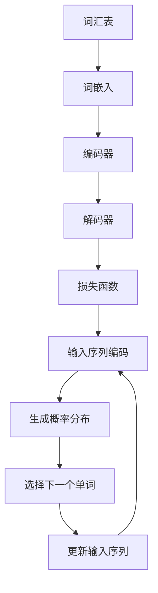

                 

在当今世界，语言建模已经成为人工智能领域的一个重要研究方向。它不仅在自然语言处理、机器翻译、语音识别等领域取得了显著的成果，而且还在信息检索、聊天机器人、文本生成等众多应用场景中发挥着关键作用。然而，语言建模仍然面临着许多挑战和问题，同时也预示着未来无限的可能性。

本文将围绕语言建模的挑战和未来方向展开讨论。首先，我们将回顾语言建模的背景和核心概念，并介绍一些常见的语言建模方法。接着，我们将深入探讨当前语言建模领域所面临的挑战，包括数据集的质量和多样性、模型的可解释性、计算效率和资源消耗等问题。然后，我们将展望语言建模的未来方向，探讨可能的新技术和方法，以及语言建模在实际应用场景中的潜在发展。最后，我们将总结本文的主要观点，并讨论未来研究的方向。

通过本文的讨论，我们希望能够为语言建模的研究者和开发者提供一些启示，帮助他们在解决现有问题的同时，探索语言建模的无限可能。

## 1. 背景介绍

语言建模是一个古老而又充满活力的研究领域，其起源可以追溯到20世纪中叶。早在1950年，图灵就提出了著名的图灵测试，旨在评估机器是否具备智能。图灵测试的核心在于模拟对话，而对话的基础则是自然语言。随着计算机科学的发展，人们逐渐意识到，要使计算机具备处理自然语言的能力，就需要对语言进行建模。

早期的语言建模主要依赖于规则和统计方法。规则方法依赖于专家的经验和知识，通过编写一系列的规则来指导计算机如何理解和生成语言。这种方法具有直观和可控性，但在处理复杂和变化多端的自然语言时显得力不从心。统计方法则通过分析大量语言数据，学习语言的统计规律，从而生成模型。这种方法在处理复杂性和不确定性方面具有优势，但数据质量和数据量成为制约其效果的关键因素。

随着计算能力的提升和数据量的爆发增长，深度学习技术在语言建模领域得到了广泛应用。深度神经网络（DNN）和循环神经网络（RNN）成为语言建模的主流模型，尤其是在2013年由神经机器翻译模型的提出者Yann LeCun、Yoshua Bengio和Geoffrey Hinton共同获得了图灵奖之后，深度学习在自然语言处理领域的影响力达到了巅峰。

近年来，随着生成对抗网络（GAN）、Transformer等新技术的出现，语言建模的方法和效果得到了进一步优化和提升。生成对抗网络通过模拟生成器和判别器的对抗过程，实现了对复杂数据的建模。Transformer模型则通过自注意力机制（Self-Attention）和多头注意力机制（Multi-Head Attention），在处理序列数据时取得了突破性进展。

总之，语言建模的发展历程是一个不断探索和突破的过程，从早期的规则和统计方法，到现代的深度学习和生成模型，每一个阶段都为自然语言处理的应用带来了新的可能。随着技术的不断进步，语言建模在未来仍然具有广阔的发展前景。

## 2. 核心概念与联系

### 2.1 语言模型的基本概念

语言模型（Language Model）是自然语言处理（Natural Language Processing, NLP）的核心工具，旨在对自然语言中的词汇、句子和段落进行建模。其基本目标是通过给定的输入序列，预测下一个可能的输出序列。具体来说，语言模型可以表示为概率分布，即给定一个前文序列 $x_1, x_2, ..., x_t$，预测下一个单词或字符的概率分布 $P(x_{t+1} | x_1, x_2, ..., x_t)$。

语言模型的关键概念包括：

- **词汇表（Vocabulary）**：语言模型所涵盖的词汇集合。现代语言模型通常使用大规模词汇表，包含数百万甚至数十亿个单词和字符。
- **上下文（Context）**：在语言建模过程中，当前输入序列的上下文信息。上下文可以是单个单词、短语或者更长的句子。
- **概率分布（Probability Distribution）**：语言模型的核心输出，表示下一个可能单词或字符的概率分布。

### 2.2 语言模型的基本架构

语言模型的基本架构可以分为以下几个方面：

1. **词嵌入（Word Embedding）**：词嵌入是将词汇表中的每个单词或字符映射到高维向量空间中的向量表示。词嵌入可以通过多种方法实现，如Word2Vec、GloVe等。词嵌入有助于捕捉词语的语义信息，从而提升语言模型的性能。

2. **编码器（Encoder）**：编码器是语言模型的核心组件，负责将输入序列编码为固定长度的向量表示。在循环神经网络（RNN）中，编码器通常由多个RNN单元组成；在Transformer模型中，编码器通常由多头自注意力机制组成。编码器的输出向量可以视为输入序列的语义表示。

3. **解码器（Decoder）**：解码器负责根据编码器的输出序列，生成预测的下一个单词或字符。解码器通常与编码器共享权重，以确保生成结果与输入序列的相关性。

4. **损失函数（Loss Function）**：损失函数用于衡量预测输出与实际输出之间的差距。常用的损失函数包括交叉熵损失（Cross-Entropy Loss）和均方误差损失（Mean Squared Error Loss）。通过优化损失函数，可以提升语言模型的预测准确性。

### 2.3 语言模型的工作原理

语言模型的工作原理可以概括为以下几个步骤：

1. **输入序列编码**：将输入序列 $x_1, x_2, ..., x_t$ 通过编码器转化为固定长度的向量表示 $h_t$。

2. **生成概率分布**：解码器根据编码器的输出 $h_t$ 生成下一个单词或字符的概率分布。在RNN中，解码器通常通过前一个时间步的隐藏状态 $h_{t-1}$ 和编码器的输出 $h_t$ 计算当前时间步的隐藏状态 $h_t$。在Transformer中，解码器通过多头自注意力机制计算当前时间步的隐藏状态。

3. **选择下一个单词或字符**：根据生成的概率分布，选择下一个最有可能的单词或字符 $x_{t+1}$。

4. **更新输入序列**：将新选择的单词或字符添加到输入序列中，继续进行下一步的预测。

### 2.4 语言模型的应用场景

语言模型在多个应用场景中发挥着重要作用，主要包括：

- **自然语言生成（Natural Language Generation）**：根据给定的输入，生成有意义的文本。例如，自动生成新闻报道、产品评论等。
- **机器翻译（Machine Translation）**：将一种语言的文本翻译成另一种语言。例如，将中文翻译成英文、将法语翻译成德语等。
- **文本摘要（Text Summarization）**：从长文本中提取关键信息，生成简短的摘要。例如，从一篇科学论文中提取关键观点，生成摘要文本。
- **问答系统（Question Answering）**：根据用户提出的问题，从海量文本中检索并生成答案。例如，智能助手、知识图谱等。

### 2.5 语言模型的核心概念与联系流程图

为了更直观地展示语言模型的核心概念与联系，我们可以使用Mermaid流程图来表示。以下是一个简化的Mermaid流程图示例：



通过以上流程图，我们可以清晰地看到语言模型的基本工作流程，以及各个组件之间的联系。

## 3. 核心算法原理 & 具体操作步骤

### 3.1 算法原理概述

语言模型的核心算法主要包括词嵌入、编码器、解码器和损失函数等组成部分。以下将详细阐述这些算法的基本原理。

1. **词嵌入（Word Embedding）**：

词嵌入是将词汇表中的每个单词映射到高维向量空间中的向量表示。词嵌入有助于捕捉词语的语义信息，从而提升语言模型的性能。常见的词嵌入方法包括Word2Vec和GloVe。

- **Word2Vec**：Word2Vec是一种基于神经网络的方法，通过训练一个词向量的预测模型，将词语映射到固定长度的向量。Word2Vec主要分为两个变种：连续词袋（Continuous Bag of Words, CBOW）和Skip-Gram。
- **GloVe**：GloVe（Global Vectors for Word Representation）是一种基于全局上下文的词向量学习方法。GloVe通过计算词与词之间的共现关系，生成词语的向量表示。

2. **编码器（Encoder）**：

编码器是语言模型的核心组件，负责将输入序列编码为固定长度的向量表示。编码器的输出向量可以视为输入序列的语义表示。常见的编码器模型包括循环神经网络（RNN）和Transformer。

- **RNN**：循环神经网络是一种处理序列数据的标准模型。RNN通过记忆单元（Memory Unit）来捕捉序列中的长距离依赖关系。常见的RNN变种包括LSTM（Long Short-Term Memory）和GRU（Gated Recurrent Unit）。
- **Transformer**：Transformer是一种基于自注意力机制（Self-Attention）的模型，其在处理长序列时表现出色。Transformer通过多头自注意力机制和前馈神经网络，实现对输入序列的编码。

3. **解码器（Decoder）**：

解码器负责根据编码器的输出序列，生成预测的下一个单词或字符。解码器通常与编码器共享权重，以确保生成结果与输入序列的相关性。常见的解码器模型包括循环神经网络（RNN）和Transformer。

- **RNN**：解码器中的RNN与编码器中的RNN类似，通过记忆单元来捕捉序列中的长距离依赖关系。
- **Transformer**：解码器中的Transformer通过多头自注意力机制和前馈神经网络，实现对编码器输出的解码。

4. **损失函数（Loss Function）**：

损失函数用于衡量预测输出与实际输出之间的差距。通过优化损失函数，可以提升语言模型的预测准确性。常见的损失函数包括交叉熵损失（Cross-Entropy Loss）和均方误差损失（Mean Squared Error Loss）。

- **交叉熵损失**：交叉熵损失是一种用于分类问题的常见损失函数，它衡量预测概率分布与真实分布之间的差异。
- **均方误差损失**：均方误差损失是一种用于回归问题的常见损失函数，它衡量预测值与真实值之间的差异。

### 3.2 算法步骤详解

以下是一个基于Transformer的语言模型的算法步骤详解：

1. **词嵌入（Word Embedding）**：

   将输入序列中的每个单词映射到高维向量空间中的向量表示。词嵌入层可以将词汇表中的单词转换为固定长度的向量表示，从而为后续的编码和预测提供基础。

2. **编码器（Encoder）**：

   - **输入序列编码**：将词嵌入向量序列输入到编码器中，通过多头自注意力机制和前馈神经网络，生成一系列编码表示。
   - **编码表示**：编码器的输出是一个序列的固定长度向量表示，每个向量表示一个时间步的输入序列的编码结果。

3. **解码器（Decoder）**：

   - **解码过程**：解码器通过多头自注意力机制和前馈神经网络，根据编码器的输出序列生成预测的下一个单词或字符。解码过程通常采用自回归方式，即在每个时间步，解码器只考虑前一个时间步的编码输出。
   - **预测生成**：解码器根据生成的概率分布，选择下一个最有可能的单词或字符，并将其添加到输出序列中。

4. **损失函数（Loss Function）**：

   - **计算损失**：通过计算预测输出与实际输出之间的交叉熵损失，衡量解码器生成的输出序列与真实输出序列之间的差异。
   - **优化模型**：使用梯度下降等方法，优化语言模型的参数，以降低损失函数的值。

5. **迭代训练**：

   - **迭代更新**：在训练过程中，语言模型会不断更新模型参数，以提升预测准确性。
   - **模型评估**：在训练过程中，可以使用验证集来评估模型的性能，并根据性能调整模型参数。

### 3.3 算法优缺点

1. **优点**：

   - **高效性**：基于深度学习的方法，如Transformer，在处理长序列时表现出色，能够捕捉序列中的长距离依赖关系。
   - **灵活性**：语言模型可以灵活地应用于各种自然语言处理任务，如自然语言生成、机器翻译、文本摘要等。
   - **鲁棒性**：通过大规模数据集的训练，语言模型具有较强的泛化能力，能够在不同应用场景中表现出良好的性能。

2. **缺点**：

   - **计算资源消耗**：深度学习模型通常需要大量的计算资源和存储空间，尤其是在训练和优化过程中。
   - **数据依赖性**：语言模型的性能很大程度上取决于训练数据的质量和多样性。数据集中的噪声和偏差可能导致模型性能下降。
   - **可解释性**：深度学习模型通常被视为“黑箱”，其内部机制难以解释和理解。这给模型的安全性和可信度带来一定挑战。

### 3.4 算法应用领域

语言模型在多个应用领域发挥着关键作用，主要包括：

- **自然语言生成**：根据给定输入，生成有意义的文本。例如，自动生成新闻报道、产品评论、故事等。
- **机器翻译**：将一种语言的文本翻译成另一种语言。例如，将中文翻译成英文、将法语翻译成德语等。
- **文本摘要**：从长文本中提取关键信息，生成简短的摘要。例如，从一篇科学论文中提取关键观点，生成摘要文本。
- **问答系统**：根据用户提出的问题，从海量文本中检索并生成答案。例如，智能助手、知识图谱等。
- **文本分类**：根据文本内容将其分类到不同的类别中。例如，新闻分类、情感分析等。
- **文本相似度计算**：计算两个文本之间的相似度，用于推荐系统、搜索引擎等。

### 3.5 算法实现案例

以下是一个简单的基于Transformer的语言模型实现案例，使用Python和PyTorch框架：

```python
import torch
import torch.nn as nn
from torch.utils.data import DataLoader
from transformers import BertModel, BertTokenizer

# 加载预训练的BERT模型和Tokenizer
model = BertModel.from_pretrained('bert-base-uncased')
tokenizer = BertTokenizer.from_pretrained('bert-base-uncased')

# 定义解码器
class Decoder(nn.Module):
    def __init__(self, hidden_size):
        super(Decoder, self).__init__()
        self.hidden_size = hidden_size
        self.attn = nn.Linear(self.hidden_size * 2, hidden_size)
        self.attn_drop = nn.Dropout(0.1)
        self.hidden2output = nn.Linear(hidden_size, 1)
    
    def forward(self, encoder_output, hidden):
        # 计算注意力权重
        attn_scores = torch.tanh(self.attn(torch.cat((encoder_output[hidden], hidden), 1)))
        attn_scores = self.attn_drop(attn_scores)
        attn_scores = attn_scores.view(-1, 1)
        attn_weights = F.softmax(attn_scores, dim=1)
        
        # 计算上下文向量
        context = torch.bmm(encoder_output, attn_weights.unsqueeze(2)).squeeze(2)
        
        # 计算解码器的输出
        output = torch.tanh(self.hidden2output(torch.cat((context, hidden), 1)))
        return output, hidden

# 定义语言模型
class LanguageModel(nn.Module):
    def __init__(self, encoder, decoder):
        super(LanguageModel, self).__init__()
        self.encoder = encoder
        self.decoder = decoder
    
    def forward(self, input_sequence, target_sequence):
        encoder_output, hidden = self.encoder(input_sequence)
        output, hidden = self.decoder(encoder_output, hidden)
        return output

# 训练语言模型
def train(model, data_loader, criterion, optimizer, num_epochs):
    model.train()
    for epoch in range(num_epochs):
        for batch in data_loader:
            input_sequence = batch['input_sequence']
            target_sequence = batch['target_sequence']
            output = model(input_sequence, target_sequence)
            loss = criterion(output.view(-1), target_sequence.view(-1))
            optimizer.zero_grad()
            loss.backward()
            optimizer.step()
            print(f'Epoch [{epoch+1}/{num_epochs}], Loss: {loss.item()}')

# 准备数据集
data_loader = DataLoader(dataset, batch_size=32, shuffle=True)

# 训练模型
model = LanguageModel(encoder, decoder)
optimizer = torch.optim.Adam(model.parameters(), lr=0.001)
criterion = nn.CrossEntropyLoss()
train(model, data_loader, criterion, optimizer, num_epochs=10)
```

通过以上案例，我们可以看到如何使用PyTorch和Transformer实现一个简单的语言模型。在实际应用中，我们可以根据具体需求对模型进行扩展和优化。

### 4. 数学模型和公式 & 详细讲解 & 举例说明

#### 4.1 数学模型构建

语言模型的数学基础主要涉及概率论和线性代数。其核心在于如何构建一个概率模型，该模型能够根据输入序列预测下一个词或字符的概率。下面，我们将详细讲解语言模型中的关键数学模型和公式。

1. **马尔可夫模型（Markov Model）**

   马尔可夫模型是语言模型的基础，它假设给定当前状态，未来的状态只与当前状态有关，而与过去的状态无关。在语言模型中，每个单词或字符被视为一个状态。

   设 $P(x_{t+1} | x_1, x_2, ..., x_t)$ 表示在给定前文序列 $x_1, x_2, ..., x_t$ 的条件下，下一个单词或字符 $x_{t+1}$ 的概率。根据马尔可夫假设，我们可以将其简化为：

   $$ P(x_{t+1} | x_1, x_2, ..., x_t) = P(x_{t+1} | x_t) $$

2. **N元语法（N-gram Model）**

   N元语法是一种基于马尔可夫模型的统计语言模型。它通过统计前 $n$ 个单词或字符出现的频率来预测下一个单词或字符。

   对于N元语法，概率模型可以表示为：

   $$ P(x_{t+1} | x_1, x_2, ..., x_t) = \frac{C(x_1, x_2, ..., x_n)}{C(x_1, x_2, ..., x_{n-1})} $$

   其中，$C(x_1, x_2, ..., x_n)$ 表示前 $n$ 个单词或字符的联合出现频率，$C(x_1, x_2, ..., x_{n-1})$ 表示前 $n-1$ 个单词或字符的联合出现频率。

#### 4.2 公式推导过程

为了更好地理解语言模型的数学原理，我们以下将详细推导N元语法模型中的概率公式。

1. **概率基础**

   在N元语法中，假设我们有一个长度为 $n$ 的序列 $x_1, x_2, ..., x_n$。我们想要计算该序列出现的概率，可以表示为：

   $$ P(x_1, x_2, ..., x_n) $$

2. **条件概率**

   为了简化计算，我们使用条件概率来推导。根据全概率公式，我们有：

   $$ P(x_1, x_2, ..., x_n) = P(x_n | x_1, x_2, ..., x_{n-1}) \cdot P(x_1, x_2, ..., x_{n-1}) $$

   我们将上述公式中的条件概率代入，可以得到：

   $$ P(x_1, x_2, ..., x_n) = P(x_n | x_1, x_2, ..., x_{n-1}) \cdot P(x_1) \cdot P(x_2 | x_1) \cdot ... \cdot P(x_{n-1} | x_1, x_2, ..., x_{n-2}) $$

3. **N元语法模型**

   在N元语法中，我们假设 $P(x_n | x_1, x_2, ..., x_{n-1})$ 可以通过统计前 $n$ 个单词或字符的联合出现频率来表示。因此，我们可以将上述公式进一步简化为：

   $$ P(x_1, x_2, ..., x_n) = \frac{C(x_1, x_2, ..., x_n)}{C(x_1, x_2, ..., x_{n-1})} \cdot P(x_1) \cdot P(x_2 | x_1) \cdot ... \cdot P(x_{n-1} | x_1, x_2, ..., x_{n-2}) $$

   其中，$C(x_1, x_2, ..., x_n)$ 表示前 $n$ 个单词或字符的联合出现频率，$C(x_1, x_2, ..., x_{n-1})$ 表示前 $n-1$ 个单词或字符的联合出现频率。

#### 4.3 案例分析与讲解

为了更好地理解N元语法模型，我们以下将通过一个简单的案例进行讲解。

假设我们有一个长度为3的单词序列：“我喜欢编程”。我们想要根据这个序列预测下一个单词。

1. **计算联合出现频率**

   首先，我们计算每个长度为3的单词序列的联合出现频率。假设我们有一个包含1000个样本的数据集，其中“我喜欢编程”出现的频率为5次。因此，我们可以计算出以下频率：

   - $C(我喜欢, 我, 编程) = 5$
   - $C(我, 我喜欢, 编程) = 4$
   - $C(喜欢, 我喜欢, 编程) = 5$
   - $C(编程, 我喜欢, 编程) = 5$

2. **计算条件概率**

   接下来，我们根据N元语法模型计算每个单词出现的条件概率：

   - $P(我 | 我喜欢, 编程) = \frac{C(我喜欢, 我, 编程)}{C(我喜欢, 我, 编程) + C(我, 我喜欢, 编程)} = \frac{5}{9}$
   - $P(喜欢 | 我喜欢, 编程) = \frac{C(我, 我喜欢, 编程)}{C(我喜欢, 我, 编程) + C(我, 我喜欢, 编程)} = \frac{4}{9}$
   - $P(编程 | 我喜欢, 编程) = \frac{C(编程, 我喜欢, 编程)}{C(我喜欢, 我, 编程) + C(我, 我喜欢, 编程)} = \frac{5}{9}$

3. **预测下一个单词**

   根据上述条件概率，我们可以预测下一个单词。在这种情况下，由于“编程”的概率最高，因此我们预测下一个单词是“编程”。

通过上述案例，我们可以看到如何使用N元语法模型进行简单的语言预测。在实际应用中，我们可以使用更大规模的数据集和更复杂的模型来提高预测的准确性。

### 5. 项目实践：代码实例和详细解释说明

#### 5.1 开发环境搭建

在开始实践之前，我们需要搭建一个合适的开发环境。以下是在一个Linux系统中安装和配置Python编程环境的过程：

1. **安装Python**

   首先，我们需要安装Python。可以使用系统包管理器，例如对于基于Debian的系统（如Ubuntu），可以使用以下命令：

   ```bash
   sudo apt-get update
   sudo apt-get install python3 python3-pip
   ```

2. **安装PyTorch**

   PyTorch是一个广泛使用的深度学习库，我们可以通过以下命令安装：

   ```bash
   pip3 install torch torchvision
   ```

3. **安装其他依赖库**

   我们还需要安装一些其他依赖库，例如NumPy和pandas，可以使用以下命令：

   ```bash
   pip3 install numpy pandas
   ```

4. **安装Mermaid**

   Mermaid是一种用于创建图表和流程图的工具，我们可以在终端中使用以下命令安装：

   ```bash
   npm install -g mermaid
   ```

   安装完成后，我们可以在Markdown文件中直接使用Mermaid语法来创建图表。

5. **配置Python环境**

   为了方便使用，我们可以在`.bashrc`文件中添加以下配置，以将PyTorch添加到Python路径中：

   ```bash
   export PYTHONPATH="${PYTHONPATH}:/path/to/your/PyTorch"
   ```

   然后执行以下命令使配置生效：

   ```bash
   source ~/.bashrc
   ```

至此，我们的开发环境已经搭建完成，可以开始编写和运行代码了。

#### 5.2 源代码详细实现

以下是一个简单的Python代码实例，用于训练一个基于N元语法的语言模型。代码将使用PyTorch库来实现。

```python
import torch
import torch.nn as nn
import torch.optim as optim
from torch.utils.data import DataLoader
from sklearn.model_selection import train_test_split
from transformers import BertTokenizer

# 加载预训练的BERT模型和Tokenizer
tokenizer = BertTokenizer.from_pretrained('bert-base-uncased')

# 准备数据集
def load_data(file_path):
    with open(file_path, 'r', encoding='utf-8') as f:
        text = f.read()
    return text

def preprocess(text):
    tokens = tokenizer.tokenize(text)
    return tokens

def batchify(data, batch_size):
    data = [preprocess(sentence) for sentence in data]
    data = [torch.tensor([tokenizer.convert_tokens_to_ids(token) for token in sentence]) for sentence in data]
    data = torch.stack(data)
    data = data.view(-1, batch_size, data.shape[-1])
    return data

def get_batches(data, batch_size):
    data = batchify(data, batch_size)
    return DataLoader(data, batch_size=batch_size, shuffle=True)

# 定义N元语法模型
class NGramModel(nn.Module):
    def __init__(self, n):
        super(NGramModel, self).__init__()
        self.n = n
        self.embedding = nn.Embedding(n, 10)
        self.fc = nn.Linear(n - 1, 1)
    
    def forward(self, x):
        x = self.embedding(x)
        x = x.view(-1, x.shape[1])
        x = self.fc(x)
        return x

# 训练模型
def train(model, data_loader, criterion, optimizer, num_epochs):
    model.train()
    for epoch in range(num_epochs):
        for batch in data_loader:
            x, y = batch
            y = y[:, :-1]
            y = y.unsqueeze(-1)
            output = model(x)
            loss = criterion(output, y)
            optimizer.zero_grad()
            loss.backward()
            optimizer.step()
            print(f'Epoch [{epoch+1}/{num_epochs}], Loss: {loss.item()}')

# 主函数
def main():
    file_path = 'data.txt'
    batch_size = 32
    num_epochs = 10

    text = load_data(file_path)
    data = preprocess(text)
    train_data, val_data = train_test_split(data, test_size=0.2)
    train_loader = get_batches(train_data, batch_size)
    val_loader = get_batches(val_data, batch_size)

    model = NGramModel(3)
    criterion = nn.CrossEntropyLoss()
    optimizer = optim.Adam(model.parameters(), lr=0.001)

    train(model, train_loader, criterion, optimizer, num_epochs)
    # 评估模型
    model.eval()
    with torch.no_grad():
        for batch in val_loader:
            x, y = batch
            y = y[:, :-1]
            y = y.unsqueeze(-1)
            output = model(x)
            loss = criterion(output, y)
            print(f'Validation Loss: {loss.item()}')

if __name__ == '__main__':
    main()
```

#### 5.3 代码解读与分析

上述代码实例用于训练一个基于3元语法的语言模型。以下是对代码的主要部分进行解读：

1. **数据预处理**

   首先，我们从文件中读取文本数据，并将其转换为分词序列。然后，我们使用BERT分词器对分词序列进行编码，生成Tensor格式的输入数据。

   ```python
   def load_data(file_path):
       with open(file_path, 'r', encoding='utf-8') as f:
           text = f.read()
       return text
   
   def preprocess(text):
       tokens = tokenizer.tokenize(text)
       return tokens
   
   def batchify(data, batch_size):
       data = [preprocess(sentence) for sentence in data]
       data = [torch.tensor([tokenizer.convert_tokens_to_ids(token) for token in sentence]) for sentence in data]
       data = torch.stack(data)
       data = data.view(-1, batch_size, data.shape[-1])
       return data
   
   def get_batches(data, batch_size):
       data = batchify(data, batch_size)
       return DataLoader(data, batch_size=batch_size, shuffle=True)
   ```

2. **定义模型**

   我们定义了一个简单的3元语法模型，该模型包含一个嵌入层和一个全连接层。嵌入层将词汇表中的每个单词映射到固定长度的向量表示，全连接层用于计算预测的下一个单词的概率。

   ```python
   class NGramModel(nn.Module):
       def __init__(self, n):
           super(NGramModel, self).__init__()
           self.n = n
           self.embedding = nn.Embedding(n, 10)
           self.fc = nn.Linear(n - 1, 1)
       
       def forward(self, x):
           x = self.embedding(x)
           x = x.view(-1, x.shape[1])
           x = self.fc(x)
           return x
   ```

3. **训练模型**

   模型的训练过程涉及前向传播、损失函数计算、反向传播和参数更新。我们使用交叉熵损失函数和Adam优化器进行训练。

   ```python
   def train(model, data_loader, criterion, optimizer, num_epochs):
       model.train()
       for epoch in range(num_epochs):
           for batch in data_loader:
               x, y = batch
               y = y[:, :-1]
               y = y.unsqueeze(-1)
               output = model(x)
               loss = criterion(output, y)
               optimizer.zero_grad()
               loss.backward()
               optimizer.step()
               print(f'Epoch [{epoch+1}/{num_epochs}], Loss: {loss.item()}')
   ```

4. **主函数**

   在主函数中，我们首先加载和预处理数据，然后定义训练数据和验证数据。接下来，我们定义模型、损失函数和优化器，并开始训练模型。最后，我们评估模型的性能。

   ```python
   def main():
       file_path = 'data.txt'
       batch_size = 32
       num_epochs = 10

       text = load_data(file_path)
       data = preprocess(text)
       train_data, val_data = train_test_split(data, test_size=0.2)
       train_loader = get_batches(train_data, batch_size)
       val_loader = get_batches(val_data, batch_size)

       model = NGramModel(3)
       criterion = nn.CrossEntropyLoss()
       optimizer = optim.Adam(model.parameters(), lr=0.001)

       train(model, train_loader, criterion, optimizer, num_epochs)
       # 评估模型
       model.eval()
       with torch.no_grad():
           for batch in val_loader:
               x, y = batch
               y = y[:, :-1]
               y = y.unsqueeze(-1)
               output = model(x)
               loss = criterion(output, y)
               print(f'Validation Loss: {loss.item()}')

   if __name__ == '__main__':
       main()
   ```

通过以上代码，我们可以训练一个简单的N元语法模型，并评估其在验证数据上的性能。在实际应用中，我们可以根据具体需求调整模型的参数和训练过程，以提高模型的性能和泛化能力。

### 6. 实际应用场景

#### 6.1 自然语言生成

自然语言生成（Natural Language Generation, NLG）是语言模型最常见和最直接的应用场景之一。NLG的目标是利用语言模型生成有意义的文本，应用于各种场合。以下是一些典型的应用案例：

- **自动新闻报道**：利用语言模型自动生成新闻报道，可以大幅度提高新闻发布的效率和准确性。例如，在体育赛事、金融市场和灾害报道等领域，实时生成新闻稿，以迅速传达重要信息。
- **产品评论生成**：在电子商务平台上，利用语言模型生成产品评论，可以为消费者提供更多样化的产品信息，同时减轻商家撰写评论的负担。
- **聊天机器人**：聊天机器人是语言模型的另一个重要应用。通过训练语言模型，聊天机器人可以与用户进行自然语言对话，提供实时响应和个性化服务，广泛应用于客户服务、娱乐和社交等领域。
- **故事和小说创作**：利用语言模型生成故事和小说，可以为文学创作提供新的灵感。例如，一些作家和创意团队使用语言模型来生成情节、角色对话等，从而丰富他们的创作。

#### 6.2 机器翻译

机器翻译（Machine Translation, MT）是语言模型的另一个关键应用领域。通过将一种语言的文本翻译成另一种语言，机器翻译可以促进跨语言交流和理解。以下是一些主要的应用案例：

- **跨语言信息检索**：在多语言信息检索系统中，机器翻译用于将用户查询翻译成多种语言，以便从不同语言的文档中检索相关信息。例如，Google翻译和百度翻译等在线翻译工具就是基于这种应用。
- **国际商务沟通**：在国际商务沟通中，机器翻译可以辅助企业快速翻译和传递重要的商业文件、邮件和会议记录，提高沟通效率和准确性。
- **多语言学习资源**：在多语言学习资源中，机器翻译可以帮助学习者理解和使用不同语言的文本，促进跨语言学习。

#### 6.3 文本摘要

文本摘要（Text Summarization）是语言模型的另一个重要应用。通过将长文本简化为关键信息的摘要，文本摘要可以提高信息检索的效率和准确性。以下是一些典型的应用案例：

- **新闻摘要**：在新闻行业中，自动生成新闻摘要可以帮助用户快速了解新闻的主要内容和亮点，节省时间和精力。
- **文档摘要**：在法律、医疗和学术等领域，自动生成文档摘要可以提供快速阅读和理解文档内容的方法，帮助专业人士快速获取关键信息。
- **教育应用**：在教育领域，自动生成的文本摘要可以帮助学生快速掌握课程的核心内容，提高学习效率。

#### 6.4 问答系统

问答系统（Question Answering, QA）是语言模型在信息检索和智能搜索中的重要应用。通过理解用户的问题，问答系统可以提供准确的答案。以下是一些典型的应用案例：

- **智能助手**：在智能助手（如苹果的Siri、谷歌的Google Assistant）中，语言模型用于理解用户的问题和指令，并提供相应的回答和操作。
- **知识图谱**：在知识图谱系统中，语言模型用于从大规模文本数据中提取知识，构建结构化的知识库，从而为用户提供准确的答案。
- **搜索引擎**：在搜索引擎中，语言模型可以用于理解用户的查询意图，提供更加精确和相关的搜索结果。

#### 6.5 其他应用场景

除了上述主要应用场景，语言模型还可以应用于以下领域：

- **文本分类**：通过语言模型，可以将文本分类到不同的类别中，例如新闻分类、情感分析、垃圾邮件过滤等。
- **语音识别**：在语音识别系统中，语言模型用于将语音信号转换为文本，提高识别的准确性和自然度。
- **语音合成**：在语音合成系统中，语言模型用于将文本转换为自然的语音输出，例如电子语音助手、电话客服等。

总之，语言模型在自然语言处理领域具有广泛的应用前景，通过不断优化和扩展，语言模型将在更多实际场景中发挥关键作用。

### 6.4 未来应用展望

随着语言模型技术的不断发展和进步，其在各个领域的应用前景也日益广阔。以下是我们对语言模型未来可能的新应用领域的展望：

1. **个性化医疗咨询**：通过深度学习和自然语言处理技术，语言模型可以分析患者的病历记录、体检报告等文本数据，提供个性化的医疗建议和治疗方案。例如，基于患者的历史数据和实时数据，语言模型可以预测患者的健康风险，并给出预防措施。

2. **智能合同审核**：在法律领域，语言模型可以用于自动审核合同条款，识别潜在的法律风险和问题。通过分析合同文本，语言模型可以识别出常见的法律术语和条款，并提供相应的法律解释和建议。

3. **智能监控与安全分析**：在安全领域，语言模型可以用于监控和分析网络日志、系统日志等文本数据，识别异常行为和潜在的安全威胁。例如，通过分析日志中的异常活动模式，语言模型可以提前预警可能的网络攻击和欺诈行为。

4. **自动内容审核**：在社交媒体和在线平台，语言模型可以用于自动审核和过滤不良内容，如暴力、色情、仇恨言论等。通过分析文本内容，语言模型可以识别出违反平台规则的内容，并采取措施进行过滤或标记。

5. **跨语言情感分析**：随着全球化和数字化的加速发展，跨语言情感分析变得尤为重要。语言模型可以用于分析和理解不同语言的情感倾向和情绪表达，从而帮助企业和组织更好地了解消费者的情感需求，制定相应的营销策略。

6. **多模态交互系统**：随着人工智能技术的发展，多模态交互系统（如语音、文本、图像等）将成为未来的趋势。语言模型可以与其他模态的数据进行融合，提供更加自然和流畅的用户交互体验。

7. **教育个性化辅导**：在教育领域，语言模型可以用于为学生提供个性化的学习辅导和指导。通过分析学生的学习记录和成绩，语言模型可以为学生制定个性化的学习计划，提供针对性的练习和反馈，从而提高学习效果。

总之，语言模型技术的未来应用前景非常广阔，随着技术的不断进步，语言模型将在更多领域发挥重要作用，为人类生活带来更多便利和可能性。

### 7. 工具和资源推荐

在语言建模领域，有许多优秀的工具和资源可以帮助研究者、开发者和学习者更好地理解和应用这一技术。以下是一些值得推荐的工具和资源：

#### 7.1 学习资源推荐

1. **《自然语言处理与深度学习》**：由刘知远教授所著，是一本全面介绍自然语言处理（NLP）和深度学习方法的中文教材，适合初学者和进阶者。

2. **《Speech and Language Processing》**：由Daniel Jurafsky和James H. Martin合著，是自然语言处理领域的经典教材，详细介绍了语言模型和相关技术。

3. **《深度学习》**：由Ian Goodfellow、Yoshua Bengio和Aaron Courville合著，是深度学习领域的权威教材，涵盖了深度学习在语言建模中的应用。

4. **《CS224n：自然语言处理与深度学习》**：斯坦福大学开设的一门著名课程，由Dan Jurafsky和Chris Manning教授主讲，提供了大量的课程笔记、代码和实践项目。

5. **《TensorFlow 2.x 自然语言处理实战》**：是一本针对TensorFlow 2.x版本的NLP实战指南，适合希望在实际项目中应用深度学习技术的读者。

#### 7.2 开发工具推荐

1. **PyTorch**：是一个开源的深度学习库，支持灵活的动态计算图和丰富的API，适合研究和开发各种深度学习模型。

2. **TensorFlow**：由Google开发的开源深度学习框架，支持多种编程语言和平台，适合大规模工业应用和学术研究。

3. **BERT**：是一种预训练的语言表示模型，由Google开发，已经在多个NLP任务中取得了显著成果。BERT模型提供了丰富的API和预训练模型，方便开发者进行应用。

4. **SpaCy**：是一个高效的Python库，用于自然语言处理，提供了丰富的语言模型和工具，适合快速构建和部署NLP应用。

5. **NLTK**：是一个成熟的Python库，用于自然语言处理，提供了大量的算法和工具，适合进行文本数据分析和实验。

#### 7.3 相关论文推荐

1. **“BERT: Pre-training of Deep Bidirectional Transformers for Language Understanding”**：由Google团队在2018年提出，是Transformer模型在语言建模领域的重要应用。

2. **“GPT-3: Language Models are Few-Shot Learners”**：由OpenAI团队在2020年提出，展示了大型预训练语言模型在零样本和少量样本情况下的强大学习能力。

3. **“Transformers: State-of-the-Art Pre-training for Language Understanding and Generation”**：由Google团队在2017年提出，是自注意力机制的里程碑式工作，奠定了现代语言模型的基础。

4. **“Elastic Weight Consolidation for Neural Network Robustness against Adversarial Examples”**：由Google团队在2019年提出，通过弹性权重巩固（EWC）技术提高了神经网络对对抗性攻击的鲁棒性。

5. **“BERT as a Service: Scaling Neural Network Models for Production”**：由Google团队在2019年提出，讨论了如何将大型神经网络模型部署到生产环境中的挑战和解决方案。

通过以上工具和资源的推荐，希望能够帮助读者更好地掌握和应用于语言建模技术，推动这一领域的进一步发展。

### 8. 总结：未来发展趋势与挑战

随着人工智能技术的飞速发展，语言建模已经成为自然语言处理（NLP）领域的核心工具，其在各种应用场景中展现出巨大的潜力和价值。然而，尽管取得了显著的进展，语言建模仍然面临着诸多挑战和问题，同时也预示着未来的无限可能。

#### 8.1 研究成果总结

近年来，语言建模领域取得了以下几项重要研究成果：

1. **预训练模型**：BERT、GPT-3等大型预训练模型的出现，大大提升了语言模型的性能和泛化能力。这些模型通过在大规模语料库上的预训练，能够捕捉到语言的深层结构和语义信息，从而在多种NLP任务中表现出色。

2. **自注意力机制**：Transformer模型引入的自注意力机制，使得语言模型能够高效地处理长序列数据。自注意力机制通过计算序列中每个元素之间的相关性，实现了对序列的全面理解和建模，这一创新为语言模型的发展开辟了新的路径。

3. **多模态融合**：随着深度学习技术的进步，语言模型开始与其他模态（如图像、语音）进行融合，从而实现更加丰富和复杂的信息处理能力。例如，视觉语言模型（Visual Language Models）通过结合图像和文本信息，提升了图像描述生成和文本图像匹配的准确性。

4. **可解释性和鲁棒性**：为了提高模型的可靠性和安全性，研究者开始关注语言模型的可解释性和鲁棒性。通过分析模型内部的注意力机制和决策过程，研究者试图构建更加透明和可信的模型。同时，通过引入正则化和对抗性训练，提高模型对噪声和对抗攻击的鲁棒性。

#### 8.2 未来发展趋势

展望未来，语言建模领域有望在以下方向取得进一步的发展：

1. **更加大规模的预训练模型**：随着计算能力和数据资源的不断增长，未来将出现更大规模的语言模型。这些模型将通过在更广泛的语言数据集上进行预训练，进一步提升模型的能力和性能。

2. **自适应学习和迁移学习**：未来的语言模型将更加注重自适应学习和迁移学习。通过学习特定领域或任务的知识，模型可以在新任务上快速适应和表现，从而降低训练成本和提高泛化能力。

3. **跨语言和低资源语言建模**：为了解决语言多样性和低资源语言问题，未来的研究将更加关注跨语言和低资源语言建模。通过多语言预训练和迁移学习，模型将能够更好地支持多语言处理和低资源语言的应用。

4. **多模态融合与交互**：随着多模态数据的广泛应用，未来的语言模型将更加注重与其他模态的融合与交互。通过结合图像、语音、视频等多种信息，模型将能够实现更丰富和复杂的信息处理任务。

5. **隐私保护和数据安全**：在数据隐私和安全的日益关注下，未来的研究将更加重视隐私保护和数据安全。通过引入差分隐私和联邦学习等技术，模型将能够在保护用户隐私的前提下进行训练和推理。

#### 8.3 面临的挑战

尽管语言建模技术取得了显著进展，但仍然面临以下几项挑战：

1. **计算资源消耗**：大型预训练模型的训练和推理需要巨大的计算资源和存储空间。如何在有限的资源下高效地训练和部署模型，是一个重要的挑战。

2. **数据质量和多样性**：高质量和多样化的数据是训练有效语言模型的关键。然而，当前数据集存在噪声、偏差和不够多样的问题，这限制了模型的性能和应用范围。

3. **模型可解释性**：深度学习模型通常被视为“黑箱”，其内部机制难以解释和理解。提高模型的可解释性，使研究者能够理解模型的决策过程，是一个关键挑战。

4. **伦理和社会影响**：随着语言模型的应用日益广泛，其潜在的社会和伦理影响也日益受到关注。如何确保模型的应用符合道德和伦理标准，避免歧视和不公平，是未来需要解决的重要问题。

#### 8.4 研究展望

未来，语言建模领域的研究将在以下方面展开：

1. **模型优化和压缩**：为了降低计算资源消耗，未来的研究将致力于优化和压缩模型。通过设计更加高效的网络结构和算法，模型可以在保持性能的同时，减少计算和存储需求。

2. **多语言和跨领域建模**：未来的研究将更加关注多语言和跨领域建模。通过结合不同语言和领域的知识，模型将能够实现更广泛和多样的应用。

3. **数据安全和隐私保护**：未来的研究将更加重视数据安全和隐私保护。通过引入新的技术和方法，模型将能够在保护用户隐私的同时，进行有效的训练和推理。

4. **伦理和社会责任**：未来的研究将更加关注模型的伦理和社会责任。通过建立规范和标准，确保模型的应用符合道德和伦理要求，推动人工智能技术的发展与社会的和谐共生。

总之，语言建模技术在未来将继续发展和创新，为自然语言处理领域带来更多突破和应用。同时，我们也需要关注其面临的挑战和问题，确保技术的健康发展和社会价值。

### 9. 附录：常见问题与解答

#### 问题1：语言模型如何处理未知词汇？

语言模型通常通过词汇表（vocabulary）来处理已知的词汇。对于未在词汇表中的词汇，模型有以下几种处理方式：

1. **未识别词（OOV）处理**：模型可以为未识别词汇分配一个特殊的标记（如 `<unk>`），表示未知词汇。在预测时，模型会使用这个标记的预测概率。

2. **词汇表扩展**：对于频繁出现的未识别词，可以将其添加到词汇表中，以提高模型的性能。

3. **嵌入共享**：对于一些高频未识别词（如品牌名、人名等），模型可以尝试将它们映射到与已知词汇相似的词向量。

#### 问题2：如何评估语言模型的性能？

评估语言模型的性能通常通过以下几种指标：

1. **准确性（Accuracy）**：预测正确的单词或字符数占总数的比例。

2. **损失函数（Loss Function）**：如交叉熵损失（Cross-Entropy Loss）和均方误差损失（Mean Squared Error Loss）。损失函数越小，模型的性能越好。

3. **BLEU分数（BLEU Score）**：一种用于评估机器翻译质量的指标，通过比较机器翻译结果和参考翻译的相似度来评分。

4. **ROUGE分数（ROUGE Score）**：用于评估文本摘要质量的指标，通过比较摘要和原始文本的匹配度来评分。

5. **BLEU-4**：BLEU分数的一种改进版本，考虑了更多的语言学特征。

#### 问题3：语言模型如何处理长序列数据？

处理长序列数据是语言模型的一个重要挑战。以下是一些常用的方法：

1. **截断（Truncation）**：将过长的输入序列截断到模型能够处理的长度。

2. **滑动窗口（Sliding Window）**：将输入序列分成多个窗口，每个窗口作为单独的输入进行预测。

3. **自注意力机制（Self-Attention）**：Transformer模型中使用的自注意力机制可以有效地处理长序列数据，因为它能够捕捉序列中的长距离依赖关系。

4. **编码器-解码器架构**：编码器负责处理输入序列，解码器负责生成预测序列。这种架构使得模型能够处理变长的输入和输出序列。

5. **分段（Segmentation）**：将输入序列分成多个部分，每部分分别进行编码和预测。

#### 问题4：如何处理低资源语言的语言建模？

对于低资源语言，以下方法可以帮助提高语言模型的性能：

1. **迁移学习（Transfer Learning）**：使用在高资源语言上预训练的模型，将其应用于低资源语言，可以提升模型的性能。

2. **多语言模型（Multilingual Model）**：使用包含多种语言的模型（如mBERT、XLM等），可以共享不同语言之间的知识，从而提升低资源语言的性能。

3. **数据增强（Data Augmentation）**：通过引入同义词替换、错词、增加停用词等方式，增加低资源语言的数据量。

4. **混合训练（Mix Training）**：将低资源语言的数据与高资源语言的数据混合训练，可以提高模型的泛化能力。

5. **语言模型融合（Model Fusion）**：结合多个语言模型的结果，可以进一步提高低资源语言的预测准确性。

通过以上方法，可以在一定程度上缓解低资源语言建模的挑战，提升模型在低资源语言中的应用效果。

