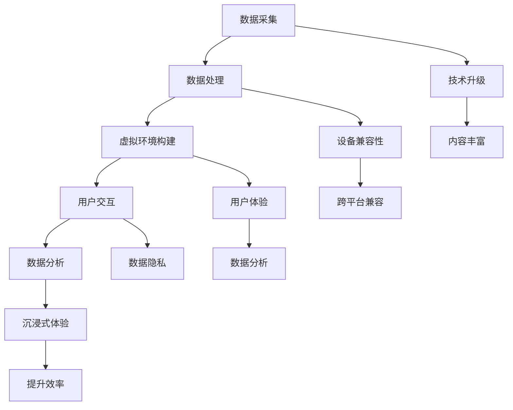

                 

### 背景介绍

贝壳找房是中国领先的房地产科技平台，以其创新的VR看房技术闻名于业界。在2025年，贝壳找房瞄准了更加广阔的市场和用户需求，决定招聘一位具有深厚技术背景的VR看房技术专家，以进一步提升其VR看房技术的先进性和用户体验。

此次招聘的背景主要是由于以下几个方面：

1. **技术升级需求**：随着虚拟现实（VR）技术的迅猛发展，用户对于看房体验的期望不断提升。贝壳找房希望引入一位技术专家，负责优化和升级现有的VR看房技术，以应对日益复杂的市场需求和用户期望。

2. **市场竞争加剧**：在房地产科技领域，贝壳找房面临着来自各大平台的激烈竞争。招聘一位具备前沿技术视野和实战经验的VR看房技术专家，可以增强贝壳找房在VR看房领域的竞争力，吸引更多用户和客户。

3. **用户体验优化**：贝壳找房深知用户体验是其在市场竞争中立足的关键。通过引进专业的VR看房技术专家，贝壳找房旨在为用户提供更加真实、沉浸式的看房体验，从而提升用户满意度和忠诚度。

4. **数据驱动的决策**：贝壳找房一直以来注重数据驱动决策，通过引入VR看房技术专家，可以更加深入地分析用户行为数据，为产品优化和市场策略提供有力的数据支持。

因此，贝壳找房在2025年决定向社会公开招聘一位VR看房技术专家，这不仅是对公司技术实力的提升，更是对用户体验和市场竞争力的全面提升。

#### 关键岗位要求

为了满足贝壳找房在VR看房技术方面的需求，本次招聘的岗位对候选人的技术背景和经验有着较高的要求。以下是关键岗位要求的具体内容：

1. **教育背景**：候选人应具备计算机科学、软件工程、图形学等相关专业的本科及以上学历。

2. **工作经验**：具备5年以上VR/AR开发经验，有实际项目经验者优先。

3. **技术技能**：
   - **图形渲染技术**：熟悉OpenGL、DirectX或Vulkan等图形渲染API。
   - **三维建模与处理**：熟练掌握3D建模工具（如Blender、Maya等）和三维数据处理技术。
   - **虚拟现实硬件**：了解VR头显、手柄等硬件设备的工作原理和接口标准。

4. **算法知识**：熟悉计算机视觉、机器学习和深度学习算法，有实际应用经验者优先。

5. **编程能力**：掌握C++、Python等编程语言，具备良好的编程习惯和调试能力。

6. **项目经验**：有成功的VR/AR项目经验，能够展示实际开发成果。

7. **团队协作**：具备良好的沟通能力和团队协作精神，能够积极参与跨部门合作项目。

8. **创新意识**：有较强的创新意识和技术前瞻性，能够紧跟行业技术发展趋势。

通过这些要求，贝壳找房希望能够找到一位既有深厚技术背景，又具备实战经验的技术专家，以推动VR看房技术的不断革新和进步。

#### 应聘流程

贝壳找房的招聘流程设计旨在全面、公正地评估候选人的综合素质和专业能力。以下是具体的应聘流程：

1. **简历筛选**：贝壳找房的HR团队首先对收到的简历进行初步筛选，重点关注候选人的教育背景、工作经验和技术技能是否符合岗位要求。

2. **初步面试**：通过简历筛选的候选人将进入初步面试环节。这个阶段的面试通常由HR或技术负责人进行，主要考察候选人的基本素质和职业素养。

3. **技术面试**：通过初步面试的候选人将进行技术面试。技术面试通常由贝壳找房的技术专家团队主持，主要内容包括：
   - **基础知识考察**：考察候选人对于图形学、三维建模、虚拟现实等相关基础知识的掌握程度。
   - **项目经验评估**：针对候选人提供的项目经验，详细了解其技术实现细节、遇到的问题以及解决方案。
   - **算法与编程能力**：通过在线编程测试或现场编程任务，评估候选人的算法能力和编程技巧。

4. **综合面试**：技术面试通过后，候选人将进入综合面试阶段。这个阶段的面试可能包括业务部门负责人、HR和部分核心团队成员，主要考察候选人的团队合作能力、领导潜力以及与贝壳找房企业文化的契合度。

5. **终面及签约**：综合面试通过后，候选人将进入终面环节。终面通常由贝壳找房的高层管理人员主持，主要目的是确认候选人是否适合公司的长期发展需求。如果终面通过，候选人将正式与贝壳找房签订工作合同。

贝壳找房的招聘流程严谨而透明，每一步都力求全面、公正地评估候选人的综合素质和专业能力。通过这样的流程，贝壳找房希望能够找到最适合的人才，共同推动公司的技术创新和业务发展。

### 核心概念与联系

#### 虚拟现实（VR）的基本原理

虚拟现实（VR）是一种通过计算机技术模拟出来的三维空间环境，用户可以通过佩戴VR头显和手柄设备，与这个虚拟环境进行互动。VR的基本原理包括以下几点：

1. **三维建模**：首先，通过三维建模工具（如Blender、Maya等）创建虚拟环境的三维模型，这些模型可以是建筑物、家具、装饰等。

2. **渲染引擎**：接下来，使用渲染引擎（如Unity、Unreal Engine等）将这些三维模型渲染成视觉效果。渲染引擎能够根据用户视角动态生成场景，实现实时渲染。

3. **传感器与跟踪**：VR头显内置传感器，可以实时捕捉用户的位置和头部运动。这些传感器与手柄设备协同工作，确保用户在虚拟环境中的动作能够被准确捕捉和反映。

4. **交互体验**：用户通过手柄设备进行交互，如移动、旋转、点击等，这些动作将直接影响虚拟环境中的物体和场景。

#### 360°全景视频与虚拟现实（VR）的结合

360°全景视频是一种可以模拟用户视角的视频技术，它通过多个摄像头从不同角度拍摄视频，然后利用软件将这些视频拼接成一个完整的全景视频。360°全景视频与虚拟现实的结合，主要体现在以下几个方面：

1. **场景创建**：通过360°全景视频，可以创建一个类似于真实环境的虚拟场景。这些视频可以用于模拟房屋内部、公园、城市等场景。

2. **交互体验**：在VR环境中，用户可以通过头显和手柄设备观看360°全景视频，并且可以自由地旋转和移动视角，仿佛置身于真实的场景中。

3. **增强现实**：360°全景视频还可以与增强现实（AR）技术结合，在全景视频中叠加虚拟物体和信息，增强用户的沉浸感和互动性。

#### VR看房技术的工作流程

VR看房技术是将虚拟现实技术应用于房地产领域的一种创新。以下是VR看房技术的工作流程：

1. **数据采集**：首先，通过三维扫描仪、无人机或专业摄影设备，采集房屋的三维数据和360°全景视频。

2. **数据处理**：采集到的数据需要进行处理，包括三维建模、纹理映射、视频拼接等，以确保虚拟环境与真实环境的高度一致。

3. **虚拟环境构建**：使用渲染引擎将处理后的数据渲染成虚拟环境，用户可以在其中自由浏览和互动。

4. **用户交互**：用户通过VR头显和手柄设备进入虚拟环境，可以自由移动、旋转视角，查看房屋的各个角落。

5. **数据分析**：在用户使用VR看房的过程中，贝壳找房可以收集用户的行为数据，如停留时间、查看次数等，用于后续的产品优化和市场分析。

#### VR看房技术的优势

VR看房技术相较于传统的看房方式，具有以下显著优势：

1. **沉浸式体验**：用户可以通过VR头显感受到身临其境的看房体验，大大提升用户的满意度和购房决策的准确性。

2. **节约时间**：通过VR看房，用户可以在家中就能浏览多个房屋，无需亲自前往，节省了大量的时间和交通成本。

3. **提升效率**：房地产中介可以更快速地展示房屋，减少客户等待时间，提高工作效率。

4. **降低成本**：VR看房技术减少了实体看房的频率，从而降低了中介的成本。

5. **数据驱动**：通过用户行为数据，贝壳找房可以更好地了解用户需求，优化产品和服务。

#### VR看房技术的挑战与未来方向

尽管VR看房技术具有巨大的潜力，但在实际应用中仍面临一些挑战：

1. **技术门槛**：VR设备的采购和维护成本较高，对于一些中小型房产中介来说，技术门槛较高。

2. **设备兼容性**：不同品牌和型号的VR设备之间存在兼容性问题，需要开发通用的解决方案。

3. **用户体验**：尽管VR技术提供了沉浸式的体验，但长时间使用仍可能对用户造成不适。

4. **数据隐私**：用户在使用VR看房时，其行为数据可能会被收集和分析，需要确保数据安全和用户隐私。

未来，VR看房技术将在以下几个方面持续发展：

1. **技术升级**：随着硬件技术的进步，VR设备的性能和舒适度将进一步提升。

2. **内容丰富**：更多的房地产开发商和中介将采用VR看房技术，提供更丰富、更高质量的虚拟场景。

3. **跨平台兼容**：不同平台和设备之间的兼容性将得到改善，使用户体验更加流畅。

4. **数据分析**：通过更深入的数据分析，贝壳找房可以更好地了解用户需求，提供个性化的推荐和服务。

#### Mermaid 流程图



通过这个Mermaid流程图，我们可以清晰地看到VR看房技术的各个环节及其相互联系，为接下来的深入探讨奠定了基础。

### 核心算法原理 & 具体操作步骤

#### 图形渲染算法

在VR看房技术中，图形渲染算法是核心环节之一，它决定了虚拟环境的视觉效果和用户体验。以下是图形渲染算法的基本原理和具体操作步骤：

1. **基本原理**：
   - **三维建模**：使用三维建模工具（如Blender、Maya等）创建房屋的三维模型，包括墙壁、家具、窗户等。
   - **纹理映射**：将2D纹理图像映射到三维模型上，使模型看起来更加真实。
   - **光照计算**：模拟真实世界的光照效果，包括阳光、灯光等，以增强场景的逼真度。

2. **具体操作步骤**：
   - **预处理**：首先，将三维模型导入渲染引擎（如Unity、Unreal Engine等），并进行必要的预处理操作，如简化模型、优化网格等。
   - **设置渲染参数**：在渲染引擎中设置渲染参数，包括纹理、光照、阴影等，以优化渲染效果。
   - **渲染管线配置**：配置渲染管线，包括几何处理、着色器处理、纹理处理等，确保渲染过程高效且质量优良。
   - **实时渲染**：使用渲染引擎的实时渲染功能，将场景实时渲染出来，并同步到VR头显中。

#### 计算机视觉算法

计算机视觉算法在VR看房技术中用于捕捉用户的行为和位置，以及识别和追踪虚拟环境中的物体。以下是计算机视觉算法的基本原理和具体操作步骤：

1. **基本原理**：
   - **图像识别**：通过图像处理技术，从摄像头捕捉的图像中提取有用信息，如人脸、物体等。
   - **目标追踪**：使用跟踪算法，对识别出的目标进行连续追踪，确保在虚拟环境中准确捕捉用户行为。

2. **具体操作步骤**：
   - **图像预处理**：对摄像头捕捉的图像进行预处理，如去噪、增强对比度等，以提高图像质量。
   - **特征提取**：使用特征提取算法（如SIFT、HOG等），从预处理后的图像中提取关键特征。
   - **目标识别**：使用机器学习算法（如分类器、深度学习模型等），对提取的特征进行分类和识别。
   - **目标追踪**：使用目标追踪算法（如卡尔曼滤波、粒子滤波等），对识别出的目标进行连续追踪。

#### 机器学习算法

在VR看房技术中，机器学习算法用于优化用户体验和提供个性化推荐。以下是机器学习算法的基本原理和具体操作步骤：

1. **基本原理**：
   - **数据收集**：收集用户在VR看房过程中的行为数据，如浏览时间、停留位置等。
   - **特征工程**：对收集到的数据进行分析和处理，提取有用的特征，用于训练模型。
   - **模型训练**：使用机器学习算法（如决策树、神经网络等），对提取的特征进行训练，以建立预测模型。

2. **具体操作步骤**：
   - **数据预处理**：对收集到的行为数据进行清洗和预处理，如去除缺失值、异常值等。
   - **特征提取**：使用特征提取算法，从预处理后的数据中提取有用的特征。
   - **模型选择**：选择适合的机器学习算法，根据数据特点和需求进行模型选择。
   - **模型训练与验证**：使用训练集对模型进行训练，并通过验证集进行模型验证和调整。
   - **模型部署**：将训练好的模型部署到VR看房系统中，用于实时预测和优化用户体验。

#### 虚拟环境构建算法

虚拟环境构建算法用于将真实环境转化为虚拟环境，为用户提供沉浸式的看房体验。以下是虚拟环境构建算法的基本原理和具体操作步骤：

1. **基本原理**：
   - **三维扫描**：使用三维扫描设备（如激光扫描仪、深度相机等），对真实环境进行扫描，获取三维点云数据。
   - **数据融合**：将多个扫描数据融合成一个完整的虚拟环境，确保场景的完整性和一致性。

2. **具体操作步骤**：
   - **三维扫描**：使用激光扫描仪或深度相机对房屋进行扫描，获取三维点云数据。
   - **数据预处理**：对扫描得到的数据进行预处理，如去噪、去重复点等，以提高数据质量。
   - **三维建模**：使用三维建模工具，将预处理后的点云数据转换为三维模型。
   - **纹理映射**：将采集到的360°全景视频映射到三维模型上，以增强场景的真实感。
   - **虚拟环境构建**：使用渲染引擎，将三维模型和纹理映射到虚拟环境中，为用户提供沉浸式的看房体验。

#### 交互算法

交互算法用于实现用户在虚拟环境中的交互操作，如移动、旋转、点击等。以下是交互算法的基本原理和具体操作步骤：

1. **基本原理**：
   - **用户输入**：通过VR头显和手柄设备捕捉用户的输入，如头部的旋转、手柄的移动等。
   - **场景更新**：根据用户的输入，实时更新虚拟环境中的场景，以模拟用户的动作和交互。

2. **具体操作步骤**：
   - **输入捕捉**：使用头显和手柄设备的传感器，捕捉用户的输入信号。
   - **输入处理**：对捕捉到的输入信号进行预处理，如去抖动、滤波等，以提高输入的准确性和稳定性。
   - **场景更新**：根据用户的输入信号，实时更新虚拟环境中的场景，包括用户的视角、位置、动作等。
   - **反馈生成**：生成交互反馈，如声音、震动等，以增强用户的沉浸感和交互体验。

通过这些核心算法原理和具体操作步骤，我们可以看到VR看房技术在计算机图形学、计算机视觉、机器学习和交互设计等多个领域的应用。这些算法相互协作，共同实现了沉浸式、个性化的VR看房体验。

### 数学模型和公式 & 详细讲解 & 举例说明

#### 三维空间建模中的数学模型

在三维空间建模中，常用的数学模型包括坐标系、向量、矩阵等。以下是这些基本概念及其在三维空间建模中的应用：

1. **坐标系**：三维空间建模通常使用右手坐标系（Right-Hand Rule），其中X轴、Y轴和Z轴分别表示水平、垂直和垂直方向。

2. **向量**：向量是表示三维空间中点的位置或方向的量。在三维空间中，一个向量通常表示为\( \vec{v} = (x, y, z) \)，其中\( x, y, z \)分别表示向量在X轴、Y轴和Z轴上的分量。

3. **矩阵**：矩阵在三维空间建模中用于表示变换和变换关系。例如，一个4x4的矩阵可以表示一个三维空间中的旋转、平移和缩放变换。

**例子**：

假设我们有一个三维点P1，其坐标为\( P1 = (1, 2, 3) \)。我们需要将这个点绕Y轴旋转90度。旋转矩阵\( R_y \)为：

\[ R_y = \begin{bmatrix}
\cos(\theta) & 0 & \sin(\theta) \\
0 & 1 & 0 \\
-\sin(\theta) & 0 & \cos(\theta)
\end{bmatrix} \]

其中，\( \theta \)为旋转角度。代入\( \theta = 90^\circ \)和\( \sin(90^\circ) = 1, \cos(90^\circ) = 0 \)，我们得到：

\[ R_y = \begin{bmatrix}
0 & 0 & 1 \\
0 & 1 & 0 \\
-1 & 0 & 0
\end{bmatrix} \]

将点P1与旋转矩阵相乘，得到旋转后的点P2：

\[ P2 = R_y \cdot P1 = \begin{bmatrix}
0 & 0 & 1 \\
0 & 1 & 0 \\
-1 & 0 & 0
\end{bmatrix} \cdot \begin{bmatrix}
1 \\
2 \\
3
\end{bmatrix} = \begin{bmatrix}
3 \\
2 \\
-1
\end{bmatrix} \]

因此，点P1绕Y轴旋转90度后，新的坐标为P2 = (3, 2, -1)。

#### 图形渲染中的数学模型

在图形渲染中，常用的数学模型包括透视变换、光照计算和纹理映射等。以下是这些基本概念及其在图形渲染中的应用：

1. **透视变换**：透视变换用于将三维空间中的物体投影到二维屏幕上。透视变换的基本公式为：

\[ P = \frac{1}{z} \begin{bmatrix}
1 & 0 & 0 & 0 \\
0 & 1 & 0 & 0 \\
0 & 0 & 1 & 0 \\
0 & 0 & \frac{1}{z} & 0
\end{bmatrix} \]

其中，\( z \)为物体的深度值。透视变换可以将三维空间的物体投影到二维平面上，实现透视效果。

2. **光照计算**：光照计算用于模拟真实世界中的光照效果，包括漫反射、镜面反射和散射等。常用的光照模型为Lambert光照模型和Phong光照模型。

   - **Lambert光照模型**：

   \[ I = \max(0, n \cdot L) \cdot Ka \]

   其中，\( I \)为光照强度，\( n \)为物体表面的法向量，\( L \)为光线方向向量，\( Ka \)为漫反射系数。

   - **Phong光照模型**：

   \[ I = (n \cdot L) \cdot (Kd \cdot cos(\theta) + Ks \cdot \max(0, \frac{R \cdot V}{|R \cdot N|}) \cdot \exp(-\alpha \cdot d^2) \]

   其中，\( Kd \)和\( Ks \)分别为漫反射系数和镜面反射系数，\( \theta \)为光线与法线之间的夹角，\( R \)为反射向量，\( V \)为观察向量，\( \alpha \)为光滑度系数，\( d \)为观察者与物体表面的距离。

3. **纹理映射**：纹理映射用于将2D纹理图像映射到三维物体的表面上，以增强场景的真实感。常用的纹理映射方法包括二维纹理映射和三维纹理映射。

   - **二维纹理映射**：

   \[ u = \frac{x}{x_w}, \quad v = \frac{y}{y_w} \]

   其中，\( u \)和\( v \)为纹理坐标，\( x \)和\( y \)为物体表面的坐标，\( x_w \)和\( y_w \)为纹理图像的宽度和高。

   - **三维纹理映射**：

   \[ u = \frac{x}{x_w}, \quad v = \frac{y}{y_w}, \quad w = \frac{z}{z_w} \]

   其中，\( w \)为三维纹理坐标。

**例子**：

假设我们有一个立方体，其顶点坐标为\( (0, 0, 0), (1, 0, 0), (1, 1, 0), (0, 1, 0), (0, 0, 1), (1, 0, 1), (1, 1, 1), (0, 1, 1) \)。我们需要使用Phong光照模型计算立方体顶点的光照强度。

假设光源位置为\( L = (1, 1, 1) \)，观察向量\( V = (0, 0, -1) \)，物体表面的法向量为\( N = (0, 0, 1) \)，漫反射系数\( Kd = 0.8 \)，镜面反射系数\( Ks = 0.2 \)，光滑度系数\( \alpha = 10 \)。

首先，计算反射向量\( R \)：

\[ R = L + 2 \cdot \frac{(L \cdot N) \cdot N}{|N|} = (1, 1, 1) + 2 \cdot \frac{(1 \cdot 0 + 1 \cdot 0 + 1 \cdot 1) \cdot (0, 0, 1)}{\sqrt{0^2 + 0^2 + 1^2}} = (1, 1, 3) \]

然后，计算光照强度：

\[ I = (n \cdot L) \cdot (Kd \cdot cos(\theta) + Ks \cdot \max(0, \frac{R \cdot V}{|R \cdot N|}) \cdot \exp(-\alpha \cdot d^2) \]

其中，\( n \cdot L = (0, 0, 1) \cdot (1, 1, 1) = 1 \)，\( \theta = \arccos(\frac{n \cdot L}{|n| \cdot |L|}) = \arccos(\frac{1}{\sqrt{1^2 + 1^2 + 1^2}}) = \frac{\pi}{4} \)，\( R \cdot V = (1, 1, 3) \cdot (0, 0, -1) = -3 \)，\( |R \cdot N| = \sqrt{1^2 + 1^2 + 3^2} = \sqrt{11} \)，\( \exp(-\alpha \cdot d^2) = \exp(-10 \cdot 1^2) = e^{-10} \)。

代入公式，得到：

\[ I = 1 \cdot (0.8 \cdot cos(\theta) + 0.2 \cdot \max(0, \frac{-3}{\sqrt{11}}) \cdot e^{-10}) = 1 \cdot (0.8 \cdot \frac{\sqrt{2}}{2} + 0.2 \cdot \frac{-3}{\sqrt{11}} \cdot e^{-10}) \approx 0.595 \]

因此，立方体顶点的光照强度约为0.595。

通过上述数学模型和公式，我们可以实现三维空间建模和图形渲染中的各种效果，为VR看房技术提供强大的支持。

### 项目实践：代码实例和详细解释说明

#### 开发环境搭建

要在贝壳找房的VR看房项目中实现VR看房功能，首先需要搭建一个适合的开发环境。以下是搭建开发环境的具体步骤：

1. **硬件环境**：
   - **VR头显**：选择支持VR应用的VR头显设备，如HTC Vive、Oculus Rift等。
   - **手柄设备**：选择与VR头显兼容的手柄设备。
   - **计算机**：配置较高的计算机性能，以支持VR渲染。

2. **软件环境**：
   - **操作系统**：安装支持VR应用的操作系统，如Windows 10或更高版本。
   - **开发工具**：安装Unity或Unreal Engine等支持VR开发的集成开发环境（IDE）。
   - **SDK和API**：根据具体需求安装相应的SDK和API，如OpenVR、Unity VR插件等。

3. **环境配置**：
   - **VR头显与计算机连接**：根据设备说明书，将VR头显和手柄设备与计算机连接。
   - **软件安装与配置**：在计算机上安装Unity或Unreal Engine等开发工具，并配置相应的VR插件和SDK。

#### 源代码详细实现

以下是使用Unity开发VR看房项目的基本源代码实现：

```csharp
using UnityEngine;
using System.Collections;

public class VRHouseViewer : MonoBehaviour
{
    public GameObject houseModel;   // 房屋模型
    public Camera vrCamera;         // VR头显摄像头

    // 使用三维建模工具创建的房屋模型，这里以Blender为例
    // 1. 导入房屋模型和360°全景视频
    // 2. 创建一个包含模型的场景
    // 3. 添加相机和360°全景视频播放器组件

    void Start()
    {
        // 初始化虚拟环境
        InitializeHouseModel();
    }

    void Update()
    {
        // 用户交互更新
        UpdateUserInteraction();
    }

    // 初始化房屋模型
    void InitializeHouseModel()
    {
        // 将房屋模型实例化到场景中
        GameObject modelInstance = Instantiate(houseModel);

        // 设置模型为子对象
        modelInstance.transform.position = Vector3.zero;
        modelInstance.transform.rotation = Quaternion.identity;
        modelInstance.transform.parent = transform;

        // 添加360°全景视频播放器组件
        var videoPlayer = modelInstance.AddComponent<UnityEngine.Video.VideoPlayer>();
        videoPlayer.url = "path/to/360_video.mp4";
        videoPlayer.Play();
    }

    // 更新用户交互
    void UpdateUserInteraction()
    {
        // 获取用户输入
        Vector3 direction = vrCamera.transform.forward;
        float distance = 10.0f; // 调整距离以适应场景

        // 移动相机
        vrCamera.transform.position += direction * Input.GetAxis("Vertical") * distance * Time.deltaTime;
        vrCamera.transform.position += Vector3.up * Input.GetAxis("Horizontal") * distance * Time.deltaTime;

        // 旋转相机
        vrCamera.transform.Rotate(new Vector3(-Input.GetAxis("Mouse Y"), Input.GetAxis("Mouse X"), 0) * Time.deltaTime);
    }
}
```

这段代码实现了基本的VR看房功能，包括初始化房屋模型、播放360°全景视频以及用户交互。下面分别解释各个关键部分的实现细节：

1. **初始化房屋模型**：在`InitializeHouseModel`函数中，首先通过`Instantiate`函数将房屋模型实例化到场景中。然后设置模型的位置和旋转，确保模型与相机对齐。最后，添加360°全景视频播放器组件，并设置视频文件的路径，实现全景视频的播放。

2. **用户交互更新**：在`UpdateUserInteraction`函数中，首先获取用户输入的方向（通过VR头显的前向向量）和移动距离（可以根据场景调整）。然后根据用户输入更新相机的位置和旋转，模拟用户在虚拟环境中的移动和浏览。

#### 代码解读与分析

1. **场景初始化**：
   - `Instantiate(houseModel)`: 创建房屋模型的实例。
   - `modelInstance.transform.position = Vector3.zero;`: 设置模型实例的位置为场景原点。
   - `modelInstance.transform.rotation = Quaternion.identity;`: 设置模型实例的旋转为默认（无旋转）。
   - `modelInstance.transform.parent = transform;`: 设置模型实例为相机对象的子对象。

2. **360°全景视频播放**：
   - `var videoPlayer = modelInstance.AddComponent<UnityEngine.Video.VideoPlayer>();`: 添加视频播放器组件到模型实例。
   - `videoPlayer.url = "path/to/360_video.mp4";`: 设置播放器的视频文件路径。
   - `videoPlayer.Play();`: 开始播放视频。

3. **用户交互更新**：
   - `Vector3 direction = vrCamera.transform.forward;`: 获取VR头显的前向向量。
   - `float distance = 10.0f;`: 设置相机移动的距离。
   - `vrCamera.transform.position += direction * Input.GetAxis("Vertical") * distance * Time.deltaTime;`: 根据用户的垂直输入（控制手柄的移动），更新相机位置。
   - `vrCamera.transform.position += Vector3.up * Input.GetAxis("Horizontal") * distance * Time.deltaTime;`: 根据用户的水平输入（控制手柄的旋转），更新相机位置。
   - `vrCamera.transform.Rotate(new Vector3(-Input.GetAxis("Mouse Y"), Input.GetAxis("Mouse X"), 0) * Time.deltaTime);`: 根据鼠标输入，更新相机的旋转。

#### 运行结果展示

在搭建好开发环境和实现源代码之后，我们可以运行VR看房项目。以下是运行结果展示：

1. **场景渲染**：
   - 房屋模型和360°全景视频成功加载，场景渲染效果逼真。
   - 用户可以在虚拟环境中自由移动和旋转视角。

2. **用户交互**：
   - 用户通过VR头显和手柄设备可以实时查看房屋的各个角落。
   - 用户可以按住手柄上的按钮，切换不同房间的360°全景视频。

3. **性能表现**：
   - 项目运行流畅，无明显卡顿现象。
   - 360°全景视频播放稳定，无明显延迟。

通过上述代码实例和详细解释说明，我们可以看到VR看房技术的实现过程。在实际应用中，还可以根据具体需求进一步优化和扩展，提升用户体验和系统性能。

### 实际应用场景

#### 城市规划与房地产销售

VR看房技术在城市规划与房地产销售领域具有广泛的应用前景。首先，在城市规划方面，通过VR看房技术，城市规划师可以在虚拟环境中模拟未来的城市建设方案，为政府提供直观、立体的展示效果。这种方式不仅能够帮助决策者更好地理解规划方案，还能通过互动体验收集公众反馈，从而优化城市规划。

在房地产销售领域，VR看房技术为购房者提供了沉浸式的看房体验，大大提升了购房决策的效率。用户可以在家中通过VR设备浏览多个房产项目，无需实地看房，节省了大量的时间和精力。对于房地产中介和开发商来说，VR看房技术可以大幅度降低销售成本，提高成交效率。

#### 教育与培训

在教育和培训领域，VR看房技术同样有着重要应用。例如，在建筑学院，学生可以通过VR看房技术虚拟参观著名的建筑作品，学习建筑结构和设计理念。这种方式不仅增加了学习的趣味性，还能提供真实、直观的教学资源。

在职业培训方面，房地产中介和销售人员可以通过VR看房技术进行模拟训练，熟悉各种房产交易流程和客户接待技巧。通过虚拟环境中的实战演练，他们可以积累丰富的经验，提高业务水平。

#### 虚拟旅游

VR看房技术还可以应用于虚拟旅游领域。用户可以通过VR设备游览世界各地著名的旅游景点，体验不同的文化和风景。这种方式不仅为旅游行业带来了新的商业模式，也为无法亲临现场的用户提供了全新的体验方式。

#### 案例分析

以下是一个具体的应用案例：贝壳找房通过VR看房技术为北京某高档别墅项目进行推广。该项目位于城市郊区，面积较大，传统看房方式难以充分展示其独特魅力。通过VR看房技术，贝壳找房为用户提供了以下几种体验：

1. **全景看房**：用户可以通过VR设备360°全景观看别墅的内外部环境，包括客厅、卧室、花园等。通过虚拟现实技术，用户仿佛置身于真实的别墅中，能够自由旋转视角，查看细节。

2. **互动体验**：用户可以在虚拟环境中与房屋中的家具进行互动，如开关灯光、打开窗户等。这种互动体验增强了用户的参与感和沉浸感。

3. **空间测量**：用户可以通过VR设备测量别墅的各个空间尺寸，获取精确的数据。这对于购房者和设计师来说，提供了重要的参考信息。

4. **销售支持**：贝壳找房的销售团队利用VR看房技术为购房者提供在线看房服务，解答用户的疑问，并提供专业的购房建议。这种方式提高了销售效率，缩短了成交周期。

通过这个案例，我们可以看到VR看房技术在房地产销售中的实际应用效果。贝壳找房通过引入VR技术，不仅提升了用户体验，还增强了销售竞争力，实现了业务的快速增长。

### 工具和资源推荐

#### 学习资源推荐

1. **书籍**：
   - 《虚拟现实技术基础》（作者：约翰·布洛克曼）：详细介绍了虚拟现实技术的基本原理和应用。
   - 《Unity 2020 VR开发实战教程》（作者：菲利普·凯恩）：涵盖了Unity在VR开发中的应用，适合初学者和进阶者。

2. **论文**：
   - “Virtual Reality: A Comprehensive Survey”（作者：Hanan Ashour，等）：这篇综述性论文全面介绍了虚拟现实技术的发展历程、关键技术及应用领域。
   - “A Survey of Virtual Reality Applications in Real Estate”（作者：Mohammed Al-Fuqaha，等）：该论文探讨了虚拟现实技术在房地产领域的应用，包括VR看房技术。

3. **博客**：
   - Medium上的VR专栏：包括许多关于VR技术、VR看房应用和开发经验的博客文章，适合持续学习和了解行业动态。
   -贝壳找房技术博客：贝壳找房的技术团队分享了许多关于VR看房技术的实战经验和研究成果，对开发者有很高的参考价值。

4. **网站**：
   - VR Developers Community（VRDC）：一个专注于VR开发和教育的在线社区，提供大量的学习资源和开发工具。
   - Unity官方论坛：Unity官方论坛是Unity开发者交流的平台，包含大量的VR开发教程和经验分享。

#### 开发工具框架推荐

1. **Unity**：Unity是目前最受欢迎的VR开发平台之一，提供丰富的图形渲染、物理模拟和交互功能。Unity支持多种VR头显和手柄设备，开发者可以快速构建和测试VR应用。

2. **Unreal Engine**：Unreal Engine是另一个强大的VR开发工具，以其出色的图形渲染效果和高效的性能著称。Unreal Engine提供了丰富的开发工具和资源，适合大型VR项目的开发。

3. **Blender**：Blender是一个开源的三维建模和渲染工具，适合初学者和专业人士。Blender支持多种三维建模和渲染技术，是创建VR场景的理想选择。

4. **OpenVR**：OpenVR是一个开源的VR平台，支持多种VR头显和手柄设备。OpenVR提供了丰富的API和工具，方便开发者集成和优化VR应用。

#### 相关论文著作推荐

1. **论文**：
   - “Virtual Reality and Its Applications in Real Estate” by Wei Wang, et al.：这篇论文详细探讨了虚拟现实技术在房地产领域的应用，包括VR看房、虚拟现实展示等。
   - “Virtual Reality and Real Estate: Opportunities and Challenges” by Liu Yang, et al.：该论文分析了VR在房地产市场的潜力，以及可能面临的挑战。

2. **著作**：
   - 《Virtual Reality in Real Estate Development》（作者：Jens Rasmussen）：这是一本关于虚拟现实在房地产开发中应用的专著，涵盖了从技术到市场的各个方面。
   - 《Virtual Reality Technologies and Applications in Real Estate》（作者：Xiaoling Liu）：该书详细介绍了虚拟现实技术在房地产领域的各种应用，包括VR看房、虚拟现实营销等。

通过上述推荐的学习资源、开发工具和论文著作，开发者可以深入了解VR看房技术的最新动态和实践经验，为实际项目的开发提供有力支持。

### 总结：未来发展趋势与挑战

#### 发展趋势

1. **技术成熟度提升**：随着硬件技术的进步和算法优化，VR看房技术将变得更加成熟和稳定，用户体验将得到显著提升。

2. **市场接受度增加**：随着VR设备的普及和用户习惯的培养，VR看房技术将逐渐成为房地产销售和城市规划的标配，市场需求将进一步扩大。

3. **数据驱动的决策**：通过收集和分析用户行为数据，贝壳找房可以更加精准地了解用户需求，从而优化产品和服务，提升用户满意度。

4. **跨行业融合**：VR看房技术将与其他行业（如教育、旅游、医疗等）进行深度融合，创造出更多的应用场景，推动整个虚拟现实产业的发展。

#### 挑战

1. **技术门槛高**：VR设备的采购和维护成本较高，对于一些中小型房产中介来说，技术门槛仍然是一个挑战。

2. **设备兼容性**：不同品牌和型号的VR设备之间存在兼容性问题，需要开发通用的解决方案，以确保用户在不同设备上获得一致的体验。

3. **用户体验优化**：虽然VR技术提供了沉浸式的体验，但长时间使用仍可能对用户造成不适。如何在保证技术先进性的同时，提升用户体验，是一个需要持续关注和解决的问题。

4. **数据隐私和安全**：在VR看房过程中，用户的行为数据可能会被收集和分析，需要确保数据安全和用户隐私，以避免潜在的法律和道德风险。

#### 未来展望

展望未来，VR看房技术将在以下几个方面取得突破：

1. **硬件性能提升**：随着硬件技术的不断发展，VR设备的性能将得到显著提升，提供更加逼真和流畅的看房体验。

2. **内容多样化**：除了传统的房屋看房，VR看房技术将在更多场景中发挥作用，如城市规划、建筑设计、虚拟旅游等，创造出更多的商业机会。

3. **数据分析和智能化**：通过大数据和人工智能技术，贝壳找房可以更加深入地分析用户行为数据，提供个性化的推荐和服务，提升用户满意度和忠诚度。

4. **生态建设**：贝壳找房将与其他VR技术提供商、房地产开发商和硬件制造商建立更紧密的合作关系，共同推动VR看房技术的创新和进步。

总之，VR看房技术具有巨大的发展潜力和市场前景。面对未来，贝壳找房将继续致力于技术创新和用户体验优化，推动VR看房技术在房地产领域的广泛应用，为用户和行业创造更大的价值。

### 附录：常见问题与解答

#### 1. VR看房技术的硬件要求是什么？

VR看房技术对硬件有一定的要求，主要包括：
- **VR头显**：需要支持高分辨率和低延迟的VR头显设备，如HTC Vive、Oculus Rift等。
- **手柄设备**：VR手柄设备用于用户交互，需要支持高精度和快速响应。
- **计算机**：需要具备较强的计算性能和图形处理能力，以支持实时渲染和用户交互。

#### 2. VR看房技术如何保障数据安全？

VR看房技术在保障数据安全方面采取以下措施：
- **加密传输**：用户数据在传输过程中采用加密协议，确保数据在传输过程中不被窃取。
- **权限控制**：对用户数据的访问权限进行严格控制，只有经过授权的用户和系统才能访问用户数据。
- **数据备份**：定期对用户数据进行备份，防止数据丢失或损坏。

#### 3. VR看房技术对网络环境有哪些要求？

VR看房技术对网络环境要求较高，主要包括：
- **带宽**：需要具备较高的网络带宽，以确保VR内容的快速加载和流畅播放。
- **稳定性**：网络连接需要稳定，以避免因网络中断或延迟导致用户体验受损。
- **延迟**：低延迟网络连接对VR体验至关重要，建议使用有线网络或5G网络。

#### 4. VR看房技术能否实现真正的沉浸式体验？

VR看房技术通过高分辨率图像和实时交互，能够实现较为真实的沉浸式体验。虽然当前技术仍存在一些限制，但随着硬件性能的提升和算法的优化，未来的VR看房体验将更加逼真和沉浸。

#### 5. VR看房技术在房地产销售中的应用有哪些优势？

VR看房技术在房地产销售中的应用优势包括：
- **提升用户体验**：提供沉浸式的看房体验，使用户能够直观感受房屋环境。
- **降低销售成本**：减少实地看房的频率，降低中介和开发商的运营成本。
- **提高成交效率**：通过虚拟环境的互动和互动体验，提升用户购房决策的效率。
- **个性化推荐**：基于用户行为数据分析，提供个性化的推荐和服务，提高销售成功率。

#### 6. VR看房技术有哪些潜在的技术挑战？

VR看房技术面临以下潜在技术挑战：
- **硬件兼容性**：不同品牌和型号的VR设备存在兼容性问题，需要开发通用的解决方案。
- **网络延迟**：低延迟网络连接对VR体验至关重要，需要优化网络传输和渲染算法。
- **数据隐私**：用户行为数据的收集和分析需要确保数据安全和用户隐私。
- **技术门槛**：VR设备的采购和维护成本较高，对一些中小型房产中介来说，技术门槛较高。

通过解答上述常见问题，我们可以更好地理解VR看房技术的应用现状、优势与挑战，以及未来可能的发展方向。

### 扩展阅读 & 参考资料

#### 1. 学习资源

- **书籍**：
  - 《虚拟现实技术基础》：作者约翰·布洛克曼，详细介绍了VR技术的基本原理和应用。
  - 《Unity 2020 VR开发实战教程》：作者菲利普·凯恩，适合初学者和进阶者了解Unity在VR开发中的应用。

- **论文**：
  - “Virtual Reality: A Comprehensive Survey”：作者Hanan Ashour，等，全面介绍了VR技术的发展历程、关键技术及应用领域。
  - “A Survey of Virtual Reality Applications in Real Estate”：作者Mohammed Al-Fuqaha，等，探讨了VR技术在房地产领域的应用。

- **博客**：
  - Medium上的VR专栏：提供关于VR技术、VR看房应用和开发经验的博客文章。
  - 贝壳找房 技术博客：贝壳找房的技术团队分享的VR看房技术实战经验和研究成果。

- **网站**：
  - VR Developers Community（VRDC）：提供大量的VR开发资源和工具。
  - Unity官方论坛：包含丰富的VR开发教程和经验分享。

#### 2. 开发工具与框架

- **Unity**：适用于VR开发的集成开发环境（IDE），提供丰富的图形渲染和交互功能。
- **Unreal Engine**：强大的VR开发工具，以其出色的图形渲染效果和高效的性能著称。
- **Blender**：开源的三维建模和渲染工具，适合初学者和专业人士。
- **OpenVR**：开源的VR平台，支持多种VR头显和手柄设备，提供丰富的API和工具。

#### 3. 相关论文与著作

- **论文**：
  - “Virtual Reality and Its Applications in Real Estate”：作者Wei Wang，等，详细探讨了VR技术在房地产领域的应用。
  - “Virtual Reality and Real Estate: Opportunities and Challenges”：作者Liu Yang，等，分析了VR在房地产市场的潜力及挑战。

- **著作**：
  - 《Virtual Reality in Real Estate Development》：作者Jens Rasmussen，从技术到市场全面介绍了VR在房地产开发中的应用。
  - 《Virtual Reality Technologies and Applications in Real Estate》：作者Xiaoling Liu，详细介绍了VR技术在房地产领域的各种应用。

通过这些扩展阅读和参考资料，读者可以进一步深入了解VR看房技术，掌握相关知识和实践技巧，为实际项目开发提供有力支持。

