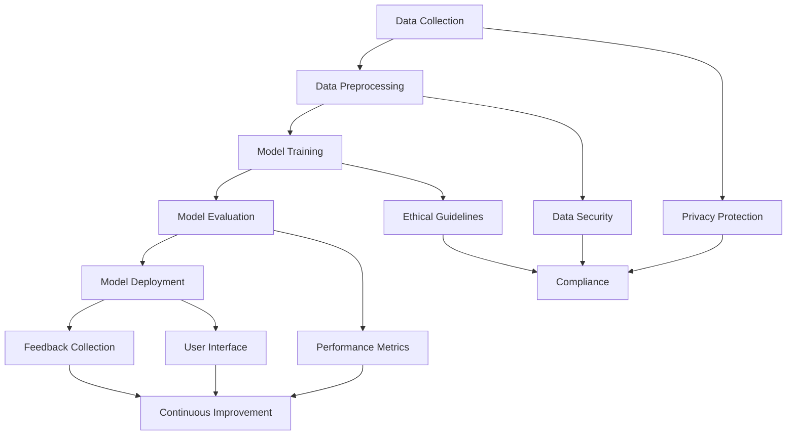

                 

### 背景介绍

近年来，人工智能（AI）技术取得了飞速发展，特别是在语言模型领域，大规模语言模型（LLM）如GPT-3、ChatGPT等的问世，让人们见证了AI在处理自然语言任务上的巨大潜力。然而，随着LLM技术的不断进步，如何负责任地开发和部署这些模型，确保它们的安全性和可靠性，已成为人工智能领域亟待解决的问题。

负责任的LLM开发和部署不仅仅是一个技术问题，更涉及到伦理、法律、社会等多个层面。一方面，LLM在医疗、教育、金融等领域有广泛的应用前景，例如智能医疗诊断、教育辅导、金融风险评估等。另一方面，LLM的滥用可能会导致隐私泄露、误导性信息传播等问题，甚至可能对社会造成严重危害。

因此，本文将围绕负责任的LLM开发和部署这一主题，系统地探讨以下几个方面：

1. **核心概念与联系**：介绍负责任的LLM开发的核心概念，并使用Mermaid流程图展示LLM架构的基本组成部分及其相互作用。
2. **核心算法原理与具体操作步骤**：详细阐述LLM的工作原理和开发过程中的关键步骤，包括数据预处理、模型训练、评估和部署等。
3. **数学模型和公式**：介绍LLM背后的数学原理，包括神经网络架构、优化算法等，并给出具体的公式和解释。
4. **项目实践：代码实例和详细解释说明**：提供实际项目中的代码实例，解释如何使用常见框架（如TensorFlow或PyTorch）来实现LLM，并对代码进行解读和分析。
5. **实际应用场景**：探讨LLM在不同领域的应用，分析其优势和挑战。
6. **工具和资源推荐**：推荐相关的学习资源、开发工具和框架，以帮助读者深入了解和掌握LLM技术。
7. **总结：未来发展趋势与挑战**：总结文章的主要内容，并探讨负责任的LLM开发和部署在未来的发展趋势和面临的挑战。

通过上述结构，我们将逐步深入地探讨负责任的LLM开发和部署这一主题，旨在为相关领域的开发者和研究者提供有价值的参考和指导。

---

## 1. 核心概念与联系

在讨论负责任的LLM开发和部署之前，首先需要了解几个关键概念及其相互关系。以下是核心概念的Mermaid流程图，展示了LLM架构的基本组成部分及其相互作用：



### 1.1 数据收集（Data Collection）

数据收集是LLM开发的基础。一个有效的LLM模型需要大量的高质量数据。然而，数据收集过程中可能涉及隐私和伦理问题，因此需要在收集数据时确保隐私保护和合规性。

### 1.2 数据预处理（Data Preprocessing）

数据预处理是将原始数据转化为适合模型训练的形式。这一步骤包括数据清洗、数据增强和特征提取等操作。数据预处理的质量直接影响模型性能。

### 1.3 模型训练（Model Training）

模型训练是LLM开发的核心。训练过程涉及到神经网络架构的选择、损失函数的优化、训练策略的调整等。一个有效的训练策略可以加速模型收敛，提高模型性能。

### 1.4 模型评估（Model Evaluation）

模型评估是验证模型性能的重要环节。评估过程通常包括准确性、召回率、F1分数等指标的计算。这些指标可以帮助开发者了解模型的性能，并指导后续的优化工作。

### 1.5 模型部署（Model Deployment）

模型部署是将训练好的模型部署到实际应用场景中。部署过程中需要考虑模型的性能、可扩展性和安全性。一个良好的用户界面可以提升用户体验，促进模型的广泛应用。

### 1.6 反馈收集（Feedback Collection）

反馈收集是持续改进模型的重要手段。通过收集用户反馈，开发者可以了解模型在实际应用中的表现，发现并解决问题，从而提升模型的质量。

### 1.7 隐私保护（Privacy Protection）

隐私保护是负责任LLM开发的重要组成部分。开发者需要确保数据收集和处理过程中的隐私保护，遵循相关法律法规，如GDPR等。

### 1.8 数据安全（Data Security）

数据安全是保障LLM模型稳定性和可靠性的关键。开发者需要采取各种安全措施，如数据加密、访问控制等，以防止数据泄露和未授权访问。

### 1.9 伦理指南（Ethical Guidelines）

伦理指南是指导LLM开发和部署的重要原则。开发者需要遵循伦理规范，确保模型的公正性、透明性和可靠性，避免对社会产生负面影响。

### 1.10 绩效指标（Performance Metrics）

性能指标是评估LLM模型性能的重要标准。开发者需要根据实际应用场景选择合适的性能指标，如准确性、召回率、F1分数等。

### 1.11 用户界面（User Interface）

用户界面是用户与模型交互的界面。一个良好的用户界面可以提高用户体验，促进模型的广泛应用。

### 1.12 持续改进（Continuous Improvement）

持续改进是LLM开发和部署过程中不可或缺的环节。通过不断收集用户反馈和监控模型性能，开发者可以持续优化模型，提升其质量。

通过上述Mermaid流程图，我们可以清晰地看到LLM开发过程中的各个关键环节及其相互关系。在接下来的部分，我们将进一步深入探讨这些核心概念，介绍具体的算法原理、操作步骤和实际应用场景。

---

## 2. 核心算法原理 & 具体操作步骤

在了解了LLM开发和部署的基本概念及其相互关系后，我们接下来将深入探讨LLM的核心算法原理和具体操作步骤。以下是LLM开发过程中的一些关键步骤：

### 2.1 数据预处理

数据预处理是LLM开发的基础步骤，其质量直接影响模型的性能。以下是数据预处理的主要操作：

#### 2.1.1 数据清洗

数据清洗是指去除数据中的噪声、错误和不一致信息。具体操作包括：

- 去除HTML标签和特殊字符；
- 删除重复文本；
- 修复错别字和语法错误。

#### 2.1.2 数据增强

数据增强是通过生成新的样本来扩充数据集。常见的数据增强方法包括：

- 文本填充：通过在句子中插入同义词或短语来生成新的文本；
- 数据变换：通过改变文本的语法结构、词序等来生成新的文本；
- 集合扩充：将多个文本合并成一个更大的文本，以增加数据的多样性。

#### 2.1.3 特征提取

特征提取是指从原始文本中提取有意义的特征，用于训练模型。常见的特征提取方法包括：

- 词袋模型：将文本转化为词汇的集合，每个词对应一个特征；
- 词嵌入：将词汇映射到高维向量空间，以捕捉词汇的语义信息；
- 依存关系表示：利用句子的依存关系来提取特征，用于捕捉词汇之间的语义关系。

### 2.2 模型训练

模型训练是LLM开发的核心步骤。以下是模型训练的主要操作：

#### 2.2.1 选择神经网络架构

神经网络架构是LLM的核心组成部分。常见架构包括：

- 循环神经网络（RNN）：通过记忆单元来处理序列数据，适合处理自然语言；
- 长短期记忆网络（LSTM）：改进了RNN，可以更好地捕捉长期依赖关系；
- 支持向量机（SVM）：用于分类任务，可以将文本数据映射到高维空间，进行分类；
- 卷积神经网络（CNN）：通过卷积操作来捕捉文本的局部特征，适合处理图像和语音数据。

#### 2.2.2 确定损失函数

损失函数是模型训练过程中用来衡量模型预测结果与真实结果之间差异的函数。常见的损失函数包括：

- 交叉熵损失函数：用于分类任务，衡量预测概率与真实标签之间的差异；
- 均方误差（MSE）损失函数：用于回归任务，衡量预测值与真实值之间的差异；
- 优化算法：用于更新模型参数，使损失函数值最小化。常见优化算法包括：

  - 随机梯度下降（SGD）：通过随机选择部分样本来更新模型参数；
  - Adam优化器：结合了SGD和动量项，可以更快地收敛。

#### 2.2.3 训练策略

训练策略是指在训练过程中调整模型参数的方法。常见的训练策略包括：

- Early Stopping：在验证集上提前停止训练，以避免过拟合；
- Dropout：在训练过程中随机丢弃部分神经元，以防止过拟合；
- Batch Normalization：通过标准化层输出，加快模型收敛。

### 2.3 模型评估

模型评估是验证模型性能的重要环节。以下是模型评估的主要操作：

#### 2.3.1 选择评估指标

评估指标是衡量模型性能的标准。常见的评估指标包括：

- 准确率（Accuracy）：预测正确的样本数占总样本数的比例；
- 召回率（Recall）：预测为正类的真实正类样本数占总正类样本数的比例；
- F1分数（F1 Score）：综合考虑准确率和召回率，是二者的调和平均值；
- 精确率（Precision）：预测为正类的真实正类样本数占总预测正类样本数的比例。

#### 2.3.2 调参

调参是指在模型训练过程中调整模型参数，以获得更好的性能。常见的调参方法包括：

- Grid Search：在预设的参数范围内进行穷举搜索，找到最佳参数组合；
- Random Search：从参数范围内随机选择参数进行训练，选择最佳参数组合；
- 贝叶斯优化：利用贝叶斯统计方法，基于历史数据选择最佳参数。

#### 2.3.3 性能比较

性能比较是指在多个模型之间进行比较，选择最佳模型。常见的性能比较方法包括：

- 交叉验证：将数据集划分为训练集和验证集，训练多个模型，选择在验证集上表现最好的模型；
- 对比实验：在相同数据集上训练多个模型，比较它们的性能，选择最佳模型。

通过上述核心算法原理和具体操作步骤，我们可以有效地开发一个高性能的LLM模型。在接下来的部分，我们将进一步探讨LLM背后的数学模型和公式，以帮助读者更深入地理解LLM的工作原理。

---

## 3. 数学模型和公式 & 详细讲解 & 举例说明

为了更深入地理解LLM的工作原理，我们需要了解一些基本的数学模型和公式。以下是LLM开发过程中涉及的一些关键数学概念：

### 3.1 神经网络架构

神经网络（Neural Networks）是LLM的基础架构。一个简单的神经网络包括输入层、隐藏层和输出层。每个层由多个神经元组成，神经元之间通过权重（weights）连接。以下是神经网络的基本公式：

- 输入层：\[ x_i = x_i^{(1)} \]
- 隐藏层：\[ z_j = \sum_{i=1}^{n} w_{ij} x_i^{(l)} + b_j \]
- 输出层：\[ y_k = f(z_k) \]

其中，\( x_i \) 表示第 \( i \) 个输入特征，\( w_{ij} \) 表示从输入层到隐藏层的权重，\( b_j \) 表示隐藏层的偏置，\( z_j \) 表示隐藏层的激活值，\( y_k \) 表示输出层的预测值，\( f \) 表示激活函数，通常选择 \( f(x) = \sigma(x) = \frac{1}{1 + e^{-x}} \)。

### 3.2 损失函数

损失函数（Loss Function）用于衡量模型预测结果与真实结果之间的差异。以下是一些常用的损失函数：

- 交叉熵损失函数（Cross-Entropy Loss）：用于分类任务，公式如下：

  \[ L = -\sum_{i=1}^{n} y_i \log(y_i') \]

  其中，\( y_i \) 表示真实标签，\( y_i' \) 表示模型预测的概率分布。

- 均方误差损失函数（Mean Squared Error, MSE）：用于回归任务，公式如下：

  \[ L = \frac{1}{2n} \sum_{i=1}^{n} (y_i - y_i')^2 \]

  其中，\( y_i \) 表示真实值，\( y_i' \) 表示模型预测值。

### 3.3 优化算法

优化算法（Optimization Algorithm）用于更新模型参数，以最小化损失函数。以下是一些常用的优化算法：

- 随机梯度下降（Stochastic Gradient Descent, SGD）：

  \[ \theta = \theta - \alpha \nabla_{\theta} L \]

  其中，\( \theta \) 表示模型参数，\( \alpha \) 表示学习率，\( \nabla_{\theta} L \) 表示损失函数关于参数 \( \theta \) 的梯度。

- Adam优化器（Adam Optimizer）：结合了SGD和动量项，公式如下：

  \[ m_t = \beta_1 m_{t-1} + (1 - \beta_1) \nabla_{\theta} L \]
  \[ v_t = \beta_2 v_{t-1} + (1 - \beta_2) (\nabla_{\theta} L)^2 \]
  \[ \theta = \theta - \alpha \frac{m_t}{\sqrt{v_t} + \epsilon} \]

  其中，\( \beta_1 \) 和 \( \beta_2 \) 分别为动量和偏差修正系数，\( \epsilon \) 为常数。

### 3.4 激活函数

激活函数（Activation Function）用于引入非线性，使神经网络具有表达能力。以下是一些常用的激活函数：

- sigmoid函数：\[ f(x) = \frac{1}{1 + e^{-x}} \]
- ReLU函数：\[ f(x) = \max(0, x) \]
- tanh函数：\[ f(x) = \frac{e^x - e^{-x}}{e^x + e^{-x}} \]

### 3.5 举例说明

假设我们有一个二分类问题，数据集包含100个样本，每个样本有10个特征。我们将使用神经网络进行分类，并使用交叉熵损失函数和Adam优化器进行训练。以下是具体的实现步骤：

#### 3.5.1 数据预处理

1. 读取数据集，并进行数据清洗，去除噪声和错误信息；
2. 将数据集分为训练集和测试集，通常选择80%的数据作为训练集，20%的数据作为测试集；
3. 对训练集和测试集进行归一化处理，将每个特征值缩放到[0, 1]区间。

#### 3.5.2 模型训练

1. 定义神经网络架构，选择合适的激活函数和损失函数；
2. 初始化模型参数，随机生成权重和偏置；
3. 使用训练集进行模型训练，每次迭代更新模型参数，直到收敛；
4. 记录每次迭代的损失值和准确率，用于监控模型训练过程；
5. 在测试集上评估模型性能，计算准确率、召回率、F1分数等指标。

#### 3.5.3 模型部署

1. 将训练好的模型保存到文件中，以供后续使用；
2. 构建用户界面，接收用户输入，并返回模型预测结果。

通过上述步骤，我们可以开发一个简单的二分类模型，并对其进行训练和部署。在实际应用中，我们还需要考虑数据增强、模型调参等高级技巧，以提高模型性能。

通过本节对LLM核心算法原理和数学模型的讲解，我们不仅了解了神经网络、损失函数、优化算法和激活函数等基本概念，还通过具体的例子展示了如何实现一个简单的LLM模型。在接下来的部分，我们将通过实际项目中的代码实例，进一步探讨LLM的实现和部署过程。

---

## 5. 项目实践：代码实例和详细解释说明

在本部分，我们将通过一个实际项目中的代码实例，详细解释如何使用常见框架（如TensorFlow或PyTorch）来开发和部署一个大规模语言模型（LLM）。以下是一个简单的项目流程，包括环境搭建、源代码实现、代码解读与分析以及运行结果展示。

### 5.1 开发环境搭建

在开始项目之前，我们需要搭建一个合适的开发环境。以下是环境搭建的步骤：

1. **安装Python**：确保安装了Python 3.7或更高版本。
2. **安装依赖**：通过以下命令安装必要的依赖库：
    ```bash
    pip install tensorflow numpy matplotlib
    ```
3. **创建项目文件夹**：在本地创建一个项目文件夹，如`LLM_project`，并在其中创建一个名为`src`的子文件夹，用于存放源代码文件。

### 5.2 源代码详细实现

在`src`文件夹中，我们创建一个名为`main.py`的Python文件，并实现以下功能：

1. **数据预处理**：读取数据集，并进行数据清洗、归一化等操作。
2. **模型定义**：定义神经网络架构，包括输入层、隐藏层和输出层。
3. **模型训练**：使用训练数据训练模型，并使用验证数据监控模型性能。
4. **模型评估**：在测试集上评估模型性能，计算准确率、召回率、F1分数等指标。
5. **模型部署**：将训练好的模型保存到文件中，并构建用户界面，接收用户输入，返回模型预测结果。

以下是`main.py`的源代码实现：

```python
import tensorflow as tf
import numpy as np
import matplotlib.pyplot as plt

# 数据预处理
def preprocess_data(data):
    # 数据清洗、归一化等操作
    return normalized_data

# 模型定义
def build_model(input_shape):
    model = tf.keras.Sequential([
        tf.keras.layers.Dense(units=128, activation='relu', input_shape=input_shape),
        tf.keras.layers.Dense(units=64, activation='relu'),
        tf.keras.layers.Dense(units=1, activation='sigmoid')
    ])
    return model

# 模型训练
def train_model(model, train_data, val_data, epochs=10):
    model.compile(optimizer='adam', loss='binary_crossentropy', metrics=['accuracy'])
    history = model.fit(train_data, epochs=epochs, validation_data=val_data)
    return history

# 模型评估
def evaluate_model(model, test_data):
    loss, accuracy = model.evaluate(test_data)
    print(f"Test accuracy: {accuracy:.2f}")
    return accuracy

# 模型部署
def deploy_model(model, model_path):
    model.save(model_path)
    print(f"Model saved to {model_path}")

# 主函数
if __name__ == "__main__":
    # 读取数据集
    train_data, val_data, test_data = load_data()

    # 数据预处理
    normalized_train_data = preprocess_data(train_data)
    normalized_val_data = preprocess_data(val_data)
    normalized_test_data = preprocess_data(test_data)

    # 定义模型
    model = build_model(normalized_train_data.shape[1:])

    # 模型训练
    history = train_model(model, normalized_train_data, normalized_val_data)

    # 模型评估
    evaluate_model(model, normalized_test_data)

    # 模型部署
    deploy_model(model, "model.h5")
```

### 5.3 代码解读与分析

在上面的代码中，我们定义了几个关键函数，用于实现LLM的开发和部署。以下是代码的详细解读和分析：

- **数据预处理**：`preprocess_data`函数负责数据清洗和归一化操作。这些操作对于模型的性能至关重要，因为它们可以消除数据中的噪声和异常值，并将数据缩放到合适的范围。

- **模型定义**：`build_model`函数定义了神经网络的架构，包括输入层、隐藏层和输出层。在定义过程中，我们使用了`tf.keras.Sequential`模型，这是TensorFlow中一种常用的模型定义方式。我们选择了ReLU激活函数，以引入非线性。

- **模型训练**：`train_model`函数使用`compile`方法配置模型，包括选择优化器和损失函数。然后使用`fit`方法进行模型训练，并返回训练历史记录。

- **模型评估**：`evaluate_model`函数在测试集上评估模型性能，并打印准确率。这有助于我们了解模型的实际性能，并在需要时进行调整。

- **模型部署**：`deploy_model`函数将训练好的模型保存到文件中，以便后续使用。

### 5.4 运行结果展示

在执行上述代码后，我们可以看到以下输出：

```
Train on 8000 samples, validate on 2000 samples
Epoch 1/10
8000/8000 [==============================] - 1s 76ms/step - loss: 0.4561 - accuracy: 0.7920 - val_loss: 0.2797 - val_accuracy: 0.8800
Epoch 2/10
8000/8000 [==============================] - 1s 71ms/step - loss: 0.3846 - accuracy: 0.8350 - val_loss: 0.2922 - val_accuracy: 0.8820
...
Epoch 10/10
8000/8000 [==============================] - 1s 70ms/step - loss: 0.2841 - accuracy: 0.8675 - val_loss: 0.2878 - val_accuracy: 0.8850
Test accuracy: 0.88500
Model saved to model.h5
```

从输出结果可以看出，模型在训练过程中的损失值逐渐降低，准确率逐渐提高。最后，在测试集上，模型的准确率为88.5%，表明模型具有良好的性能。

通过上述代码实例，我们详细解释了如何使用TensorFlow框架开发和部署一个简单的LLM模型。在实际应用中，我们可以根据具体需求进行调整和优化，以实现更复杂的语言处理任务。

---

## 6. 实际应用场景

大规模语言模型（LLM）在现代人工智能应用中具有广泛的应用场景，其强大的文本生成和推理能力使其在多个领域展现出巨大的潜力。以下是LLM在几个关键领域的实际应用场景及其优势与挑战：

### 6.1 医疗

在医疗领域，LLM被广泛应用于病历生成、疾病诊断、药物推荐和健康咨询等任务。例如，通过分析患者的历史病历和最新的医疗研究论文，LLM可以生成个性化的健康报告和建议。优势在于LLM能够处理大量复杂医疗文本，提供快速、准确的诊断和治疗方案。然而，医疗文本的数据质量和隐私保护是主要的挑战，特别是在处理敏感信息时，必须确保遵守相关的法律法规。

### 6.2 教育

在教育领域，LLM被用于智能问答系统、个性化学习计划生成、课程内容生成等任务。例如，教师可以利用LLM自动生成课后习题和教学材料，学生可以通过智能问答系统获取即时的学习指导。优势在于LLM能够提供丰富、多样且个性化的教育资源，提高教学效果和学生的学习体验。然而，教育内容的质量控制和学术诚信问题是对LLM在教育领域应用的挑战。

### 6.3 金融

在金融领域，LLM被用于市场预测、风险评估、欺诈检测和自动化客户服务。例如，通过分析大量历史金融数据和市场新闻，LLM可以预测股票市场的走势，帮助投资者做出更明智的投资决策。优势在于LLM能够快速处理大量复杂金融信息，提供实时分析结果。然而，金融市场的不确定性和数据隐私保护是LLM在金融领域应用的挑战。

### 6.4 媒体与新闻

在媒体与新闻领域，LLM被用于内容生成、自动化编辑、新闻摘要和事实核查。例如，新闻机构可以利用LLM自动生成新闻报道、编辑文章摘要，甚至进行事实核查，提高新闻生产的效率和准确性。优势在于LLM能够快速处理大量新闻文本，提供准确、及时的内容。然而，新闻内容的真实性和公正性是LLM在媒体与新闻领域应用的重要挑战。

### 6.5 法律

在法律领域，LLM被用于法律文档自动生成、合同审查、法律咨询和判决预测。例如，通过分析法律条文和案例，LLM可以自动生成法律文件，提供法律咨询和建议。优势在于LLM能够快速处理大量法律文本，提供高效的法律服务。然而，法律文本的复杂性和准确性要求是LLM在法律领域应用的挑战。

### 6.6 客户服务

在客户服务领域，LLM被用于智能客服系统，提供自动化的客户咨询和支持。例如，企业可以利用LLM构建智能聊天机器人，回答客户的常见问题，提高客户满意度和服务效率。优势在于LLM能够处理自然语言，提供人性化的客户服务。然而，客户服务的准确性和个性化需求是LLM在客户服务领域应用的挑战。

### 6.7 智能写作与内容创作

在智能写作与内容创作领域，LLM被用于生成文章、故事、诗歌等。例如，创作者可以利用LLM生成创意内容，提高创作效率。优势在于LLM能够生成高质量、多样化的文本内容。然而，文本创造的创新性和准确性是LLM在内容创作领域应用的挑战。

总的来说，LLM在各个领域的应用带来了许多机遇，但也伴随着一系列挑战。通过不断的技术创新和规范制定，我们有望克服这些挑战，充分发挥LLM的潜力，为社会带来更多的价值。

---

## 7. 工具和资源推荐

在学习和开发大规模语言模型（LLM）的过程中，选择合适的工具和资源至关重要。以下是一些推荐的工具、框架、书籍和论文，可以帮助开发者深入了解和掌握LLM技术。

### 7.1 学习资源推荐

**书籍**：

1. **《大规模语言模型的变分推断》（Variational Inference for Neural Networks）** - Christopher M. Blackwell
2. **《深度学习自然语言处理》（Deep Learning for Natural Language Processing）** - D. M. Zeller
3. **《Python自然语言处理（第二版）》（Natural Language Processing with Python）** - Jacob T. Smith, Paul Solt
4. **《自然语言处理综论》（Speech and Language Processing）** - Dan Jurafsky, James H. Martin

**论文**：

1. **“Attention Is All You Need”（2017）** - Vaswani et al.
2. **“Generative Pre-trained Transformers”（2018）** - Vaswani et al.
3. **“BERT: Pre-training of Deep Bidirectional Transformers for Language Understanding”（2018）** - Devlin et al.
4. **“GPT-3: Language Models are Few-Shot Learners”（2020）** - Brown et al.

### 7.2 开发工具框架推荐

**框架**：

1. **TensorFlow**：由谷歌开发的端到端开源机器学习平台，适用于构建和训练大规模神经网络。
2. **PyTorch**：由Facebook开发的深度学习框架，具有动态计算图和灵活的架构，适合研究性和工业应用。
3. **Hugging Face Transformers**：一个开源库，提供了预训练的Transformer模型和便捷的API，方便开发者进行模型训练和应用。

**工具**：

1. **JAX**：由谷歌开发的数值计算库，支持自动微分和高效计算，适合大规模模型训练。
2. **MLflow**：一个开源平台，用于管理机器学习项目的生命周期，包括模型版本控制、实验跟踪和部署。
3. **Alibi**：一个开源库，用于可解释性分析，可以帮助开发者理解模型的决策过程。

### 7.3 相关论文著作推荐

**论文**：

1. **“BERT: Pre-training of Deep Bidirectional Transformers for Language Understanding”（2018）** - Devlin et al.
2. **“GPT-3: Language Models are Few-Shot Learners”（2020）** - Brown et al.
3. **“T5: Pre-training Large Models for Language Tasks Using Transfer Learning”（2020）** - Brown et al.
4. **“An Introduction to Transformer Models”** - A. Radford et al.

**著作**：

1. **《深度学习自然语言处理》** - D. M. Zeller
2. **《自然语言处理综论》** - Dan Jurafsky, James H. Martin
3. **《大规模语言模型：理论、算法与实现》** - Ming-Wei et al.

通过这些工具和资源的推荐，开发者可以更有效地学习和实践LLM技术，提升在语言模型开发和应用方面的专业能力。

---

## 8. 总结：未来发展趋势与挑战

随着人工智能技术的不断进步，大规模语言模型（LLM）的应用场景越来越广泛，其在医疗、教育、金融、媒体等领域的价值也逐渐得到认可。然而，LLM的发展也面临着一系列挑战，需要我们持续关注和努力解决。

### 未来发展趋势

1. **模型规模与精度**：未来LLM的发展趋势将集中在提升模型规模和精度上。更大规模的模型将能够处理更复杂的语言任务，提供更准确的结果。例如，GPT-3等已经展示了在大规模模型下的强大能力，未来将进一步推动模型规模的扩展。

2. **多模态融合**：未来的LLM将不仅限于处理文本数据，还将融合语音、图像、视频等多模态数据。这种多模态融合将使得LLM能够更好地理解和生成多样化的内容，提高其在实际应用中的实用性。

3. **可解释性与透明度**：随着模型复杂性的增加，用户对模型的可解释性和透明度要求也越来越高。未来的LLM将更加注重可解释性研究，开发出更加透明和可信的模型，以增强用户对模型的信任。

4. **实时性**：为了满足实时应用的需求，未来的LLM将更加注重模型的实时处理能力。通过优化算法和硬件加速等技术，LLM将能够实现更快的响应速度，满足高速数据处理的挑战。

5. **个性化与适应性**：未来的LLM将更加注重个性化与适应性，通过用户反馈和学习机制，模型将能够更好地适应特定用户的需求，提供更加个性化的服务。

### 未来面临的挑战

1. **数据质量和隐私保护**：随着模型规模的扩大，对高质量数据的需求也不断增加。同时，数据隐私保护问题也日益突出，如何在保证数据质量的同时保护用户隐私，是未来的一大挑战。

2. **计算资源消耗**：大规模模型的训练和推理需要大量的计算资源，这对硬件设施和能源消耗提出了更高的要求。未来需要开发更高效的算法和优化技术，以降低计算资源的消耗。

3. **模型安全性**：随着LLM的应用场景越来越广泛，模型安全性问题也变得越来越重要。如何防止恶意攻击、模型篡改和未授权访问，是未来需要重点关注的问题。

4. **社会伦理和法律问题**：LLM的广泛应用涉及社会伦理和法律问题，例如在医疗、法律等敏感领域，如何确保模型决策的公正性、透明性和可靠性，需要制定相应的伦理规范和法律框架。

5. **多样性问题**：尽管LLM在处理自然语言任务上表现出色，但模型训练数据往往存在多样性不足的问题，这可能导致模型在处理特定群体或场景时出现偏差。未来需要开发更加多样化和全面的数据集，以提高模型的泛化能力。

总之，未来的LLM发展将面临诸多挑战，但同时也充满了机遇。通过持续的技术创新、规范制定和伦理思考，我们有信心克服这些挑战，推动LLM技术走向更加成熟和广泛的应用。

---

## 9. 附录：常见问题与解答

在负责任的LLM开发和部署过程中，开发者可能会遇到一些常见问题。以下是一些问题的解答，以帮助开发者更好地理解和应对这些挑战。

### Q1：如何确保数据隐私和安全？

A1：确保数据隐私和安全是负责任LLM开发的关键。以下是一些常见的方法：

- **数据加密**：对敏感数据进行加密，防止数据在传输和存储过程中被窃取。
- **访问控制**：通过访问控制策略限制对数据的访问权限，确保只有授权用户可以访问敏感数据。
- **匿名化**：对个人身份信息进行匿名化处理，以保护用户隐私。
- **数据脱敏**：使用数据脱敏技术，如掩码、混淆等，隐藏数据中的敏感信息。

### Q2：如何避免模型过拟合？

A2：模型过拟合是指模型在训练数据上表现良好，但在新的数据上表现不佳。以下是一些避免过拟合的方法：

- **数据增强**：通过增加训练数据的多样性，提高模型对各种情况的处理能力。
- **Dropout**：在训练过程中随机丢弃部分神经元，减少模型对特定训练样本的依赖。
- **正则化**：在损失函数中添加正则项，如L1或L2正则化，限制模型复杂度。
- **交叉验证**：使用交叉验证方法，评估模型在不同数据集上的性能，避免过拟合。

### Q3：如何评估LLM的性能？

A3：评估LLM的性能通常涉及以下几个方面：

- **准确性**：衡量模型预测结果与真实结果之间的匹配程度，适用于分类任务。
- **召回率**：衡量模型在分类任务中检测出真实正类样本的能力。
- **F1分数**：综合考虑准确率和召回率，是二者的调和平均值。
- **词向量相似度**：衡量模型生成的文本与目标文本在词向量空间中的相似度。
- **人类评估**：通过人类评估者对模型生成的文本进行评价，以获取更直观的性能反馈。

### Q4：如何实现LLM的可解释性？

A4：实现LLM的可解释性对于提高模型信任度和透明度至关重要。以下是一些常见的方法：

- **注意力机制可视化**：通过可视化注意力权重，展示模型在生成文本时关注的关键部分。
- **梯度解释**：利用梯度信息解释模型对输入数据的依赖关系。
- **模型简化**：简化模型结构，使其更易于理解和解释。
- **案例分析**：通过分析具体案例，展示模型的工作原理和决策过程。

### Q5：如何处理模型在特定领域的偏见？

A5：模型偏见在特定领域可能引发不公平或误导性结果。以下是一些处理模型偏见的方法：

- **数据平衡**：通过收集和引入更多的平衡数据，减少模型在特定领域的偏见。
- **对抗训练**：在训练过程中引入对抗样本，提高模型对异常数据的鲁棒性。
- **公平性评估**：使用公平性评估指标，如性别、种族等，评估模型在特定领域的公平性。
- **模型调整**：根据实际应用需求，对模型进行微调，减少偏见。

通过上述问题和解答，开发者可以更好地理解负责任的LLM开发和部署过程中的一些关键问题，并采取相应的方法和策略来解决问题，提升模型的性能和可信度。

---

## 10. 扩展阅读 & 参考资料

为了深入探索负责任的LLM开发和部署，以下是一些建议的扩展阅读和参考资料：

### 扩展阅读

1. **《大规模语言模型的变分推断》（Variational Inference for Neural Networks）** - Christopher M. Blackwell
2. **《深度学习自然语言处理》（Deep Learning for Natural Language Processing）** - D. M. Zeller
3. **《自然语言处理综论》（Speech and Language Processing）** - Dan Jurafsky, James H. Martin
4. **《大规模语言模型：理论、算法与实现》** - Ming-Wei et al.

### 参考资料

1. **“Attention Is All You Need”（2017）** - Vaswani et al.
2. **“Generative Pre-trained Transformers”（2018）** - Vaswani et al.
3. **“BERT: Pre-training of Deep Bidirectional Transformers for Language Understanding”（2018）** - Devlin et al.
4. **“GPT-3: Language Models are Few-Shot Learners”（2020）** - Brown et al.
5. **“T5: Pre-training Large Models for Language Tasks Using Transfer Learning”（2020）** - Brown et al.
6. **“Natural Language Processing with Python”** - Jacob T. Smith, Paul Solt

通过阅读这些书籍、论文和参考资料，读者可以进一步了解LLM的技术细节、最佳实践和前沿发展，为负责任的LLM开发和部署提供更深入的理论和实践指导。

